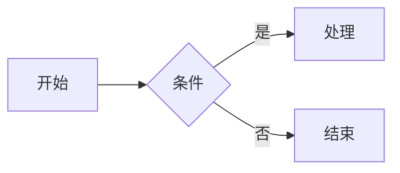

# CLAUDE.md

## 仓库简介

**陆国松的编程笔记**（programming-notes）是一个多语言、多模块的学习笔记集合，包含：

- **文档站点**：基于 [zensical](https://zensical.org/) 构建的静态文档站点，内容在 `docs/` 目录
- **书籍配套代码**：Spring Security / OAuth2 / Spring Authorization Server 等独立模块，在 `code/document-translation/` 下按书籍章节组织（含 Java Maven 和 Node.js 项目）
- **前端示例代码**：React + Vite 独立小项目，在 `code/frontend/` 下按主题组织

## 常用命令

### 本地基础环境（Docker Compose）

基础环境配置位于 `environment/docker-compose.yml`，包含 MySQL、Redis、RabbitMQ、Nacos。

```shell
# 启动所有服务（后台运行）
docker compose -f environment/docker-compose.yml up -d

# 查看服务状态
docker compose -f environment/docker-compose.yml ps

# 停止并保留数据
docker compose -f environment/docker-compose.yml down

# 停止并清除数据卷（慎用）
docker compose -f environment/docker-compose.yml down -v
```

各服务连接信息：

| 服务 | 地址 | 账号 / 密码 |
|------|------|------------|
| MySQL 8.0 | `localhost:23306` | `root` / `12345678` |
| Redis 7 | `localhost:26379` | 无密码 |
| RabbitMQ 3 | `localhost:25672`（AMQP）<br>`http://localhost:35672`（管理台） | `guest` / `guest` |
| Nacos 2.3 | `http://localhost:28848/nacos` | `nacos` / `nacos` |

> 数据持久化目录：`environment/data/`（已加入 `.gitignore`，不提交）

### 文档站点（zensical）

```shell
# 安装 zensical（首次使用）
pip install zensical

# 本地预览站点（默认 http://localhost:7000）
zensical serve

# 编译为静态网页（输出到 site/）
zensical build
```

### Java / Spring Boot 示例

每个示例是独立的 Maven 模块（Java 17，Spring Boot 3.5.0），进入对应目录后执行：

```shell
# 构建
mvn clean package

# 运行所有测试
mvn test

# 运行单个测试类
mvn test -Dtest=ClassName

# 运行单个测试方法
mvn test -Dtest=ClassName#methodName

# 启动 Spring Boot 应用
mvn spring-boot:run
```

### 前端 React 示例

每个示例是独立的 Vite 项目，进入对应目录后执行：

```shell
# 安装依赖
npm install

# 开发模式启动
npm run dev

# 生产构建
npm run build
```

## 架构说明

### 整体目录结构

```
programming-notes/
├── docs/                    # 文档内容（Markdown），站点导航由 zensical.toml 的 nav 配置控制
│   ├── custom/              # 自定义资源（不参与 nav 路由）
│   │   ├── css/             # 自定义样式（custom.css、font.css、sidebar-width.css 等）
│   │   └── js/              # 自定义脚本（mathjax.js、viewer-js-init.js 等）
│   ├── assert/              # 静态资源（logo、favicon 等）
│   ├── frontend/            # 前端相关笔记（React、路由、状态管理）
│   ├── java/                # Java 笔记
│   ├── document-translation/# 书籍翻译（Spring Security、OAuth2、算法等）
│   ├── math/                # 数学笔记
│   ├── english/             # 英语笔记
│   ├── roadmap/             # 学习路线
│   ├── superpowers/         # 规划文档、设计文档（仅本地，已 .gitignore）
│   └── topic/               # 专题研究（含 Zensical 使用说明）
├── code/                    # 与笔记对应的示例代码
│   ├── java/                # Java 知识点演示（聚合 POM：code/java/pom.xml）
│   │   └── database/        # 数据库相关模块（聚合 POM：code/java/database/pom.xml）
│   │       ├── jdbc-connection/        # 连接管理演示
│   │       ├── jdbc-statement/         # Statement + ResultSet 演示
│   │       ├── jdbc-preparedstatement/ # PreparedStatement 演示
│   │       ├── jdbc-transaction-batch/ # 事务 + 批处理演示
│   │       ├── jdbc-pool/              # 连接池演示（HikariCP + Druid）
│   │       └── jdbc-metadata/          # 元数据演示
│   ├── document-translation/# 书籍配套示例（按书籍/章节组织）
│   │   ├── oauth2-in-action/            # OAuth 2 in Action（Node.js/Express，12 模块）
│   │   ├── spring-authorization-server-153/ # Spring Authorization Server 实战（Spring Boot 3.5.8）
│   │   └── spring-security-in-action2/  # Spring Security in Action 2nd（44 子模块）
│   └── frontend/            # 前端示例
│       └── react/           # React 示例
│           ├── basic/basic-syntax/react-basic-demo/     # 基础语法演示
│           └── global-state-management/mobx/mobx-demo/  # MobX 状态管理演示
├── environment/             # 本地开发基础环境
│   ├── docker-compose.yml   # 一键启动 MySQL/Redis/RabbitMQ/Nacos
│   ├── data/                # 各服务数据持久化目录（不提交 git）
│   └── init/                # 初始化脚本（如 MySQL 建库 SQL，按需放置）
│       └── mysql/           # MySQL 初始化 SQL（docker 启动时自动执行）
├── overrides/               # zensical 主题自定义覆盖文件（覆盖内置模板）
│   └── partials/            # 局部模板覆盖（如 hero.html、header.html 等）
├── site/                    # zensical build 的输出目录（勿手动修改）
└── zensical.toml            # 站点配置（导航、主题、Markdown 扩展）
```

### docs/ 与 code/ 的对应关系

`docs/` 中的每篇笔记通常对应 `code/` 中的示例代码。例如：
- `docs/document-translation/spring-security-in-action2/part1/02-hello/` ↔ `code/document-translation/spring-security-in-action2/ssia-ch2-ex1/`
- `docs/frontend/react/global-state-management/mobx/` ↔ `code/frontend/react/global-state-management/mobx/mobx-demo/`

### zensical 站点配置

站点配置集中在 `zensical.toml`：
- `docs_dir = "docs"` — 文档根目录
- `dev_addr = "localhost:7000"` — 本地开发地址
- `nav` — 完整导航树，新增页面需要在此注册
- `[project.markdown_extensions]` — 启用了数学公式（MathJax）、代码高亮、任务列表、选项卡等扩展

#### nav 注册格式速查

```toml
# 叶子页面（无子项）
{ "页面标题" = "分类/子目录/index.md" }

# 带子项的目录节点（第一项通常是该目录的 index.md）
{ "目录标题" = [
    "分类/index.md",
    { "子页面" = "分类/子目录/index.md" }
] }
```

**注意**：`docs/custom/`、`docs/assert/` 等资源目录无需注册 nav。

### Java 示例模块结构

`code/java/` 下采用两级聚合 POM 组织：

- **`code/java/pom.xml`** — 顶层聚合 POM，在 IntelliJ IDEA 中打开此文件可一次性导入全部 Java 子模块
- **`code/java/database/pom.xml`** — database 子聚合 POM，管理所有数据库相关演示模块

每个 Java 演示模块遵循标准 Maven 目录结构（Java 17，Spring Boot 3.5.0），以测试类为主体，**只包含与其主题相关的依赖**：
- 基础模块（connection / statement / preparedstatement / transaction-batch / metadata）：`H2` + `spring-boot-starter-test`
- `jdbc-pool`：额外添加 `HikariCP` + `Druid 1.2.23`

**新建子模块后**：必须在对应聚合 POM 的 `<modules>` 中添加模块目录名，否则 IDEA 不会感知新模块。

### Java 示例模块拆分原则

**一个模块只演示一个功能维度**，不要把多个不相关的技术点混在同一模块中。

- ✅ 正确：`jdbc-connection`（只放连接相关）、`jdbc-statement`（只放 Statement+ResultSet）
- ❌ 错误：`jdbc-demo`（把连接、查询、事务、连接池全部堆在一起）

模块名称应自描述功能边界（如 `jdbc-transaction-batch` 而非 `jdbc-advanced`）；测试类间无共享依赖时应拆分。

### 前端示例技术栈

- React 19.2 + Vite 7 + TypeScript
- UI 组件库：Ant Design 6 (antd)
- 状态管理示例：MobX 6 + mobx-react
- 路由：React Router 7（集成在各示例中，无独立路由示例项目）
- 无专项测试配置

## 新增内容规范

- 新增文档页面后，必须在 `zensical.toml` 的 `nav` 部分注册，否则页面不会出现在导航中
- `site/` 目录为构建产物，不应提交到版本库（已在 `.gitignore` 中）
- Java 知识点示例按功能主题拆分为独立子模块，新建子模块后需在对应聚合 POM（`code/java/pom.xml` 或 `code/java/database/pom.xml`）的 `<modules>` 中注册

### 文档目录规则（强制）

`docs/` 下所有 Markdown 页面均采用**独立文件夹形式**，即 `分类/文件夹名/index.md`，**禁止**直接创建 `分类/文件名.md` 平级文件。

- ✅ 正确：`docs/topic/oauth/core-concepts/index.md`
- ❌ 错误：`docs/topic/oauth/core-concepts.md`

此规则适用于 `docs/` 下所有自编笔记、专题研究、书籍翻译等所有内容，无例外。

### 文档内交叉引用规范

引用同一书籍其他章节时，**禁止"第X章"形式**，统一用「」括住章节标题名。章节标题以 `zensical.toml` 的 `nav` 配置为准。

| ✅ 正确 | ❌ 禁止 |
|--------|--------|
| 详见「配置CSRF防护」 | 详见第9章 |
| 参考「用户管理」中的介绍 | 参考第3章中的介绍 |
| 从「Spring Security 入门」开始学习 | 从第二章开始学习 |

### 导航图标约定

- **一级目录和二级目录的 `index.md` 在左侧导航中展示图标**，三级及以下不设置
- 图标通过 front matter `icon:` 字段设置，路径用 `/`（如 `lucide/database`、`fontawesome/brands/java`）
- 正文 Markdown 中使用图标短码时路径用 `-`（如 `:lucide-database:`）——两种写法不同，勿混淆

### 图片统一格式

带图注统一用 `<figure>` 格式（见下方语法速查），图片托管在 `https://cdn.jsdelivr.net/gh/luguosong/images@master/blog-img/`，图注格式为"图 章节号.图号 说明"。

### 行内强调与说明约定

- **强调 / 重点内容**：使用反引号 `` ` `` 包裹，而非加粗或斜体。例如：`RegisteredClient`、`Authorization Code`
- **补充说明**：在被说明内容后紧跟半角括号 `(说明文字)`。例如：JDBC（Java Database Connectivity）、H2（内存数据库）

| ✅ 正确 | ❌ 避免 |
|--------|--------|
| `Authorization Code` 是最常用的授权方式 | **Authorization Code** 是最常用的授权方式 |
| JDBC（Java Database Connectivity） | JDBC - Java Database Connectivity |

### 教学风格约束（仅自编笔记）

> 以下约束仅适用于 `docs/` 下非翻译类内容。翻译类内容（`docs/document-translation/`）忠于原书风格，不适用。

**核心目标**：让初学者能读懂、让高手觉得有收获。

**语言风格**：
- **类比优先**：用生活常识类比技术概念，再给出精确定义。如「JWT 就像一张盖了公章的纸条，任何人都能读，但伪造不了」
- **循序渐进**：先给「够用的版本」，再补充完整细节；先给最简示例，再演进到生产级写法
- **口语化且严谨**：可用「其实」「注意」「换句话说」，但技术术语必须准确
- **主动语态**：「Spring 会自动注入」> 「Bean 会被自动注入」
- **术语零门槛**：遇到专有名词先解释，不假设读者已掌握前置概念

**知识点结构**（每个 H3 按以下脉络展开）：
1. **是什么（What）** — 一句话定义，用最朴素的语言
2. **为什么（Why）** — 解释存在的意义 / 解决了什么问题
3. **怎么用（How）** — 实际代码或操作示例
4. **注意点（Pitfalls）** — 常见误区或边界情况（可选）

**代码示例**：
- 每个示例标注语言，关键行加注释
- 提供最小可运行版本，不堆砌无关配置
- 错误示例标注 `// ❌`，正确示例标注 `// ✅`
- 复杂示例前先用自然语言说明「这段代码做了什么」

**节奏控制**：
- 每个 H3 知识点控制在 5 分钟内可读完
- 每 2-3 个知识点后加小结或对比表格，帮助建立结构感
- 长文开头加「本文你会学到」的要点列表

**禁止**：
- 上来就贴大段代码没有任何解释
- 堆砌官方文档原文
- 「总之就是这样」式的虎头蛇尾
- 假设读者已经知道前置概念

### 标题架构规范（TOC 知识大纲化）

**核心原则**：标题层级 = 知识脉络。读者**只读右侧 TOC** 就能还原文章的推进逻辑，无需点击跳转。

#### 修改已有文章时的全局审视原则（强制）

对已有 TOC 结构的文章进行新增或修改时，**禁止简单地在某个位置插入内容**。必须：

1. 先通读当前文章的完整标题结构（即 TOC 大纲）
2. 评估新增/修改的内容在整体知识脉络中的位置
3. 必要时**重构章节结构**（调整 H2/H3 层级、合并或拆分小节、调整顺序），使修改后的 TOC 仍然保持渐进逻辑
4. 确保修改后的 TOC 从上到下依然是一条完整的知识路径，而非在某处突兀地插入了不协调的内容

> **豁免**：`docs/document-translation/` 下的文章属于原文翻译，标题结构应忠于原书，不适用本规范的重构要求。

#### H2 职责：划分知识维度

- 每个 H2 代表一个**独立的知识阶段**
- H2 从上到下应体现渐进逻辑，常见模式：
  - **教程型**：为什么 → 是什么 → 怎么做 → 进阶 → 最佳实践
  - **翻译型**：按原书章节顺序，但 H2 标题需补充语境（不能只写类名）
  - **参考型**：概述 → 按功能分组 → 配置 → 常见问题

#### H3 职责：拆分具体知识点

- 任何 H2 下涵盖 **≥3 个子概念**时，必须拆出 H3
- H3 在父级 H2 内同样遵循渐进顺序（如先「为什么」后「怎么做」）

#### 命名风格

| 场景 | 推荐 | 避免 |
|------|------|------|
| 引出概念 | `### 为什么需要连接池？` | `### 连接池概述` |
| 操作步骤 | `### 手动事务提交` | `### 事务（二）` |
| 并列子项 | `### Access Token`（父级 H2 已提供上下文 `## 令牌体系`） | `## Access Token`（孤立术语作 H2） |
| 对比说明 | `### 连接池 vs 直连对比` | `### 对比` |
| 语法参考 | `### 根号 — \`sqrt{}\`` | `### 根号`（读者无法从标题回忆语法） |

#### 反模式检查表

| 反模式 | 症状 | 修正方式 |
|--------|------|----------|
| 扁平清单 | ≥5 个连续 H2 且无 H3 | 按逻辑分组，将同类 H2 降级为 H3 并补充分组 H2 |
| 孤立术语 | H2 标题为纯类名（如 `## RegisteredClient`） | 补充语境：`## RegisteredClient：客户端注册信息` |
| 万能标题 | `## 概述`、`## 其他`、`## 总结` 反复出现 | 用具体内容替换：`## JDBC 在技术栈中的位置` |
| 编号代替逻辑 | `## 第一步`、`## 第二步` | 用动作描述：`## 配置数据源`、`## 编写查询` |

#### 文章类型标题骨架模板

**教程型**（自编笔记、知识点演示）：

```
# 主题名
  ## 为什么需要 X / X 解决什么问题
  ## 核心概念
    ### 概念 A
    ### 概念 B
  ## 基础用法
    ### 最小示例
    ### 常用 API
  ## 进阶用法
    ### 场景一
    ### 场景二
  ## 最佳实践 / 常见陷阱
```

**翻译型**（书籍章节翻译）：

```
# 章节号. 章节标题
  ## 核心主题 A（对应原书小节，标题补充语境）
    ### 具体知识点 1
    ### 具体知识点 2
  ## 核心主题 B
    ### 具体知识点 3
  ## 总结（可选，简短回顾本章要点）
```

**参考型**（API / 组件文档）：

```
# 模块名
  ## 概述与适用场景
  ## 分组 A：XXX 类组件
    ### 组件 1：一句话说明
    ### 组件 2：一句话说明
  ## 分组 B：YYY 类组件
    ### 组件 3
  ## 配置参考
  ## 常见问题
```

## Zensical 特有 Markdown 语法速查

> 以下语法均为 Zensical/Material 扩展语法，标准 Markdown 不支持。

### 提醒框（Admonitions）

```markdown
!!! note "可选自定义标题"
    内容（缩进 4 空格）

??? tip "可折叠，默认收起"
    内容

???+ warning "可折叠，默认展开"
    内容

!!! info inline end "右侧浮动"
    内容
```

**类型关键字**：`note` `abstract` `info` `tip` `success` `question` `warning` `failure` `danger` `bug` `example` `quote`

### 内容选项卡（Content Tabs）

```markdown
=== "标签一"
    内容（可嵌套代码块、admonitions）

=== "标签二"
    ``` python
    print("hello")
    ```
```

### 代码块增强

> **规范**：带 `title=` 等属性时，` ``` ` 与语言标识符之间**必须有空格**，正确写法：`` ``` java title="..." ``，错误写法：`` ```java title="..." ``

````markdown
``` python title="文件名.py" linenums="1" hl_lines="2 3"
def foo():
    pass  # 高亮此行
```

```yaml
# (1)!
key: value
```
1. 代码注解文字（需启用 `content.code.annotate` feature）
````

行内语法高亮：`` `#!python range()` ``

嵌入外部文件片段：
```markdown
--8<-- "相对路径/文件名"
```

### 文本格式化扩展

| 效果 | 语法 |
| ---- | ---- |
| ==高亮== | `==文本==` |
| ^^下划线^^ | `^^文本^^` |
| ~~删除线~~ | `~~文本~~` |
| H~2~O 下标 | `H~2~O` |
| A^2^ 上标 | `A^2^` |
| ++ctrl+s++ 键位 | `++ctrl+s++` |

### 图标与 Emoji

```markdown
:smile:                              <!-- Twemoji emoji -->
:fontawesome-brands-github:          <!-- FontAwesome 图标 -->
:lucide-check:                       <!-- Lucide 图标 -->
:material-information:{ title="提示" }  <!-- 图标 + tooltip -->
:fontawesome-brands-youtube:{ .youtube }  <!-- 图标 + 自定义 CSS 类 -->
```

### 图片增强

```markdown
<!-- 带图注（项目统一格式） -->
<figure markdown="span">
  { loading=lazy }
  <figcaption>图 1.1 图注说明文字</figcaption>
</figure>

<!-- 简单图片（无图注） -->
{ loading=lazy }

<!-- 图片对齐 -->
{ align=left }
{ align=right }

<!-- 深色/浅色模式不同图片 -->


```

### 网格布局（Grids）

```markdown
<div class="grid cards" markdown>

- :lucide-book: **标题一**

    说明文字

- :lucide-code: **标题二**

    说明文字

</div>
```

### Front Matter

```markdown
---
title: 页面标题
description: 页面描述
icon: lucide/book
status: new      # 需在 zensical.toml extra.status 中定义
hide:
  - navigation   # 隐藏左侧导航
  - toc          # 隐藏右侧目录
---
```

### Mermaid 图表

> **注意**：Mermaid 渲染依赖 `zensical.toml` 中 `pymdownx.superfences` 的 `custom_fences` 配置，若缺失则代码块显示为纯文本。配置已就绪，勿删除。

````markdown

````

#### Mermaid 深色模式适配原理（重要经验）

**Zensical 的 Mermaid 渲染机制**：
- 框架通过 `mermaid.initialize({ themeCSS })` 将一套 CSS 注入 Mermaid
- 图表最终在 **Shadow DOM**（`mode: "closed"`）内渲染
- 外部 CSS 选择器**无法穿透** Shadow DOM，但 **CSS 变量可以继承进去**

**问题根因**：项目将 `--md-code-fg-color` 覆盖为蓝色 `#477cef`，而 Mermaid 的
`--md-mermaid-edge-color`、`--md-mermaid-label-fg-color` 等变量默认引用它，
导致深色模式下连线/文字均为低对比度的蓝色。

**解决方案**：在 `docs/custom/css/custom.css` 的 `[data-md-color-scheme="slate"]` 块中，
单独覆盖 `--md-mermaid-*` 变量为高对比度颜色（已配置，勿删除）：

```css
[data-md-color-scheme="slate"] {
    /* ... 其他变量 ... */

    /* Mermaid 深色模式适配 */
    --md-mermaid-edge-color:       #adbac7;
    --md-mermaid-label-fg-color:   #adbac7;
    --md-mermaid-node-fg-color:    #539bf5;
    --md-mermaid-label-bg-color:   #2d333b;
    /* Sequence 图专项覆盖 */
    --md-mermaid-sequence-actor-fg-color:     #adbac7;
    /* ... */
}
```

**Mermaid 图表样式生成规范**：

1. **禁止颜色填充**：节点一律使用 `fill:transparent`，不使用颜色填充背景，确保文字在各种模式下清晰可读
2. **通过边框颜色区分类别**：使用 `stroke` 颜色和粗细来区分不同类型的节点（如 LTS 版本用蓝色粗边框，普通版本用灰色细边框）
3. 使用 `classDef` 定义样式类，避免逐个节点重复写 `style` 指令
4. 使用 `style` 指令指定节点颜色时，必须同时指定 `stroke`，否则节点边框在深色模式下轮廓模糊

```markdown
classDef regular fill:transparent,stroke:#768390,color:#adbac7,stroke-width:1px
classDef lts fill:transparent,stroke:#539bf5,color:#adbac7,stroke-width:2px
class v1,v2,v3 regular
class v4,v6,v7,v8 lts
```

**⚠️ 禁止的错误方案**：
- ❌ 在 `extra_javascript` 中引入脚本调用 `mermaid.run()` 重新渲染——Shadow DOM 关闭后外部无法操作
- ❌ 在 `extra_javascript` 中调用 `mermaid.initialize({ theme: 'dark' })`——框架已完成初始化，不会重新渲染
- ✅ 唯一有效方式：通过 CSS 变量继承影响 Shadow DOM 内部样式
