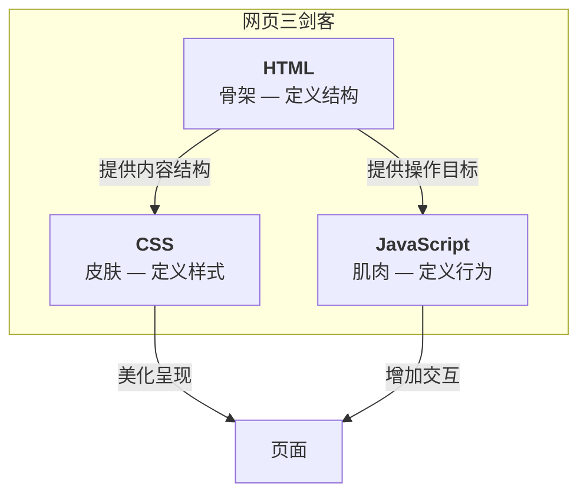

# HTML 基础

本文你会学到：

- 🎯 理解 HTML（HyperText Markup Language）是什么、以及它和 CSS、JavaScript 的关系
- 🔧 掌握 HTML 文档的基本结构：`DOCTYPE`、`html`、`head`、`body`
- 💡 学会使用 `meta` 标签设置字符编码和移动端适配
- 🚀 能够独立编写一个完整的 HTML 页面

## ⚡ 网页是怎么写出来的？——认识 HTML

`HTML`（HyperText Markup Language，超文本标记语言）是构建网页的标准语言。浏览器会读取 HTML 文件，然后把它渲染成你看到的网页。

那「超文本标记」到底是什么意思？

- `超文本`（Hypertext）：网页之间通过链接（hyperlink）相互跳转，形成一张网，而不是线性的纸张
- `标记`（Markup）：用「标签」（tag）来告诉浏览器哪些是标题、哪些是段落、哪些是图片

换句话说，HTML 本身只是一堆带角度括号的纯文本——真正让它「变成网页」的，是浏览器的解析和渲染能力。

!!! note "MDN"
    HTML 不是一门编程语言——它没有逻辑判断、循环、变量这些能力。它的唯一职责就是`描述内容的结构`：这段话是标题，那段话是段落，这里放一张图片。

### HTML 与 CSS、JavaScript 的关系

一个完整的网页通常由三种技术协作完成，它们各司其职：



用一个生活中的例子来理解：

| 技术 | 类比 | 职责 |
|------|------|------|
| HTML | 房子的**骨架** | 定义哪里是卧室、哪里是厨房、哪里是门窗 |
| CSS | 房子的**装修** | 决定墙壁刷什么颜色、地砖什么花纹、窗帘什么款式 |
| JavaScript | 房子的**电器** | 控制灯光开关、空调温度、智能门锁 |

> 💡 如果只写 HTML，网页能正常显示内容，但会非常朴素——就像一套没装修的毛坯房。

## 🏗️ HTML 文档结构

每个 HTML 文件都遵循一个固定的骨架结构。先看最简版本：

``` html title="hello.html"
<!DOCTYPE html>
<html lang="zh-CN">
<head>
    <meta charset="UTF-8">
    <title>我的第一个网页</title>
</head>
<body>
    你好，世界！
</body>
</html>
```

这段代码看起来内容不多，但每个部分都有明确的作用。接下来逐层拆解。

### DOCTYPE 声明

``` html
<!DOCTYPE html>
```

`DOCTYPE`（Document Type，文档类型）是 HTML 文件的第一行，告诉浏览器：「请用 HTML5 标准来解析这个文件。」

⚠️ 注意：`<!DOCTYPE html>` 不是 HTML 标签，而是一条`声明`。它没有闭合标签，也不区分大小写，但约定俗成全部大写。

为什么需要它？在 HTML5 之前，DOCTYPE 声明又长又复杂（指向一个 DTD 文件）。HTML5 大幅简化了它，现在只需要写 `<!DOCTYPE html>` 即可。

### 根元素与语言声明

``` html
<html lang="zh-CN">
```

`<html>` 是整个文档的`根元素`（root element），所有其他标签都必须嵌套在它内部。

`lang`（language）属性声明文档使用的语言：

| 值 | 语言 | 适用场景 |
|----|------|---------|
| `zh-CN` | 简体中文 | 中文网站 |
| `en` | 英语 | 英文网站 |
| `ja` | 日语 | 日文网站 |

!!! tip
    设置正确的 `lang` 有两个好处：① 浏览器会自动弹出正确的翻译提示；② 屏幕阅读器能以正确的语言朗读内容，对无障碍访问很重要。

### head：文档元数据

``` html
<head>
    <meta charset="UTF-8">
    <meta name="viewport" content="width=device-width, initial-scale=1.0">
    <title>我的第一个网页</title>
</head>
```

`<head>` 包含文档的`元数据`（metadata）——这些信息不会直接显示在页面上，但对浏览器和搜索引擎至关重要。

常见元数据包括：

- 字符编码声明（防乱码）
- 移动端视口设置（响应式适配）
- 页面标题（浏览器标签页显示的文字）
- 样式表和脚本的引用（将在后续章节介绍）

> 💡 把 `<head>` 想象成一本书的「版权页」——读者通常不会翻到这一页，但印刷厂和图书馆需要它来确定如何处理这本书。

### body：页面主体

``` html
<body>
    你好，世界！
</body>
```

`<body>` 包含页面中`所有用户可见的内容`：文字、图片、链接、表格、表单……所有你能看到的东西都在这里。

📝 **小结**——HTML 文档骨架速查：

| 部分 | 作用 | 用户可见？ |
|------|------|-----------|
| `<!DOCTYPE html>` | 声明文档类型为 HTML5 | 否 |
| `<html>` | 根元素，包裹全部内容 | 否 |
| `<head>` | 元数据：编码、标题、样式引用等 | 否 |
| `<body>` | 页面主体，所有可见内容 | ✅ 是 |

## ⚙️ head 元数据详解

上一节提到 `<head>` 里包含文档元数据。现在来深入看看其中最关键的两个 `<meta>` 标签和 `<title>`。

### 字符编码

``` html
<meta charset="UTF-8">
```

这行声明告诉浏览器：这个文件使用 `UTF-8` 编码来存储文字。

为什么需要它？计算机只能存储数字，每个字符都需要一个数字编号来表示。不同编码方式对同一串数字的解读不同：

- ✅ UTF-8：覆盖全球绝大多数语言的字符（中文、英文、日文、emoji 等），是 Web 的通用标准
- ❌ GBK：主要覆盖中文，遇到日文或特殊符号就会乱码
- ❌ ASCII：只覆盖英文字符，中文会完全乱码

⚠️ 注意：`<meta charset="UTF-8">` 必须放在 `<head>` 的`最前面`。如果浏览器已经用错误编码读取了一部分内容，再遇到这行声明就来不及了。

### 移动端适配

``` html
<meta name="viewport" content="width=device-width, initial-scale=1.0">
```

这行代码告诉浏览器：页面的宽度应该等于`设备的屏幕宽度`，并且初始缩放比例为 1（不放大也不缩小）。

不写这行会怎样？在手机上打开时，浏览器会假设页面是为桌面设计的，默认把页面缩小到大约 980px 宽来显示——文字会小到几乎看不清，用户需要手动放大。

| 场景 | 不写 viewport | 写了 viewport |
|------|-------------|--------------|
| 手机浏览 | 页面缩小显示，文字极小 | 页面自适应屏幕宽度，文字清晰 |
| 桌面浏览 | 正常显示 | 正常显示 |

!!! tip
    几乎所有现代网页都需要这行代码。做移动端适配时，把它当作 `<head>` 里的标配。

### 页面标题

``` html
<title>我的第一个网页</title>
```

`<title>` 设置浏览器`标签页`上显示的文字。虽然它放在 `<head>` 里，但它的内容确实会出现在用户的视野中——就在浏览器顶部的标签页上。

此外，`<title>` 也是搜索引擎结果中最重要的信息之一。一个好的标题应该简洁地描述页面内容：

- ✅ `HTML 基础 - 前端学习笔记`
- ❌ `index`、`首页`、`Untitled`

📝 **小结**——`<head>` 三件套：

| 标签 | 作用 | 不设置的后果 |
|------|------|------------|
| `<meta charset="UTF-8">` | 声明字符编码 | 中文可能显示为乱码 |
| `<meta name="viewport" ...>` | 移动端适配 | 手机上网页会缩小到难以阅读 |
| `<title>` | 设置页面标题 | 标签页显示为文件名，SEO 不友好 |

## 📝 HTML 注释

注释是写给自己（或队友）看的说明文字，`浏览器会完全忽略它们`。

``` html title="comments.html"
<!-- 这是一段注释，浏览器不会显示它 -->

<p>这段文字会正常显示</p>

<!--
    多行注释
    可以写多行内容
    适合解释复杂的逻辑
-->
```

什么时候该写注释？

- 解释某段代码的`用途`（为什么这样写，而不是在做什么）
- 标记`待办事项`（如 `<!-- TODO: 后续优化此处 -->`）
- `临时禁用`一段代码（调试时很常用）

⚠️ 注意：注释是会随着 HTML 文件一起发送到浏览器的。所以不要在注释里放敏感信息（密码、密钥、内部接口地址等）。

## ✨ 你的第一个 HTML 页面

把前面的知识组合起来，编写一个完整的 HTML 页面：

``` html title="my-first-page.html"
<!DOCTYPE html>
<html lang="zh-CN">
<head>
    <!-- 字符编码：防止中文乱码 -->
    <meta charset="UTF-8">
    <!-- 移动端适配：确保在手机上正常显示 -->
    <meta name="viewport" content="width=device-width, initial-scale=1.0">
    <!-- 页面标题：显示在浏览器标签页上 -->
    <title>我的第一个网页</title>
</head>
<body>
    <h1>你好，HTML！</h1>
    <p>这是我写的第一个网页。</p>
    <p>HTML 看起来很简单，但它是整个 Web 的基石。</p>
</body>
</html>
```

要运行这个文件，只需三步：

1. 新建一个文本文件，将上面的代码粘贴进去
2. 保存为 `my-first-page.html`（注意扩展名是 `.html`，不是 `.txt`）
3. 双击这个文件——它会自动在默认浏览器中打开

!!! tip
    推荐使用 VS Code 编辑 HTML 文件。安装 `Live Server` 插件后，右键选择 `Open with Live Server`，每次保存文件后浏览器会自动刷新——不用反复手动刷新。

📝 **小结**——本节回顾：

| 知识点 | 要点 |
|--------|------|
| HTML 是什么 | 超文本标记语言，描述网页`结构`，不是编程语言 |
| 三剑客关系 | HTML 是骨架、CSS 是皮肤、JavaScript 是肌肉 |
| 文档骨架 | `DOCTYPE` → `html` → `head` + `body` |
| head 三件套 | `charset`（防乱码）、`viewport`（移动端适配）、`title`（标签页标题） |
| 注释 | `<!-- -->` 语法，浏览器不渲染，不要放敏感信息 |

→ 更语义化的标签和布局方式将在「语义化结构」中介绍。更丰富的文本排版将在「文本内容」中介绍，链接在「超链接」，图片和视频在「媒体」，列表在「列表」。
