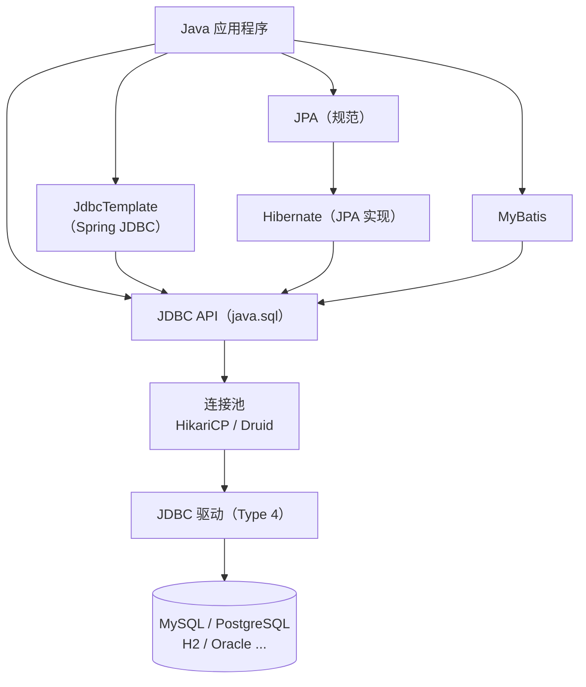

# 数据库

Java 生态有 JDBC、JdbcTemplate、MyBatis、JPA/Hibernate 等多种数据库技术——什么场景用哪个？理解它们的层次关系是选择的前提。

## 🏛️ Java 数据库技术栈

## 📚 JDBC / ORM / MyBatis 怎么选？

`JDBC`（Java Database Connectivity）
:   Java 数据库连接的底层标准 API，由 `java.sql` 包提供。所有上层框架的底层都依赖 JDBC。直接使用 JDBC 代码较繁琐，但能最深入地理解数据库交互原理。

`JdbcTemplate`
:   Spring Framework 对 JDBC 的轻量封装，消除了模板代码（资源管理、异常转换），同时保留了 SQL 控制的灵活性。

`JPA / Hibernate`
:   `JPA`（Java Persistence API）是 Java EE 的持久化规范，`Hibernate` 是其最流行的实现。提供对象关系映射（ORM），通过操作 Java 对象自动生成 SQL，适合领域模型复杂的场景。

`MyBatis`
:   半 ORM 框架，通过 XML 或注解将 SQL 语句与 Java 方法绑定。相比 JPA 更接近 SQL，适合 SQL 复杂、需要精细调优的场景。

## 🗺️ 学习路径建议

!!! tip "推荐学习顺序"
    理解底层原理对掌握上层框架至关重要：

    1. 🔗 `JDBC 基础` → 理解连接、Statement、事务、连接池的底层机制
    2. 🧰 `JdbcTemplate` → 体验 Spring 如何简化 JDBC 操作
    3. 🗂️ `MyBatis` → 掌握 SQL 映射框架，适合国内企业开发
    4. 🧩 `JPA / Hibernate` → 掌握 ORM 思想，与 Spring Data JPA 配合使用

## 📑 本节内容

- [JDBC](jdbc/index.md)
