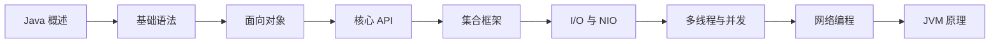

# JavaSE

Java 分 SE / EE / ME 三大平台，日常开发中最基础也最关键的就是 JavaSE（Standard Edition）。无论你后续做 Web 后端（Spring）还是 Android，SE 的核心 API 和语言特性都是绕不开的基石。

## 🗺️ 从哪里开始？——学习路径

## 本节内容

- [Java 概述](overview/index.md)
- [文件和 IO 流](file-io/index.md)
