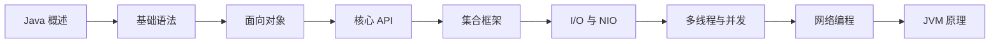

# JavaSE

JavaSE（Java Platform, Standard Edition）是 Java 平台的基础版本，提供了 Java 语言核心 API 和运行环境，是学习 Java 的起点。

## 学习路径

```mermaid
graph LR
    A["Java 概述"] --> B["基础语法"]
    B --> C["面向对象"]
    C --> D["核心 API"]
    D --> E["集合框架"]
    E --> F["I/O 与 NIO"]
    F --> G["多线程与并发"]
    G --> H["网络编程"]
    H --> I["JVM 原理"]
```

## 本节内容

- [Java 概述](overview/index.md)
