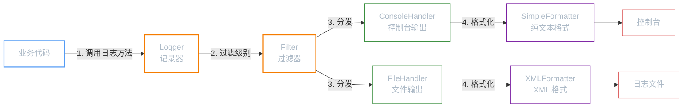
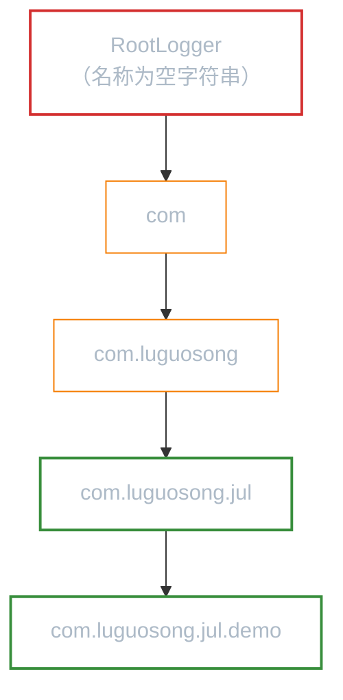
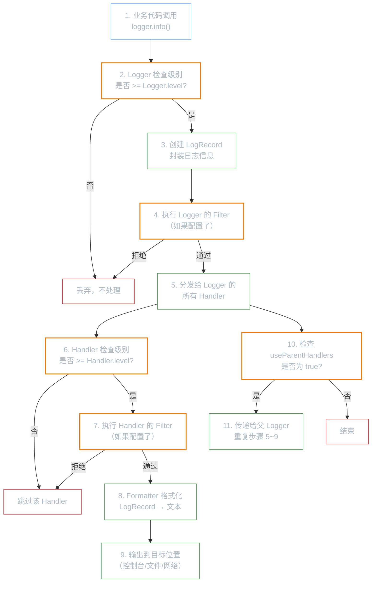

**前置知识**：如果你还不了解日志框架的基本概念，请先阅读「日志框架」。

**本文你会学到**：

- `java.util.logging` 的五大核心组件各自负责什么
- 七个日志级别从 `SEVERE` 到 `FINEST` 的含义与默认行为
- Logger 父子关系如何影响日志的传递路径
- Java 代码配置和 `logging.properties` 文件配置两种方式
- 一条日志从产生到输出的完整执行流程

## 为什么了解 JUL？

当你需要日志功能时，第一反应可能是引入 SLF4J 或 Logback。但 JUL（`java.util.logging`）作为 JDK 自带的日志框架，有几个独特优势：

- **零依赖**——不需要任何第三方 jar 包，`import java.util.logging.Logger` 就能用
- **学习日志基础的最佳入口**——`Logger` → `Handler` → `Formatter` 这套架构被几乎所有日志框架沿用
- **简单场景足够用**——小型工具、教学示例、不想引入额外依赖的库

当然，JUL 也有明显的局限：占位符支持不如 SLF4J 方便、配置灵活性不如 Logback、没有异步日志。当你需要在生产项目中做复杂的日志管理时，升级到 `SLF4J` + `Logback` 是更好的选择。

## 核心组件

JUL 的架构围绕五个组件展开，它们之间的协作关系如下：



各组件的职责一览：

| 组件 | 类比 | 职责 |
|------|------|------|
| `Logger` | 快递员 | 接收业务代码的日志请求，是日志系统的入口 |
| `Handler` | 分拣中心 | 决定日志发往哪里（控制台、文件、网络等） |
| `Filter` | 安检门 | 比 `Level` 更细粒度的过滤，按自定义条件决定是否记录 |
| `Formatter` | 打包员 | 将 `LogRecord` 格式化为最终输出文本 |
| `Level` | 优先级标签 | 日志严重程度标识，数值越大越严重 |

## 日志级别

JUL 定义了 7 个标准级别，外加 `OFF` 和 `ALL` 两个特殊值：

| 级别 | 数值 | 说明 |
|------|------|------|
| `SEVERE` | 1000 | 严重错误，程序可能无法继续运行 |
| `WARNING` | 900 | 警告信息，表示潜在问题 |
| `INFO` | 800 | 一般信息，**默认输出级别** |
| `CONFIG` | 700 | 配置信息，如数据库连接参数 |
| `FINE` | 500 | 调试信息（详细级别） |
| `FINER` | 400 | 更详细的调试信息 |
| `FINEST` | 300 | 最详细的调试信息 |
| `OFF` | `Integer.MAX_VALUE` | 关闭所有日志 |
| `ALL` | `Integer.MIN_VALUE` | 输出所有日志 |

**默认行为**：`Logger` 的默认级别是 `INFO`（800），只有 `INFO` 及以上级别（`INFO`、`WARNING`、`SEVERE`）的日志会被输出。这意味着你调用 `logger.fine("...")` 时，默认情况下看不到任何输出。

## 快速上手

### 获取 Logger

获取 `Logger` 实例只需要一行代码：

``` java title="获取 Logger 实例"
import java.util.logging.Logger;

// 推荐方式：用类名作为 Logger 名称
Logger logger = Logger.getLogger(MyClass.class.getName());
```

`Logger.getLogger()` 方法接收一个字符串参数作为 Logger 的名称。通常使用类的全限定名（如 `com.luguosong.jul.MyClass`），这样做的好处是与 Logger 的父子层级关系天然对应。

### 各级别日志输出

``` java title="输出不同级别的日志"
logger.severe("数据库连接失败，程序终止");  // 严重错误
logger.warning("内存使用率超过 80%");       // 警告
logger.info("用户登录成功");               // 一般信息
logger.config("数据库端口: 3306");          // 配置信息
logger.fine("进入方法 processData()");      // 调试信息
logger.finer("循环第 3 次迭代");            // 更详细的调试
logger.finest("变量 x = 42");              // 最详细的调试
```

运行后你会发现，默认只能看到 `INFO`、`WARNING`、`SEVERE` 三条日志。`CONFIG` 及以下级别被默认级别过滤掉了。要看到所有级别的日志，需要修改 Logger 级别（详见「配置方式」章节）。

### 占位符使用

与 SLF4J 的 `{}` 占位符不同，JUL 没有内置的占位符语法。你需要借助 `MessageFormat` 或字符串拼接：

``` java title="JUL 的占位符使用方式"
import java.text.MessageFormat;

// 方式一：字符串拼接（简单但性能较差）
logger.info("用户 " + username + " 登录成功");

// 方式二：String.format
logger.info(String.format("用户 %s 登录成功，耗时 %d ms", username, elapsed));

// 方式三：MessageFormat.format（推荐）
logger.info(MessageFormat.format("用户 {0} 登录成功，耗时 {1} ms", username, elapsed));

// 方式四：Logger.log() 的参数数组（内部使用 MessageFormat）
logger.log(Level.INFO, "用户 {0} 登录成功，耗时 {1} ms",
        new Object[]{username, elapsed});
```

!!! tip "性能提示"
    方式一和方式二无论日志是否被输出，都会执行字符串拼接/格式化。方式三和方式四同样如此。如果你需要性能优化，可以先检查级别：

    ``` java
    if (logger.isLoggable(Level.FINE)) {
        logger.fine("耗时操作的结果: " + expensiveOperation());
    }
    ```

## Logger 父子关系

JUL 中的 Logger 按照**名称的层级**自动形成父子关系——就像文件系统的目录结构一样：



**规则很简单**：如果 Logger A 的名称是 Logger B 名称的前缀（加上 `.` 分隔），那么 A 就是 B 的父 Logger。例如：

- `com.luguosong` 是 `com.luguosong.jul` 的父 Logger
- `com` 是 `com.luguosong` 的父 Logger
- 所有 Logger 的最终祖先都是 `RootLogger`（名称为空字符串 `""`）

### 日志传递机制

子 Logger 产生的日志默认会**向上传递**给所有祖先 Logger 的 Handler。这意味着一条日志可能被输出多次——子 Logger 的 Handler 输出一次，父 Logger 的 Handler 又输出一次。

### setUseParentHandlers(false)

当你想让子 Logger 独立处理日志，不向上传递时，调用：

``` java title="阻止日志传递给父 Handler"
Logger childLogger = Logger.getLogger("com.luguosong.jul");
childLogger.setUseParentHandlers(false); // 关键一行
```

设置后，子 Logger 的日志只由自己的 Handler 处理，不再传递给父 Logger。这在需要**对不同包使用不同的日志输出策略**时非常有用。

## 配置方式

JUL 提供两种配置途径：Java 代码配置和 `logging.properties` 文件配置。

### Java 代码配置

通过代码直接操作 Logger 和 Handler，适合需要**运行时动态调整**的场景：

``` java title="Java 代码配置 Logger"
import java.util.logging.*;

// 获取 Logger
Logger logger = Logger.getLogger("com.luguosong.jul");

// 1. 屏蔽父 Handler，避免日志重复输出
logger.setUseParentHandlers(false);

// 2. 设置 Logger 级别为 ALL（接收所有级别的日志）
logger.setLevel(Level.ALL);

// 3. 创建 ConsoleHandler
ConsoleHandler consoleHandler = new ConsoleHandler();
consoleHandler.setLevel(Level.ALL);
consoleHandler.setFormatter(new SimpleFormatter());

// 4. 将 Handler 注册到 Logger
logger.addHandler(consoleHandler);

// 现在所有级别的日志都会输出到控制台
logger.fine("这行调试信息现在能看到了");
```

!!! warning "注意 Handler 级别"
    日志是否被输出取决于 **Logger 级别**和 **Handler 级别**的双重过滤。Logger 先判断级别是否满足，通过后再交给 Handler，Handler 再判断一次。如果你发现 `FINE` 级别的日志没有输出，检查两个地方的级别设置。

### 配置文件配置

JUL 默认从 JDK 安装目录加载配置文件。不同 JDK 版本的文件位置不同：

| JDK 版本 | 默认配置文件路径 |
|---------|---------------|
| JDK 8 | `$JAVA_HOME/jre/lib/logging.properties` |
| JDK 9+ | `$JAVA_HOME/conf/logging.properties` |

#### 加载自定义配置文件

方式一：通过代码加载指定文件：

``` java title="通过代码加载自定义配置"
LogManager.getLogManager().readConfiguration(
    getClass().getClassLoader().getResourceAsStream("my-logging.properties")
);
```

方式二：通过 JVM 启动参数指定：

``` bash title="JVM 启动参数指定配置文件"
java -Djava.util.logging.config.file=/path/to/logging.properties -jar app.jar
```

#### 配置项详解

``` properties title="logging.properties 配置项示例"
# 全局 Handler 列表（多个用逗号分隔）
handlers=java.util.logging.ConsoleHandler, java.util.logging.FileHandler

# 全局默认级别
.level=INFO

# ConsoleHandler 配置
java.util.logging.ConsoleHandler.level=INFO
java.util.logging.ConsoleHandler.formatter=java.util.logging.SimpleFormatter

# FileHandler 配置
java.util.logging.FileHandler.level=ALL
java.util.logging.FileHandler.pattern=%h/java%u.log
java.util.logging.FileHandler.limit=50000
java.util.logging.FileHandler.count=1
java.util.logging.FileHandler.append=true
java.util.logging.FileHandler.formatter=java.util.logging.XMLFormatter

# 特定包的级别配置（覆盖全局默认）
com.luguosong.jul.level=FINE
com.luguosong.jul.demo.level=ALL
```

关键配置项说明：

| 配置项 | 说明 |
|-------|------|
| `handlers` | 全局 Handler 列表，多个用逗号分隔 |
| `.level` | 全局默认日志级别 |
| `<包名>.level` | 指定包的日志级别 |
| `FileHandler.pattern` | 日志文件路径模式：`%h` = 用户主目录，`%t` = 临时目录，`%u` = 唯一编号 |
| `FileHandler.append` | `true` = 追加模式，`false` = 覆盖模式 |
| `FileHandler.limit` | 单个日志文件的最大字节数，0 表示无限制 |
| `FileHandler.count` | 日志文件循环数量 |

## 执行流程

当你调用 `logger.info("消息")` 时，JUL 内部经历了以下步骤：



逐步解析：

1. **调用日志方法**：业务代码调用 `logger.info()`、`logger.severe()` 等方法
2. **Logger 级别检查**：`Logger` 首先检查日志级别是否 >= 自己的级别，不满足直接丢弃（零开销）
3. **创建 LogRecord**：通过级别检查后，JUL 将日志信息封装为 `LogRecord` 对象
4. **Logger Filter 过滤**：如果配置了 `Filter`，执行自定义过滤逻辑
5. **分发 Handler**：将 `LogRecord` 依次交给 `Logger` 注册的所有 `Handler`
6. **Handler 级别检查**：每个 `Handler` 再次检查级别（Handler 有自己独立的级别设置）
7. **Handler Filter 过滤**：`Handler` 也可以配置独立的 `Filter`
8. **Formatter 格式化**：`Handler` 调用 `Formatter` 将 `LogRecord` 转为文本
9. **输出到目标**：格式化后的文本被写入控制台、文件或网络
10. **父 Logger 传递**：如果 `useParentHandlers` 为 `true`（默认），`LogRecord` 还会传递给父 `Logger`，重复步骤 5~9

!!! info "双重级别过滤的意义"
    你可能会问：为什么 Logger 和 Handler 各自都要检查级别？这是为了灵活性。比如 Logger 设为 `ALL`（全部放行），但 ConsoleHandler 设为 `INFO`（只显示重要信息），FileHandler 设为 `ALL`（记录所有细节）。这样你可以做到控制台只看关键信息，文件中保留完整调试记录。
