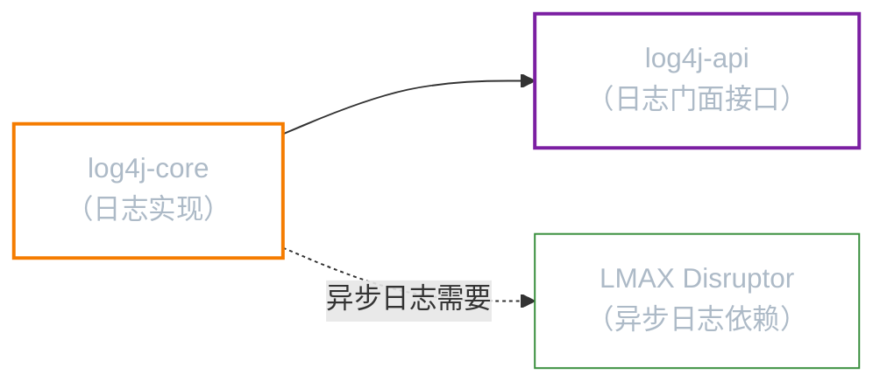
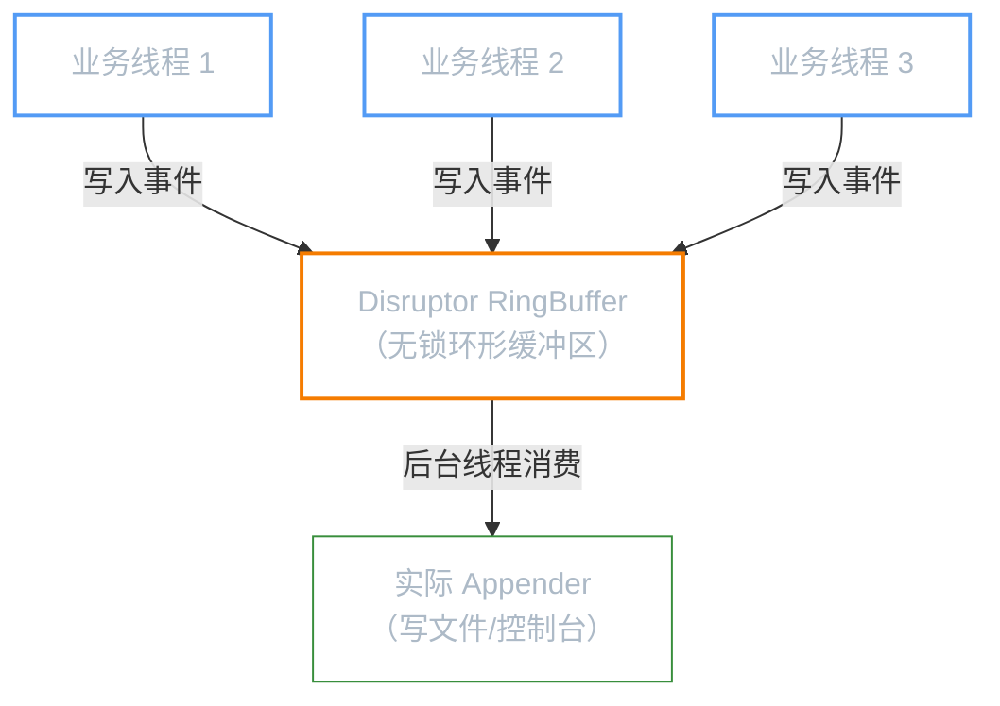

**前置知识**：本文假设你已经熟悉 Logback 的核心概念（`Logger` / `Appender` / `Layout`、日志归档、异步日志）。如果还不了解，请先阅读「Logback」。Log4j2 沿用了相同的三层架构，理解 Logback 后学习 Log4j2 会非常顺畅。

**本文你会学到**：

- Log4j2 相比 Logback 的核心改进，以及它的双重身份（日志门面 + 日志实现）
- 与 Log4j 1.x 一致的 8 个日志级别
- `log4j-api`（门面）+ `log4j-core`（实现）的双依赖模型
- `log4j2.xml` 配置文件的完整结构：`Configuration` / `Appenders` / `Loggers`
- 从控制台输出到文件归档的实战配置
- 两种异步日志方案（`AsyncAppender` vs `AsyncLogger`）的原理与选择

## ⚡ Log4j2 的改进

如果你读过「Logback」，应该已经知道 Logback 相比 Log4j 1.x 带来了配置热更新、原生 SLF4J 支持等改进。那为什么还会出现 Log4j2？

答案要从性能说起。Logback 的异步日志虽然比同步方式好，但在超高并发下仍然存在瓶颈——它的 `AsyncAppender` 使用普通的阻塞队列，在高吞吐场景下锁竞争严重。

Log4j2 由 Apache 社区（而非个人）维护，借鉴了 Logback 的优秀设计，同时引入了多项关键改进：

| 对比维度 | Logback | Log4j2 |
|---------|---------|--------|
| 日志门面 | 仅实现 SLF4J | 自身就是门面（`log4j-api`），也实现 SLF4J |
| 异步日志性能 | `AsyncAppender`，阻塞队列 | `AsyncLogger`，基于 LMAX Disruptor 无锁队列 |
| 插件机制 | 固定组件，扩展性一般 | 全插件式结构，自定义组件非常方便 |
| 配置热更新 | `logback.xml` 自动检测 | `monitorInterval` 指定检测间隔（秒） |
| Lambda 支持 | 不支持 | `logger.debug(() -> expensive())` 延迟求值 |

其中最亮眼的改进是 **基于 LMAX Disruptor 的异步日志**——这是 Log4j2 的核心竞争力。在多线程场景下，Log4j2 的 `AsyncLogger` 吞吐量可达 Logback `AsyncAppender` 的数倍。

另一个独特之处：Log4j2 **本身既是日志门面又是日志实现**。`log4j-api` 提供了 `Logger` / `LogManager` 等接口（类似 SLF4J 的角色），`log4j-core` 提供具体实现。你可以只引入 `log4j-api` 写代码，运行时再选择用 `log4j-core` 还是其他实现。

## 📊 日志级别

Log4j2 的日志级别与 Log4j 1.x 完全一致（8 个级别）：

| 级别 | 说明 | 使用场景 |
|------|------|---------|
| `OFF` | 关闭所有日志 | — |
| `FATAL` | 致命错误，导致程序崩溃 | JVM 内存溢出、无法启动数据库连接池 |
| `ERROR` | 错误信息，影响功能但不崩溃 | 数据库连接失败、第三方服务超时 |
| `WARN` | 警告信息，潜在问题 | 使用了已废弃的 API、配置项缺失但有默认值 |
| `INFO` | 一般信息，记录关键业务流程 | 用户登录成功、订单创建完成 |
| `DEBUG` | 调试信息（**默认级别**） | 方法入参出参、SQL 语句、条件判断结果 |
| `TRACE` | 最详细的调试信息 | 循环内部状态、细粒度的方法调用追踪 |
| `ALL` | 开启所有级别 | — |

级别从高到低排列：`OFF` > `FATAL` > `ERROR` > `WARN` > `INFO` > `DEBUG` > `TRACE` > `ALL`。设置某个级别后，只有该级别及更高级别的日志会被输出。

注意 Log4j2 比 SLF4J / Logback **多了 `FATAL` 级别**。如果你通过 SLF4J 使用 Log4j2，`FATAL` 级别的日志会被映射为 `ERROR`。

## 🚀 快速上手

### 双依赖模型

Log4j2 的依赖结构与 Logback 不同，它拆分为**门面**和**实现**两个模块：



| 模块 | 职责 | 说明 |
|------|------|------|
| `log4j-api` | 日志门面 | 提供 `Logger`、`LogManager` 等接口，类似于 SLF4J 的角色 |
| `log4j-core` | 日志实现 | 提供具体的日志处理实现，依赖 `log4j-api` |
| `disruptor` | 异步日志（可选） | `AsyncLogger` 的底层依赖，不使用异步日志时可以不加 |

在 `pom.xml` 中引入：

``` xml title="pom.xml 中引入 Log4j2"
<!-- Log4j2 门面（接口层） -->
<dependency>
    <groupId>org.apache.logging.log4j</groupId>
    <artifactId>log4j-api</artifactId>
</dependency>
<!-- Log4j2 实现（核心层） -->
<dependency>
    <groupId>org.apache.logging.log4j</groupId>
    <artifactId>log4j-core</artifactId>
</dependency>
<!-- 异步日志依赖（可选，推荐） -->
<dependency>
    <groupId>com.lmax</groupId>
    <artifactId>disruptor</artifactId>
    <version>4.0.0</version>
</dependency>
```

### 基本代码

Log4j2 使用自己的原生 API，而不是 SLF4J：

``` java title="Log4j2 基本用法"
import org.apache.logging.log4j.LogManager;
import org.apache.logging.log4j.Logger;

// 通过 LogManager 获取 Logger（注意：不是 LoggerFactory）
Logger logger = LogManager.getLogger(MyClass.class);

// 各级别输出（比 SLF4J 多了 fatal）
logger.fatal("致命错误");
logger.error("错误信息");
logger.warn("警告信息");
logger.info("一般信息");
logger.debug("调试信息");
logger.trace("追踪信息");

// 参数化日志（与 SLF4J 语法一致）
logger.info("用户 {} 登录成功，IP: {}", username, ip);
```

与 Logback（通过 SLF4J）的 API 对比：

| 操作 | Logback + SLF4J | Log4j2 原生 |
|------|----------------|------------|
| 获取 Logger | `LoggerFactory.getLogger()` | `LogManager.getLogger()` |
| 导入的 Logger | `org.slf4j.Logger` | `org.apache.logging.log4j.Logger` |
| FATAL 级别 | 不支持 | `logger.fatal()` |
| 参数化日志 | `logger.info("{}", val)` | `logger.info("{}", val)`（语法一致） |

## ⚙️ 配置详解

### log4j2.xml 基本结构

Log4j2 的配置文件与 Logback 有很大差异。它使用 `<Configuration>` 作为根元素，内部按 `Appenders` 和 `Loggers` 两层组织：

``` xml title="log4j2.xml 基本骨架"
<?xml version="1.0" encoding="UTF-8"?>
<Configuration status="WARN" monitorInterval="30">
    <!-- Appenders：定义日志输出目标 -->
    <Appenders>
        ...
    </Appenders>
    <!-- Loggers：定义日志记录器 -->
    <Loggers>
        ...
    </Loggers>
</Configuration>
```

根元素 `<Configuration>` 的关键属性：

| 属性 | 说明 | 示例 |
|------|------|------|
| `status` | Log4j2 自身的内部日志级别（用于排查配置问题） | `WARN`、`DEBUG` |
| `monitorInterval` | 自动检测配置变更的间隔（秒）。`0` 表示不检测 | `30` |

与 Logback 的配置对比：

| 对比项 | Logback | Log4j2 |
|-------|---------|--------|
| 根元素 | `<configuration>` | `<Configuration>` |
| 输出目标容器 | 直接在根元素下写 `<appender>` | 包裹在 `<Appenders>` 中 |
| 日志记录器容器 | 直接在根元素下写 `<root>` / `<logger>` | 包裹在 `<Loggers>` 中 |
| 热更新配置 | 默认自动检测 | 需设置 `monitorInterval` |
| 自身调试 | `debug="true"` | `status="DEBUG"` |

### 控制台输出

`Console` 是最基本的 Appender，将日志输出到控制台：

``` xml title="Console Appender 配置"
<Appenders>
    <Console name="Console" target="SYSTEM_OUT">
        <PatternLayout pattern="%d{yyyy-MM-dd HH:mm:ss.SSS} [%t] %-5level %logger{36} - %msg%n"/>
    </Console>
</Appenders>
```

`PatternLayout` 中 `pattern` 的常用占位符（与 Logback 基本兼容）：

| 占位符 | 说明 | 示例输出 |
|--------|------|---------|
| `%d` | 日期时间（可指定格式） | `2026-04-12 14:30:00.123` |
| `%t` | 线程名 | `main`、`http-nio-8080-exec-1` |
| `%-5level` | 日志级别，左对齐占 5 字符 | `INFO `、`ERROR` |
| `%logger{36}` | Logger 名称（缩写至 36 字符） | `c.l.log4j2.Log4j2BasicTest` |
| `%msg` / `%m` | 日志消息 | `用户登录成功` |
| `%n` | 换行符 | — |
| `%X` | MDC（映射诊断上下文） | `userId=admin` |

### 文件输出与拆分

`RollingFile` Appender 实现日志文件输出并按条件自动归档：

``` xml title="RollingFile Appender 配置"
<RollingFile name="RollingFile" fileName="logs/app.log"
             filePattern="logs/app-%d{yyyy-MM-dd}-%i.log">
    <PatternLayout pattern="%d{yyyy-MM-dd HH:mm:ss.SSS} [%t] %-5level %logger{36} - %msg%n"/>
    <!-- 单个文件达到 10MB 时触发归档 -->
    <SizeBasedTriggeringPolicy size="10MB"/>
    <!-- 最多保留 10 个归档文件 -->
    <DefaultRolloverStrategy max="10"/>
</RollingFile>
```

各配置项说明：

| 配置项 | 说明 |
|-------|------|
| `fileName` | 当前正在写入的日志文件路径 |
| `filePattern` | 归档文件名模式。`%d` 是日期，`%i` 是同一天内的序号 |
| `SizeBasedTriggeringPolicy` | 触发归档的策略：按文件大小 |
| `DefaultRolloverStrategy` | 归档策略：最多保留的文件数 |

### 自动加载

Log4j2 通过 `<Configuration>` 根元素的 `monitorInterval` 属性实现配置热更新：

``` xml title="启用自动加载"
<!-- 每 30 秒检查一次配置文件是否变更 -->
<Configuration status="WARN" monitorInterval="30">
    ...
</Configuration>
```

工作机制：

1. Log4j2 每隔 `monitorInterval` 秒检查配置文件的时间戳
2. 发现文件变更后，自动重新加载配置
3. **不需要重启应用**，新的日志配置立即生效

!!! warning "注意"
    `monitorInterval` 设置为 `0`（默认值）表示禁用自动加载。生产环境建议设置为 `30` 或 `60`。

## ⚡ 异步日志

异步日志是 Log4j2 最核心的竞争力。在深入配置之前，先理解为什么需要异步日志：

当你用同步方式写日志时，业务线程必须等待日志写入磁盘后才继续执行。在低并发下这不是问题，但在高并发场景下（比如每秒上万次日志调用），磁盘 I/O 成为严重瓶颈，业务线程被阻塞。

Log4j2 提供了两种异步方案，原理和性能差异很大：

| 方案 | 底层机制 | 性能 | 推荐程度 |
|------|---------|------|---------|
| `AsyncAppender` | 阻塞队列（`ArrayBlockingQueue`） | 中等 | 简单场景可用 |
| `AsyncLogger` | LMAX Disruptor 无锁队列 | **极高** | **生产环境推荐** |



### AsyncAppender 方式

`AsyncAppender` 是 Log4j2 提供的第一种异步方案，**包装一个已有的同步 Appender**，在其前面加一个阻塞队列。与 Logback 的 `AsyncAppender` 原理相同：

``` xml title="AsyncAppender 配置"
<Appenders>
    <!-- 先定义一个同步的文件 Appender -->
    <RollingFile name="RollingFile" fileName="logs/app.log"
                 filePattern="logs/app-%d{yyyy-MM-dd}-%i.log">
        <PatternLayout pattern="%d{yyyy-MM-dd HH:mm:ss.SSS} [%t] %-5level %logger{36} - %msg%n"/>
        <SizeBasedTriggeringPolicy size="10MB"/>
        <DefaultRolloverStrategy max="10"/>
    </RollingFile>

    <!-- 用 Async 包装，变为异步写入 -->
    <Async name="Async">
        <AppenderRef ref="RollingFile"/>
    </Async>
</Appenders>

<Loggers>
    <Root level="DEBUG">
        <!-- 引用异步 Appender -->
        <AppenderRef ref="Async"/>
    </Root>
</Loggers>
```

这种方式的问题是：底层使用 `ArrayBlockingQueue`，多线程并发时锁竞争严重，吞吐量提升有限。

### AsyncLogger 方式（推荐）

`AsyncLogger` 是 Log4j2 的核心创新，基于 **LMAX Disruptor** 实现无锁并发。性能远超 `AsyncAppender`，是多线程高并发场景的最佳选择。

`AsyncLogger` 支持两种使用模式：

#### 全局异步

所有 Logger 都变成异步的，无需修改 XML 和 Java 代码。只需在 classpath 下创建 `log4j2.component.properties` 文件：

``` properties title="log4j2.component.properties"
Log4jContextSelector=org.apache.logging.log4j.core.async.AsyncLoggerContextSelector
```

启用后，`log4j2.xml` 中的配置不需要任何改动，所有日志自动通过 Disruptor 异步处理。

#### 混合异步

在 XML 中同时配置同步和异步 Logger，精细控制哪些包异步、哪些包同步：

``` xml title="混合异步配置"
<Loggers>
    <!-- 特定包使用 AsyncLogger（异步） -->
    <AsyncLogger name="com.luguosong" level="DEBUG">
        <AppenderRef ref="RollingFile"/>
    </AsyncLogger>

    <!-- 其他 Logger 保持同步 -->
    <Root level="INFO">
        <AppenderRef ref="Console"/>
    </Root>
</Loggers>
```

混合异步的优势在于灵活性：关键业务代码用异步日志提升性能，第三方框架（如 Spring、Hibernate）的日志保持同步，避免丢失重要错误信息。

### ⚠️ 注意事项

1. **`AsyncAppender` 和 `AsyncLogger` 不要同时使用**。两者混用会导致日志事件被包装两次，产生不可预期的行为。选择其中一种即可

2. **异步日志需要 LMAX Disruptor 依赖**。如果 classpath 中没有 `disruptor` jar 包，`AsyncLogger` 会静默退化为同步模式，不会报错但也没有异步的效果

3. **极端情况下会丢失日志**。当 Disruptor 的 RingBuffer 满了且无法及时消费时，`AsyncLogger` 有几种应对策略：
    - 默认策略：在 RingBuffer 满时阻塞等待（不丢日志但可能影响性能）
    - 可通过 `log4j2.component.properties` 设置 `log4j2.AsyncLogger.WaitStrategy` 调整行为

完整配置示例：

``` xml title="log4j2.xml 完整配置"
--8<-- "code/java/javase/logging/log4j2-demo/src/test/resources/log4j2.xml"
```

对应的 Java 代码示例：

``` java title="Log4j2 基本用法"
--8<-- "code/java/javase/logging/log4j2-demo/src/test/java/com/luguosong/log4j2/Log4j2BasicTest.java"
```

项目中有完整的可运行示例，路径为 `code/java/javase/logging/log4j2-demo/`。
