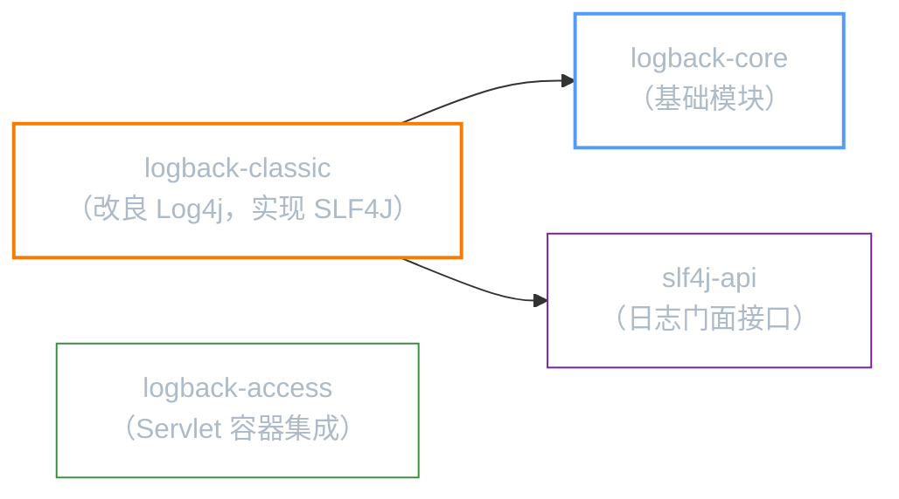
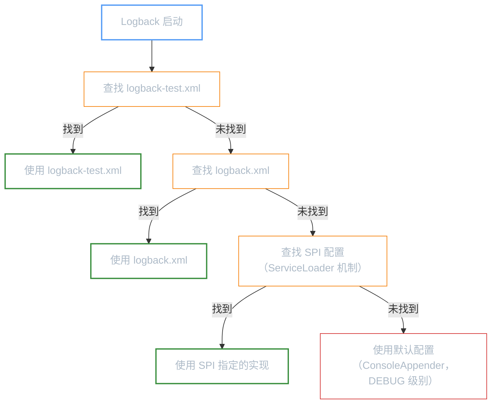
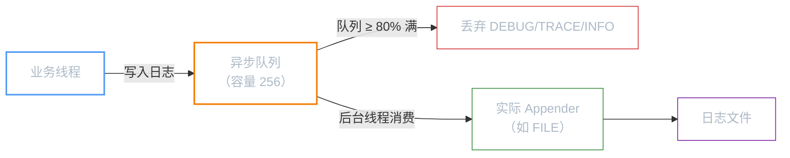
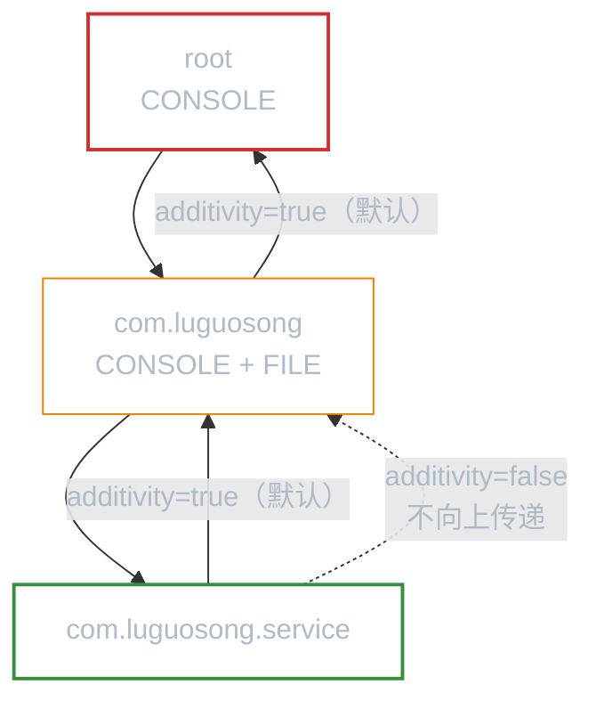

**前置知识**：如果你还不了解 Log4j 1.x 的核心概念（`Logger` / `Appender` / `Layout` 三层架构），请先阅读「Log4j」。Logback 沿用了这套架构，理解 Log4j 后学习 Logback 会非常顺畅。

**本文你会学到**：

- Logback 相比 Log4j 1.x 的核心优势，以及为什么 Spring Boot 选择它作为默认日志实现
- 三个模块（`logback-core` / `logback-classic` / `logback-access`）的职责与依赖关系
- 配置文件加载顺序，以及为什么测试用 `logback-test.xml`
- 从控制台输出、文件输出到日志归档的完整实战配置
- 过滤器（`LevelFilter` / `ThresholdFilter`）精确控制日志输出
- `AsyncAppender` 异步日志的原理与配置
- 自定义 Logger 与 `additivity` 属性解决日志重复输出

## ⭐ 为什么选择 Logback？

如果你读过「Log4j」，应该已经熟悉了 `Logger` → `Appender` → `Layout` 三层架构。现在的问题是：既然 Log4j 1.x 已经很好用了，为什么还要换 Logback？

答案要从 Logback 的作者说起——**Ceki Gülcü**，正是他当年创建了 Log4j 1.x。随着 Log4j 1.x 的架构局限性日益明显，Ceki 决定从头设计一个更好的日志框架，这就是 Logback。

相比 Log4j 1.x，Logback 带来了这些改进：

| 对比维度 | Log4j 1.x | Logback |
|---------|-----------|---------|
| 原生 SLF4J 支持 | 需要桥接库 `slf4j-log4j12` | 原生实现 SLF4J API，零桥接 |
| 配置热更新 | 不支持，修改配置需重启 | 自动检测 `logback.xml` 变更并重载 |
| 日志归档 | 按大小和按时间分开，不能同时控制 | `SizeAndTimeBasedRollingPolicy` 同时支持 |
| I/O 错误处理 | 静默忽略 | 自动降级（文件写入失败时切换到控制台） |
| 性能 | 同步写入，字符串拼接 | 内部优化，参数化日志零开销跳过 |

还有一个现实因素：**Spring Boot 从第一个版本就把 Logback 作为默认日志实现**。如果你用 Spring Boot，实际上已经在用 Logback 了——即使你没意识到。

## 📦 模块组成

Logback 由三个模块组成，各有明确分工：



| 模块 | 职责 | 说明 |
|------|------|------|
| `logback-core` | 基础模块 | 提供 `Appender`、`Layout`、`Encoder` 等基础组件，不依赖任何日志门面 |
| `logback-classic` | 日志实现 | 完整实现 SLF4J API，是对 Log4j 1.x 的改良版。依赖 `logback-core` 和 `slf4j-api` |
| `logback-access` | Servlet 集成 | 与 Tomcat/Jetty 等 Servlet 容器集成，记录 HTTP 访问日志 |

日常开发只需引入 `logback-classic`，它会自动传递 `logback-core` 和 `slf4j-api`：

``` xml title="pom.xml 中引入 Logback"
<dependency>
    <groupId>ch.qos.logback</groupId>
    <artifactId>logback-classic</artifactId>
    <!-- Spring Boot 项目中版本由 spring-boot-starter-parent 管理，无需指定 -->
</dependency>
```

## 📊 日志级别

Logback 的日志级别与 Log4j 1.x 基本一致（去掉了 `FATAL`，因为 SLF4J 没有 `FATAL` 级别）：

| 级别 | 说明 | 使用场景 |
|------|------|---------|
| `ERROR` | 错误信息，影响功能但不导致程序崩溃 | 数据库连接失败、第三方服务超时 |
| `WARN` | 警告信息，潜在问题 | 使用了已废弃的 API、配置项缺失但有默认值 |
| `INFO` | 一般信息，记录关键业务流程 | 用户登录成功、订单创建完成 |
| `DEBUG` | 调试信息（**默认级别**） | 方法入参出参、SQL 语句、条件判断结果 |
| `TRACE` | 最详细的调试信息 | 循环内部状态、细粒度的方法调用追踪 |

级别从高到低排列：`ERROR` > `WARN` > `INFO` > `DEBUG` > `TRACE`。设置某个级别后，只有该级别及更高级别的日志会被输出。比如设置了 `INFO`，`DEBUG` 和 `TRACE` 会被过滤掉。

## 🔄 配置文件加载顺序

当你没有使用编程式配置时，Logback 按以下顺序在 classpath 中查找配置文件：



为什么测试用 `logback-test.xml`？因为它的优先级高于 `logback.xml`。你可以这样组织：

| 文件 | 放置位置 | 用途 |
|------|---------|------|
| `logback-test.xml` | `src/test/resources/` | 测试环境配置，输出到控制台，`DEBUG` 级别 |
| `logback.xml` | `src/main/resources/` | 生产环境配置，输出到文件，`INFO` 级别 |

Maven 在运行测试时，`src/test/resources` 的文件会覆盖 `src/main/resources` 中的同名文件。但 Logback 的优先级机制让两个文件可以共存——测试时自动使用 `logback-test.xml`，运行正式程序时使用 `logback.xml`。

## 🖥️ 控制台输出

`ConsoleAppender` 是最基本的 Appender，将日志输出到控制台。与 Log4j 1.x 不同的是，Logback 用 `encoder` 替代了 `layout`（`encoder` 性能更好，内部使用 `LayoutWrappingEncoder` 来兼容旧的 `layout` 配置）：

``` xml title="ConsoleAppender 配置"
<appender name="CONSOLE" class="ch.qos.logback.core.ConsoleAppender">
    <encoder>
        <pattern>%d{yyyy-MM-dd HH:mm:ss.SSS} [%thread] %-5level %logger{36} - %msg%n</pattern>
    </encoder>
</appender>
```

`pattern` 中的常用占位符（与 Log4j 的 `PatternLayout` 基本兼容，有细微差异）：

| 占位符 | 说明 | 示例输出 |
|--------|------|---------|
| `%d` | 日期时间（可指定格式） | `2026-04-12 14:30:00.123` |
| `%thread` / `%t` | 线程名 | `main`、`http-nio-8080-exec-1` |
| `%level` / `%p` / `%le` | 日志级别 | `INFO`、`ERROR` |
| `%logger` / `%lo` / `%c` | Logger 名称（可指定长度） | `c.l.logback.LogbackBasicTest` |
| `%msg` / `%m` | 日志消息 | `用户登录成功` |
| `%n` | 换行符 | — |
| `%class` / `%C` | 类名（完整限定名） | `com.luguosong.logback.LogbackBasicTest` |
| `%method` / `%M` | 方法名 | `testBasicLogging` |
| `%line` / `%L` | 行号 | `42` |
| `%file` / `%F` | 文件名 | `LogbackBasicTest.java` |
| `%X` | MDC（映射诊断上下文） | `userId=admin` |

!!! warning "性能提示"
    `%class`、`%method`、`%line`、`%file` 这些占位符需要通过堆栈跟踪获取调用者信息，性能开销较大。生产环境应避免使用，仅在调试时开启。

常用格式模板：

``` properties title="几种常用的 pattern 模板"
# 简洁版：时间 + 线程 + 级别 + Logger + 消息
%d{yyyy-MM-dd HH:mm:ss.SSS} [%thread] %-5level %logger{36} - %msg%n

# 带颜色的控制台输出（Logback 默认支持 ANSI 颜色）
%d{highlight(%-5level)} [%thread] %cyan(%logger{36}) - %msg%n

# 生产环境：精简版
%d{yyyy-MM-dd HH:mm:ss} %-5level %logger{20} - %msg%n
```

## 📁 文件输出

### FileAppender：基本文件输出

`FileAppender` 将日志写入指定文件，适合简单的日志持久化场景：

``` xml title="FileAppender 配置"
<appender name="FILE" class="ch.qos.logback.core.FileAppender">
    <file>logs/app.log</file>
    <append>true</append>
    <encoder>
        <pattern>%d{yyyy-MM-dd HH:mm:ss.SSS} [%thread] %-5level %logger{36} - %msg%n</pattern>
    </encoder>
</appender>
```

| 配置项 | 说明 |
|-------|------|
| `file` | 日志文件路径（相对路径相对于项目根目录） |
| `append` | `true` = 追加模式（默认），`false` = 每次启动覆盖 |

!!! warning "FileAppender 的局限"
    和 Log4j 1.x 一样，`FileAppender` 会把所有日志写入同一个文件，随着时间推移文件会无限增长。实际项目应使用 `RollingFileAppender` 来自动归档。

### HTMLLayout：HTML 格式输出

Logback 可以将日志输出为 HTML 表格格式，方便在浏览器中查看：

``` xml title="HTMLLayout 配置"
<appender name="HTML_FILE" class="ch.qos.logback.core.FileAppender">
    <file>logs/app.html</file>
    <encoder class="ch.qos.logback.core.encoder.LayoutWrappingEncoder">
        <layout class="ch.qos.logback.classic.html.HTMLLayout">
            <pattern>%d{yyyy-MM-dd HH:mm:ss}%level%logger%msg</pattern>
        </layout>
    </encoder>
</appender>
```

`HTMLLayout` 会将日志渲染为一个 HTML 表格，每行一条日志，包含时间戳、级别、Logger 名称、消息等列。

## 📂 日志归档

`RollingFileAppender` 是生产环境的核心组件，它能在满足条件时自动创建新文件、归档旧文件，解决单个日志文件无限增长的问题。

与 Log4j 1.x 不同的是，Logback 提供了 `SizeAndTimeBasedRollingPolicy`，可以**同时按时间和大小**控制归档——这在 Log4j 1.x 中是无法做到的（Log4j 1.x 的 `DailyRollingFileAppender` 和 `RollingFileAppender` 是两个独立的 Appender）。

``` xml title="RollingFileAppender 完整配置"
<appender name="FILE" class="ch.qos.logback.core.rolling.RollingFileAppender">
    <!-- 当前正在写入的日志文件 -->
    <file>logs/app.log</file>

    <!-- 归档策略：按时间 + 大小 -->
    <rollingPolicy class="ch.qos.logback.core.rolling.SizeAndTimeBasedRollingPolicy">
        <!-- 归档文件名模式：%d=日期，%i=序号（同一日期内按大小递增） -->
        <fileNamePattern>logs/app.%d{yyyy-MM-dd}.%i.log</fileNamePattern>
        <!-- 单个归档文件最大大小 -->
        <maxFileSize>10MB</maxFileSize>
        <!-- 保留的归档文件天数 -->
        <maxHistory>30</maxHistory>
        <!-- 所有归档文件总大小上限 -->
        <totalSizeCap>1GB</totalSizeCap>
    </rollingPolicy>

    <encoder>
        <pattern>%d{yyyy-MM-dd HH:mm:ss.SSS} [%thread] %-5level %logger{36} - %msg%n</pattern>
    </encoder>
</appender>
```

各配置项的作用：

| 配置项 | 说明 | 示例值 |
|-------|------|-------|
| `file` | 当前日志文件路径 | `logs/app.log` |
| `fileNamePattern` | 归档文件名模式。`%d` 是日期占位符，`%i` 是同一天内的序号 | `logs/app.%d{yyyy-MM-dd}.%i.log` |
| `maxFileSize` | 单个归档文件的最大大小，超过后自动创建新文件 | `10MB` |
| `maxHistory` | 保留的归档文件天数，超过后自动删除最旧的 | `30` |
| `totalSizeCap` | 所有归档文件的总大小上限，超过后从最旧的开始删除 | `1GB` |

归档文件名示例：`app.2026-04-12.0.log`、`app.2026-04-12.1.log`、`app.2026-04-13.0.log`。同一日期内，每当文件达到 `maxFileSize` 就递增 `%i`。

## 🔍 过滤器

当你需要精细控制哪些日志被某个 Appender 处理时，可以使用过滤器。Logback 提供了多种过滤器，最常用的两种：

### LevelFilter：精确级别匹配

`LevelFilter` 只放行**精确匹配**指定级别的日志，其他级别一律拒绝：

``` xml title="LevelFilter 配置"
<appender name="ERROR_FILE" class="ch.qos.logback.core.FileAppender">
    <file>logs/error.log</file>
    <filter class="ch.qos.logback.classic.filter.LevelFilter">
        <level>ERROR</level>
        <!-- 匹配 ERROR 级别 → 接受 -->
        <onMatch>ACCEPT</onMatch>
        <!-- 不匹配 → 拒绝 -->
        <onMismatch>DENY</onMismatch>
    </filter>
    <encoder>
        <pattern>%d{yyyy-MM-dd HH:mm:ss.SSS} [%thread] %-5level %logger{36} - %msg%n</pattern>
    </encoder>
</appender>
```

### ThresholdFilter：阈值过滤

`ThresholdFilter` 放行**指定级别及以上**的所有日志：

``` xml title="ThresholdFilter 配置"
<appender name="WARN_FILE" class="ch.qos.logback.core.FileAppender">
    <file>logs/warn-and-above.log</file>
    <filter class="ch.qos.logback.classic.filter.ThresholdFilter">
        <!-- WARN 及以上级别（WARN、ERROR）都会被记录 -->
        <level>WARN</level>
    </filter>
    <encoder>
        <pattern>%d{yyyy-MM-dd HH:mm:ss.SSS} [%thread] %-5level %logger{36} - %msg%n</pattern>
    </encoder>
</appender>
```

两种过滤器的区别：

| 过滤器 | 行为 | 适用场景 |
|-------|------|---------|
| `LevelFilter` | 只放行精确匹配的级别 | 把 ERROR 单独写到一个文件 |
| `ThresholdFilter` | 放行指定级别及以上 | 把 WARN 及以上写到一个文件 |

## ⚡ 异步日志

当日志量很大时（比如高并发 Web 应用），同步写文件会阻塞业务线程。`AsyncAppender` 通过一个内部队列将日志写入操作异步化——业务线程只需把日志丢进队列就返回，由专门的后台线程负责实际写入：

``` xml title="AsyncAppender 配置"
<appender name="ASYNC" class="ch.qos.logback.classic.AsyncAppender">
    <!-- 引用实际的 Appender（真正写日志的那个） -->
    <appender-ref ref="FILE"/>
    <!-- 队列剩余容量低于此值时，丢弃 TRACE/DEBUG/INFO 级别日志 -->
    <discardingThreshold>0</discardingThreshold>
    <!-- 队列容量（默认 256） -->
    <queueCapacity>512</queueCapacity>
    <!-- 队列满时是否阻塞等待（默认 true） -->
    <neverBlock>false</neverBlock>
</appender>
```

### discardingThreshold 详解

`discardingThreshold` 是异步日志中容易混淆的参数。它的工作机制是：

1. `AsyncAppender` 内部维护一个有界队列（默认容量 256）
2. 当队列的**剩余容量**低于 `discardingThreshold`（默认 20）时，`TRACE`、`DEBUG`、`INFO` 级别的日志会被直接丢弃，不再入队
3. `WARN` 和 `ERROR` 级别的日志**永远不会被丢弃**
4. 设置 `discardingThreshold=0` 表示**不丢弃任何日志**（队列满时阻塞等待）

为什么要设计这个机制？因为在高负载下，如果队列满了还继续入队，会阻塞业务线程。丢弃低优先级日志是一种牺牲精度保性能的策略。



## 🎯 自定义 Logger

默认情况下，所有 Logger 都继承 `root` 的配置。但当你需要让不同的包使用不同的日志策略时，可以通过 `<logger>` 元素自定义：

``` xml title="自定义 Logger 配置"
<!-- root：全局默认配置 -->
<root level="INFO">
    <appender-ref ref="CONSOLE"/>
</root>

<!-- com.luguosong 包使用 DEBUG 级别，同时输出到文件 -->
<logger name="com.luguosong" level="DEBUG" additivity="false">
    <appender-ref ref="CONSOLE"/>
    <appender-ref ref="FILE"/>
</logger>

<!-- 第三方框架只记录 WARN 及以上 -->
<logger name="org.springframework" level="WARN"/>
<logger name="org.hibernate" level="WARN"/>
```

### additivity：阻止日志向上传递

`additivity` 属性控制子 Logger 的日志是否向父 Logger 传递。与 Log4j 1.x 的概念完全一致：



- `additivity=true`（默认）：子 Logger 的日志会传递给所有祖先 Logger 的 Appender。比如 `com.luguosong.service` 的日志会同时被 `com.luguosong` 和 `root` 的 Appender 处理，导致同一条日志输出多次
- `additivity=false`：子 Logger 的日志只由自己的 Appender 处理，不向父 Logger 传递

什么时候设为 `false`？当你给某个包配置了独立的 Appender，又不想日志在父 Logger 的 Appender 中重复输出时。

## 完整配置示例

以下是一个生产环境常用的 `logback.xml` 完整配置，综合了本文介绍的所有组件：

``` xml title="logback-test.xml 完整配置"
--8<-- "code/java/javase/logging/logback-demo/src/test/resources/logback-test.xml"
```

对应的 Java 代码示例：

``` java title="Logback 基本用法" hl_lines="6-10"
--8<-- "code/java/javase/logging/logback-demo/src/test/java/com/luguosong/logback/LogbackBasicTest.java"
```

项目中有完整的可运行示例，路径为 `code/java/javase/logging/logback-demo/`。
