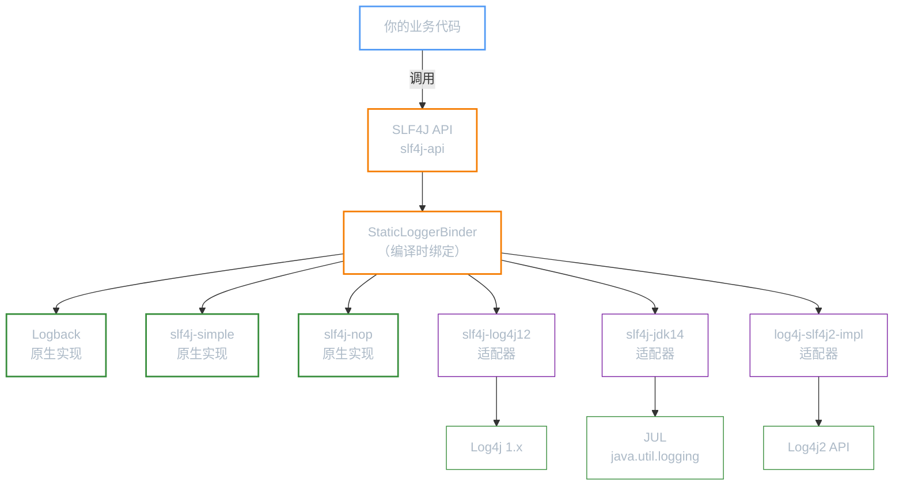
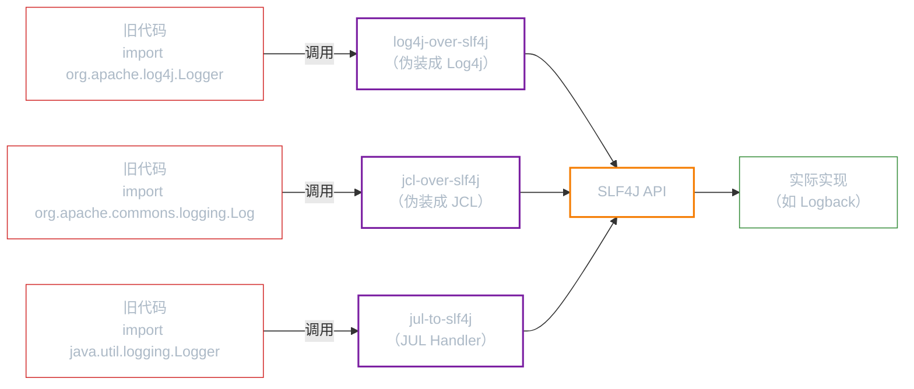

**前置知识**：如果你还不了解早期日志门面的设计思路和局限性，请先阅读「JCL」。SLF4J 正是在 JCL 的痛点之上诞生的，理解 JCL 后你能更深刻地体会 SLF4J 的设计优势。

**本文你会学到**：

- SLF4J 为什么能取代 JCL 成为当前主流日志门面——Spring Boot 默认选择的背后原因
- 适配器机制的完整架构——哪些实现原生支持、哪些需要适配器、为什么
- 从零开始用 SLF4J + `slf4j-simple` 输出日志——基本用法、占位符、异常记录
- 整合 5 种日志实现的依赖配置表格——直接使用 vs 通过适配器
- 桥接器原理——不修改已有代码，把旧 API 的日志重定向到 SLF4J
- 多实现冲突的排查和解决——类路径警告的根因与修复

## ⭐ 为什么选择 SLF4J？

当你选择日志门面时，JCL 和 SLF4J 是两个主要候选。如果你读过「JCL」，应该已经了解 JCL 的类加载器冲突、运行时绑定等致命问题。SLF4J 正是为了解决这些问题而设计的。

今天，SLF4J 已经是 Java 日志门面的事实标准，Spring Boot 从第一个版本就默认使用 SLF4J 作为日志门面。

### SLF4J vs JCL

| 对比维度 | JCL | SLF4J |
|---------|-----|-------|
| 绑定时机 | 运行时发现（反射扫描 classpath） | 编译时绑定（classpath 中只有一个实现 jar） |
| 类加载器依赖 | 依赖 `ClassLoader`，复杂环境下易出错 | 不依赖 `ClassLoader` 探测，绑定稳定 |
| 占位符支持 | 无（只能字符串拼接） | `{}` 占位符，延迟求值 |
| 自带实现 | 有（`SimpleLog`，容易混淆） | 有（`slf4j-nop`，明确表示什么都不做） |

### 占位符性能优势

这是 SLF4J 最被低估的优势。当你写日志时，如果日志级别不匹配（比如当前级别是 `INFO`，而你调用了 `logger.debug()`），字符串拼接的开销是否被浪费了？

``` java title="JCL 的痛点：字符串拼接无法避免"
// JCL 没有占位符，只能这样写
log.debug("查询结果: " + largeResultSet.toString() + "，耗时: " + cost());

// 即使 DEBUG 级别不输出，字符串拼接仍然会执行
// 要避免这个开销，必须手动加判断：
if (log.isDebugEnabled()) {
    log.debug("查询结果: " + largeResultSet.toString() + "，耗时: " + cost());
}
```

``` java title="SLF4J 的占位符：延迟求值，零开销跳过"
// SLF4J 使用 {} 占位符
logger.debug("查询结果: {}, 耗时: {}", largeResultSet.toString(), cost());

// 当 DEBUG 级别不输出时：
// 1. SLF4J 先检查级别，发现不匹配就直接返回
// 2. 不会执行字符串拼接
// 3. 但注意：方法参数（toString()、cost()）仍然会被求值
//    如果参数计算昂贵，仍建议用 isDebugEnabled() 包裹
```

核心区别：JCL 的 `log.debug(msg + ...)` 中，`+` 拼接是 Java 语法层面的操作，在方法调用前就会执行。SLF4J 的 `{}` 占位符把拼接推迟到了日志框架内部，级别不匹配时跳过拼接。

## 🔌 适配器机制

SLF4J 的绑定原则非常简单：**classpath 中只能有一个 SLF4J 实现**。SLF4J 在类加载时通过 `StaticLoggerBinder` 确定绑定关系，而不是像 JCL 那样每次调用都去扫描。



### 原生支持 vs 需要适配器

| 分类 | 框架 | 依赖 | 说明 |
|------|------|------|------|
| 原生实现 | Logback | `logback-classic` | Logback 直接实现了 SLF4J 的 `Logger` 接口 |
| 原生实现 | slf4j-simple | `slf4j-simple` | SLF4J 官方提供的简单实现，输出到控制台 |
| 原生实现 | slf4j-nop | `slf4j-nop` | 空实现，所有日志被静默丢弃 |
| 需要适配器 | Log4j 1.x | `slf4j-log4j12` + `log4j` | Log4j 在 SLF4J 之前发布，没有实现 SLF4J 接口 |
| 需要适配器 | JUL | `slf4j-jdk14` | JDK 自带的日志框架，同样早于 SLF4J |
| 需要适配器 | Log4j 2 | `log4j-slf4j2-impl` + `log4j-api` + `log4j-core` | Log4j 2 有自己的门面 API，需要适配层 |

!!! question "为什么 Log4j 和 JUL 需要适配器？"
    SLF4J 的绑定依赖一个关键类：`org.slf4j.impl.StaticLoggerBinder`。这个类需要由日志实现方提供。Log4j 1.x 和 JUL 在 SLF4J 诞生之前就已经发布了，它们的代码中不可能包含这个类。因此 SLF4J 为它们提供了适配器 jar（如 `slf4j-log4j12`），适配器中包含 `StaticLoggerBinder`，负责把 SLF4J 的调用翻译成 Log4j 或 JUL 的 API。

## 🚀 快速上手

### 引入依赖

使用 SLF4J 最简单的方式是引入 `slf4j-api`（门面）+ `slf4j-simple`（实现）：

``` xml title="pom.xml 引入 SLF4J + slf4j-simple"
<!-- SLF4J 日志门面 API -->
<dependency>
    <groupId>org.slf4j</groupId>
    <artifactId>slf4j-api</artifactId>
</dependency>
<!-- SLF4J 简单实现（输出到控制台） -->
<dependency>
    <groupId>org.slf4j</groupId>
    <artifactId>slf4j-simple</artifactId>
</dependency>
```

### 基本日志输出

通过 `LoggerFactory.getLogger()` 获取 `Logger` 实例，然后调用各级别方法：

``` java title="SLF4J 基本用法" hl_lines="5-6 9-13"
--8<-- "code/java/javase/logging/slf4j-demo/src/test/java/com/luguosong/slf4j/Slf4jBasicTest.java"
```

`slf4j-simple` 默认日志级别为 `INFO`，所以 `trace` 和 `debug` 级别的日志不会输出。

### 动态参数（`{}` 占位符）

SLF4J 使用 `{}` 作为占位符，比字符串拼接（`+`）更优雅也更高效：

``` java title="占位符用法"
Logger logger = LoggerFactory.getLogger(MyClass.class);

// 两个占位符：按顺序替换 {}
String username = "张三";
String ip = "192.168.1.100";
logger.info("用户 {} 登录成功，IP: {}", username, ip);
// 输出：用户 张三 登录成功，IP: 192.168.1.100

// 单个占位符
int result = 42;
logger.debug("计算结果: {}", result);
// 输出：计算结果: 42
```

!!! tip "占位符的性能边界"
    `{}` 占位符在日志级别不匹配时会跳过字符串拼接，但**方法参数本身的求值不会被跳过**。如果参数计算昂贵（如 `logger.debug("数据: {}", heavyOperation())`），仍需用 `isDebugEnabled()` 包裹：

    ``` java
    if (logger.isDebugEnabled()) {
        logger.debug("数据: {}", heavyOperation());
    }
    ```

### 异常信息记录

SLF4J 约定：**异常对象必须作为最后一个参数传入**。框架会自动输出完整的堆栈跟踪信息：

``` java title="异常记录"
try {
    int[] numbers = {1, 2, 3};
    int value = numbers[10]; // 数组越界
} catch (Exception e) {
    // 异常作为最后一个参数，SLF4J 自动输出堆栈跟踪
    logger.error("操作失败", e);
}
```

也可以结合占位符使用：

``` java title="带上下文的异常记录"
logger.error("处理用户 {} 的请求失败", username, exception);
// {} 被 username 替换，exception 作为最后一个参数触发堆栈输出
```

项目中有完整的可运行示例，路径为 `code/java/javase/logging/slf4j-demo/`。

## 🔗 整合各实现

SLF4J 的核心价值之一：**业务代码不变，只换依赖就能切换日志实现**。以下是整合 5 种日志实现的完整配置。

### 直接使用

这些框架原生实现了 SLF4J 接口，只需要引入一个依赖。

#### 整合 Logback

``` xml title="pom.xml 整合 Logback"
<dependency>
    <groupId>ch.qos.logback</groupId>
    <artifactId>logback-classic</artifactId>
</dependency>
```

`logback-classic` 会自动传递引入 `slf4j-api` 和 `logback-core`，无需额外声明。这是 Spring Boot 的默认组合。

#### 整合 NOP

``` xml title="pom.xml 整合 slf4j-nop（静默模式）"
<dependency>
    <groupId>org.slf4j</groupId>
    <artifactId>slf4j-nop</artifactId>
</dependency>
```

`slf4j-nop` 是空实现——所有日志调用被静默丢弃，不会有任何输出。适合不需要日志的场景（如 CLI 工具、测试环境）。

### 通过适配器

这些框架没有实现 SLF4J 接口，需要通过适配器 jar 来桥接。

#### 整合 Log4j 1.x

``` xml title="pom.xml 整合 Log4j 1.x"
<!-- SLF4J 适配器（包含 StaticLoggerBinder） -->
<dependency>
    <groupId>org.slf4j</groupId>
    <artifactId>slf4j-log4j12</artifactId>
</dependency>
<!-- Log4j 1.x 实际实现 -->
<dependency>
    <groupId>log4j</groupId>
    <artifactId>log4j</artifactId>
    <version>1.2.17</version>
</dependency>
```

还需要在 classpath 中放置 `log4j.properties` 配置文件。

#### 整合 JUL

``` xml title="pom.xml 整合 JUL"
<dependency>
    <groupId>org.slf4j</groupId>
    <artifactId>slf4j-jdk14</artifactId>
</dependency>
```

JUL 是 JDK 自带的，无需额外引入实现依赖。日志行为由 `logging.properties` 配置文件控制。

#### 整合 Log4j 2

``` xml title="pom.xml 整合 Log4j 2"
<!-- Log4j 2 的 SLF4J 适配器 -->
<dependency>
    <groupId>org.apache.logging.log4j</groupId>
    <artifactId>log4j-slf4j2-impl</artifactId>
</dependency>
<!-- Log4j 2 API 门面 -->
<dependency>
    <groupId>org.apache.logging.log4j</groupId>
    <artifactId>log4j-api</artifactId>
</dependency>
<!-- Log4j 2 核心实现 -->
<dependency>
    <groupId>org.apache.logging.log4j</groupId>
    <artifactId>log4j-core</artifactId>
</dependency>
```

!!! question "为什么需要 log4j-api？"
    Log4j 2 本身也是一个日志门面（提供自己的 API），`log4j-core` 依赖 `log4j-api`。SLF4J 不直接调用 `log4j-core` 的实现，而是通过 `log4j-slf4j2-impl` 适配器调用 Log4j 2 的门面 API（`log4j-api`），再由 `log4j-core` 提供实际的日志输出。

### 整合依赖速查表

| 日志实现 | 需要引入的依赖 | 配置文件 | 类型 |
|---------|--------------|---------|------|
| Logback | `logback-classic` | `logback.xml` 或 `logback-test.xml` | 原生 |
| slf4j-simple | `slf4j-simple` | 无（默认 INFO 级别） | 原生 |
| slf4j-nop | `slf4j-nop` | 无 | 原生 |
| Log4j 1.x | `slf4j-log4j12` + `log4j` | `log4j.properties` | 适配器 |
| JUL | `slf4j-jdk14` | `logging.properties` | 适配器 |
| Log4j 2 | `log4j-slf4j2-impl` + `log4j-api` + `log4j-core` | `log4j2.xml` | 适配器 |

## 🌉 桥接器

如果你接手了一个老项目，代码中到处都是 `org.apache.log4j.Logger`（Log4j 1.x 的 API），你该怎么办？逐行改成 `org.slf4j.Logger`？改几百个文件的工作量不说，还容易引入 bug。

桥接器（Bridge）就是为解决这个问题设计的：**让旧代码继续调用旧 API，但底层重定向到 SLF4J**。



### 桥接器的工作原理

以 `log4j-over-slf4j` 为例：

1. 它提供了与 Log4j 1.x **完全相同的类路径和 API**（`org.apache.log4j.Logger`、`org.apache.log4j.Level` 等）
2. 但这些类的内部实现不是写日志，而是把调用转发给 SLF4J
3. 从 Log4j API 的角度看，代码没有变化；从日志流的角度看，所有日志都走了 SLF4J 通道

### 从 Log4j 迁移到 SLF4J + Logback

迁移只需要三步，**不需要修改任何业务代码**：

| 步骤 | 操作 | 说明 |
|------|------|------|
| 1 | 删除 `log4j` 依赖 | 从 pom.xml 中移除 `log4j:log4j` |
| 2 | 引入 `log4j-over-slf4j` | 它伪装成 Log4j，但把日志转发给 SLF4J |
| 3 | 添加 SLF4J + Logback 依赖 | 引入 `logback-classic` |

``` xml title="迁移后的 pom.xml 依赖"
<!-- 桥接器：伪装成 Log4j，转发到 SLF4J -->
<dependency>
    <groupId>org.slf4j</groupId>
    <artifactId>log4j-over-slf4j</artifactId>
</dependency>
<!-- SLF4J + Logback 实现 -->
<dependency>
    <groupId>ch.qos.logback</groupId>
    <artifactId>logback-classic</artifactId>
</dependency>
```

迁移完成后：

- 旧代码中的 `org.apache.log4j.Logger.getLogger()` 调用照常工作
- 但底层实际走的是 SLF4J → Logback 通道
- 可以用 `logback.xml` 统一管理所有日志配置

### 其他桥接器

| 桥接器 | 替代的旧 API | Maven 坐标 |
|--------|------------|-----------|
| `log4j-over-slf4j` | Log4j 1.x | `org.slf4j:log4j-over-slf4j` |
| `jcl-over-slf4j` | JCL（Commons Logging） | `org.slf4j:jcl-over-slf4j` |
| `jul-to-slf4j` | JUL（`java.util.logging`） | `org.slf4j:jul-to-slf4j` |

!!! warning "桥接器与适配器不能同时存在"
    桥接器（如 `log4j-over-slf4j`）和适配器（如 `slf4j-log4j12`）不能同时出现在 classpath 中。它们会形成死循环：

    - `log4j-over-slf4j`：Log4j API → SLF4J
    - `slf4j-log4j12`：SLF4J → Log4j API

    同时存在时：Log4j API → SLF4J → Log4j API → SLF4J → ... 无限循环。SLF4J 会在启动时检测并报告这个问题。

## ⚠️ 多实现冲突

当 classpath 中同时存在多个 SLF4J 实现时（比如不小心同时引入了 `slf4j-simple` 和 `logback-classic`），SLF4J 会在启动时输出警告：

```
SLF4J: Class path contains multiple SLF4J providers.
SLF4J: Found provider [org.slf4j.simple.SimpleServiceProvider@...]
SLF4J: Found provider [ch.qos.logback.classic.spi.LogbackServiceProvider@...]
SLF4J: See https://www.slf4j.org/codes.html#multiple_bindings for an explanation.
SLF4J: Actual provider is of type [org.slf4j.simple.SimpleServiceProvider@...]
```

### 行为规则

SLF4J 使用 classpath 中**先被加载**的实现（取决于 Maven 依赖声明顺序和 classpath 解析顺序）。这意味着：

- 不同环境（开发机、CI 服务器）可能绑定到不同的实现
- 行为不可预测，调试困难

### 排查方法

使用 Maven 依赖树定位冲突来源：

``` bash title="排查 SLF4J 多实现冲突"
mvn dependency:tree | grep slf4j
```

输出示例：

```
[INFO] +- org.slf4j:slf4j-simple:jar:2.0.17:compile
[INFO] +- ch.qos.logback:logback-classic:jar:1.5.18:compile
[INFO] |  +- org.slf4j:slf4j-api:jar:2.0.17:compile
```

### 解决方法

在 pom.xml 中排除多余的实现依赖。假设你要保留 Logback，排除 `slf4j-simple`：

``` xml title="排除多余的 SLF4J 实现"
<!-- 保留 Logback -->
<dependency>
    <groupId>ch.qos.logback</groupId>
    <artifactId>logback-classic</artifactId>
</dependency>

<!-- 排除 slf4j-simple（来自某个传递依赖） -->
<dependency>
    <groupId>com.example</groupId>
    <artifactId>some-library</artifactId>
    <exclusions>
        <exclusion>
            <groupId>org.slf4j</groupId>
            <artifactId>slf4j-simple</artifactId>
        </exclusion>
    </exclusions>
</dependency>
```

!!! tip "Spring Boot 的自动管理"
    Spring Boot 的 `spring-boot-starter-logging` 已经默认引入了 `logback-classic`，并通过 `jcl-over-slf4j`、`log4j-over-slf4j`、`jul-to-slf4j` 桥接了所有旧 API。只要你使用 Spring Boot 的 starter 依赖，通常不会遇到多实现冲突。冲突往往出现在手动引入额外日志依赖时。
