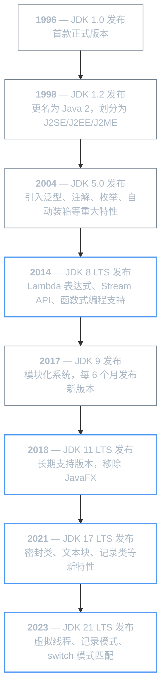
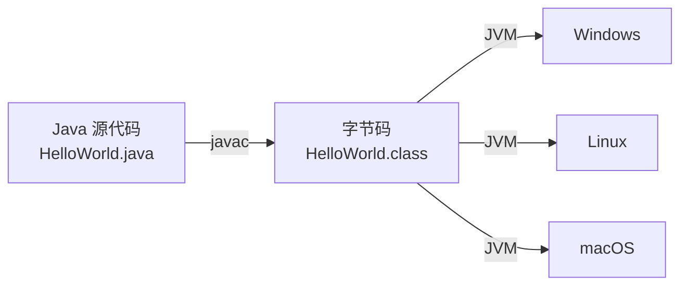

# Java 概述

Java 是一门广泛使用的面向对象编程语言，由 Sun Microsystems 于 1995 年发布，现由 Oracle 维护。它的核心理念是「一次编写，到处运行」（Write Once, Run Anywhere），这得益于 Java 程序编译为字节码后在 `JVM`（Java Virtual Machine）上运行的机制。

## Java 发展史

### 诞生与早期发展（1991 - 1995）

Java 的起源可以追溯到 1991 年 Sun Microsystems 内部的 Green 项目。该项目最初的目标是为消费电子产品（如电视顶盒、PDA）开发一种小型编程语言，项目代号 `Oak`（以詹姆斯·高斯林办公室窗外的一棵橡树命名）。

随着互联网的兴起，Sun 团队发现 Oak 的跨平台特性非常适合 Web 应用开发。1995 年 5 月 23 日，Sun 正式对外发布 Java，同时推出了 `Applet` 技术，允许在浏览器中运行 Java 程序，这引发了业界的广泛关注。

### 版本演进

Java 的版本迭代经历了几个重要阶段：



!!! info "LTS 与非 LTS 版本"
    自 JDK 9 起，Java 采用 ==每 6 个月==发布一个新版本的快速迭代模式。其中部分版本被指定为 **LTS**（Long Term Support，长期支持版本），Oracle 会为其提供长达 8 年以上的更新支持。企业开发中通常优先选择 LTS 版本。

    | LTS 版本 | 发布时间 | 免费支持截止 |
    |---------|---------|------------|
    | JDK 8   | 2014 年 | 2030 年（Oracle）/ 无限期（社区） |
    | JDK 11  | 2018 年 | 2026 年 |
    | JDK 17  | 2021 年 | 2029 年 |
    | JDK 21  | 2023 年 | 2031 年 |

## JDK 与 JRE

### JDK 是什么

`JDK`（Java Development Kit，Java 开发工具包）是 Java 开发者所需的完整工具集，包含了编写、编译和运行 Java 程序所需的一切。主要组成包括：

| 组件 | 说明 |
|------|------|
| `javac` | Java 编译器，将 `.java` 源代码编译为 `.class` 字节码 |
| `java` | Java 应用启动器，启动 JVM 并执行程序 |
| `javadoc` | 文档生成工具，从源代码注释生成 HTML 文档 |
| `jar` | 打包工具，将 `.class` 文件打包为 `.jar` 归档 |
| `jdb` | Java 调试器 |
| `jps` | JVM 进程查看工具 |
| `jstat` | JVM 统计监控工具 |

### JRE 是什么

`JRE`（Java Runtime Environment，Java 运行环境）是运行 Java 程序所需的最小环境，包含 JVM 和 Java 核心类库，但==不包含==编译器和调试工具。

普通用户只需要安装 JRE 即可运行 Java 程序，而开发者需要安装完整的 JDK。

### JDK 与 JRE 的关系

```
JDK
├── JRE
│   ├── JVM（Java 虚拟机）
│   └── Java 核心类库（rt.jar、resources.jar 等）
├── 开发工具（javac、javadoc、jar、jdb ...）
└── 其他资源文件
```

!!! tip "现代 JDK 的变化"
    从 JDK 11 开始，Oracle 不再单独发布 JRE。OpenJDK 社区的 `jlink` 工具允许开发者自定义精简运行时，只包含应用所需的模块，替代了传统 JRE 的角色。

### 环境安装

=== "Windows"

    1. 下载 JDK：访问 [Adoptium](https://adoptium.net/)（推荐）或 Oracle 官网，选择 LTS 版本
    2. 运行安装程序，按向导完成安装
    3. 配置环境变量：

    ```powershell
    # 新增系统变量 JAVA_HOME，指向 JDK 安装目录
    $env:JAVA_HOME = "C:\Program Files\Eclipse Adoptium\jdk-21"

    # 将 JDK bin 目录添加到 Path（追加到现有 Path 之后）
    $env:Path += ";%JAVA_HOME%\bin"
    ```

    4. 验证安装：

    ```powershell
    java -version
    javac -version
    ```

=== "Linux（Ubuntu/Debian）"

    ```bash
    # 使用 apt 安装（以 JDK 21 为例）
    sudo apt update
    sudo apt install -y temurin-21-jdk

    # 验证
    java -version
    javac -version
    ```

=== "macOS"

    ```bash
    # 使用 Homebrew 安装
    brew install --cask temurin@21

    # 验证
    java -version
    javac -version
    ```

!!! tip "推荐发行版"
    除了 Oracle JDK，社区提供了多个高质量的开发行版，它们都基于 OpenJDK 构建：

    | 发行版 | 维护者 | 特点 |
    |--------|--------|------|
    | Eclipse Temurin | Eclipse 基金会 | Adoptium 项目出品，企业推荐 |
    | Amazon Corretto | Amazon | AWS 优化，长期免费 |
    | GraalVM CE | Oracle Labs | 支持 AOT 编译，启动极快 |

## Java 语言特性

Java 之所以能在企业级开发领域长期占据主导地位，得益于以下核心特性：

### 跨平台性

Java 程序编译后生成的不是机器码，而是 ==字节码==（`.class` 文件）。字节码由 `JVM` 解释执行，不同操作系统上有对应的 JVM 实现，因此同一份字节码可以在 Windows、Linux、macOS 上运行。



### 面向对象

Java 是一门纯面向对象语言（相比 C++ 的混合范式），支持封装、继承、多态三大核心特性。所有代码都必须写在类中，基本数据类型通过包装类也可以参与面向对象操作。

### 自动内存管理

Java 通过 `GC`（Garbage Collector，垃圾回收器）自动管理内存，开发者无需手动分配和释放内存。JVM 会自动识别不再被引用的对象并回收其占用的内存空间。

### 强类型与安全性

Java 是强类型语言，编译期会进行严格的类型检查。Java 还提供了安全管理器（`SecurityManager`）和沙箱机制，可以限制代码的访问权限，防止恶意代码破坏系统。

### 丰富的生态系统

Java 拥有成熟的生态系统：

- **构建工具**：Maven、Gradle
- **框架**：Spring Boot、Spring Cloud、MyBatis、Hibernate
- **中间件**：Tomcat、Kafka、Elasticsearch
- **包管理**：Maven Central（百万级开源库）

## Java 平台体系

Java 平台根据应用场景的不同，划分为三个版本：

### JavaSE

`JavaSE`（Java Platform, Standard Edition，Java 标准版）是 Java 平台的基础，提供了 Java 语言的核心功能和基础 API。它是 JavaEE 和 JavaME 的根基，所有 Java 开发者都必须掌握。

JavaSE 包含的核心技术：

| 技术领域 | 核心模块 | 说明 |
|---------|-----------|------|
| 语言基础 | `java.lang` | 基本类型包装、字符串、`Object`、异常体系、`Record` |
| 集合框架 | `java.util` | `List`、`Set`、`Map` 及其实现类、`SequencedCollection`（JDK 21） |
| I/O 与 NIO | `java.io` / `java.nio` | 文件读写、NIO 非阻塞 I/O、通道与缓冲区 |
| 网络与 HTTP | `java.net` / `java.net.http` | `Socket`、`URL`、`HttpClient`（JDK 11+）、WebSocket |
| 并发编程 | `java.util.concurrent` | 线程池、锁、并发集合、`VirtualThread`（JDK 21） |
| 数据库访问 | `java.sql` / `javax.sql` | JDBC API、数据源、连接池接口 |
| XML 处理 | `java.xml` | DOM、SAX、StAX、XSLT、XPath |
| 桌面 GUI | `java.desktop` | AWT、Swing、Java 2D、打印、无障碍 |
| 国际化 | `java.text` | 日期格式化、数字格式化、资源包 |
| 反射与模块 | `java.lang.reflect` / `java.lang.module` | 运行时类信息、模块描述符与解析 |
| 日志 | `java.util.logging` | 内置日志框架（JUL） |
| 管理 | `java.management` | JMX（Java Management Extensions）API |

### JavaEE（Jakarta EE）

`JavaEE`（Java Platform, Enterprise Edition，Java 企业版）是面向大规模分布式企业级应用的平台规范。2017 年，Oracle 将 JavaEE 捐赠给 Eclipse 基金会，更名为 `Jakarta EE`。伴随更名，所有 API 的包名从 `javax.*` 迁移到了 `jakarta.*`（从 Jakarta EE 9 开始）。

Jakarta EE 定义了一系列企业级开发规范（==不是具体实现==），常见规范包括：

| 规范 | 说明 |
|------|------|
| `Servlet` | Web 应用请求/响应处理标准 |
| `JPA`（Jakarta Persistence API） | 对象关系映射（ORM）规范 |
| `JAX-RS` | RESTful Web 服务规范 |
| `CDI`（Contexts and Dependency Injection） | 依赖注入规范 |
| `WebSocket` | WebSocket 通信规范 |
| `Bean Validation` | 数据校验规范 |

!!! info "Jakarta EE vs Spring"
    Jakarta EE 是官方标准规范，而 `Spring Framework` 是生态中最流行的第三方实现。实际开发中，Spring Boot 已成为企业级 Java 开发的事实标准，它简化了 Jakarta EE 规范的使用方式，提供了自动配置、开箱即用的开发体验。

### JavaME

`JavaME`（Java Platform, Micro Edition，Java 微型版）面向资源受限的嵌入式设备和移动设备。在 Android 问世之前，JavaME 曾是手机应用开发的主流平台。

随着智能手机的普及和 Android（基于 Java 语言的移动操作系统）的崛起，JavaME 逐渐退出了主流开发领域。当前 JavaME 主要用于：

- 物联网（IoT）设备
- 智能卡（SIM 卡、银行卡）
- 嵌入式系统

### 三者关系

```
Java 平台
├── JavaSE（基础版）
│   └── Java 语言核心 + 基础类库 + JVM
├── JavaEE / Jakarta EE（企业版）
│   └── 在 JavaSE 基础上扩展企业级 API
│       （Servlet、JPA、JAX-RS、CDI ...）
└── JavaME（微型版）
    └── 在 JavaSE 基础上裁剪，适配受限设备
```

???+ question "我应该从哪个版本开始学习？"
    推荐从 **JDK 21** 开始学习。它是当前最新的 LTS 版本，正式引入了虚拟线程、记录模式、switch 模式匹配等现代特性，代表了 Java 的发展方向。如果公司的生产环境仍在使用 JDK 8 或 11，建议先掌握 JDK 21，再了解旧版本差异即可。
