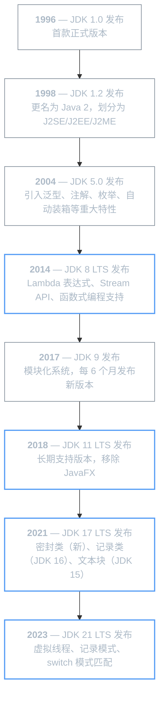
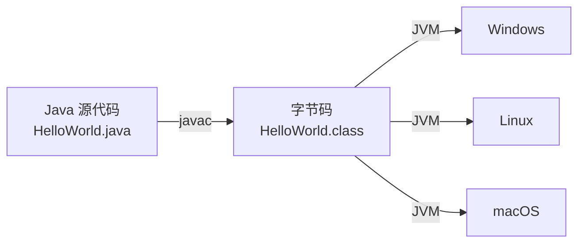
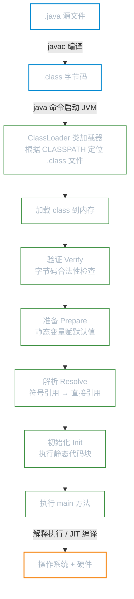

# Java 概述

Java 是一门广泛使用的面向对象编程语言，由 Sun Microsystems 于 1995 年发布，现由 Oracle 维护。它的核心理念是「一次编写，到处运行」（Write
Once, Run Anywhere），这得益于 Java 程序编译为字节码后在 `JVM`（Java Virtual Machine）上运行的机制。

**本文你会学到**：

- 🔍 Java 为什么被设计成跨平台语言——从它的诞生背景说起
- 🏗️ JavaSE / JavaEE / JavaME 分别面向什么场景
- ⚡ Java 凭什么在企业级开发中长盛不衰——核心语言特性
- 🛠️ 开发 Java 程序需要安装什么——JDK 与 JRE 的区别与选择
- 📝 如何写并运行第一个 Java 程序——编译、运行、public class 与 class 的区别
- ⚙️ Java 程序背后的执行原理——JVM 加载、链接、初始化到 JIT
- 💬 Java 程序中的三种注释写法

## 📜 Java 是怎么来的？

→ 了解 Java 的诞生背景，能帮你理解它为什么被设计成跨平台、安全、面向对象的语言。

### 诞生与早期发展（1991 - 1995）

Java 的起源可以追溯到 1991 年 Sun Microsystems 内部的 Green 项目。该项目最初的目标是为消费电子产品（如电视顶盒、PDA）开发一种小型编程语言，项目代号
`Oak`（以詹姆斯·高斯林办公室窗外的一棵橡树命名）。

随着互联网的兴起，Sun 团队发现 Oak 的跨平台特性非常适合 Web 应用开发。1995 年 5 月 23 日，Sun 正式对外发布 Java，同时推出了
`Applet` 技术，允许在浏览器中运行 Java 程序，这引发了业界的广泛关注。

### 版本演进

Java 的版本迭代经历了几个重要阶段：



!!! info "LTS 与非 LTS 版本"

    自 JDK 9 起，Java 采用 ==每 6 个月==发布一个新版本的快速迭代模式。其中部分版本被指定为 **LTS**（Long Term Support，长期支持版本），Oracle 会为其提供长达 8 年以上的更新支持。企业开发中通常优先选择 LTS 版本。

    | LTS 版本 | 发布时间 | 免费支持截止 |
    |---------|---------|------------|
    | JDK 8   | 2014 年 | 2030 年（Oracle）/ 无限期（社区） |
    | JDK 11  | 2018 年 | 2026 年 |
    | JDK 17  | 2021 年 | 2029 年 |
    | JDK 21  | 2023 年 | 2031 年 |

## 🏗️ JavaSE / JavaEE / JavaME 分别面向什么场景？

初学者常常困惑：为什么 Java 有好几个"版本"？它们到底有什么区别？其实这不是版本号的区别，而是**应用场景**的划分：

### JavaSE：所有 Java 开发的根基

`JavaSE`（Java Platform, Standard Edition，Java 标准版）是 Java 平台的基础，提供了 Java 语言的核心功能和基础 API。它是 JavaEE
和 JavaME 的根基，所有 Java 开发者都必须掌握。

JavaSE 包含的核心技术：

| 技术领域      | 核心模块                                     | 说明                                                     |
|-----------|------------------------------------------|--------------------------------------------------------|
| 语言基础      | `java.lang`                              | 基本类型包装、字符串、`Object`、异常体系、`Record`                      |
| 集合框架      | `java.util`                              | `List`、`Set`、`Map` 及其实现类、`SequencedCollection`（JDK 21） |
| I/O 与 NIO | `java.io` / `java.nio`                   | 文件读写、NIO 非阻塞 I/O、通道与缓冲区                                |
| 网络与 HTTP  | `java.net` / `java.net.http`             | `Socket`、`URL`、`HttpClient`（JDK 11+）、WebSocket         |
| 并发编程      | `java.util.concurrent`                   | 线程池、锁、并发集合、`VirtualThread`（JDK 21）                     |
| 数据库访问     | `java.sql` / `javax.sql`                 | JDBC API、数据源、连接池接口                                     |
| XML 处理    | `java.xml`                               | DOM、SAX、StAX、XSLT、XPath                                |
| 桌面 GUI    | `java.desktop`                           | AWT、Swing、Java 2D、打印、无障碍                               |
| 国际化       | `java.text`                              | 日期格式化、数字格式化、资源包                                        |
| 反射与模块     | `java.lang.reflect` / `java.lang.module` | 运行时类信息、模块描述符与解析                                        |
| 日志        | `java.util.logging`                      | 内置日志框架（JUL）                                            |
| 管理        | `java.management`                        | JMX（Java Management Extensions）API                     |

### JavaEE（Jakarta EE）：企业级分布式应用

`JavaEE`（Java Platform, Enterprise Edition，Java 企业版）是面向大规模分布式企业级应用的平台规范。2017 年，Oracle 将 JavaEE
捐赠给 Eclipse 基金会，更名为 `Jakarta EE`。伴随更名，所有 API 的包名从 `javax.*` 迁移到了 `jakarta.*`（从 Jakarta EE 9 开始）。

Jakarta EE 定义了一系列企业级开发规范（==不是具体实现==），常见规范包括：

| 规范                                       | 说明               |
|------------------------------------------|------------------|
| `Servlet`                                | Web 应用请求/响应处理标准  |
| `JPA`（Jakarta Persistence API）           | 对象关系映射（ORM）规范    |
| `JAX-RS`                                 | RESTful Web 服务规范 |
| `CDI`（Contexts and Dependency Injection） | 依赖注入规范           |
| `WebSocket`                              | WebSocket 通信规范   |
| `Bean Validation`                        | 数据校验规范           |

!!! info "Jakarta EE vs Spring"

    Jakarta EE 是官方标准规范，而 `Spring Framework` 是生态中最流行的第三方实现。实际开发中，Spring Boot 已成为企业级 Java 开发的事实标准，它简化了 Jakarta EE 规范的使用方式，提供了自动配置、开箱即用的开发体验。

### JavaME：嵌入式与资源受限设备

`JavaME`（Java Platform, Micro Edition，Java 微型版）面向资源受限的嵌入式设备和移动设备。在 Android 问世之前，JavaME
曾是手机应用开发的主流平台。

随着智能手机的普及和 Android（基于 Java 语言的移动操作系统）的崛起，JavaME 逐渐退出了主流开发领域。当前 JavaME 主要用于：

- 物联网（IoT）设备
- 智能卡（SIM 卡、银行卡）
- 嵌入式系统

### 三个版本如何分工？

```
Java 平台
├── JavaSE（基础版）     ← 所有 Java 开发的根基
│   └── Java 语言核心 + 基础类库 + JVM
├── JavaEE / Jakarta EE（企业版）
│   └── 在 JavaSE 基础上扩展企业级 API
│       （Servlet、JPA、JAX-RS、CDI ...）
└── JavaME（微型版）
    └── 在 JavaSE 基础上裁剪，适配受限设备
```

???+ tip "我应该从哪个版本开始学习？"

    推荐从 **JDK 21** 开始学习。它是当前最新的 LTS 版本，正式引入了虚拟线程、记录模式、switch 模式匹配等现代特性，代表了 Java 的发展方向。如果公司的生产环境仍在使用 JDK 8 或 11，建议先掌握 JDK 21，再了解旧版本差异即可。

## ⚡ Java 凭什么长盛不衰？——核心语言特性

Java 自 1995 年发布至今仍是企业级开发的主流选择，这并非偶然。以下特性解释了为什么大型系统偏爱 Java：

### 跨平台性

Java 程序编译后生成的不是机器码，而是 ==字节码==（`.class` 文件）。字节码由 `JVM` 解释执行，不同操作系统上有对应的 JVM
实现，因此同一份字节码可以在 Windows、Linux、macOS 上运行。

💡 这就是 Java「一次编写，到处运行」的核心秘密。



### 面向对象

面向过程的代码随着规模增长会越来越难维护——数据和逻辑分散各处，修改牵一发而动全身。面向对象（OOP）通过「类」把数据与行为封装在一起，让代码更易组织和复用。

Java 是一门纯面向对象语言（相比 C++ 的混合范式），所有代码都必须写在类中，原生支持三大核心特性：

- **封装**：用访问修饰符（`private` / `public`）控制数据可见性，隐藏内部实现细节
- **继承**：子类（`extends`）复用父类的属性和方法，减少重复代码
- **多态**：子类可重写（`@Override`）父类方法，同一接口表现出不同行为

### 自动内存管理

Java 通过 `GC`（Garbage Collector，垃圾回收器）自动管理内存，开发者无需手动分配和释放内存。JVM 会自动识别不再被引用的对象并回收其占用的内存空间。

🎯 你不用像 C/C++ 那样手动 `malloc`/`free`，减少了内存泄漏和悬空指针的风险。

### 强类型与安全性

当你写出 `int age = "hello"` 时，Java 编译器会立即报错，而不是等到运行时才崩溃——这就是强类型的价值：把问题尽量消灭在编译期。

Java 是强类型语言，每个变量都必须声明类型，编译器会在运行前进行严格检查，及早发现大量潜在错误。安全性方面，JVM 提供多层保护：

- **字节码验证**：类加载时检查字节码合法性，拒绝格式非法的代码执行
- **类加载隔离**：不同类加载器加载的类相互隔离，防止命名冲突和越权访问
- **模块系统**（JDK 9+）：通过 `module-info.java` 显式声明对外暴露的包，收紧封装边界

### 丰富的生态系统

Java 拥有成熟的生态系统：

- **构建工具**：Maven、Gradle
- **框架**：Spring Boot、Spring Cloud、MyBatis、Hibernate
- **中间件**：Tomcat、Kafka、Elasticsearch
- **包管理**：Maven Central（百万级开源库）

📌 这意味着你遇到的绝大多数问题，社区都有成熟的解决方案。

## 🛠️ 开发 Java 需要什么？——JDK 与 JRE

想写 Java 程序，第一步就会遇到一个问题：到底该安装什么？你会看到 JDK、JRE、OpenJDK 等一堆名词。别慌，它们的关系其实很简单。

### JDK：开发者的完整工具箱

`JDK`（Java Development Kit，Java 开发工具包）是 Java 开发者所需的完整工具集，包含了编写、编译和运行 Java 程序所需的一切。主要组成包括：

| 组件        | 说明                                     |
|-----------|----------------------------------------|
| `javac`   | Java 编译器，将 `.java` 源代码编译为 `.class` 字节码 |
| `java`    | Java 应用启动器，启动 JVM 并执行程序                |
| `javadoc` | 文档生成工具，从源代码注释生成 HTML 文档                |
| `jar`     | 打包工具，将 `.class` 文件打包为 `.jar` 归档        |
| `jdb`     | Java 调试器                               |
| `jps`     | JVM 进程查看工具                             |
| `jstat`   | JVM 统计监控工具                             |

### JRE：只运行不开发的最小环境

`JRE`（Java Runtime Environment，Java 运行环境）是运行 Java 程序所需的最小环境，包含 JVM 和 Java 核心类库，但==不包含==编译器和调试工具。

普通用户只需要安装 JRE 即可运行 Java 程序，而开发者需要安装完整的 JDK。

### JDK 与 JRE 的关系

```
JDK
├── JRE
│   ├── JVM（Java 虚拟机）
│   └── Java 核心类库（rt.jar、resources.jar 等）
├── 开发工具（javac、javadoc、jar、jdb ...）
└── 其他资源文件
```

!!! tip "现代 JDK 的变化"

    从 JDK 11 开始，Oracle 不再单独发布 JRE。OpenJDK 社区的 `jlink` 工具允许开发者自定义精简运行时，只包含应用所需的模块，替代了传统 JRE 的角色。

### 环境安装

=== "Windows"

    1. 下载 JDK：访问 [Adoptium](https://adoptium.net/)（推荐）或 Oracle 官网，选择 LTS 版本
    2. 运行安装程序，按向导完成安装
    3. 配置环境变量：

    ```powershell
    # 新增系统变量 JAVA_HOME，指向 JDK 安装目录
    $env:JAVA_HOME = "C:\Program Files\Eclipse Adoptium\jdk-21"

    # 将 JDK bin 目录添加到 Path（追加到现有 Path 之后）
    $env:Path += ";%JAVA_HOME%\bin"
    ```

    4. 验证安装：

    ```powershell
    java -version
    javac -version
    ```

=== "Linux（Ubuntu/Debian）"

    ```bash
    # 使用 apt 安装（以 JDK 21 为例）
    sudo apt update
    sudo apt install -y temurin-21-jdk

    # 验证
    java -version
    javac -version
    ```

=== "macOS"

    ```bash
    # 使用 Homebrew 安装
    brew install --cask temurin@21

    # 验证
    java -version
    javac -version
    ```

!!! tip "推荐发行版"

    除了 Oracle JDK，社区提供了多个高质量的开发行版，它们都基于 OpenJDK 构建：

    | 发行版 | 维护者 | 特点 |
    |--------|--------|------|
    | Eclipse Temurin | Eclipse 基金会 | Adoptium 项目出品，企业推荐 |
    | Amazon Corretto | Amazon | AWS 优化，长期免费 |
    | GraalVM CE | Oracle Labs | 支持 AOT 编译，启动极快 |

## 📝 第一个 Java 程序

安装好 JDK 后，来写一个最简单的 Java 程序，感受从源代码到输出结果的完整过程。

### HelloWorld 源代码

新建一个文件，命名为 `HelloWorld.java`（**文件名必须与 `public class` 名完全一致**），输入以下内容：

``` java title="HelloWorld.java"
// 单行注释：这是程序入口类
public class HelloWorld {

    /**
     * javadoc 注释：程序入口方法
     * 可用 javadoc 命令将此类注释生成 HTML 格式的 API 文档
     */
    public static void main(String[] args) {
        /* 多行注释 */
        System.out.println("Hello, World!");
    }
}
```

### public class 与 class 的区别

一个 `.java` 文件中可以定义多个 `class`，但有一条强制规则：

- 如果有 `public class`，**类名必须与文件名完全一致**
- 一个文件中**最多只能有一个** `public class`（也可以没有）
- 每个 `class` 编译后都会生成一个独立的 `.class` 文件
- 每个 `class` 都可以有自己的 `main` 方法，执行哪个取决于 `java` 命令后跟的类名

``` java title="同一文件中定义多个 class（文件名：Main.java）"
public class Main {
    public static void main(String[] args) {
        new Helper().greet();
    }
}

class Helper {           // 非 public，类名可以与文件名不同
    void greet() {
        System.out.println("Hello from Helper!");
    }
}
```

编译后会生成 `Main.class` 和 `Helper.class` 两个文件。

### 编译与运行

在 `.java` 文件所在目录打开终端，依次执行：

``` bash
# 编译：在当前目录生成 HelloWorld.class
javac HelloWorld.java

# 运行：跟类名，不带 .class 后缀
java HelloWorld
```

输出：

```
Hello, World!
```

!!! tip "容易踩的坑"

    - `java` 命令后跟**类名**，不是文件名，不要带 `.class` 后缀
    - 没有配置 `CLASSPATH` 时，JVM 默认从**当前目录**查找 `.class` 文件
    - 编译后删除 `.java` 源文件**不影响**程序运行，`.class` 才是执行依据

---

## ⚙️ Java 程序是怎么跑起来的？——程序执行流程

写完第一个程序后，很自然会想：`javac` 和 `java` 这两条命令背后究竟发生了什么？

### 编译阶段与运行阶段

Java 程序的执行跨越**两个阶段**，这两个阶段甚至可以在不同操作系统上完成：



**编译阶段**：`javac` 把 `.java` 源文件编译成 `.class` 字节码。字节码不是机器码，操作系统无法直接执行，只有 JVM 才能理解。

**运行阶段**：`java` 命令启动 JVM，JVM 内部按以下步骤处理字节码：

| 步骤               | 说明                                         |
|------------------|--------------------------------------------|
| 类加载（ClassLoader） | 根据 `CLASSPATH` 找到 `.class` 文件，读入内存         |
| 验证（Verify）       | 确保字节码符合 Java 规范，防止恶意代码执行                   |
| 准备（Prepare）      | 为静态变量分配内存，赋初始默认值（`int` 赋 `0`，引用类型赋 `null`） |
| 解析（Resolve）      | 将符号引用替换为内存中的直接地址                           |
| 初始化（Init）        | 执行静态代码块，对静态变量赋程序员指定的初值                     |
| 执行（Execute）      | 调用 `main` 方法，程序正式运行                        |
| 卸载（Unload）       | 程序结束，JVM 回收类占用的内存                          |

!!! tip "跨平台的本质"

    同一份 `.class` 字节码可以在 Windows、Linux、macOS 上运行，跨平台兼容由 **JVM 负责**，而不是源代码本身。只要目标平台安装了对应的 JVM，字节码就能运行。

### Java 是编译型还是解释型语言？

这是一道经典面试题，答案不是非此即彼——**Java 是两者的结合**：

| 语言类型 | 代表语言              | 特点                      |
|------|-------------------|-------------------------|
| 编译型  | C、C++、Go          | 源码一次编译成机器码，执行快，不跨平台     |
| 解释型  | Python、JavaScript | 运行时逐行翻译，跨平台好，执行相对较慢     |
| Java | —                 | **先编译成字节码，再由 JVM 解释执行** |

Java 的执行路径是：`源码 → 字节码（编译）→ 机器码（解释）`，两种机制都参与其中。

更进一步，现代 JVM（如 HotSpot）还引入了 `JIT`（Just-In-Time，即时编译）技术：

- `冷代码`（执行次数少）：逐条解释执行，省去编译开销
- `热点代码`（被频繁调用的方法）：JIT 将其编译为本地机器码并缓存，后续直接运行，性能接近 C/C++

💡 这种「解释 + JIT 编译」的混合模式，让 Java 在保持跨平台的同时，也具备了较高的执行效率。

---

## 💬 Java 程序中的三种注释

| 类型         | 写法            | 适用场景                                   |
|------------|---------------|----------------------------------------|
| 单行注释       | `// 注释内容`     | 行尾说明或单独占一行                             |
| 多行注释       | `/* 注释内容 */`  | 跨行说明，不可嵌套                              |
| javadoc 注释 | `/** 注释内容 */` | 类、方法、字段的 API 文档，可由 `javadoc` 命令生成 HTML |
