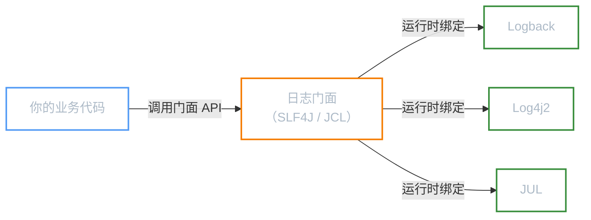
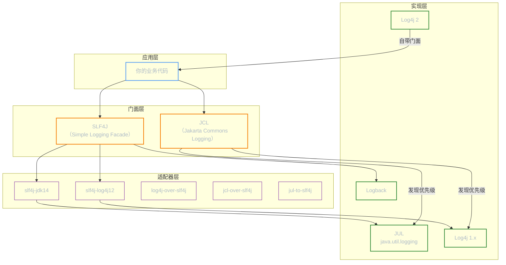
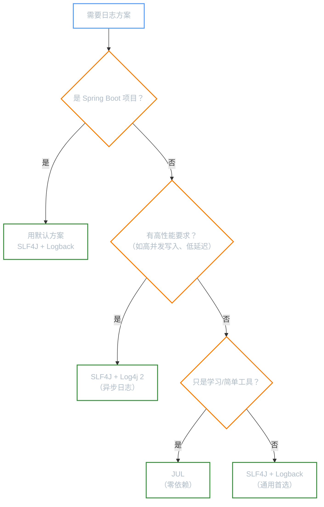

**本文你会学到**：

- 📋 日志框架到底解决了什么问题——从 `System.out.println()` 的痛点说起
- 🏗️ 门面模式如何让日志实现可插拔——一个遥控器控制所有电视
- 🗺️ Java 生态 6 大日志框架的定位与关系——谁是门面、谁是实现
- 🎯 不同场景下该怎么选——学习、新项目、Spring Boot、高性能各有答案

## 🤔 为什么需要日志框架？

当你写下第一行 `System.out.println("hello")` 时，一切看起来都很美好。但随着项目变大，你会发现它越来越力不从心：

- 🚫 不能控制级别——调试信息和错误信息混在一起，生产环境关不掉
- 🚫 不能格式化——每条日志都得手动拼接时间戳、类名
- 🚫 不能输出到文件——控制台一关，日志就没了
- 🚫 不能异步写入——大量日志拖慢业务线程

日志框架就是为解决这些问题而生的。它帮你搞定四件事：

| 核心能力 | 说明 | 类比 |
|---------|------|------|
| 内容格式化 | 自动添加时间戳、线程名、日志级别等信息 | 快递单自动打印收件人信息 |
| 输出位置控制 | 同时输出到控制台、文件、远程服务器等 | 快递分发到不同目的地 |
| 异步归档压缩 | 后台线程写日志，自动按日期/大小归档压缩 | 快递柜后台自动整理包裹 |
| 面向接口开发 | 业务代码只依赖日志接口，不耦合具体实现 | 你只管投递，不管谁派送 |

💡 一句话总结：日志框架 = 智能快递柜。你只管投递（调用日志 API），它负责分类、打包、投递到不同目的地。

## 🏗️ 门面模式

想象一下：你家里有电视、空调、音响，每个设备各带一个遥控器，每次操作要找对应的遥控器——这很烦。万能遥控器的思路是：你只按一个遥控器上的按钮，它负责把指令翻译成各品牌设备能理解的信号。

日志世界也是一样。Java 生态中存在多种日志实现（JUL、Log4j、Logback、Log4j2...），如果业务代码直接依赖某一个实现，将来想换就很痛苦——要改所有 `import` 和 API 调用。

**门面模式**的解决方案是：定义一套统一的日志接口（门面），业务代码只依赖这套接口，具体由哪个实现来干活，通过配置文件或依赖来决定。



🎯 核心价值：**解耦**。业务代码与日志实现之间通过门面接口隔离，更换底层实现无需修改任何业务代码。

## 🗺️ 日志框架全景图

Java 日志生态看起来框架很多，但只要分清「门面」和「实现」两个角色，就豁然开朗了：



各框架的定位简述：

| 框架 | 角色 | 说明 |
|------|------|------|
| `JUL` | 日志实现 | JDK 自带，零依赖，功能简单 |
| `Log4j 1.x` | 日志实现 | Apache 出品，已停止维护（EOL） |
| `Logback` | 日志实现 | Log4j 作者重写，Spring Boot 默认选择 |
| `Log4j 2` | 门面 + 实现 | Apache 新一代，支持异步日志，性能优秀 |
| `JCL` | 日志门面 | Apache Commons 项目，Spring 早期使用 |
| `SLF4J` | 日志门面 | 当前主流门面，Logback 作者设计 |

## 📊 框架对比

### 核心特性对比

| 框架 | 类型 | 核心组件 | 默认级别 | 适用场景 |
|------|------|---------|---------|---------|
| `JUL` | 日志实现 | `Logger` / `Handler` / `Formatter` | `INFO` | 学习/简单应用 |
| `Log4j` | 日志实现 | `Logger` / `Appender` / `Layout` | `DEBUG` | 遗留项目 |
| `Logback` | 日志实现 | `Logger` / `Appender` / `Layout` | `DEBUG` | Spring Boot 默认 |
| `Log4j 2` | 门面 + 实现 | `Logger` / `Appender` / `Layout` | `DEBUG` | 高性能场景 |
| `JCL` | 日志门面 | `Log` / `LogFactory` | — | Spring 早期 |
| `SLF4J` | 日志门面 | `Logger` / `LoggerFactory` | — | 当前主流 |

### 日志级别对比

不同框架对日志级别的命名存在差异。以下对照表帮你快速对应：

| 级别含义 | `JUL` | `Log4j` / `Logback` / `Log4j 2` | `SLF4J` |
|---------|-------|--------------------------------|---------|
| 严重错误 | `SEVERE` | `ERROR` / `FATAL` | `ERROR` |
| 警告 | `WARNING` | `WARN` | `WARN` |
| 一般信息 | `INFO` | `INFO` | `INFO` |
| 调试信息 | `FINE` / `FINER` / `FINEST` | `DEBUG` / `TRACE` | `DEBUG` / `TRACE` |

📌 注意：`JUL` 的级别命名来自 `java.util.logging.Level`，与其他框架差异最大。通过 SLF4J 桥接后，这些差异会被自动转换。

## 🎯 选型指南

不同场景的推荐组合：

| 场景 | 推荐方案 | 理由 |
|------|---------|------|
| 学习日志基础 | `JUL` | JDK 自带，零依赖，适合理解核心概念 |
| 新项目（非 Spring Boot） | `SLF4J` + `Logback` | 成熟稳定，文档丰富，社区主流 |
| Spring Boot 项目 | 默认即可（`SLF4J` + `Logback`） | 开箱即用，无需额外配置 |
| 高性能要求 | `SLF4J` + `Log4j 2` | 异步日志性能出色，吞吐量更高 |

选型决策流程图：



!!! warning "常见错误：直接依赖日志实现"
    新手常犯的错误是直接在代码中 `import` 具体日志实现（如 `ch.qos.logback.classic.Logger`），而不是通过门面接口（如 `org.slf4j.Logger`）。这会把你锁死在某个实现上，将来想换就得大面积改代码。

    ```java
    // ❌ 错误：直接依赖 Logback 实现
    import ch.qos.logback.classic.Logger;

    // ✅ 正确：依赖 SLF4J 门面接口
    import org.slf4j.Logger;
    import org.slf4j.LoggerFactory;
    ```

    记住一条原则：**业务代码中只出现门面的 `import`，永远不要出现具体实现的 `import`**。
