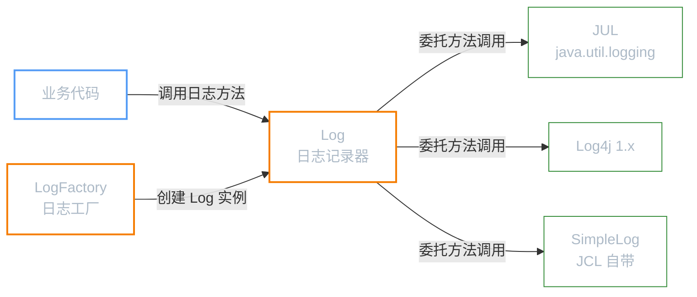
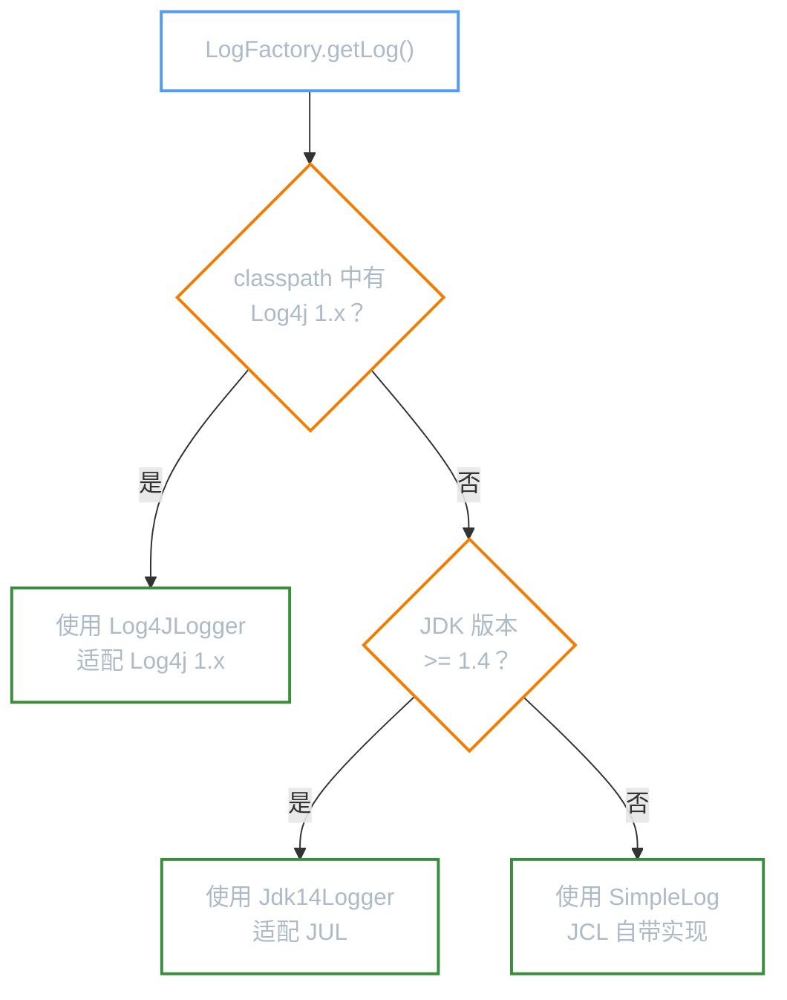

**前置知识**：如果你还不了解日志门面模式的概念，请先阅读「日志框架」。

**本文你会学到**：

- JCL 在 Java 日志生态中的角色——为什么它曾是最流行的门面，后来又被 SLF4J 取代
- `Log` 和 `LogFactory` 两个核心组件如何分工协作
- 6 个日志级别方法的使用方式和对应关系
- 从零开始用 JCL 输出日志——默认使用 JUL 的行为
- 添加 Log4j 依赖即可自动切换底层实现——JCL 的自动发现魔法
- `LogFactory` 按优先级查找日志实现的完整机制（源码级别分析）

## 🤔 JCL 的角色

当你需要在项目中选择一个日志门面时，SLF4J 几乎是默认答案。但在 SLF4J 诞生之前，JCL（Jakarta Commons Logging，后更名为 Apache Commons Logging）是 Java 世界最广泛使用的日志门面。Spring Framework 1.x ~ 4.x 的内部日志就依赖 JCL。

JCL 的核心设计思路很简单：

- 定义一套统一的日志接口（`org.apache.commons.logging.Log`）
- 运行时通过 `LogFactory` 自动探测 classpath 中可用的日志实现
- 业务代码只依赖 JCL 接口，无需关心底层是 JUL、Log4j 还是其他框架

但 JCL 有几个致命问题，最终导致它被 SLF4J 取代：

| 问题 | 说明 |
|------|------|
| **类加载器冲突** | `LogFactory` 的发现机制依赖 `ClassLoader`，在 Tomcat、OSGi 等复杂类加载器环境下经常出错，导致 `ClassNotFoundException` 或 `NoClassDefFoundError` |
| **运行时绑定** | JCL 在运行时通过反射探测实现类，绑定发生在每次获取 `Log` 实例时，带来性能开销 |
| **绑定机制不灵活** | 无法通过配置文件显式指定绑定关系，只能依赖 classpath 扫描，排错困难 |
| **自带 SimpleLog** | JCL jar 包自带了一个功能很弱的 `SimpleLog` 实现，容易与真正的日志实现混淆 |

!!! info "JCL 的现状"

    Apache Commons Logging 仍在维护（最新版本 1.3.x），主要用于 Spring Framework 等遗留项目。新项目请使用 SLF4J。Spring Boot 从 1.4 版本起通过 `jcl-over-slf4j` 桥接器将 JCL 调用重定向到 SLF4J。

## 🧱 核心组件

JCL 只有两组核心 API，极其简洁：



### Log：日志记录器

`org.apache.commons.logging.Log` 是日志门面接口，定义了 6 个日志级别方法。它的实现类充当**适配器**，将 JCL 的方法调用翻译成底层日志框架的 API 调用：

| 实现类 | 适配的底层框架 | 说明 |
|--------|--------------|------|
| `Jdk14Logger` | JUL（`java.util.logging`） | JDK 自带，无需额外依赖 |
| `Log4JLogger` | Log4j 1.x | 需要引入 `log4j` 依赖 |
| `SimpleLog` | JCL 自带（基于 `System.err`） | 功能最弱，仅输出到控制台 |

业务代码只与 `Log` 接口交互，不直接接触任何实现类。

### LogFactory：日志工厂

`org.apache.commons.logging.LogFactory` 是工厂类，负责创建 `Log` 实例。它的核心工作是**自动发现**——在运行时扫描 classpath，找到可用的日志实现，然后返回对应的 `Log` 实现类。

``` java title="获取 Log 实例的标准方式"
import org.apache.commons.logging.Log;
import org.apache.commons.logging.LogFactory;

// 传入 Class 对象，以类名作为 Logger 名称
Log log = LogFactory.getLog(MyClass.class);
```

`LogFactory.getLog()` 的发现过程是 JCL 最核心也是最容易出问题的机制，详见「执行过程」章节。

## 📝 日志方法

`Log` 接口定义了 6 个日志级别方法，从低到高排列：

| 方法 | 说明 | 对应 Log4j 级别 | 对应 JUL 级别 |
|------|------|----------------|--------------|
| `trace(message)` | 最详细的调试信息 | `TRACE` | `FINER` |
| `debug(message)` | 开发阶段调试信息 | `DEBUG` | `FINE` |
| `info(message)` | 程序运行的关键节点信息 | `INFO` | `INFO` |
| `warn(message)` | 潜在问题警告 | `WARN` | `WARNING` |
| `error(message)` | 错误但程序可继续运行 | `ERROR` | `SEVERE` |
| `fatal(message)` | 严重错误，程序可能终止 | `FATAL` | `SEVERE` |

每个级别方法都有对应的布尔判断方法（如 `isDebugEnabled()`），用于在日志参数计算昂贵时避免不必要的开销：

``` java title="使用 isXxxEnabled() 避免性能浪费"
Log log = LogFactory.getLog(MyClass.class);

// ❌ 不推荐：无论日志是否输出，都会执行字符串拼接
log.debug("查询结果: " + largeResultSet.toString());

// ✅ 推荐：先检查级别，避免无效计算
if (log.isDebugEnabled()) {
    log.debug("查询结果: " + largeResultSet.toString());
}
```

## 🚀 快速上手

### 引入依赖

JCL 只需要一个依赖：

``` xml title="pom.xml 引入 JCL"
<dependency>
    <groupId>commons-logging</groupId>
    <artifactId>commons-logging</artifactId>
    <version>1.3.4</version>
</dependency>
```

!!! info "不需要额外依赖"

    与 SLF4J 不同，JCL 自带了 `SimpleLog` 作为兜底实现。即使 classpath 中没有任何日志框架，JCL 也能正常工作——只是输出功能很弱。

### 默认行为：使用 JUL 输出

当 classpath 中只有 JCL 时，`LogFactory` 会选择 `Jdk14Logger`（适配 JUL）作为实现。这意味着默认情况下，JCL 的日志行为完全由 JUL 的配置决定：

``` java title="JCL 基本用法 — 默认使用 JUL" hl_lines="5-6 9-14"
--8<-- "code/java/javase/logging/jcl-demo/src/test/java/com/luguosong/jcl/JclBasicTest.java"
```

项目中有完整的可运行示例，路径为 `code/java/javase/logging/jcl-demo/`。

运行后会看到 `trace` 和 `debug` 级别的日志没有输出——这是因为 JUL 的默认级别是 `INFO`，`Jdk14Logger` 适配器遵循了这个设置。

### 确认实际实现类

想确认 JCL 实际使用了哪个日志实现？打印 `Log` 实例的类名即可：

``` java title="查看 JCL 选择的日志实现"
Log log = LogFactory.getLog(MyClass.class);
System.out.println("实现类: " + log.getClass().getName());
// 仅 JCL 时输出: org.apache.commons.logging.impl.Jdk14Logger
// 添加 Log4j 后输出: org.apache.commons.logging.impl.Log4JLogger
```

## 🔗 整合 Log4j

JCL 最大的卖点之一是：**只需添加 Log4j 依赖，无需改任何代码**，日志实现就自动切换。

### 第一步：添加 Log4j 依赖

在 pom.xml 中追加 Log4j 1.x 依赖：

``` xml title="pom.xml 添加 Log4j 依赖"
<!-- JCL 门面 -->
<dependency>
    <groupId>commons-logging</groupId>
    <artifactId>commons-logging</artifactId>
    <version>1.3.4</version>
</dependency>
<!-- Log4j 实现 -->
<dependency>
    <groupId>log4j</groupId>
    <artifactId>log4j</artifactId>
    <version>1.2.17</version>
</dependency>
```

### 第二步：配置 log4j.properties

在 `src/test/resources/` 下创建 `log4j.properties`：

``` properties title="log4j.properties 最简配置"
log4j.rootLogger=DEBUG, console
log4j.appender.console=org.apache.log4j.ConsoleAppender
log4j.appender.console.Target=System.out
log4j.appender.console.layout=org.apache.log4j.PatternLayout
log4j.appender.console.layout.ConversionPattern=%d{HH:mm:ss} %-5p %c - %m%n
```

### 第三步：无需改代码

业务代码不需要任何修改。再次运行同样的代码，你会发现：

1. `Log` 实现类从 `Jdk14Logger` 变成了 `Log4JLogger`
2. 日志格式变成了 Log4j 的 `PatternLayout` 格式
3. `trace` 和 `debug` 级别的日志现在也能输出了（因为 Log4j 默认级别是 `DEBUG`）

这就是门面模式的核心价值——**切换实现不需要改业务代码**。

## 🔄 执行过程

JCL 的自动发现机制藏在 `LogFactory` 的实现中。当你调用 `LogFactory.getLog(MyClass.class)` 时，`LogFactory` 会按以下优先级查找日志实现：



### 发现机制源码分析

`LogFactory` 的核心逻辑在 `getLog()` 方法中（简化版）：

``` java title="LogFactory 发现机制（简化源码）"
public Log getInstance(Class clazz) throws LogConfigurationException {
    // 1. 尝试获取用户指定的 Log 实现类
    //    通过系统属性 org.apache.commons.logging.Log 指定
    String specifiedClass = getSystemProperty("org.apache.commons.logging.Log", null);

    if (specifiedClass != null) {
        return createLog(specifiedClass, clazz);
    }

    // 2. 按优先级探测可用的日志实现
    //    优先级：Log4j → JUL → SimpleLog
    for (String candidate : DISCOVERY_ORDER) {
        Log log = tryCreateLog(candidate, clazz);
        if (log != null) {
            return log;
        }
    }

    // 3. 所有探测都失败，使用 SimpleLog 兜底
    return new SimpleLog(clazz.getName());
}
```

探测顺序（`DISCOVERY_ORDER`）：

| 优先级 | 候选实现类 | 探测方式 |
|--------|----------|---------|
| 1 | `org.apache.commons.logging.impl.Log4JLogger` | 反射检查 `org.apache.log4j.Priority` 是否存在 |
| 2 | `org.apache.commons.logging.impl.Jdk14Logger` | 检查 `java.util.logging.Logger` 是否可用（JDK 1.4+ 始终为 true） |
| 3 | `org.apache.commons.logging.impl.SimpleLog` | 兜底实现，始终可用 |

### JCL 的局限性

从源码可以看到 JCL 的几个根本问题：

**1. 类加载器地狱**

`LogFactory` 使用 `ClassLoader.loadClass()` 来探测实现类。在 Tomcat 这种 Web 容器中，应用的 ClassLoader 和 JCL 的 ClassLoader 可能不同，导致：

- 明明有 Log4j 依赖，却探测不到（因为不同的 ClassLoader）
- 应用中存在多个 JCL 副本，每个绑定到不同的日志实现

**2. 运行时反射开销**

每次调用 `LogFactory.getLog()` 都可能触发反射探测（虽然有缓存机制，但首次调用的开销不可避免）。相比之下，SLF4J 在类加载时就确定了绑定关系。

**3. 无法显式指定绑定**

JCL 只能通过系统属性 `org.apache.commons.logging.Log` 来覆盖绑定，没有像 SLF4J 的 `slf4j-static-marker.jar` 那样的编译期绑定机制。这意味着你无法在编译时就发现绑定错误。

!!! tip "Spring Boot 的解决方案"

    Spring Boot 通过 `jcl-over-slf4j` 桥接器解决了 JCL 的问题。这个库提供了与 JCL 完全相同的 API（`org.apache.commons.logging.Log`），但将所有调用重定向到 SLF4J。这样既保持了与遗留代码的兼容性，又享受了 SLF4J 的稳定绑定机制。
