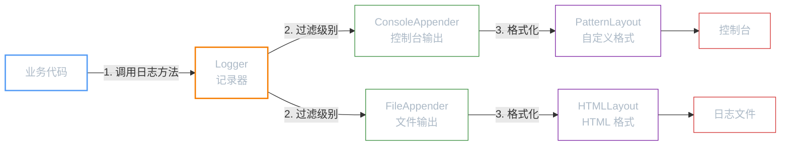
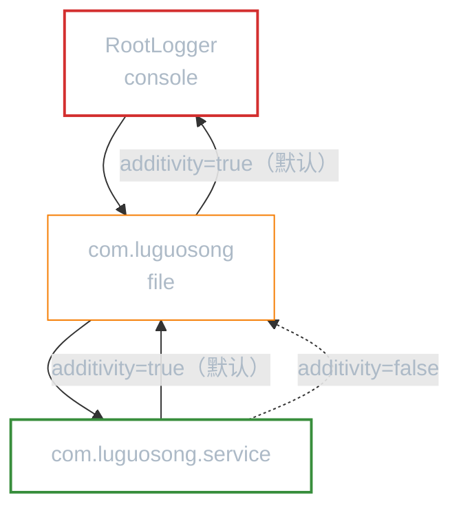

**前置知识**：如果你还不了解日志框架的基本概念和 Java 日志生态全景，请先阅读「日志框架」和「JUL」。

**本文你会学到**：

- Log4j 1.x 的三大核心组件：`Logger`、`Appender`、`Layout` 如何协作
- 8 个日志级别从 `OFF` 到 `ALL` 的含义与继承机制
- 从 `log4j.properties` 到 `BasicConfigurator` 的多种配置方式
- 5 种 Appender（控制台、文件、按大小拆分、按时间拆分、数据库）的实战配置
- `PatternLayout` 占位符的完整用法
- 自定义 Logger 和 `additivity` 机制解决日志重复输出问题

## 📜 Log4j 的历史地位

当你听到「Log4j」时，可能会想到 2021 年底震惊业界的 Log4Shell 漏洞。但那个漏洞属于 **Log4j 2**——我们这里讨论的是它的前身 **Log4j 1.x**，一个诞生于 1999 年的 Apache 开源项目。

Log4j 1.x 是 Java 日志世界的奠基者。它首创了「`Logger` → `Appender` → `Layout`」三层架构，后来的 Logback、Log4j 2 都沿用了这套设计。可以说，理解了 Log4j 1.x，其他日志框架的架构你也能举一反三。

但现实是：**Log4j 1.x 已于 2015 年停止维护（EOL）**，Spring Boot 从 1.4 版本起也不再支持它。既然已经过时，为什么还要学？

- **理解设计模式**：`Logger` → `Appender` → `Layout` 是经典的职责分离设计，学习它能加深对架构设计的理解
- **维护遗留系统**：很多老项目仍在使用 Log4j 1.x，了解它有助于排查问题
- **学习曲线的跳板**：掌握了 Log4j 1.x 的概念，学习 Logback 和 Log4j 2 会事半功倍

## 🧱 核心组件

Log4j 1.x 的架构围绕三个核心组件展开。如果你读过「JUL」，会发现它们与 JUL 的 `Logger` → `Handler` → `Formatter` 高度相似：



三大组件的职责：

| 组件 | 类比 | 职责 |
|------|------|------|
| `Logger` | 快递员 | 接收业务代码的日志请求，是日志系统的入口 |
| `Appender` | 分拣中心 | 决定日志发往哪里（控制台、文件、数据库等） |
| `Layout` | 打包员 | 将日志事件格式化为最终输出文本 |

### Loggers（记录器）

`Logger` 是你代码中直接交互的对象。获取方式与 JUL 类似：

``` java title="获取 Logger 实例"
import org.apache.log4j.Logger;

// 推荐方式：用类名作为 Logger 名称
Logger logger = Logger.getLogger(MyClass.class.getName());
```

Log4j 1.x 中有一个特殊的 `RootLogger`，它是所有 Logger 层级树的根节点，通过 `Logger.getRootLogger()` 获取。`RootLogger` 的配置对所有 Logger 生效，相当于全局默认配置。

### Appenders（输出控制器）

`Appender` 决定日志输出到哪里。Log4j 1.x 提供了 5 种常用 Appender：

| Appender | 说明 |
|----------|------|
| `ConsoleAppender` | 输出到控制台（`System.out` 或 `System.err`） |
| `FileAppender` | 输出到文件 |
| `DailyRollingFileAppender` | 按时间拆分日志文件 |
| `RollingFileAppender` | 按文件大小拆分日志文件 |
| `JDBCAppender` | 持久化到数据库 |

### Layout（格式化器）

`Layout` 负责将日志事件转换为字符串。Log4j 1.x 提供了 3 种 Layout：

| Layout | 说明 |
|--------|------|
| `HTMLLayout` | 输出为 HTML 表格格式 |
| `SimpleLayout` | 仅包含级别和消息（`LEVEL - message`） |
| `PatternLayout` | 通过占位符自定义格式（最常用） |

实际开发中几乎都使用 `PatternLayout`，它通过 `ConversionPattern` 配置灵活的输出格式（详见「格式化器」章节）。

## 📊 日志级别

Log4j 1.x 定义了 5 个标准级别，外加 `OFF` 和 `ALL` 两个特殊值：

| 级别 | 说明 |
|------|------|
| `OFF` | 关闭所有日志（最高级别，不输出任何日志） |
| `FATAL` | 致命错误，程序无法继续运行 |
| `ERROR` | 错误信息，不影响程序继续运行 |
| `WARN` | 警告信息，表示潜在问题 |
| `INFO` | 一般信息 |
| `DEBUG` | 调试信息（**默认级别**） |
| `TRACE` | 最详细的调试信息（Log4j 1.2.12 引入） |
| `ALL` | 输出所有日志（最低级别） |

**级别继承机制**：Logger 按名称层级自动形成父子关系（与 JUL 相同）。子 Logger 如果没有显式设置级别，会从父 Logger 继承。最终追溯到 `RootLogger` 的级别——默认为 `DEBUG`。

## 🚀 快速上手

### Maven 依赖引入

``` xml title="pom.xml 中引入 Log4j 1.x"
<dependency>
    <groupId>log4j</groupId>
    <artifactId>log4j</artifactId>
    <version>1.2.17</version>
</dependency>
```

!!! warning "仅用于学习"

    Log4j 1.x 已停止维护，生产环境请使用 Logback 或 Log4j 2。这里使用 `1.2.17` 版本仅用于学习核心概念。

### BasicConfigurator：无需配置文件的快速启动

当你没有提供任何配置文件时，Log4j 不会输出任何日志。最简单的解决方式是调用 `BasicConfigurator.configure()`：

``` java title="BasicConfigurator.configure() 的作用"
import org.apache.log4j.BasicConfigurator;
import org.apache.log4j.Logger;

// 使用默认配置：RootLogger 输出到控制台，使用 PatternLayout
BasicConfigurator.configure();

Logger logger = Logger.getLogger("com.luguosong");
logger.info("BasicConfigurator 会自动配置一个 ConsoleAppender");
```

`BasicConfigurator.configure()` 做了三件事：

1. 为 `RootLogger` 添加一个 `ConsoleAppender`
2. 设置 `PatternLayout`，格式为 `%r [%t] %p %c %x - %m%n`
3. 设置 `RootLogger` 级别为 `DEBUG`

### 完整示例

``` java title="Log4j 基本用法" hl_lines="6-10"
--8<-- "code/java/javase/logging/log4j-demo/src/test/java/com/luguosong/log4j/Log4jBasicTest.java"
```

项目中有完整的可运行示例，路径为 `code/java/javase/logging/log4j-demo/`。

## ⚙️ 配置详解

实际开发中不会使用 `BasicConfigurator`，而是通过 `log4j.properties` 配置文件来管理日志行为。Log4j 1.x 会在 classpath 下自动查找 `log4j.properties` 或 `log4j.xml`。

### log4j.properties 语法

配置文件的核心语法可以归纳为三条规则：

``` properties title="log4j.properties 基本语法"
# 规则一：配置 RootLogger（级别 + Appender 列表）
log4j.rootLogger=DEBUG, console, file

# 规则二：配置 Appender（类型 + 参数）
log4j.appender.console=org.apache.log4j.ConsoleAppender
log4j.appender.console.Target=System.out

# 规则三：配置 Layout（格式化器 + 格式模板）
log4j.appender.console.layout=org.apache.log4j.PatternLayout
log4j.appender.console.layout.ConversionPattern=%d{yyyy-MM-dd HH:mm:ss} %-5p %c{1}:%L - %m%n
```

本项目的默认配置文件：

``` properties title="log4j.properties 默认配置"
--8<-- "code/java/javase/logging/log4j-demo/src/test/resources/log4j.properties"
```

### 输出到控制台

`ConsoleAppender` 是最简单的 Appender，将日志输出到 `System.out` 或 `System.err`：

``` properties title="ConsoleAppender 配置"
log4j.appender.console=org.apache.log4j.ConsoleAppender
log4j.appender.console.Target=System.out
log4j.appender.console.layout=org.apache.log4j.PatternLayout
log4j.appender.console.layout.ConversionPattern=%d{yyyy-MM-dd HH:mm:ss} %-5p %c{1}:%L - %m%n
```

| 配置项 | 说明 |
|-------|------|
| `Target` | 输出目标：`System.out`（默认）或 `System.err` |
| `layout` | 格式化器，通常使用 `PatternLayout` |

### 输出到文件

`FileAppender` 将日志写入文件，适合持久化保存：

``` properties title="FileAppender 配置"
log4j.appender.file=org.apache.log4j.FileAppender
log4j.appender.file.File=logs/application.log
log4j.appender.file.Append=true
log4j.appender.file.Encoding=UTF-8
log4j.appender.file.layout=org.apache.log4j.PatternLayout
log4j.appender.file.layout.ConversionPattern=%d{yyyy-MM-dd HH:mm:ss} %-5p %c:%L - %m%n
```

| 配置项 | 说明 |
|-------|------|
| `File` | 日志文件路径（相对路径相对于项目根目录） |
| `Append` | `true` = 追加模式（默认），`false` = 每次启动覆盖 |
| `Encoding` | 文件编码，推荐 `UTF-8` |

!!! warning "FileAppender 的问题"

    `FileAppender` 会把所有日志写入同一个文件，随着时间推移文件会越来越大，最终变得难以打开和检索。实际项目中应使用 `RollingFileAppender` 或 `DailyRollingFileAppender` 来自动拆分日志。

### 按文件大小拆分

`RollingFileAppender` 在日志文件达到指定大小时自动创建新文件，保留固定数量的备份：

``` properties title="RollingFileAppender 配置"
log4j.appender.rolling=org.apache.log4j.RollingFileAppender
log4j.appender.rolling.File=logs/application.log
log4j.appender.rolling.MaxFileSize=10MB
log4j.appender.rolling.MaxBackupIndex=5
log4j.appender.rolling.layout=org.apache.log4j.PatternLayout
log4j.appender.rolling.layout.ConversionPattern=%d{yyyy-MM-dd HH:mm:ss} %-5p %c:%L - %m%n
```

| 配置项 | 说明 |
|-------|------|
| `MaxFileSize` | 单个日志文件的最大大小（如 `10MB`、`1GB`） |
| `MaxBackupIndex` | 保留的备份文件数量（如 `5` 表示最多保留 `application.log.1` 到 `application.log.5`） |

文件滚动过程：当 `application.log` 达到 `10MB` 时，`application.log.1` 重命名为 `application.log.2`，原文件重命名为 `application.log.1`，然后创建新的空 `application.log`。

### 按时间拆分

`DailyRollingFileAppender` 按时间周期自动创建新文件，适合按天归档日志：

``` properties title="DailyRollingFileAppender 配置"
log4j.appender.daily=org.apache.log4j.DailyRollingFileAppender
log4j.appender.daily.File=logs/application.log
log4j.appender.daily.DatePattern='.'yyyy-MM-dd
log4j.appender.daily.layout=org.apache.log4j.PatternLayout
log4j.appender.daily.layout.ConversionPattern=%d{yyyy-MM-dd HH:mm:ss} %-5p %c:%L - %m%n
```

| `DatePattern` 值 | 滚动周期 | 生成的文件名示例 |
|-----------------|---------|----------------|
| `'.'yyyy-MM-dd` | 每天（最常用） | `application.log.2026-04-12` |
| `'.'yyyy-MM-dd-HH` | 每小时 | `application.log.2026-04-12-14` |
| `'.'yyyy-MM` | 每月 | `application.log.2026-04` |
| `'.'yyyy-ww` | 每周 | `application.log.2026-15` |

!!! warning "DailyRollingFileAppender 的局限"

    它不支持限制备份文件数量，旧日志文件会一直累积，需要手动清理或借助外部脚本。如果你需要同时按时间和大小控制日志文件，建议升级到 Logback 或 Log4j 2。

### 持久化到数据库

`JDBCAppender` 将日志写入数据库表，适合需要集中管理日志或做日志分析的场景：

``` properties title="JDBCAppender 配置"
log4j.appender.jdbc=org.apache.log4j.jdbc.JDBCAppender
log4j.appender.jdbc.URL=jdbc:mysql://localhost:23306/log_demo
log4j.appender.jdbc.driver=com.mysql.cj.jdbc.Driver
log4j.appender.jdbc.user=root
log4j.appender.jdbc.password=12345678
log4j.appender.jdbc.sql=INSERT INTO log4j_log (log_date, level, logger, message) VALUES ('%d{yyyy-MM-dd HH:mm:ss}', '%p', '%c', '%m')
```

对应的建表 SQL：

``` sql title="JDBCAppender 建表语句"
CREATE TABLE log4j_log (
    id          INT AUTO_INCREMENT PRIMARY KEY,
    log_date    VARCHAR(30)  NOT NULL,
    level       VARCHAR(10)  NOT NULL,
    logger      VARCHAR(100) NOT NULL,
    message     TEXT
);
```

!!! warning "JDBCAppender 的性能问题"

    每条日志都会执行一次 SQL INSERT，在高并发场景下会严重影响性能。生产环境不建议直接使用 `JDBCAppender`，应考虑异步写入或使用专业的日志收集系统（如 ELK）。

### 自定义 Logger

当你需要让不同的包或类使用不同的日志策略时，可以配置自定义 Logger：

``` properties title="自定义 Logger 配置"
# RootLogger：全局默认配置
log4j.rootLogger=WARN, console

# 自定义 Logger：com.luguosong 包使用 DEBUG 级别
log4j.logger.com.luguosong=DEBUG, file

# 自定义 Logger：com.luguosong.service 包只记录 ERROR
log4j.logger.com.luguosong.service=ERROR
```

#### additivity：解决日志重复输出

自定义 Logger 的日志默认会**同时输出到自己的 Appender 和父 Logger 的 Appender**，这会导致日志重复。`additivity` 属性用来控制这个行为：

``` properties title="additivity 配置"
# 设置 additivity=false，阻止日志向父 Logger 传递
log4j.additivity.com.luguosong=false
```



- `additivity=true`（默认）：子 Logger 的日志会传递给所有祖先 Logger 的 Appender，可能导致同一条日志被输出多次
- `additivity=false`：子 Logger 的日志只由自己的 Appender 处理，不向父 Logger 传递

## 🎨 格式化器

`PatternLayout` 是 Log4j 1.x 中最常用的格式化器，通过 `ConversionPattern` 属性配置输出格式。它使用 `%` 加一个或多个字符作为占位符：

| 占位符 | 说明 | 示例输出 |
|--------|------|---------|
| `%d` | 日期时间（可指定格式） | `2026-01-01 12:00:00` |
| `%p` | 日志级别 | `DEBUG` |
| `%c` | Logger 名称（可指定精度） | `com.luguosong.Test` |
| `%m` | 日志消息 | `Hello World` |
| `%n` | 换行符 | — |
| `%L` | 行号 | `42` |
| `%t` | 线程名 | `main` |
| `%F` | 文件名 | `Log4jBasicTest.java` |
| `%C` | 类名（完整限定名） | `com.luguosong.log4j.Log4jBasicTest` |
| `%M` | 方法名 | `testBasicLogging` |
| `%r` | 从程序启动到当前的毫秒数 | `1234` |
| `%%` | 输出一个百分号字符 | `%` |

### 格式修饰符

占位符可以添加格式修饰符来控制宽度和对齐：

``` properties title="格式修饰符示例"
# %-5p：左对齐，最小宽度 5
# %20c：右对齐，最小宽度 20
# %.30c：最大宽度 30（超出截断）
# %d{yyyy-MM-dd HH:mm:ss}：指定日期格式
log4j.appender.console.layout.ConversionPattern=%d{yyyy-MM-dd HH:mm:ss} %-5p %c{1}:%L - %m%n
```

| 修饰符 | 含义 | 示例 |
|-------|------|------|
| `%-5p` | 左对齐，宽度 5 | `INFO `（右补空格） |
| `%5p` | 右对齐，宽度 5 | ` INFO`（左补空格） |
| `%.10c` | 最大宽度 10 | 截断过长的 Logger 名称 |
| `%c{1}` | Logger 名称只显示最后一段 | `com.luguosong.Test` → `Test` |
| `%c{2}` | Logger 名称显示最后两段 | `com.luguosong.Test` → `luguosong.Test` |

### 常用 ConversionPattern 模板

``` properties title="几种常用的格式模板"
# 简洁版：时间 + 级别 + Logger简称 + 行号 + 消息
%d{yyyy-MM-dd HH:mm:ss} %-5p %c{1}:%L - %m%n

# 详细版：时间 + 毫秒 + 线程 + 级别 + 完整Logger名 + 行号 + 消息
%d{yyyy-MM-dd HH:mm:ss.SSS} [%t] %-5p %c:%L - %m%n

# 调试版：时间 + 线程 + 级别 + 类名 + 方法名 + 行号 + 消息
%d{HH:mm:ss.SSS} [%t] %-5p %C.%M(%F:%L) - %m%n
```
