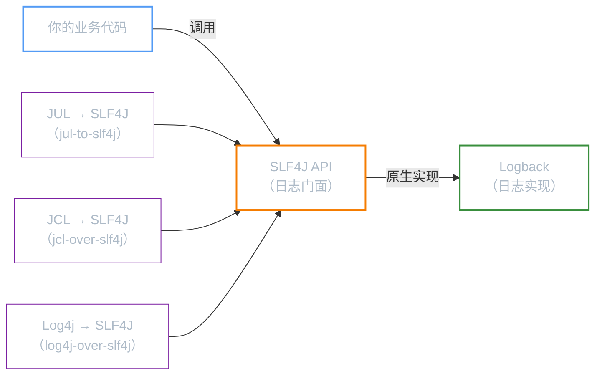
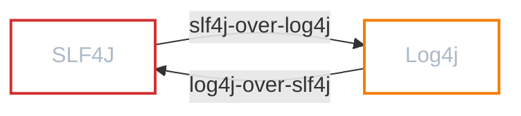

**前置知识**：本文假设你已经了解「SLF4J」日志门面的基本用法和「Logback」日志框架的核心概念（`Logger` / `Appender` / `Layout`）。Spring Boot 的日志体系正是基于这套组合构建的。

**本文你会学到**：

- Spring Boot 默认的日志架构——为什么引入 `spring-boot-starter` 就自动拥有日志能力
- `application.yml` 中各项日志配置的含义——级别、格式、文件输出、归档策略、日志组
- `logback-spring.xml` 扩展配置——按环境区分日志行为、读取 Spring 配置属性
- 如何将默认的 Logback 切换为 Log4j2——排除依赖、引入新依赖、添加配置文件
- 实际项目中最容易踩的日志陷阱——依赖冲突、桥接器循环、配置文件加载时机

## 🏗️ Spring Boot 的默认日志

当你第一次在 Spring Boot 项目中写下 `LoggerFactory.getLogger()` 并调用 `logger.info()` 时，控制台就已经有格式化日志输出了——你甚至没有添加任何日志依赖。这是因为 `spring-boot-starter` 自动帮你搞定了整个日志体系。

### 默认架构

Spring Boot 内部预装了一套完整的日志方案：



这套架构包含三个层次：

| 层次 | 组件 | 说明 |
|------|------|------|
| 门面 | `SLF4J API`（`slf4j-api`） | 业务代码只依赖这个接口 |
| 实现 | `Logback`（`logback-classic`） | 原生实现 SLF4J，无需适配器 |
| 桥接器 | `jul-to-slf4j` / `jcl-over-slf4j` / `log4j-over-slf4j` | 将旧 API 的日志调用重定向到 SLF4J |

💡 桥接器的意义：即使你的项目依赖了使用 JUL 或 Log4j 1.x API 的第三方库，它们的日志也会被自动路由到 SLF4J → Logback 管道，实现统一输出。这一切由 `spring-boot-starter` 自动引入，你无需手动配置。

### 默认日志格式

不做任何配置时，Spring Boot 的控制台日志长这样：

``` text title="默认日志输出格式"
2026-04-12T14:30:00.123+08:00  INFO 12345 --- [main] c.l.s.logging.SpringBootLoggingTest : 这是一条 INFO 日志
```

格式拆解：

| 部分 | 含义 | 示例 |
|------|------|------|
| `2026-04-12T14:30:00.123+08:00` | 日期时间（带时区） | 精确到毫秒 |
| `INFO` | 日志级别 | `TRACE` / `DEBUG` / `INFO` / `WARN` / `ERROR` |
| `12345` | 进程 ID（PID） | 操作系统分配的进程号 |
| `---` | 分隔符 | 固定标记 |
| `[main]` | 线程名 | `main`、`http-nio-8080-exec-1` |
| `c.l.s.logging.SpringBootLoggingTest` | Logger 名称（缩写） | 36 字符内缩写显示 |
| `这是一条 INFO 日志` | 日志消息 | 你传入的内容 |

## 📝 application.yml 配置

Spring Boot 提供了以 `logging.` 为前缀的配置项，让你在 `application.yml` 中就能完成大部分日志配置，无需编写 XML。

### 日志级别

当你需要控制哪些日志被输出时，通过 `logging.level` 来设置。最常见的场景是：开发时想看到自己代码的 `DEBUG` 日志，但不想被第三方框架的调试信息淹没：

``` yaml title="application.yml — 日志级别配置"
logging:
  level:
    root: INFO                          # 全局默认级别
    com.luguosong: DEBUG                # 你的业务包使用 DEBUG 级别
    org.springframework: WARN           # Spring 框架只记录 WARN 及以上
    org.hibernate.SQL: DEBUG            # 只对 Hibernate SQL 开启 DEBUG
```

级别继承规则：

- 未显式配置的 Logger 继承最近的已配置祖先，最终回退到 `root`
- `root` 是所有 Logger 的顶级祖先，默认级别为 `INFO`
- 可以精确到类名：`com.luguosong.service.UserService: TRACE`

### 日志格式

当你觉得默认日志格式不满足需求（比如想加入线程名、缩短时间格式），可以通过 `logging.pattern` 自定义：

``` yaml title="application.yml — 日志格式配置"
logging:
  pattern:
    console: "%d{yyyy-MM-dd HH:mm:ss.SSS} [%thread] %-5level %logger{36} - %msg%n"
    file: "%d{yyyy-MM-dd HH:mm:ss.SSS} %-5level [%thread] %logger{40} - %msg%n"
```

常用占位符速查：

| 占位符 | 说明 | 示例输出 |
|--------|------|---------|
| `%d{pattern}` | 日期时间 | `2026-04-12 14:30:00.123` |
| `%thread` | 线程名 | `main` |
| `%-5level` | 日志级别（左对齐，5 字符宽） | `INFO `、`ERROR` |
| `%logger{36}` | Logger 名（最长 36 字符，自动缩写） | `c.l.s.logging.Test` |
| `%msg` | 日志消息 | `用户登录成功` |
| `%n` | 换行符 | — |
| `%clr{...}{颜色}` | Spring Boot 颜色扩展（仅控制台） | `%clr{%d}{cyan}` |

!!! warning "颜色仅限控制台"

    `file` 格式中不要使用 `%clr` 颜色标记，文件不支持 ANSI 颜色码。

### 文件输出

当你需要将日志持久化到文件时，Spring Boot 提供了两种配置方式：

``` yaml title="application.yml — 文件输出配置"
logging:
  file:
    name: logs/spring-app.log    # 指定文件名（含路径）
    # path: logs/                # 或者只指定目录，文件名默认为 spring.log
```

| 配置项 | 说明 | 优先级 |
|-------|------|-------|
| `logging.file.name` | 指定完整文件路径 | 高（同时设置时以 name 为准） |
| `logging.file.path` | 只指定目录，文件名默认为 `spring.log` | 低 |

两者只设其一即可。如果同时设置，`name` 生效，`path` 被忽略。

### 日志归档

当日志文件不断增长时，归档策略可以防止磁盘被撑满。Spring Boot 内置了基于 Logback 的归档配置：

``` yaml title="application.yml — 日志归档配置"
logging:
  logback:
    rollingpolicy:
      max-file-size: 10MB        # 单个文件最大大小，超过后归档
      max-history: 30             # 保留 30 天的归档文件
      total-size-cap: 1GB         # 所有归档文件总大小上限
      clean-history-on-start: true # 应用启动时清理过期归档
```

各配置项的含义：

| 配置项 | 说明 | 默认值 |
|-------|------|-------|
| `max-file-size` | 单个日志文件的最大大小 | `10MB` |
| `max-history` | 保留的归档文件天数 | `7` |
| `total-size-cap` | 所有归档文件总大小上限 | `0`（无限制） |
| `clean-history-on-start` | 启动时是否清理过期归档 | `false` |

📌 归档只在配置了文件输出（`logging.file.name` 或 `logging.file.path`）时才会生效。没有文件输出，归档配置自然无用武之地。

### 日志组

当你的项目中有多个包需要统一设置级别时，可以用日志组把相关包打包管理：

``` yaml title="application.yml — 日志组配置"
logging:
  group:
    demo: "com.luguosong"                    # 自定义组名，绑定包路径
    web: "com.luguosong.web,com.luguosong.api"  # 多个包用逗号分隔
  level:
    demo: DEBUG                               # 对整个组设置级别
```

Spring Boot 预定义了几个常用日志组：

| 预定义组 | 包含的包 | 用途 |
|---------|---------|------|
| `web` | `org.springframework.core.codec`、`org.springframework.http`、`org.springframework.web` 等 | Spring Web 框架 |
| `sql` | `org.springframework.jdbc.core`、`org.hibernate.SQL` 等 | SQL 语句记录 |

``` yaml title="使用预定义日志组"
logging:
  level:
    sql: DEBUG    # 开启 SQL 日志，等价于分别设置 org.springframework.jdbc.core 和 org.hibernate.SQL
```

## 🎨 Logback 扩展配置

当 `application.yml` 中的配置无法满足需求时（比如需要按环境区分 Appender、使用过滤器、配置异步日志），就需要编写 Logback 原生配置文件了。Spring Boot 提供了 `logback-spring.xml` 扩展，在标准 Logback 配置的基础上增加了 Spring 特有功能。

### logback-spring.xml vs logback.xml

| 对比维度 | `logback.xml` | `logback-spring.xml` |
|---------|--------------|---------------------|
| 加载者 | Logback 框架自身 | Spring Boot |
| 加载时机 | Spring Boot 应用启动之前 | Spring Boot 初始化之后 |
| Spring Profile 支持 | 不支持（无法使用 `<springProfile>`） | 支持 |
| Spring 属性读取 | 不支持（无法使用 `<springProperty>`） | 支持 |
| 推荐程度 | 不推荐在 Spring Boot 项目中使用 | **推荐** |

!!! warning "命名不要搞错"

    如果你在 Spring Boot 项目中使用了 `logback.xml`（而不是 `logback-spring.xml`），Spring Boot 的日志配置（如 `logging.level.*`、`logging.pattern.*`）将不会生效，因为 Logback 框架先于 Spring Boot 加载了 `logback.xml`。

### 按环境区分配置：springProfile

当你需要开发环境和生产环境使用不同的日志策略时，`<springProfile>` 标签可以按 Spring Profile 有条件地加载配置：

``` xml title="logback-spring.xml — springProfile 示例"
--8<-- "code/java/javase/logging/springboot-logging-demo/src/main/resources/logback-spring.xml"
```

`name` 属性支持多种写法：

| 写法 | 含义 |
|------|------|
| `name="dev"` | 精确匹配 `dev` profile |
| `name="dev | default"` | 匹配 `dev` 或 `default`（`|` 表示或） |
| `name="!prod"` | 排除 `prod`，匹配其他所有 profile |
| `name="dev & cloud"` | 同时激活 `dev` 和 `cloud` 两个 profile 时匹配 |

上面的配置效果：

- `dev` 或默认 profile：只输出到控制台，`root` 级别 `INFO`
- `prod` profile：同时输出到控制台和文件，`root` 级别 `WARN`，日志文件自动按日期和大小归档

### 读取 Spring 配置属性：springProperty

当你需要在 Logback 配置中引用 `application.yml` 里定义的属性时，`<springProperty>` 提供了桥梁：

``` xml title="logback-spring.xml — springProperty 示例"
<!-- 从 Spring 配置中读取属性，供 Logback 使用 -->
<springProperty scope="context" name="APP_NAME" source="spring.application.name" defaultValue="my-app"/>
<springProperty scope="context" name="LOG_PATH" source="logging.file.path" defaultValue="logs"/>

<appender name="FILE" class="ch.qos.logback.core.rolling.RollingFileAppender">
    <file>${LOG_PATH}/${APP_NAME}.log</file>
    <rollingPolicy class="ch.qos.logback.core.rolling.SizeAndTimeBasedRollingPolicy">
        <fileNamePattern>${LOG_PATH}/${APP_NAME}.%d{yyyy-MM-dd}.%i.log</fileNamePattern>
        <maxFileSize>10MB</maxFileSize>
        <maxHistory>30</maxHistory>
    </rollingPolicy>
    <encoder>
        <pattern>${FILE_LOG_PATTERN}</pattern>
    </encoder>
</appender>
```

| 属性 | 说明 |
|------|------|
| `scope` | 作用域，通常为 `context`（整个 Logback 上下文可见） |
| `name` | 在 Logback 中引用时使用的变量名 |
| `source` | `application.yml` 中的属性路径 |
| `defaultValue` | Spring 配置中未找到时的默认值 |

## 🔄 切换为 Log4j2

虽然 Logback 是 Spring Boot 的默认选择，但在某些场景下你可能想切换到 Log4j2（比如需要 Log4j2 的异步日志性能优势、或者团队更熟悉 Log4j2 的配置方式）。切换分三步：排除默认 Logback、引入 Log4j2 starter、添加配置文件。

### 排除默认 Logback 并引入 Log4j2

`spring-boot-starter` 内部通过 `spring-boot-starter-logging` 引入了 Logback。切换的第一步是在依赖中排除它，然后引入 `spring-boot-starter-log4j2`：

``` xml title="pom.xml — 切换到 Log4j2"
<dependencies>
    <dependency>
        <groupId>org.springframework.boot</groupId>
        <artifactId>spring-boot-starter</artifactId>
        <!-- 排除默认的 Logback 日志实现 -->
        <exclusions>
            <exclusion>
                <groupId>org.springframework.boot</groupId>
                <artifactId>spring-boot-starter-logging</artifactId>
            </exclusion>
        </exclusions>
    </dependency>

    <!-- 引入 Log4j2 日志实现 -->
    <dependency>
        <groupId>org.springframework.boot</groupId>
        <artifactId>spring-boot-starter-log4j2</artifactId>
    </dependency>
</dependencies>
```

排除 `spring-boot-starter-logging` 会移除以下依赖：

- `logback-classic`（Logback 实现）
- `logback-core`（Logback 核心）
- `jul-to-slf4j` / `log4j-over-slf4j` / `jcl-over-slf4j`（桥接器）

`spring-boot-starter-log4j2` 会重新引入 `slf4j-api` 和 Log4j2 的 SLF4J 桥接实现，业务代码中的 `org.slf4j.Logger` 无需任何修改。

### 添加 Log4j2 配置文件

在 `src/main/resources/` 下添加 `log4j2.xml` 或 `log4j2-spring.xml`：

``` xml title="log4j2-spring.xml — 基本配置示例"
<?xml version="1.0" encoding="UTF-8"?>
<Configuration status="WARN">
    <Appenders>
        <Console name="Console" target="SYSTEM_OUT">
            <PatternLayout pattern="%d{yyyy-MM-dd HH:mm:ss.SSS} [%thread] %-5level %logger{36} - %msg%n"/>
        </Console>
    </Appenders>
    <Loggers>
        <Root level="INFO">
            <AppenderRef ref="Console"/>
        </Root>
        <Logger name="com.luguosong" level="DEBUG"/>
    </Loggers>
</Configuration>
```

切换完成后，所有 `application.yml` 中的 `logging.*` 配置依然有效——Spring Boot 会自动适配 Log4j2。

## ⚠️ 常见陷阱

在实际使用 Spring Boot 日志时，有几个容易踩的坑：

### 多次引入 SLF4J 实现导致冲突

当 classpath 中存在多个 SLF4J 实现时（比如同时引入了 `logback-classic` 和 `log4j-slf4j-impl`），启动时会看到这样的警告：

``` text title="多实现冲突警告"
SLF4J: Class path contains multiple SLF4J providers.
SLF4J: Found provider [ch.qos.logback.classic.spi.LogbackServiceProvider]
SLF4J: Found provider [org.apache.logging.slf4j.SLF4JServiceProvider]
SLF4J: See http://www.slf4j.org/codes.html#multiple_bindings for an explanation.
```

根因是某个第三方依赖传递引入了另一个 SLF4J 实现。解决方法是用 `mvn dependency:tree` 找到冲突来源，然后排除：

``` xml title="排除传递依赖中的 SLF4J 实现"
<dependency>
    <groupId>第三方库</groupId>
    <artifactId>xxx</artifactId>
    <exclusions>
        <exclusion>
            <groupId>ch.qos.logback</groupId>
            <artifactId>logback-classic</artifactId>
        </exclusion>
    </exclusions>
</dependency>
```

### 桥接器循环依赖

这是一个更隐蔽的问题：`log4j-over-slf4j`（把 Log4j API 的调用桥接到 SLF4J）和 `slf4j-over-log4j`（把 SLF4J 的调用桥接到 Log4j）如果同时存在，就会形成死循环：



这两个桥接器的作用完全相反，同时存在会导致 `StackOverflowError`。Spring Boot 默认引入的是 `log4j-over-slf4j`（把旧 Log4j API 的日志桥接到 SLF4J），如果你又手动加了 `slf4j-over-log4j`，就中招了。

!!! danger "务必检查"

    添加任何日志相关依赖时，检查它是否传递引入了与现有桥接器方向相反的桥接器。用 `mvn dependency:tree | grep slf4j` 快速排查。

### logback.xml vs logback-spring.xml 加载时机差异

这个坑在前面已经提到过，但值得再次强调：

| 配置文件 | 加载者 | 加载时机 | `application.yml` 日志配置是否生效 |
|---------|-------|---------|-------------------------------|
| `logback.xml` | Logback 框架 | Spring Boot 启动**之前** | **不生效** |
| `logback-spring.xml` | Spring Boot | Spring 上下文初始化**之后** | **正常生效** |

实际后果：如果你用了 `logback.xml`，在 `application.yml` 中设置 `logging.level.com.luguosong=DEBUG` 可能完全不生效——因为 Logback 在 Spring Boot 读取配置之前就已经按照 `logback.xml` 初始化完成了。

**结论**：在 Spring Boot 项目中，始终使用 `logback-spring.xml`。

## 📋 完整代码示例

``` xml title="pom.xml"
--8<-- "code/java/javase/logging/springboot-logging-demo/pom.xml"
```

``` java title="SpringbootLoggingApplication.java"
--8<-- "code/java/javase/logging/springboot-logging-demo/src/main/java/com/luguosong/springboot/logging/SpringbootLoggingApplication.java"
```

``` yaml title="application.yml"
--8<-- "code/java/javase/logging/springboot-logging-demo/src/main/resources/application.yml"
```

``` xml title="logback-spring.xml"
--8<-- "code/java/javase/logging/springboot-logging-demo/src/main/resources/logback-spring.xml"
```

``` java title="SpringBootLoggingTest.java"
--8<-- "code/java/javase/logging/springboot-logging-demo/src/test/java/com/luguosong/springboot/logging/SpringBootLoggingTest.java"
```

项目中有完整的可运行示例，路径为 `code/java/javase/logging/springboot-logging-demo/`。
