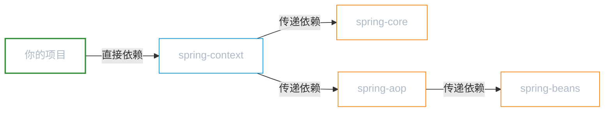
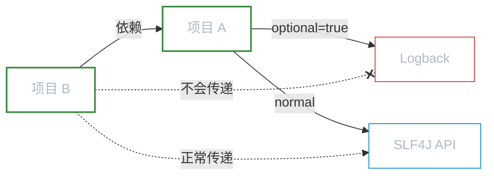
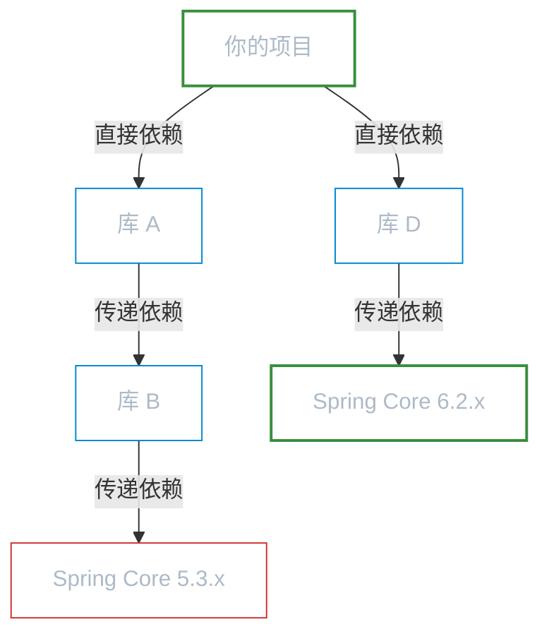
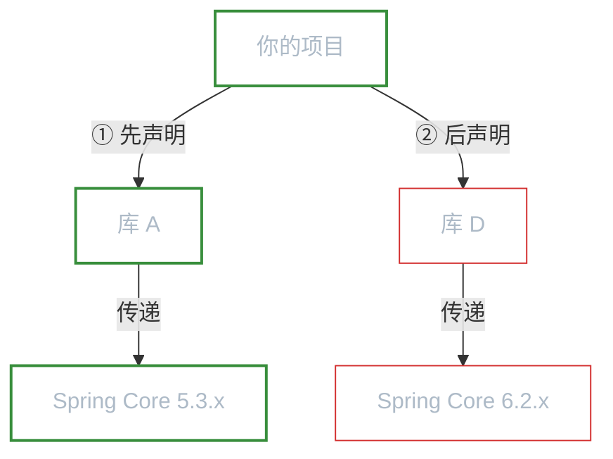

# 依赖管理

**本文你会学到**：

- `scope` 如何控制依赖在不同阶段的可见性
- 传递性依赖的规则，以及为什么你的项目会「多出」几十个 jar 包
- Maven 版本仲裁的两条核心原则，以及如何排查依赖冲突
- `dependencyManagement`、`BOM`、`exclusions` 等最佳实践

## 🎯 依赖范围（scope）

你在 `pom.xml` 中声明了一个依赖，但它到底什么时候生效？编译时？测试时？运行时？打包时？这取决于 `<scope>` 的值。

🎯 类比一下：依赖就像药品，`scope` 就像是用药说明书上的「适用时机」。有的药饭前吃，有的饭后吃，有的只在急救时用。`scope` 告诉 Maven 这个依赖应该在哪个阶段出现在 classpath 中。

### compile / test / provided / runtime / system

下面这张表格是本节最重要的参考——它展示了每种 `scope` 在项目各阶段的可见性：

| scope | 编译 | 测试 | 运行 | 打包 | 传递 |
|-------|------|------|------|------|------|
| `compile`（默认） | :white_check_mark: | :white_check_mark: | :white_check_mark: | :white_check_mark: | :white_check_mark: |
| `test` | :x: | :white_check_mark: | :x: | :x: | :x: |
| `provided` | :white_check_mark: | :white_check_mark: | :x: | :x: | :x: |
| `runtime` | :x: | :white_check_mark: | :white_check_mark: | :white_check_mark: | :white_check_mark: |
| `system` | :white_check_mark: | :white_check_mark: | :white_check_mark: | :warning: | :x: |

逐个来看每种 `scope` 的典型用例：

**`compile`（默认值）**

如果你不写 `<scope>`，Maven 默认按 `compile` 处理。它意味着这个依赖在所有阶段都存在。

``` xml title="compile 范围示例 — Spring Core"
<dependency>
    <groupId>org.springframework</groupId>
    <artifactId>spring-core</artifactId>
    <version>6.2.0</version>
    <!-- 不写 scope 等同于 <scope>compile</scope> -->
</dependency>
```

像 `spring-core` 这种核心库，编译时要用它的类，运行时也需要它，打包时更要把它打进去——所以用默认的 `compile` 完全正确。

**`test`**

只在测试编译和测试运行阶段生效。`src/main/java` 中的代码**不能**引用 `test` 范围的依赖。

``` xml title="test 范围示例 — JUnit"
<dependency>
    <groupId>org.junit.jupiter</groupId>
    <artifactId>junit-jupiter</artifactId>
    <version>5.11.0</version>
    <scope>test</scope>
</dependency>
```

JUnit 只在写测试和跑测试时才需要。如果你在 `src/main/java` 中 `import` 了 JUnit 的类，编译直接报错——因为 `test` 范围的依赖在主代码编译阶段根本不在 classpath 中。

**`provided`**

编译和测试时可用，但运行时由外部环境（如 JDK、Servlet 容器）提供，打包时不包含。

``` xml title="provided 范围示例 — Servlet API"
<dependency>
    <groupId>jakarta.servlet</groupId>
    <artifactId>jakarta.servlet-api</artifactId>
    <version>6.0.0</version>
    <scope>provided</scope>
</dependency>
```

Servlet API 就是最典型的例子——你写代码时需要 `HttpServletRequest` 等类来编译，但运行时 Tomcat 容器自带了这些类，不需要你打进去。如果打成 `compile` 范围，你的 jar 包和 Tomcat 各带一份 Servlet API，反而会引发类加载冲突。

**`runtime`**

编译时不可用，测试和运行时可用。适用于你的代码只通过接口或反射调用、运行时才需要加载具体实现的场景。

``` xml title="runtime 范围示例 — MySQL 驱动"
<dependency>
    <groupId>com.mysql</groupId>
    <artifactId>mysql-connector-j</artifactId>
    <version>9.1.0</version>
    <scope>runtime</scope>
</dependency>
```

JDBC 代码只依赖 `java.sql.Connection` 等标准接口（由 JDK 提供），不需要在编译时引用 MySQL 驱动的具体类。但运行时，JDBC 需要找到具体的驱动实现来连接数据库——所以 MySQL 驱动要在运行阶段才加入 classpath。

**`system`**

``` xml title="system 范围示例（强烈不推荐）"
<dependency>
    <groupId>com.example</groupId>
    <artifactId>legacy-lib</artifactId>
    <version>1.0.0</version>
    <scope>system</scope>
    <systemPath>${project.basedir}/lib/legacy-lib.jar</systemPath>
</dependency>
```

`system` 类似 `provided`，但需要你通过 `<systemPath>` 指定本地 jar 文件的绝对路径。这打破了 Maven 的仓库体系——依赖不再从仓库下载，而是硬编码了一个本地路径。Maven 官方明确不推荐使用，实际项目中应尽量避免。

!!! warning "system 的致命缺陷"

    `system` 范围的依赖在 `mvn package` 时**默认不会**打进最终产物。如果你需要在打包时包含它，还需要额外配置 `maven-war-plugin` 或 `maven-jar-plugin` 的 `includeSystemScope` 参数。而且因为依赖了本地绝对路径，你的项目换一台电脑就无法构建。

### scope 对项目各阶段的影响

理解 `scope` 的关键在于搞清楚 Maven 构建的三个 classpath：

| classpath | 对应阶段 | 包含的 scope |
|-----------|---------|-------------|
| 编译 classpath | `mvn compile` | `compile`、`provided`、`system` |
| 测试 classpath | `mvn test` | 全部 scope（`compile`、`test`、`provided`、`runtime`、`system`） |
| 运行 classpath | `mvn package` 后运行 | `compile`、`runtime`（`system` 在运行时可用但不推荐） |

可以看到，测试 classpath 是最全的——因为测试代码既需要访问主代码的依赖，也需要自己的测试框架依赖。

## 🔗 依赖传递

你在 `pom.xml` 中只声明了 3 个依赖，但 `mvn dependency:tree` 却显示下载了 30 个 jar 包——其他的是怎么来的？

答案就是**传递性依赖**（Transitive Dependencies）。

### 传递性依赖的规则

📦 类比一下：你去超市买了一盒巧克力（直接依赖），巧克力盒里附赠了一张优惠券（传递依赖）。你没有主动买优惠券，但它跟着巧克力一起到了你手里。Maven 的传递依赖也是这个道理——你依赖了 A，A 又依赖了 B，B 就会自动出现在你的 classpath 中。



你在 `pom.xml` 中只声明了 `spring-context`，但 Maven 会自动解析它的依赖树，把 `spring-core`、`spring-aop`、`spring-beans` 等都拉进来。

**传递依赖的 scope 会受直接依赖 scope 的影响**。规则如下：

| 直接依赖 \ 传递依赖 | `compile` | `runtime` | `provided` | `test` |
|--------------------|-----------|-----------|------------|--------|
| `compile` | `compile` | `runtime` | 不传递 | 不传递 |
| `runtime` | `runtime` | `runtime` | 不传递 | 不传递 |
| `provided` | 不传递 | 不传递 | 不传递 | 不传递 |
| `test` | 不传递 | 不传递 | 不传递 | 不传递 |

这张表看起来复杂，但核心规律只有两条：

1. `provided` 和 `test` 范围的依赖**永远不会传递**——它们的语义就是「只有我自己用」
2. 当 `compile` 范围的直接依赖传递了 `runtime` 范围的依赖时，传递过来后会降级为 `runtime`（因为你的代码在编译时确实不需要它）

### 可选依赖（optional）

有时候你声明了一个依赖，但不想让它传递给下游项目。`<optional>true</optional>` 就是做这个的——它告诉 Maven：「这个依赖我自己用，但不要传递给依赖我的其他项目」。

``` xml title="pom.xml — 声明可选依赖"
<dependency>
    <groupId>ch.qos.logback</groupId>
    <artifactId>logback-classic</artifactId>
    <version>1.5.12</version>
    <optional>true</optional>
</dependency>
```

📌 典型场景：日志框架。你的项目 A 用 SLF4J + Logback 做日志，但项目 B 依赖了项目 A。你不想强迫 B 也用 Logback——B 可能更喜欢 Log4j2。把 Logback 设为 `optional`，B 就不会自动继承这个依赖，可以自由选择自己的日志实现。



## ⚖️ 版本仲裁

你的项目依赖了 Spring 6.0，但某个第三方库传递依赖了 Spring 5.3。同一个 `groupId` + `artifactId` 出现了两个版本，Maven 最终用哪个？

这就是**版本仲裁**（Dependency Mediation）要解决的问题。Maven 有两条明确的规则来裁决版本冲突。

### 最短路径优先原则

Maven 优先选择**依赖树中路径最短**的版本。



路径计算方式：

- 你的项目 → 库 A → 库 B → Spring Core 5.3.x：路径长度 **3**
- 你的项目 → 库 D → Spring Core 6.2.x：路径长度 **2**

Maven 选择 Spring Core **6.2.x**，因为路径更短（2 < 3）。

!!! info "路径长度的含义"

    路径长度是指从你的项目到目标依赖之间的**中间节点数**，不算自身。直接依赖的路径长度为 1，传递一次变 2，再传递一次变 3，以此类推。

这条规则的逻辑很合理：你**直接声明**或**更接近你**的依赖版本，通常是你有意选择的，应该优先于远处传递过来的版本。

### 同路径先声明者优先原则

当两条路径长度相同时，Maven 会看你在 `pom.xml` 中**哪个依赖先声明**——先声明的版本胜出。



两条路径长度都是 2，所以 Maven 选择 Spring Core **5.3.x**——因为库 A 在 `pom.xml` 中先声明。

``` xml title="pom.xml — 声明顺序影响仲裁结果"
<dependencies>
    <!-- 先声明，仲裁时优先 -->
    <dependency>
        <groupId>com.example</groupId>
        <artifactId>library-a</artifactId>
        <version>1.0.0</version>
        <!-- 传递引入 Spring Core 5.3.x -->
    </dependency>

    <!-- 后声明，仲裁时靠后 -->
    <dependency>
        <groupId>com.example</groupId>
        <artifactId>library-d</artifactId>
        <version>1.0.0</version>
        <!-- 传递引入 Spring Core 6.2.x -->
    </dependency>
</dependencies>
```

!!! warning "不要依赖声明顺序来控制版本"

    虽然可以靠调整声明顺序来影响仲裁结果，但这是一种**隐式行为**，团队成员很难注意到。更好的做法是使用后面讲到的 `dependencyManagement` 或 `BOM` 来显式控制版本。

## 🔍 依赖冲突排查

版本仲裁是自动的，但仲裁结果不一定正确——你可能需要手动确认某个依赖最终用的是哪个版本。以下几种方式可以帮助你排查依赖问题。

### mvn dependency:tree

这是最常用的排查命令，它会以树形结构展示完整的依赖关系：

``` bash title="查看依赖树"
mvn dependency:tree
```

输出示例：

```
com.example:my-project:jar:1.0.0
+- org.springframework:spring-context:jar:6.2.0:compile
|  +- org.springframework:spring-core:jar:6.2.0:compile
|  +- org.springframework:spring-expression:jar:6.2.0:compile
|  \- org.springframework:spring-aop:jar:6.2.0:compile
|     \- org.springframework:spring-beans:jar:6.2.0:compile
+- com.example:library-a:jar:1.0.0:compile
|  \- org.springframework:spring-core:jar:5.3.30:compile (omitted for conflict with 6.2.0)
```

注意最后一行中的 `(omitted for conflict with 6.2.0)`——Maven 明确告诉你：`spring-core 5.3.30` 因为与 `6.2.0` 冲突而被排除了。

当依赖树很大时，可以用以下参数缩小范围：

``` bash title="查看完整依赖树（包含被排除的依赖）"
mvn dependency:tree -Dverbose
```

``` bash title="过滤特定依赖"
mvn dependency:tree -Dincludes=org.springframework:spring-core
```

`-Dincludes` 支持通配符格式 `groupId:artifactId`，只显示匹配的依赖路径，非常适合追踪某个特定库的版本来源。

### mvn dependency:list

`dependency:tree` 输出的是树形结构，信息虽然完整但不够直观。`dependency:list` 会把最终解析的依赖**扁平化**展示——每个依赖只出现一次，已经是仲裁后的最终版本：

``` bash title="查看扁平化依赖列表"
mvn dependency:list
```

输出示例：

```
org.springframework:spring-core:jar:6.2.0:compile
org.springframework:spring-context:jar:6.2.0:compile
org.springframework:spring-beans:jar:6.2.0:compile
com.example:library-a:jar:1.0.0:compile
...
```

如果你想快速确认「某个依赖最终用的是哪个版本」，`dependency:list` 比 `dependency:tree` 更高效。

### IDEA 工具辅助排查

命令行虽然强大，但在大型项目中依赖树动辄几百行，肉眼排查效率很低。IntelliJ IDEA 提供了更直观的图形化工具。

**Maven 面板 → Dependencies 视图**

在 IDEA 右侧的 Maven 面板中，展开项目节点可以看到 `Dependencies`——它会以层级结构展示所有依赖。如果某个依赖存在冲突，IDEA 会用**红色波浪线**标记出来，鼠标悬停即可看到冲突的版本信息。

**Maven Helper 插件**

IDEA 插件市场中搜索安装 **Maven Helper**，它提供了更强大的冲突分析功能：

- 在 `pom.xml` 编辑器底部会出现 `Dependency Analyzer` 标签页
- 点击后可以一键列出所有冲突的依赖
- 对每个冲突可以直接选择保留哪个版本，自动生成 `<exclusions>` 配置

!!! tip "排查依赖冲突的推荐流程"

    1. 先用 `mvn dependency:tree -Dincludes=groupId:artifactId` 定位问题依赖的来源路径
    2. 结合 IDEA 的 Dependencies 视图确认冲突的版本
    3. 用 `dependencyManagement` 或 `exclusions` 解决冲突（详见下一节）

## 💡 最佳实践

### 使用 dependencyManagement 统一版本

前面的章节已经介绍过 `dependencyManagement` 的基本用法（详见「POM 详解」），这里从依赖管理的角度再强调它的价值。

在一个多模块项目中，如果每个子模块各自声明依赖版本，很容易出现同一个库在不同模块中使用不同版本的问题。`dependencyManagement` 让你在父 POM 中统一定义版本，子模块只写 `groupId` + `artifactId`，版本自动由父 POM 控制。

``` xml title="父 POM — 统一管理依赖版本"
<properties>
    <spring.version>6.2.0</spring.version>
    <junit.version>5.11.0</junit.version>
</properties>

<dependencyManagement>
    <dependencies>
        <dependency>
            <groupId>org.springframework</groupId>
            <artifactId>spring-context</artifactId>
            <version>${spring.version}</version>
        </dependency>
        <dependency>
            <groupId>org.springframework</groupId>
            <artifactId>spring-beans</artifactId>
            <version>${spring.version}</version>
        </dependency>
        <dependency>
            <groupId>org.junit.jupiter</groupId>
            <artifactId>junit-jupiter</artifactId>
            <version>${junit.version}</version>
            <scope>test</scope>
        </dependency>
    </dependencies>
</dependencyManagement>
```

升级版本时只改 `properties` 中的 `spring.version`，所有子模块自动生效——零遗漏、零冲突。

### 使用 BOM（Bill of Materials）

当依赖库数量很多且版本间有兼容性要求时，手动维护 `dependencyManagement` 也很繁琐。`BOM`（Bill of Materials，物料清单）是解决这个问题的标准方案。

🎯 类比一下：BOM 就像套餐菜单——餐厅帮你搭配好了前菜、主菜、甜点的组合，你点一个套餐号就够了，不需要逐个菜选。开源框架（如 Spring Boot）把自家所有模块的兼容版本打包成一个 BOM，你引入这个 BOM 就一次性拿到了所有版本定义。

`BOM` 的原理是通过 `<scope>import</scope>` + `<type>pom</type>`，将一个外部 POM 中的 `<dependencyManagement>` 配置导入到当前项目中：

``` xml title="pom.xml — 引入 Spring Boot BOM"
<dependencyManagement>
    <dependencies>
        <dependency>
            <groupId>org.springframework.boot</groupId>
            <artifactId>spring-boot-dependencies</artifactId>
            <version>3.5.0</version>
            <type>pom</type>
            <scope>import</scope>
        </dependency>
    </dependencies>
</dependencyManagement>
```

引入后，Spring Boot 全家桶中几百个依赖的版本全部由这个 BOM 管理，你在子模块中直接用就行：

``` xml title="子模块 — 无需指定版本"
<dependencies>
    <!-- 版本由 spring-boot-dependencies BOM 控制 -->
    <dependency>
        <groupId>org.springframework.boot</groupId>
        <artifactId>spring-boot-starter-web</artifactId>
    </dependency>
    <dependency>
        <groupId>org.springframework.boot</groupId>
        <artifactId>spring-boot-starter-data-jpa</artifactId>
    </dependency>
</dependencies>
```

!!! info "import scope 的特殊性"

    `import` 是一种特殊的 `scope`，它只在 `<dependencyManagement>` 中有效，不能用在普通的 `<dependencies>` 中。它的作用是把目标 POM 中的 `<dependencyManagement>` 配置「复制粘贴」到当前项目中。

常见的 BOM 还有：

| BOM | 用途 |
|-----|------|
| `spring-boot-dependencies` | Spring Boot 全家桶版本管理 |
| `spring-cloud-dependencies` | Spring Cloud 组件版本管理 |
| `junit-bom` | JUnit 5 各模块版本统一 |
| `jakartaee-bom` | Jakarta EE 全套 API 版本管理 |

### 排除不必要的传递依赖

当你发现某个传递依赖与项目需要的版本冲突，或者传递引入了一个根本用不到的库，可以用 `<exclusions>` 精确排除它：

``` xml title="pom.xml — 排除传递依赖"
<dependency>
    <groupId>org.springframework</groupId>
    <artifactId>spring-context</artifactId>
    <version>6.2.0</version>
    <exclusions>
        <!-- 排除 spring-context 传递引入的 commons-logging -->
        <!-- 你的项目已经用了 SLF4J，不需要 commons-logging -->
        <exclusion>
            <groupId>commons-logging</groupId>
            <artifactId>commons-logging</artifactId>
        </exclusion>
    </exclusions>
</dependency>
```

使用 `<exclusions>` 的典型时机：

- **版本冲突**：传递依赖的版本与你项目需要的版本不一致，且 `dependencyManagement` 无法覆盖（比如第三方库的传递依赖）
- **无用依赖**：传递引入了一个你完全用不到的库，白白增加了最终产物的体积
- **替代实现**：库 A 传递引入了日志框架 X，但你的项目用的是日志框架 Y，需要排除 X

!!! warning "不要滥用 exclusions"

    排除传递依赖可能导致运行时 `ClassNotFoundException` 或 `NoSuchMethodError`——你排除了一个库，但上层代码还在调用它。每次排除前，务必确认这个传递依赖在你的项目中真的不需要。
