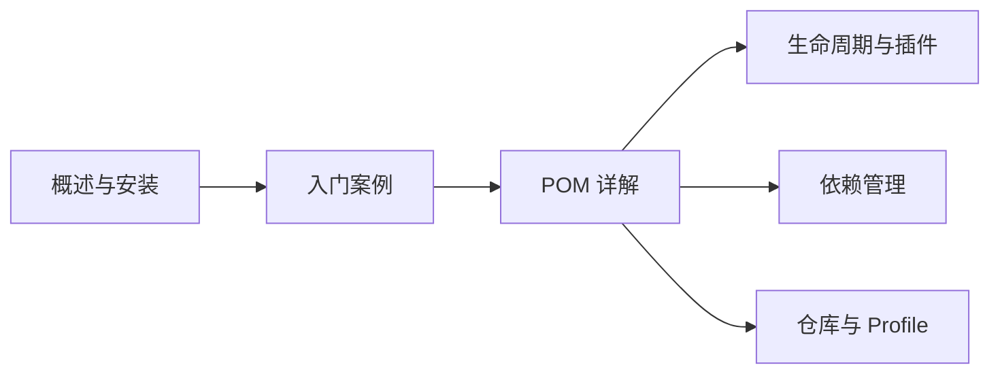

# Maven

`Maven` 是 Java 生态中最流行的项目构建与依赖管理工具。它通过标准化的项目结构、声明式的依赖配置和自动化的构建流程，让你从手动管理 jar 包的繁琐工作中解放出来。

## 🗺️ 学习路径

## 📚 本节内容

- [概述与安装](overview-setup/index.md)
- [入门案例](getting-started/index.md)
- [POM 详解](pom/index.md)
- [生命周期与插件](lifecycle-plugin/index.md)
- [依赖管理](dependency/index.md)
- [仓库与 Profile](repository-profile/index.md)
