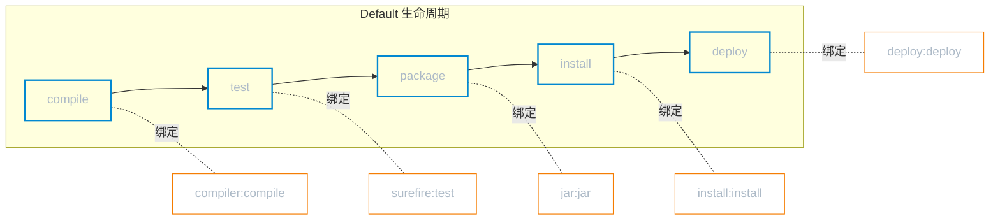
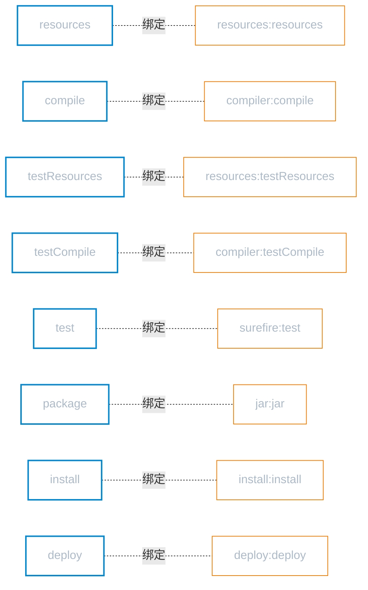

# 生命周期与插件

**本文你会学到**：

- 执行 `mvn compile` 或 `mvn package` 时，Maven 到底做了什么
- 三套生命周期（`Clean`、`Default`、`Site`）各自包含哪些阶段
- 阶段（Phase）和插件目标（Goal）如何绑定——Maven 自动化构建的核心机制
- 常用插件的配置方法与实际使用场景
- 如何编写一个自己的 Maven 插件

## Maven 生命周期

### 生命周期、阶段、插件目标的关系

当你第一次执行 `mvn compile` 时，终端输出了一大堆日志——编译源码、复制资源、跑测试……你明明只敲了 `compile` 一个词，Maven 怎么知道要做这么多事？更奇怪的是，执行 `mvn package` 时，编译和测试居然自动先跑了一遍，根本没让你手动指定。

🎯 答案藏在三个核心概念里：**生命周期**、**阶段**、**插件目标**。

想象你去一家高档餐厅吃饭。餐厅有一套标准上菜流程：凉菜 → 汤品 → 热菜 → 甜点。这个**固定顺序**就是生命周期（Lifecycle）。其中每一道菜——凉菜、热菜——就是一个阶段（Phase）。而厨师为了做出这道菜所执行的具体动作——切菜、翻炒、摆盘——就是插件目标（Goal）。

Maven 的运行机制完全类似：

- **生命周期**（Lifecycle）= 一组有序的阶段，定义了「构建应该按什么顺序做」
- **阶段**（Phase）= 构建流程中的一个步骤，如 `compile`、`test`、`package`
- **插件目标**（Goal）= 具体执行的操作，如 `compiler:compile`、`surefire:test`



上图中，蓝色节点是阶段，橙色节点是插件目标。每个阶段背后都绑定了一个或多个插件目标——当你执行某个阶段时，Maven 会依次执行该阶段之前所有阶段绑定的目标，再执行当前阶段的目标。这就是为什么 `mvn package` 会自动先编译和测试。

!!! info "阶段是虚拟的，插件目标是实际的"
    阶段本身不做事，它只是一个「占位符」。真正干活的是绑定在这个阶段上的插件目标。如果一个阶段没有绑定任何目标，执行它就等于什么都没做。

Maven 内置了三套互相独立的生命周期，下面逐一介绍。

## Clean 生命周期

当你的项目编译出问题，想「从零开始」重新构建时，第一步就是清理之前的产物。Maven 提供了 `Clean` 生命周期，专门负责这件事。

🔍 `Clean` 生命周期只有 3 个阶段，结构非常简单：

| 阶段 | 说明 |
|------|------|
| `pre-clean` | 清理前的准备工作（默认无绑定目标） |
| `clean` | 删除 `target/` 目录，清除所有构建产物 |
| `post-clean` | 清理后的收尾工作（默认无绑定目标） |

其中 `clean` 阶段绑定了 `maven-clean-plugin:clean`，它的作用就是删除项目根目录下的 `target/` 文件夹。日常使用中，直接执行：

``` bash
mvn clean
```

更常见的做法是把 `clean` 和其他阶段组合使用，确保从干净状态开始构建：

``` bash title="清理并重新打包"
mvn clean package
```

这条命令会先执行 Clean 生命周期的 `clean` 阶段，再执行 Default 生命周期的 `package` 阶段——两个生命周期互不干扰，只是顺序执行。

## Default 生命周期

`Default` 生命周期是 Maven 的核心，涵盖了从编译、测试、打包到部署的完整构建流程。你在日常开发中用到的绝大多数命令，都来自这套生命周期。

!!! warning "Default 生命周期有 23 个阶段"
    Maven 官方定义的 Default 生命周期包含 23 个阶段。下面只列出最常用的，完整列表请参考 [Maven 官方文档](https://maven.apache.org/ref/current/maven-core/lifecycles.html)。

### 常用阶段一览

| 阶段 | 说明 | 默认绑定的插件目标 |
|------|------|-----------------|
| `validate` | 验证项目信息完整性 | — |
| `initialize` | 初始化构建状态 | — |
| `compile` | 编译源代码 | `compiler:compile` |
| `test-compile` | 编译测试代码 | `compiler:testCompile` |
| `test` | 运行单元测试 | `surefire:test` |
| `package` | 打包（jar/war） | `jar:jar` 或 `war:war` |
| `verify` | 运行集成测试等检查 | — |
| `install` | 安装到本地仓库 | `install:install` |
| `deploy` | 部署到远程仓库 | `deploy:deploy` |

### 阶段的累积执行

`Default` 生命周期有一个关键特性：**执行某个阶段时，Maven 会从该生命周期的第一个阶段开始，依次执行到指定阶段**。

比如执行 `mvn compile`，实际执行链路是：

```
validate → initialize → ... → compile
```

执行 `mvn package`，实际执行链路是：

```
validate → initialize → ... → compile → test-compile → test → package
```

🎯 这就是为什么你执行 `mvn package` 时会自动先编译和测试——不是 Maven 自作主张，而是生命周期的设计就是「前面的步骤必须先完成」。

## Site 生命周期

📦 除了构建代码，Maven 还能生成项目文档站点（包括 JavaDoc、测试报告、项目信息等）。`Site` 生命周期就是为此而生。

| 阶段 | 说明 |
|------|------|
| `pre-site` | 生成站点前的准备工作 |
| `site` | 生成项目文档站点 |
| `post-site` | 生成站点后的收尾工作 |
| `site-deploy` | 将站点发布到服务器 |

日常开发中，`Site` 生命周期用得相对较少。大多数团队会选择独立的文档工具（如 MkDocs、GitBook）来管理项目文档。但如果你需要快速查看项目的 JavaDoc 或依赖报告，`mvn site` 仍然是一个便捷的选择。

## 插件机制

### 插件与阶段的绑定关系

前面我们说过，阶段本身不做事，真正干活的是绑定在阶段上的插件目标。那么问题来了：**Maven 怎么知道哪个阶段该绑定哪个目标？**

答案取决于**打包方式**。`pom.xml` 中的 `<packaging>` 决定了 Maven 为你绑定哪些默认插件目标。

以最常见的 `jar` 打包为例，Maven 的默认绑定如下：



如果你把 `<packaging>` 改成 `war`，`package` 阶段绑定的就不再是 `jar:jar`，而是 `war:war`。不同的打包方式有不同的默认绑定——这就是 Maven「约定优于配置」的体现。

### 内置绑定 vs 自定义绑定

**内置绑定**（上文介绍的）是 Maven 自动为你配好的，开箱即用。但实际项目中，你经常需要在特定阶段执行额外的操作——比如在打包时自动生成源码 jar、在编译前检查代码格式。这时候就需要**自定义绑定**。

自定义绑定通过 `<execution>` 实现：把某个插件目标绑定到指定的阶段上。

``` xml title="自定义绑定：打包时同时生成源码 jar"
<build>
    <plugins>
        <plugin>
            <groupId>org.apache.maven.plugins</groupId>
            <artifactId>maven-source-plugin</artifactId>
            <version>3.3.1</version>
            <executions>
                <execution>
                    <id>attach-sources</id>
                    <!-- 将 jar-no-fork 目标绑定到 package 阶段 -->
                    <phase>package</phase>
                    <goals>
                        <goal>jar-no-fork</goal>
                    </goals>
                </execution>
            </executions>
        </plugin>
    </plugins>
</build>
```

这段配置的含义：在 `package` 阶段，除了执行默认的 `jar:jar` 目标之外，还会额外执行 `source:jar-no-fork` 目标——生成一个包含源码的 jar 包。

## 常用插件

Maven 生态中有大量插件，下面介绍日常开发中最常用的几个。

### maven-compiler-plugin

⚙️ 几乎所有 Java 项目都需要配置编译版本。`maven-compiler-plugin` 负责编译源码和测试代码，你通常只需要设置 Java 版本：

``` xml title="配置 Java 17 编译"
<build>
    <plugins>
        <plugin>
            <groupId>org.apache.maven.plugins</groupId>
            <artifactId>maven-compiler-plugin</artifactId>
            <version>3.13.0</version>
            <configuration>
                <source>17</source>
                <target>17</target>
                <encoding>UTF-8</encoding>
            </configuration>
        </plugin>
    </plugins>
</build>
```

`<source>` 指定源码兼容的 Java 版本，`<target>` 指定生成的字节码版本。两者通常保持一致。

!!! info "更简洁的写法"
    如果你的项目继承了 `spring-boot-starter-parent`，可以直接用属性代替插件配置：

    ``` xml
    <properties>
        <java.version>17</java.version>
    </properties>
    ```

    Spring Boot 的 parent POM 会自动将这些属性映射到 `maven-compiler-plugin` 的配置中。

### maven-surefire-plugin

🧪 `maven-surefire-plugin` 负责在 `test` 阶段执行单元测试。默认情况下，它会自动发现并运行 `src/test/java/` 下所有符合命名规则的测试类（`*Test.java`、`Test*.java`、`*Tests.java` 等）。

很多时候你想跳过测试来加速构建，Maven 提供了两种方式：

``` bash title="跳过测试的两种方式"
# 方式一：编译测试代码，但不运行测试
mvn package -DskipTests

# 方式二：不编译也不运行测试代码
mvn package -Dmaven.test.skip=true
```

两者的区别：

| 参数 | 编译测试代码 | 运行测试 | 适用场景 |
|------|-----------|--------|---------|
| `-DskipTests` | ✅ 编译 | ❌ 不运行 | 测试代码有编译错误时不适用 |
| `-Dmaven.test.skip=true` | ❌ 不编译 | ❌ 不运行 | 完全跳过测试，构建最快 |

!!! warning "生产环境不要跳过测试"
    跳过测试只适合本地开发调试。CI/CD 流水线和发布构建中**必须运行测试**，否则无法保证代码质量。

### maven-clean-plugin

🗑️ `maven-clean-plugin` 在 `clean` 阶段执行，默认删除项目根目录下的 `target/` 目录。一般不需要额外配置，直接使用即可：

``` bash
mvn clean
```

如果你需要自定义清理目录，可以这样配置：

``` xml title="自定义清理目录"
<plugin>
    <groupId>org.apache.maven.plugins</groupId>
    <artifactId>maven-clean-plugin</artifactId>
    <version>3.4.0</version>
    <configuration>
        <filesets>
            <fileset>
                <directory>dist</directory>
                <includes>
                    <include>**/*</include>
                </includes>
            </fileset>
        </filesets>
    </configuration>
</plugin>
```

### maven-help-plugin

🔍 `maven-help-plugin` 是一个诊断工具，帮你查看 Maven 的各种内部信息。常用目标有两个：

``` bash title="查看表达式值"
# 查看 POM 中某个属性的值
mvn help:evaluate -Dexpression=project.version -q -DforceStdout
```

``` bash title="查看有效 POM"
# 查看合并了所有继承后的完整 POM
mvn help:effective-pom
```

`help:effective-pom` 在排查「为什么 Maven 的行为和预期不同」时特别有用——它会展示经过 Super POM、parent POM 和当前 POM 合并后的最终配置，帮你找到某个配置到底是从哪继承来的。

### spring-boot-maven-plugin

🚀 Spring Boot 项目需要打包为可执行 jar（fat jar，即把所有依赖都打进一个 jar 包中）。`spring-boot-maven-plugin` 就是做这件事的：

``` xml title="Spring Boot 打包插件配置"
<build>
    <plugins>
        <plugin>
            <groupId>org.springframework.boot</groupId>
            <artifactId>spring-boot-maven-plugin</artifactId>
        </plugin>
    </plugins>
</build>
```

如果你继承了 `spring-boot-starter-parent`，不需要指定 `<version>`——parent POM 已经帮你管理了版本。

这个插件在 `package` 阶段生效，它会重新打包 `maven-jar-plugin` 生成的普通 jar，把 `BOOT-INF/lib/` 下的依赖和 `BOOT-INF/classes/` 下的类文件一起打包成可执行 jar。打包完成后，就可以直接用 `java -jar` 运行：

``` bash
java -jar target/my-app-1.0.0.jar
```

### mybatis-generator-maven-plugin

📦 如果你在项目中使用 MyBatis，手写 Mapper XML、Entity 类和 DAO 接口是一件枯燥且容易出错的事。`mybatis-generator-maven-plugin` 可以根据数据库表结构自动生成这些文件：

``` xml title="MyBatis Generator 插件配置"
<plugin>
    <groupId>org.mybatis.generator</groupId>
    <artifactId>mybatis-generator-maven-plugin</artifactId>
    <version>1.4.2</version>
    <configuration>
        <!-- Generator 配置文件路径 -->
        <configurationFile>src/main/resources/generatorConfig.xml</configurationFile>
        <overwrite>true</overwrite>
        <verbose>true</verbose>
    </configuration>
    <dependencies>
        <dependency>
            <groupId>mysql</groupId>
            <artifactId>mysql-connector-java</artifactId>
            <version>8.0.33</version>
        </dependency>
    </dependencies>
</plugin>
```

使用时执行：

``` bash
mvn mybatis-generator:generate
```

插件会读取 `generatorConfig.xml` 中配置的数据库连接信息和生成规则，自动生成对应的 Model、Mapper 和 XML 文件。

## 自定义 Maven 插件

当你有特殊的构建需求——比如在打包前自动生成版本信息文件、检查代码规范、向飞书/钉钉发送构建通知——Maven 内置插件可能无法满足。这时候就需要编写自己的 Maven 插件。

### 创建 Mojo 类

Maven 插件的核心是 `Mojo`（Maven plain Old Java Object）。每个 Mojo 类就是一个具体的插件目标，它继承 `AbstractMojo` 并实现 `execute()` 方法。

🔧 先创建一个独立的 Maven 项目，编写你的第一个 Mojo：

``` java title="自定义 Mojo 示例"
package com.example.maven.plugins;

import org.apache.maven.plugin.AbstractMojo;
import org.apache.maven.plugin.MojoExecutionException;
import org.apache.maven.plugins.annotations.LifecyclePhase;
import org.apache.maven.plugins.annotations.Mojo;
import org.apache.maven.plugins.annotations.Parameter;

/**
 * 自定义 Hello 插件目标
 * name = "hello" 表示目标名称为 hello，使用时为 hello:hello
 * defaultPhase = COMPILE 表示默认绑定到 compile 阶段
 */
@Mojo(name = "hello", defaultPhase = LifecyclePhase.COMPILE)
public class HelloMojo extends AbstractMojo {

    /**
     * 用户可通过 -Dgreeting=xxx 传入自定义问候语
     * defaultValue 提供默认值
     */
    @Parameter(property = "greeting", defaultValue = "Hello from custom plugin!")
    private String greeting;

    @Override
    public void execute() throws MojoExecutionException {
        // getLog() 输出的日志会显示在 Maven 构建日志中
        getLog().info("========================================");
        getLog().info(greeting);
        getLog().info("========================================");
    }
}
```

几个关键点：

- `@Mojo` 注解声明这是一个插件目标，`name` 指定目标名称
- `@Parameter` 注解读取用户配置，`property` 指定命令行参数名
- `getLog()` 提供 Maven 级别的日志输出，支持 `info()`、`warn()`、`error()` 等级别
- `execute()` 方法中实现具体的插件逻辑，抛出 `MojoExecutionException` 表示插件执行失败

### 插件打包与安装

📌 插件项目本身也是一个 Maven 工程，但 `packaging` 必须设为 `maven-plugin`：

``` xml title="插件项目的 pom.xml"
<project>
    <modelVersion>4.0.0</modelVersion>

    <groupId>com.example.maven.plugins</groupId>
    <artifactId>hello-maven-plugin</artifactId>
    <version>1.0.0</version>
    <!-- 打包类型必须是 maven-plugin -->
    <packaging>maven-plugin</packaging>

    <dependencies>
        <!-- Maven 插件 API -->
        <dependency>
            <groupId>org.apache.maven</groupId>
            <artifactId>maven-plugin-api</artifactId>
            <version>3.9.6</version>
            <scope>provided</scope>
        </dependency>
        <!-- 注解支持（@Mojo、@Parameter 等） -->
        <dependency>
            <groupId>org.apache.maven.plugin-tools</groupId>
            <artifactId>maven-plugin-annotations</artifactId>
            <version>3.12.0</version>
            <scope>provided</scope>
        </dependency>
    </dependencies>
</project>
```

执行 `mvn install` 将插件安装到本地仓库，之后就可以在其他项目中使用了。

### 在项目中使用自定义插件

安装好自定义插件后，有两种方式在其他项目中调用它。

**方式一：通过 `<pluginGroups>` 简化调用**

在 `~/.m2/settings.xml` 中添加插件组前缀：

``` xml title="settings.xml — 配置插件组"
<settings>
    <pluginGroups>
        <pluginGroup>com.example.maven.plugins</pluginGroup>
    </pluginGroups>
</settings>
```

配置后，Maven 会自动将 `hello` 解析为 `com.example.maven.plugins:hello-maven-plugin`。你可以直接用简短命令调用：

``` bash
mvn hello:hello
```

**方式二：在 pom.xml 中指定完整 GAV**

如果你的插件 groupId 不在 `settings.xml` 的 `pluginGroups` 中，需要在 pom.xml 中用完整的坐标引用：

``` xml title="pom.xml — 引用自定义插件"
<build>
    <plugins>
        <plugin>
            <groupId>com.example.maven.plugins</groupId>
            <artifactId>hello-maven-plugin</artifactId>
            <version>1.0.0</version>
            <!-- 绑定到 compile 阶段自动执行 -->
            <executions>
                <execution>
                    <phase>compile</phase>
                    <goals>
                        <goal>hello</goal>
                    </goals>
                </execution>
            </executions>
        </plugin>
    </plugins>
</build>
```

也可以通过命令行传参覆盖默认值：

``` bash title="传入自定义参数"
mvn compile -Dgreeting="构建开始！"
```
