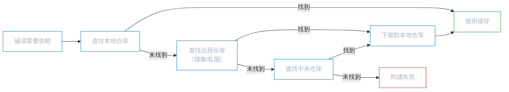

# 概述与安装

**本文你会学到**：

- 🤔 为什么 Java 项目需要构建工具——从手动管理的痛点说起
- 🧱 Maven 的三个核心概念——`POM`、约定优于配置、仓库体系
- 🔧 在你的电脑上安装并配置 Maven——下载、环境变量、`settings.xml`
- ✅ 验证安装是否成功——以及常见问题的排查方法

## 🤔 为什么需要构建工具？

### 手动管理 jar 包的痛点

假设你现在要开发一个 Spring 项目，不使用任何构建工具。你的第一步是什么？去官网逐个下载需要的 jar 包——`spring-core`、`spring-context`、`spring-beans`……光是 Spring 家族就有十几个。再加上日志框架、数据库驱动、测试库，轻松超过 30 个 jar 包。

这时候你会遇到一连串让人崩溃的问题：

📌 **痛点一：版本冲突难以排查**

`spring-context 6.0` 依赖 `spring-core 6.0`，但你手动下载时可能拿了一个 `spring-core 5.3`。编译不报错，运行时却抛出 `NoSuchMethodError`——因为两个版本的方法签名不一致。手动排查这种冲突，就像在一堆面条里找哪根打了结。

📌 **痛点二：项目结构各不相同**

张三把源码放在 `src/` 下，李四放在 `java/` 下，王五放在 `main/` 下。没有统一标准，每次接手别人的项目都要先搞清楚目录布局。团队协作时，新人入职光是搞清楚「代码放哪」就要花半天。

📌 **痛点三：构建流程全靠手工**

编译要用 `javac`，打包要用 `jar`，运行测试要用 `junit` 的 runner，部署要手动拷贝文件……每个步骤都要手动敲命令，容易出错且不可复现。

### Maven 解决了什么问题

`Maven` 是 Apache 基金会维护的 Java 项目构建与依赖管理工具。它用声明式的方式告诉 Maven「我要什么」，剩下的交给工具自动完成。

| 场景 | 手动管理 | 使用 Maven |
|------|---------|-----------|
| 引入依赖 | 逐个下载 jar 包，手动放入 `lib/` | 在 `pom.xml` 中声明坐标，自动下载 |
| 版本冲突 | 运行时才发现，逐个排查 | 构建时自动解析依赖树，提示冲突 |
| 项目结构 | 每个项目自己定义，无统一标准 | 遵循约定目录结构，开箱即用 |
| 编译打包 | 手动执行 `javac`、`jar` 命令 | 一条 `mvn package` 完成全部流程 |
| 团队协作 | 交换项目时要对齐目录和构建步骤 | 统一结构 + 统一命令，零成本切换 |

## 🧠 Maven 核心概念

### 项目对象模型（POM）

你盖房子之前，建筑师会先画一份建筑图纸——标注了面积、层数、用什么材料。Maven 的 `POM`（Project Object Model，项目对象模型）就是项目的「建筑图纸」，它以 `pom.xml` 文件的形式存在于项目根目录，描述了项目的基本信息、依赖列表和构建规则。

一个最简的 `pom.xml` 长这样：

``` xml title="最小 POM 示例"
<project xmlns="http://maven.apache.org/POM/4.0.0"
         xmlns:xsi="http://www.w3.org/2001/XMLSchema-instance"
         xsi:schemaLocation="http://maven.apache.org/POM/4.0.0
         http://maven.apache.org/xsd/maven-4.0.0.xsd">

    <modelVersion>4.0.0</modelVersion>

    <!-- 项目坐标：Maven 通过这三个字段唯一定位一个构件 -->
    <groupId>com.example</groupId>
    <artifactId>my-project</artifactId>
    <version>1.0.0</version>

</project>
```

其中 `groupId`、`artifactId`、`version` 三个字段合称**项目坐标**，相当于构件的「身份证号」——Maven 仓库中成千上万个 jar 包就是靠坐标来区分的。

### 约定优于配置

标准化工厂流水线上的工人不需要每次都重新决定「零件放在哪」，因为流水线已经规定了每个工位的位置和操作流程。Maven 采用同样的思路——**约定优于配置**（Convention over Configuration）：它预定义了一套标准目录结构，你只要把文件放到对应位置，Maven 就能找到并处理它们。

```
my-project/
├── pom.xml                      # 项目描述文件（必须）
├── src/
│   ├── main/
│   │   ├── java/                # 源代码
│   │   ├── resources/           # 资源文件（配置文件、模板等）
│   │   └── webapp/              # Web 应用资源（WAR 项目才有）
│   └── test/
│       ├── java/                # 测试代码
│       └── resources/           # 测试资源文件
└── target/                      # 构建输出（自动生成，勿手动修改）
```

🎯 你不需要在 `pom.xml` 里写「源码在 `src/main/java`」——Maven 默认就知道。这减少了大量重复配置，也让不同项目之间的结构保持一致。

### 仓库体系

Maven 的仓库体系就像一个中央物流仓储系统：你需要某个 jar 包时，Maven 会按顺序从不同层级的仓库中查找和下载。

📦 **本地仓库**（Local Repository）

你电脑上的一个目录（默认是 `~/.m2/repository/`），存放已下载的依赖。第一次用某个依赖时从远程下载，之后直接从本地读取，不用重复下载。

🌐 **远程仓库**（Remote Repository）

团队或公司搭建的私有服务器，或者公共镜像站（如阿里云 Maven 镜像）。本地仓库找不到依赖时，会到远程仓库查找。

🏛️ **中央仓库**（Central Repository）

Maven 社区维护的全球公共仓库（`repo.maven.apache.org`），收录了绝大多数开源 Java 库。当远程仓库也没有时，最终会到中央仓库查找。

依赖的搜索顺序如下：



## 🔧 安装与配置

### 下载与解压

前往 Maven 官网下载页面获取最新版本：

- 下载地址：https://maven.apache.org/download.cgi
- 选择 `Binary zip archive`（Windows）或 `Binary tar.gz archive`（Linux/macOS）下载
- 解压到一个**路径无空格、无中文**的目录

!!! warning "路径中避免空格和中文"

    不要解压到 `C:\Program Files\` 或包含中文的路径下（如 `C:\我的软件\`），否则可能导致 Maven 运行异常。推荐使用类似 `E:\apache-maven-3.9.x` 这样的路径。

### 环境变量配置

在配置 Maven 之前，先确认 `JAVA_HOME` 已经正确设置——Maven 依赖 JDK 运行。

=== "Windows"

    1. **检查 JAVA_HOME**（如果未设置，先安装 JDK）：

    ``` powershell title="检查 JAVA_HOME"
    echo $env:JAVA_HOME
    java -version
    ```

    2. **设置 MAVEN_HOME**（指向 Maven 解压目录）：

    ``` powershell title="设置 MAVEN_HOME 环境变量"
    # 以实际解压路径为准
    [System.Environment]::SetEnvironmentVariable("MAVEN_HOME", "E:\apache-maven-3.9.9", "User")
    ```

    3. **将 Maven 的 bin 目录加入 Path**：

    ``` powershell title="将 Maven 加入 Path"
    $currentPath = [System.Environment]::GetEnvironmentVariable("Path", "User")
    [System.Environment]::SetEnvironmentVariable("Path", "$currentPath;%MAVEN_HOME%\bin", "User")
    ```

    !!! tip "永久生效"

        上述命令设置的是用户级环境变量，需要**重新打开终端窗口**才能生效。也可以通过「系统属性 → 环境变量」图形界面手动配置。

=== "Linux/macOS"

    1. **检查 JAVA_HOME**：

    ``` bash title="检查 JAVA_HOME"
    echo $JAVA_HOME
    java -version
    ```

    2. **在 Shell 配置文件中添加环境变量**（`~/.bashrc` 或 `~/.zshrc`）：

    ``` bash title="设置环境变量（添加到 ~/.bashrc 或 ~/.zshrc）"
    # 以实际解压路径为准
    export MAVEN_HOME=/opt/apache-maven-3.9.9
    export PATH=$MAVEN_HOME/bin:$PATH
    ```

    3. **使配置生效**：

    ``` bash title="重新加载配置"
    source ~/.bashrc   # 如果用 bash
    source ~/.zshrc    # 如果用 zsh
    ```

### settings.xml 核心配置

`settings.xml` 是 Maven 的全局配置文件，用于自定义本地仓库路径、镜像源、JDK 版本等。Maven 安装目录的 `conf/settings.xml` 是全局配置，`~/.m2/settings.xml` 是用户级配置（优先级更高）。

建议直接修改用户级配置文件，这样升级 Maven 版本时配置不会丢失。

🔧 **配置一：本地仓库路径**

默认本地仓库在用户目录下的 `.m2/repository/`。如果你想把依赖存放到其他位置（比如专门的盘符），修改 `<localRepository>`：

``` xml title="settings.xml — 本地仓库路径"
<!-- 自定义本地仓库路径 -->
<localRepository>E:/repository</localRepository>
```

🚀 **配置二：阿里云镜像**

Maven 默认从中央仓库下载依赖，服务器在国外，国内访问较慢。配置阿里云镜像可以大幅加速下载：

``` xml title="settings.xml — 阿里云镜像"
<settings xmlns="http://maven.apache.org/SETTINGS/1.2.0"
          xmlns:xsi="http://www.w3.org/2001/XMLSchema-instance"
          xsi:schemaLocation="http://maven.apache.org/SETTINGS/1.2.0
          https://maven.apache.org/xsd/settings-1.2.0.xsd">

    <!-- 省略其他配置 -->

    <mirrors>
        <mirror>
            <id>aliyunmaven</id>
            <mirrorOf>central</mirrorOf>
            <name>阿里云公共仓库</name>
            <url>https://maven.aliyun.com/repository/public</url>
        </mirror>
    </mirrors>

</settings>
```

!!! tip "mirrorOf 的含义"

    `<mirrorOf>central</mirrorOf>` 表示这个镜像只替代中央仓库（`central`）。如果你还配置了私服，可以用 `<mirrorOf>*</mirrorOf>` 替代所有远程仓库（慎用，会把私服也代理掉）。

⚙️ **配置三：JDK 版本**

Maven 默认编译版本是 Java 1.5（非常老旧），需要手动指定与你的 JDK 版本一致。通过 `<profiles>` 配置：

``` xml title="settings.xml — JDK 版本"
<settings xmlns="http://maven.apache.org/SETTINGS/1.2.0"
          xmlns:xsi="http://www.w3.org/2001/XMLSchema-instance"
          xsi:schemaLocation="http://maven.apache.org/SETTINGS/1.2.0
          https://maven.apache.org/xsd/settings-1.2.0.xsd">

    <!-- 省略其他配置 -->

    <profiles>
        <profile>
            <id>jdk-17</id>
            <activation>
                <activeByDefault>true</activeByDefault>
                <jdk>17</jdk>
            </activation>
            <properties>
                <maven.compiler.source>17</maven.compiler.source>
                <maven.compiler.target>17</maven.compiler.target>
                <maven.compiler.compilerVersion>17</maven.compiler.compilerVersion>
            </properties>
        </profile>
    </profiles>

</settings>
```

💡 配置完成后，可以在 IDE（如 IntelliJ IDEA）中查看 `Settings → Build → Build Tools → Maven`，确认 `User settings file` 指向你修改的 `settings.xml` 文件。

## ✅ 验证安装

打开终端，执行以下命令：

``` bash title="验证 Maven 安装"
mvn -v
```

如果一切正常，你会看到类似输出：

```
Apache Maven 3.9.9 (8e13cb4fde67425a2e15e8959d49b4b4c4f8a5c3)
Maven home: E:\apache-maven-3.9.9
Java version: 17.0.12, vendor: Eclipse Adoptium, runtime: C:\Program Files\Eclipse Adoptium\jdk-17
Default locale: zh_CN, platform encoding: GBK
OS name: "windows 11", version: "10.0", arch: "amd64", family: "windows"
```

看到 `Maven home` 和 `Java version` 信息，说明 Maven 已正确安装并关联了 JDK。

### 常见问题排查

!!! warning "报错：'mvn' 不是内部或外部命令"

    **原因**：环境变量 Path 中没有正确添加 Maven 的 `bin` 目录。

    **解决**：检查 `MAVEN_HOME` 是否指向正确的 Maven 安装目录，并确认 Path 中包含 `%MAVEN_HOME%\bin`（Windows）或 `$MAVEN_HOME/bin`（Linux/macOS）。修改后需要**重新打开终端窗口**。

!!! warning "报错：The JAVA_HOME environment variable is not defined correctly"

    **原因**：`JAVA_HOME` 未设置，或指向了 JRE 而非 JDK 目录。

    **解决**：执行 `echo $env:JAVA_HOME`（Windows）或 `echo $JAVA_HOME`（Linux/macOS）检查路径。确保它指向 JDK 的根目录（如 `C:\Program Files\Eclipse Adoptium\jdk-17`），而不是 `bin` 或 `jre` 子目录。

!!! warning "Maven 下载依赖极慢"

    **原因**：默认从国外中央仓库下载，国内网络延迟较高。

    **解决**：在 `settings.xml` 中配置阿里云镜像（见上方「配置二：阿里云镜像」）。
