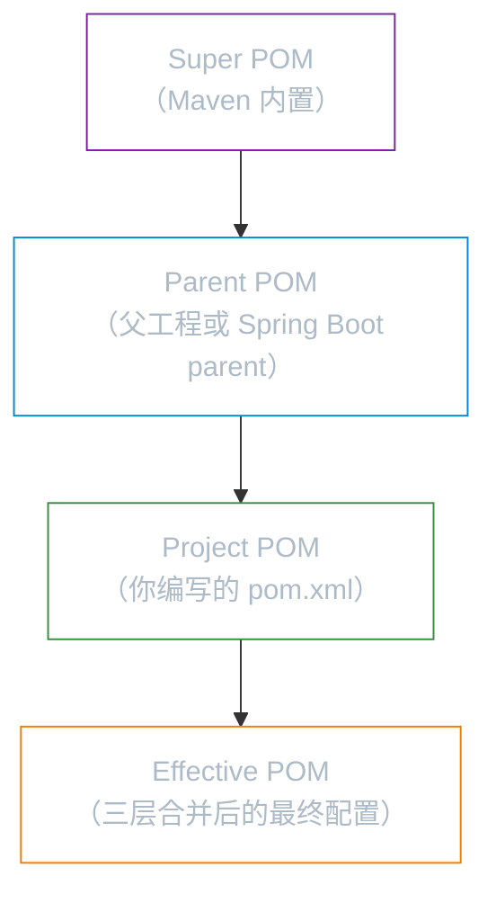

# POM 详解

**本文你会学到**：

- `POM` 是什么，为什么它是 Maven 项目的核心
- `GAV` 坐标如何唯一标识每一个 Maven 构件
- `pom.xml` 中的关键配置标签：依赖、构建、属性、多模块
- 从 `Super POM` 到 `Effective POM` 的完整继承层次

## 📄 POM 是什么

当你启动一个 Java 项目时，Maven 怎么知道你的项目依赖哪些 jar？怎么知道用什么 Java 版本编译？怎么知道打包成 `jar` 还是 `war`？

答案全在一个文件里——`pom.xml`。

`POM`（Project Object Model，项目对象模型）是 Maven 项目的核心配置模型，`pom.xml` 是它的具体体现，固定放在项目根目录。类比一下：盖房子之前要有建筑图纸，图纸里记录了面积、层数、用料等所有建造细节。`pom.xml` 就是项目的建筑图纸——它告诉 Maven 这个项目叫什么、依赖什么库、怎么编译、怎么打包。

你在「概述与安装」中已经见过一个最小的 `pom.xml`，下面我们逐层展开它包含的所有配置。

## 🏷️ GAV 坐标

想象你走进一座大型图书馆，想找一本书。你会怎么做？先查索书号，然后根据索书号定位到具体的书架和位置。Maven 仓库中存储了成千上万个构件（jar、war、pom 等），每个构件也需要一个「索书号」来唯一定位——这就是 `GAV` 坐标。

### groupId / artifactId / version

`GAV` 由三个字段组成：

| 字段 | 含义 | 类比 | 示例 |
|------|------|------|------|
| `groupId` | 组织或团体的标识 | 出版社名称 | `com.example`、`org.springframework` |
| `artifactId` | 项目或模块的名称 | 书名 | `my-project`、`spring-core` |
| `version` | 版本号 | 版次 | `1.0.0`、`6.2.0` |

三个字段组合在一起就能唯一确定 Maven 仓库中的一个构件。Maven 中央仓库的寻址规则就是根据 GAV 坐标生成的：

```
groupId 中的 . 替换为 /
↓
artifactId
↓
version
↓
artifactId-version.packaging
```

例如 `com.example` + `my-project` + `1.0.0` + `jar`，对应的仓库路径为：

```
com/example/my-project/1.0.0/my-project-1.0.0.jar
```

**版本号规范**：

| 版本后缀 | 含义 | 说明 |
|---------|------|------|
| `SNAPSHOT` | 开发版 | 快照版本，每次构建时 Maven 会自动检查远程仓库是否有更新 |
| `RELEASE` | 发布版 | 稳定版本，一旦发布不再变更 |
| `Alpha` | 内测版 | 功能不完整，可能有较多 bug |
| `Beta` | 公测版 | 功能基本完整，但仍需测试验证 |

``` xml title="pom.xml — GAV 坐标声明"
<project>
    <modelVersion>4.0.0</modelVersion>

    <!-- GAV 坐标 -->
    <groupId>com.example</groupId>
    <artifactId>my-project</artifactId>
    <version>1.0.0</version>
</project>
```

!!! info "modelVersion 是什么"

    `<modelVersion>4.0.0</modelVersion>` 声明了 POM 模型的版本。目前 Maven 2.x 和 3.x 都使用 `4.0.0`，这是固定写法，直接照抄即可。

## 📦 打包方式

你写完了一个项目，最终要产出一个「交付物」——是直接打包成可执行的 jar？还是打成 war 部署到 Tomcat？或者这个项目本身只是一个父工程，不需要产出任何文件？

`<packaging>` 标签决定了 Maven 的打包策略。

### jar / war / pom 对比

| 打包方式 | 说明 | 默认 | 适用场景 |
|---------|------|------|---------|
| `jar` | Java 归档文件 | 是（默认值可省略） | 普通项目、工具库 |
| `war` | Web 应用归档 | 否 | Web 项目（部署到 Tomcat 等） |
| `pom` | 项目对象模型 | 否 | 父工程/聚合工程（不产生可执行文件） |

``` xml title="pom.xml — 打包方式"
<!-- 普通项目（jar 是默认值，可省略） -->
<packaging>jar</packaging>

<!-- Web 项目 -->
<packaging>war</packaging>

<!-- 父工程 / 聚合工程 -->
<packaging>pom</packaging>
```

如果不写 `<packaging>`，Maven 默认按 `jar` 处理。

## ⚙️ 基础配置标签

### properties

当你有几十个依赖都依赖同一个版本号（比如 Spring 全家桶），每次升级都要逐个改版本——这既繁琐又容易遗漏。`<properties>` 就是解决这个问题的：它让你定义一组键值对，在 `pom.xml` 的其他位置用 `${key}` 引用，改一处即全局生效。

``` xml title="pom.xml — 属性配置"
<properties>
    <!-- 源码编码 -->
    <project.build.sourceEncoding>UTF-8</project.build.sourceEncoding>

    <!-- Java 编译版本 -->
    <maven.compiler.source>17</maven.compiler.source>
    <maven.compiler.target>17</maven.compiler.target>

    <!-- 自定义属性（依赖版本统一管理） -->
    <spring.version>6.2.0</spring.version>
    <junit.version>5.11.0</junit.version>
</properties>
```

常用内置属性说明：

| 属性 | 含义 | 推荐值 |
|------|------|-------|
| `project.build.sourceEncoding` | 构建时读取源码的字符集 | `UTF-8` |
| `maven.compiler.source` | 源代码使用的 Java 版本 | 与你的 JDK 版本一致 |
| `maven.compiler.target` | 编译后字节码的目标 Java 版本 | 通常与 source 保持一致 |

自定义属性（如 `spring.version`）的用法是 `${spring.version}`——后面「属性引用」章节会详细介绍。

### name / description / url

这三个标签不影响构建，但对项目的可识别性很重要——尤其在团队协作或发布到仓库时。

``` xml title="pom.xml — 项目基本信息"
<!-- 项目名称（人类可读，不同于 artifactId） -->
<name>My Project</name>

<!-- 项目描述 -->
<description>一个用于演示 Maven POM 配置的示例项目</description>

<!-- 项目主页 -->
<url>https://github.com/example/my-project</url>
```

## 🔗 依赖配置

### dependencies 与 dependency

Maven 项目最核心的能力之一就是自动管理依赖。你不需要手动下载 jar 包，只需要在 `<dependencies>` 中声明「我需要什么」，Maven 会自动从仓库下载并放到 classpath 中。

``` xml title="pom.xml — 最小依赖声明"
<dependencies>
    <dependency>
        <groupId>org.springframework</groupId>
        <artifactId>spring-context</artifactId>
        <version>6.2.0</version>
    </dependency>
</dependencies>
```

一个 `<dependency>` 最少需要三个子标签：`groupId`、`artifactId`、`version`。但当父工程用 `<dependencyManagement>` 统一管理版本时，子模块中 `<version>` 可以省略。

### dependencyManagement 统一版本管理

假设你的项目有 5 个模块都依赖 Spring，每个模块都各自写版本号。有一天你要升级 Spring 版本——改 5 个文件？太容易漏了。

`<dependencyManagement>` 的作用是：**只声明版本，不实际引入依赖**。子模块需要用的时候只写 `groupId` + `artifactId`，版本由父 POM 统一控制。

``` xml title="父 POM — dependencyManagement 声明"
<dependencyManagement>
    <dependencies>
        <dependency>
            <groupId>org.springframework</groupId>
            <artifactId>spring-context</artifactId>
            <version>${spring.version}</version>
        </dependency>
        <dependency>
            <groupId>org.junit.jupiter</groupId>
            <artifactId>junit-jupiter</artifactId>
            <version>${junit.version}</version>
            <scope>test</scope>
        </dependency>
    </dependencies>
</dependencyManagement>
```

``` xml title="子 POM — 省略版本号"
<dependencies>
    <!-- 版本由父 POM 的 dependencyManagement 控制，此处省略 -->
    <dependency>
        <groupId>org.springframework</groupId>
        <artifactId>spring-context</artifactId>
    </dependency>
</dependencies>
```

!!! warning "子 POM 显式指定版本时"

    如果子 POM 在 `<dependency>` 中显式写了 `<version>`，Maven 会**优先使用子 POM 的版本**，忽略 `<dependencyManagement>` 中的声明。这通常不是你想要的行为——所以要管住手，不要在子模块中重复写版本号。

两者的区别一览：

| 对比项 | `dependencies` | `dependencyManagement` |
|-------|---------------|----------------------|
| 是否实际引入依赖 | 直接引入 | 只声明版本，不引入 |
| 子模块是否自动继承 | 是，所有子模块都会有 | 否，子模块需要自己声明（但不写版本） |
| 适用场景 | 每个模块都需要的通用依赖 | 统一管理版本，避免不一致 |

### 依赖排除（exclusions）

Maven 的依赖是传递性的：你依赖了 A，A 又依赖了 B，B 会自动出现在你的 classpath 中。大多数时候这是好事，但有时你会遇到麻烦——比如 A 传递引入了一个你不需要的日志框架，或者 A 和 C 都传递引入了同一个库的不同版本，导致冲突。

`<exclusions>` 让你精确地排除掉某个传递依赖：

``` xml title="pom.xml — 排除传递依赖"
<dependency>
    <groupId>com.example</groupId>
    <artifactId>library-a</artifactId>
    <version>1.0.0</version>
    <exclusions>
        <exclusion>
            <!-- 排除 library-a 传递引入的 commons-logging -->
            <groupId>commons-logging</groupId>
            <artifactId>commons-logging</artifactId>
        </exclusion>
    </exclusions>
</dependency>
```

注意 `<exclusion>` 中不需要 `<version>`——Maven 会排除该 `groupId` + `artifactId` 的所有版本。

**小结**：依赖配置三板斧——`dependencies` 引入依赖、`dependencyManagement` 统一版本、`exclusions` 排除冲突。

## 🔨 构建配置

### build 与 plugins

`<build>` 是 Maven 构建相关的配置入口，其中最常用的是 `<plugins>` ——它定义了构建过程中使用的插件及其配置。

``` xml title="pom.xml — 插件配置"
<build>
    <plugins>
        <!-- Spring Boot 打包插件 -->
        <plugin>
            <groupId>org.springframework.boot</groupId>
            <artifactId>spring-boot-maven-plugin</artifactId>
            <version>3.5.0</version>
        </plugin>
    </plugins>
</build>
```

每个 `<plugin>` 同样通过 `groupId` + `artifactId` + `version` 来标识。插件（Plugin）是 Maven 执行具体任务的核心机制——编译用 `maven-compiler-plugin`，打包用 `maven-jar-plugin`，运行测试用 `maven-surefire-plugin`。你在「生命周期与插件」中会详细了解它们的关系。

### pluginManagement

和 `<dependencyManagement>` 的思路完全一样：`<pluginManagement>` 只声明插件的版本和配置，**不会实际绑定到构建过程中**。子模块需要用的时候再显式引入。

| 对比项 | `plugins` | `pluginManagement` |
|-------|----------|-------------------|
| 是否生效 | 直接生效，参与构建 | 只声明，不生效 |
| 子模块是否自动继承 | 是 | 否，子模块需要在 `<plugins>` 中声明才生效 |
| 适用场景 | 每个模块都需要的插件 | 统一管理插件版本和配置 |

``` xml title="父 POM — pluginManagement 声明"
<build>
    <pluginManagement>
        <plugins>
            <plugin>
                <groupId>org.springframework.boot</groupId>
                <artifactId>spring-boot-maven-plugin</artifactId>
                <version>3.5.0</version>
                <configuration>
                    <excludes>
                        <exclude>
                            <groupId>org.projectlombok</groupId>
                            <artifactId>lombok</artifactId>
                        </exclude>
                    </excludes>
                </configuration>
            </plugin>
        </plugins>
    </pluginManagement>
</build>
```

``` xml title="子 POM — 引入插件（省略版本和配置）"
<build>
    <plugins>
        <plugin>
            <groupId>org.springframework.boot</groupId>
            <artifactId>spring-boot-maven-plugin</artifactId>
            <!-- 版本和 configuration 由父 POM 的 pluginManagement 提供 -->
        </plugin>
    </plugins>
</build>
```

### executions 绑定生命周期

插件本身只是提供了「能力」（比如编译、打包、生成文档），但这些能力不会自动执行——你需要告诉 Maven 在构建的哪个阶段（Phase）执行插件的哪个目标（Goal）。`<executions>` 就是用来做这个绑定的。

``` xml title="pom.xml — 将 goal 绑定到生命周期阶段"
<build>
    <plugins>
        <plugin>
            <groupId>org.apache.maven.plugins</groupId>
            <artifactId>maven-source-plugin</artifactId>
            <version>3.3.1</version>
            <executions>
                <execution>
                    <id>attach-sources</id>
                    <!-- 在 package 阶段执行 jar-no-fork 这个 goal -->
                    <phase>package</phase>
                    <goals>
                        <goal>jar-no-fork</goal>
                    </goals>
                </execution>
            </executions>
        </plugin>
    </plugins>
</build>
```

这段配置的含义：在 Maven 构建的 `package` 阶段，自动执行 `maven-source-plugin` 的 `jar-no-fork` 目标——它会为你的项目生成一份源码 jar 包。

**小结**：构建配置也是三板斧——`plugins` 直接生效、`pluginManagement` 统一管理、`executions` 绑定生命周期。

## 🗂️ 多模块管理

当你的项目规模增长到一定程度，把所有代码塞在一个模块里会变得难以维护。Java 项目通常采用**父子工程**的方式拆分模块——一个父工程统一管理配置，每个子工程专注于各自的业务领域。

### parent 继承

`parent` 机制让子 POM 继承父 POM 的配置，避免在每个子模块中重复声明。

``` xml title="父 POM — 作为父工程（packaging 必须为 pom）"
<project>
    <modelVersion>4.0.0</modelVersion>

    <groupId>com.example</groupId>
    <artifactId>parent-project</artifactId>
    <version>1.0.0</version>
    <packaging>pom</packaging>

    <!-- 统一管理版本 -->
    <properties>
        <spring.version>6.2.0</spring.version>
    </properties>

    <dependencyManagement>
        <dependencies>
            <dependency>
                <groupId>org.springframework</groupId>
                <artifactId>spring-context</artifactId>
                <version>${spring.version}</version>
            </dependency>
        </dependencies>
    </dependencyManagement>
</project>
```

``` xml title="子 POM — 通过 parent 继承配置"
<project>
    <modelVersion>4.0.0</modelVersion>

    <!-- 声明父工程 -->
    <parent>
        <groupId>com.example</groupId>
        <artifactId>parent-project</artifactId>
        <version>1.0.0</version>
        <!-- 父 POM 的相对路径（默认 ../pom.xml） -->
        <relativePath>../pom.xml</relativePath>
    </parent>

    <!-- 子模块只需声明 artifactId（groupId 和 version 继承自父 POM） -->
    <artifactId>child-module</artifactId>
</project>
```

子 POM 通过 `<parent>` 标签找到父 POM 并继承其配置。`<relativePath>` 告诉 Maven 父 POM 文件相对于当前文件的路径，默认值是 `../pom.xml`，如果父 POM 就在上一级目录可以省略。

可继承的元素包括：

| 可继承元素 | 说明 |
|-----------|------|
| `properties` | 属性定义 |
| `dependencies` | 直接依赖 |
| `dependencyManagement` | 依赖版本管理 |
| `plugins` | 插件配置 |
| `pluginManagement` | 插件版本管理 |
| `repositories` | 仓库配置 |

### modules 聚合

聚合（Aggregation）是另一个维度的能力：它让你在父工程中执行一次构建命令，就能同时构建所有子模块。

``` xml title="父 POM — 聚合子模块"
<project>
    <groupId>com.example</groupId>
    <artifactId>parent-project</artifactId>
    <version>1.0.0</version>
    <packaging>pom</packaging>

    <modules>
        <module>child-module-a</module>
        <module>child-module-b</module>
        <module>child-module-c</module>
    </modules>
</project>
```

`<module>` 的值是子模块目录名（相对于父 POM 所在目录），不是 `artifactId`。模块的书写顺序无关紧要——Maven 会根据模块间的依赖关系自动确定构建顺序。

聚合和继承是两个独立的概念，对比一下：

| 对比项 | 聚合（modules） | 继承（parent） |
|-------|----------------|---------------|
| 目的 | 一次构建多个模块 | 子模块复用父模块的配置 |
| 声明位置 | 父 POM 中的 `<modules>` | 子 POM 中的 `<parent>` |
| 是否要求 packaging=pom | 是 | 是 |
| 能否独立使用 | 可以只聚合不继承 | 可以只继承不聚合 |
| 实际项目 | 通常结合使用 | 通常结合使用 |

实际项目中，聚合和继承通常放在同一个父 POM 中——它既是子模块的「父亲」（提供配置继承），又是「指挥官」（聚合构建所有子模块）。

## 📊 POM 层次

到目前为止，你只接触了自己写的 `pom.xml`。但实际上，每个 Maven 项目的 POM 配置是由多层 POM 合并而成的。理解这个层次结构，能帮助你弄清楚「为什么我没配置这个插件，它也能正常工作」。

### Super POM → Parent POM → Project POM → Effective POM



- **Super POM**：Maven 内置的默认 POM，定义了标准目录结构、默认插件配置等基础设定。你不需要关心它的内容，但每个项目都隐式继承它
- **Parent POM**：你的项目继承的父工程 POM（如 `spring-boot-starter-parent`）。它预配置了大量常用插件的版本和参数，你拿来就能用
- **Project POM**：你自己编写的 `pom.xml`，只写差异配置即可
- **Effective POM**：以上三层按继承规则合并后的最终配置，是 Maven 构建时真正使用的配置

如果你想查看当前项目的 Effective POM（看看 Maven 到底在用什么配置），执行：

``` bash title="查看 Effective POM"
mvn help:effective-pom
```

这会输出一份完整的 POM 配置——你会发现它比你写的 `pom.xml` 长得多，因为 Super POM 和 Parent POM 中的大量默认配置都被合并进来了。

## 🔤 属性引用 ${}

在前面各章节中，你已经多次见到 `${...}` 这种写法。Maven 的属性引用机制让你在 `pom.xml` 中用一个占位符代替实际值，统一管理、减少重复。

Maven 属性有 4 种来源：

| 属性来源 | 语法 | 示例 |
|---------|------|------|
| `<properties>` 自定义属性 | `${自定义键}` | `${spring.version}` |
| POM 标签引用 | `${project.标签名}` | `${project.artifactId}`、`${project.version}` |
| Java 系统属性 | `${Java 属性名}` | `${java.home}`、`${java.version}` |
| 环境变量 | `${env.变量名}` | `${env.JAVA_HOME}` |

**自定义属性**（最常用）：

``` xml title="pom.xml — 自定义属性"
<properties>
    <spring.version>6.2.0</spring.version>
</properties>

<dependencyManagement>
    <dependencies>
        <dependency>
            <groupId>org.springframework</groupId>
            <artifactId>spring-context</artifactId>
            <version>${spring.version}</version>
        </dependency>
        <dependency>
            <groupId>org.springframework</groupId>
            <artifactId>spring-beans</artifactId>
            <version>${spring.version}</version>
        </dependency>
    </dependencies>
</dependencyManagement>
```

升级 Spring 版本时只需改 `properties` 中的 `spring.version`，所有引用处自动生效。

**POM 标签引用**：

在 `pom.xml` 的任何位置都可以用 `${project.xxx}` 引用当前 POM 中已定义的标签值。常见用法是在构建配置中引用项目坐标：

``` xml title="pom.xml — 引用 POM 标签"
<!-- ${project.artifactId} → my-project -->
<!-- ${project.version} → 1.0.0 -->
<!-- ${project.build.finalName} → my-project-1.0.0 -->
```

**Java 系统属性**：

就是 `System.getProperties()` 返回的那些值。可以用以下命令查看具体内容：

``` bash title="查看 Maven 可用的 Java 系统属性"
mvn help:evaluate -Dexpression=java.home
```

**环境变量**：

操作系统定义的环境变量，用 `${env.变量名}` 访问。比如 `${env.JAVA_HOME}` 可以获取 JDK 安装路径。这种用法在 CI/CD 环境中比较常见，用来注入构建时才确定的配置值。
