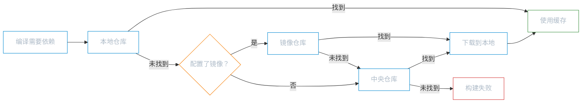

# 仓库与 Profile

**本文你会学到**：

- `Maven` 的三级仓库体系如何协同工作——本地、中央、镜像各自的职责
- `Nexus` 私服的搭建与使用——代理缓存、内部共享库、发布与消费
- `Profile` 机制如何解决多环境配置切换——开发/测试/生产一键切换

## 📦 Maven 仓库体系

当你在项目中引入一个新依赖并执行 `mvn compile` 时，Maven 是从哪里找到那些 jar 包的？答案就是仓库体系——一个三级缓存的「物流仓储系统」。

### 本地仓库

📦 本地仓库是你电脑上的一个目录，存放所有已下载的依赖。第一次使用某个依赖时，Maven 会从远程下载到本地；之后再次使用时直接读取本地缓存，不用重复下载。

默认位置：

```
~/.m2/repository/
```

Windows 上具体路径是 `C:\Users\用户名\.m2\repository\`。

如果你想自定义路径（比如把依赖放到专门的盘符），在 `settings.xml` 中修改 `<localRepository>`：

``` xml title="settings.xml — 自定义本地仓库路径"
<settings>
    <!-- 将本地仓库指向 E 盘 -->
    <localRepository>E:/repository</localRepository>
</settings>
```

本地仓库的目录结构与 `GAV` 坐标严格对应——`groupId` 中的 `.` 替换为 `/`，然后是 `artifactId`、`version`。例如查找 `com.example:my-project:1.0.0`：

```
~/.m2/repository/
└── com/
    └── example/
        └── my-project/
            └── 1.0.0/
                ├── my-project-1.0.0.jar
                ├── my-project-1.0.0.pom
                └── _remote.repositories
```

### 中央仓库

🏛️ 中央仓库（Central Repository）是 Maven 社区维护的全球公共仓库，地址是 `https://repo.maven.apache.org/maven2/`。它收录了绝大多数开源 Java 库——Spring、Hibernate、JUnit、Logback 等都在这里。

你不需要手动配置中央仓库——`Super POM` 中已经默认配置了这个地址。回顾一下「概述与安装」中提到的 POM 层次：每个 Maven 项目都隐式继承 `Super POM`，所以中央仓库开箱即用。

### 镜像仓库

🌐 中央仓库的服务器在国外，国内直接访问速度较慢。镜像仓库（Mirror）就是中央仓库的「国内代理站」——功能和内容完全一样，但服务器在国内，下载速度大幅提升。

在 `settings.xml` 的 `<mirrors>` 中配置：

``` xml title="settings.xml — 配置阿里云镜像"
<settings>
    <mirrors>
        <mirror>
            <id>aliyunmaven</id>
            <mirrorOf>central</mirrorOf>
            <name>阿里云公共仓库</name>
            <url>https://maven.aliyun.com/repository/public</url>
        </mirror>
    </mirrors>
</settings>
```

🎯 `<mirrorOf>` 的匹配规则决定了镜像替代哪些远程仓库：

| `mirrorOf` 值 | 含义 | 使用建议 |
|--------------|------|---------|
| `central` | 只替代中央仓库 | 日常使用推荐，不影响私服等其他仓库 |
| `*` | 替代所有远程仓库 | 慎用，会把私服也代理掉 |
| `*,!repo1` | 替代除 `repo1` 外的所有仓库 | 需要保留某个仓库时使用 |
| `external:*` | 替代所有非 `localhost` 的远程仓库 | 本地开发有私服时使用 |

综合来看，Maven 查找依赖的完整流程如下：



## 🏢 Nexus 私服

当你在公司里做团队开发时，很快会遇到两个新问题：一是多人反复下载同一个 jar 包，浪费带宽；二是团队内部共享的公共库没有地方发布。`Nexus` 私服就是解决这两个问题的。

### Nexus 简介

`Sonatype Nexus` 是最流行的 Maven 私服（私有仓库管理器）。类比一下：如果说中央仓库是「全国图书总馆」，那私服就是你们「公司的图书室」——它既能代理外部资源（加速下载），又能存放团队内部文档（共享发布）。

企业使用 Nexus 的三大价值：

| 价值 | 说明 |
|------|------|
| 加速下载 | 代理中央仓库，团队内第一个下载后其他人直接从私服取 |
| 管理内部共享库 | 团队内部的公共组件发布到私服，其他项目直接引用 |
| 权限控制 | 控制谁可以下载、谁可以发布，保障安全性 |

### 仓库类型

Nexus 提供三种仓库类型，理解它们的区别是使用 Nexus 的基础：

| 类型 | 说明 | 存放内容 | 典型名称 |
|------|------|---------|---------|
| `proxy` | 远程仓库的代理 | 第三方 jar 的缓存（首次请求时从远程拉取） | `maven-central` |
| `hosted` | 本地存储 | 团队内部发布的包 | `maven-releases`、`maven-snapshots` |
| `group` | 仓库组 | 组合多个仓库的统一入口（对使用者透明） | `maven-public` |

📦 用一个类比来理解：`proxy` 是「代购」（帮你从外部买东西并缓存）、`hosted` 是「自营仓」（存放你自己的商品）、`group` 是「综合柜台」（把代购和自营的商品统一展示，顾客不需要关心来源）。

Nexus 安装后默认提供以下仓库：

```
maven-public (group)
├── maven-central (proxy)    → 代理中央仓库
├── maven-releases (hosted)  → 存放正式版（Release）
└── maven-snapshots (hosted) → 存放快照版（SNAPSHOT）
```

### 搭建与启动

🔧 搭建 Nexus 非常简单，解压即用：

1. 下载 Nexus Repository Manager：https://help.sonatype.com/en/download.html
2. 解压到任意目录（路径避免空格和中文）
3. 启动服务：

=== "Windows"

    ``` bash title="启动 Nexus（Windows）"
    # 进入解压目录下的 bin 文件夹
    cd nexus-<version>/bin

    # 前台运行（可看到启动日志）
    nexus.exe /run
    ```

=== "Linux/macOS"

    ``` bash title="启动 Nexus（Linux/macOS）"
    # 进入解压目录下的 bin 文件夹
    cd nexus-<version>/bin

    # 后台启动
    ./nexus start

    # 查看运行状态
    ./nexus status
    ```

4. 访问 `http://localhost:8081`，看到 Nexus 界面说明启动成功

!!! warning "首次登录密码"
    Nexus 3.x 首次登录使用 `admin` 账号，初始密码存放在 `sonatype-work/nexus3/admin.password` 文件中。登录后会要求你修改密码，请妥善保管。

### 配置 Maven 连接 Nexus

Nexus 启动后，需要让 Maven 知道它的存在。配置分两步：第一步告诉 Maven「去哪里下载依赖」，第二步告诉 Maven「下载时用什么身份认证」。

📌 **步骤一：配置仓库地址**

在 `pom.xml` 中添加 `<repositories>` 指向 Nexus 的 group 仓库（`maven-public` 是统一入口）：

``` xml title="pom.xml — 配置 Nexus 仓库"
<repositories>
    <repository>
        <id>nexus-public</id>
        <name>Nexus Public Repository</name>
        <url>http://localhost:8081/repository/maven-public/</url>
        <releases>
            <enabled>true</enabled>
        </releases>
        <snapshots>
            <enabled>true</enabled>
        </snapshots>
    </repository>
</repositories>
```

!!! tip "settings.xml 还是 pom.xml？"
    如果是公司级统一配置，推荐在 `settings.xml` 的 `<profile>` 中配置仓库，这样所有项目自动生效。如果是单个项目需要使用私服，则在 `pom.xml` 中配置即可。

📌 **步骤二：配置认证信息**

Nexus 的 `hosted` 仓库通常需要认证才能发布。在 `settings.xml` 的 `<servers>` 中配置账号密码——`<id>` 必须与仓库的 `<id>` 保持一致：

``` xml title="settings.xml — Nexus 认证"
<servers>
    <server>
        <!-- id 必须与 pom.xml 中 distributionManagement 的 repository id 一致 -->
        <id>nexus-releases</id>
        <username>admin</username>
        <password>your-password</password>
    </server>
    <server>
        <id>nexus-snapshots</id>
        <username>admin</username>
        <password>your-password</password>
    </server>
</servers>
```

### 发布 jar 包到 Nexus

当你开发了一个团队内部公共库（比如统一的工具类库），需要发布到 Nexus 让其他项目引用。在 `pom.xml` 中配置 `<distributionManagement>` 指定发布目标：

``` xml title="pom.xml — 配置发布目标"
<distributionManagement>
    <!-- 正式版发布到 maven-releases -->
    <repository>
        <id>nexus-releases</id>
        <name>Nexus Release Repository</name>
        <url>http://localhost:8081/repository/maven-releases/</url>
    </repository>
    <!-- 快照版发布到 maven-snapshots -->
    <snapshotRepository>
        <id>nexus-snapshots</id>
        <name>Nexus Snapshot Repository</name>
        <url>http://localhost:8081/repository/maven-snapshots/</url>
    </snapshotRepository>
</distributionManagement>
```

!!! warning "id 必须与 server 的 id 匹配"
    `<repository>` 和 `<snapshotRepository>` 的 `<id>` 必须与 `settings.xml` 中 `<server>` 的 `<id>` 完全一致，否则 Maven 找不到认证信息，发布会报 `401 Unauthorized` 错误。

配置完成后，执行 `mvn deploy` 即可发布：

``` bash title="发布到 Nexus"
mvn deploy
```

🚀 Maven 会根据项目版本号自动选择目标仓库：版本号以 `-SNAPSHOT` 结尾的发到 `maven-snapshots`，否则发到 `maven-releases`。

### 使用他人发布的包

你的同事已经把公共库发布到了 Nexus，你要怎么在项目中引用它？答案很简单——在 `pom.xml` 中添加 `<dependency>` 并确保 `<repositories>` 指向 Nexus 的 group 仓库即可：

``` xml title="pom.xml — 引用私服上的包"
<repositories>
    <repository>
        <id>nexus-public</id>
        <name>Nexus Public Repository</name>
        <url>http://localhost:8081/repository/maven-public/</url>
    </repository>
</repositories>

<dependencies>
    <!-- 正常声明依赖坐标，Maven 会自动从 Nexus 下载 -->
    <dependency>
        <groupId>com.mycompany</groupId>
        <artifactId>common-utils</artifactId>
        <version>1.0.0</version>
    </dependency>
</dependencies>
```

`maven-public` 是一个 group 仓库，它同时包含了 `proxy`（代理中央仓库）和 `hosted`（内部发布）的内容。所以配置这一个地址，既能下载外部依赖，也能下载内部共享库。

## ⚙️ Profile 机制

### Profile 解决什么问题

想象一下这个场景：你的项目在开发环境连的是本地数据库 `localhost:3306`，测试环境连的是 `192.168.1.100:3306`，生产环境连的是 `db.prod.example.com:3306`。每次切换环境都要手动改配置——改漏了一个地方就出 bug，非常痛苦。

`Profile` 就是解决这个问题的。类比一下：手机上的「场景模式」（静音模式、户外模式、会议模式），一键切换就能同时调整铃声大小、振动开关、屏幕亮度等多组配置。Maven 的 `Profile` 也是一键切换多组配置——开发环境一套、测试环境一套、生产环境一套。

常见的使用场景：

| 场景 | 举例 |
|------|------|
| 不同环境的数据库地址 | 开发 `localhost`、测试 `192.168.x.x`、生产 `db.prod.com` |
| 不同环境的依赖版本 | 开发用 `SNAPSHOT` 版本快速迭代，生产用 `Release` 版本 |
| 不同 JDK 版本编译 | 部分模块用 JDK 11，部分模块用 JDK 17 |
| 条件化引入插件 | 仅在 CI 环境启用代码覆盖率插件 |

### settings.xml 中的 Profile

`settings.xml` 中的 `Profile` 适合配置全局性的内容：仓库地址、插件仓库、属性等。它对这台机器上的所有项目生效。

``` xml title="settings.xml — Profile 配置"
<settings>
    <profiles>
        <profile>
            <id>nexus-profile</id>
            <repositories>
                <repository>
                    <id>nexus-public</id>
                    <name>Nexus Public Repository</name>
                    <url>http://localhost:8081/repository/maven-public/</url>
                    <releases><enabled>true</enabled></releases>
                    <snapshots><enabled>true</enabled></snapshots>
                </repository>
            </repositories>
            <properties>
                <!-- 定义全局属性，pom.xml 中可通过 ${nexus.url} 引用 -->
                <nexus.url>http://localhost:8081</nexus.url>
            </properties>
        </profile>
    </profiles>

    <!-- 显式激活 Profile -->
    <activeProfiles>
        <activeProfile>nexus-profile</activeProfile>
    </activeProfiles>
</settings>
```

💡 `<activeProfiles>` 用于显式激活 Profile，被列出的 Profile 在所有构建中自动生效。如果不在这里列出，也可以通过命令行 `-P` 参数手动激活。

!!! info "settings.xml 中 Profile 的限制"
    `settings.xml` 中的 Profile 只能定义以下内容：`repositories`（仓库）、`pluginRepositories`（插件仓库）、`properties`（属性）、`id`（标识符）。不能定义 `dependencies`、`plugins` 等项目级配置——这些只能放在 `pom.xml` 的 Profile 中。

### pom.xml 中的 Profile

`pom.xml` 中的 `Profile` 能覆盖的标签更多，适合配置项目级别的环境差异：依赖、插件、属性等。

``` xml title="pom.xml — 多环境 Profile"
<profiles>
    <!-- 开发环境 -->
    <profile>
        <id>dev</id>
        <properties>
            <db.url>jdbc:mysql://localhost:3306/dev_db</db.url>
            <db.username>dev_user</db.username>
            <db.password>dev_pass</db.password>
        </properties>
        <dependencies>
            <!-- 开发环境引入 H2 内存数据库方便本地测试 -->
            <dependency>
                <groupId>com.h2database</groupId>
                <artifactId>h2</artifactId>
                <version>2.3.232</version>
                <scope>test</scope>
            </dependency>
        </dependencies>
    </profile>

    <!-- 生产环境 -->
    <profile>
        <id>prod</id>
        <properties>
            <db.url>jdbc:mysql://db.prod.example.com:3306/prod_db</db.url>
            <db.username>${env.DB_USERNAME}</db.username>
            <db.password>${env.DB_PASSWORD}</db.password>
        </properties>
    </profile>
</profiles>
```

使用时通过 `-P` 参数指定激活哪个 Profile：

``` bash title="命令行激活 Profile"
# 开发环境构建
mvn compile -P dev

# 生产环境构建
mvn compile -P prod
```

### 激活条件

除了手动通过 `-P` 激活，`Profile` 还支持多种自动激活条件。这些条件定义在 `<activation>` 标签中：

``` xml title="pom.xml — Profile 激活条件"
<profile>
    <id>conditional-profile</id>
    <activation>
        <!-- 条件一：JDK 版本匹配 -->
        <jdk>17</jdk>

        <!-- 条件二：操作系统参数 -->
        <os>
            <name>Windows 11</name>
            <family>Windows</family>
            <arch>amd64</arch>
        </os>

        <!-- 条件三：文件存在/不存在 -->
        <file>
            <exists>${basedir}/flag.txt</exists>
            <missing>${basedir}/skip.txt</missing>
        </file>

        <!-- 条件四：系统属性 -->
        <property>
            <name>env</name>
            <value>dev</value>
        </property>

        <!-- 默认激活（当没有其他 Profile 被显式激活时生效） -->
        <activeByDefault>true</activeByDefault>
    </activation>
</profile>
```

📌 各激活条件说明：

| 激活条件 | 配置标签 | 说明 |
|---------|---------|------|
| JDK 版本 | `<jdk>` | 支持范围匹配，如 `<jdk>[11,17)</jdk>` 表示 JDK 11（含）到 17（不含） |
| 操作系统 | `<os>` | 可匹配 `name`、`family`、`arch`、`version` |
| 文件存在 | `<file>` | `<exists>` 文件存在时激活，`<missing>` 文件不存在时激活 |
| 系统属性 | `<property>` | 匹配 `-D属性名=属性值` 传入的系统属性 |
| 默认激活 | `<activeByDefault>` | 当没有其他 Profile 被显式激活时，此 Profile 自动生效 |

命令行激活方式汇总：

``` bash title="Profile 命令行激活"
# 激活单个 Profile
mvn compile -P dev

# 同时激活多个 Profile（逗号分隔）
mvn compile -P dev,mysql

# 通过系统属性激活（匹配 <property> 条件）
mvn compile -Denv=dev

# 取消某个 Profile 的激活（在 id 前加感叹号）
mvn compile -P !dev
```

### Maven 3.2.2+ 的激活逻辑变化

这是一个容易被忽略但可能踩坑的版本差异。

当你在一个 `<activation>` 中配置了多个条件（比如同时配了 `<jdk>` 和 `<os>`），不同 Maven 版本的激活逻辑不同：

| Maven 版本 | 多条件关系 | 说明 |
|-----------|----------|------|
| < 3.2.2 | **或**（OR） | 满足任意一个条件即激活 |
| >= 3.2.2 | **且**（AND） | 必须全部满足才激活 |

举例说明，假设 Profile 配置了 `<jdk>17</jdk>` + `<os>` → `Windows`：

``` xml title="激活条件示例"
<activation>
    <jdk>17</jdk>
    <os>
        <family>Windows</family>
    </os>
</activation>
```

| 运行环境 | Maven < 3.2.2 | Maven >= 3.2.2 |
|---------|---------------|----------------|
| Windows + JDK 17 | 激活 | 激活 |
| Windows + JDK 11 | 激活 | 不激活 |
| Linux + JDK 17 | 激活 | 不激活 |
| Linux + JDK 11 | 激活 | 不激活 |

!!! warning "注意版本差异"
    如果你从旧版 Maven 迁移到 3.2.2+，之前依赖「或」逻辑的 Profile 可能会突然失效。建议升级后检查所有带多条件激活的 Profile，确认行为是否符合预期。当前主流的 Maven 3.9.x 均采用「且」逻辑。
