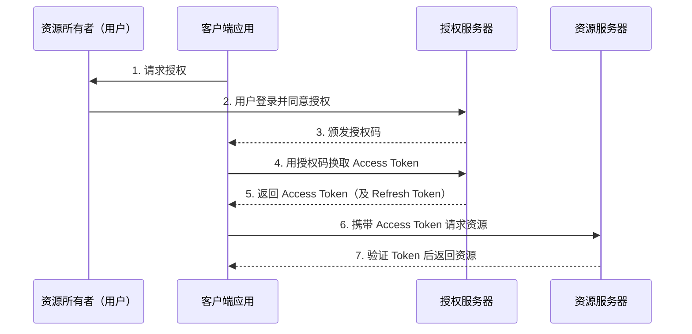
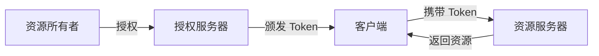
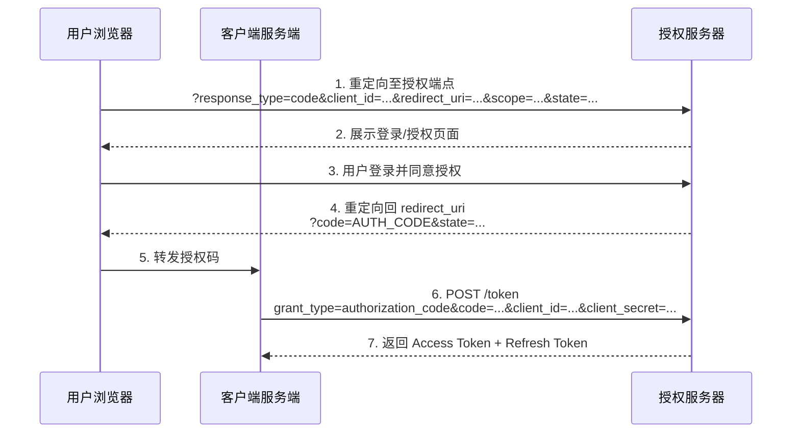
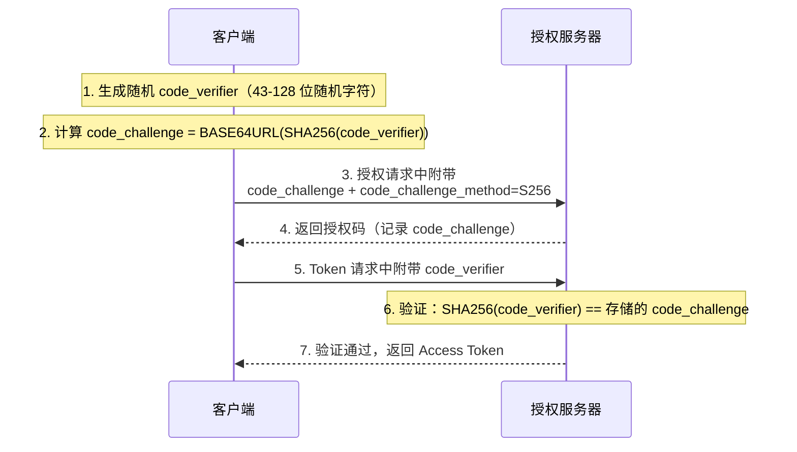
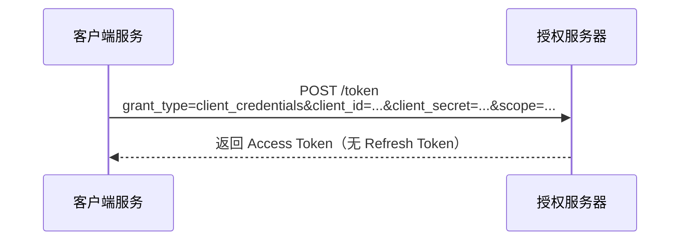
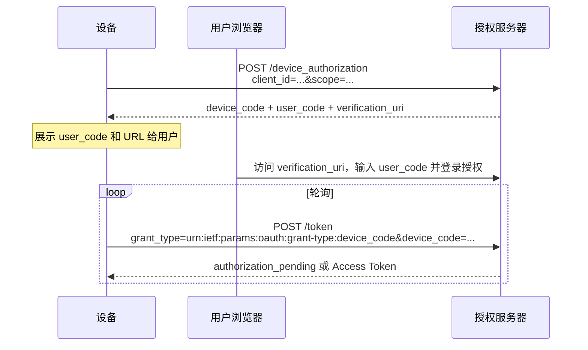
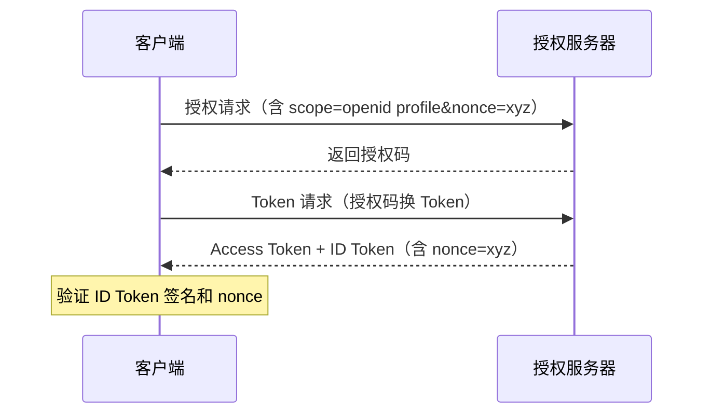
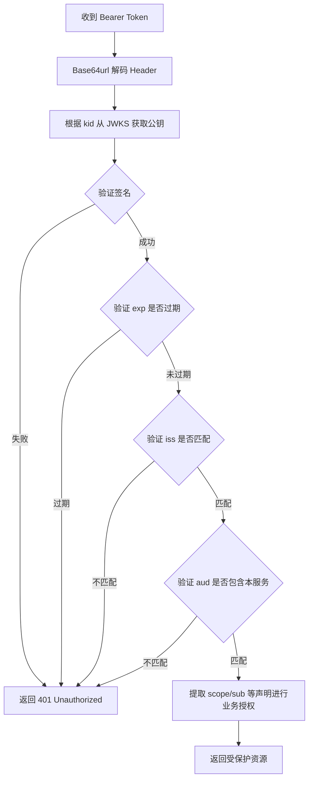
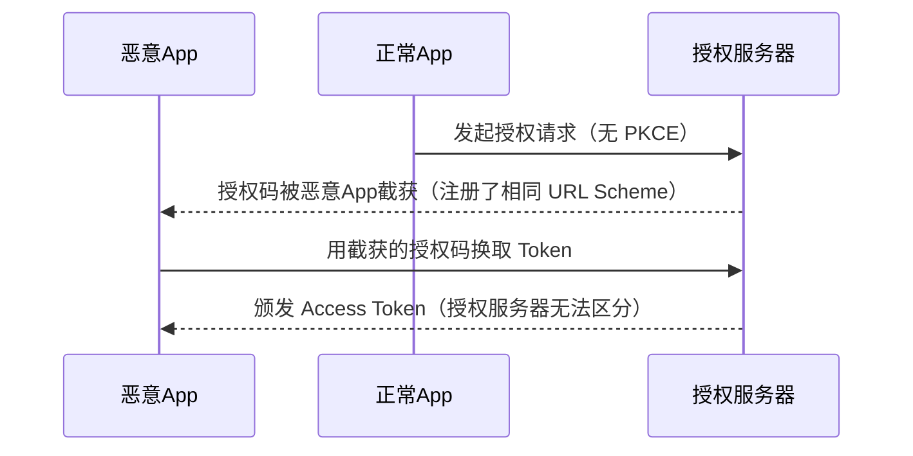
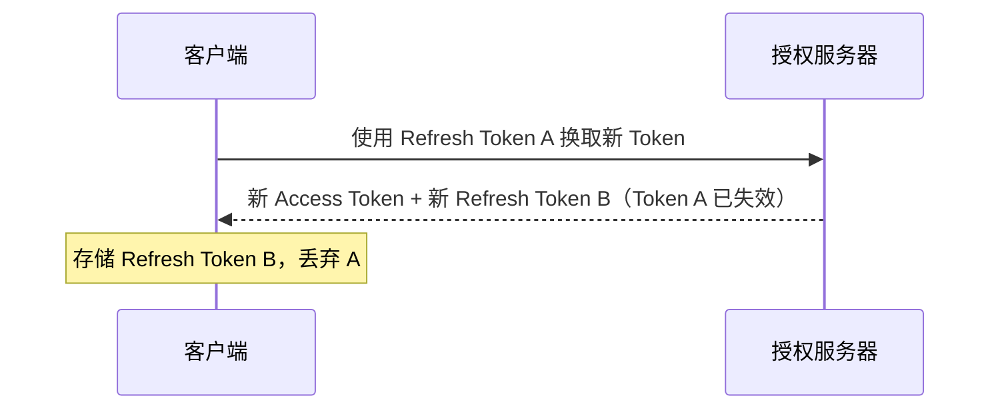

# OAuth2 & OpenID Connect 教程 Implementation Plan

> **For agentic workers:** REQUIRED SUB-SKILL: Use superpowers:subagent-driven-development (recommended) or superpowers:executing-plans to implement this plan task-by-task. Steps use checkbox (`- [ ]`) syntax for tracking.

**Goal:** 在 `docs/topic/oauth/` 下创建 8 篇按知识递进组织的 OAuth2 + OpenID Connect 中文教程，并注册到站点导航。

**Architecture:** 每篇文档独立文件夹（`folder/index.md`），从概念概述逐步深入到 Spring 实战，各文档职责单一、内容不重叠。所有文档使用 Zensical/Material 扩展 Markdown 语法，包含 Mermaid 时序图辅助说明。

**Tech Stack:** Zensical 静态文档站点；Markdown + Mermaid 图表；Spring Boot 3.x / Spring Authorization Server 1.5.x / Spring Security OAuth2

---

## 文件结构

**新建文件：**
- `docs/topic/oauth/index.md` — OAuth 专题概述（入口页）
- `docs/topic/oauth/core-concepts/index.md` — 核心概念
- `docs/topic/oauth/grant-types/index.md` — 授权类型
- `docs/topic/oauth/openid-connect/index.md` — OpenID Connect
- `docs/topic/oauth/jwt/index.md` — JWT 与令牌格式
- `docs/topic/oauth/security/index.md` — 安全实践
- `docs/topic/oauth/spring-auth-server/index.md` — 实战：授权服务器
- `docs/topic/oauth/spring-client-resource/index.md` — 实战：客户端与资源服务器

**修改文件：**
- `zensical.toml` — 在 `专题研究` 节点下追加 `OAuth2 & OIDC` 导航配置

---

## 写作规范（全局适用）

- 所有正文使用简体中文，技术术语保留英文原文（如 Access Token、Authorization Code）
- 文档开头无需 front matter，直接以 `# 标题` 开始（索引页 `index.md` 除外，需加 `icon:`）
- Mermaid 时序图使用中文 participant 名称
- 代码块语言标识符后若有 `title=` 等属性，必须在语言标识符和属性间加空格：`` ``` java title="..." ``
- 交叉引用其他文档时使用相对路径 `.md` 链接：`[核心概念](../core-concepts/index.md)`
- 禁止使用"第X章"形式引用，用文档标题代替

---

## Task 1: 注册导航条目（zensical.toml）

> 先注册导航，确保后续每创建一个文件都能立即在站点中访问到。

**Files:**
- Modify: `zensical.toml`（`专题研究` 节点 nav 部分）

- [ ] **Step 1: 在 zensical.toml 中添加 OAuth2 & OIDC 导航**

找到 `zensical.toml` 中的以下位置：
```toml
{ "专题研究" = [
    "topic/index.md",
    { "Zensical" = [
        ...
    ] }
] },
```

在 `Zensical` 条目之后，追加：
```toml
{ "OAuth2 & OIDC" = [
    "topic/oauth/index.md",
    { "核心概念" = "topic/oauth/core-concepts/index.md" },
    { "授权类型" = "topic/oauth/grant-types/index.md" },
    { "OpenID Connect" = "topic/oauth/openid-connect/index.md" },
    { "JWT 令牌" = "topic/oauth/jwt/index.md" },
    { "安全实践" = "topic/oauth/security/index.md" },
    { "实战：授权服务器" = "topic/oauth/spring-auth-server/index.md" },
    { "实战：客户端与资源服务器" = "topic/oauth/spring-client-resource/index.md" }
] }
```

- [ ] **Step 2: 验证 toml 语法**

```powershell
# 检查 toml 文件无明显语法错误（Python 解析）
python -c "import tomllib; tomllib.load(open('zensical.toml','rb'))"
```

预期：无报错输出

- [ ] **Step 3: Commit**

```bash
git add zensical.toml
git commit -m "docs(nav): 注册 OAuth2 & OIDC 专题导航到 zensical.toml"
```

---

## Task 2: 创建专题入口页 `docs/topic/oauth/index.md`

**Files:**
- Create: `docs/topic/oauth/index.md`

**内容要求：**
- front matter 中设置 `icon: lucide/shield-check`（二级目录 index 需要图标）
- 标题：`# OAuth2 & OpenID Connect 专题`
- 包含 4 个部分：
  1. **为什么需要 OAuth2**：传统密码共享的问题
  2. **OAuth2 与 OpenID Connect 的关系**：授权（Authorization）vs 认证（Authentication）的清晰区分
  3. **协议全景图**：一张 Mermaid 图展示整体架构（四角色及其交互）
  4. **学习路径**：用 `<div class="grid cards">` 卡片展示本专题 7 篇子文档

- [ ] **Step 1: 创建目录并写入 index.md**

```powershell
New-Item -ItemType Directory -Force -Path "docs\topic\oauth"
```

写入以下内容到 `docs/topic/oauth/index.md`：

```markdown
---
icon: lucide/shield-check
---

# OAuth2 & OpenID Connect 专题

OAuth2 和 OpenID Connect 是现代互联网应用中最重要的授权与认证标准。无论是第三方登录（"使用 GitHub 登录"）、API 访问控制，还是微服务间的安全调用，背后都离不开这两套协议。

## 为什么需要 OAuth2

在 OAuth2 出现之前，第三方应用若要访问用户在其他服务上的资源，通常要求用户直接提交用户名和密码。这带来了严重问题：

- **密码泄露风险**：第三方应用一旦遭到攻击，用户主账号即暴露
- **无法细粒度控制权限**：第三方拿到密码后拥有账号的所有权限
- **无法撤销授权**：用户只能通过修改密码来撤销第三方的访问

OAuth2（RFC 6749）的核心思想是**令牌（Token）替代密码**：用户通过授权服务器授权，第三方应用只获得有限期的访问令牌，不接触用户密码，且用户可随时撤销。

## OAuth2 与 OpenID Connect 的关系

!!! info "授权 vs 认证"

    - **OAuth2** 是**授权（Authorization）**协议：回答"这个应用能访问哪些资源？"
    - **OpenID Connect（OIDC）** 是构建在 OAuth2 之上的**认证（Authentication）**层：回答"当前用户是谁？"

    OIDC 并不是替代 OAuth2，而是在 OAuth2 的授权流程之上，额外颁发一个包含用户身份信息的 **ID Token**。

## 协议全景图



## 学习路径

按以下顺序学习，可以建立从基础到实战的完整知识体系：

<div class="grid cards" markdown>

- :lucide-layers: **核心概念**

    理解四种角色、令牌类型、Scope 和核心端点

    [→ 核心概念](core-concepts/index.md)

- :lucide-git-branch: **授权类型**

    五大授权流程详解及适用场景对比

    [→ 授权类型](grant-types/index.md)

- :lucide-user-check: **OpenID Connect**

    在 OAuth2 之上实现用户身份认证

    [→ OpenID Connect](openid-connect/index.md)

- :lucide-key: **JWT 令牌**

    JWT 结构、签名算法与令牌验证流程

    [→ JWT 令牌](jwt/index.md)

- :lucide-shield: **安全实践**

    PKCE、Refresh Token Rotation 与常见攻击防护

    [→ 安全实践](security/index.md)

- :lucide-server: **实战：授权服务器**

    Spring Authorization Server 1.5.x 配置实战

    [→ 实战：授权服务器](spring-auth-server/index.md)

- :lucide-plug: **实战：客户端与资源服务器**

    Spring Security OAuth2 客户端与资源服务器配置

    [→ 实战：客户端与资源服务器](spring-client-resource/index.md)

</div>
```

- [ ] **Step 2: Commit**

```bash
git add docs/topic/oauth/index.md
git commit -m "docs(oauth): 添加 OAuth2 & OIDC 专题入口页"
```

---

## Task 3: 核心概念 `docs/topic/oauth/core-concepts/index.md`

**Files:**
- Create: `docs/topic/oauth/core-concepts/index.md`

**内容要求：**
- 标题：`# OAuth2 核心概念`
- 5 个小节：四种角色、令牌与授权码、Scope、核心端点、客户端注册

- [ ] **Step 1: 创建目录并写入文件**

```powershell
New-Item -ItemType Directory -Force -Path "docs\topic\oauth\core-concepts"
```

写入以下内容到 `docs/topic/oauth/core-concepts/index.md`：

```markdown
# OAuth2 核心概念

在学习具体的授权流程之前，先理解 OAuth2 体系中的基础概念：谁参与了授权过程、交换的是什么、权限边界如何划定。

## 四种角色

OAuth2 规范（RFC 6749）定义了四种参与者：

`Resource Owner`（资源所有者）
:   拥有受保护资源的实体，通常是**最终用户**。例如，GitHub 上存储代码的账号持有人。

`Client`（客户端）
:   代表资源所有者访问受保护资源的应用程序。可以是 Web 应用、移动应用、桌面应用或后端服务。
    注意：Client 并不是指浏览器，而是**请求访问资源的应用本身**。

`Authorization Server`（授权服务器）
:   负责验证资源所有者身份并颁发访问令牌的服务器。它是整个 OAuth2 流程的核心。

`Resource Server`（资源服务器）
:   托管受保护资源的服务器，接受访问令牌并返回资源。一个授权服务器可以对应多个资源服务器。



## 令牌与授权码

### Access Token（访问令牌）

Access Token 是客户端访问受保护资源的**凭证**，相当于临时通行证。它的特点：

- **有限期**：通常较短（几分钟到几小时），过期后需要刷新
- **有限权限**：仅包含授权时指定的 Scope 权限
- **不透明或结构化**：可以是 JWT（包含信息的自描述令牌），也可以是 Opaque Token（纯随机字符串）

### Refresh Token（刷新令牌）

Refresh Token 用于在 Access Token 过期后**无需用户重新授权**即可获取新的 Access Token。特点：

- **有效期更长**（几天到几个月）
- **只发送给授权服务器**，不发送给资源服务器
- 某些授权类型（如客户端凭证）不颁发 Refresh Token

### Authorization Code（授权码）

授权码是授权码流程中的**临时短效凭证**，用于换取 Access Token。特点：

!!! warning "授权码不是令牌"

    授权码本身不能用于访问资源，只能用一次，且有效期极短（通常 10 分钟内）。它的作用是通过前端（浏览器）安全地将授权意图传递给后端，再由后端通过安全信道换取真正的 Access Token。

## Scope（权限范围）

Scope 是客户端请求的**权限集合**，用空格分隔多个权限。例如：

```
scope=read:repos write:repos
scope=openid profile email
```

授权服务器可以颁发比请求范围更小的 Scope（部分授权），但不会超出请求范围。

## 核心端点

| 端点 | 作用 |
|------|------|
| **Authorization Endpoint** | 用户授权页面，客户端将用户重定向到此处 |
| **Token Endpoint** | 客户端用授权码/凭证换取 Token 的接口 |
| **Introspection Endpoint** | 资源服务器验证 Token 有效性的接口（RFC 7662） |
| **Revocation Endpoint** | 主动撤销 Token 的接口（RFC 7009） |

## 客户端注册

客户端在使用授权服务器之前，必须先**注册**。注册后获得：

`Client ID`
:   客户端的唯一标识符，公开可见，用于授权请求中标识应用。

`Client Secret`
:   客户端密钥，**只有机密客户端（服务端应用）才有**，类似密码，不能暴露在前端代码中。

`Redirect URI`
:   授权完成后授权服务器回调的地址，必须精确匹配注册值，防止授权码被重定向到恶意地址。

!!! tip "公开客户端 vs 机密客户端"

    - **机密客户端（Confidential Client）**：有能力安全存储 Client Secret（如服务端应用）
    - **公开客户端（Public Client）**：无法安全存储密钥（如单页应用 SPA、移动端 App），必须使用 PKCE 替代 Client Secret

---

**下一篇：** [授权类型](../grant-types/index.md) — 了解 OAuth2 的五大授权流程及其适用场景
```

- [ ] **Step 2: Commit**

```bash
git add docs/topic/oauth/core-concepts/index.md
git commit -m "docs(oauth): 添加核心概念文档（四角色、令牌、Scope、端点）"
```

---

## Task 4: 授权类型 `docs/topic/oauth/grant-types/index.md`

**Files:**
- Create: `docs/topic/oauth/grant-types/index.md`

**内容要求：**
- 标题：`# OAuth2 授权类型`
- 覆盖：授权码流程（含完整时序图）、隐式流程（不推荐）、客户端凭证、ROPC（不推荐）、PKCE 机制、设备授权流程、适用场景对比表

- [ ] **Step 1: 创建目录并写入文件**

```powershell
New-Item -ItemType Directory -Force -Path "docs\topic\oauth\grant-types"
```

写入以下内容到 `docs/topic/oauth/grant-types/index.md`：

```markdown
# OAuth2 授权类型

OAuth2 规范定义了多种**授权类型（Grant Type）**，对应不同的应用场景。本文详细介绍各授权类型的流程机制，安全威胁分析见[安全实践](../security/index.md)。

## 授权码流程（Authorization Code）

授权码流程是 **OAuth2 最推荐**的标准流程，适用于有服务端的 Web 应用。核心优势：Access Token 仅在服务端与授权服务器之间交换，不经过浏览器，安全性最高。



**关键参数说明：**

| 参数 | 位置 | 说明 |
|------|------|------|
| `response_type=code` | 授权请求 | 告知授权服务器返回授权码 |
| `client_id` | 授权请求 | 注册的客户端标识 |
| `redirect_uri` | 授权请求 | 回调地址，必须与注册值一致 |
| `scope` | 授权请求 | 请求的权限范围 |
| `state` | 授权请求 | 随机字符串，防 CSRF，授权服务器原样返回 |
| `code` | 授权响应 | 一次性短效授权码 |
| `grant_type=authorization_code` | Token 请求 | 告知 Token 端点使用授权码流程 |

## PKCE（Proof Key for Code Exchange）

PKCE（RFC 7636）是授权码流程的**安全增强扩展**，对于**公开客户端（SPA、移动应用）为必选**，机密客户端也推荐使用。

**流程机制：**



PKCE 用 `code_verifier`/`code_challenge` 绑定替代 `client_secret`，即使授权码被截获，攻击者也无法在 Token 端点使用（因为不知道 `code_verifier`）。

## 客户端凭证流程（Client Credentials）

适用于**没有用户参与的机器对机器（M2M）调用**，如微服务间互相调用 API。



!!! note "无 Refresh Token"
    客户端凭证流程通常不颁发 Refresh Token，Access Token 过期后直接重新请求即可。

## 隐式流程（Implicit）— 已不推荐

隐式流程曾经是 SPA 应用的标准方案，但 **OAuth 2.0 Security Best Current Practice（BCP）已将其标为不推荐**。

**问题所在：** Access Token 直接通过 URL fragment 返回给浏览器，暴露在浏览器历史记录和 Referrer 头中，存在泄露风险。

!!! danger "请使用授权码流程 + PKCE 替代"
    现代 SPA 应用应使用**授权码流程 + PKCE**，而非隐式流程。

## 资源所有者密码凭证（ROPC）— 已不推荐

ROPC 允许客户端直接收集用户名和密码后发送给授权服务器换取 Token。**OAuth 2.1 草案已将其移除。**

!!! danger "强烈不推荐"
    ROPC 破坏了 OAuth2 的核心设计原则：用户凭证不应暴露给客户端应用。仅在无法使用其他流程的遗留系统迁移场景中考虑。

## 设备授权流程（Device Flow）

适用于**无浏览器或输入受限的设备**（智能电视、命令行工具、IoT 设备）。



## 适用场景对比

| 授权类型 | 适用场景 | 推荐程度 | 需要用户参与 |
|---------|---------|---------|------------|
| 授权码 + PKCE | 所有有用户的应用（SPA、Web、移动端） | ✅ 强烈推荐 | ✔ |
| 客户端凭证 | 微服务、后台任务、M2M | ✅ 推荐 | ✘ |
| 设备授权 | 智能电视、CLI 工具、IoT | ✅ 推荐 | ✔（用辅助设备） |
| 隐式流程 | —（已废弃） | ❌ 不推荐 | ✔ |
| ROPC | 遗留系统迁移（仅此场景） | ⚠️ 避免 | ✔ |

---

**上一篇：** [核心概念](../core-concepts/index.md)
**下一篇：** [OpenID Connect](../openid-connect/index.md)
```

- [ ] **Step 2: Commit**

```bash
git add docs/topic/oauth/grant-types/index.md
git commit -m "docs(oauth): 添加授权类型文档（五大流程 + PKCE + 适用场景对比）"
```

---

## Task 5: OpenID Connect `docs/topic/oauth/openid-connect/index.md`

**Files:**
- Create: `docs/topic/oauth/openid-connect/index.md`

**内容要求：**
- 标题：`# OpenID Connect`
- 覆盖：OIDC 与 OAuth2 的关系、ID Token、标准 Claim、UserInfo 端点、OIDC 发现文档、OIDC 授权码流程差异、标准 scope

- [ ] **Step 1: 创建目录并写入文件**

```powershell
New-Item -ItemType Directory -Force -Path "docs\topic\oauth\openid-connect"
```

写入以下内容到 `docs/topic/oauth/openid-connect/index.md`：

```markdown
# OpenID Connect

OpenID Connect（OIDC）是构建在 OAuth2 之上的**身份认证层**。如果说 OAuth2 解决了"应用能做什么"，那么 OIDC 解决的是"用户是谁"。

## OIDC 与 OAuth2 的关系

!!! info "关键区别"

    | 协议 | 解决的问题 | 核心令牌 |
    |------|----------|---------|
    | OAuth2 | **授权**：该应用有权限访问哪些资源？ | Access Token |
    | OpenID Connect | **认证**：当前登录的用户是谁？ | ID Token |

    OIDC 并不替代 OAuth2，而是在 OAuth2 授权码流程的基础上，额外颁发一个 **ID Token** 来携带用户身份信息。使用 OIDC 时，OAuth2 的所有机制都保持不变。

**OIDC 的三种流程：**

- **Authorization Code Flow**（最常用，推荐）
- Implicit Flow（已废弃）
- Hybrid Flow（部分场景使用）

## ID Token

ID Token 是 OIDC 的核心，是一个 **JWT 格式**的令牌（JWT 结构详见 [JWT 令牌](../jwt/index.md)），包含已认证用户的身份信息。

### 标准 Claim（声明）

| Claim | 含义 | 是否必须 |
|-------|------|---------|
| `sub` | 用户唯一标识符（Subject），在授权服务器范围内唯一 | ✅ 必须 |
| `iss` | ID Token 颁发者的 URL（Issuer） | ✅ 必须 |
| `aud` | 接收方，即客户端的 Client ID | ✅ 必须 |
| `exp` | 过期时间（Unix 时间戳） | ✅ 必须 |
| `iat` | 颁发时间（Unix 时间戳） | ✅ 必须 |
| `nonce` | 客户端请求时传入的随机值，防重放攻击 | 若请求中有则必须 |
| `name` | 用户全名 | 可选（profile scope） |
| `email` | 用户邮箱 | 可选（email scope） |
| `picture` | 用户头像 URL | 可选（profile scope） |

**ID Token 示例（解码后的 Payload）：**

``` json
{
  "sub": "248289761001",
  "iss": "https://auth.example.com",
  "aud": "my-client-id",
  "exp": 1753123200,
  "iat": 1753119600,
  "nonce": "abc123",
  "name": "张三",
  "email": "zhangsan@example.com",
  "picture": "https://example.com/avatar.jpg"
}
```

### ID Token 验证步骤

客户端收到 ID Token 后**必须**验证：

1. 验证签名（使用授权服务器的公钥，通过 JWKS URI 获取）
2. 验证 `iss` 与预期授权服务器一致
3. 验证 `aud` 包含当前客户端的 Client ID
4. 验证 `exp` 未过期
5. 若请求时带了 `nonce`，验证 `nonce` 与请求值一致

## UserInfo 端点

UserInfo 端点是授权服务器提供的 API，客户端携带 Access Token 即可获取用户详细信息。

```
GET /userinfo
Authorization: Bearer <access_token>
```

响应示例：
``` json
{
  "sub": "248289761001",
  "name": "张三",
  "email": "zhangsan@example.com",
  "email_verified": true
}
```

!!! tip "ID Token vs UserInfo"

    - ID Token 在登录时一次性颁发，适合存储不经常变化的基础身份信息
    - UserInfo 端点可以随时查询最新用户信息，适合需要实时数据的场景

## OIDC 发现文档

支持 OIDC 的授权服务器必须在标准路径发布**发现文档（Discovery Document）**：

```
GET /.well-known/openid-configuration
```

发现文档包含授权服务器的所有端点地址和能力声明，客户端无需硬编码这些地址：

``` json
{
  "issuer": "https://auth.example.com",
  "authorization_endpoint": "https://auth.example.com/oauth2/authorize",
  "token_endpoint": "https://auth.example.com/oauth2/token",
  "userinfo_endpoint": "https://auth.example.com/userinfo",
  "jwks_uri": "https://auth.example.com/oauth2/jwks",
  "scopes_supported": ["openid", "profile", "email"],
  "response_types_supported": ["code"],
  "subject_types_supported": ["public"]
}
```

## OIDC 授权码流程（与 OAuth2 的差异）

OIDC 授权码流程在 OAuth2 授权码流程基础上，有以下变化：

1. **请求中必须包含 `openid` scope**：这是触发 OIDC 模式的关键
2. **Token 端点额外返回 `id_token`**
3. **可选 `nonce` 参数**：防止 ID Token 重放攻击



## 标准 Scope 对应的 Claim

| Scope | 包含的 Claim |
|-------|------------|
| `openid` | `sub`（必须包含此 scope 才触发 OIDC） |
| `profile` | `name`、`given_name`、`family_name`、`picture`、`locale` 等 |
| `email` | `email`、`email_verified` |
| `address` | `address`（结构化地址对象） |
| `phone` | `phone_number`、`phone_number_verified` |

---

**上一篇：** [授权类型](../grant-types/index.md)
**下一篇：** [JWT 令牌](../jwt/index.md)
```

- [ ] **Step 2: Commit**

```bash
git add docs/topic/oauth/openid-connect/index.md
git commit -m "docs(oauth): 添加 OpenID Connect 文档（ID Token、UserInfo、发现文档）"
```

---

## Task 6: JWT 令牌 `docs/topic/oauth/jwt/index.md`

**Files:**
- Create: `docs/topic/oauth/jwt/index.md`

**内容要求：**
- 标题：`# JWT 令牌`
- 覆盖：JWT 结构（Header/Payload/Signature）、JWS vs JWE、签名算法对比、JWKS 端点、令牌验证流程、Opaque Token vs JWT 权衡

- [ ] **Step 1: 创建目录并写入文件**

```powershell
New-Item -ItemType Directory -Force -Path "docs\topic\oauth\jwt"
```

写入以下内容到 `docs/topic/oauth/jwt/index.md`：

```markdown
# JWT 令牌

JWT（JSON Web Token，RFC 7519）是 OAuth2 和 OIDC 中最常用的令牌格式。它是一种**自描述的、紧凑的、URL 安全的**令牌，能在各方之间传递声明（Claims）。

## JWT 结构

JWT 由三部分组成，用 `.` 分隔：

```
Header.Payload.Signature
```

例如：
```
eyJhbGciOiJSUzI1NiIsInR5cCI6IkpXVCJ9
.eyJzdWIiOiIxMjM0NTYiLCJzY29wZSI6InJlYWQiLCJleHAiOjE3NTMxMjMyMDB9
.SflKxwRJSMeKKF2QT4fwpMeJf36POk6yJV_adQssw5c
```

每部分均为 **Base64url 编码**（非加密，可解码查看）。

### Header（头部）

声明令牌类型和签名算法：

``` json
{
  "alg": "RS256",   // 签名算法
  "typ": "JWT",     // 令牌类型
  "kid": "key-id-1" // 用于 JWKS 中查找对应公钥的 Key ID
}
```

### Payload（载荷）

包含实际的声明数据（Claims）：

``` json
{
  "sub": "user-123",
  "iss": "https://auth.example.com",
  "aud": "my-api",
  "exp": 1753123200,
  "iat": 1753119600,
  "scope": "read write"
}
```

!!! warning "Payload 是 Base64url 编码，不是加密"
    JWT Payload 中的内容任何人都可以解码查看。**不要在 Payload 中存放敏感信息**（如密码、信用卡号）。若需要加密，应使用 JWE。

### Signature（签名）

签名是对 `Header.Payload` 的数字签名，用于**防止篡改**：

```
RSASSA-PKCS1-v1_5(
  BASE64URL(Header) + "." + BASE64URL(Payload),
  privateKey
)
```

验证者持有公钥，可以验证签名，但无法伪造。

## JWS vs JWE

| 格式 | 全称 | 作用 | 常见场景 |
|------|------|------|---------|
| **JWS** | JSON Web Signature | 签名（防篡改），内容可见 | Access Token、ID Token（绝大多数场景） |
| **JWE** | JSON Web Encryption | 加密（防窃取），内容不可见 | 包含敏感声明的令牌 |

普通的 `Header.Payload.Signature` 三段式 JWT 就是 JWS 格式。

## 签名算法对比

| 算法 | 类型 | 密钥 | 适用场景 |
|------|------|------|---------|
| **RS256** | 非对称（RSA） | 私钥签名，公钥验证 | 生产环境推荐，资源服务器只需公钥即可验证 |
| **ES256** | 非对称（ECDSA） | 私钥签名，公钥验证 | 比 RS256 更小的密钥和签名，性能更好 |
| **HS256** | 对称（HMAC） | 同一密钥签名和验证 | 仅适合单体应用，微服务场景中需共享密钥存在安全风险 |

!!! tip "生产环境推荐 RS256 或 ES256"
    非对称算法允许授权服务器私钥签名，任何持有公钥的资源服务器都可以验证，且不需要共享私钥，安全性更高。

## JWKS 端点（公钥集合）

授权服务器通过 **JWKS（JSON Web Key Set）端点**发布公钥，资源服务器可以动态获取用于验证 Token 的公钥。

```
GET /oauth2/jwks
```

响应示例：

``` json
{
  "keys": [
    {
      "kty": "RSA",
      "kid": "key-id-1",
      "use": "sig",
      "n": "oBH5...",
      "e": "AQAB"
    }
  ]
}
```

资源服务器根据 JWT Header 中的 `kid` 字段，在 JWKS 中找到对应公钥进行签名验证。

## 令牌验证完整流程

资源服务器收到携带 JWT 的请求后，验证步骤：



## Opaque Token vs JWT

| 维度 | Opaque Token | JWT |
|------|-------------|-----|
| **格式** | 随机字符串（无信息） | 结构化 JSON（含声明） |
| **验证方式** | 调用 Introspection 端点 | 本地验证签名 |
| **网络开销** | 每次请求都需远程验证 | 仅首次获取公钥，之后本地验证 |
| **令牌撤销** | 即时生效（授权服务器删除即可） | 有延迟（只能等 exp 过期） |
| **适用场景** | 需要即时撤销；资源服务器无法缓存 | 高并发；接受一定撤销延迟 |

!!! tip "选择建议"
    大多数场景下选 JWT。若有严格的即时撤销需求（如高安全场景），考虑 Opaque Token 配合 Introspection，或使用 JWT + 短有效期策略。

---

**上一篇：** [OpenID Connect](../openid-connect/index.md)
**下一篇：** [安全实践](../security/index.md)
```

- [ ] **Step 2: Commit**

```bash
git add docs/topic/oauth/jwt/index.md
git commit -m "docs(oauth): 添加 JWT 令牌文档（结构、JWS/JWE、JWKS、验证流程）"
```

---

## Task 7: 安全实践 `docs/topic/oauth/security/index.md`

**Files:**
- Create: `docs/topic/oauth/security/index.md`

**内容要求：**
- 标题：`# OAuth2 安全实践`
- 覆盖：PKCE 安全价值（攻击场景）、state 防 CSRF、nonce 防重放、令牌存储安全、Refresh Token Rotation、常见攻击模式

- [ ] **Step 1: 创建目录并写入文件**

```powershell
New-Item -ItemType Directory -Force -Path "docs\topic\oauth\security"
```

写入以下内容到 `docs/topic/oauth/security/index.md`：

```markdown
# OAuth2 安全实践

正确理解并实现 OAuth2 并不简单。本文梳理常见的安全威胁和对应的防护机制。各安全机制的流程实现见[授权类型](../grant-types/index.md)。

## PKCE：防止授权码截获攻击

### 攻击场景

在没有 PKCE 的情况下，移动应用使用自定义 URL Scheme（如 `myapp://callback`）接收授权码。恶意应用可以注册相同的 URL Scheme，在操作系统层面拦截回调，从而获得授权码。



### PKCE 如何防御

PKCE 在客户端生成 `code_verifier`（随机密钥），并在授权请求时发送其哈希值 `code_challenge`。Token 端点在换取 Token 时要求客户端提供原始 `code_verifier` 进行验证。

**恶意应用只截获了授权码，却不知道 `code_verifier`，无法通过 Token 端点的验证。**

!!! success "PKCE 的使用建议"
    - **所有公开客户端（SPA、移动端）**：PKCE 为必选
    - **机密客户端（Web 应用服务端）**：也应使用 PKCE（额外安全层）

PKCE 的流程机制详见[授权类型 · PKCE](../grant-types/index.md#pkce)。

## state 参数：防 CSRF 攻击

### 攻击场景

CSRF 攻击通过诱使已登录用户点击精心构造的链接，将攻击者的授权码绑定到受害者账号。

### 防护方式

客户端在授权请求中包含随机 `state` 参数，授权服务器原样返回。客户端回调时**必须验证 `state` 与发出请求时的值一致**。

``` java
// 生成随机 state 并存储到 session
String state = UUID.randomUUID().toString();
session.setAttribute("oauth2_state", state);

// 回调时验证
String returnedState = request.getParameter("state");
String expectedState = (String) session.getAttribute("oauth2_state");
if (!returnedState.equals(expectedState)) {
    throw new SecurityException("state 不匹配，可能是 CSRF 攻击");
}
```

## nonce：防 ID Token 重放攻击（OIDC）

### 攻击场景

攻击者截获一个合法用户的 ID Token，在其过期前将其发送给另一个系统假冒该用户身份。

### 防护方式

客户端在 OIDC 授权请求中携带随机 `nonce`，授权服务器将 `nonce` 嵌入 ID Token。客户端验证 ID Token 时检查 `nonce` 是否与请求时一致。

## 令牌存储安全

### 浏览器端（SPA）

| 存储位置 | XSS 风险 | CSRF 风险 | 推荐程度 |
|---------|---------|----------|---------|
| `localStorage` | ❌ 高（JS 可读取） | 低 | ❌ 不推荐存放 Access Token |
| `sessionStorage` | ❌ 高（JS 可读取） | 低 | ❌ 不推荐存放 Access Token |
| `HttpOnly Cookie` | ✅ 低（JS 不可读） | ⚠️ 需配合 CSRF 防护 | ✅ 推荐（配合 SameSite=Strict） |
| 内存（变量） | ✅ 低 | 低 | ✅ 推荐（刷新后需重新获取） |

!!! tip "BFF（Backend for Frontend）模式"
    SPA 安全性最佳实践是使用 BFF 模式：Token 完全保存在服务端，前端只持有 Session Cookie（HttpOnly + SameSite）。

### 服务端

- Refresh Token 应加密存储，避免数据库泄露导致长期访问权限被盗
- 不应在日志中打印 Token 内容

## Refresh Token Rotation

### 什么是 Refresh Token Rotation

每次使用 Refresh Token 换取新的 Access Token 时，同时颁发一个新的 Refresh Token，**旧的 Refresh Token 立即失效**。



### 安全价值

如果 Refresh Token 被盗，攻击者在使用被盗 Token 后，原始客户端下次刷新时会发现 Token 已失效（Rotation 检测），可以立即告警并撤销所有相关 Token。

## 常见攻击模式

### 授权码注入

攻击者将已使用过的授权码或其他客户端的授权码注入受害者的 Token 请求。

**防护：** 使用 PKCE（code_verifier 绑定了请求者身份）；确保 `state` 验证。

### 恶意 redirect_uri

攻击者构造包含恶意 `redirect_uri` 的授权链接，诱使用户点击后将授权码发送到攻击者服务器。此外，若 `redirect_uri` 被配置为内网地址（如 `http://192.168.1.1/admin`），授权服务器在请求该地址时可能被用于**探测内网服务（SSRF）**。

**防护：** 授权服务器必须严格校验 `redirect_uri` 与注册时的值**精确匹配**（不允许通配符或模糊匹配）；不应允许 `redirect_uri` 为内网 IP 段地址。

### Token 泄露后应对

1. **短有效期**：Access Token 应设置较短有效期（5-15 分钟）
2. **令牌撤销**：实现 Revocation 端点（RFC 7009），支持主动撤销
3. **令牌绑定**：将 Token 绑定到客户端 TLS 证书（DPoP，RFC 9449），即使 Token 泄露也无法在其他设备使用

---

**上一篇：** [JWT 令牌](../jwt/index.md)
**下一篇：** [实战：授权服务器](../spring-auth-server/index.md)
```

- [ ] **Step 2: Commit**

```bash
git add docs/topic/oauth/security/index.md
git commit -m "docs(oauth): 添加安全实践文档（PKCE 威胁、CSRF、Rotation、存储安全）"
```

---

## Task 8: 实战：授权服务器 `docs/topic/oauth/spring-auth-server/index.md`

**Files:**
- Create: `docs/topic/oauth/spring-auth-server/index.md`

**内容要求：**
- 标题：`# 实战：Spring Authorization Server`
- ⚠️ 版本说明：1.5.x 是最后独立版本，Spring Security 7.0 已合并
- 覆盖：Maven 依赖、最小配置、RegisteredClientRepository、JWKSource、AuthorizationServerSettings、OIDC 配置、令牌自定义 Claims、Spring Security 7.0 迁移说明

- [ ] **Step 1: 创建目录并写入文件**

```powershell
New-Item -ItemType Directory -Force -Path "docs\topic\oauth\spring-auth-server"
```

写入以下内容到 `docs/topic/oauth/spring-auth-server/index.md`：

```markdown
# 实战：Spring Authorization Server

!!! warning "版本迁移重要说明"

    **Spring Authorization Server 1.5.x 是最后一代独立版本。** 从 Spring Security 7.0 起，Spring Authorization Server 的功能已合并进 Spring Security 主项目，不再作为单独的依赖存在。

    - 1.5.x 对应 Spring Boot 3.5.x，artifactId 为 `spring-security-oauth2-authorization-server`
    - Spring Security 7.0 起，直接引入 `spring-boot-starter-oauth2-authorization-server`
    - 本文以 1.5.x 为主，文末提供 7.0 迁移要点

## 快速入门

### Maven 依赖

``` xml title="pom.xml"
<dependencies>
    <dependency>
        <groupId>org.springframework.boot</groupId>
        <artifactId>spring-boot-starter-web</artifactId>
    </dependency>
    <dependency>
        <groupId>org.springframework.boot</groupId>
        <artifactId>spring-boot-starter-security</artifactId>
    </dependency>
    <!-- Spring Authorization Server 1.5.x（最后独立版本） -->
    <dependency>
        <groupId>org.springframework.security</groupId>
        <artifactId>spring-security-oauth2-authorization-server</artifactId>
    </dependency>
</dependencies>
```

### 最小化配置

``` java title="AuthorizationServerConfig.java"
@Configuration
@Import(OAuth2AuthorizationServerConfiguration.class) // (1)!
public class AuthorizationServerConfig {

    // (2)!
    @Bean
    public RegisteredClientRepository registeredClientRepository() {
        RegisteredClient client = RegisteredClient.withId(UUID.randomUUID().toString())
            .clientId("my-client")
            .clientSecret("{noop}my-secret") // (3)!
            .clientAuthenticationMethod(ClientAuthenticationMethod.CLIENT_SECRET_BASIC)
            .authorizationGrantType(AuthorizationGrantType.AUTHORIZATION_CODE)
            .authorizationGrantType(AuthorizationGrantType.REFRESH_TOKEN)
            .authorizationGrantType(AuthorizationGrantType.CLIENT_CREDENTIALS)
            .redirectUri("http://localhost:8080/login/oauth2/code/my-client")
            .scope(OidcScopes.OPENID)
            .scope(OidcScopes.PROFILE)
            .scope("read")
            .clientSettings(ClientSettings.builder()
                .requireProofKey(true) // (4)!
                .build())
            .tokenSettings(TokenSettings.builder()
                .accessTokenTimeToLive(Duration.ofMinutes(30))
                .refreshTokenTimeToLive(Duration.ofDays(7))
                .reuseRefreshTokens(false) // (5)!
                .build())
            .build();
        return new InMemoryRegisteredClientRepository(client);
    }

    // (6)!
    @Bean
    public JWKSource<SecurityContext> jwkSource() {
        RSAKey rsaKey = generateRsa();
        JWKSet jwkSet = new JWKSet(rsaKey);
        return (jwkSelector, securityContext) -> jwkSelector.select(jwkSet);
    }

    private static RSAKey generateRsa() {
        KeyPair keyPair = generateRsaKey();
        RSAPublicKey publicKey = (RSAPublicKey) keyPair.getPublic();
        RSAPrivateKey privateKey = (RSAPrivateKey) keyPair.getPrivate();
        return new RSAKey.Builder(publicKey)
            .privateKey(privateKey)
            .keyID(UUID.randomUUID().toString())
            .build();
    }

    private static KeyPair generateRsaKey() {
        try {
            KeyPairGenerator generator = KeyPairGenerator.getInstance("RSA");
            generator.initialize(2048);
            return generator.generateKeyPair();
        } catch (NoSuchAlgorithmException ex) {
            throw new IllegalStateException(ex);
        }
    }

    @Bean
    public AuthorizationServerSettings authorizationServerSettings() {
        return AuthorizationServerSettings.builder()
            .issuer("http://localhost:9000") // (7)!
            .build();
    }
}
```

1. 导入 OAuth2 授权服务器的默认安全配置
2. 注册客户端仓库（生产环境应使用 `JdbcRegisteredClientRepository`）
3. `{noop}` 表示明文密码，生产环境必须使用 BCrypt 编码
4. 强制要求 PKCE，适用于公开客户端
5. 禁用 Refresh Token 复用，启用 Rotation 机制
6. JWK 密钥源，生产环境应从文件或 KMS 加载固定密钥
7. Issuer 必须与客户端配置的 issuer-uri 一致

### 配置 Spring Security 以开放授权服务器端点

``` java title="SecurityConfig.java"
@Configuration
@EnableWebSecurity
public class SecurityConfig {

    @Bean
    @Order(1) // (1)!
    public SecurityFilterChain authorizationServerSecurityFilterChain(HttpSecurity http)
            throws Exception {
        OAuth2AuthorizationServerConfigurer authorizationServerConfigurer =
            OAuth2AuthorizationServerConfigurer.authorizationServer();

        http
            .securityMatcher(authorizationServerConfigurer.getEndpointsMatcher())
            .with(authorizationServerConfigurer, authorizationServer ->
                authorizationServer
                    .oidc(withDefaults()) // (2)!
            )
            .exceptionHandling(exceptions ->
                exceptions.defaultAuthenticationEntryPointFor(
                    new LoginUrlAuthenticationEntryPoint("/login"),
                    new MediaTypeRequestMatcher(MediaType.TEXT_HTML)
                )
            );

        return http.build();
    }

    @Bean
    @Order(2)
    public SecurityFilterChain defaultSecurityFilterChain(HttpSecurity http)
            throws Exception {
        http
            .authorizeHttpRequests(authorize ->
                authorize.anyRequest().authenticated()
            )
            .formLogin(withDefaults()); // (3)!

        return http.build();
    }

    @Bean
    public UserDetailsService userDetailsService() {
        // 生产环境替换为数据库实现
        // ⚠️ withDefaultPasswordEncoder() 在 Spring Security 6.x 已标注 @Deprecated
        // 仅供快速演示，生产环境请使用 BCryptPasswordEncoder 或数据库存储
        UserDetails user = User.builder()
            .username("admin")
            .password("{bcrypt}" + new BCryptPasswordEncoder().encode("password"))
            .roles("USER")
            .build();
        return new InMemoryUserDetailsManager(user);
    }
}
```

1. 授权服务器 Security 链优先级必须高于默认链
2. 启用 OpenID Connect 1.0 支持
3. 默认使用表单登录，生产环境可自定义登录页

## 自定义授权页面

默认情况下 Spring Authorization Server 提供一个简单的授权确认页面。通过 `authorizationEndpoint()` 可以替换为自定义页面：

``` java title="AuthorizationServerConfig.java（授权页面自定义片段）"
http
    .with(authorizationServerConfigurer, authorizationServer ->
        authorizationServer
            .authorizationEndpoint(authorizationEndpoint ->
                authorizationEndpoint
                    .consentPage("/oauth2/consent") // (1)!
            )
            .oidc(withDefaults())
    );
```

1. 指定自定义授权确认页面的路径，需在对应 Controller 中处理该路由并返回 Thymeleaf/HTML 页面

``` java title="ConsentController.java"
@Controller
public class ConsentController {

    // 展示授权确认页面（列出请求的 scope 供用户勾选）
    @GetMapping("/oauth2/consent")
    public String consent(Principal principal, Model model,
            @RequestParam(OAuth2ParameterNames.CLIENT_ID) String clientId,
            @RequestParam(required = false, value = OAuth2ParameterNames.SCOPE) String scope, // (1)!
            @RequestParam(OAuth2ParameterNames.STATE) String state) {
        model.addAttribute("clientId", clientId);
        // scope 可能为 null（客户端未请求任何 scope 时），需做空值防护
        Set<String> scopes = scope != null
            ? new HashSet<>(Arrays.asList(scope.split(" ")))
            : Collections.emptySet();
        model.addAttribute("scopes", scopes);
        model.addAttribute("state", state);
        model.addAttribute("principalName", principal.getName());
        return "consent"; // 对应 templates/consent.html
    }
}
```

## 自定义令牌 Claims

使用 `OAuth2TokenCustomizer` 向 Access Token 或 ID Token 中添加自定义声明：

``` java title="TokenCustomizerConfig.java"
@Bean
public OAuth2TokenCustomizer<JwtEncodingContext> tokenCustomizer() {
    return context -> {
        if (context.getTokenType().equals(OAuth2TokenType.ACCESS_TOKEN)) {
            // 向 Access Token 添加用户角色
            Authentication principal = context.getPrincipal();
            Set<String> authorities = principal.getAuthorities().stream()
                .map(GrantedAuthority::getAuthority)
                .collect(Collectors.toSet());
            context.getClaims().claim("roles", authorities);
        }

        if (OidcParameterNames.ID_TOKEN.equals(context.getTokenType().getValue())) {
            // 向 ID Token 添加额外用户信息
            context.getClaims().claim("custom_claim", "custom_value");
        }
    };
}
```

## 配置 application.yml

``` yaml title="application.yml"
server:
  port: 9000

spring:
  security:
    user:
      # 开发调试用，生产环境移除
      name: admin
      password: password
```

## Spring Security 7.0 迁移要点

从 Spring Authorization Server 1.5.x 迁移到 Spring Security 7.0 的主要变化：

| 变化项 | 1.5.x | 7.0+ |
|--------|-------|------|
| 依赖 artifactId | `spring-security-oauth2-authorization-server` | `spring-boot-starter-oauth2-authorization-server` |
| `OAuth2AuthorizationServerConfigurer` | 独立类 | 集成进 Spring Security DSL |
| `@Import(OAuth2AuthorizationServerConfiguration.class)` | 常用 | 通过 Security Filter Chain 配置 |

!!! tip "关注官方迁移指南"
    Spring Security 7.0 发布后，请参考官方迁移文档：[Spring Authorization Server 迁移至 Spring Security 7.0](../../../document-translation/spring-authorization-server-153/moving-to-spring-security-70/index.md)

---

**上一篇：** [安全实践](../security/index.md)
**下一篇：** [实战：客户端与资源服务器](../spring-client-resource/index.md)
```

- [ ] **Step 2: Commit**

```bash
git add docs/topic/oauth/spring-auth-server/index.md
git commit -m "docs(oauth): 添加 Spring Authorization Server 实战文档（含 7.0 迁移说明）"
```

---

## Task 9: 实战：客户端与资源服务器 `docs/topic/oauth/spring-client-resource/index.md`

**Files:**
- Create: `docs/topic/oauth/spring-client-resource/index.md`

**内容要求：**
- 标题：`# 实战：OAuth2 客户端与资源服务器`
- 覆盖：oauth2-client 依赖、oauth2Login() 配置（OIDC 登录）、oauth2Client()、资源服务器（JWT + Opaque Token）、测试

- [ ] **Step 1: 创建目录并写入文件**

```powershell
New-Item -ItemType Directory -Force -Path "docs\topic\oauth\spring-client-resource"
```

写入以下内容到 `docs/topic/oauth/spring-client-resource/index.md`：

```markdown
# 实战：OAuth2 客户端与资源服务器

本文介绍如何使用 Spring Security 配置 OAuth2 **客户端应用**（让用户通过 OAuth2 登录）和 **资源服务器**（保护 API 端点并验证 Token）。

授权服务器的配置见[实战：授权服务器](../spring-auth-server/index.md)。

## OAuth2 客户端

### Maven 依赖

``` xml title="pom.xml"
<dependency>
    <groupId>org.springframework.boot</groupId>
    <artifactId>spring-boot-starter-oauth2-client</artifactId>
</dependency>
<dependency>
    <groupId>org.springframework.boot</groupId>
    <artifactId>spring-boot-starter-web</artifactId>
</dependency>
```

### 配置 application.yml

``` yaml title="application.yml"
spring:
  security:
    oauth2:
      client:
        registration:
          my-auth-server: # (1)!
            client-id: my-client
            client-secret: my-secret
            authorization-grant-type: authorization_code
            redirect-uri: "{baseUrl}/login/oauth2/code/{registrationId}"
            scope: openid, profile, read
        provider:
          my-auth-server:
            issuer-uri: http://localhost:9000 # (2)!
```

1. 注册标识符，用于区分多个 OAuth2 提供方
2. 框架会自动从 `issuer-uri/.well-known/openid-configuration` 获取所有端点配置

### oauth2Login()：用户 OIDC 登录

让用户通过授权服务器登录，获取 OIDC 身份（ID Token）：

``` java title="ClientSecurityConfig.java"
@Configuration
@EnableWebSecurity
public class ClientSecurityConfig {

    @Bean
    public SecurityFilterChain securityFilterChain(HttpSecurity http) throws Exception {
        http
            .authorizeHttpRequests(authorize ->
                authorize
                    .requestMatchers("/public/**").permitAll()
                    .anyRequest().authenticated()
            )
            .oauth2Login(oauth2 ->
                oauth2.defaultSuccessUrl("/dashboard", true) // (1)!
            )
            .logout(logout ->
                logout.logoutSuccessUrl("/")
            );

        return http.build();
    }
}
```

1. 登录成功后重定向到 `/dashboard`

**在 Controller 中获取已认证用户信息：**

``` java title="DashboardController.java"
@GetMapping("/dashboard")
public String dashboard(@AuthenticationPrincipal OidcUser oidcUser, Model model) {
    // 从 ID Token 中获取用户信息
    model.addAttribute("name", oidcUser.getFullName());
    model.addAttribute("email", oidcUser.getEmail());
    model.addAttribute("subject", oidcUser.getSubject()); // sub claim
    return "dashboard";
}
```

### oauth2Client()：客户端代调 API（Client Credentials）

当客户端需要以**自身身份**（而非用户身份）调用后端 API 时，使用客户端凭证流程：

``` yaml title="application.yml"
spring:
  security:
    oauth2:
      client:
        registration:
          backend-service:
            client-id: backend-client
            client-secret: backend-secret
            authorization-grant-type: client_credentials
            scope: api.read
        provider:
          backend-service:
            token-uri: http://localhost:9000/oauth2/token
```

``` java title="ApiClientConfig.java"
@Configuration
public class ApiClientConfig {

    @Bean
    public WebClient apiClient(OAuth2AuthorizedClientManager authorizedClientManager) {
        // 自动获取并附加 Access Token 的 WebClient
        ServletOAuth2AuthorizedClientExchangeFilterFunction oauth2Client =
            new ServletOAuth2AuthorizedClientExchangeFilterFunction(authorizedClientManager);
        oauth2Client.setDefaultClientRegistrationId("backend-service");

        return WebClient.builder()
            .filter(oauth2Client)
            .build();
    }

    @Bean
    public OAuth2AuthorizedClientManager authorizedClientManager(
            ClientRegistrationRepository clientRegistrationRepository,
            OAuth2AuthorizedClientRepository authorizedClientRepository) {

        OAuth2AuthorizedClientProvider authorizedClientProvider =
            OAuth2AuthorizedClientProviderBuilder.builder()
                .clientCredentials()
                .refreshToken()
                .build();

        DefaultOAuth2AuthorizedClientManager manager =
            new DefaultOAuth2AuthorizedClientManager(
                clientRegistrationRepository, authorizedClientRepository);
        manager.setAuthorizedClientProvider(authorizedClientProvider);

        return manager;
    }
}
```

---

## OAuth2 资源服务器

### Maven 依赖

``` xml title="pom.xml"
<dependency>
    <groupId>org.springframework.boot</groupId>
    <artifactId>spring-boot-starter-oauth2-resource-server</artifactId>
</dependency>
```

### JWT 验证配置

``` yaml title="application.yml"
spring:
  security:
    oauth2:
      resourceserver:
        jwt:
          issuer-uri: http://localhost:9000 # (1)!
```

1. 框架自动从 issuer-uri 的发现文档获取 JWKS URI，缓存公钥并验证 JWT 签名

``` java title="ResourceServerConfig.java"
@Configuration
@EnableWebSecurity
public class ResourceServerConfig {

    @Bean
    public SecurityFilterChain securityFilterChain(HttpSecurity http) throws Exception {
        http
            .authorizeHttpRequests(authorize ->
                authorize
                    .requestMatchers(HttpMethod.GET, "/api/public/**").permitAll()
                    .requestMatchers("/api/admin/**").hasAuthority("SCOPE_admin") // (1)!
                    .anyRequest().authenticated()
            )
            .oauth2ResourceServer(oauth2 ->
                oauth2.jwt(withDefaults())
            );

        return http.build();
    }
}
```

1. Spring Security 自动将 JWT 中的 `scope` claim 映射为 `SCOPE_xxx` 权限

**在 Controller 中提取 Token 信息：**

``` java title="ApiController.java"
@RestController
@RequestMapping("/api")
public class ApiController {

    @GetMapping("/me")
    public Map<String, Object> me(@AuthenticationPrincipal Jwt jwt) {
        return Map.of(
            "sub", jwt.getSubject(),
            "scopes", jwt.getClaim("scope"),
            "roles", jwt.getClaim("roles") // 自定义 claim
        );
    }
}
```

### Opaque Token 验证（Introspection）

若授权服务器颁发的是 Opaque Token，需要配置 Introspection 端点：

``` yaml title="application.yml"
spring:
  security:
    oauth2:
      resourceserver:
        opaquetoken:
          introspection-uri: http://localhost:9000/oauth2/introspect
          client-id: resource-server
          client-secret: resource-server-secret
```

``` java title="OpaqueResourceServerConfig.java"
@Configuration
@EnableWebSecurity
public class OpaqueResourceServerConfig {

    @Bean
    public SecurityFilterChain securityFilterChain(HttpSecurity http) throws Exception {
        http
            .authorizeHttpRequests(authorize ->
                authorize.anyRequest().authenticated()
            )
            .oauth2ResourceServer(oauth2 ->
                oauth2.opaqueToken(withDefaults()) // 替换 jwt() 为 opaqueToken()
            );
        return http.build();
    }
}
```

### 测试资源服务器

在测试中使用 `@WithMockUser` 或 `SecurityMockMvcRequestPostProcessors.jwt()` 模拟 JWT：

``` java title="ApiControllerTest.java"
@SpringBootTest
@AutoConfigureMockMvc
class ApiControllerTest {

    @Autowired
    private MockMvc mockMvc;

    @Test
    void whenValidJwt_thenReturnsUserInfo() throws Exception {
        mockMvc.perform(get("/api/me")
                .with(jwt() // (1)!
                    .jwt(jwt -> jwt
                        .subject("test-user")
                        .claim("scope", "read write")
                        .claim("roles", List.of("ROLE_USER"))
                    )
                ))
            .andExpect(status().isOk())
            .andExpect(jsonPath("$.sub").value("test-user"));
    }

    @Test
    void whenNoToken_thenReturns401() throws Exception {
        mockMvc.perform(get("/api/me"))
            .andExpect(status().isUnauthorized());
    }
}
```

1. `jwt()` 来自 `org.springframework.security.test.web.servlet.request.SecurityMockMvcRequestPostProcessors`

---

**上一篇：** [实战：授权服务器](../spring-auth-server/index.md)
```

- [ ] **Step 2: Commit**

```bash
git add docs/topic/oauth/spring-client-resource/index.md
git commit -m "docs(oauth): 添加 Spring Security OAuth2 客户端与资源服务器实战文档"
```

---

## Task 10: 最终验证

- [ ] **Step 1: 验证所有文件已创建**

```powershell
Get-ChildItem -Path "docs\topic\oauth" -Recurse -Filter "*.md" | Select-Object FullName
```

预期输出 9 个 md 文件（1 个 index.md + 8 个子目录 index.md）。

- [ ] **Step 2: 验证 zensical.toml 语法**

```powershell
python -c "import tomllib; tomllib.load(open('zensical.toml','rb')); print('OK')"
```

预期输出：`OK`

- [ ] **Step 3: 本地预览站点**

```powershell
zensical serve
```

打开浏览器访问 `http://localhost:7000`，验证：
- 专题研究 → OAuth2 & OIDC 导航条目出现
- 8 篇子文档均可正常访问
- Mermaid 图表正常渲染
- 代码块语法高亮正常

- [ ] **Step 4: 最终 Commit**

```bash
git add .
git status  # 确认无多余文件
git commit -m "docs(oauth): 完成 OAuth2 & OIDC 全套教程（8 篇）"
```
