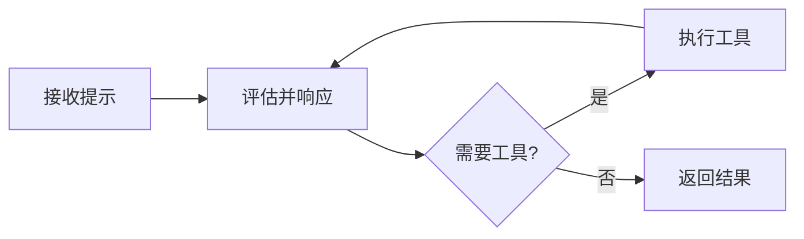

当你用 Agent SDK 启动一个 Agent 时，底层到底发生了什么？一个简单的"列出当前目录的文件"可能只需要一两轮工具调用，而"重构认证模块并更新所有测试"则可能涉及几十轮读取、编辑、运行命令。理解循环的工作原理，是你构建、调试和优化 Agent 的基础。

**本文你会学到**：

- Agent 循环的五个阶段和消息生命周期
- 如何通过 `Turns`、`Budget`、`Effort` 等参数控制循环行为
- 上下文窗口的消耗方式与自动压缩机制
- 如何正确处理循环的最终结果

## 循环一览

每个 Agent 会话都遵循相同的循环：接收提示 -> 评估并响应 -> 执行工具 -> 重复 -> 返回结果。



具体来说，循环分为以下五个阶段：

1. **接收提示**。Claude 收到你的提示，连同系统提示、工具定义和对话历史。SDK 产出一个 `SystemMessage`（subtype 为 `"init"`），包含会话元数据。
2. **评估并响应**。Claude 评估当前状态，决定下一步行动——可能返回文本、请求工具调用，或两者兼有。SDK 产出一个 `AssistantMessage`。
3. **执行工具**。SDK 运行每个被请求的工具并收集结果，这些结果反馈给 Claude 进行下一步决策。你可以通过 [Hooks](../hooks/) 拦截、修改或阻止工具调用。
4. **重复**。阶段 2 和 3 循环执行，每次完整循环称为一个 turn。直到 Claude 产出不再包含工具调用的响应。
5. **返回结果**。SDK 产出一个最终的 `AssistantMessage`（纯文本，无工具调用），随后是一个 `ResultMessage`，包含最终文本、token 用量、成本和会话 ID。

一个简单问题（"这里有哪些文件？"）可能只需一两个 turn（调用 `Glob` 然后返回结果）。一个复杂任务（"重构认证模块并更新测试"）可能跨越几十个 turn——读取文件、编辑代码、运行测试，Claude 根据每个结果调整策略。

## Turns 与消息类型

### 什么是 Turn

一个 turn 就是循环中的一轮往返：Claude 产出包含工具调用的输出，SDK 执行这些工具，结果自动反馈给 Claude——这一切不需要将控制权交还给你的代码。Turn 持续进行，直到 Claude 产出不含工具调用的输出，此时循环结束。

来看一个具体场景——提示为"修复 auth.ts 中失败的测试"：

- **Turn 1**：Claude 调用 `Bash` 运行 `npm test`。SDK 产出 `AssistantMessage`（包含工具调用），执行命令，然后产出 `UserMessage`（包含输出：三个失败）。
- **Turn 2**：Claude 调用 `Read` 读取 `auth.ts` 和 `auth.test.ts`。SDK 返回文件内容并产出 `AssistantMessage`。
- **Turn 3**：Claude 调用 `Edit` 修复 `auth.ts`，然后调用 `Bash` 重新运行测试。三个测试全部通过。SDK 产出 `AssistantMessage`。
- **最终 turn**：Claude 产出纯文本响应："修复了 auth bug，三个测试全部通过。"SDK 产出最终 `AssistantMessage`，然后是 `ResultMessage`。

总共四个 turn：三个含工具调用，一个纯文本最终响应。

你可以用 `max_turns` / `maxTurns` 限制循环次数（只计算工具调用 turn），也可以用 `max_budget_usd` / `maxBudgetUsd` 按消费阈值限制。

### 消息类型

循环运行时，SDK 产出一系列消息流。每条消息都有一个 `type` 字段标识它来自循环的哪个阶段：

| 消息类型 | 什么时候产生 | 包含什么 |
|---------|------------|---------|
| `SystemMessage` | 会话生命周期事件 | `subtype` 区分种类：`"init"` 是首条消息（会话元数据），`"compact_boundary"` 在压缩后触发 |
| `AssistantMessage` | 每次 Claude 响应后 | 文本内容块和工具调用块（包括最终的纯文本响应） |
| `UserMessage` | 每次工具执行后 | 工具结果内容（也会在循环中接收用户输入时产生） |
| `StreamEvent` | 启用部分消息时 | 原始 API 流式事件（文本增量、工具输入片段） |
| `ResultMessage` | 循环结束时 | 最终文本结果、token 用量、成本、会话 ID |

```python title="检查消息类型并处理结果"
from claude_agent_sdk import query, AssistantMessage, ResultMessage

async for message in query(prompt="总结这个项目"):
    if isinstance(message, AssistantMessage):
        print(f"Turn 完成: {len(message.content)} 个内容块")
    if isinstance(message, ResultMessage):
        if message.subtype == "success":
            print(message.result)
        else:
            print(f"已停止: {message.subtype}")
```

```typescript title="检查消息类型并处理结果"
import { query } from "@anthropic-ai/claude-agent-sdk";

for await (const message of query({ prompt: "总结这个项目" })) {
  if (message.type === "assistant") {
    console.log(`Turn 完成: ${message.message.content.length} 个内容块`);
  }
  if (message.type === "result") {
    if (message.subtype === "success") {
      console.log(message.result);
    } else {
      console.log(`已停止: ${message.subtype}`);
    }
  }
}
```

两种 SDK 的类型检查方式不同：

- **Python**：用 `isinstance()` 检查从 `claude_agent_sdk` 导入的类。
- **TypeScript**：检查 `type` 字符串字段。注意 `AssistantMessage` 和 `UserMessage` 的原始 API 消息包装在 `.message` 字段中，内容块在 `message.message.content` 而非 `message.content`。

## 工具执行

工具赋予 Agent 采取行动的能力。没有工具，Claude 只能返回文本；有了工具，它可以读文件、运行命令、搜索代码、与外部服务交互。

### 内置工具

SDK 包含与 Claude Code 相同的内置工具集：

| 类别 | 工具 | 功能 |
|------|------|------|
| 文件操作 | `Read`、`Edit`、`Write` | 读取、修改和创建文件 |
| 搜索 | `Glob`、`Grep` | 按模式查找文件、正则搜索内容 |
| 执行 | `Bash` | 运行 shell 命令、脚本、git 操作 |
| Web | `WebSearch`、`WebFetch` | 搜索网页、抓取并解析页面 |
| 发现 | `ToolSearch` | 按需动态发现和加载工具 |
| 编排 | `Agent`、`Skill`、`AskUserQuestion`、`TodoWrite` | 派生子代理、调用技能、询问用户、跟踪任务 |

除了内置工具，你还可以：

- 通过 [MCP 服务器](../tools/) 连接外部服务（数据库、浏览器、API）
- 通过[自定义工具处理器](../tools/) 定义自定义工具
- 通过 [setting sources](../configuration/) 加载项目技能

### 工具权限

Claude 根据任务决定调用哪些工具，但你控制这些调用是否被允许执行。三个选项协同工作：

- `allowed_tools` / `allowedTools`：自动批准列出的工具。例如只读 Agent 配置 `["Read", "Glob", "Grep"]`，这些工具无需审批即可运行。未列出的工具仍然可用但需要权限。
- `disallowed_tools` / `disallowedTools`：阻止列出的工具，无论其他设置如何。
- `permission_mode` / `permissionMode`：控制未被允许/拒绝规则覆盖的工具如何处理。

你也可以用规则限定单个工具，例如 `"Bash(npm *)"` 只允许特定命令。

### 并行工具执行

当 Claude 在单个 turn 中请求多个工具调用时，SDK 可以并发或顺序执行它们。只读工具（如 `Read`、`Glob`、`Grep` 和标记为只读的 MCP 工具）可以并发运行。修改状态的工具（如 `Edit`、`Write`、`Bash`）顺序执行以避免冲突。

自定义工具默认顺序执行。要启用并行执行，请在注解中标记为只读：TypeScript 中用 `readOnly`，Python 中用 `readOnlyHint`。

## 控制循环运行

你可以限制循环的 turn 数、成本、推理深度和工具审批方式。这些都在 `ClaudeAgentOptions`（Python）/ `Options`（TypeScript）上配置。

### Turns 与预算

| 选项 | 控制什么 | 默认值 |
|------|---------|--------|
| `max_turns` / `maxTurns` | 最大工具调用往返次数 | 无限制 |
| `max_budget_usd` / `maxBudgetUsd` | 停止前的最大成本 | 无限制 |

达到任一限制时，SDK 返回 `ResultMessage`，`subtype` 为 `error_max_turns` 或 `error_max_budget_usd`。

### 推理深度（Effort Level）

`effort` 选项控制 Claude 应用多少推理。较低的 effort 等级减少每个 turn 的 token 用量，从而降低成本。并非所有模型都支持 effort 参数。

| 等级 | 行为 | 适合场景 |
|------|------|---------|
| `"low"` | 最少推理，快速响应 | 文件查找、目录列表 |
| `"medium"` | 平衡推理 | 常规编辑、标准任务 |
| `"high"` | 深入分析 | 重构、调试 |
| `"xhigh"` | 扩展推理深度 | 编码和 Agent 任务，推荐用于 Opus 4.7 |
| `"max"` | 最大推理深度 | 需要深度分析的多步骤问题 |

如果不设置 `effort`，Python SDK 不设置该参数，使用模型默认行为；TypeScript SDK 默认为 `"high"`。

> `effort` 在每个响应内用延迟和 token 成本换取推理深度。[Extended thinking](https://platform.claude.com/docs/en/build-with-claude/extended-thinking) 是一个独立功能，会在输出中产生可见的思维链块。两者互不影响：你可以设置 `effort: "low"` 同时启用 extended thinking，也可以设置 `effort: "max"` 而不启用。

### 权限模式

`permission_mode` / `permissionMode` 控制工具调用前是否需要审批：

| 模式 | 行为 |
|------|------|
| `"default"` | 未被允许规则覆盖的工具触发审批回调；无回调则拒绝 |
| `"acceptEdits"` | 自动批准文件编辑和常见文件系统命令（`mkdir`、`touch`、`mv`、`cp` 等）；其他 Bash 命令遵循默认规则 |
| `"plan"` | 不执行工具；Claude 产出一个计划供审查 |
| `"dontAsk"` | 从不提示。被权限规则预批准的工具运行，其他全部拒绝 |
| `"auto"`（仅 TypeScript） | 使用模型分类器自动批准或拒绝每个工具调用 |
| `"bypassPermissions"` | 运行所有允许的工具。不能在 Unix 上以 root 运行，仅在隔离环境中使用 |

- 交互式应用：用 `"default"` 配合工具审批回调。
- 开发机上的自主 Agent：用 `"acceptEdits"` 自动批准文件编辑，同时通过允许规则管控其他 Bash 命令。
- CI/容器等隔离环境：保留 `"bypassPermissions"`。

### 模型选择

如果不设置 `model`，SDK 使用 Claude Code 的默认模型（取决于认证方式和订阅）。显式设置（如 `model="claude-sonnet-4-6"`）可以锁定特定模型，或使用更小模型以获得更快、更便宜的 Agent。

## 上下文窗口

上下文窗口是会话期间 Claude 可用的信息总量。它在会话内的 turn 之间不会重置，所有内容都会累积：系统提示、工具定义、对话历史、工具输入和工具输出。

### 什么在消耗上下文

| 来源 | 何时加载 | 影响 |
|------|---------|------|
| 系统提示 | 每次请求 | 固定的小开销，始终存在 |
| `CLAUDE.md` 文件 | 会话开始时 | 每次请求包含完整内容（但被 prompt cached，只有首次请求付全价） |
| 工具定义 | 每次请求 | 每个工具添加其 schema；用 MCP tool search 按需加载 |
| 对话历史 | turn 间累积 | 随每个 turn 增长：提示、响应、工具输入、工具输出 |
| 技能描述 | 会话开始时 | 简短摘要；调用时才加载完整内容 |

跨 turn 保持不变的内容（系统提示、工具定义、CLAUDE.md）会自动被 prompt cached，降低重复前缀的成本和延迟。

大的工具输出会消耗大量上下文。读取一个大文件或运行一个输出冗长的命令，单次 turn 就可能用掉数千 token。

### 自动压缩

当上下文窗口接近极限时，SDK 会自动压缩对话：将较旧的历史总结为摘要以释放空间，保留最近的交换和关键决策。SDK 在流中产出一个 `type: "system"`、`subtype: "compact_boundary"` 的消息通知你（Python 中是 `SystemMessage`，TypeScript 中是独立的 `SDKCompactBoundaryMessage` 类型）。

压缩将较旧的消息替换为摘要，因此对话早期的具体指令可能不会保留。持久性规则应放在 `CLAUDE.md` 中（通过 `settingSources` 加载），而非初始提示中——因为 `CLAUDE.md` 内容会在每次请求中重新注入。

你可以通过以下方式自定义压缩行为：

- **CLAUDE.md 中的摘要指令**：压缩器会读取你的 `CLAUDE.md`，你可以在其中添加一段告诉它保留什么内容。标题名称随意（不是魔法字符串），压缩器按意图匹配。

```markdown title="在 CLAUDE.md 中添加摘要指令"
# 摘要指令

总结本次对话时，始终保留：
- 当前任务目标和验收标准
- 已读取或修改的文件路径
- 测试结果和错误信息
- 已做出的决策及其理由
```

- **`PreCompact` Hook**：在压缩发生前运行自定义逻辑，例如归档完整对话记录。
- **手动压缩**：将 `/compact` 作为提示字符串发送来按需触发压缩。

### 保持上下文高效

长时间运行的 Agent 可以用以下策略：

- **用子代理处理子任务**。每个子代理从全新对话开始，只有最终响应作为工具结果返回给父代理。父代理的上下文只增加摘要，而非完整的子任务记录。
- **精选工具集**。每个工具定义都占上下文空间。用 `tools` 字段将子代理限定为最少工具集，用 MCP tool search 按需加载工具。
- **关注 MCP 服务器成本**。每个 MCP 服务器在每次请求中都添加其所有工具 schema。几个工具多的服务器可能在 Agent 做任何事之前就消耗大量上下文。
- **对常规任务使用较低 effort**。将 effort 设为 `"low"` 可以减少只需读文件或列目录的 Agent 的 token 用量。

## 会话与连续性

每次与 SDK 交互都会创建或继续一个会话。从 `ResultMessage.session_id` 捕获会话 ID 以便后续恢复。恢复时，之前 turn 的完整上下文都会还原——读取过的文件、执行过的分析、采取过的操作。你也可以 fork 一个会话来尝试不同方向而不修改原始会话。

详见[会话管理](../sessions/)。

## 处理结果

循环结束时，`ResultMessage` 告诉你发生了什么。`subtype` 是检查终止状态的主要方式：

| Result subtype | 发生了什么 | `result` 字段可用? |
|---------------|-----------|:-----------------:|
| `success` | Claude 正常完成任务 | 是 |
| `error_max_turns` | 在完成前达到 `maxTurns` 限制 | 否 |
| `error_max_budget_usd` | 在完成前达到 `maxBudgetUsd` 限制 | 否 |
| `error_during_execution` | 错误中断了循环（如 API 失败或请求取消） | 否 |
| `error_max_structured_output_retries` | 结构化输出验证在重试限制后仍失败 | 否 |

`result` 字段（最终文本输出）只在 `success` 变体上存在，所以读取前务必检查 subtype。所有 result subtype 都携带 `total_cost_usd`、`usage`、`num_turns` 和 `session_id`，即使出错也可以跟踪成本和恢复会话。

结果还包含 `stop_reason` 字段，指示模型在最后一轮停止生成的原因。常见值包括 `end_turn`（正常完成）、`max_tokens`（达到输出 token 限制）和 `refusal`（模型拒绝请求）。

## Hooks

[Hooks](../hooks/) 是在循环特定点触发的回调——工具执行前、工具返回后、Agent 完成时等。常用 Hooks：

| Hook | 触发时机 | 常见用途 |
|------|---------|---------|
| `PreToolUse` | 工具执行前 | 验证输入、阻止危险命令 |
| `PostToolUse` | 工具返回后 | 审计输出、触发副作用 |
| `UserPromptSubmit` | 提示发送时 | 向提示注入额外上下文 |
| `Stop` | Agent 完成时 | 验证结果、保存会话状态 |
| `PreCompact` | 上下文压缩前 | 归档完整对话记录 |

Hooks 在你的应用进程中运行，不在 Agent 的上下文窗口内，因此不消耗上下文。Hooks 还可以短路循环：`PreToolUse` hook 拒绝工具调用会阻止其执行，Claude 收到拒绝消息。

## 综合示例

下面的示例将本文关键概念整合为一个修复失败测试的 Agent。它配置了允许的工具（自动批准以自主运行）、项目设置、turn 限制和推理深度，捕获会话 ID 用于可能的恢复，处理最终结果并打印总成本。

```python title="综合示例：修复测试 Agent"
import asyncio
from claude_agent_sdk import query, ClaudeAgentOptions, ResultMessage


async def run_agent():
    session_id = None

    async for message in query(
        prompt="查找并修复认证模块中导致测试失败的 bug",
        options=ClaudeAgentOptions(
            allowed_tools=[
                "Read",
                "Edit",
                "Bash",
                "Glob",
                "Grep",
            ],  # 列出的工具自动批准（无需提示）
            setting_sources=[
                "project"
            ],  # 从当前目录加载 CLAUDE.md、技能、hooks
            max_turns=30,  # 防止会话失控
            effort="high",  # 复杂调试需要深入推理
        ),
    ):
        # 处理最终结果
        if isinstance(message, ResultMessage):
            session_id = message.session_id  # 保存以便恢复

            if message.subtype == "success":
                print(f"完成: {message.result}")
            elif message.subtype == "error_max_turns":
                # Agent 用完了 turn，可以用更高的限制恢复
                print(f"达到 turn 限制。恢复会话 {session_id} 以继续。")
            elif message.subtype == "error_max_budget_usd":
                print("达到预算限制。")
            else:
                print(f"已停止: {message.subtype}")
            if message.total_cost_usd is not None:
                print(f"成本: ${message.total_cost_usd:.4f}")


asyncio.run(run_agent())
```

```typescript title="综合示例：修复测试 Agent"
import { query } from "@anthropic-ai/claude-agent-sdk";

let sessionId: string | undefined;

for await (const message of query({
  prompt: "查找并修复认证模块中导致测试失败的 bug",
  options: {
    allowedTools: ["Read", "Edit", "Bash", "Glob", "Grep"], // 列出的工具自动批准
    settingSources: ["project"], // 加载 CLAUDE.md、技能、hooks
    maxTurns: 30, // 防止会话失控
    effort: "high" // 复杂调试需要深入推理
  }
})) {
  // 保存会话 ID 以便后续恢复
  if (message.type === "system" && message.subtype === "init") {
    sessionId = message.session_id;
  }

  // 处理最终结果
  if (message.type === "result") {
    if (message.subtype === "success") {
      console.log(`完成: ${message.result}`);
    } else if (message.subtype === "error_max_turns") {
      console.log(`达到 turn 限制。恢复会话 ${sessionId} 以继续。`);
    } else if (message.subtype === "error_max_budget_usd") {
      console.log("达到预算限制。");
    } else {
      console.log(`已停止: ${message.subtype}`);
    }
    console.log(`成本: $${message.total_cost_usd.toFixed(4)}`);
  }
}
```
