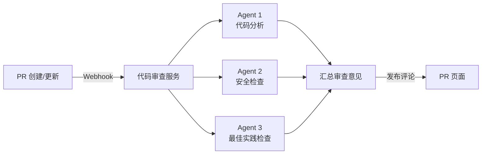

**本文你会学到：**

- 🎯 如何用 `/loop` 命令设置本地定时任务，让 Claude Code 周期性执行工作
- ☁️ 云端定时任务与本地定时任务的区别，以及如何利用 Anthropic 基础设施
- 🎮 通过 Remote Control 远程操控 Claude Code 会话
- 📡 使用 Channels 将外部消息源接入 Claude Code 对话
- ⚙️ 在 GitHub Actions 和 GitLab CI/CD 中集成 Claude Code
- 🔍 配置自动代码审查（Code Review）托管服务

## ⏰ 定时任务

想象一下，你有一个实习生，你让他每天早上 9 点检查一遍代码有没有报错，每周五下午跑一次测试——你不需要每天手动提醒他，只要设定好时间表，他就会准时执行。Claude Code 的定时任务就是这样一个「定时闹钟 + 自动执行」的机制。

### 本地定时任务

本地定时任务通过 `/loop` 命令触发（v2.1.71 新增），让 Claude Code 在当前会话中**周期性地重复执行某项任务**。同版本还新增了 cron 调度工具，支持在会话内使用标准 cron 表达式设置循环提示。

#### 基本用法

在交互模式中输入 `/loop`，然后描述你想重复执行的任务：

```
> /loop
What task would you like me to loop on? 每隔 30 分钟检查 src/ 下有没有编译错误
```

Claude Code 会按照你设定的时间间隔反复执行，直到你手动停止。

#### 时间间隔格式

`/loop` 支持自然语言和标准 cron 表达式两种方式指定频率：

| 方式 | 示例 | 含义 |
|------|------|------|
| 自然语言 | `every 30 minutes` | 每 30 分钟 |
| 自然语言 | `every 2 hours` | 每 2 小时 |
| 自然语言 | `every day at 9am` | 每天 9 点 |
| Cron 表达式 | `0 9 * * 1-5` | 工作日每天 9 点 |
| Cron 表达式 | `*/30 * * * *` | 每 30 分钟 |

💡 **自然语言 vs Cron**：简单场景用自然语言更直观（如 `every hour`），复杂场景（如「每月第一个工作日」）用 Cron 表达式更精确。

#### 运行机制

⚠️ 本地定时任务运行在**当前会话中**——这意味着：

- 你必须保持终端窗口开着（或机器不能休眠）
- 任务在 Claude Code 的本地进程中执行，依赖你本机的环境
- 适合**开发阶段的重复性工作**，如反复跑测试、检查代码风格等

```bash
# 示例：每隔 1 小时检查项目编译状态
claude "/loop check if the project compiles and report any errors"
```

### 云端定时任务

云端定时任务是本地定时任务的「升级版」——它运行在 Anthropic 管理的云端基础设施上，**不依赖你的本机**。

打个比方：本地定时任务就像你用自己的手机设闹钟，手机关了闹钟就停了；云端定时任务就像雇了一个 7×24 在线的助手，即使你关机了，他依然准时工作。

#### 核心特性

| 特性 | 说明 |
|------|------|
| 运行环境 | Anthropic 云端基础设施，无需本机在线 |
| 任务持久性 | 即使你的电脑关机，任务依然按计划执行 |
| 频率选项 | 每小时、每天、每周、自定义 cron |
| 分支控制 | 可指定在哪个 Git 分支上执行 |
| Connector 支持 | 任务可通过 Anthropic Connector 访问你的代码仓库 |

#### 配置方式

云端定时任务通过 Anthropic Console 的 Claude Code 页面进行管理。配置时需要指定：

1. **任务描述**：告诉 Claude Code 每次要做什么
2. **执行频率**：支持预置选项和自定义 cron
3. **目标仓库与分支**：通过 Connector 关联到你的代码仓库
4. **权限范围**：控制在仓库中可执行的操作

#### 本地 vs 云端对比

| 维度 | 本地定时任务 (`/loop`) | 云端定时任务 |
|------|----------------------|-------------|
| 运行位置 | 你的电脑 | Anthropic 云端 |
| 本机要求 | 需要保持在线 | 无需本机在线 |
| 配置方式 | `/loop` 命令 | Anthropic Console |
| 适用场景 | 开发阶段反复调试 | 生产环境的定时维护 |
| 分支控制 | 当前分支 | 可指定分支 |

💡 **选型建议**：如果你只是开发时想让 Claude 反复帮你检查代码，用 `/loop` 就够了；如果你需要在服务器上定时跑自动化任务（如每日构建检查、依赖更新），用云端定时任务。

## 🎮 远程控制

Remote Control 让你从外部**操控一个正在运行的 Claude Code 会话**——就像远程桌面一样，只不过你控制的是一个 AI 助手的对话。

### Server Mode

Server Mode 把 Claude Code 变成一个「服务端」，监听来自客户端的连接请求：

```bash
# 启动 server mode
claude --server
```

启动后，Claude Code 会在后台运行，等待外部连接。

### Interactive Mode

Interactive Mode 是更完整的交互体验——它不仅允许远程控制，还提供了完整的终端界面：

```bash
# 启动 interactive mode（默认监听本机）
claude -i

# 指定监听地址
claude -i --host 0.0.0.0 --port 8080
```

### 连接到已有会话

如果你已经有一个 Claude Code 会话在运行，可以通过 `/rc`（Remote Control）命令从另一个终端连接过去：

```
> /rc
```

Claude Code 会显示可连接的会话列表，选择后即可在新终端中操控原有会话。

⚠️ **安全提醒**：Remote Control 会暴露你的 Claude Code 会话给网络上的其他客户端。在生产环境中使用时，务必配合网络隔离和认证机制，避免未授权访问。

### 适用场景

| 场景 | 说明 |
|------|------|
| 多终端协作 | 在办公室电脑启动会话，回家后从笔记本连接继续 |
| 团队协作 | 多人连接同一个 Claude Code 会话，协同处理任务 |
| 无头环境 | 在服务器上以 server mode 运行，从本地客户端操控 |

## 📡 Channels 消息通道

想象 Claude Code 是你的私人助理。平时你只能亲自去他的办公室（终端）找他。但如果助理有一部手机（Channel），你就可以通过微信、钉钉等工具给他发消息，他收到后会直接处理并回复——你甚至不需要打开终端。

**Channels 就是 Claude Code 的「通讯录」**——它让外部消息源能把事件推送到 Claude Code 的会话中，让 Claude 像处理普通对话一样处理这些外部输入。

### 支持的消息源

Claude Code 目前支持以下消息源（v2.1.0 引入 Research Preview）：

| 消息源 | 说明 |
|--------|------|
| Telegram | 通过 Telegram Bot 接收消息 |
| Discord | 通过 Discord Bot 接收频道消息 |
| iMessage | 通过 iMessage 接收消息（macOS 专属） |

> 💡 **Research Preview**：Channels 目前处于研究预览阶段，API 可能发生变化。建议在非关键场景中使用，并关注官方更新。

### Channel 的工作原理

一个 Channel 本质上是一个 **Webhook 接收器 + 消息转发器**：


1. 外部消息源（如 Telegram）通过 Webhook 将消息发送到你的 Channel
2. Channel 将消息作为事件注入到 Claude Code 会话中
3. Claude Code 处理事件并生成回复
4. Channel 将回复发送回原始消息源

### 构建自定义 Channel

你可以通过 `claude/channel` capability 来声明一个自定义 Channel。Channel 需要实现以下核心能力：

- **接收外部事件**：通过 Webhook 或其他方式获取外部消息
- **向 Claude Code 注入消息**：将事件转化为 Claude 可理解的对话输入
- **权限中继（Permission Relay）**：将 Claude 的工具调用请求转发给用户授权
- **回复投递**：将 Claude 的响应发送回消息源

⚠️ 构建自定义 Channel 需要一定的开发能力——你需要部署一个 Webhook 接收服务，并处理消息格式的转换。如果你只是想快速体验，建议先使用官方支持的 Telegram / Discord Channel。

## 🔄 GitHub Actions 集成

如果你用过 GitHub Actions，一定知道它可以在代码提交、PR 创建等事件发生时自动执行流水线。把 Claude Code 嵌入这个流水线，就等于让一个 AI 助手在每次 CI 触发时自动干活——比如自动修复 lint 错误、生成测试、审查代码。

### 基本配置

Claude Code 提供官方 Action：`anthropics/claude-code-action@v1`。以下是基本用法：

```yaml title=".github/workflows/claude.yml"
name: Claude Code
on:
  issues:
    types: [labeled]

jobs:
  claude:
    runs-on: ubuntu-latest
    steps:
      - uses: actions/checkout@v4

      - name: Run Claude Code
        uses: anthropics/claude-code-action@v1
        with:
          anthropic_api_key: ${{ secrets.ANTHROPIC_API_KEY }}
          prompt: |
            修复这个 issue 中描述的问题。
            完成后创建一个 PR。
```

### 通过 @claude 触发

除了通过 workflow 事件触发外，你还可以在 GitHub Issue、PR 评论、代码审查评论中使用 `@claude` 来触发 Claude Code：

```markdown
@claude 请帮我修复这个测试失败的问题
```

Claude Code 会读取上下文（Issue 内容、PR diff 等），然后执行相应操作。

### 常用配置参数

| 参数 | 说明 | 示例 |
|------|------|------|
| `anthropic_api_key` | Anthropic API 密钥 | `${{ secrets.ANTHROPIC_API_KEY }}` |
| `prompt` | 给 Claude 的指令 | `"修复 lint 错误"` |
| `model` | 使用的模型 | `claude-sonnet-4-20250514` |
| `allowed_tools` | 允许 Claude 使用的工具列表 | `"Bash(git*)" "Edit"` |
| `timeout_minutes` | 超时时间（分钟） | `10` |
| `directives` | 额外的行为指令文件路径 | `.claude/commands/fix.md` |

### 实际示例：自动修复 lint

```yaml title=".github/workflows/auto-fix.yml"
name: Auto Fix Lint
on:
  pull_request:
    types: [opened, synchronize]

jobs:
  auto-fix:
    runs-on: ubuntu-latest
    permissions:
      contents: write
    steps:
      - uses: actions/checkout@v4

      - name: Install dependencies
        run: npm ci

      - name: Run lint fix with Claude
        uses: anthropics/claude-code-action@v1
        with:
          anthropic_api_key: ${{ secrets.ANTHROPIC_API_KEY }}
          prompt: |
            运行 npm run lint 查看错误，
            然后修复所有 lint 错误。
            如果有修改，直接提交到当前分支。
```

💡 **`allowed_tools` 的重要性**：在 CI 环境中，建议通过 `allowed_tools` 限制 Claude 可执行的操作范围，避免它执行不必要（甚至危险）的命令。比如只允许 `Read`、`Edit`、`Bash(npm*)` 等。

## 🚀 GitLab CI/CD 集成

GitLab CI/CD 的集成方式和 GitHub Actions 类似——通过在 `.gitlab-ci.yml` 中配置 Claude Code 的运行步骤，让 AI 助手参与到你的 CI 流水线中。

### 基本配置

```yaml title=".gitlab-ci.yml"
stages:
  - review

claude-review:
  stage: review
  image: node:20
  before_script:
    - npm install -g @anthropic-ai/claude-code
  script:
    - claude -p "审查当前分支的代码变更，指出潜在问题并给出修复建议"
  rules:
    - if: '$CI_PIPELINE_SOURCE == "merge_request_event"'
```

### 使用 OIDC 认证

如果你使用 AWS Bedrock 或 Google Vertex AI 作为 Claude 的模型提供方，可以通过 OIDC（OpenID Connect）让 GitLab Runner 无需硬编码 API 密钥即可安全访问：

```yaml title=".gitlab-ci.yml"
claude-review:
  stage: review
  image: node:20
  id_tokens:
    CLAUDE_OIDC_TOKEN:
      aud: https://claude.ai
  script:
    - npm install -g @anthropic-ai/claude-code
    # 使用 OIDC Token 认证，无需 API Key
    - claude -p "审查代码变更"
  variables:
    ANTHROPIC_AUTH_TOKEN: $CLAUDE_OIDC_TOKEN
```

💡 **OIDC 的优势**：传统方式需要在 CI/CD 中存储 API 密钥（secrets），存在泄露风险。OIDC 通过短期的令牌交换实现认证，无需长期密钥，安全性更高。

### GitHub Actions vs GitLab CI/CD

| 维度 | GitHub Actions | GitLab CI/CD |
|------|---------------|-------------|
| 配置文件 | `.github/workflows/*.yml` | `.gitlab-ci.yml` |
| 官方 Action | `anthropics/claude-code-action@v1` | 直接调用 `claude` CLI |
| @claude 触发 | 支持（Issue/PR 评论） | 不支持 |
| OIDC 认证 | 通过 `actions/setup-oidc` | 通过 `id_tokens` 关键字 |
| 触发方式 | workflow events + @claude | pipeline rules |

## 🔍 自动代码审查

自动代码审查是 Anthropic 提供的**托管服务**——你不需要自己搭建 CI 流水线，只需要在 Anthropic Console 中配置，就能让多 Agent 协作系统自动分析你仓库中的 PR。

打个比方：你自己搭建 GitHub Actions + Claude Code 做审查，就像自己装修房子；而使用自动代码审查托管服务，就像请了一个精装修团队——他们带着专业工具直接上门服务。

### 工作原理

自动代码审查服务采用**多 Agent 协作**的方式：



每个 Agent 专注于不同维度的审查，最终将所有意见汇总为一条或多条 PR 评论。

### 审查严重级别

审查结果会标记不同的严重级别，帮助你快速判断哪些问题需要优先处理：

| 级别 | 含义 | 建议处理方式 |
|------|------|-------------|
| 🔴 Critical | 严重问题（安全漏洞、数据丢失风险等） | 必须立即修复 |
| 🟠 Warning | 警告（潜在 Bug、性能问题等） | 强烈建议修复 |
| 🟡 Info | 建议（代码风格、可读性改进等） | 可选改进 |
| 🟢 Nit | 细微问题（命名、格式等） | 可忽略 |

### 自定义审查行为

你可以通过以下方式自定义审查服务的偏好：

**`CLAUDE.md`**：在仓库根目录放置 `CLAUDE.md` 文件，审查 Agent 会自动读取并遵循其中的规范：

```markdown title="CLAUDE.md"
# 项目规范

- 本项目使用 Java 17 + Spring Boot 3.x
- 所有 public 方法必须有 Javadoc
- 禁止使用 `@Autowired` 字段注入，统一使用构造器注入
- 异常处理不允许 catch 后静默忽略
```

**`REVIEW.md`**：专门用于代码审查的指令文件，优先级高于 `CLAUDE.md`：

```markdown title="REVIEW.md"
# 审查重点

- 关注并发安全性：检查共享可变状态是否正确同步
- 关注资源泄露：确保流、连接等资源在 finally 中关闭
- 审查意见请用中文
```

💡 **`CLAUDE.md` vs `REVIEW.md`**：`CLAUDE.md` 是项目通用规范，影响所有 Claude Code 使用场景；`REVIEW.md` 是审查专属指令，只影响自动代码审查服务。如果两者同时存在且内容冲突，`REVIEW.md` 优先。

### 配置入口

自动代码审查服务通过 Anthropic Console 的 Claude Code 页面进行配置：

1. 关联你的 GitHub/GitLab 仓库
2. 设置触发条件（哪些分支、哪些事件触发审查）
3. 配置审查偏好（严重级别阈值、关注的代码区域等）
4. （可选）在仓库中添加 `CLAUDE.md` 和 `REVIEW.md` 自定义审查行为

📝 **小结**：自动代码审查服务适合不想自己维护 CI 流水线的团队。如果你需要更细粒度的控制（比如只在特定文件变更时审查），或者想和现有的 CI 流程深度集成，建议使用前面介绍的 GitHub Actions / GitLab CI/CD 方式自己搭建。
