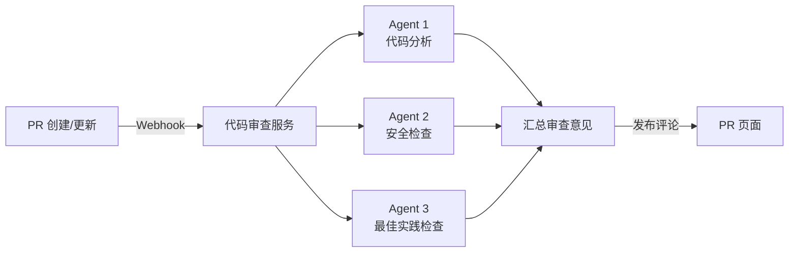

---
title: 自动化
description: 定时任务、远程控制、消息通道、CI/CD 集成与自动代码审查
---

**本文你会学到**：

- 🎯 三种调度方式对比（`/loop`、Desktop、云端），选择最适合你的方案
- ⏰ 用 `/loop` 命令设置本地定时任务：固定间隔、动态间隔、内置维护提示词
- 📋 管理计划任务、设置一次性提醒、Cron 表达式参考
- 🎮 通过 Remote Control 远程操控 Claude Code 会话
- 📡 使用 Channels 将外部消息源接入 Claude Code 对话
- ⚙️ 在 GitHub Actions 和 GitLab CI/CD 中集成 Claude Code
- 🔍 配置自动代码审查（Code Review）托管服务

## ⏰ 定时任务

想象一下，你有一个实习生，你让他每天早上 9 点检查一遍代码有没有报错，每周五下午跑一次测试——你不需要每天手动提醒他，只要设定好时间表，他就会准时执行。Claude Code 的定时任务就是这样一个「定时闹钟 + 自动执行」的机制。

### 三种调度方式对比

Claude Code 提供三种调度方式，适用于不同场景：

| 维度 | 云端（Routines） | Desktop 计划任务 | `/loop`（会话内） |
|------|----------------|----------------|------------------|
| 运行位置 | Anthropic 云端 | 你的电脑 | 你的电脑 |
| 需要电脑在线 | 否 | 是 | 是 |
| 需要会话打开 | 否 | 否 | 是 |
| 跨重启持久化 | 是 | 是 | `--resume` 恢复未过期任务 |
| 访问本地文件 | 否（全新 clone） | 是 | 是 |
| MCP 服务器 | 按任务配置 Connector | 配置文件 + Connector | 继承当前会话 |
| 权限提示 | 否（自主运行） | 按任务配置 | 继承当前会话 |
| 最小间隔 | 1 小时 | 1 分钟 | 1 分钟 |

💡 **选型建议**：需要不依赖本机、可靠运行的任务用**云端**；需要访问本地文件但不一定有活跃会话的用 **Desktop**；开发阶段想快速轮询某个状态用 **`/loop`**。

### `/loop` 命令详解

`/loop` 是一个[内置 Skill](../skills/index.md#官方内置-skills)，让 Claude Code 在当前会话中周期性重复执行任务（v2.1.71 新增）。`/proactive` 是 `/loop` 的别名（v2.1.105 新增），效果完全相同。从 v2.1.113 起，按 `Esc` 可取消待执行的唤醒；唤醒触发时会清晰显示为 "Claude resuming /loop wakeup"，便于识别是定时任务还是普通对话。

你提供给 `/loop` 的内容决定了它的行为模式：

| 你提供的内容 | 示例 | 行为 |
|-------------|------|------|
| 间隔 + 提示词 | `/loop 5m check the deploy` | 按[固定计划](#固定间隔运行)运行 |
| 仅提示词 | `/loop check the deploy` | Claude [动态选择间隔](#动态间隔运行) |
| 仅间隔或无 | `/loop` | 运行[内置维护提示词](#内置维护提示词) |

你也可以将另一个斜杠命令作为提示词传递，例如 `/loop 20m /review-pr 1234`，在每次迭代时重新运行打包的工作流。

#### 固定间隔运行

当你同时提供间隔和提示词时，Claude 将间隔转换为 cron 表达式，按固定计划执行：

```text
/loop 5m check if the deployment finished and tell me what happened
```

间隔可以写在提示词前面（裸格式如 `30m`），也可以写在后面（从句如 `every 2 hours`）。支持单位：`s`（秒）、`m`（分钟）、`h`（小时）、`d`（天）。

⚠️ 秒数向上舍入到最近的分钟（cron 最小粒度为 1 分钟）。不能均匀映射到 cron 步长的间隔（如 `7m`、`90m`）会舍入到最近的间隔，Claude 会告诉你实际选择了什么。

#### 动态间隔运行

当你省略间隔时，Claude 在每次迭代后根据观察到的情况**动态选择延迟**（1 分钟到 1 小时之间）：构建完成时等待较短，没有待处理项时等待较长。

```text
/loop check whether CI passed and address any review comments
```

选择的延迟和原因会在每次迭代结束时打印。这种模式比固定间隔更节省 token——Claude 会在任务变得安静后自动降低检查频率。

动态计划的循环也出现在[计划任务列表](#管理计划任务)中，可以像其他任务一样列出或取消。[七天过期](#七天过期)同样适用。

!!! info "Monitor tool"

    当你请求动态间隔时，Claude 可能会直接使用 Monitor tool 而非 cron 调度。Monitor 运行后台脚本并流式传输每个输出行，完全避免了轮询，通常比按间隔重新运行提示词更节省 token 且响应更快。

#### 内置维护提示词

当你不带任何参数运行 `/loop` 时，Claude 使用内置维护提示词，依次处理：

1. 继续对话中未完成的工作
2. 照顾当前分支的 PR：审查评论、失败的 CI、合并冲突
3. 运行清理（如错误搜索、代码简化）

Claude 不会启动该范围之外的新举措，不可逆操作（如推送或删除）仅在继续已授权的内容时进行。

```text
/loop
```

裸 `/loop` 在动态选择的间隔上运行。添加间隔（如 `/loop 15m`）则在固定计划上运行。要用你自己的默认值替换内置提示词，创建 `loop.md` 文件。

#### 自定义默认提示词：loop.md

`loop.md` 文件替换内置维护提示词，只对裸 `/loop` 生效（你提供了提示词时它被忽略）。Claude 在两个位置查找，使用找到的第一个：

| 路径 | 作用范围 |
|------|---------|
| `.claude/loop.md` | 项目级（优先） |
| `~/.claude/loop.md` | 用户级（适用于未定义 `loop.md` 的项目） |

```markdown title=".claude/loop.md"
Check the `release/next` PR. If CI is red, pull the failing job log,
diagnose, and push a minimal fix. If new review comments have arrived,
address each one and resolve the thread. If everything is green and
quiet, say so in one line.
```

对 `loop.md` 的编辑在下一次迭代时生效。文件大小超过 25,000 字节会被截断。

#### 停止循环

在 `/loop` 等待下一次迭代时按 `Esc` 即可停止——这会清除待处理的唤醒。但你通过自然语言或 `CronCreate` 计划的任务不受 `Esc` 影响，需要通过[管理计划任务](#管理计划任务)手动删除。

### 一次性提醒

对于一次性提醒，用自然语言描述即可。Claude 计划一个单次触发的任务，运行后自动删除：

```text
remind me at 3pm to push the release branch
```

```text
in 45 minutes, check whether the integration tests passed
```

Claude 使用 cron 表达式将触发时间固定到特定的分钟和小时，并确认何时触发。

### 管理计划任务

用自然语言要求 Claude 列出或取消任务：

```text
what scheduled tasks do I have?
```

```text
cancel the deploy check job
```

在幕后，Claude 使用三个工具：

| 工具 | 用途 |
|------|------|
| `CronCreate` | 计划新任务。接受 5 字段 cron 表达式、要运行的提示词、是否重复（`recurring`），以及是否持久化（`durable`） |
| `CronList` | 列出所有计划任务（ID、计划、提示词），包括持久化和会话内的 |
| `CronDelete` | 按 ID 取消任务 |

每个任务有一个 8 字符 ID，一个会话最多同时保存 50 个计划任务。

!!! info "`CronCreate` 的 `durable` 参数"

    默认情况下（`durable: false`），任务只存在于当前会话的内存中——退出 Claude Code 后就消失了。设置 `durable: true` 后，任务会写入 `.claude/scheduled_tasks.json` 文件，即使你重启 Claude Code 甚至重启电脑，任务依然存在。

    一次性 `durable` 任务如果在会话关闭期间被错过，会在下次启动时补触发。重复 `durable` 任务同样遵循[七天过期](#七天过期)规则。

### 计划任务的运行机制

#### 调度与排队

调度程序每秒检查一次到期的任务，以低优先级将其加入队列。计划的提示词在你的回合之间触发——如果 Claude 正忙，提示词会等到当前回合结束。所有时间都使用你的本地时区。

#### 抖动

为了避免所有会话在同一时刻请求 API，调度程序添加确定性偏移：

- 重复任务：最多晚触发其周期的 10%，上限 15 分钟
- 一次性任务：为整点或半点计划的任务最多提前 90 秒触发

偏移从任务 ID 派生，相同任务总是获得相同偏移。如果你在意精确时间，选择不是整点或半点的分钟（如 `3 9 * * *` 而非 `0 9 * * *`），一次性抖动将不适用。

#### 七天过期

重复任务在创建后 **7 天自动过期**——任务最后触发一次，然后自行删除。如果需要更长时间的调度，请在过期前取消并重新创建，或使用云端定时任务 / Desktop 计划任务。

#### 动态间隔的技术细节

省略间隔的 `/loop` 底层使用的是 `ScheduleWakeup` 工具而非 `CronCreate`。`ScheduleWakeup` 的设计理念与 cron 不同：

- **延迟范围**：60 秒到 3600 秒（1 分钟到 1 小时），由 Claude 根据当前情况动态选择
- **缓存感知**：Anthropic 提示缓存有 5 分钟 TTL。延迟选在 270 秒以内可以保持缓存命中；选在 1200 秒以上则需要重新加载完整上下文
- **无 cron 表达式**：`ScheduleWakeup` 不接受 cron，只接受下一次唤醒的延迟秒数
- **会话内专用**：`ScheduleWakeup` 创建的任务不会出现在 `CronList` 中

当你请求动态间隔时，Claude 内部使用哨兵值 `<<autonomous-loop-dynamic>>` 来标识这是一个自主循环——它在每次唤醒时重新评估应该等待多久。

### Cron 表达式参考

`CronCreate` 接受标准 5 字段 cron 表达式：`minute hour day-of-month month day-of-week`。所有字段都支持通配符（`*`）、单个值、步长（`*/15`）、范围（`1-5`）和逗号分隔列表。

| 示例 | 含义 |
|------|------|
| `*/5 * * * *` | 每 5 分钟 |
| `0 * * * *` | 每小时整点 |
| `7 * * * *` | 每小时的第 7 分钟 |
| `0 9 * * *` | 每天本地时间 9am |
| `0 9 * * 1-5` | 工作日每天 9am |
| `30 14 15 3 *` | 3 月 15 日下午 2:30 |

星期几使用 `0` 或 `7` 表示周日，`6` 表示周六。不支持 `L`、`W`、`?` 和名称别名（如 `MON`、`JAN`）。

当月份日期和星期几都受限时，任一字段匹配即算匹配（标准 vixie-cron 语义）。

### 禁用计划任务

设置环境变量 `CLAUDE_CODE_DISABLE_CRON=1` 可完全禁用调度程序——cron 工具和 `/loop` 变得不可用，已计划的任务也停止触发。

### 局限性

会话范围的调度有固有限制：

- 任务仅在 Claude Code 运行且空闲时触发——关闭终端或退出会话会停止触发
- 没有错过触发的追赶——如果计划时间在 Claude 忙碌时经过，它只会在空闲时触发一次
- 启动新对话会清除所有会话范围的任务——使用 `--resume` 或 `--continue` 恢复会话可找回未过期的任务
- 后台 Bash 和 Monitor 任务在恢复时不会被恢复

需要无人值守的定时自动化，请使用云端定时任务、Desktop 计划任务或 [GitHub Actions](#github-actions-集成)。

### 云端定时任务

云端定时任务运行在 Anthropic 管理的云端基础设施上，**不依赖你的本机**——即使你关机了，任务依然准时执行。详细的三种调度方式对比见[上文](#三种调度方式对比)。

#### 核心特性

| 特性 | 说明 |
|------|------|
| 运行环境 | Anthropic 云端基础设施，无需本机在线 |
| 任务持久性 | 即使你的电脑关机，任务依然按计划执行 |
| 频率选项 | 每小时、每天、每周、自定义 cron |
| 分支控制 | 可指定在哪个 Git 分支上执行 |
| Connector 支持 | 任务可通过 Anthropic Connector 访问你的代码仓库 |

#### 配置方式

云端定时任务通过 Anthropic Console 的 Claude Code 页面进行管理。配置时需要指定：

1. **任务描述**：告诉 Claude Code 每次要做什么
2. **执行频率**：支持预置选项和自定义 cron
3. **目标仓库与分支**：通过 Connector 关联到你的代码仓库
4. **权限范围**：控制在仓库中可执行的操作

## Routines：云端自动化

`/loop` 和 Desktop 计划任务都依赖你的本机——关机就停了。如果你想让 Claude Code 在你睡觉的时候也在干活（比如每天凌晨审查 PR、每周扫描依赖安全），就需要 **Routines**。Routines 运行在 Anthropic 管理的云基础设施上，跟你的电脑完全无关。

!!! info "研究预览"

    Routines 目前处于**研究预览**阶段，行为、限制和 API 可能发生变化。需要开启 Claude Code on the Web 的 Pro、Max、Team 或 Enterprise 计划才能使用。

### Routines vs 本地调度

Routines 和前面介绍的 `/loop`、Desktop 计划任务相比，最大的区别在于**运行位置**和**自主性**：

| 维度 | `/loop` | Desktop 计划任务 | Routines |
|------|---------|----------------|----------|
| 运行位置 | 你的电脑 | 你的电脑 | Anthropic 云端 |
| 需要本机在线 | 是 | 是 | 否 |
| 需要会话打开 | 是 | 否 | 否 |
| 跨重启持久化 | `--resume` 恢复 | 是 | 是 |
| 访问本地文件 | 是 | 是 | 否（全新 clone） |
| MCP 服务器 | 继承会话 | 配置文件 + Connector | 按任务配置 Connector |
| 权限提示 | 继承会话 | 按任务配置 | 无（完全自主） |
| 最小间隔 | 1 分钟 | 1 分钟 | 1 小时 |

Routines 作为完整的 Claude Code 云会话自主运行——没有权限模式选择器，运行期间也没有批准提示。Claude 可以执行 shell 命令、提交代码、调用你配置的 Connector。它的操作都以你的身份执行：Git 提交和 PR 显示你的用户名，Slack 消息使用你的账户。

### 三种触发器类型

每个 Routine 可以附加一种或多种触发器，灵活组合不同的自动化场景。

#### 计划触发器

计划触发器按固定节奏运行 Routine，支持预设频率和自定义 cron：

| 预设频率 | 说明 |
|---------|------|
| 每小时 | 适合高频检查任务 |
| 每天 | 适合日常维护 |
| 工作日 | 只在周一到周五运行 |
| 每周 | 适合周期性报告 |

时间使用你的本地时区输入，自动转换。实际运行时间可能有几分钟的交错偏移（每个 Routine 的偏移是一致的）。最小间隔为 1 小时，更频繁的表达式会被拒绝。

对于自定义间隔（如每两小时、每月第一天），先在 Web 上选最近的预设创建 Routine，然后在 CLI 中运行 `/schedule update` 设置特定的 cron 表达式。

#### API 触发器

API 触发器为每个 Routine 提供一个专用的 HTTP 端点。向端点发送 POST 请求就能启动一次运行——适合把 Claude Code 接入你的告警系统、部署管道或内部工具。

设置 API 触发器的步骤：

1. 在 [claude.ai/code/routines](https://claude.ai/code/routines) 打开 Routine 编辑页面
2. 在 **Select a trigger** 部分添加 **API** 触发器
3. 复制生成的 URL，点击 **Generate token** 生成 Bearer 令牌（**令牌只显示一次**，务必保存）
4. 使用令牌调用 `/fire` 端点

```bash
curl -X POST https://api.anthropic.com/v1/claude_code/routines/trig_01ABCDEFGHJKLMNOPQRSTUVW/fire \
  -H "Authorization: Bearer sk-ant-oat01-xxxxx" \
  -H "anthropic-beta: experimental-cc-routine-2026-04-01" \
  -H "anthropic-version: 2023-06-01" \
  -H "Content-Type: application/json" \
  -d '{"text": "Sentry alert SEN-4521 fired in prod. Stack trace attached."}'
```

请求正文中的 `text` 字段是可选的，可以传入告警内容、日志片段等上下文，Claude 会将其与 Routine 的预设提示词一起处理。`text` 是自由格式文本，不会被解析——如果你发送 JSON，Claude 会把它当作字面字符串接收。

成功调用后返回新会话的 ID 和 URL，你可以在浏览器中打开 URL 实时查看运行过程。

!!! warning "Beta API 标识"

    `/fire` 端点在 `experimental-cc-routine-2026-04-01` beta 标识下发布，属于研究预览。请求/响应格式、速率限制和令牌语义可能变化。破坏性变更会在新的 beta 标识版本后发布，最近的两个旧版本会继续工作一段时间。

#### GitHub 事件触发器

GitHub 事件触发器让 Routine 自动响应仓库事件——PR 创建、Release 发布等。每个匹配事件都会启动一个独立的会话。

!!! info "每小时上限"

    研究预览期间，GitHub webhook 事件受每个 Routine 和每个账户的每小时上限限制。超出上限的事件会被丢弃，直到窗口重置。

设置 GitHub 事件触发器需要先安装 **Claude GitHub App**。在触发器设置中，如果你尚未安装，系统会提示你授权安装。

!!! note "CLI 的 `/web-setup` 不够"

    在 CLI 中运行 `/web-setup` 只是授权仓库克隆访问权限，它不会安装 Claude GitHub App，也不启用 webhook 传递。GitHub 事件触发器需要单独安装 Claude GitHub App。

**支持的事件**：

| 事件 | 触发时机 |
|------|---------|
| Pull request | PR 被打开、关闭、分配、标记、同步或以其他方式更新 |
| Release | Release 被创建、发布、编辑或删除 |

你可以选择特定操作（如 `pull_request.opened`），也可以对类别中的所有操作做出反应。

**PR 过滤条件**：

| 过滤字段 | 匹配内容 |
|---------|---------|
| Author | PR 作者的 GitHub 用户名 |
| Title | PR 标题文本 |
| Body | PR 描述文本 |
| Base branch | PR 的目标分支 |
| Head branch | PR 的来源分支 |
| Labels | 应用于 PR 的标签 |
| Is draft | PR 是否处于草稿状态 |
| Is merged | PR 是否已合并 |
| From fork | PR 是否来自 fork |

每个过滤器将字段与运算符配对：`equals`、`contains`、`starts with`、`is one of`、`is not one of` 或 `matches regex`。所有过滤条件必须全部匹配才会触发 Routine。

`matches regex` 测试整个字段值，不是子字符串匹配。要匹配标题中包含 `hotfix` 的 PR，需要写 `.*hotfix.*`，而不是只写 `hotfix`。如果只需要简单的子字符串匹配，用 `contains` 运算符更直观。

一些实用的过滤组合：

- **只审查认证模块 PR**：base branch `main` + head branch contains `auth-provider`
- **外部贡献者 PR**：from fork is `true`——为 fork PR 路由额外的安全和风格审查
- **只审查非草稿 PR**：is draft is `false`——跳过还在编辑中的 PR
- **标签触发的移植**：labels include `needs-backport`——只在维护者打标签时触发移植 Routine

### 创建和管理 Routines

你可以通过三种方式创建 Routines——所有方式都写入同一个云账户，互相同步：

**Web**：访问 [claude.ai/code/routines](https://claude.ai/code/routines)，点击 **New routine**，填写提示、仓库、环境、Connector 和触发器。

**CLI**：在任何会话中运行 `/schedule` 以对话方式创建计划 Routine。也可以直接描述，如 `/schedule daily PR review at 9am`。注意 CLI 的 `/schedule` 目前只能创建计划触发器，API 和 GitHub 触发器需要在 Web 上编辑 Routine 来添加。管理命令：`/schedule list`（查看所有）、`/schedule update`（修改）、`/schedule run`（立即触发）。

**Desktop 应用**：在 Schedule 页面点击 **New task**，选择 **New remote task**。

在 Routine 详情页，你可以点击 **Run now** 立即启动一次运行（不等下一个计划时间），也可以暂停/恢复计划、编辑配置或删除 Routine。

### 仓库和分支权限

每个添加的仓库在每次运行时都会被克隆，默认从主分支开始。默认情况下，Claude 只能推送到以 `claude/` 为前缀的分支——这防止 Routine 意外修改受保护分支。如果你需要 Routine 推送到任意分支，可以为特定仓库启用 **Allow unrestricted branch pushes**。

### 每日运行上限

Routines 的运行消耗和交互式会话相同。除了标准订阅限制外，每个账户每天还有**运行次数上限**。你可以在 [claude.ai/code/routines](https://claude.ai/code/routines) 或 `claude.ai/settings/usage` 查看当前消耗和剩余次数。开启了额外使用（Extra usage）的组织可以在超出上限后继续按量计费运行。

## 远程控制

Remote Control 让你从手机、平板或任何浏览器**操控一个正在运行的 Claude Code 会话**。Claude 始终在你的机器上运行，所有文件、MCP 服务器、工具和项目配置都保持可用——手机或浏览器只是一个远程窗口。

!!! info "研究预览与版本要求"

    Remote Control 需要 Claude Code v2.1.51 或更高版本。它在所有计划中都可用（Pro、Max、Team、Enterprise），但在 Team 和 Enterprise 上需要管理员在 [Claude Code 管理员设置](https://claude.ai/admin-settings/claude-code) 中启用。

### 启动 Remote Control 会话

Claude Code 提供四种启动方式，各有不同的使用场景。

#### 服务器模式

服务器模式是功能最完整的方式——它会启动一个持续运行的服务进程，等待远程连接，并支持多个并发会话：

```bash
claude remote-control
```

启动后终端会显示会话 URL，按空格键可以显示 QR 码方便手机扫码。当远程会话活跃时，终端会实时显示连接状态和工具活动。

服务器模式支持的完整标志列表：

| 标志 | 说明 |
|------|------|
| `--name "My Project"` | 设置自定义会话标题，在 claude.ai/code 的会话列表中可见 |
| `--remote-control-session-name-prefix <prefix>` | 自动生成会话名称的前缀，默认为主机名。也可通过环境变量 `CLAUDE_REMOTE_CONTROL_SESSION_NAME_PREFIX` 设置 |
| `--spawn <mode>` | 会话创建模式：<br/>`same-dir`（默认）——所有会话共享当前工作目录<br/>`worktree`——每个会话获得独立的 git worktree<br/>`session`——单会话模式，只提供一个会话。运行时按 `w` 可在 `same-dir` 和 `worktree` 之间切换 |
| `--capacity <N>` | 最大并发会话数，默认 32。不能与 `--spawn=session` 一起使用 |
| `--verbose` | 显示详细的连接和会话日志 |
| `--sandbox` / `--no-sandbox` | 启用或禁用沙箱（文件系统和网络隔离），默认关闭 |

#### 交互式会话模式

在启动普通交互式会话的同时启用 Remote Control：

```bash
# 基本用法
claude --remote-control

# 带自定义名称
claude --remote-control "My Project"
```

这给你一个完整的终端交互式会话，同时也可以从 claude.ai 或 Claude 应用远程控制。与服务器模式不同，你可以在本地输入消息的同时远程控制会话。`--remote-control` 可缩写为 `--rc`。

#### 从已有会话启用

如果你已经在 Claude Code 会话中，可以用斜杠命令启用：

```
/remote-control
```

传递名称可设置自定义标题：`/remote-control My Project`。这会继承你当前的对话历史记录，并显示会话 URL 和 QR 码。`--verbose`、`--sandbox` 和 `--no-sandbox` 标志不适用于此命令。`/remote-control` 可缩写为 `/rc`。

#### VS Code 扩展集成

在 Claude Code VS Code 扩展中（v2.1.79 或更高版本），在提示框中输入 `/remote-control` 或 `/rc`。提示框上方会出现一个横幅显示连接状态，连接后点击横幅中的**在浏览器中打开**即可跳转到会话。

!!! note "VS Code 限制"

    VS Code 命令不接受名称参数，也不显示 QR 码。会话标题从对话历史或第一条提示自动派生。

### 从另一个设备连接

Remote Control 会话激活后，有三种连接方式：

- **打开会话 URL**：在浏览器中直接访问 [claude.ai/code](https://claude.ai/code) 上的会话
- **扫描 QR 码**：在服务器模式下按空格键显示 QR 码，用 Claude 应用扫码直接打开
- **在会话列表中查找**：打开 claude.ai/code 或 Claude 应用，Remote Control 会话显示带绿色状态点的计算机图标

远程会话标题的选择优先级：你通过 `--name`/`--rc`/`/rc` 传入的名称 > 你用 `/rename` 设置的标题 > 对话历史中最后一条有意义的消息 > 自动生成的名称（如 `myhost-graceful-unicorn`）。

如果你还没有 Claude 移动应用，在 Claude Code 中运行 `/mobile` 命令可以显示下载二维码。

### 为所有会话启用 Remote Control

默认情况下，Remote Control 只在你显式启动时激活。要为每个交互式会话自动启用，在 Claude Code 中运行 `/config`，将**为所有会话启用 Remote Control** 设置为 `true`。

启用后，每个交互式 Claude Code 进程都会注册一个远程会话。如果你运行多个实例，每个实例获得自己的环境。要从单个进程运行多个并发会话，使用[服务器模式](#启动-remote-control-会话)。

### 连接与安全

Remote Control **不会在你的机器上打开任何入站端口**。本地会话只发出出站 HTTPS 请求到 Anthropic API 进行注册和轮询。远程设备连接时，消息通过 Anthropic API 的流连接在设备和本地会话之间路由。所有流量通过 TLS 加密传输，连接使用多个短期凭证，每个凭证限定于单一用途并独立过期。

### 移动推送通知

当 Remote Control 处于活动状态时，Claude 可以向你的手机发送推送通知（v2.1.110 或更高版本）。Claude 自行决定何时推送——通常在长时间运行的任务完成或需要你做出决定时。你也可以在提示中主动请求，比如 `notify me when the tests finish`。

**启用推送通知的完整步骤**：

1. **安装 Claude 移动应用**：下载 [iOS](https://apps.apple.com/us/app/claude-by-anthropic/id6473753684) 或 [Android](https://play.google.com/store/apps/details?id=com.anthropic.claude) 版本
2. **登录**：使用你终端中 Claude Code 的**同一个账户和组织**登录
3. **允许通知**：接受操作系统弹出的通知权限提示
4. **在 Claude Code 中启用**：在终端中运行 `/config`，启用**当 Claude 决定时推送**

如果通知没有到达，可以检查以下几点：

- 如果 `/config` 显示"未注册移动设备"，打开手机上的 Claude 应用让它刷新推送令牌
- iOS 上，焦点模式和通知摘要可能抑制推送——检查 设置 -> 通知 -> Claude
- Android 上，激进的电池优化可能延迟传递——在系统设置中将 Claude 应用从电池优化中豁免

### 远程可用的命令

Remote Control 客户端（移动端/Web）可以使用大部分文本输出类命令，但涉及交互式选择器的命令仅限本地使用：

| 可远程使用 | 仅限本地 |
|-----------|---------|
| `/compact`、`/clear`、`/context`、`/usage`、`/exit`、`/extra-usage`、`/recap`、`/reload-plugins` | `/mcp`、`/plugin`、`/resume` |

从 v2.1.113 起，Remote Control 客户端还可以查询 `@`-file 自动补全建议，并能正常接收 subagent 的 transcript（之前会丢失）；会话在 Claude Code 退出时也会被正确归档。

### 已知限制

- **每个交互式进程一个远程会话**：服务器模式之外，每个 Claude Code 实例一次只支持一个远程会话
- **本地进程必须保持运行**：关闭终端、退出 VS Code 或停止 `claude` 进程都会结束会话
- **网络中断超时**：如果机器唤醒但无法在大约 10 分钟内访问网络，会话会超时退出
- **Ultraplan 互斥**：启动 Ultraplan 会话会断开活动的 Remote Control 会话——两个功能都占据 claude.ai/code 界面，一次只能连接一个

### 故障排除

如果遇到 "Remote Control 需要 claude.ai 订阅" 错误，说明你未使用 claude.ai 账户登录。运行 `claude auth login` 并选择 claude.ai 选项，同时取消环境中的 `ANTHROPIC_API_KEY`。

如果遇到 "Remote Control 需要完整范围的登录令牌" 错误，说明你使用的是 `claude setup-token` 或 `CLAUDE_CODE_OAUTH_TOKEN` 的长期令牌——这些令牌仅限推理，无法建立 Remote Control 会话。需要运行 `claude auth login` 使用完整范围的会话令牌。

如果连接失败，使用 `--verbose` 重新运行以查看完整错误信息：

```bash
claude remote-control --verbose
```

## 📡 Channels 消息通道

想象 Claude Code 是你的私人助理。平时你只能亲自去他的办公室（终端）找他。但如果助理有一部手机（Channel），你就可以通过微信、钉钉等工具给他发消息，他收到后会直接处理并回复——你甚至不需要打开终端。

**Channels 就是 Claude Code 的「通讯录」**——它让外部消息源能把事件推送到 Claude Code 的会话中，让 Claude 像处理普通对话一样处理这些外部输入。

### 支持的消息源

Claude Code 目前支持以下消息源（v2.1.0 引入 Research Preview）：

| 消息源 | 说明 |
|--------|------|
| Telegram | 通过 Telegram Bot 接收消息 |
| Discord | 通过 Discord Bot 接收频道消息 |
| iMessage | 通过 iMessage 接收消息（macOS 专属） |

> 💡 **Research Preview**：Channels 目前处于研究预览阶段，API 可能发生变化。建议在非关键场景中使用，并关注官方更新。

### Channel 的工作原理

一个 Channel 本质上是一个 **Webhook 接收器 + 消息转发器**：


1. 外部消息源（如 Telegram）通过 Webhook 将消息发送到你的 Channel
2. Channel 将消息作为事件注入到 Claude Code 会话中
3. Claude Code 处理事件并生成回复
4. Channel 将回复发送回原始消息源

### 构建自定义 Channel

你可以通过 `claude/channel` capability 来声明一个自定义 Channel。Channel 需要实现以下核心能力：

- **接收外部事件**：通过 Webhook 或其他方式获取外部消息
- **向 Claude Code 注入消息**：将事件转化为 Claude 可理解的对话输入
- **权限中继（Permission Relay）**：将 Claude 的工具调用请求转发给用户授权
- **回复投递**：将 Claude 的响应发送回消息源

⚠️ 构建自定义 Channel 需要一定的开发能力——你需要部署一个 Webhook 接收服务，并处理消息格式的转换。如果你只是想快速体验，建议先使用官方支持的 Telegram / Discord Channel。

## 🔄 GitHub Actions 集成

如果你用过 GitHub Actions，一定知道它可以在代码提交、PR 创建等事件发生时自动执行流水线。把 Claude Code 嵌入这个流水线，就等于让一个 AI 助手在每次 CI 触发时自动干活——比如自动修复 lint 错误、生成测试、审查代码。

### 基本配置

Claude Code 提供官方 Action：`anthropics/claude-code-action@v1`。以下是基本用法：

``` yaml title=".github/workflows/claude.yml"
name: Claude Code
on:
  issues:
    types: [labeled]

jobs:
  claude:
    runs-on: ubuntu-latest
    steps:
      - uses: actions/checkout@v4

      - name: Run Claude Code
        uses: anthropics/claude-code-action@v1
        with:
          anthropic_api_key: ${{ secrets.ANTHROPIC_API_KEY }}
          prompt: |
            修复这个 issue 中描述的问题。
            完成后创建一个 PR。
```

### 通过 @claude 触发

除了通过 workflow 事件触发外，你还可以在 GitHub Issue、PR 评论、代码审查评论中使用 `@claude` 来触发 Claude Code：

```markdown
@claude 请帮我修复这个测试失败的问题
```

Claude Code 会读取上下文（Issue 内容、PR diff 等），然后执行相应操作。

v2.1.119 扩展了 `--from-pr` 参数的支持范围：现在除了 GitHub PR URL 外，还接受 GitLab merge-request、Bitbucket pull-request 和 GitHub Enterprise PR URL。结合 `owner/repo#N` 链接主机检测的改进（现在使用 git remote 的主机而非总是指向 github.com），在多平台 Git 环境中使用更加顺畅。

### 常用配置参数

| 参数 | 说明 | 示例 |
|------|------|------|
| `anthropic_api_key` | Anthropic API 密钥 | `${{ secrets.ANTHROPIC_API_KEY }}` |
| `prompt` | 给 Claude 的指令 | `"修复 lint 错误"` |
| `model` | 使用的模型 | `claude-sonnet-4-20250514` |
| `allowed_tools` | 允许 Claude 使用的工具列表 | `"Bash(git*)" "Edit"` |
| `timeout_minutes` | 超时时间（分钟） | `10` |
| `directives` | 额外的行为指令文件路径 | `.claude/commands/fix.md` |

### 实际示例：自动修复 lint

``` yaml title=".github/workflows/auto-fix.yml"
name: Auto Fix Lint
on:
  pull_request:
    types: [opened, synchronize]

jobs:
  auto-fix:
    runs-on: ubuntu-latest
    permissions:
      contents: write
    steps:
      - uses: actions/checkout@v4

      - name: Install dependencies
        run: npm ci

      - name: Run lint fix with Claude
        uses: anthropics/claude-code-action@v1
        with:
          anthropic_api_key: ${{ secrets.ANTHROPIC_API_KEY }}
          prompt: |
            运行 npm run lint 查看错误，
            然后修复所有 lint 错误。
            如果有修改，直接提交到当前分支。
```

💡 **`allowed_tools` 的重要性**：在 CI 环境中，建议通过 `allowed_tools` 限制 Claude 可执行的操作范围，避免它执行不必要（甚至危险）的命令。比如只允许 `Read`、`Edit`、`Bash(npm*)` 等。

## 🚀 GitLab CI/CD 集成

GitLab CI/CD 的集成方式和 GitHub Actions 类似——通过在 `.gitlab-ci.yml` 中配置 Claude Code 的运行步骤，让 AI 助手参与到你的 CI 流水线中。

### 基本配置

``` yaml title=".gitlab-ci.yml"
stages:
  - review

claude-review:
  stage: review
  image: node:20
  before_script:
    - npm install -g @anthropic-ai/claude-code
  script:
    - claude -p "审查当前分支的代码变更，指出潜在问题并给出修复建议"
  rules:
    - if: '$CI_PIPELINE_SOURCE == "merge_request_event"'
```

### 使用 OIDC 认证

如果你使用 AWS Bedrock 或 Google Vertex AI 作为 Claude 的模型提供方，可以通过 OIDC（OpenID Connect）让 GitLab Runner 无需硬编码 API 密钥即可安全访问：

``` yaml title=".gitlab-ci.yml"
claude-review:
  stage: review
  image: node:20
  id_tokens:
    CLAUDE_OIDC_TOKEN:
      aud: https://claude.ai
  script:
    - npm install -g @anthropic-ai/claude-code
    # 使用 OIDC Token 认证，无需 API Key
    - claude -p "审查代码变更"
  variables:
    ANTHROPIC_AUTH_TOKEN: $CLAUDE_OIDC_TOKEN
```

💡 **OIDC 的优势**：传统方式需要在 CI/CD 中存储 API 密钥（secrets），存在泄露风险。OIDC 通过短期的令牌交换实现认证，无需长期密钥，安全性更高。

### GitHub Actions vs GitLab CI/CD

| 维度 | GitHub Actions | GitLab CI/CD |
|------|---------------|-------------|
| 配置文件 | `.github/workflows/*.yml` | `.gitlab-ci.yml` |
| 官方 Action | `anthropics/claude-code-action@v1` | 直接调用 `claude` CLI |
| @claude 触发 | 支持（Issue/PR 评论） | 不支持 |
| OIDC 认证 | 通过 `actions/setup-oidc` | 通过 `id_tokens` 关键字 |
| 触发方式 | workflow events + @claude | pipeline rules |

## 🔍 自动代码审查

### `/ultrareview`：终端触发的并行多 Agent 审查

`/ultrareview` 是一个强大的代码审查命令（v2.1.111 新增），它利用 Anthropic 云端的多 Agent 协作能力，对代码进行并行分析。与下面介绍的托管式自动代码审查不同，`/ultrareview` 是**直接在终端中触发的**：

```bash
# 审查当前分支的所有变更
/ultrareview

# 审查指定 GitHub PR
/ultrareview 123
```

v2.1.113 进一步优化了 `/ultrareview`：并行检查启动更快、启动对话框直接显示 diffstat 让你预览改动规模、启动状态有动画反馈。如果你需要进一步打磨结果，"Refine with Ultraplan" 现在会在 transcript 中显示远程会话 URL（v2.1.113 修复），方便分享和追溯。

它会在云端启动多个 Agent，分别从不同维度（代码质量、安全、最佳实践等）同时审查代码，然后汇总结果。适合在提交 PR 前做一次全面审查。

### 托管式自动代码审查

托管式自动代码审查是 Anthropic 提供的**托管服务**——你不需要自己搭建 CI 流水线，只需要在 Anthropic Console 中配置，就能让多 Agent 协作系统自动分析你仓库中的 PR。

打个比方：你自己搭建 GitHub Actions + Claude Code 做审查，就像自己装修房子；而使用自动代码审查托管服务，就像请了一个精装修团队——他们带着专业工具直接上门服务。

#### 工作原理

自动代码审查服务采用**多 Agent 协作**的方式：



每个 Agent 专注于不同维度的审查，最终将所有意见汇总为一条或多条 PR 评论。

#### 审查严重级别

审查结果会标记不同的严重级别，帮助你快速判断哪些问题需要优先处理：

| 级别 | 含义 | 建议处理方式 |
|------|------|-------------|
| 🔴 Critical | 严重问题（安全漏洞、数据丢失风险等） | 必须立即修复 |
| 🟠 Warning | 警告（潜在 Bug、性能问题等） | 强烈建议修复 |
| 🟡 Info | 建议（代码风格、可读性改进等） | 可选改进 |
| 🟢 Nit | 细微问题（命名、格式等） | 可忽略 |

#### 自定义审查行为

你可以通过以下方式自定义审查服务的偏好：

**`CLAUDE.md`**：在仓库根目录放置 `CLAUDE.md` 文件，审查 Agent 会自动读取并遵循其中的规范：

``` markdown title="CLAUDE.md"
# 项目规范

- 本项目使用 Java 17 + Spring Boot 3.x
- 所有 public 方法必须有 Javadoc
- 禁止使用 `@Autowired` 字段注入，统一使用构造器注入
- 异常处理不允许 catch 后静默忽略
```

**`REVIEW.md`**：专门用于代码审查的指令文件，优先级高于 `CLAUDE.md`：

``` markdown title="REVIEW.md"
# 审查重点

- 关注并发安全性：检查共享可变状态是否正确同步
- 关注资源泄露：确保流、连接等资源在 finally 中关闭
- 审查意见请用中文
```

💡 **`CLAUDE.md` vs `REVIEW.md`**：`CLAUDE.md` 是项目通用规范，影响所有 Claude Code 使用场景；`REVIEW.md` 是审查专属指令，只影响自动代码审查服务。如果两者同时存在且内容冲突，`REVIEW.md` 优先。

#### 配置入口

自动代码审查服务通过 Anthropic Console 的 Claude Code 页面进行配置：

1. 关联你的 GitHub/GitLab 仓库
2. 设置触发条件（哪些分支、哪些事件触发审查）
3. 配置审查偏好（严重级别阈值、关注的代码区域等）
4. （可选）在仓库中添加 `CLAUDE.md` 和 `REVIEW.md` 自定义审查行为

📝 **小结**：自动代码审查服务适合不想自己维护 CI 流水线的团队。如果你需要更细粒度的控制（比如只在特定文件变更时审查），或者想和现有的 CI 流程深度集成，建议使用前面介绍的 GitHub Actions / GitLab CI/CD 方式自己搭建。

## ⚡ 其他自动化改进

从 v2.1.111 起，Auto 模式不再需要 `--enable-auto-mode` 参数即可使用。你可以直接切换到 Auto 权限模式，让 Claude 在无需逐次确认的情况下执行操作——适合在可信环境中使用。
