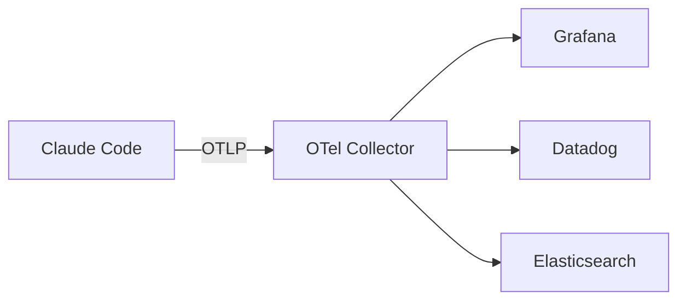

# 企业管理

个人开发者用 Claude Code，就像独自开车——想怎么开就怎么开。但在企业里，情况完全不同：你是车队管理员，需要统一设定车速上限、指定加油站、记录每辆车的行驶轨迹，还得确保油桶不会泄露。Claude Code 的企业级管理功能，就是为"车队"准备的——从集中管控策略、统一认证、用量审计，到安全合规，形成了一套完整的企业治理体系。

**本文你会学到**：
- 两种托管设置（Server-managed 和 Endpoint-managed）的区别与配置方式
- 企业环境中可用的认证方式与选型思路
- OpenTelemetry 监控体系与分析仪表盘的使用方法
- Claude Code 的安全架构——权限模型、沙箱、注入防御
- 零数据保留（ZDR）策略如何满足最严格的合规要求
- GitHub Enterprise Server 集成的配置与限制

## 🏢 托管设置（Managed Settings）

企业里有几十甚至几百个开发者使用 Claude Code，总不能挨个去改配置。托管设置就是用来解决"统一管控"问题的——管理员在一个地方配置策略，所有开发者的 Claude Code 自动生效。现已支持 `managed-settings.d/` 目录，可将策略拆分为多个文件便于 MDM 管理（v2.1.83 新增）。

打个比方：托管设置就像公司的门禁系统。你不需要给每个人单独发钥匙（本地配置），而是在总控室统一设定谁能进哪扇门（托管设置），员工刷卡时自动匹配权限。

### Server-managed Settings：云端统一策略

Server-managed Settings 由 Anthropic 服务器在用户认证时自动下发，是**最常用**的托管方式。管理员在 Claude 组织后台配置，开发者完全无感。

核心工作流：

1. 管理员在 Claude 组织设置中编写 JSON 策略
2. 开发者通过 `claude auth login`（OAuth）登录
3. Anthropic 服务器在认证响应中下发策略
4. Claude Code 自动应用策略，开发者无法覆盖

??? tip "开发者能绕过吗？"
    不能。Server-managed Settings 的优先级**高于**用户本地配置和项目级 `CLAUDE.md`。开发者无法通过修改本地文件来绕过组织策略。不过部分设置标注为 `userOverridable`，这类设置允许开发者根据自己的需求微调。

### Endpoint-managed Settings：终端设备策略

Endpoint-managed Settings 适合对安全控制有更严格要求的环境，通过**设备管理工具（MDM）** 将策略直接部署到开发者机器上，不经过 Anthropic 服务器。

| 平台 | 策略部署方式 |
|------|------------|
| macOS | 托管偏好设置（Managed Preferences） |
| Windows | 注册表（Registry） |

⚠️ 注意：Endpoint-managed Settings 会**覆盖** Server-managed Settings 中同名的配置项。如果一个设置在两种来源中都有定义，Endpoint 版本胜出。

### 常用策略配置示例

以下是一些典型的企业策略场景：

```json
{
  "allowedTools": ["Read", "Edit", "Bash", "Glob"],
  "disallowedTools": ["Write"],
  "maxTurns": 50,
  "contextWindow": "128k"
}
```

💡 这段策略做了三件事：白名单限制可用工具、禁止直接写入新文件、限制单次对话轮数。企业可以根据自身安全要求灵活组合。

### 策略优先级

当同一设置在多个来源中都有定义时，Claude Code 按以下优先级决定最终值：

| 优先级 | 来源 | 说明 |
|--------|------|------|
| 1（最高） | Endpoint-managed | 通过 MDM 部署到设备 |
| 2 | Server-managed | 从 Anthropic 服务器认证时下发 |
| 3 | 项目级 `CLAUDE.md` | 项目根目录的指令文件 |
| 4（最低） | 用户级 `~/.claude/CLAUDE.md` | 用户个人全局配置 |

## 🔐 认证方式

企业使用 Claude Code 的第一步，是让开发者能安全、合规地登录。Claude Code 支持多种认证方式，不同方式的安全等级和使用体验各异。

### OAuth 认证（推荐企业使用）

OAuth 是企业环境下的推荐方式，类似你用"微信登录"第三方应用——开发者跳转到 Anthropic 的登录页面，输入企业账号密码，授权后 Claude Code 自动获取访问令牌。

```bash
# 启动 OAuth 登录流程
claude auth login
```

优势：令牌自动刷新、支持 MFA（多因素认证）、管理员可集中管理团队成员的访问权限。

### API Key

API Key 适合自动化场景或 CI/CD 流水线。开发者从 Anthropic Console 生成一个密钥，直接配置给 Claude Code。

```bash
# 设置 API Key
export ANTHROPIC_API_KEY=sk-ant-xxxxx
```

⚠️ 注意：API Key 是长期凭证，**不要提交到版本库**。生产环境中建议通过密钥管理服务注入，而非硬编码在脚本中。

### 云服务商认证

对于已在 AWS、GCP 等云平台上使用 Claude 模型的企业，可以通过云服务商的认证体系直接使用 Claude Code：

| 云服务商 | 认证方式 | 适用场景 |
|---------|---------|---------|
| Amazon Bedrock | AWS IAM 凭证 | AWS 原生企业 |
| Google Vertex AI | Google Cloud 凭证 | GCP 原生企业 |
| Anthropic Foundry | Foundry OAuth | 需要定制模型部署 |

### apiKeyHelper：凭证自动化获取

`apiKeyHelper` 是一个灵活的认证机制，让 Claude Code 从**外部命令**动态获取 API Key，而不是将密钥静态配置在环境变量中。

```json
{
  "apiKeyHelper": "aws secretsmanager get-secret-value --secret-id claude-api-key --query SecretString --output text"
}
```

💡 这就好比把钥匙放在保险柜里，每次需要时用指纹解锁取出，而不是把钥匙直接挂在门口。密钥轮换时只需更新保险柜里的内容，所有使用方自动生效。

## 📊 使用监控

企业需要回答两个关键问题：团队花了多少钱？谁在用、用了多少？Claude Code 通过 OpenTelemetry 协议提供了可观测性能力。

### OpenTelemetry 集成（Beta）

OpenTelemetry（简称 OTel）是云原生领域的标准可观测性框架。Claude Code 支持导出三类遥测数据：

| 数据类型 | 说明 | 示例 |
|---------|------|------|
| Metrics（指标） | 可聚合的数值度量 | Token 消耗量、请求数、延迟 |
| Events/Logs（事件日志） | 离散的事件记录 | 工具调用、错误发生、会话开始 |
| Traces（分布式追踪） | 请求的完整链路 | 一次对话从发起到完成的全过程 |

通过环境变量配置 OTel 导出目标：

```bash
# 指定 OTel 导出端点
export OTEL_EXPORTER_OTLP_ENDPOINT="http://otel-collector:4318"

# 启用所有遥测类型
export OTEL_EXPORTER_OTLP_PROTOCOL="http/protobuf"
export CLAUDE_CODE_USE_BETAS="otel"
```

💡 OTel 的好处在于**标准化**。企业已有的 Grafana、Datadog、Jaeger 等监控工具都能直接消费这些数据，无需为 Claude Code 搭建专用监控系统。

### OTel Collector 架构

实际部署中，通常不会让 Claude Code 直接将数据发送给最终存储后端，而是在中间放一个 OTel Collector 做中转：



??? tip "为什么需要 Collector？"
    Collector 可以做数据过滤、采样、格式转换，避免把原始数据直接灌入后端。比如你只想保留每天的 Token 汇总，不想逐条记录每次工具调用，就可以在 Collector 层做聚合。

## 📋 分析与审计

除了底层的 OTel 遥测，Claude Code 还提供了更直观的分析能力，帮助企业管理者从宏观角度了解团队使用情况。

### 使用指标（Usage Metrics）

使用指标仪表盘回答"整体用了多少"的问题。企业管理者可以在 Claude 后台查看：

- 团队 Token 消耗趋势
- 按项目/团队/个人的使用分布
- 高频使用的工具和功能
- 成本趋势与预算对比

### 贡献指标（Contribution Metrics）

贡献指标回答"AI 辅助到底产出了多少"的问题，与 GitHub PR 紧密关联。当 Claude Code 辅助开发者提交代码时，系统会自动标记这些贡献。

| 指标 | 说明 |
|------|------|
| PR 数量 | Claude Code 参与的 PR 数 |
| 代码行数 | Claude Code 生成/修改的代码行 |
| 审查通过率 | AI 辅助代码的审查结果 |
| 团队排名 | 基于贡献量的排行榜 |

这些指标通过 GitHub Webhook 传送到分析仪表盘，让管理者能够量化 AI 辅助开发带来的实际产出。

## 🛡️ 安全架构

Claude Code 的安全设计遵循一个核心原则：**最小权限（Least Privilege）**。简单说就是：默认什么权限都不给，需要什么再明确授予。

### 权限模型

Claude Code 在执行任何操作前，都需要获得用户的明确授权。权限通过工具级别进行控制：

- **文件读取（Read）**：默认允许
- **文件编辑（Edit/Write）**：需要用户确认
- **命令执行（Bash）**：需要用户确认，管理员可进一步限制
- **网络访问**：受网络策略管控

💡 这种"默认只读"的设计很像数据库的 `SELECT` 权限——查询数据是安全的，但修改数据需要额外授权。

### 沙箱机制

沙箱（Sandbox）为 Claude Code 的命令执行提供了一个隔离环境，防止意外或恶意的操作影响宿主系统。后台 agent 还支持 worktree 隔离——在独立的 git worktree 中执行操作，结合 `disableAllHooks` 策略确保后台 agent 无法绕过安全限制（v2.1.49 新增）。

沙箱的限制包括：

| 限制维度 | 具体约束 |
|---------|---------|
| 文件系统 | 只能访问工作目录内的文件 |
| 网络 | 限制出站网络连接 |
| 进程 | 限制可执行的命令 |
| 资源 | 限制 CPU 和内存使用 |

??? note "沙箱 vs Docker"
    沙箱是轻量级的进程级隔离，不依赖容器运行时。如果你需要更强的隔离，可以将 Claude Code 运行在 Docker 容器中，沙箱 + 容器形成双层防护。

### Prompt 注入防御

Prompt 注入是 LLM 应用面临的核心安全威胁之一——攻击者试图通过精心构造的输入，让模型执行非预期的操作。Claude Code 在多个层面进行了防御：

1. **指令边界保护**：系统提示与用户输入之间有明确的分隔，减少用户输入"污染"系统指令的可能
2. **工具调用验证**：每次工具调用都需要用户确认，即使模型被注入也无法自动执行敏感操作
3. **权限分层**：只读操作自动通过，写操作必须审批，减少注入攻击的攻击面

⚠️ 注意：没有任何防御是 100% 完美的。Prompt 注入防御是一个持续演进的领域，企业应结合代码审查、输出验证等手段形成纵深防御体系。

## ⚖️ 法律与合规

企业使用 AI 工具时，法务和合规团队最关心的问题是：**我们的代码会被拿去训练 AI 吗？数据会泄露吗？**

### 数据使用政策（Data Usage Policy）

Claude Code 在不同订阅层级下有不同的数据使用政策：

| 数据类型 | 个人/团队版 | 企业版 |
|---------|-----------|-------|
| API 输入/输出 | **可能**用于模型改进 | **不用于**模型改进 |
| 对话内容 | 默认存储 30 天 | 可配置存储策略 |
| 遥测数据 | 收集基础使用数据 | 可通过 OTel 自建监控 |
| 崩溃报告 | 发送到 Sentry | 可禁用 |

💡 关键区别在于**训练数据使用**。企业版的 API 请求不会被用于模型训练，这意味着你的代码不会被 Anthropic 的模型"记住"。

### 遥测服务

Claude Code 默认会收集两类遥测数据：

| 服务 | 收集内容 | 用途 |
|------|---------|------|
| Statsig | 功能开关（Feature Flags）、使用统计 | 判断哪些功能被广泛使用 |
| Sentry | 崩溃报告、异常堆栈 | 修复 Bug 和改进稳定性 |

企业环境可以通过 Endpoint-managed Settings 禁用这些遥测服务，但建议保留崩溃报告以帮助 Anthropic 改进产品稳定性。

## 🗑️ 零数据保留（Zero Data Retention）

零数据保留（ZDR）是 Anthropic 面向企业客户提供的最高级别数据安全承诺，属于**仅限企业版（Enterprise）**的功能。

### ZDR 解决什么问题？

默认情况下，Anthropic 会将 API 请求和响应保留一段时间（通常 30 天），用于滥用监控和服务质量改进。对于处理高度敏感数据的企业（如金融、医疗、政府），这个保留策略可能不满足合规要求。

ZDR 的核心承诺是：**推理请求和响应在处理完成后立即删除，不保留在任何存储系统中。**

打个比方：普通模式就像银行会把你的交易记录存 30 天用于审计，而 ZDR 模式就像银行处理完交易后立刻销毁记录——交易本身正常完成，但"记录不留痕"。

### ZDR 的范围与限制

⚠️ 理解 ZDR 的范围非常重要——它只覆盖**推理过程**，不是"什么都不记录"。

| 覆盖范围 | 说明 |
|---------|------|
| ✅ API 请求/响应 | 推理的输入和输出不保留 |
| ❌ 账户信息 | 用户身份、组织信息仍保留 |
| ❌ 计费数据 | Token 使用量仍记录用于计费 |
| ❌ 日志 | 服务端日志中可能残留元数据（不含请求内容） |

### ZDR 对功能的影响

启用 ZDR 后，以下功能会被禁用或受限：

| 功能 | 影响 |
|------|------|
| 对话历史 | 无法在 Anthropic 后台回溯历史对话 |
| 滥用监控 | 无法利用历史数据检测滥用行为 |
| 某些分析功能 | 依赖对话记录的分析会受影响 |

💡 如果你的企业不需要处理极高敏感度的数据，普通的企业版数据策略可能已经足够。ZDR 的主要适用场景是受到 HIPAA、GDPR 等法规严格约束的行业。

## 🏗️ GitHub Enterprise Server 集成

很多企业的代码不是托管在 github.com 上，而是运行在自建的 GitHub Enterprise Server（GHES）实例中。Claude Code 支持与 GHES 集成，让企业可以在自托管环境中使用完整的 Claude Code 功能。

### 支持的功能一览

| 功能 | GHES 支持情况 | 说明 |
|------|-------------|------|
| Web 会话（`claude --remote`） | ✅ 支持 | 管理员连接一次，开发者直接使用 |
| 自动代码审查（Code Review） | ✅ 支持 | 与 github.com 行为一致 |
| Teleport 会话转移 | ✅ 支持 | 在 Web 和终端之间切换 |
| 插件市场 | ✅ 支持 | 需使用完整 git URL |
| 贡献指标 | ✅ 支持 | 通过 Webhook 传递 |
| GitHub Actions | ✅ 支持 | 需手动配置 Workflow |
| GitHub MCP Server | ❌ 不支持 | 需改用 `gh` CLI 替代 |

### 管理员配置流程

GHES 集成由管理员一次性配置完成，开发者无需做任何额外设置。

核心步骤：

1. 在 Claude 组织后台启动引导设置
2. 系统生成 GitHub App Manifest
3. 在 GHES 上创建对应的 GitHub App（授予必要权限）
4. 配置 Webhook 以接收事件通知

GitHub App 需要的权限：

| 权限 | 级别 | 用途 |
|------|------|------|
| Contents | 读写 | 克隆仓库、推送分支 |
| Pull requests | 读写 | 创建 PR、发布审查评论 |
| Issues | 读写 | 响应 Issue 提及 |
| Checks | 读写 | 发布 Code Review 状态检查 |
| Actions | 只读 | 读取 CI 状态 |
| Metadata | 只读 | GitHub 基础要求 |

### 网络要求

⚠️ GHES 实例必须能从 Anthropic 基础设施访问。如果你的 GHES 部署在防火墙后面，需要将 Anthropic API 的 IP 地址加入白名单。

### 开发者工作流

管理员配置完成后，开发者的使用体验与 github.com 完全一致。Claude Code 会自动从当前工作目录的 `git remote` 中检测 GHES 主机名：

```bash
# 克隆 GHES 仓库（正常操作）
git clone https://github.example.com/my-org/my-project.git
cd my-project

# 启动 Web 会话（Claude 自动检测 GHES 并路由）
claude --remote "为支付回调添加重试逻辑"
```

### 插件市场在 GHES 上的差异

GHES 上的插件市场与 github.com 的结构完全相同，唯一的区别是引用方式。因为 `owner/repo` 短格式默认解析到 github.com，GHES 必须使用完整 git URL：

```bash
# ❌ github.com 短格式（不会解析到 GHES）
/plugin marketplace add my-org/claude-plugins

# ✅ 使用完整 git URL
/plugin marketplace add https://github.example.com/my-org/claude-plugins.git
```

如果企业通过托管设置限制了可用的插件市场来源，管理员可以用 `hostPattern` 批量放行整个 GHES 主机名下的所有市场：

```json
{
  "strictKnownMarketplaces": [
    {
      "source": "hostPattern",
      "hostPattern": "^github\\.example\\.com$"
    }
  ]
}
```

📝 **小结**：Claude Code 的企业管理体系围绕"集中管控 + 最小权限 + 透明可审计"三个原则构建。托管设置统一策略下发，认证方式灵活适配企业基础设施，OTel 监控与分析仪表盘让用量透明可量化，安全架构从权限、沙箱、注入防御三层构筑防线，而 ZDR 和企业版数据策略则为合规要求最严格的场景提供了保障。
