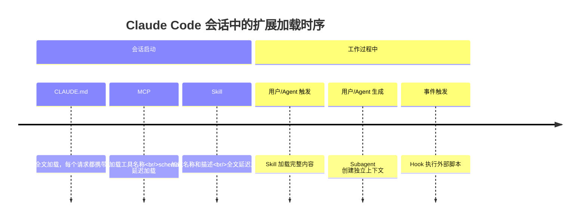

# 扩展体系

**本文你会学到**：

- 🎯 为什么 Claude Code 出厂就够用，但你的项目需要扩展
- 💡 六大扩展机制各自解决什么问题，一张表看清全局
- 🔧 什么时候该用 Skill、什么时候该用 Subagent、什么时候该用 MCP
- ⚠️ 每种扩展会消耗多少上下文，如何避免「塞太多导致变笨」
- 🧩 扩展之间如何组合搭配，发挥 1+1>2 的效果
- 📌 多层级覆盖规则：全局、项目、插件之间谁优先

## ⚙️ 为什么要扩展 Claude Code

Claude Code 出厂就自带一套完整的工具箱：读写文件、搜索代码、执行命令、访问网页——覆盖了大多数日常编码任务。

但「够用」和「好用」之间隔着一段距离。打个比方：

> 想象你招了一个能力很强的实习生（Claude）。他自带笔记本电脑、会写代码、会查资料。但你还需要做几件事才能让他真正融入团队：
> - 给他一份**员工手册**（`CLAUDE.md`），告诉他项目规范和禁忌
> - 给他配备**专业工具**（`MCP`），让他能连数据库、发 Slack 消息
> - 教他一些**标准操作流程**（`Skills`），比如「部署上线前要跑这几步检查」
> - 安排一个**独立工位**（`Subagent`），让他做调研时不打扰你的主对话
> - 设置一些**自动化触发器**（`Hooks`），每次改完代码自动跑 lint

扩展机制的本质，就是**把你的项目知识、团队流程和外部工具注入到 Claude 的工作流中**，让「通用助手」变成「你的专属助手」。

💡 **新手上路建议**：先从 `CLAUDE.md` 开始——把项目规范写进去，立竿见影。等需求明确了，再按需添加其他扩展。

## 🗂️ 六大扩展机制

下面这张表是本文的核心。每个扩展机制用一句话 + 一个类比帮你快速建立直觉。

| 机制 | 一句话说明 | 类比 | 适用场景 | 示例 |
|------|-----------|------|---------|------|
| `CLAUDE.md` | 每次对话都会看到的持久上下文 | 员工手册 | 项目规范、「始终这样做」的硬规则 | 「用 pnpm 不用 npm，提交前跑测试」 |
| `Skill` | 可复用的知识库和工作流，支持按需触发 | 标准操作流程（SOP）文档 | 参考资料清单、可触发的自动化工作流 | `/deploy` 执行你的部署清单；API 文档 Skill |
| `MCP` | 把 Claude 连接到外部服务的协议 | 给实习生发专业工具（数据库客户端、Slack 客户端） | 需要访问外部数据或执行外部操作 | 查数据库、发 Slack、控制浏览器 |
| `Subagent` | 在独立上下文中执行任务，只返回摘要 | 独立工位上的调研员 | 需要上下文隔离、读大量文件、并行任务 | 调研任务读完 50 个文件，只返回关键发现 |
| `Agent Team` | 多个独立 Claude 会话互相协作 | 一个项目组，组员之间可以互相讨论 | 需要多人并行、互相挑战假设 | 同时启动安全审查、性能测试、功能开发 |
| `Hook` | 在特定事件触发时运行的确定性脚本 | 自动化流水线的触发器 | 不需要 AI 判断、必须精确执行的自动化操作 | 每次编辑文件后自动跑 ESLint |
| `Channel` | 将外部事件推送到运行中的会话 | 实习员的手机响了，外部消息主动到达 | 聊天桥接、webhook 接收、远程交互 | 通过 Telegram 接收 CI 构建结果并回复 |

此外还有一个**打包层**：

- `Plugin`（插件）：把 Skills、Hooks、Subagents、MCP Server 打包成一个可安装单元。插件中的 Skill 带命名空间（如 `/my-plugin:review`），多个插件可以共存。适合跨仓库复用或通过 marketplace 分享给其他人。
- `Channel`（通道）：一种特殊的 MCP 服务器，将外部事件（消息、webhook、告警）**推送**到正在运行的会话中。Channel 以插件形式安装，通过 `--channels` 标志启用。详见 [Channel 专题](../channels/index.md)。

## 🔍 什么时候用什么

这是最容易混淆的部分。很多机制看起来功能有重叠，但其实它们解决的是**不同层面**的问题。

### 一句话概念边界

在深入对比之前，先用一句话记住每个机制的职责：

| 机制 | 一句话定位 | 关键词 |
|------|-----------|--------|
| **Tool / MCP** | 给 Claude 新的**动作能力** | "能做什么" |
| **Skill** | 给 Claude 一套**工作方法** | "怎么做" |
| **Subagent** | 提供**隔离的执行环境** | "在哪做" |
| **Hook** | **强制约束和审计** | "必须/不能做" |
| **Plugin** | **跨项目分发**扩展包 | "分享给谁" |
| **Channel** | **外部事件推送**到运行中的会话 | "外部发生了什么" |

💡 判断用哪个机制，先问自己：「我缺的是能力、方法、环境、约束、分发还是外部感知？」

### 类比：各扩展机制的分工

继续用「实习生」的类比来区分它们：

| 场景 | 用什么 | 为什么 |
|------|--------|--------|
| 「这个项目永远用 Tab 缩进」 | `CLAUDE.md` | 这是每次都要遵守的规则，需要始终在场 |
| 「部署前按这个清单检查」 | `Skill`（`/deploy`） | 这是一套流程，只在需要部署时才触发 |
| 「帮我查一下生产数据库的数据」 | `MCP` | 需要连接外部系统，这超出了内置工具的能力 |
| 「调研一下这个模块的历史演进」 | `Subagent` | 要读大量文件，但主对话只需要结论 |
| 「三个人分别审查安全、性能、测试」 | `Agent Team` | 多个独立任务需要并行且互相协作 |
| 「每次保存文件自动格式化」 | `Hook` | 这是确定性操作，不需要 AI 思考 |
| 「CI 失败了通知 Claude 处理」 | `Channel` | 外部事件推送到已运行的会话，Claude 不需要你主动触发 |

### Skill vs Subagent

这两个最容易被搞混，因为它们都能帮 Claude「做事」。但核心区别在于**它们运行在哪里**：

| 维度 | Skill | Subagent |
|------|-------|----------|
| **本质** | 可复用的知识/指令/工作流 | 独立的执行上下文 |
| **关键优势** | 跨上下文共享内容 | 上下文隔离，工作完成后只返回摘要 |
| **最适合** | 参考资料、可触发的工作流 | 读大量文件、并行任务、专业化的工作者 |

💡 更直观的理解：

- `Skill` 是一份**文档**——你可以拿给任何同事看，任何场景都能用
- `Subagent` 是一个**人**——他有自己的工作台，做完活给你汇报结果

⚠️ 它们可以组合使用：Subagent 可以预加载特定的 Skill（通过 `skills:` 字段），Skill 也可以在独立上下文中运行（通过 `context: fork`）。

### CLAUDE.md vs Skill

两者都存储指令，但加载方式和目的完全不同：

| 维度 | `CLAUDE.md` | `Skill` |
|------|------------|---------|
| **加载时机** | 每次会话自动加载 | 按需加载（你手动触发或 Claude 自动匹配） |
| **能否引入文件** | ✅ 支持 `@path` 导入 | ✅ 支持 `@path` 导入 |
| **能否触发工作流** | ❌ 不能 | ✅ 通过 `/<name>` 触发 |
| **最适合** | 「始终这样做」的规则 | 参考资料、可触发的工作流 |

📌 **经验法则**：把 `CLAUDE.md` 控制在 200 行以内。内容膨胀时，把参考资料迁移到 Skill，或者拆分到 `.claude/rules/` 目录中。

举几个具体例子：

- ✅ 放 `CLAUDE.md`：「用 pnpm 不用 npm」「提交前必须跑测试」「项目结构是 monorepo，子模块在 packages/ 下」
- ✅ 放 `Skill`：完整的 API 风格指南（几十页）、部署操作手册、`/deploy` 部署工作流、`/review` 代码审查清单

### CLAUDE.md vs Rules vs Skill

三者都存指令，但加载粒度不同：

| 维度 | `CLAUDE.md` | `.claude/rules/` | `Skill` |
|------|------------|-------------------|---------|
| **加载时机** | 每次会话 | 每次会话，或仅当匹配文件被打开时 | 按需（触发或匹配时） |
| **作用范围** | 整个项目 | 可限定到文件路径 | 特定任务 |
| **最适合** | 核心规范和构建命令 | 特定语言或目录的规范 | 参考资料、可重复的工作流 |

→ `CLAUDE.md` 放全局规则，`.claude/rules/` 放条件规则（只在操作特定文件时生效），`Skill` 放按需使用的内容。

### Sub-agent vs Agent Team

两者都能并行工作，但架构完全不同：

| 维度 | `Subagent` | `Agent Team` |
|------|-----------|-------------|
| **上下文** | 有自己的上下文窗口，结果返回给调用者 | 有自己的上下文窗口，完全独立 |
| **通信** | 只向主 agent 汇报 | 组员之间可以直接互相发消息 |
| **协调** | 主 agent 管理所有工作 | 共享任务列表，自我协调 |
| **最适合** | 只需要结果的聚焦任务 | 需要讨论和协作的复杂工作 |
| **Token 开销** | 较低（结果摘要回传） | 较高（每个队友是独立的 Claude 实例） |

📌 **过渡点**：如果你发现并行 Subagent 频繁碰到上下文限制，或者多个 Subagent 之间需要互相通信，就该升级到 Agent Team 了。

### MCP vs Skill

这两个是互补关系，不是替代关系：

| 维度 | `MCP` | `Skill` |
|------|-------|---------|
| **是什么** | 连接外部服务的协议 | 知识、工作流和参考资料 |
| **提供什么** | 工具和数据访问能力 | 使用知识、工作流程、参考材料 |
| **示例** | Slack 集成、数据库查询、浏览器控制 | 代码审查清单、部署工作流、API 风格指南 |

💡 它们配合使用的典型模式：

- `MCP` 给 Claude 装上「手」——让它能操作外部系统。没有 MCP，Claude 没法查你的数据库、没法发 Slack
- `Skill` 给 Claude 装上「脑」——让它知道怎么用好这些工具。比如你的数据库表结构、常用查询模式、Slack 消息格式规范

→ MCP 提供**能力**，Skill 提供**知识**。能力 + 知识 = 高效执行。

## 📊 扩展的上下文成本

每个扩展都会占用 Claude 的上下文窗口。上下文就像一张办公桌——桌上的东西越多，找东西越慢，能放下的新东西越少。

| 机制 | 加载时机 | 加载什么 | 上下文成本 |
|------|---------|---------|-----------|
| `CLAUDE.md` | 会话启动 | 全部内容 | **每次请求都消耗** |
| `Skill` | 会话启动 + 使用时 | 启动时加载描述，使用时加载全文 | **低**（描述在每次请求中） |
| `MCP Server` | 会话启动 | 工具名称；完整 schema 在使用时才加载 | **低**（使用前几乎为零） |
| `Subagent` | 生成时 | 独立上下文 + 指定的 Skill | **与主会话隔离** |
| `Hook` | 事件触发时 | 什么都不加载（外部脚本运行） | **零**（除非返回内容注入对话） |
| `Channel` | 外部事件到达时 | 事件内容作为消息注入会话 | **按事件消耗**（每个事件占用上下文） |

⚠️ 注意：`Skill` 默认会在会话启动时加载描述（让 Claude 能判断何时使用）。如果你只想手动触发某个 Skill（不希望 Claude 自动使用），可以在 Skill 的 front matter 中设置 `disable-model-invocation: true`，这样上下文成本降为零。

### 各机制加载时机详解

- **`CLAUDE.md`**：会话启动时加载所有层级的 `CLAUDE.md`（托管策略、用户级、项目级），从工作目录向上遍历到根目录，子目录中的 `CLAUDE.md` 在访问该目录时加载
- **`Skill`**：默认会话启动时加载描述供 Claude 匹配。被 `/<name>` 调用或 Claude 自动匹配后才加载全文。在 Subagent 中表现不同——指定给 Subagent 的 Skill 会在启动时完整预加载
- **`MCP Server`**：启动时只加载工具名。Claude 真正需要某个工具时才加载其完整 JSON schema。⚠️ MCP 连接可能中途静默断开，如果 Claude 用不了某个之前能用的 MCP 工具，用 `/mcp` 检查连接状态
- **`Subagent`**：生成时创建全新上下文，包含系统提示、指定 Skill、`CLAUDE.md` 和 git 状态。不继承主会话的对话历史
- **`Hook`**：在特定生命周期事件（工具执行、会话边界、提交 prompt、权限请求等）时作为外部脚本运行，默认不消耗上下文

## 🧩 组合使用模式

实际使用中，很少只用一种扩展。不同扩展各有所长，组合使用才能发挥最大效果。

### Skill + MCP

**模式**：MCP 提供连接能力，Skill 提供使用知识。

**典型场景**：你有一个数据库 MCP Server 让 Claude 能查询数据库，再写一个 Skill 教 Claude 你的数据模型、常用查询模式和表结构。

效果：Claude 不仅「能」查数据库，还「知道怎么查得好」。

### Skill + Subagent

**模式**：一个 Skill 作为入口，调度多个 Subagent 并行工作。

**典型场景**：`/audit` 审计 Skill，内部同时启动安全审查、性能分析、代码风格检查三个 Subagent，各自在隔离上下文中执行，最后汇总结果。

效果：并行执行 + 上下文隔离 + 统一入口。

### CLAUDE.md + Skills

**模式**：`CLAUDE.md` 存放精简的「始终遵守」规则，Skills 存放详细的参考资料。

**典型场景**：`CLAUDE.md` 写「遵循我们的 API 规范」，`api-style-guide` Skill 存放完整的 API 设计规范文档（几十页）。

效果：`CLAUDE.md` 保持精简（<200 行），Claude 只在需要时才加载详细规范，节省上下文。

### Hook + MCP

**模式**：Hook 在特定事件时通过 MCP 触发外部操作。

**典型场景**：设置一个 Post-edit Hook，当 Claude 修改了关键文件后，自动通过 MCP 发一条 Slack 通知到团队频道。

效果：确定性触发 + 外部集成 = 自动化通知。

## 📐 扩展的层级覆盖规则

当同一个扩展在多个层级同时存在时，谁说了算？这取决于扩展的类型。

### 覆盖策略对比

| 机制 | 策略 | 说明 |
|------|------|------|
| `CLAUDE.md` | **累加** | 所有层级的内容同时生效，更具体的指令通常优先 |
| `Skill` / `Subagent` | **按名覆盖** | 托管 > 用户 > 项目（Skill）；托管 > CLI 参数 > 项目 > 用户 > 插件（Subagent） |
| `MCP Server` | **按名覆盖** | 本地 > 项目 > 用户 |
| `Hook` | **合并** | 所有来源的 Hook 都会触发，不会互相覆盖 |

### CLAUDE.md 的累加载荷

`CLAUDE.md` 是累加式的——用户级、项目级、子目录级的 `CLAUDE.md` **全部同时生效**。这意味着：

- ✅ 好处：你可以在用户级 `CLAUDE.md` 放全局偏好（如语言风格），项目级放项目规范，互不冲突
- ⚠️ 风险：如果多个 `CLAUDE.md` 之间有矛盾指令，Claude 需要自己判断，可能产生不确定行为。指令冲突时，更具体的通常优先（比如子目录的规则覆盖父目录的），但不保证 100% 可预测

📌 **最佳实践**：用户级 `CLAUDE.md` 放跨项目的通用偏好，项目级 `CLAUDE.md` 放项目专属规范，保持各层级职责清晰，避免矛盾。

### Skill 的命名空间隔离

Plugin 安装的 Skill 自带命名空间（如 `/my-plugin:review`），不会和你自己的 `/review` Skill 冲突。这是唯一自带命名冲突保护的机制。

📝 **小结**：扩展体系的本质是**在正确的时机，用正确的方式，把正确的知识交给 Claude**。`CLAUDE.md` 管始终在场的规则，`Skill` 管按需加载的知识和工作流，`MCP` 管外部连接能力，`Subagent` 管隔离执行，`Hook` 管确定性自动化，`Plugin` 管打包分发。理解它们的分工和组合方式，你就能为项目量身定制一套高效的 Claude Code 工作流。
