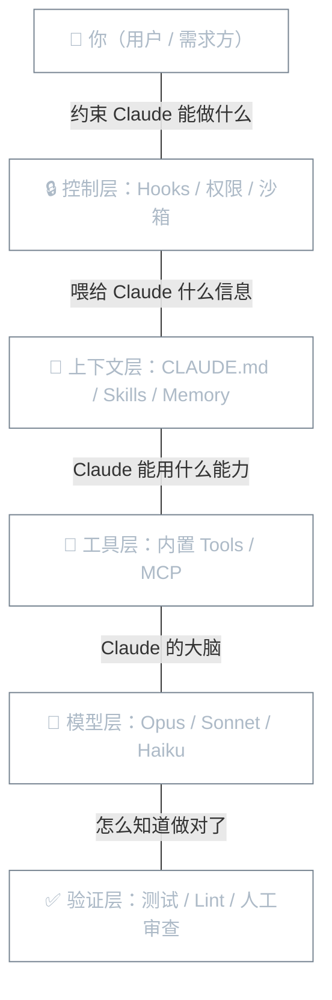

**本文你会学到**：

- 🎯 Claude Code 的 Agentic Loop（代理循环）是什么，为什么它是整个系统的核心
- 🧠 上下文窗口的构成与管理策略，包括自动压缩机制
- 🔧 Claude Code 内置工具的分类与用途
- 📌 检查点（Checkpoint）机制如何保护你的代码不被改坏

## ⚙️ Agentic Loop：Claude Code 的核心循环

### 它是怎么工作的（用类比解释）

想象一个**项目经理和开发团队的协作场景**：

1. 你（需求方）告诉项目经理："修复结账流程中过期信用卡的 bug"
2. 项目经理先**了解情况** — 打开相关文件、查看代码逻辑
3. 项目经理再**动手修改** — 编辑源代码
4. 项目经理最后**验证结果** — 跑测试确认修复成功
5. 如果测试没过，回到第 2 步，换一种方式再试

Claude Code 的工作方式几乎一模一样。这个「了解 -> 动手 -> 验证 -> 循环」的过程，官方叫做 **Agentic Loop**（代理循环）。


具体来说，三个阶段各有分工：

| 阶段 | 类比 | Claude 实际做的事 |
|------|------|-------------------|
| **收集上下文** | 项目经理先看需求文档 | 搜索文件、读取代码、查看 git 历史 |
| **执行操作** | 开发人员写代码 | 编辑文件、创建新文件、运行命令 |
| **验证结果** | 测试人员验证功能 | 运行测试、检查编译、确认修复效果 |

这三个阶段不是严格线性推进的。Claude 会根据上一步的结果**动态决定下一步做什么** — 这就是"代理"（Agentic）的含义：它不是机械地执行预设步骤，而是像人一样根据实际情况调整策略。

### 驱动循环的两大组件

Agentic Loop 的运转依赖两个核心组件：

- **模型（Model）**：负责"思考"。Claude 阅读代码、理解逻辑、决定下一步操作，这些都是模型在推理。Claude Code 支持多种模型，Sonnet 适合大多数编码任务，Opus 更擅长复杂架构决策。会话中可以用 `/model` 切换（v2.1.108 起，中途切换模型会发出警告，因为下一条响应会以未缓存方式重新读取完整历史）
- **工具（Tools）**：负责"行动"。没有工具，Claude 只能输出文字；有了工具，Claude 才能真正操作你的项目 — 读文件、改代码、跑命令

Claude Code 本身就是套在 Claude 模型外面的**"代理线束"（Agentic Harness）**：它提供工具集、上下文管理和执行环境，把一个语言模型变成一个能真正干活的编码代理。

此外，Claude Code 引入了 **Plan 子代理**（v2.0.28 新增），在执行复杂任务前先进入规划阶段。你可以通过 `/plan` 命令（v2.1.0 新增）手动触发规划模式，让 Claude 先制定方案再动手，适合需要多步骤协调的大型重构。Plan 文件现在会根据 prompt 内容自动命名（如 `fix-auth-race-snug-otter.md`），而非使用纯随机词，方便回溯时快速识别（v2.1.111 改进）。

### 为什么理解这个循环很重要

理解 Agentic Loop 能帮你更高效地使用 Claude Code：

- **循环次数取决于你的描述精度** — 描述越精确，Claude 需要的探索和纠错循环越少。一个模糊的"修一下 bug"可能需要 5-6 轮循环；而精确的"结账流程过期卡支付失败，相关代码在 `src/payments/`，重点关注 token 刷新逻辑"，可能一轮就搞定
- **你可以随时介入** — 你是循环的一部分。如果 Claude 走偏了，直接输入纠正信息并回车，Claude 会立即调整方向，不需要等它执行完
- **不同任务，循环侧重不同** — 一个代码问答可能只需要收集上下文；一个重构任务可能侧重验证；一个 bug 修复会反复经历完整的三阶段循环

💡 换句话说：把 Claude Code 当一个**能力很强但需要明确方向的新同事**，而不是一个必须精确编程的机器。给它方向和上下文，让它自己决定怎么做。

### 六层治理框架

只强化 Agentic Loop 中的一层，系统就会失衡。把 Claude Code 拆成六层来看会更清楚：



⚠️ **失衡的典型症状**：

| 失衡表现 | 根因 | 解决方向 |
|---------|------|---------|
| CLAUDE.md 写太长 | 上下文层过重，先污染自己 | 精简 CLAUDE.md，拆到 Skills/rules |
| 工具堆太多，选择搞不清楚 | 工具层过重 | 精简 MCP Server，用白名单限制 |
| Subagent 开得到处都是 | 上下文层分散，状态漂移 | 只在真正需要隔离时使用 |
| 自动化失控 | 控制层缺失 | 添加 Hooks 和权限约束 |
| 改了但不知道对不对 | 验证层缺失 | 定义验证标准和 Done 条件 |

💡 对着这六层排查问题，很多看起来玄乎的现象就好定位了：结果不稳定 → 查上下文加载顺序；自动化失控 → 查控制层有没有设计；长会话质量下降 → 中间产物污染了上下文。

## 🧠 上下文窗口

### 什么是上下文窗口（类比：工作记忆）

想象一下你在办公桌前工作。桌上摊开的文件就是你的**工作记忆** — 你能同时看到多少文件，决定了你的工作效率。

Claude 的"办公桌"就是 **上下文窗口（Context Window）**。它是一个有限大小的信息容器，容纳了 Claude 在当前会话中"看到"的所有内容。一旦桌子满了，旧文件就得收起来。

上下文窗口的内容**远不止你看到的对话**，还包括很多在终端中不会显示的东西。

📝 **上下文窗口大小**：Opus 4.6 模型在 Max、Team 和 Enterprise 计划下默认支持 **1M token** 的上下文窗口（v2.1.75 新增），默认最大输出为 **64k token**，上限可达 **128k token**（v2.1.77 新增）。

### 上下文包含什么

Claude Code 的上下文窗口在不同阶段会加载不同内容。用一个典型会话来拆解：

| 阶段 | 加载到上下文的内容 | 说明 |
|------|-------------------|------|
| **会话启动前** | `CLAUDE.md`、自动记忆、MCP 工具名称、Skill 描述 | 这些内容在你说第一句话之前就已经占据上下文了 |
| **Claude 工作时** | 每次读取的文件内容、路径作用域规则、PostToolUse Hook 输出 | 每次操作都会向上下文添加新内容 |
| **使用子代理时** | 子代理在**独立的**上下文窗口中工作 | 只有摘要返回你的主上下文，大文件不会挤占你的空间 |
| **会话末尾** | `/compact` 压缩后的摘要 | 大部分启动内容会自动重新加载，但 Skill 列表是例外 |

📝 具体来说，上下文窗口里装的东西包括：

- 你的对话历史（你和 Claude 的所有消息）
- 读取的文件内容
- 命令执行输出
- `CLAUDE.md` 中的指令
- 自动记忆（`MEMORY.md` 的前 200 行或 25KB）
- 已加载的 Skill 描述
- 系统指令
- MCP 工具名称和定义（默认延迟加载，按需获取）

### 上下文管理与自动压缩

随着对话推进，上下文会不断膨胀。Claude Code 提供了多层管理机制：

**自动管理**：

当上下文接近上限时，Claude Code 会自动处理：
1. 首先清除较早的工具输出
2. 如果还不够，则压缩整个对话历史

⚠️ 压缩时你的关键请求和代码片段会被保留，但**对话早期的详细指令可能会丢失**。这就是为什么重要规则应该写在 `CLAUDE.md` 中，而不是只说一次。

**手动控制**：

```bash
# 查看当前上下文使用情况（按类别分析 + 优化建议）
/context

# 手动压缩对话（可指定关注重点）
/compact
/compact focus on the API changes

# 查看当前加载的记忆文件
/memory

# 查看每个 MCP 服务器的上下文消耗
/mcp
```

**状态栏监控**：

输入提示栏会实时显示上下文窗口的使用百分比（v2.0.65 新增），让你无需手动运行 `/context` 就能随时掌握上下文的剩余空间。

⚡ v2.0.70 对大型对话的内存使用做了 3 倍优化，显著降低了长会话中的资源消耗。

**延迟加载策略**：

MCP 工具定义默认**不在启动时全部加载**，而是只加载工具名称列表。当 Claude 实际需要使用某个工具时，才会通过工具搜索（Tool Search）按需加载完整定义。这大大减少了 MCP 服务器对上下文的占用。

| 策略 | 效果 | 适用场景 |
|------|------|---------|
| `/compact` | 压缩整个对话为摘要 | 对话太长时 |
| `CLAUDE.md` | 每次会话自动加载 | 需要持久化的规则和偏好 |
| 子代理 | 独立上下文，只返回摘要 | 大量文件读取、长时间研究任务 |
| Skill 延迟加载 | 设置 `disable-model-invocation: true`，只在手动调用时才加载 | 不常用的 Skill |
| MCP 延迟加载 | 只加载工具名称，按需加载完整定义 | 有多个 MCP 服务器时 |

💡 **最佳实践**：把需要 Claude 每次都记住的规则放在 `CLAUDE.md` 中，而不是依赖对话历史。这样即使上下文被压缩，关键信息也不会丢失。

## 🔧 内置工具

没有工具的 Claude 只能"说"，有了工具才能"做"。Claude Code 的内置工具按功能分为五大类。你可以通过 `--tools` 标志限制 Claude 在会话中可使用的工具（v2.1.0 新增）：

### 文件操作工具（Read/Write/Edit）

这些工具让 Claude 能直接读写你磁盘上的文件：

| 工具 | 功能 | 需要授权 |
|------|------|---------|
| `Read` | 读取文件内容，支持 PDF 分页读取 `pages` 参数（v2.1.30 新增） | 否 |
| `Edit` | 对文件做精确的局部修改（推荐） | 是 |
| `Write` | 创建或完全覆盖文件 | 是 |

💡 **Edit 优于 Write**：当修改已有文件时，`Edit` 只改动了的那部分，而 `Write` 会重写整个文件。Claude Code 优先使用 `Edit`，这样更安全、更高效。此外，`Write` tool 在 IDE diff 视图中编辑了建议内容后再接受时，会通知模型你的修改意图（v2.1.110 改进），确保后续操作基于你确认的版本。

此外还有 `NotebookEdit`（修改 Jupyter Notebook 的单元格）和 `EnterWorktree` / `ExitWorktree`（创建和退出 Git 工作树）。

### 搜索工具（Glob/Grep）

搜索工具让 Claude 能在大型代码库中快速定位目标：

| 工具 | 功能 | 说明 |
|------|------|------|
| `Glob` | 按文件名模式查找文件 | 类似 `find` 命令，支持 `**/*.java` 这样的 glob 模式 |
| `Grep` | 按正则表达式搜索文件内容 | 类似 `ripgrep`，支持完整的正则语法 |

这两个工具**不需要授权**，Claude 可以自由使用它们来了解你的项目结构。

### 执行工具（Bash）

`Bash` 工具是 Claude Code 的"万能手" — 你在终端能执行的任何命令，Claude 都能执行：

- 运行测试：`mvn test`、`npm test`
- 构建：`mvn clean package`、`npm run build`
- Git 操作：`git status`、`git commit`、`git push`
- 包管理：`npm install`、`pip install`

⚠️ **行为细节**：

- 每条命令在**独立进程**中运行
- **工作目录**在命令之间保持不变
- **环境变量**不会跨命令持久化 — 一个命令中的 `export` 不会传递到下一个
- `cd <当前目录>`（no-op 切换）不再触发权限提示，避免重复确认（v2.1.113 改进）

💡 如果需要环境变量跨命令持久化，可以通过 `CLAUDE_ENV_FILE` 指定一个 shell 脚本，或者用 `SessionStart` Hook 动态注入。

只读 Bash 命令（如 `git status`、`ls`）通常不需要权限确认。v2.1.111 起，带 glob 模式的只读命令（如 `ls *.ts`）以及以 `cd <project-dir> &&` 开头的命令也免确认执行，减少了重复授权的干扰。

当 Bash 或其他工具产生大量输出时，内容会被**持久化到磁盘**而非截断，Claude 可以通过文件引用读取完整输出（v2.1.2 改进）。Bash tool 现在会强制执行文档中规定的最大超时时间，不再接受任意大的超时值，避免长时间挂起（v2.1.110 改进）。

在 Windows 上，还可以启用 `PowerShell` 工具原生运行 PowerShell 命令（v2.1.84 新增，opt-in 预览；v2.1.111 起逐步推出，通过 `CLAUDE_CODE_USE_POWERSHELL_TOOL` 环境变量选择加入或退出）。

### 代码智能工具（LSP）

`LSP` 工具（v2.0.74 新增）连接语言服务器（Language Server），为 Claude 提供代码级别的智能支持：

- 跳转到定义
- 查找所有引用
- 获取类型信息
- 查找接口实现
- 追踪调用层次

💡 每次文件编辑后，LSP 会**自动报告**类型错误和警告，让 Claude 可以立即修复，而不需要单独跑编译步骤。

⚠️ LSP 工具需要安装对应的代码智能插件后才能激活。

### 其他工具

| 工具 | 功能 | 需要授权 |
|------|------|---------|
| `Agent` | 启动子代理（独立的上下文窗口） | 否 |
| `AskUserQuestion` | 向你提问以澄清需求（v2.0.21 改进为交互式） | 否 |
| `WebSearch` / `WebFetch` | 搜索网络 / 获取网页内容 | 是 |
| `Skill` | 执行预定义的工作流 | 是 |
| `TaskCreate` / `TaskList` / `TaskUpdate` | 管理任务列表，支持依赖追踪（v2.1.16 改进）和删除任务（v2.1.20 新增） | 否 |

你可以随时问 Claude "What tools do you have access to?" 来查看当前会话中可用的完整工具列表，或者用 `/mcp` 查看已连接的 MCP 服务器提供的额外工具。

## 📌 检查点机制

### 为什么需要检查点

想象一下：你让 Claude 做一个涉及 5 个文件的大重构。改到第 3 个文件时，你发现方向错了。这时候怎么办？

没有检查点的话，你只能手动 `git checkout` 一个个文件回去。有了检查点，按两下 `Esc` 就能一键回到之前的状态。

**检查点（Checkpoint）** 就是 Claude Code 的"时间回溯"功能。它在你每次发起指令前，自动保存当前代码状态，形成一个安全网。有了这层保护，你可以放心地让 Claude 做大范围修改 — 反正随时能回退。

### 检查点的自动行为

检查点的工作方式：

- **自动创建**：每次你发送一条消息，Claude Code 会创建一个检查点
- **跨会话保留**：检查点在会话恢复时仍然可用
- **自动清理**：30 天后自动清理（可配置）
- **只跟踪文件编辑**：通过 `Read` / `Edit` / `Write` 等工具修改的文件会被跟踪

### 如何使用检查点

按 `Esc` + `Esc`（连续按两次 Esc）或输入 `/rewind` 命令（v2.0.0 新增，v2.1.108 起新增 `/undo` 作为别名）打开回溯菜单。你会看到一个可滚动的列表，显示会话中的每条消息。选择一个时间点后，可以选择以下操作：

| 操作 | 效果 |
|------|------|
| **恢复代码和对话** | 代码和对话都回退到该时间点 |
| **仅恢复对话** | 对话回退，但保留当前代码修改 |
| **仅恢复代码** | 代码回退到该时间点，但保留对话历史 |
| **从此处摘要** | 保留该时间点之前的完整对话，之后的部分压缩为摘要（释放上下文空间） |
| **取消** | 不做任何修改 |

💡 "从此处摘要"（v2.1.32 新增）是一个特别实用的功能 — 它和 `/compact` 类似，但更精准：你保留前半段对话的完整细节，只压缩后半段占用空间的部分。可以附加指令来引导摘要的重点。

### 检查点的局限性

| 限制 | 说明 |
|------|------|
| **不跟踪 Bash 命令的文件变更** | 通过 `rm`、`mv`、`cp` 等 shell 命令修改的文件无法回退 |
| **不跟踪外部变更** | 你手动编辑的文件或其它会话的修改不会被捕获（除非恰好改了同一个文件） |
| **不是 Git 的替代品** | 检查点是会话级别的快速回退，不是永久版本历史。把它理解为"本地撤销"，Git 是"永久记录" |

📝 **检查点 vs Git 对比**：

| 维度 | 检查点 | Git |
|------|--------|-----|
| 粒度 | 每条消息一个快照 | 每次提交一个快照 |
| 范围 | 仅限文件编辑工具的变更 | 所有变更 |
| 持久性 | 30 天自动清理 | 永久（除非删除） |
| 回退方式 | `Esc` + `Esc`、`/rewind` 或 `/undo` | `git revert` / `git reset` |
| 适用场景 | 会话内的快速试错和回退 | 长期版本管理和团队协作 |

⚠️ 影响远程系统（数据库、API、部署）的操作无法被检查点覆盖，所以 Claude 在执行这类命令前会主动征求你的同意。这也是为什么权限控制如此重要。

## 🎨 终端界面与快捷键

Claude Code 的终端界面（TUI）提供了多种交互方式和快捷键来提升操作效率。

### 常用快捷键

| 快捷键 | 功能 | 说明 |
|--------|------|------|
| `Ctrl+O` | 切换详细 transcript | 在普通和详细 transcript 之间切换 |
| `Ctrl+G` | 外部编辑器 | 打开外部编辑器时可选显示 Claude 上一条回复作为注释（v2.1.110 新增，通过 `/config` 启用） |
| `Ctrl+U` | 清空输入 | 清空整个输入缓冲区，按 `Ctrl+Y` 可恢复（v2.1.111 改进） |
| `Ctrl+L` | 全屏重绘 | 清空 prompt 输入并强制全屏重绘（v2.1.111 新增） |
| `Esc` + `Esc` | 打开回溯菜单 | 快速访问检查点回退功能 |
| `Shift+Tab` | 切换 Plan Mode | 在规划和执行模式间切换 |
| `Ctrl+A` / `Ctrl+E` | 行首 / 行尾 | 标准 readline 行为，光标跳到行首或行尾（v2.1.113 修复） |
| `Shift+↑` / `Shift+↓` | Fullscreen 滚动 | Fullscreen 模式下用 Shift+方向键滚动 transcript（v2.1.113 新增） |

### 显示模式

- **`/tui` 命令**（v2.1.110 新增）：运行 `/tui fullscreen` 可在同一会话中切换到无闪烁渲染模式，适合长时间工作会话
- **`/focus` 命令**（v2.1.110 新增）：切换专注视图，隐藏非关键信息（如 session recap、系统状态行），让你专注于对话内容

### 思考力度控制

`/effort` 命令（v2.1.111 改进）现在支持不带参数调用时打开交互式滑块，用方向键在 `low` / `medium` / `high` / `max` 等级间导航，Enter 确认。对于 Opus 4.7 模型，新增了 `xhigh` 推理等级（v2.1.111 新增），介于 `high` 和 `max` 之间——适合需要深度推理但不值得跑满 `max` 的场景。

### Vim 可视模式

Vim 编辑模式用户现在可以使用 **visual mode**（`v`）和 **visual-line mode**（`V`）（v2.1.118 新增），支持文本选择、操作符和视觉反馈。这让 Vim 用户在 Claude Code 中的编辑体验更加完整。

💡 在长时间操作中，extended-thinking 指示器现在显示旋转进度提示（v2.1.109 改进），让你知道 Claude 还在思考而非卡死。

## 🎯 小结

四个核心概念构成了 Claude Code 的基础认知框架：

| 概念 | 一句话理解 | 类比 |
|------|-----------|------|
| **Agentic Loop** | Claude 通过"收集 -> 操作 -> 验证"的循环自主完成任务 | 项目经理的工作流程 |
| **上下文窗口** | Claude 的"工作记忆"，有限容量的信息容器 | 办公桌上摊开的文件 |
| **内置工具** | Claude 能使用的"手和眼"，让它真正能操作项目 | 开发团队的工具箱 |
| **检查点** | 每次操作前的代码快照，支持一键回退 | 游戏中的存档点 |

理解这四个概念后，你就能更有效地与 Claude Code 协作：给出精确的指令减少循环次数，把关键规则放在 `CLAUDE.md` 中避免上下文压缩丢失信息，善用 `/rewind` 大胆尝试不同方案。
