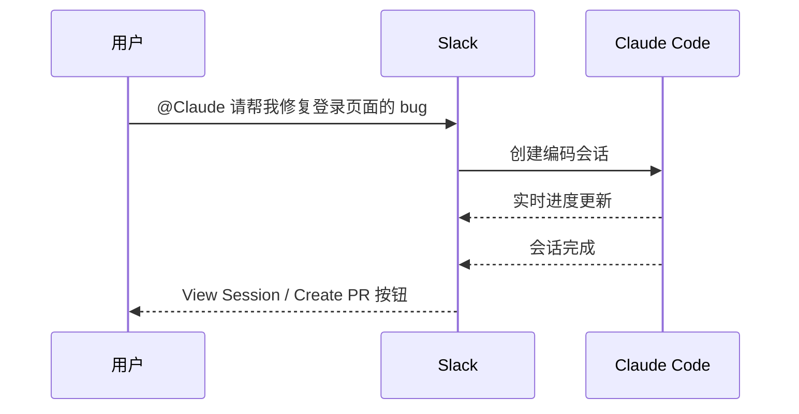

# 第三方集成

本文你会学到：

- 🎯 理解 Claude Code 的第三方集成体系——换了 LLM 提供商，工具链和使用体验不变
- 🔧 接入 Amazon Bedrock、Google Vertex AI、Microsoft Foundry 三大云平台
- 🚀 通过 LLM Gateway 实现统一代理和灵活的认证方案
- 💬 在 Slack 中用 `@Claude` 触发编码会话，团队协作无缝衔接
- 🗂️ 掌握 Claude Directory 的文件结构与诊断命令
- 🖥️ 了解 Computer Use 的能力边界与平台限制

## ⚙️ 概览

Claude Code 本质上是一个**智能编码助手外壳**——它负责代码理解、文件操作、终端交互等能力，而「思考的大脑」可以选择不同的 LLM 提供商。就像同一辆车可以换不同的引擎，驾驶体验基本一致，但动力来源可以灵活切换。

除了 LLM 提供商，Claude Code 还支持与 Slack 集成实现团队协作，以及通过 Claude Directory 管理项目级和全局级的配置体系。

## 🔌 第三方 LLM 提供商

Claude Code 原生支持四大接入方式。下表对比了它们的核心差异：

| 特性 | Amazon Bedrock | Google Vertex AI | Microsoft Foundry | LLM Gateway |
|------|---------------|-----------------|-------------------|-------------|
| **云平台** | AWS | GCP | Azure | 自定义（任意） |
| **认证方式** | AWS 凭证链 | GCP 凭证 | Entra ID / API Key | 自定义 |
| **核心环境变量** | `CLAUDE_CODE_USE_BEDROCK=1` | `CLAUDE_CODE_USE_VERTEX=1` | `CLAUDE_CODE_USE_FOUNDRY=1` | `ANTHROPIC_BASE_URL` |
| **区域配置** | `AWS_REGION` | `CLOUD_ML_REGION` | 自动检测 | 取决于代理 |
| **模型固定** | 推理配置文件 ID | 区域端点 | 自动 | 代理配置 |
| **适用场景** | 已有 AWS 基础设施 | 已有 GCP 基础设施 | 已有 Azure 基础设施 | 统一管理 / 审计 / 自定义 |

### Amazon Bedrock

Amazon Bedrock 是 AWS 提供的全托管 LLM 服务。通过 Bedrock，你可以在 AWS 的安全边界内使用 Claude 模型，数据不出 AWS 网络。

#### 为什么选择 Bedrock？

如果你团队的基础设施已经在 AWS 上（VPC、IAM、CloudTrail 审计等），直接用 Bedrock 接入 Claude 可以避免额外的网络出口，同时复用现有的权限体系和合规策略。

#### 配置步骤

**第一步：提交使用申请**

访问 [Anthropic Console](https://console.anthropic.com/) 提交 Bedrock 使用申请（use case submission），获得审批后方可使用。

**第二步：配置凭证**

Bedrock 使用标准的 AWS 凭证链，支持以下五种方式（按优先级从高到低）：

| 优先级 | 凭证来源 | 适用场景 |
|--------|---------|---------|
| 1 | 环境变量 `AWS_ACCESS_KEY_ID` + `AWS_SECRET_ACCESS_KEY` | CI/CD、容器环境 |
| 2 | `~/.aws/credentials` 文件 | 本地开发 |
| 3 | ECS 容器凭证 | ECS 部署 |
| 4 | EC2 实例元数据 | EC2 部署 |
| 5 | IAM Role（任何 AWS 运行时） | Lambda、EKS 等 |

**第三步：设置环境变量**

```bash
# 启用 Bedrock
export CLAUDE_CODE_USE_BEDROCK=1

# 指定 AWS 区域
export AWS_REGION=us-east-1
```

#### 固定模型版本

Bedrock 的模型 ID 通常会指向最新版本。要固定到特定版本，使用**推理配置文件 ID**（Inference Profile ID）并加上 `us.` 前缀：

```bash
# 固定到 Claude 3.5 Sonnet 的特定推理配置
export ANTHROPIC_MODEL_ID=us.anthropic.claude-sonnet-4-20250514-v1:0
```

推理配置文件 ID 可以在 AWS 控制台的 Bedrock → Inference Profiles 页面找到。

#### IAM 权限

为 Claude Code 使用的 IAM 角色/用户添加以下权限策略：

```json title="bedrock-policy.json"
{
  "Version": "2012-10-17",
  "Statement": [
    {
      "Sid": "ClaudeCodeBedrockAccess",
      "Effect": "Allow",
      "Action": [
        "bedrock:InvokeModel",
        "bedrock:InvokeModelWithResponseStream",
        "bedrock:GetInferenceProfile",
        "bedrock:ListInferenceProfiles"
      ],
      "Resource": "arn:aws:bedrock:*::foundation-model/*"
    }
  ]
}
```

#### 配置 Guardrails

Bedrock Guardrails 可以在 Claude Code 中使用，为模型输出添加内容过滤策略：

```bash
# 指定 Guardrails ARN
export ANTHROPIC_BEDROCK_GUARDRAILS_ARN="arn:aws:bedrock:us-east-1:123456789012:guardrail/your-guardrail-id"
```

!!! warning "Guardrails 的影响"
    启用 Guardrails 后，如果模型的输出被过滤，Claude Code 可能收到空响应，导致功能异常。建议先在测试环境验证 Guardrails 规则不会误拦截正常的编码助手回复。

### Google Vertex AI

Google Vertex AI 是 GCP 上的 AI/ML 平台，同样支持 Claude 模型。一个显著优势是支持 **100 万 token 的上下文窗口**。

#### 配置步骤

**第一步：申请模型访问权限**

在 GCP 控制台中申请 Claude 模型的访问权限。审批通常需要 24-48 小时。

**第二步：配置 IAM 角色**

确保运行 Claude Code 的服务账号拥有 `aiplatform.user` 角色，或至少具备以下权限：

- `aiplatform.endpoints.predict`
- `aiplatform.endpoints.queryModelCache`

**第三步：设置环境变量**

```bash
# 启用 Vertex AI
export CLAUDE_CODE_USE_VERTEX=1

# 指定 GCP 项目 ID
export ANTHROPIC_VERTEX_PROJECT_ID=your-gcp-project-id

# 使用 global 端点（支持 1M token 上下文）
export CLOUD_ML_REGION=global
```

#### 区域端点配置

`global` 端点会自动将请求路由到最近的区域。如果你需要指定区域（例如某些模型仅在特定区域可用），可以覆盖：

```bash
# 覆盖为特定区域
export VERTEX_REGION_US_EAST5=us-east5
export VERTEX_REGION_EU_WEST4=europe-west4
```

!!! tip "1M Token 上下文窗口"
    使用 `CLOUD_ML_REGION=global` 时，可以享受 100 万 token 的上下文窗口。这意味着你可以让 Claude Code 分析更大的代码库，或在一次对话中处理更多文件。

### Microsoft Foundry

Microsoft Foundry（原名 Azure AI Foundry）是 Azure 上的 AI 平台，适合已有 Azure 基础设施的团队。

#### 配置步骤

**第一步：设置环境变量**

```bash
# 启用 Foundry
export CLAUDE_CODE_USE_FOUNDRY=1

# 指定 Azure AI 资源名称
export ANTHROPIC_FOUNDRY_RESOURCE=your-azure-ai-resource
```

**第二步：配置认证**

Foundry 支持两种认证方式：

=== "API Key 认证"

    ```bash
    # 直接提供 API Key
    export ANTHROPIC_FOUNDRY_API_KEY=your-api-key
    ```

=== "Entra ID 认证"

    Claude Code 会自动检测当前环境的 Entra ID（Azure AD）凭证，无需额外配置。适用于以下场景：
    - Azure CLI 已登录（`az login`）
    - Azure 资源的 Managed Identity
    - 开发环境的 DefaultAzureCredential 链

#### RBAC 权限配置

在 Azure AI 资源上为用户或服务主体分配 **Azure AI User** 角色，确保其具备模型调用权限。

### LLM Gateway（自定义代理）

如果你的组织需要统一管理 LLM 调用（审计、限流、成本控制），可以使用 LLM Gateway 作为中间代理层。

#### 它是什么？

LLM Gateway 就像一个「API 交通枢纽」——Claude Code 不直接连接 Anthropic API，而是连接到你自建的代理服务器，由代理服务器转发请求到实际的 LLM 提供商。

#### 代理服务器的要求

代理必须兼容以下 **任一** API 格式：

| API 格式 | 端点路径 | 适用提供商 |
|---------|---------|-----------|
| Anthropic Messages | `/v1/messages` | Anthropic 直连 |
| Bedrock InvokeModel | Bedrock 端点 | Amazon Bedrock |
| Vertex rawPredict | Vertex 端点 | Google Vertex AI |

#### 配置方式

=== "静态 API Key"

    ```bash
    # 指定代理地址
    export ANTHROPIC_BASE_URL=https://your-gateway.example.com

    # 直接设置 API Key
    export ANTHROPIC_API_KEY=your-api-key
    ```

=== "动态 API Key（apiKeyHelper）"

    适用于 API Key 需要动态获取的场景（如临时凭证、SSO 令牌）。在 Claude Code 的设置文件中配置：

    ```json title="~/.claude/settings.json"
    {
      "env": {
        "ANTHROPIC_BASE_URL": "https://your-gateway.example.com",
        "ANTHROPIC_API_KEY_HELPER": "your-script-to-fetch-key.sh"
      }
    }
    ```

    Claude Code 每次需要 API Key 时会执行 `apiKeyHelper` 指定的脚本，使用其标准输出的值作为 Key。

#### LiteLLM 示例

[LiteLLM](https://github.com/BerriAI/litellm) 是一个常用的开源 LLM 代理，支持 100+ 提供商的统一接口：

```yaml title="litellm_config.yaml"
model_list:
  - model_name: claude-sonnet-4-20250514
    litellm_params:
      model: bedrock/us.anthropic.claude-sonnet-4-20250514-v1:0
      aws_region: us-east-1
  - model_name: claude-sonnet-4-20250514
    litellm_params:
      model: vertex_ai/claude-sonnet-4@20250514
      vertex_project: your-gcp-project
      vertex_location: global
```

!!! tip "统一端点策略"
    建议将 Gateway 配置为统一的 API 端点（格式兼容 `/v1/messages`），这样 Claude Code 的配置最简单，只需设置 `ANTHROPIC_BASE_URL` 即可。

## 💬 Slack 集成

Slack 集成让你可以在 Slack 频道中直接 `@Claude` 来触发编码会话——无需切换到终端。

### 工作流程



具体步骤如下：

1. **触发**：在 Slack 频道中发送 `@Claude` 消息
2. **意图检测**：Claude 自动判断消息是否涉及编码任务
3. **会话创建**：确认后，创建一个 Web 编码会话
4. **进度同步**：Claude 的工作进度实时更新到 Slack 消息中
5. **结果交付**：完成后提供「View Session」查看详情，或「Create PR」直接创建 Pull Request

### 关键限制

- ⚠️ 目前仅支持 **GitHub** 仓库，不支持 GitLab、Bitbucket 等
- ⚠️ 频道级别的访问控制——只有在被授权的频道中才能使用
- ⚠️ 编码会话运行在 Anthropic 的 Web 环境中，不是在你的本地机器上

## 🗂️ Claude Directory

Claude Code 的配置体系通过 `.claude/` 目录管理，分为**项目级**和**全局级**两个作用域。

### 文件结构总览

| 文件/目录 | 作用域 | 说明 |
|-----------|--------|------|
| `CLAUDE.md` | 项目级 | 项目指令，Claude Code 启动时自动加载 |
| `.claude/rules/*.md` | 项目级 | 规则文件，按需激活的约束条件 |
| `.claude/settings.json` | 项目级 | 项目级设置（环境变量、权限等） |
| `.claude/skills/` | 项目级 | 自定义 Skill |
| `.claude/commands/` | 项目级 | 自定义斜杠命令 |
| `.claude/agents/` | 项目级 | 自定义 Agent 配置 |
| `.claude/.mcp.json` | 项目级 | 项目级 MCP 服务器配置 |
| `~/.claude/CLAUDE.md` | 全局级 | 全局指令，所有项目共享 |
| `~/.claude/settings.json` | 全局级 | 全局设置 |
| `~/.claude/skills/` | 全局级 | 全局 Skill |

💡 `CLAUDE.md` 是你与 Claude Code 沟通的「核心契约」——它告诉 Claude 你的项目约定、编码规范、角色定位。项目级的 `CLAUDE.md` 会与全局级的合并，项目级优先。

### 诊断命令

在 Claude Code 中可以使用以下斜杠命令检查配置状态：

| 命令 | 用途 |
|------|------|
| `/context` | 查看当前会话的完整上下文（加载了哪些文件、哪些规则） |
| `/memory` | 查看 CLAUDE.md 中的项目指令摘要 |
| `/mcp` | 查看 MCP 服务器的连接状态和可用工具 |

## 🖥️ Computer Use

Computer Use（计算机操控）是 Claude Code 的一个实验性能力，允许它直接操控你的电脑界面——点击、输入、截图识别。

### 它是什么？

Computer Use 通过一个内置的 MCP 服务器（`computer-use`）实现。启用后，Claude Code 可以：
- 截取屏幕截图并分析界面内容
- 模拟鼠标点击和键盘输入
- 在桌面应用中执行操作

### 启用与配置

Computer Use 默认关闭，需要手动启用：

```json title=".claude/settings.json"
{
  "mcpServers": {
    "computer-use": {
      "command": "npx",
      "args": ["-y", "@anthropic-ai/mcp-computer-use"]
    }
  }
}
```

### 重要限制

!!! danger "平台限制"
    Computer Use **仅支持 macOS**，无法在 Linux 和 Windows 的 CLI 环境中使用。

!!! warning "每次会话需逐个应用授权"
    Claude Code 无法直接操控所有应用。每次会话中，对于每个需要操控的应用，你需要手动授予屏幕录制和辅助功能权限。

!!! warning "不支持第三方提供商"
    Computer Use 目前仅在使用 Anthropic 直连时可用。通过 Bedrock、Vertex AI 或自定义 Gateway 接入时，此功能不可用。

### 使用技巧

- ⚠️ 随时按 `Esc` 键可以紧急停止正在进行的操控操作
- 💡 对于 GUI 测试、表单填写、截图分析等场景特别有用
- ⚠️ 操控操作是不可逆的——如果 Claude 错误地点击了「删除」按钮，后果需要你自己承担

📝 小结：Claude Code 的第三方集成体系让「换个大脑」变得简单——无论是 AWS、GCP、Azure 还是你自建的代理，配置几个环境变量就能无缝切换。而 Slack 集成和 Computer Use 则分别拓展了团队协作和人机交互的边界，让 Claude Code 不仅仅是一个终端工具。
