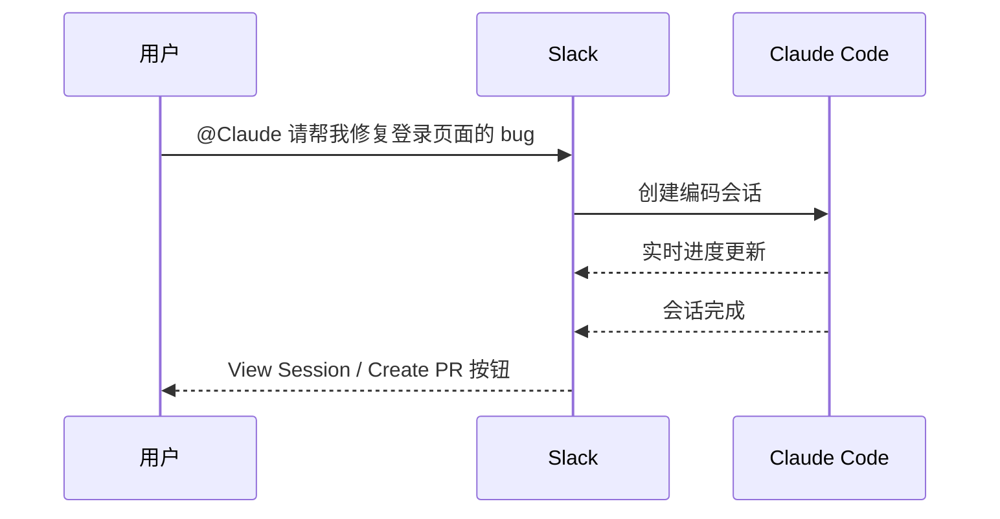

---
title: 第三方集成
description: 将 Claude Code 连接到第三方 LLM 提供商、Slack、Channel 等外部服务
---

# 第三方集成

**本文你会学到**：

- 理解 Claude Code 的第三方集成体系——换了 LLM 提供商，工具链和使用体验不变
- 接入 Amazon Bedrock、Google Vertex AI、Microsoft Foundry 三大云平台
- 通过 LLM Gateway 实现统一代理和灵活的认证方案
- 在 Slack 中用 `@Claude` 触发编码会话，团队协作无缝衔接
- 通过 Chrome 扩展在浏览器中测试应用、读取控制台、自动填充表单
- 理解 Channel、远程控制等集成方式与 Slack 的区别，按需选择
- 配置并使用 Code Review 实现自动化 PR 审查，捕获逻辑错误与安全漏洞
- 掌握 Claude Directory 的文件结构与诊断命令
- 了解 Computer Use 的应用分级控制、安全机制与工作流程

## ⚙️ 概览

Claude Code 本质上是一个**智能编码助手外壳**——它负责代码理解、文件操作、终端交互等能力，而「思考的大脑」可以选择不同的 LLM 提供商。就像同一辆车可以换不同的引擎，驾驶体验基本一致，但动力来源可以灵活切换。

除了 LLM 提供商，Claude Code 还支持与 Slack 集成实现团队协作，通过 Chrome 扩展进行浏览器自动化测试，通过 Channel 将外部事件推送到运行中的会话，以及通过 Claude Directory 管理项目级和全局级的配置体系。

## 🔌 第三方 LLM 提供商

Claude Code 原生支持四大接入方式。下表对比了它们的核心差异：

| 特性 | Amazon Bedrock | Google Vertex AI | Microsoft Foundry | LLM Gateway |
|------|---------------|-----------------|-------------------|-------------|
| **云平台** | AWS | GCP | Azure | 自定义（任意） |
| **认证方式** | AWS 凭证链 | GCP 凭证 | Entra ID / API Key | 自定义 |
| **核心环境变量** | `CLAUDE_CODE_USE_BEDROCK=1` | `CLAUDE_CODE_USE_VERTEX=1` | `CLAUDE_CODE_USE_FOUNDRY=1` | `ANTHROPIC_BASE_URL` |
| **区域配置** | `AWS_REGION` | `CLOUD_ML_REGION` | 自动检测 | 取决于代理 |
| **模型固定** | 推理配置文件 ID | 区域端点 | 自动 | 代理配置 |
| **适用场景** | 已有 AWS 基础设施 | 已有 GCP 基础设施 | 已有 Azure 基础设施 | 统一管理 / 审计 / 自定义 |

### Amazon Bedrock

Amazon Bedrock 是 AWS 提供的全托管 LLM 服务。通过 Bedrock，你可以在 AWS 的安全边界内使用 Claude 模型，数据不出 AWS 网络。

#### 为什么选择 Bedrock？

如果你团队的基础设施已经在 AWS 上（VPC、IAM、CloudTrail 审计等），直接用 Bedrock 接入 Claude 可以避免额外的网络出口，同时复用现有的权限体系和合规策略。

#### 服务层级选择

v2.1.122 新增 `ANTHROPIC_BEDROCK_SERVICE_TIER` 环境变量，让你选择 Bedrock 的服务层级（`default`、`flex` 或 `priority`），以 `X-Amzn-Bedrock-Service-Tier` 头发送。`flex` 适合成本敏感的非实时任务，`priority` 适合需要低延迟的关键场景。

#### 配置步骤

**第零步：使用快速配置向导**

Claude Code 提供了交互式配置向导来简化接入流程。运行 `/setup-bedrock` 或 `/setup-vertex` 即可一步步完成配置（v2.1.111 改进：当 `CLAUDE_CONFIG_DIR` 自定义时显示实际的 `settings.json` 路径，重新运行时从已有 pin 中获取候选模型）。

**第一步：提交使用申请**

访问 [Anthropic Console](https://console.anthropic.com/) 提交 Bedrock 使用申请（use case submission），获得审批后方可使用。

**第二步：配置凭证**

Bedrock 使用标准的 AWS 凭证链，支持以下五种方式（按优先级从高到低）：

| 优先级 | 凭证来源 | 适用场景 |
|--------|---------|---------|
| 1 | 环境变量 `AWS_ACCESS_KEY_ID` + `AWS_SECRET_ACCESS_KEY` | CI/CD、容器环境 |
| 2 | `~/.aws/credentials` 文件 | 本地开发 |
| 3 | ECS 容器凭证 | ECS 部署 |
| 4 | EC2 实例元数据 | EC2 部署 |
| 5 | IAM Role（任何 AWS 运行时） | Lambda、EKS 等 |

**第三步：设置环境变量**

```bash
# 启用 Bedrock
export CLAUDE_CODE_USE_BEDROCK=1

# 指定 AWS 区域
export AWS_REGION=us-east-1
```

#### 固定模型版本

Bedrock 的模型 ID 通常会指向最新版本。要固定到特定版本，使用**推理配置文件 ID**（Inference Profile ID）并加上 `us.` 前缀：

```bash
# 固定到 Claude 3.5 Sonnet 的特定推理配置
export ANTHROPIC_MODEL_ID=us.anthropic.claude-sonnet-4-20250514-v1:0
```

推理配置文件 ID 可以在 AWS 控制台的 Bedrock → Inference Profiles 页面找到。

#### IAM 权限

为 Claude Code 使用的 IAM 角色/用户添加以下权限策略：

``` json title="bedrock-policy.json"
{
  "Version": "2012-10-17",
  "Statement": [
    {
      "Sid": "ClaudeCodeBedrockAccess",
      "Effect": "Allow",
      "Action": [
        "bedrock:InvokeModel",
        "bedrock:InvokeModelWithResponseStream",
        "bedrock:GetInferenceProfile",
        "bedrock:ListInferenceProfiles"
      ],
      "Resource": "arn:aws:bedrock:*::foundation-model/*"
    }
  ]
}
```

#### 配置 Guardrails

Bedrock Guardrails 可以在 Claude Code 中使用，为模型输出添加内容过滤策略：

```bash
# 指定 Guardrails ARN
export ANTHROPIC_BEDROCK_GUARDRAILS_ARN="arn:aws:bedrock:us-east-1:123456789012:guardrail/your-guardrail-id"
```

!!! warning "Guardrails 的影响"

    启用 Guardrails 后，如果模型的输出被过滤，Claude Code 可能收到空响应，导致功能异常。建议先在测试环境验证 Guardrails 规则不会误拦截正常的编码助手回复。

#### Mantle 接入（v2.1.94 新增）

Mantle 是 Amazon Bedrock 的优化接入层，由 Anthropic 提供。与传统 `CLAUDE_CODE_USE_BEDROCK=1` 直连方式不同，Mantle 在保持数据不出 AWS 的前提下提供更快的响应速度和更好的可靠性：

```bash
# 使用 Mantle 接入 Bedrock
export CLAUDE_CODE_USE_MANTLE=1

# 仍需配置 AWS 凭证和区域（与标准 Bedrock 相同）
export AWS_REGION=us-east-1
```

Mantle 适用于所有已配置 Bedrock 的场景，无需额外的 IAM 权限变更。

### Google Vertex AI

Google Vertex AI 是 GCP 上的 AI/ML 平台，同样支持 Claude 模型。一个显著优势是支持 **100 万 token 的上下文窗口**（v2.1.75 新增 Vertex AI 1M context 支持）。

#### 配置步骤

**第一步：申请模型访问权限**

在 GCP 控制台中申请 Claude 模型的访问权限。审批通常需要 24-48 小时。

**第二步：配置 IAM 角色**

确保运行 Claude Code 的服务账号拥有 `aiplatform.user` 角色，或至少具备以下权限：

- `aiplatform.endpoints.predict`
- `aiplatform.endpoints.queryModelCache`

**第三步：设置环境变量**

```bash
# 启用 Vertex AI
export CLAUDE_CODE_USE_VERTEX=1

# 指定 GCP 项目 ID
export ANTHROPIC_VERTEX_PROJECT_ID=your-gcp-project-id

# 使用 global 端点（支持 1M token 上下文）
export CLOUD_ML_REGION=global
```

#### 区域端点配置

`global` 端点会自动将请求路由到最近的区域。如果你需要指定区域（例如某些模型仅在特定区域可用），可以覆盖：

```bash
# 覆盖为特定区域
export VERTEX_REGION_US_EAST5=us-east5
export VERTEX_REGION_EU_WEST4=europe-west4
```

!!! tip "1M Token 上下文窗口"

    使用 `CLOUD_ML_REGION=global` 时，可以享受 100 万 token 的上下文窗口。这意味着你可以让 Claude Code 分析更大的代码库，或在一次对话中处理更多文件。

### Microsoft Foundry

Microsoft Foundry（原名 Azure AI Foundry）是 Azure 上的 AI 平台，适合已有 Azure 基础设施的团队（v2.0.45 新增 Foundry 支持）。

#### 配置步骤

**第一步：设置环境变量**

```bash
# 启用 Foundry
export CLAUDE_CODE_USE_FOUNDRY=1

# 指定 Azure AI 资源名称
export ANTHROPIC_FOUNDRY_RESOURCE=your-azure-ai-resource
```

**第二步：配置认证**

Foundry 支持两种认证方式：

=== "API Key 认证"

    ```bash
    # 直接提供 API Key
    export ANTHROPIC_FOUNDRY_API_KEY=your-api-key
    ```

=== "Entra ID 认证"

    Claude Code 会自动检测当前环境的 Entra ID（Azure AD）凭证，无需额外配置。适用于以下场景：
    - Azure CLI 已登录（`az login`）
    - Azure 资源的 Managed Identity
    - 开发环境的 DefaultAzureCredential 链

#### RBAC 权限配置

在 Azure AI 资源上为用户或服务主体分配 **Azure AI User** 角色，确保其具备模型调用权限。

### LLM Gateway（自定义代理）

如果你的组织需要统一管理 LLM 调用（审计、限流、成本控制），可以使用 LLM Gateway 作为中间代理层。

#### 它是什么？

LLM Gateway 就像一个「API 交通枢纽」——Claude Code 不直接连接 Anthropic API，而是连接到你自建的代理服务器，由代理服务器转发请求到实际的 LLM 提供商。

#### 代理服务器的要求

代理必须兼容以下 **任一** API 格式：

| API 格式 | 端点路径 | 适用提供商 |
|---------|---------|-----------|
| Anthropic Messages | `/v1/messages` | Anthropic 直连 |
| Bedrock InvokeModel | Bedrock 端点 | Amazon Bedrock |
| Vertex rawPredict | Vertex 端点 | Google Vertex AI |

#### 配置方式

=== "静态 API Key"

    ```bash
    # 指定代理地址
    export ANTHROPIC_BASE_URL=https://your-gateway.example.com

    # 直接设置 API Key
    export ANTHROPIC_API_KEY=your-api-key
    ```

=== "动态 API Key（apiKeyHelper）"

    适用于 API Key 需要动态获取的场景（如临时凭证、SSO 令牌）。在 Claude Code 的设置文件中配置：

    ```json title="~/.claude/settings.json"
    {
      "env": {
        "ANTHROPIC_BASE_URL": "https://your-gateway.example.com",
        "ANTHROPIC_API_KEY_HELPER": "your-script-to-fetch-key.sh"
      }
    }
    ```

    Claude Code 每次需要 API Key 时会执行 `apiKeyHelper` 指定的脚本，使用其标准输出的值作为 Key。

#### LiteLLM 示例

[LiteLLM](https://github.com/BerriAI/litellm) 是一个常用的开源 LLM 代理，支持 100+ 提供商的统一接口：

``` yaml title="litellm_config.yaml"
model_list:
  - model_name: claude-sonnet-4-20250514
    litellm_params:
      model: bedrock/us.anthropic.claude-sonnet-4-20250514-v1:0
      aws_region: us-east-1
  - model_name: claude-sonnet-4-20250514
    litellm_params:
      model: vertex_ai/claude-sonnet-4@20250514
      vertex_project: your-gcp-project
      vertex_location: global
```

!!! tip "统一端点策略"

    建议将 Gateway 配置为统一的 API 端点（格式兼容 `/v1/messages`），这样 Claude Code 的配置最简单，只需设置 `ANTHROPIC_BASE_URL` 即可。

当你使用自定义 `ANTHROPIC_BASE_URL` 指向 Anthropic 兼容网关时，模型选择器（`/model`）现在会从网关的 `/v1/models` 端点自动拉取可用模型列表（v2.1.126 新增）。此前使用网关时模型选择器只显示静态列表，无法感知网关实际提供的模型。配合 `ANTHROPIC_DEFAULT_*_MODEL_NAME`/`_DESCRIPTION` 覆盖（v2.1.118 新增），你可以完整控制网关环境下的模型展示和默认选择。

## 💬 Slack 集成

Slack 集成让你可以在 Slack 频道中直接 `@Claude` 来触发编码会话——无需切换到终端。

### 工作流程



具体步骤如下：

1. **触发**：在 Slack 频道中发送 `@Claude` 消息
2. **意图检测**：Claude 自动判断消息是否涉及编码任务
3. **会话创建**：确认后，创建一个 Web 编码会话
4. **进度同步**：Claude 的工作进度实时更新到 Slack 消息中
5. **结果交付**：完成后提供「View Session」查看详情，或「Create PR」直接创建 Pull Request

### 路由模式

Slack 集成支持两种路由模式，控制 Claude 如何处理你在 Slack 中发送的消息：

| 模式 | 行为 |
|------|------|
| **仅代码** | 所有 `@Claude` 消息都路由到 Claude Code 会话，适合只将 Claude 用于编码任务的团队 |
| **代码 + 聊天** | Claude 分析每条消息，在 Claude Code（编码任务）和 Claude Chat（写作、分析、常见问题）之间智能路由，适合希望一个 `@Claude` 入口点处理所有类型工作的团队 |

在「代码 + 聊天」模式下，如果 Claude 将消息路由到聊天但你想要编码会话，可以点击 `Retry as Code` 按钮。反过来也一样——如果路由到了代码但你想要聊天，可以在该线程中选择切换选项。

!!! tip "如何配置"

    导航到 Slack 中的 Claude 应用程序主页，找到「路由模式」设置进行切换。

### 智能路由机制

当你在 Slack 频道或线程中 `@Claude` 时，Claude 会自动分析你的消息来判断是否涉及编码任务。如果检测到编码意图，请求会被路由到 Web 上的 Claude Code 而非常规聊天助手。你也可以在消息中明确说明需要编码会话，即使自动检测没有触发。

!!! note "仅在频道中工作"

    Slack 中的 Claude Code 仅在频道（公开或私有）中工作，在直接消息（DM）中不起作用。

### 会话上下文收集

Claude 会从 Slack 对话中收集上下文来理解完整背景：

- **线程中**：当你在回复线程中 `@Claude` 时，它会收集该线程中的所有消息
- **频道中**：当直接在频道中 `@Claude` 时，它会查看最近的频道消息

!!! warning "上下文安全提醒"

    当 `@Claude` 被调用时，Claude 可以访问对话上下文。Claude 可能会遵循上下文中其他消息的指示，因此应确保仅在受信任的 Slack 对话中使用 Claude。

### 应用主页与操作按钮

Claude 应用程序的主页选项卡显示你的连接状态，并允许连接或断开 Claude 账户与 Slack 的关联。会话完成后，你会在 Slack 线程中看到以下操作按钮：

| 按钮 | 用途 |
|------|------|
| **View Session** | 在浏览器中打开完整的 Claude Code 会话，查看所有执行的工作、继续会话或提出其他请求 |
| **Create PR** | 直接从会话的代码变更创建 Pull Request |
| **Retry as Code** | 如果 Claude 最初作为聊天助手响应但你想要编码会话，点击此按钮将请求重试为 Claude Code 任务 |
| **Change Repo** | 如果 Claude 自动选择的仓库不正确，允许你选择不同的仓库 |

### 存储库选择

Claude 会根据 Slack 对话中的上下文自动选择存储库。如果多个仓库可能适用，Claude 会显示一个下拉菜单让你手动选择。你也可以在请求中直接提及仓库名称来提高选择准确率。

### 管理员权限与用户级访问

Slack 工作区管理员控制 Claude 应用程序是否可以在工作区中安装。安装后，各个用户使用自己的 Claude 账户进行认证。关键访问规则：

| 访问类型 | 说明 |
|---------|------|
| Claude Code 会话 | 每个用户在自己名下的 Claude 账户下运行会话 |
| 使用量和速率限制 | 会话计入个人用户的计划限制 |
| 存储库访问 | 用户只能访问自己个人连接的存储库 |
| 会话历史 | 会话出现在你 [claude.ai/code](https://claude.ai/code) 上的 Claude Code 历史中 |

### 关键限制

- 目前仅支持 **GitHub** 仓库，不支持 GitLab、Bitbucket 等
- 每个会话只能创建一个 Pull Request
- 会话使用你个人 Claude 计划的速率限制
- 需要启用 Web 上的 Claude Code 访问权限，否则只会获得标准 Claude 聊天响应
- 编码会话运行在 Anthropic 的 Web 环境中，不是在你的本地机器上

## 📡 Channel 与其他集成方式的对比

Claude Code 提供了多种连接外部系统的能力。Slack 集成在上面已经介绍，此外还有 [Channel](../channels/index.md)（v2.1.80 新增）和远程控制等。它们的核心区别在于**会话模型**：

| 方式 | 会话模型 | 适合场景 |
|------|---------|---------|
| **Slack 集成** | `@Claude` 触发**新的 Web 会话** | 从团队对话启动独立任务 |
| **Channel** | 外部事件推送到**已运行的本地会话** | 聊天桥接、webhook 接收、远程交互 |
| **Web 上的 Claude Code** | 在**新的云沙箱**中运行 | 自包含的异步工作 |
| 标准 MCP | Claude **按需查询**外部服务 | 给 Claude 访问外部数据的能力 |
| **远程控制** | 从 claude.ai **驱动本地会话** | 离开工位时指导进行中的会话 |

!!! tip "如何选择？"

    - 想让团队在 Slack 里直接用 Claude → **Slack 集成**
    - 想让外部事件（CI 结果、聊天消息）到达你正在跑的任务 → **Channel**
    - 想在云上跑一个不需要本地环境的任务 → **Web 上的 Claude Code**
    - 想从手机远程操控你本地正在跑的会话 → **远程控制**

详细的 Channel 配置和使用方法，参见 [Channel 专题](../channels/index.md)。

## 🗂️ Claude Directory

Claude Code 的配置体系通过 `.claude/` 目录管理，分为**项目级**和**全局级**两个作用域。

### 文件结构总览

| 文件/目录 | 作用域 | 说明 |
|-----------|--------|------|
| `CLAUDE.md` | 项目级 | 项目指令，Claude Code 启动时自动加载 |
| `.claude/rules/*.md` | 项目级 | 规则文件，按需激活的约束条件 |
| `.claude/settings.json` | 项目级 | 项目级设置（环境变量、权限等） |
| `.claude/skills/` | 项目级 | 自定义 Skill |
| `.claude/commands/` | 项目级 | 自定义斜杠命令 |
| `.claude/agents/` | 项目级 | 自定义 Agent 配置 |
| `.claude/.mcp.json` | 项目级 | 项目级 MCP 服务器配置 |
| `~/.claude/CLAUDE.md` | 全局级 | 全局指令，所有项目共享 |
| `~/.claude/settings.json` | 全局级 | 全局设置 |
| `~/.claude/skills/` | 全局级 | 全局 Skill |

💡 `CLAUDE.md` 是你与 Claude Code 沟通的「核心契约」——它告诉 Claude 你的项目约定、编码规范、角色定位。项目级的 `CLAUDE.md` 会与全局级的合并，项目级优先。

### 诊断命令

在 Claude Code 中可以使用以下斜杠命令检查配置状态：

| 命令 | 用途 |
|------|------|
| `/context` | 查看当前会话的完整上下文（加载了哪些文件、哪些规则） |
| `/memory` | 查看 CLAUDE.md 中的项目指令摘要 |
| `/mcp` | 查看 MCP 服务器的连接状态和可用工具 |

## 🖥️ Computer Use

Computer Use（计算机操控）是 Claude Code 的一个实验性能力，允许它直接操控你的电脑界面——点击、输入、截图识别。

### 它是什么？

Computer Use 通过一个内置的 MCP 服务器（`computer-use`）实现。启用后，Claude Code 可以：

- 截取屏幕截图并分析界面内容
- 模拟鼠标点击和键盘输入
- 在桌面应用中执行操作

### 启用与配置

Computer Use 默认关闭，需要手动启用：

``` json title=".claude/settings.json"
{
  "mcpServers": {
    "computer-use": {
      "command": "npx",
      "args": ["-y", "@anthropic-ai/mcp-computer-use"]
    }
  }
}
```

### 重要限制

!!! danger "平台限制"

    Computer Use **仅支持 macOS**，无法在 Linux 和 Windows 的 CLI 环境中使用。

!!! warning "每次会话需逐个应用授权"

    Claude Code 无法直接操控所有应用。每次会话中，对于每个需要操控的应用，你需要手动授予屏幕录制和辅助功能权限。

!!! warning "不支持第三方提供商"

    Computer Use 目前仅在使用 Anthropic 直连时可用。通过 Bedrock、Vertex AI 或自定义 Gateway 接入时，此功能不可用。

### 应用分级控制

启用 `computer-use` 并不意味着 Claude 可以随意操控你机器上的所有应用。Claude 的控制级别因应用类别而异：

| 控制级别 | 适用场景 | 说明 |
|---------|---------|------|
| **仅查看** | 浏览器、交易平台 | Claude 可以截取屏幕内容，但无法点击或输入 |
| **仅点击** | 终端（Terminal、iTerm）、IDE（VS Code） | Claude 可以点击按钮，但无法在输入框中输入文字 |
| **完全控制** | 其他所有桌面应用 | Claude 可以点击、输入、滚动、拖拽 |

在会话中，Claude 第一次需要操控某个应用时，终端中会出现一个授权提示，显示 Claude 想要控制哪些应用以及将隐藏多少其他应用。批准持续当前会话，会话结束后需要重新授权。

### 广泛影响应用警告

某些应用被授权后等同于授予了 Claude 非常高的权限级别。在授权提示中，这些应用会显示额外的警告标签：

| 警告 | 适用应用 | 风险说明 |
|------|---------|---------|
| 等同于 shell 访问 | Terminal、iTerm、VS Code、Warp 等终端和 IDE | Claude 可以通过终端执行任意命令 |
| 可以读取或写入任何文件 | Finder | Claude 可以浏览和操作系统中的所有文件 |
| 可以更改系统设置 | System Settings | Claude 可以修改操作系统级别的配置 |

这些应用不会被阻止使用，警告的目的只是让你在批准前明确知道对应的权限级别。例如，你让 Claude 通过终端编译一个 Swift 项目时，需要接受「等同 shell 访问」的警告——这是合理的权衡。

!!! warning "安全提示"

    Computer Use 与 [Sandboxed Bash](https://docs.anthropic.com/en/docs/claude-code/sandboxing) 不同，它运行在你的实际桌面上，可以访问你批准的应用。Claude 会检查每个操作并标记来自屏幕内容的潜在提示注入，但信任边界不同于沙箱环境。

### 安全哨兵机制

Claude Code 内置了多项安全护栏来降低 Computer Use 的风险，无需额外配置：

- **按应用授权**：Claude 只能操控你在当前会话中明确批准的应用
- **哨兵警告**：授予 shell、文件系统或系统设置访问权限的应用在批准前会被高亮标记
- **终端排除在屏幕截图之外**：Claude 永远看不到你的终端窗口，因此会话中的提示内容不会反馈到模型中
- **全局 Esc 中止**：在任何地方按 `Esc` 键立即中止 Computer Use，且按键事件被消耗掉不会被应用接收，防止提示注入利用 Esc 关闭对话框
- **锁文件机制**：同一时间只有一个 Claude Code 会话可以控制你的机器

### 全局 Esc 中止

当 Claude 开始使用 Computer Use 时，macOS 会发送通知「Claude is using your computer · press Esc to stop」。此时：

- 在任何地方按 `Esc` 立即中止当前操作
- 或在终端中按 `Ctrl+C`

无论哪种方式，Claude 都会释放锁文件、恢复被隐藏的应用窗口，并将控制权交还给你。Claude 完成任务后也会自动发送第二个通知。

### 工作流程示例

以下是 Computer Use 与编码任务结合的典型场景：

#### 验证原生构建

对 macOS 或 iOS 应用进行更改后，让 Claude 在一次通过中编译和验证：

```text
构建 MenuBarStats 目标、启动它、打开首选项窗口，
并验证间隔滑块更新标签。完成后截图首选项窗口。
```

Claude 会运行 `xcodebuild`、启动应用、与 UI 交互，并报告它观察到的结果。

#### 重现布局错误

当视觉错误仅在某些窗口大小下出现时，让 Claude 找到它：

```text
设置模态框在窄窗口上裁剪其页脚。调整应用窗口大小
直到您可以重现它、截图裁剪状态，然后检查模态框容器的 CSS。
```

Claude 会调整窗口大小、捕获损坏的状态，并读取相关的样式表来定位问题。

#### 测试模拟器流程

无需编写 XCTest 就能驱动 iOS 模拟器：

```text
打开 iOS 模拟器、启动应用、点击入门屏幕，
并告诉我是否有任何屏幕加载时间超过一秒。
```

Claude 会像你使用鼠标一样控制模拟器，逐步执行操作并记录观察结果。

### 使用技巧

- 随时按 `Esc` 键可以紧急停止正在进行的操控操作
- 对于 GUI 测试、表单填写、截图分析等场景特别有用
- 操控操作是不可逆的——如果 Claude 错误地点击了「删除」按钮，后果需要你自己承担
- Claude 工作时其他应用会被隐藏，终端窗口保持可见但排除在屏幕截图之外，你可以观察 Claude 的操作过程

## 🔍 Code Review

Code Review 是 Claude Code 的自动化 PR 审查服务。它在你的 GitHub Pull Request 上分析代码变更，直接在问题代码行发布内联评论——不需要人工逐行审查，就能捕获逻辑错误、安全漏洞和回归问题。

### 为什么需要自动化代码审查？

当你团队不断有 PR 流入时，人工审查面临一个现实困境：审查者的时间有限，只能关注表面问题（命名、格式），而真正危险的逻辑错误往往藏在深层代码中。Code Review 用多代理并行分析的方式解决这个问题——每个代理专注不同类别的问题，验证步骤还会过滤误报，最终将高置信度的发现以内联评论的形式发布出来。

!!! note "适用范围"

    Code Review 处于研究预览阶段，仅适用于 Team 和 Enterprise 订阅。启用了 Zero Data Retention 的组织暂不可用。

### 审查工作原理

管理员为组织启用 Code Review 后，审查在 PR 打开时、每次推送时或手动请求时触发，取决于仓库的配置。当审查运行时，多个代理在 Anthropic 基础设施上并行分析差异（diff）和周围代码——每个代理寻找不同类别的问题。验证步骤会检查候选项是否与实际代码行为相符，以过滤误报。结果被去重、按严重程度排序后，作为内联评论发布在问题代码行上，并在审查正文中包含摘要。

如果未发现问题，Claude 会发布简短确认评论。审查成本随 PR 大小和复杂性扩展，平均在 20 分钟内完成。

#### 严重程度级别

每个发现都标有严重程度标记：

| 标记 | 严重程度 | 含义 |
|------|---------|------|
| 🔴 | 重要 | 应在合并前修复的错误 |
| 🟡 | 小问题 | 轻微问题，值得修复但不阻止合并 |
| 🟣 | 预先存在 | 代码库中已存在但不是由此 PR 引入的错误 |

发现包含可折叠的**扩展推理**部分，展开后可以了解 Claude 为什么标记该问题以及它如何验证。

#### 检查运行输出

除了内联评论外，每次审查还会生成一个 **Claude Code Review** 检查运行，与 CI 检查并列显示。展开 **Details** 链接可以查看按严重程度排序的摘要表。

检查运行始终以**中立结论**完成，不会通过分支保护规则阻止合并。如果你需要根据发现来限制合并，可以在自己的 CI 中解析检查运行输出——Details 文本的最后一行包含机器可读的 JSON，可以通过 `gh` 和 `jq` 提取：

```bash
gh api repos/OWNER/REPO/check-runs/CHECK_RUN_ID \
  --jq '.output.text | split("bughunter-severity: ")[1] | split(" -->")[0] | fromjson'
```

返回值示例：`{"normal": 2, "nit": 1, "pre_existing": 0}`，其中 `normal` 对应重要发现。

#### 默认审查范围

Code Review 默认专注于**正确性**——会破坏生产的错误，而非格式偏好或缺失的测试覆盖。你可以通过添加指导文件来扩展其检查范围。

### 设置 Code Review

管理员为组织启用一次 Code Review，然后选择要包含的仓库。

**第一步：打开管理员设置**

导航到 [claude.ai/admin-settings/claude-code](https://claude.ai/admin-settings/claude-code)，找到 Code Review 部分。你需要对 Claude 组织具有管理员访问权限，并有权在 GitHub 组织中安装 GitHub Apps。

**第二步：安装 Claude GitHub App**

点击设置按钮，按照提示将 Claude GitHub App 安装到你的 GitHub 组织。应用请求以下权限：

| 权限 | 用途 |
|------|------|
| Contents | 读写 |
| Issues | 读写 |
| Pull requests | 读写 |

**第三步：选择仓库并配置触发器**

安装完成后，为每个仓库选择审查触发行为：

| 触发模式 | 行为 |
|---------|------|
| **PR 创建后一次** | PR 打开或标记为准备审查时运行一次 |
| **每次推送后** | 每次推送到 PR 分支时运行，捕获新问题并自动解决已修复的线程 |
| **手动** | 仅在 PR 上注释 `@claude review` 或 `@claude review once` 时才启动 |

每次推送后模式成本最高（每次推送都产生审查），手动模式最适合高流量仓库——你可以选择特定 PR 进行审查。

### 手动触发审查

无论仓库配置了哪种触发模式，都可以通过注释命令按需启动审查：

| 命令 | 作用 |
|------|------|
| `@claude review` | 启动审查，并将 PR 订阅到后续推送的自动审查 |
| `@claude review once` | 启动单次审查，不订阅未来推送 |

两者的关键区别在于**是否订阅未来推送**。当你只想对 PR 当前状态获得反馈、不希望每次推送都产生审查时，使用 `@claude review once`。对于长期运行的 PR（频繁推送），这个区分特别重要。

使用要点：

- 命令作为**顶级 PR 评论**发布，不是差异行上的内联评论
- 你必须对仓库具有所有者、成员或协作者访问权限
- 与自动触发不同，手动触发**在草稿 PR 上也能运行**
- 如果已有审查正在运行，请求会排队等待

### 自定义审查

Code Review 从仓库中读取两个指导文件来调整标记行为。它们的影响方式不同：

| 文件 | 影响方式 | 适用场景 |
|------|---------|---------|
| `CLAUDE.md` | 作为项目上下文读取，新违规标记为小问题 | 已有的项目规范，对常规会话和审查都生效 |
| `REVIEW.md` | 注入到每个代理的系统提示中，最高优先级 | 仅影响审查的规则，不干扰常规会话 |

#### CLAUDE.md 的审查效果

Code Review 会读取仓库的 `CLAUDE.md`，将新引入的违规视为小问题级别。这是双向的：如果你的 PR 以使 `CLAUDE.md` 语句过时的方式更改代码，Claude 会标记文档需要更新。Claude 在目录层次结构的每个级别读取 `CLAUDE.md`，因此子目录的规则仅适用于该路径下的文件。

#### REVIEW.md 详解

`REVIEW.md` 位于仓库根目录，其内容被逐字注入到每个审查代理的系统提示中。因为它是直接粘贴的，`@` 导入语法不会展开，引用的文件也不会被读入。以下是你可以在 `REVIEW.md` 中调整的关键维度：

**严重程度校准**：重新定义「重要」的含义。默认校准针对生产代码；文档仓库或原型可能想要更窄的定义。你也可以向另一个方向升级——例如将任何 `CLAUDE.md` 违规视为重要而非默认的小问题。

**小问题数量限制**：限制单次审查发布的小问题评论数量，使审查结果更可操作。例如：「最多报告五个小问题，在摘要中提及其余的计数。」

**跳过规则**：列出不应发布发现的路径、分支模式和发现类别。常见候选包括生成的代码、lockfiles、供应商依赖、以及 CI 已强制执行的内容（lint、格式化）。

**仓库特定检查**：添加每个 PR 都应检查的规则，如「新 API 路由必须有集成测试。」因为 `REVIEW.md` 是最高优先级，这些规则比 `CLAUDE.md` 中的同等内容更可靠。

**验证标准**：要求发布发现前需要证据。例如：「行为声明需要源中的 `file:line` 引用，而不是从命名推断」——这能减少误报。

**重新审查收敛**：控制 PR 被多次审查时的行为。例如：「第一次审查后，抑制新的小问题并仅发布重要发现」——避免单行修复因风格问题触发多轮审查。

以下是一个 `REVIEW.md` 示例，为后端服务重新校准严重程度、限制小问题并添加仓库特定检查：

```markdown title="REVIEW.md"
## 重要在这里的含义

保留重要用于会破坏行为、泄露数据或阻止回滚的发现：不正确的逻辑、
无范围的数据库查询、日志或错误消息中的 PII，以及不向后兼容的迁移。
风格、命名和重构建议最多是小问题。

## 限制小问题

每次审查最多报告五个小问题。如果发现更多，在摘要中说
"加上 N 个类似项目"而不是内联发布。

## 不要报告

- CI 已经强制执行的任何内容：lint、格式化、类型错误
- `src/gen/` 下生成的文件和任何 `*.lock` 文件

## 始终检查

- 新 API 路由有集成测试
- 日志行不包括电子邮件地址、用户 ID 或请求正文
- 数据库查询的范围限定为调用者的租户
```

!!! tip "保持 REVIEW.md 精简"

    长度有成本——`REVIEW.md` 过长会稀释最重要的规则。将审查行为相关的说明放在 `REVIEW.md` 中，常规项目上下文留在 `CLAUDE.md` 中。

### 定价

Code Review 根据令牌使用量计费，每次审查平均花费 \$15-25，随 PR 大小、代码库复杂性和需要验证的问题数量而扩展。费用通过额外使用（extra usage）单独计费，不计入计划包含的使用量。

你选择的审查触发器直接影响总成本：

| 触发模式 | 成本影响 |
|---------|---------|
| PR 创建后一次 | 每个 PR 运行一次，成本可控 |
| 每次推送后 | 每次推送都运行，成本 = 单次成本 x 推送次数 |
| 手动 | 在注释 `@claude review` 之前不产生成本 |

无论组织是否使用 Amazon Bedrock 或 Google Vertex AI，Code Review 的费用都出现在 Anthropic 账单上。你可以在 [claude.ai/admin-settings/usage](https://claude.ai/admin-settings/usage) 设置每月支出上限。

### 故障排除

#### 重新触发失败或超时的审查

当审查遇到内部错误或超时时，检查运行会显示「Code review encountered an error」或「Code review timed out」。结论仍然是中立的，不会阻止合并。要重新运行，在 PR 上注释 `@claude review once`。

!!! warning "重新运行按钮无效"

    GitHub 检查选项卡中的「重新运行」按钮**不会**重新触发 Code Review。必须使用注释命令或新推送。

#### 查找未显示为内联评论的问题

如果检查运行显示发现了问题但差异上看不到内联评论，可以在以下位置查看：

- **检查运行 Details**：点击检查选项卡中 Claude Code Review 旁的 **Details**，严重程度表列出所有发现
- **Files changed 注释**：在 PR 的 Files changed 选项卡中，发现以注释形式直接附加到差异行
- **审查正文**：如果你在审查运行时推送了新代码，某些发现可能引用已不存在的行，这些出现在审查正文的 **Additional findings** 下

## 🌐 Chrome 扩展

当你需要在浏览器中测试 Web 应用、读取控制台日志、自动填充表单或提取网页数据时，Claude Code 可以通过 Chrome 扩展直接控制你的浏览器——不需要切换到独立的浏览器工具。

### 为什么需要 Chrome 扩展？

假设你刚修改了登录表单的验证逻辑，想确认浏览器中的表现是否符合预期。传统做法是手动打开浏览器、刷新页面、填写表单，然后回到终端继续改代码。有了 Chrome 扩展，你可以直接在 Claude Code 会话中完成这一切——构建代码、打开浏览器、测试交互、读取控制台错误，全部在同一个对话中进行。

### 它与 Computer Use 的区别

| 维度 | Chrome 扩展 | Computer Use |
|------|------------|-------------|
| 控制对象 | 浏览器中的 Web 页面 | 桌面原生应用和整个操作系统 |
| 工具精度 | 结构化 DOM 访问、网络请求、控制台日志 | 基于屏幕截图的视觉识别 |
| 适用平台 | macOS、Windows、Linux | 仅 macOS |
| 典型场景 | Web 应用测试、表单填充、数据提取 | 原生应用 UI 测试、模拟器操控 |

如果你只需要操控浏览器，Chrome 扩展是更精确、更快速的选择。Computer Use 适用于浏览器无法覆盖的场景（如原生 macOS 应用）。

### 前置条件

| 要求 | 说明 |
|------|------|
| 浏览器 | Google Chrome 或 Microsoft Edge（不支持 Brave、Arc 等其他 Chromium 浏览器） |
| 扩展 | [Claude in Chrome 扩展](https://chromewebstore.google.com/detail/claude/fcoeoabgfenejglbffodgkkbkcdhcgfn) 1.0.36 或更高版本 |
| Claude Code | 版本 2.0.73 或更高版本 |
| 计划 | 直接 Anthropic 计划（Pro、Max、Team 或 Enterprise） |

!!! note "第三方提供商不支持"

    Chrome 集成不可通过 Amazon Bedrock、Google Cloud Vertex AI 或 Microsoft Foundry 等第三方提供商获得。如果你仅通过第三方提供商访问 Claude，需要单独的 claude.ai 账户来使用此功能。

### 启用方式

**方式一：命令行标志**

```bash
claude --chrome
```

**方式二：会话内命令**

在已有的 Claude Code 会话中运行：

```text
/chrome
```

运行 `/chrome` 还可以检查连接状态、管理网站权限或重新连接扩展程序。

**默认启用 Chrome**：为了避免每次都传递 `--chrome`，可以在 `/chrome` 菜单中选择「默认启用」。注意这会增加上下文消耗，因为浏览器工具始终被加载——如果不需要常驻，建议在需要时才使用 `--chrome`。

### 网站权限管理

网站级权限从 Chrome 扩展程序继承。在 Chrome 扩展程序设置中管理权限，以控制 Claude 可以浏览、点击和输入的网站。

### 可用浏览器工具

连接 Chrome 后，Claude Code 可以使用一组浏览器专用工具。运行 `/mcp` 并选择 `claude-in-chrome` 即可查看完整列表。核心能力包括：

- **页面导航**：打开 URL、前进后退、刷新页面
- **元素交互**：点击、悬停、输入文本、选择下拉选项
- **页面快照**：获取基于可访问性树的文本快照，用于理解页面结构
- **截图**：截取页面或特定元素的截图
- **控制台日志**：读取浏览器的控制台消息，支持按类型过滤
- **网络请求**：列出和检查页面发出的网络请求
- **脚本执行**：在页面上下文中执行 JavaScript 代码
- **Lighthouse 审计**：运行无障碍、SEO、最佳实践等审计

### 示例工作流

#### 测试本地 Web 应用

开发 Web 应用时，直接让 Claude 验证你的更改是否正常工作：

```text
I just updated the login form validation. Can you open localhost:3000,
try submitting the form with invalid data, and check if the error
messages appear correctly?
```

Claude 会导航到你的本地服务器、与表单交互并报告它观察到的情况。

#### 使用控制台日志调试

Claude 可以读取控制台输出来帮助诊断问题。建议告诉 Claude 要查找的模式，而不是要求所有日志（日志可能很冗长）：

```text
Open the dashboard page and check the console for any errors when
the page loads.
```

#### 自动填充表单

加速重复的数据录入任务：

```text
I have a spreadsheet of customer contacts in contacts.csv. For each row,
go to the CRM at crm.example.com, click "Add Contact", and fill in the
name, email, and phone fields.
```

Claude 会读取你的本地文件、导航 Web 界面并逐条录入数据。

#### 在 Google Docs 中起草内容

直接在已登录的文档中写入内容，无需 API 设置：

```text
Draft a project update based on the recent commits and add it to my
Google Doc at docs.google.com/document/d/abc123
```

这适用于你已登录的任何 Web 应用——Gmail、Notion、Sheets 等。Claude 会共享你浏览器的登录状态。

#### 从网页提取数据

从网站中提取结构化信息：

```text
Go to the product listings page and extract the name, price, and
availability for each item. Save the results as a CSV file.
```

#### 运行多站点工作流

协调多个网站之间的任务：

```text
Check my calendar for meetings tomorrow, then for each meeting with
an external attendee, look up their company website and add a note
about what they do.
```

Claude 可以跨标签页工作来收集信息并完成整个工作流。

#### 录制演示 GIF

创建浏览器交互的可共享录制：

```text
Record a GIF showing how to complete the checkout flow, from adding
an item to the cart through to the confirmation page.
```

Claude 会录制交互序列并保存为 GIF 文件。

### 故障排除

#### 未检测到扩展程序

Claude Code 显示「未检测到 Chrome 扩展程序」时：

1. 在 `chrome://extensions` 中确认扩展已安装并启用
2. 运行 `claude --version` 确认 Claude Code 是最新版本
3. 检查 Chrome 是否正在运行
4. 运行 `/chrome` 并选择「重新连接扩展程序」
5. 如果问题持续，重启 Claude Code 和 Chrome

第一次启用时，Claude Code 会安装原生消息传递主机配置文件。Chrome 在启动时读取此文件，如果首次尝试未检测到扩展，重启 Chrome 即可。

#### 浏览器无响应

Claude 的浏览器命令停止工作时：

1. 检查是否有模态对话框（`alert`、`confirm`、`prompt`）阻塞了页面——JavaScript 对话框会阻止浏览器事件，手动关闭后告诉 Claude 继续
2. 要求 Claude 创建新标签页并重试
3. 在 `chrome://extensions` 中禁用并重新启用扩展来重启它

#### 长会话期间连接断开

Chrome 扩展的 service worker 在不活动时可能进入空闲状态，导致连接断开。运行 `/chrome` 并选择「重新连接扩展程序」即可恢复。

#### Windows 特定问题

| 问题 | 解决方案 |
|------|---------|
| 命名管道冲突（`EADDRINUSE`） | 重启 Claude Code，关闭可能使用 Chrome 的其他 Claude Code 会话 |
| 原生消息传递主机崩溃 | 重新安装 Claude Code 以重新生成主机配置 |

#### 常见错误速查

| 错误信息 | 原因 | 修复 |
|---------|------|------|
| 浏览器扩展程序未连接 | 原生消息传递主机无法到达扩展 | 重启 Chrome 和 Claude Code，运行 `/chrome` 重新连接 |
| 未检测到扩展程序 | 扩展未安装或已禁用 | 在 `chrome://extensions` 中安装或启用 |
| 没有可用的标签页 | Claude 在标签页准备好之前尝试操作 | 要求 Claude 创建新标签页并重试 |
| 接收端不存在 | 扩展 service worker 进入空闲状态 | 运行 `/chrome` 并选择「重新连接扩展程序」 |

---

Claude Code 的第三方集成体系让「换个大脑」变得简单——无论是 AWS、GCP、Azure 还是你自建的代理，配置几个环境变量就能无缝切换。而 Slack 集成、Code Review、Chrome 扩展和 Computer Use 则分别拓展了团队协作、自动化代码审查、浏览器自动化和桌面操控的边界，让 Claude Code 不仅仅是一个终端工具。
