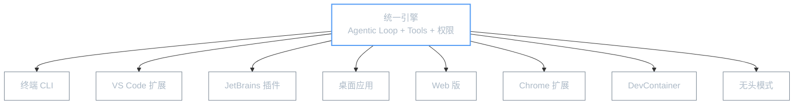
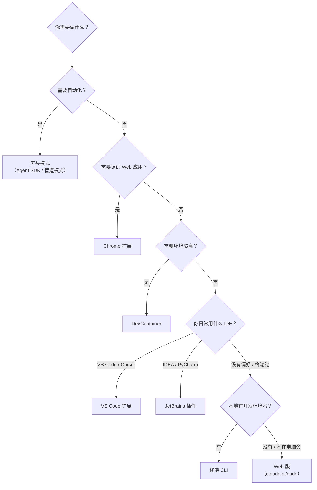

---
title: 多平台支持
description: Claude Code 可在终端、IDE、桌面应用、浏览器和云端运行，本篇梳理各平台的特点、安装方式和适用场景
---

**本文你会学到**：

- 🎯 Claude Code 的统一底层引擎是什么，为什么跨平台体验一致
- 🖥️ 终端 CLI、VS Code 扩展、JetBrains 插件各自的特色功能
- 📱 桌面应用和 Web 版如何让非终端用户也能用上 Claude Code
- 🌐 Chrome 扩展和 DevContainer 两个特殊场景
- ⚙️ 无头模式（Headless）如何支撑自动化工作流

## 🗂️ 平台全景图

Claude Code 的核心是一个 **统一引擎** —— 无论你在哪个平台上使用，底层跑的都是同一套 Agentic Loop、同一套工具集、同一套权限系统。区别只在于**外壳**（用户界面）和**集成深度**（与宿主环境的交互程度）。

打个比方：Claude Code 的引擎就像一颗「处理器」，而各平台相当于不同的「主板」——处理器一样，但插在不同的主板上，能发挥的功能侧重点不同。



### 各平台一览

| 平台 | 交互方式 | 核心亮点 | 适合谁 |
|------|---------|---------|-------|
| **终端 CLI** | 命令行对话 | 功能最完整，所有特性均支持 | 重度终端用户、自动化脚本 |
| **VS Code 扩展** | IDE 侧边面板 | 内联 diff、`@` 提及、检查点 | VS Code / Cursor 用户 |
| **JetBrains 插件** | IDE 内嵌工具窗口 | 选中代码共享上下文、交互式 diff | IDEA / PyCharm / WebStorm 用户 |
| **桌面应用** | 图形化界面 | 多会话并行、定时任务、Cloud 同步 | 不习惯终端的开发者 |
| **Web 版** | 浏览器访问 | 无需本地安装、Cloud VM 运行 | 临时使用、手机访问 |
| **Chrome 扩展** | 浏览器控制台 | 调试 Web 应用、Computer Use | 前端调试场景 |
| **DevContainer** | 隔离容器 | 一致的开发环境、零配置 | 团队协作、多项目切换 |
| **无头模式** | 编程调用 | 结构化输出、Agent SDK 集成 | CI/CD、自动化工作流（v2.0.24 新增 Sandbox 模式） |

### 跨平台共享什么

无论你在哪个平台启动 Claude Code，以下内容都是**共享和同步**的：

- `CLAUDE.md` 项目配置（全局级 + 项目级）
- MCP 服务器配置
- Settings 和权限偏好
- `claude.ai` 上的会话历史（通过 Cloud 同步）

这就意味着你可以在 IDEA 里开始一段对话，切到 Web 版继续，最后在终端里收尾 —— 上下文不会丢失。

## 🖥️ 终端 CLI

终端 CLI 是 Claude Code 的**原生形态**，也是功能最完整的版本。所有其他平台本质上都是对 CLI 能力的封装和适配。

### 安装方式

Claude Code 提供多种安装渠道，选择你最顺手的即可：

=== "Windows PowerShell"

``` powershell
irm https://claude.ai/install.ps1 | iex
```

=== "Windows CMD"

``` cmd
curl -fsSL https://claude.ai/install.cmd -o install.cmd && install.cmd && del install.cmd
```

=== "WinGet"

``` powershell
winget install Anthropic.ClaudeCode
```

=== "macOS / Linux"

``` bash
curl -fsSL https://claude.ai/install.sh | bash
```

=== "Homebrew"

``` bash
brew install claude-code
```

=== "npm"

``` bash
npm install -g @anthropic-ai/claude-code
```

安装完成后，在终端输入 `claude` 即可启动。

### Windows 专属特性

Claude Code 在 Windows 上持续改进，以下是近期值得关注的平台增强：

- **PowerShell Tool**：新增原生的 PowerShell 工具（v2.1.111 新增，逐步推出），通过 `CLAUDE_CODE_USE_POWERSHELL_TOOL` 环境变量选择加入。启用后 Claude 可以直接在 PowerShell 中执行命令，无需 Bash 适配层，PowerShell 原生命令和管道语法都能原生使用
- **`Ctrl+Backspace` 删除单词**：Windows 终端中 `Ctrl+Backspace` 现在会删除前一个单词（v2.1.113 新增），与其他平台行为一致
- **macOS Terminal.app 渲染修复**：修复了在不支持同步输出的终端（如 macOS Terminal.app）中启动时出现的渲染乱码问题（v2.1.110 修复）
- **WSL 继承 Windows 设置**：WSL on Windows 现在可通过 `wslInheritsWindowsSettings` 策略键继承 Windows 侧的托管设置（v2.1.118 新增），企业环境下无需在 WSL 中重复配置策略
- **PowerShell 检测增强**：PowerShell 7 的检测机制得到改进（v2.1.126 改进），现在可正确识别通过 Microsoft Store、不带 PATH 的 MSI 安装或 `.NET global tool` 安装的 PowerShell 7。此前这些安装方式可能无法被检测到，导致 PowerShell 工具不可用
- **PowerShell 优先**：当 PowerShell 工具启用时，Claude 现在将 PowerShell 作为主 shell 而非默认 Bash（v2.1.126 改进）。这意味着 Windows 用户在使用 PowerShell 工具时，Claude 会优先使用 PowerShell 执行命令，与 Windows 原生开发体验更一致

!!! info "原生二进制分发"

    从 v2.1.113 起，Claude Code CLI 会通过每平台可选依赖生成**原生二进制**，而非 bundled JavaScript。启动更快、内存占用更低。如果你之前通过 `npm install -g` 安装，新版本会自动切换到对应平台的原生二进制。

### 核心特性

CLI 模式提供所有平台中**最完整的特性集**：

| 特性 | 说明 |
|------|------|
| 全屏渲染 | 利用终端的 **Alternate Screen Buffer**，渲染完成后自动恢复原始内容 |
| 无闪烁模式 | 设置 `CLAUDE_CODE_NO_FLICKER=1` 环境变量可减少重绘闪烁；也可使用 `/tui fullscreen` 在会话中动态切换（v2.1.110 新增） |
| 权限模式 | `Ask`（默认）/ `Auto accept edits` / `Plan` / `Auto` / `Bypass`；Auto 模式不再需要 `--enable-auto-mode` 参数（v2.1.111 改进） |
| 会话恢复 | `/resume` 恢复历史会话 |
| 检查点 | `/checkpoint` 创建代码快照，`/undo` 回退 |
| 斜杠命令 | `/model`、`/permissions`、`/config`、`/compact` 等 |

### 何时选择 CLI

- 你日常就在终端工作，不想切换到别的界面
- 你需要用脚本驱动 Claude Code（结合无头模式）
- 你需要所有最新特性，不想等扩展适配

## 📝 VS Code 扩展

VS Code 扩展将 Claude Code 嵌入编辑器侧边栏，让你**不用离开 IDE 就能和 Claude 对话**（v2.0.0 作为原生扩展发布）。

### 安装

在 VS Code 扩展商店搜索 **"Claude Code"**，点击安装即可。如果你的编辑器是 Cursor，操作方式一样。

### 与 CLI 的区别

VS Code 扩展的核心价值在于**与编辑器的深度集成**，它多了以下能力：

| 能力 | CLI | VS Code 扩展 |
|------|-----|-------------|
| 内联 Diff 预览 | ❌ 只在终端显示 | ✅ 在编辑器中打开 diff 视图，可逐行审阅 |
| `@` 提及文件 | ✅ 手动输入路径 | ✅ `@` 触发文件选择器，直接选取 |
| 选中代码共享 | ✅ 需要复制粘贴 | ✅ 选中代码后自动作为上下文 |
| 计划评审 | ❌ | ✅ Plan 模式下可在编辑器中审阅方案 |
| 检查点 | ✅ `/checkpoint` | ✅ 面板中可视化查看和恢复 |
| 会话历史 | ✅ `/resume` | ✅ 侧边栏历史列表，一键恢复（v2.1.16 新增远程会话浏览和原生插件管理） |
| Write 感知 | ❌ 不感知编辑器中的手动修改 | ✅ 在 diff 视图中编辑了建议内容后再接受时通知模型（v2.1.110 改进） |

### 典型工作流

1. 在编辑器中写代码，遇到问题选中代码
2. 在侧边栏输入 `@` 提及相关文件
3. Claude 生成修改方案，你在 diff 视图中审阅
4. 确认后 Claude 应用更改

## 🔌 JetBrains 插件

JetBrains 插件支持 IntelliJ IDEA、PyCharm、WebStorm、GoLand 等 JetBrains 全家桶，让你在熟悉的 Java/Python/前端 IDE 中直接使用 Claude Code。

### 安装

在 JetBrains Marketplace 搜索 **"Claude Code"**，安装后重启 IDE。

### 特色功能

| 功能 | 说明 |
|------|------|
| 选中代码上下文 | 选中一段代码后调用 Claude Code，选中内容自动作为上下文传入 |
| 交互式 Diff | Claude 的代码修改以交互式 diff 形式展示，支持逐 hunk 接受/拒绝 |
| 工具窗口 | Claude Code 作为独立的 Tool Window 嵌入 IDE 底部或侧边 |

### 与 IDEA MCP 的区别

如果你已经在用 JetBrains 的 **MCP Server**（通过 `idea` MCP 调用 `get_symbol_info`、`build_project` 等工具），你可能会疑惑这两个东西的关系：

- **JetBrains 插件**：把 Claude Code 的完整对话体验嵌入 IDE，你获得的是一个 **Agent**（能自主思考、多步操作）
- **IDEA MCP Server**：把 IDE 的能力（代码补全、重构、构建）暴露为 MCP 工具，让 Claude Code **调用**这些能力

两者是**互补关系**：插件提供 UI 入口，MCP 提供 IDE 能力。最佳实践是同时安装插件和配置 MCP Server。

## 🖼️ 桌面应用

Claude Code Desktop 是一个**独立的图形化应用**，为不习惯终端的用户提供了更友好的入口（v2.0.51 发布）。

### 核心体验

桌面应用提供三个标签页：

| 标签页 | 用途 |
|--------|------|
| **Code** | 编程模式，等同于 CLI 的 Agentic Loop |
| **Cowork** | 协作模式，Claude 以协作者身份参与 |
| **Chat** | 对话模式，用于通用问答和知识查询 |

### 特色功能

| 功能 | 说明 |
|------|------|
| 可视化 Diff | 修改以图形化 diff 展示，比终端更直观 |
| 多会话并行 | 同时打开多个对话，适合同时处理多个任务 |
| 定时任务 | 设置定时执行的任务（需 Claude Max 订阅） |
| Cloud 同步 | 会话自动同步到 `claude.ai`，可在任何设备上继续 |
| Teleport | 在 Web 版和桌面版之间无缝迁移会话（v2.0.24 新增 Web → CLI teleport，v2.1.0 新增 `/teleport` 和 `/remote-env` 命令） |

### 何时选择桌面应用

- 你不太习惯终端操作，更喜欢图形界面
- 你需要同时处理多个独立任务
- 你想在本地开始一个任务，之后在手机上继续

## 🌐 Web 版

Web 版让你**无需安装任何东西**，直接在浏览器中使用 Claude Code。

### 访问方式

打开 `claude.ai/code` 即可使用。它实际上运行在 Anthropic 的 **Cloud VM** 上，所以你的本地机器不需要有开发环境。

### 工作原理

Web 版的核心是 **Teleport 技术**（v2.0.24 新增）：你的代码会自动上传到 Anthropic 的云端虚拟机，Claude Code 在云端运行，修改后的代码再同步回你的 GitHub 仓库。

这意味着：

- ✅ 你可以处理**不在本地的仓库**（比如 GitHub 上的开源项目）
- ✅ 适合**长时间运行**的任务（不怕关掉电脑）
- ✅ 手机上也能用（通过 Claude iOS App）
- ⚠️ 需要稳定的网络连接
- ⚠️ 首次使用需要授权 GitHub 访问权限

### 何时选择 Web 版

- 你在别人的电脑上临时需要使用
- 你想处理一个只存在于 GitHub 上的项目
- 你需要跑一个长时间任务，不想占用本地资源

## 🧩 Chrome 扩展

Chrome 扩展是一个**比较特殊的存在**（v2.0.72 推出 Beta 版） —— 它不是为了在浏览器里写代码，而是为了让 Claude Code 能够**控制和调试 Web 应用**。

### 核心能力

Chrome 扩展通过 **Native Messaging** 协议与本地运行的 Claude Code CLI 通信，从而实现：

| 能力 | 说明 |
|------|------|
| Computer Use | Claude Code 可以控制浏览器——点击、输入、滚动页面 |
| Web 调试 | 直接在你正在开发的 Web 应用上操作和调试 |
| 页面交互 | Claude Code 能「看到」浏览器中的内容并与之交互 |

### 使用场景

一个典型场景：你的前端项目有一个交互 bug（按钮点击后没反应），你可以：

1. 启动 Chrome 扩展
2. 告诉 Claude Code："打开 `localhost:3000`，点击提交按钮，看看发生了什么"
3. Claude Code 通过扩展控制浏览器，观察实际行为，分析问题

### 注意事项

- Chrome 扩展**不是独立运行**的，它需要本地同时运行 Claude Code CLI
- Computer Use 目前支持 macOS 和 Windows
- 它本质上是一种**浏览器自动化**能力，类比 Selenium/Playwright，但由 AI 驱动

## 📦 DevContainer 支持

DevContainer（Development Container）让你在 **Docker 容器**中运行 Claude Code，实现开发环境的完全隔离。

### 为什么需要 DevContainer

想象你有三个项目：一个用 Node.js 18，一个用 Node.js 20，还有一个用 Python 3.12。每次切换项目都需要调整环境，一不小心就会版本冲突。

DevContainer 的解决方式是：**每个项目一个独立的 Docker 容器**，容器内包含该项目所需的一切依赖。Claude Code 在容器内运行，自然也就用上了正确的环境。

### 如何使用

在你的项目根目录下创建 `.devcontainer/devcontainer.json`，定义容器配置，然后：

1. 在 VS Code 中打开项目
2. VS Code 提示 "Reopen in Container" 时点击确认
3. Claude Code 自动在容器内启动

Claude Code 能自动检测 DevContainer 环境，无需额外配置。

### 典型配置

``` json title=".devcontainer/devcontainer.json"
{
  "name": "My Project",
  "image": "mcr.microsoft.com/devcontainers/typescript-node:20",
  "customizations": {
    "vscode": {
      "extensions": ["anthropic.claude-code"]
    }
  }
}
```

### 适用场景

- 团队协作：确保所有成员使用**完全一致**的开发环境
- 多项目切换：不同项目的依赖互不干扰
- CI/CD 对齐：本地环境和 CI 环境保持一致

## ⚙️ 无头模式（Headless）

无头模式是 Claude Code 的**非交互运行方式**，主要用于自动化场景。你不会看到对话界面，Claude Code 直接接收指令、执行任务、返回结果。

### 核心概念

所有其他平台都是**交互式**的——你来我往地对话。而无头模式是**批处理式**的——给一个输入，等一个输出。

### 使用方式

无头模式有两种运行形态：

=== "管道模式"

管道模式通过 `-p` 参数将 prompt 直接传入，适合简单任务：

``` bash
# 让 Claude Code 分析一个文件的代码质量
claude -p "审查 src/utils/parser.ts 的代码质量，给出改进建议"

# 将结果输出为 JSON 格式，方便后续处理
claude -p "列出项目中所有 TODO 注释" --output-format json

# 指定输出到文件
claude -p "为这个 API 写单元测试" --output-file tests/api.test.ts
```

=== "Agent SDK"

Agent SDK 提供 Python 和 TypeScript 两个 SDK 包，让你用编程语言直接调用 Claude Code，适合复杂的多步自动化工作流。下面的示例使用 TypeScript SDK（`@anthropic-ai/claude-code`）：

``` typescript title="automate.ts"
import { Claude } from "@anthropic-ai/claude-code";

const claude = new Claude();

// 执行一个多步任务
const result = await claude.messages.create({
  prompt: "为 UserService 添加邮箱验证功能，并运行测试验证",
  options: {
    allowedTools: ["Read", "Write", "Bash", "MultiEdit"],
    maxTurns: 20
  }
});

console.log(result);
```

### 关键参数

| 参数 | 说明 | 示例 |
|------|------|------|
| `-p` | 传入 prompt（管道模式） | `claude -p "审查代码"` |
| `--output-format` | 输出格式：`text` / `json` / `stream-json` | `--output-format json` |
| `--json-schema` | 指定 JSON Schema，获取结构化输出 | `--json-schema '{"type":"object",...}'` |
| `--output-file` | 将结果写入文件 | `--output-file result.md` |
| `--bare` | 跳过 Hooks、Skills、MCP 等初始化，适合 CI | `claude --bare -p "查询"` |
| `--max-turns` | 限制 Agentic Loop 最大轮次 | `--max-turns 10` |
| `--allowedTools` | 指定免确认的工具（支持权限规则语法） | `--allowedTools "Read,Bash(git diff *)"` |
| `--permission-mode` | 权限模式：`dontAsk` / `acceptEdits` | `--permission-mode acceptEdits` |
| `--append-system-prompt` | 追加自定义系统提示（不替换默认提示） | `--append-system-prompt "审查安全性"` |
| `--continue` | 继续最近一次对话 | `claude -p "..." --continue` |
| `--resume` | 恢复指定会话 ID 的对话 | `--resume "$session_id"` |

### `--bare` 模式

当你需要在 CI 或脚本中获得**一致、可复现**的结果时，`--bare` 是首选。它跳过 Hooks、Skills、Plugins、MCP 服务器、自动记忆和 `CLAUDE.md` 的自动发现——只有你显式传入的标志才会生效。队友的 `~/.claude` 中的 Hook 或项目的 `.mcp.json` 中的 MCP 服务器都不会运行。

`--bare` 模式下，Claude 仍可访问 Bash、文件读取和文件编辑这三个基础工具。如果需要额外上下文，通过标志显式传入：

| 需要加载的内容 | 使用的标志 |
|------------|---------|
| 系统提示补充 | `--append-system-prompt` / `--append-system-prompt-file` |
| 设置 | `--settings <file-or-json>` |
| MCP 服务器 | `--mcp-config <file-or-json>` |
| 自定义 Agent | `--agents <json>` |
| 插件目录 | `--plugin-dir <path>` |

``` bash
# 裸模式下运行一次性任务，预批准 Read 工具避免权限弹窗
claude --bare -p "Summarize this file" --allowedTools "Read"
```

⚠️ `--bare` 跳过 OAuth 和钥匙链读取。认证必须来自 `ANTHROPIC_API_KEY` 环境变量或 `--settings` 传入的 JSON 中的 `apiKeyHelper`。Bedrock、Vertex 和 Foundry 使用各自常规的提供商凭证。

!!! tip "未来默认值"

    `--bare` 是脚本和 SDK 调用的推荐模式，将在未来版本中成为 `-p` 的默认值。

### 结构化输出

使用 `--output-format json` 配合 `--json-schema` 可以让 Claude Code 返回符合特定 Schema 的结构化数据，适合在脚本中进一步处理：

``` bash
# 提取 auth.py 中的函数名称，返回字符串数组
claude -p "Extract the main function names from auth.py" \
  --output-format json \
  --json-schema '{"type":"object","properties":{"functions":{"type":"array","items":{"type":"string"}}},"required":["functions"]}'
```

响应中结构化数据在 `structured_output` 字段，会话元数据（会话 ID、用量统计等）也在 JSON 中。配合 [jq](https://jqlang.github.io/jq/) 提取特定字段：

``` bash
# 提取文本结果
claude -p "Summarize this project" --output-format json | jq -r '.result'

# 提取结构化输出
claude -p "Extract function names from auth.py" \
  --output-format json \
  --json-schema '{"type":"object","properties":{"functions":{"type":"array","items":{"type":"string"}}},"required":["functions"]}' \
  | jq '.structured_output'
```

### 流式响应

使用 `--output-format stream-json` 配合 `--verbose` 和 `--include-partial-messages` 可以实时接收生成的 token。每行是一个 JSON 事件对象：

``` bash
claude -p "Explain recursion" --output-format stream-json --verbose --include-partial-messages
```

用 `jq` 过滤文本增量，只显示流式文本：

``` bash
claude -p "Write a poem" --output-format stream-json --verbose --include-partial-messages | \
  jq -rj 'select(.type == "stream_event" and .event.delta.type? == "text_delta") | .event.delta.text'
```

流式响应中包含多种系统事件，用于监控会话状态：

| 事件类型 | subtype 值 | 用途 |
|---------|-----------|------|
| `system/init` | — | 会话元数据（模型、工具、MCP 服务器、加载的插件） |
| `system/plugin_install` | `started` / `installed` / `failed` / `completed` | 市场插件安装进度（需 `CLAUDE_CODE_SYNC_PLUGIN_INSTALL` 环境变量） |
| `system/api_retry` | `api_retry` | API 请求重试（含重试次数、延迟、错误类别） |

`system/init` 是流中的第一个事件，包含 `plugins`（成功加载的插件）和 `plugin_errors`（加载失败）。用 `plugin_errors` 在 CI 中检测插件是否正确加载，失败时中止构建。

### 自定义系统提示

使用 `--append-system-prompt` 在保持 Claude Code 默认行为的同时追加指令，适合定制化的自动化任务：

``` bash
# 将 PR diff 传给 Claude，以安全工程师角色审查漏洞
gh pr diff "$1" | claude -p \
  --append-system-prompt "You are a security engineer. Review for vulnerabilities." \
  --output-format json
```

如果需要完全替换默认系统提示（而非追加），使用 `--system-prompt`。

### 会话延续

无头模式支持跨调用延续对话，实现多步骤自动化：

``` bash
# 第一次请求
claude -p "Review this codebase for performance issues"

# 继续最近一次对话
claude -p "Now focus on the database queries" --continue
claude -p "Generate a summary of all issues found" --continue
```

运行多个对话时，捕获会话 ID 以恢复特定会话：

``` bash
# 捕获会话 ID
session_id=$(claude -p "Start a review" --output-format json | jq -r '.session_id')

# 恢复指定会话
claude -p "Continue that review" --resume "$session_id"
```

### 典型自动化场景

| 场景 | 方案 |
|------|------|
| CI 中自动代码审查 | GitHub Actions 中用管道模式运行审查 |
| PR 合并前自动检查 | GitLab CI 中用 Agent SDK 执行多步检查 |
| 批量重构 | 脚本循环调用 Claude Code，逐文件处理 |
| 定时任务 | 配合 cron 定期执行代码质量检查 |
| 自定义 Agent 工作流 | 用 Agent SDK 构建复杂的多 Agent 系统 |

### 权限处理

无头模式下 Claude Code 无法弹出交互式权限确认，需要预先配置权限策略。

**指定允许的工具**：

``` bash
# 允许 Claude 使用 Bash 和文件操作，无需确认
claude -p "Run the test suite and fix any failures" \
  --allowedTools "Bash,Read,Edit"

# 使用权限规则语法精确控制命令范围
claude -p "Create an appropriate commit" \
  --allowedTools "Bash(git diff *),Bash(git log *),Bash(git status *),Bash(git commit *)"
```

💡 `Bash(git diff *)` 中的尾部 ` *` 启用前缀匹配——空格在 `*` 之前很重要。没有空格的 `Bash(git diff*)` 也会匹配 `git diff-index` 等命令。

**设置权限模式**：

| 模式 | 行为 | 适用场景 |
|------|------|---------|
| `dontAsk` | 拒绝未在 `permissions.allow` 或只读命令集中明确允许的操作 | 锁定的 CI 环境 |
| `acceptEdits` | 允许文件写入和常见文件系统命令（mkdir、touch、mv、cp），其他 shell 命令仍需 `--allowedTools` | 需要文件修改的自动化 |

``` bash
# 使用 acceptEdits 模式让 Claude 直接写入文件
claude -p "Apply the lint fixes" --permission-mode acceptEdits
```

⚠️ **安全提示**：在生产 CI 环境中，务必通过 `--allowedTools` 或 `--permission-mode dontAsk` 限制工具范围，避免 Claude Code 意外执行破坏性操作。

## 📝 平台选择指南

最后用一个决策流程帮你在实际工作中快速选择：



💡 **核心原则**：选你最顺手的平台就好。Claude Code 的能力是跨平台一致的，不存在"某个平台能用而另一个不能用"的功能。平台的区别只在于**交互体验**和**集成深度**——选择能让你最高效地描述需求、审阅结果的那一个。
