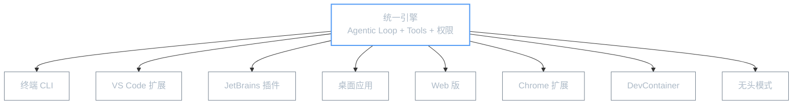
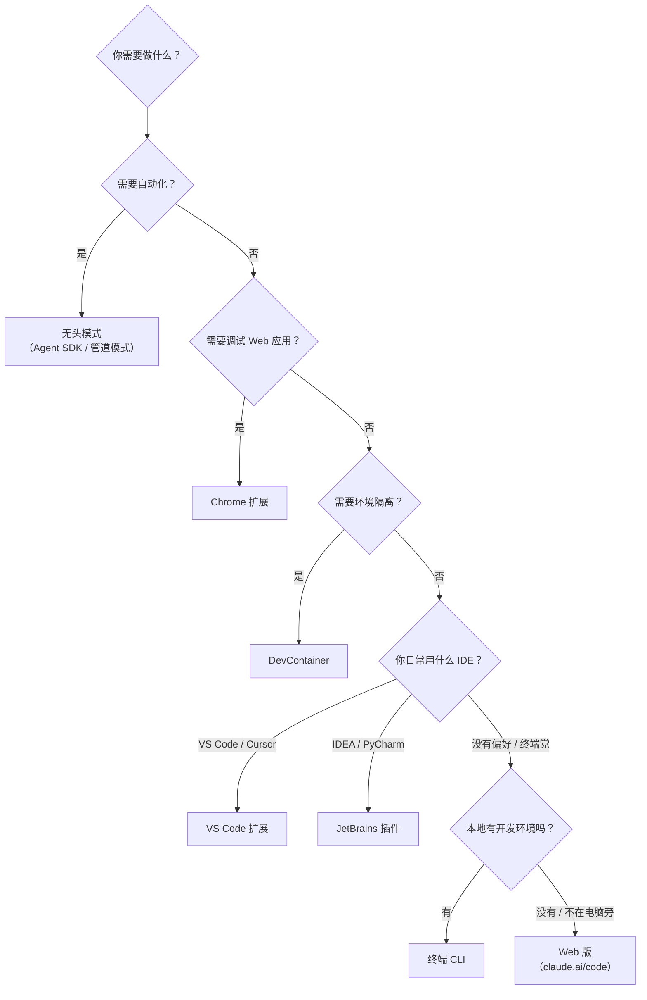

**本文你会学到**：

- 🎯 Claude Code 的统一底层引擎是什么，为什么跨平台体验一致
- 🖥️ 终端 CLI、VS Code 扩展、JetBrains 插件各自的特色功能
- 📱 桌面应用和 Web 版如何让非终端用户也能用上 Claude Code
- 🌐 Chrome 扩展和 DevContainer 两个特殊场景
- ⚙️ 无头模式（Headless）如何支撑自动化工作流

## 🗂️ 平台全景图

Claude Code 的核心是一个 **统一引擎** —— 无论你在哪个平台上使用，底层跑的都是同一套 Agentic Loop、同一套工具集、同一套权限系统。区别只在于**外壳**（用户界面）和**集成深度**（与宿主环境的交互程度）。

打个比方：Claude Code 的引擎就像一颗「处理器」，而各平台相当于不同的「主板」——处理器一样，但插在不同的主板上，能发挥的功能侧重点不同。



### 各平台一览

| 平台 | 交互方式 | 核心亮点 | 适合谁 |
|------|---------|---------|-------|
| **终端 CLI** | 命令行对话 | 功能最完整，所有特性均支持 | 重度终端用户、自动化脚本 |
| **VS Code 扩展** | IDE 侧边面板 | 内联 diff、`@` 提及、检查点 | VS Code / Cursor 用户 |
| **JetBrains 插件** | IDE 内嵌工具窗口 | 选中代码共享上下文、交互式 diff | IDEA / PyCharm / WebStorm 用户 |
| **桌面应用** | 图形化界面 | 多会话并行、定时任务、Cloud 同步 | 不习惯终端的开发者 |
| **Web 版** | 浏览器访问 | 无需本地安装、Cloud VM 运行 | 临时使用、手机访问 |
| **Chrome 扩展** | 浏览器控制台 | 调试 Web 应用、Computer Use | 前端调试场景 |
| **DevContainer** | 隔离容器 | 一致的开发环境、零配置 | 团队协作、多项目切换 |
| **无头模式** | 编程调用 | 结构化输出、Agent SDK 集成 | CI/CD、自动化工作流（v2.0.24 新增 Sandbox 模式） |

### 跨平台共享什么

无论你在哪个平台启动 Claude Code，以下内容都是**共享和同步**的：

- `CLAUDE.md` 项目配置（全局级 + 项目级）
- MCP 服务器配置
- Settings 和权限偏好
- `claude.ai` 上的会话历史（通过 Cloud 同步）

这就意味着你可以在 IDEA 里开始一段对话，切到 Web 版继续，最后在终端里收尾 —— 上下文不会丢失。

## 🖥️ 终端 CLI

终端 CLI 是 Claude Code 的**原生形态**，也是功能最完整的版本。所有其他平台本质上都是对 CLI 能力的封装和适配。

### 安装方式

Claude Code 提供多种安装渠道，选择你最顺手的即可：

=== "Windows PowerShell"

``` powershell
irm https://claude.ai/install.ps1 | iex
```

=== "Windows CMD"

``` cmd
curl -fsSL https://claude.ai/install.cmd -o install.cmd && install.cmd && del install.cmd
```

=== "WinGet"

``` powershell
winget install Anthropic.ClaudeCode
```

=== "macOS / Linux"

``` bash
curl -fsSL https://claude.ai/install.sh | bash
```

=== "Homebrew"

``` bash
brew install claude-code
```

=== "npm"

``` bash
npm install -g @anthropic-ai/claude-code
```

安装完成后，在终端输入 `claude` 即可启动。

### 核心特性

CLI 模式提供所有平台中**最完整的特性集**：

| 特性 | 说明 |
|------|------|
| 全屏渲染 | 利用终端的 **Alternate Screen Buffer**，渲染完成后自动恢复原始内容 |
| 无闪烁模式 | 设置 `CLAUDE_CODE_NO_FLICKER=1` 环境变量可减少重绘闪烁 |
| 权限模式 | `Ask`（默认）/ `Auto accept edits` / `Plan` / `Auto` / `Bypass` |
| 会话恢复 | `/resume` 恢复历史会话 |
| 检查点 | `/checkpoint` 创建代码快照，`/undo` 回退 |
| 斜杠命令 | `/model`、`/permissions`、`/config`、`/compact` 等 |

### 何时选择 CLI

- 你日常就在终端工作，不想切换到别的界面
- 你需要用脚本驱动 Claude Code（结合无头模式）
- 你需要所有最新特性，不想等扩展适配

## 📝 VS Code 扩展

VS Code 扩展将 Claude Code 嵌入编辑器侧边栏，让你**不用离开 IDE 就能和 Claude 对话**（v2.0.0 作为原生扩展发布）。

### 安装

在 VS Code 扩展商店搜索 **"Claude Code"**，点击安装即可。如果你的编辑器是 Cursor，操作方式一样。

### 与 CLI 的区别

VS Code 扩展的核心价值在于**与编辑器的深度集成**，它多了以下能力：

| 能力 | CLI | VS Code 扩展 |
|------|-----|-------------|
| 内联 Diff 预览 | ❌ 只在终端显示 | ✅ 在编辑器中打开 diff 视图，可逐行审阅 |
| `@` 提及文件 | ✅ 手动输入路径 | ✅ `@` 触发文件选择器，直接选取 |
| 选中代码共享 | ✅ 需要复制粘贴 | ✅ 选中代码后自动作为上下文 |
| 计划评审 | ❌ | ✅ Plan 模式下可在编辑器中审阅方案 |
| 检查点 | ✅ `/checkpoint` | ✅ 面板中可视化查看和恢复 |
| 会话历史 | ✅ `/resume` | ✅ 侧边栏历史列表，一键恢复（v2.1.16 新增远程会话浏览和原生插件管理） |

### 典型工作流

1. 在编辑器中写代码，遇到问题选中代码
2. 在侧边栏输入 `@` 提及相关文件
3. Claude 生成修改方案，你在 diff 视图中审阅
4. 确认后 Claude 应用更改

## 🔌 JetBrains 插件

JetBrains 插件支持 IntelliJ IDEA、PyCharm、WebStorm、GoLand 等 JetBrains 全家桶，让你在熟悉的 Java/Python/前端 IDE 中直接使用 Claude Code。

### 安装

在 JetBrains Marketplace 搜索 **"Claude Code"**，安装后重启 IDE。

### 特色功能

| 功能 | 说明 |
|------|------|
| 选中代码上下文 | 选中一段代码后调用 Claude Code，选中内容自动作为上下文传入 |
| 交互式 Diff | Claude 的代码修改以交互式 diff 形式展示，支持逐 hunk 接受/拒绝 |
| 工具窗口 | Claude Code 作为独立的 Tool Window 嵌入 IDE 底部或侧边 |

### 与 IDEA MCP 的区别

如果你已经在用 JetBrains 的 **MCP Server**（通过 `idea` MCP 调用 `get_symbol_info`、`build_project` 等工具），你可能会疑惑这两个东西的关系：

- **JetBrains 插件**：把 Claude Code 的完整对话体验嵌入 IDE，你获得的是一个 **Agent**（能自主思考、多步操作）
- **IDEA MCP Server**：把 IDE 的能力（代码补全、重构、构建）暴露为 MCP 工具，让 Claude Code **调用**这些能力

两者是**互补关系**：插件提供 UI 入口，MCP 提供 IDE 能力。最佳实践是同时安装插件和配置 MCP Server。

## 🖼️ 桌面应用

Claude Code Desktop 是一个**独立的图形化应用**，为不习惯终端的用户提供了更友好的入口（v2.0.51 发布）。

### 核心体验

桌面应用提供三个标签页：

| 标签页 | 用途 |
|--------|------|
| **Code** | 编程模式，等同于 CLI 的 Agentic Loop |
| **Cowork** | 协作模式，Claude 以协作者身份参与 |
| **Chat** | 对话模式，用于通用问答和知识查询 |

### 特色功能

| 功能 | 说明 |
|------|------|
| 可视化 Diff | 修改以图形化 diff 展示，比终端更直观 |
| 多会话并行 | 同时打开多个对话，适合同时处理多个任务 |
| 定时任务 | 设置定时执行的任务（需 Claude Max 订阅） |
| Cloud 同步 | 会话自动同步到 `claude.ai`，可在任何设备上继续 |
| Teleport | 在 Web 版和桌面版之间无缝迁移会话（v2.0.24 新增 Web → CLI teleport，v2.1.0 新增 `/teleport` 和 `/remote-env` 命令） |

### 何时选择桌面应用

- 你不太习惯终端操作，更喜欢图形界面
- 你需要同时处理多个独立任务
- 你想在本地开始一个任务，之后在手机上继续

## 🌐 Web 版

Web 版让你**无需安装任何东西**，直接在浏览器中使用 Claude Code。

### 访问方式

打开 `claude.ai/code` 即可使用。它实际上运行在 Anthropic 的 **Cloud VM** 上，所以你的本地机器不需要有开发环境。

### 工作原理

Web 版的核心是 **Teleport 技术**（v2.0.24 新增）：你的代码会自动上传到 Anthropic 的云端虚拟机，Claude Code 在云端运行，修改后的代码再同步回你的 GitHub 仓库。

这意味着：

- ✅ 你可以处理**不在本地的仓库**（比如 GitHub 上的开源项目）
- ✅ 适合**长时间运行**的任务（不怕关掉电脑）
- ✅ 手机上也能用（通过 Claude iOS App）
- ⚠️ 需要稳定的网络连接
- ⚠️ 首次使用需要授权 GitHub 访问权限

### 何时选择 Web 版

- 你在别人的电脑上临时需要使用
- 你想处理一个只存在于 GitHub 上的项目
- 你需要跑一个长时间任务，不想占用本地资源

## 🧩 Chrome 扩展

Chrome 扩展是一个**比较特殊的存在**（v2.0.72 推出 Beta 版） —— 它不是为了在浏览器里写代码，而是为了让 Claude Code 能够**控制和调试 Web 应用**。

### 核心能力

Chrome 扩展通过 **Native Messaging** 协议与本地运行的 Claude Code CLI 通信，从而实现：

| 能力 | 说明 |
|------|------|
| Computer Use | Claude Code 可以控制浏览器——点击、输入、滚动页面 |
| Web 调试 | 直接在你正在开发的 Web 应用上操作和调试 |
| 页面交互 | Claude Code 能「看到」浏览器中的内容并与之交互 |

### 使用场景

一个典型场景：你的前端项目有一个交互 bug（按钮点击后没反应），你可以：

1. 启动 Chrome 扩展
2. 告诉 Claude Code："打开 `localhost:3000`，点击提交按钮，看看发生了什么"
3. Claude Code 通过扩展控制浏览器，观察实际行为，分析问题

### 注意事项

- Chrome 扩展**不是独立运行**的，它需要本地同时运行 Claude Code CLI
- Computer Use 目前支持 macOS 和 Windows
- 它本质上是一种**浏览器自动化**能力，类比 Selenium/Playwright，但由 AI 驱动

## 📦 DevContainer 支持

DevContainer（Development Container）让你在 **Docker 容器**中运行 Claude Code，实现开发环境的完全隔离。

### 为什么需要 DevContainer

想象你有三个项目：一个用 Node.js 18，一个用 Node.js 20，还有一个用 Python 3.12。每次切换项目都需要调整环境，一不小心就会版本冲突。

DevContainer 的解决方式是：**每个项目一个独立的 Docker 容器**，容器内包含该项目所需的一切依赖。Claude Code 在容器内运行，自然也就用上了正确的环境。

### 如何使用

在你的项目根目录下创建 `.devcontainer/devcontainer.json`，定义容器配置，然后：

1. 在 VS Code 中打开项目
2. VS Code 提示 "Reopen in Container" 时点击确认
3. Claude Code 自动在容器内启动

Claude Code 能自动检测 DevContainer 环境，无需额外配置。

### 典型配置

```json title=".devcontainer/devcontainer.json"
{
  "name": "My Project",
  "image": "mcr.microsoft.com/devcontainers/typescript-node:20",
  "customizations": {
    "vscode": {
      "extensions": ["anthropic.claude-code"]
    }
  }
}
```

### 适用场景

- 团队协作：确保所有成员使用**完全一致**的开发环境
- 多项目切换：不同项目的依赖互不干扰
- CI/CD 对齐：本地环境和 CI 环境保持一致

## ⚙️ 无头模式（Headless）

无头模式是 Claude Code 的**非交互运行方式**，主要用于自动化场景。你不会看到对话界面，Claude Code 直接接收指令、执行任务、返回结果。

### 核心概念

所有其他平台都是**交互式**的——你来我往地对话。而无头模式是**批处理式**的——给一个输入，等一个输出。

### 使用方式

无头模式有两种运行形态：

=== "管道模式"

管道模式通过 `-p` 参数将 prompt 直接传入，适合简单任务：

``` bash
# 让 Claude Code 分析一个文件的代码质量
claude -p "审查 src/utils/parser.ts 的代码质量，给出改进建议"

# 将结果输出为 JSON 格式，方便后续处理
claude -p "列出项目中所有 TODO 注释" --output-format json

# 指定输出到文件
claude -p "为这个 API 写单元测试" --output-file tests/api.test.ts
```

=== "Agent SDK"

Agent SDK（`@anthropic-ai/claude-code`）让你用 **JavaScript/TypeScript 编程调用** Claude Code，适合复杂的多步自动化工作流：

``` typescript title="automate.ts"
import { Claude } from "@anthropic-ai/claude-code";

const claude = new Claude();

// 执行一个多步任务
const result = await claude.messages.create({
  prompt: "为 UserService 添加邮箱验证功能，并运行测试验证",
  options: {
    allowedTools: ["Read", "Write", "Bash", "MultiEdit"],
    maxTurns: 20
  }
});

console.log(result);
```

### 关键参数

| 参数 | 说明 | 示例 |
|------|------|------|
| `-p` | 传入 prompt（管道模式） | `claude -p "审查代码"` |
| `--output-format` | 输出格式：`text` / `json` / `stream-json` | `--output-format json` |
| `--output-file` | 将结果写入文件 | `--output-file result.md` |
| `--bare` | 精简输出，只返回文本内容，去除对话元数据 | `claude -p "..." --bare` |
| `--max-turns` | 限制 Agentic Loop 最大轮次 | `--max-turns 10` |
| `--allowedTools` | 限制可使用的工具 | `--allowedTools Read Write` |
| `--system-prompt` | 自定义系统提示 | `--system-prompt "用中文回答"` |

### `--bare` 模式

`--bare` 是无头模式中非常实用的选项。普通模式下 Claude Code 的输出包含工具调用、思考过程等元数据；加上 `--bare` 后，输出就只剩下**纯净的文本结果**，适合作为其他程序的输入：

``` bash
# 普通模式输出：包含工具调用过程
claude -p "这个函数的时间复杂度是多少"
# 输出：[读取文件 src/sort.ts] ... [分析中] ... 这个函数的时间复杂度是 O(n²) ...

# --bare 模式输出：只有最终结果
claude -p "这个函数的时间复杂度是多少" --bare
# 输出：O(n²)
```

### 典型自动化场景

| 场景 | 方案 |
|------|------|
| CI 中自动代码审查 | GitHub Actions 中用管道模式运行审查 |
| PR 合并前自动检查 | GitLab CI 中用 Agent SDK 执行多步检查 |
| 批量重构 | 脚本循环调用 Claude Code，逐文件处理 |
| 定时任务 | 配合 cron 定期执行代码质量检查 |
| 自定义 Agent 工作流 | 用 Agent SDK 构建复杂的多 Agent 系统 |

### 权限处理

无头模式下 Claude Code 无法弹出交互式权限确认，需要预先配置：

- `--allowedTools`：明确指定允许使用的工具
- 在 `CLAUDE.md` 或 settings 中预配置权限规则
- 使用 `Bypass` 权限模式（仅限可信环境）

⚠️ **安全提示**：在生产 CI 环境中使用无头模式时，务必通过 `--allowedTools` 限制工具范围，避免 Claude Code 意外执行破坏性操作。

## 📝 平台选择指南

最后用一个决策流程帮你在实际工作中快速选择：



💡 **核心原则**：选你最顺手的平台就好。Claude Code 的能力是跨平台一致的，不存在"某个平台能用而另一个不能用"的功能。平台的区别只在于**交互体验**和**集成深度**——选择能让你最高效地描述需求、审阅结果的那一个。
