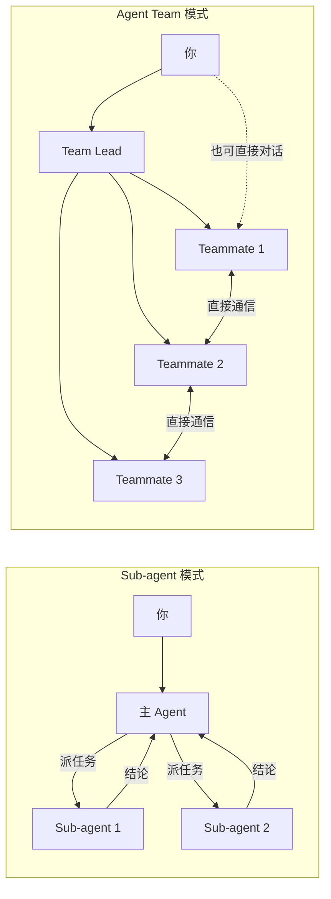

---
title: Sub-agents
description: 通过 Sub-agents 实现上下文隔离的并行任务，通过 Agent Teams 协调多个独立会话
---

# Sub-agents

**本文你会学到**：

- 🎯 Sub-agent 是什么，为什么需要它（类比：「派出去调研的实习生，回来只汇报结论」）
- 🧱 Sub-agent 的上下文隔离机制和配置方式
- 🔧 如何创建自定义 Sub-agent（工具限制、模型选择、权限控制）
- 🤝 Agent Teams 的协调机制，以及它与 Sub-agent 的本质区别
- 📊 通过对比表格，快速判断哪种方案适合你的场景
- 🚀 三个典型实践场景：并行研究、独立代码审查、多假设调试

## 🤔 为什么需要 Sub-agent

假设你正在和 Claude Code 讨论一个项目架构问题。聊到一半，你说「帮我看一下这个项目的数据库连接池是怎么配的」。Claude 开始翻文件、读代码，读了一大堆配置文件和工具类——这些中间过程全部挤进了你的**主对话上下文**。

问题来了：上下文窗口是有限的。那些中间过程的代码片段、文件路径、调试输出，对你来说只是噪音，但它们实实在在地占用了上下文空间。等 Claude 把结论告诉你之后，这些中间信息依然留在上下文里，既浪费 token，又可能干扰后续对话。

**Sub-agent 就是来解决这个问题的。**

你可以把 Sub-agent 想象成一个**派出去调研的实习生**：你给他一个任务，他跑到自己的工位上独立完成调研，翻一堆文件、做一堆分析，最后只带着一份精炼的结论报告回来交给你。你的办公桌上不会堆满他调研过程中的草稿纸——所有中间过程都留在了他自己的工位上。

用技术语言来说：Sub-agent 运行在**独立的上下文窗口**中，只有最终结论会返回主对话。这样既保护了主对话的上下文空间，又让调研过程不受主对话干扰。

### 隔离 > 并行

很多人第一次接触 Sub-agent 时，关注点在"并行"——同时派多个任务出去能省时间。但用久了你会发现，**Sub-agent 最大的价值其实是隔离**。

扫代码库、跑测试、做审查这类会产生大量输出的事，塞进主线程很快就把有效上下文挤没了。交给 Subagent 做，主线程只拿一个摘要，干净很多。即使只派一个 Sub-agent（不并行），隔离带来的收益也非常可观。

除了**节省上下文**，Sub-agent 还能帮你做到：

- ⚙️ **限制工具**：你可以规定 Sub-agent 只能读不能写，防止它误改文件
- 💰 **控制成本**：把简单任务路由到更便宜的模型（如 Haiku），复杂任务用 Opus
- 🧩 **专业分工**：给不同领域设定专门的系统提示词，让每个 Sub-agent 成为该领域的专家

## ⚙️ Sub-agent 工作原理

### 上下文隔离

Sub-agent 最核心的特性就是**上下文隔离**。每次调用 Sub-agent 时，Claude Code 会为它创建一个全新的上下文窗口，和主对话完全独立。

``` mermaid
graph TB
    subgraph 主对话上下文
        A[用户提问] --> B[Claude 判断需要调研]
        B --> C["派发任务给 Sub-agent"]
        C --> D["收到结论摘要"]
        D --> E[继续对话]
    end

    subgraph Sub-agent 上下文（独立）
        F[接收任务] --> G[读文件 A]
        G --> H[读文件 B]
        H --> I[分析整理]
        I --> J["返回结论（仅摘要）"]
    end

    C -.->|任务| F
    J -.->|摘要| D
```

中间的大量文件读取和代码分析（G、H、I）全部发生在 Sub-agent 的上下文中，只有最后的结论（J）才会回到主对话。主对话的上下文里看不到 Sub-agent 读了哪些文件、中间走了什么弯路。

💡 这就好比你让实习生去调研竞品，你只需要他回来后的 PPT 总结，不需要看他调研时开了多少个浏览器标签页。

### 上下文继承与共享

虽然上下文是隔离的，但 Sub-agent 并非完全从零开始。它会继承以下内容：

| 继承项 | 说明 |
|--------|------|
| 项目上下文 | `CLAUDE.md`、`.mcp.json` 等 |
| 工作目录 | 和主对话相同的工作目录 |
| 权限设置 | 默认继承主对话的权限模式 |

**不会继承**的内容：

- ❌ 主对话的聊天历史（你和 Claude 之前聊了什么，Sub-agent 不知道）
- ❌ 主对话的 Skills（除非在 Sub-agent 定义中显式声明）
- ❌ 主对话的中间推理过程

⚠️ 这意味着你需要在任务描述中把 Sub-agent 需要知道的背景信息说清楚。不要假设它「已经知道」你在主对话里讨论过什么。

### 自定义 Sub-agent

Claude Code 内置了几个 Sub-agent（`Explore`（v2.0.17 引入）、`Plan`、`general-purpose`），但你也可以创建自己的。自定义 Sub-agent 本质上是一个 **Markdown 文件 + YAML 前置配置**。

#### 存放位置与优先级

Sub-agent 定义文件按优先级从高到低排列：

| 位置 | 作用范围 | 说明 |
|------|---------|------|
| 托管设置 | 组织全局 | 由管理员部署 |
| `--agents` CLI 参数 | 当前会话 | 启动时传入 JSON（v2.0.0 新增） |
| `.claude/agents/` | 当前项目 | 可提交到 Git，团队共享 |
| `~/.claude/agents/` | 所有项目 | 个人全局 |
| 插件的 `agents/` 目录 | 插件启用范围 | 随插件安装 |

同名时，高优先级覆盖低优先级。

#### 定义文件格式

``` yaml title=".claude/agents/code-reviewer.md"
---
name: code-reviewer
description: 代码审查专家。编写或修改代码后自动触发。
tools: Read, Grep, Glob, Bash
model: sonnet
---

你是一个高级代码审查工程师。

收到审查请求后：
1. 运行 `git diff` 查看最近变更
2. 聚焦修改的文件
3. 立即开始审查

审查清单：

- 代码是否清晰可读
- 函数和变量命名是否合理
- 是否存在重复代码
- 异常处理是否完善
- 是否暴露了密钥或 API Key
- 输入校验是否到位

反馈按优先级组织：

- 严重问题（必须修复）
- 警告（建议修复）
- 建议（可以改进）
```

前置配置中的关键字段：

| 字段 | 必填 | 说明 |
|------|------|------|
| `name` | ✅ | 唯一标识符，使用小写字母和连字符 |
| `description` | ✅ | 描述何时该委派给这个 Sub-agent |
| `tools` | ❌ | 允许使用的工具（白名单）。省略则继承全部 |
| `disallowedTools` | ❌ | 禁止使用的工具（黑名单） |
| `model` | ❌ | 使用的模型：`sonnet`、`opus`、`haiku`、`inherit`（默认） |
| `permissionMode` | ❌ | 权限模式：`default`、`acceptEdits`、`auto`、`plan` 等 |
| `maxTurns` | ❌ | 最大对话轮数限制 |
| `skills` | ❌ | 预加载的 Skills 列表 |
| `memory` | ❌ | 持久记忆范围：`user`、`project`、`local` |
| `isolation` | ❌ | 设为 `worktree` 时在独立 git worktree 中运行（v2.1.49 新增） |
| `background` | ❌ | 设为 `true` 时始终后台运行（v2.1.49 新增） |
| `hooks` | ❌ | 生命周期钩子配置 |

#### 工具限制：白名单 vs 黑名单

有两种方式限制 Sub-agent 的能力：

**白名单**（`tools`）——只允许列出的工具：

```yaml
---
name: safe-researcher
description: 只读调研助手
tools: Read, Grep, Glob, Bash
---
```

**黑名单**（`disallowedTools`）——允许除列出外的所有工具：

```yaml
---
name: no-writes
description: 继承全部工具但禁止写文件
disallowedTools: Write, Edit
---
```

⚠️ 如果同时设置了 `tools` 和 `disallowedTools`，先应用黑名单移除，再从剩余工具中取白名单交集。

#### 用 Hooks 做精细控制

当简单的工具黑名单不够用的时候（比如你想允许 `Bash` 但只允许执行 `SELECT` 查询），可以用 `PreToolUse` Hook 做运行时校验：

``` yaml title=".claude/agents/db-reader.md"
---
name: db-reader
description: 执行只读数据库查询
tools: Bash
hooks:
  PreToolUse:
    - matcher: "Bash"
      hooks:
        - type: command
          command: "./scripts/validate-readonly-query.sh"
---
```

校验脚本通过 `exit 2` 阻止写入操作，错误信息会反馈给 Claude：

``` bash title="scripts/validate-readonly-query.sh"
#!/bin/bash
INPUT=$(cat)
COMMAND=$(echo "$INPUT" | jq -r '.tool_input.command // empty')

# 阻止 SQL 写操作
if echo "$COMMAND" | grep -iE '\b(INSERT|UPDATE|DELETE|DROP|CREATE|ALTER)\b' > /dev/null; then
  echo "只允许 SELECT 查询" >&2
  exit 2
fi
exit 0
```

#### 触发 Sub-agent 的三种方式

| 方式 | 语法 | 特点 |
|------|------|------|
| 自然语言 | `用 code-reviewer 审查一下` | Claude 自行判断是否委派 |
| @-mention | `@"code-reviewer (agent)" 审查一下` | 保证使用指定 Sub-agent |
| 会话级 | `claude --agent code-reviewer` | 整个会话都使用该 Sub-agent 的配置 |

## 🤝 Agent Teams

### 与 Sub-agent 的区别

如果说 Sub-agent 是「派出去调研的实习生」，那 Agent Team 就更像是「组建一个项目组」。

Sub-agent 和 Agent Team 都能实现并行工作，但它们的协作模式完全不同：



关键区别一目了然：

| 维度 | Sub-agent | Agent Team |
|------|-----------|------------|
| **上下文** | 独立窗口，结果返回主对话 | 独立窗口，完全独立运行 |
| **通信** | 只能向主 Agent 汇报 | Teammate 之间可以直接通信 |
| **协调** | 主 Agent 统一管理 | 共享任务列表，自主协调 |
| **用户交互** | 通过主对话间接交互 | 可以直接和任意 Teammate 对话 |
| **适用场景** | 结果导向的聚焦任务 | 需要讨论和协作的复杂任务 |
| **Token 成本** | 较低（结果汇总到主上下文） | 较高（每个 Teammate 都是独立实例） |

💡 简单说：**需要协作就用 Agent Team，只需要结果就用 Sub-agent。**

### 何时使用 Agent Teams

Agent Teams 最适合以下场景：

- 🔍 **多角度研究**：多个 Teammate 同时调查问题的不同方面，然后互相分享、质疑发现
- 🧱 **新模块/功能开发**：每个 Teammate 负责一个独立模块，互不干扰
- 🧪 **多假设调试**：Teammate 们同时测试不同的理论，更快收敛到答案
- 🔗 **跨层协调**：前端、后端、测试分别由不同 Teammate 负责

!!! warning "注意开销"
    Agent Teams 的 Token 消耗远高于单会话。每个 Teammate 都有独立的上下文窗口，Token 用量随 Teammate 数量线性增长。对于顺序任务、同文件编辑或强依赖任务，单会话或 Sub-agent 更合适。

### Team 的协调机制

#### 启用 Agent Teams

Agent Teams 默认关闭（v2.1.32 作为研究预览引入），需要手动启用：

``` json title="settings.json"
{
  "env": {
    "CLAUDE_CODE_EXPERIMENTAL_AGENT_TEAMS": "1"
  }
}
```

#### 核心架构

一个 Agent Team 由以下组件构成：

| 组件 | 角色 |
|------|------|
| **Team Lead** | 主会话，负责创建团队、分配任务、综合结果 |
| **Teammates** | 独立的 Claude Code 实例，各自处理分配的任务 |
| **Task List** | 共享任务列表，Teammate 认领和完成任务 |
| **Mailbox** | Agent 之间的消息系统 |

#### 共享任务列表

任务列表是 Team 协调的核心机制。每个任务有三种状态：

- `pending`（待处理）→ `in progress`（进行中）→ `completed`（已完成）

任务之间可以设置**依赖关系**：有未完成依赖的任务不能被认领。当被依赖的任务完成后，阻塞自动解除。

两种分配方式：

- **Lead 指派**：你告诉 Lead 把哪个任务分给哪个 Teammate
- **自主认领**：Teammate 完成当前任务后，自动认领下一个未分配、未阻塞的任务（通过文件锁防止竞争）

#### 显示模式

| 模式 | 说明 | 要求 |
|------|------|------|
| `in-process` | 所有 Teammate 在同一终端，用 `Shift+Down` 切换 | 任何终端 |
| `split panes` | 每个 Teammate 独占一个面板，可同时查看所有输出 | tmux 或 iTerm2 |

默认 `auto`：如果在 tmux 中则用分屏，否则用 in-process。

#### 计划审批机制

对于复杂或高风险任务，可以让 Teammate 先出方案，审批后再动手：

```
派一个架构师 Teammate 重构认证模块。要求他先出方案，审批后再改代码。
```

Teammate 在只读的 plan mode 下工作，方案完成后提交给 Lead 审批。Lead 批准后，Teammate 退出 plan mode 开始实施。如果被拒绝，Teammate 根据反馈修改方案后重新提交。

#### 质量门控

通过 Hooks 在关键节点强制质量检查：

| Hook 事件 | 触发时机 | 用途 |
|-----------|---------|------|
| `TeammateIdle` | Teammate 即将空闲 | `exit 2` 发送反馈让它继续工作 |
| `TaskCreated` | 任务被创建 | `exit 2` 阻止创建并发送反馈 |
| `TaskCompleted` | 任务被标记完成 | `exit 2` 阻止完成并发送反馈 |

## 🎯 实践场景

### 并行研究多个方向

当你需要同时调查一个项目的多个方面时，Sub-agent 的并行能力特别有用：

```
用多个 Sub-agent 并行调研认证模块、数据库模块和 API 模块的实现
```

每个 Sub-agent 独立探索各自领域，完成后 Claude 综合所有发现。前提是各研究方向之间没有依赖关系。

💡 **小技巧**：对于简单的并行调研，Sub-agent 就够了。如果调研之间需要互相讨论、质疑对方的发现，才需要升级到 Agent Team。

### 独立代码审查

一个审查者往往会偏向某一类问题。把审查标准拆分到独立领域，可以让安全、性能、测试覆盖都得到充分关注：

```
创建一个 Agent Team 来审查 PR #142。生成三个审查者：
- 一个关注安全影响
- 一个检查性能影响
- 一个验证测试覆盖率
```

每个审查者从同一个 PR 出发，但应用不同的审查视角。全部完成后，Lead 综合三个方向的发现。

#### 用 Sub-agent 实现轻量版审查

如果不需要 Teammate 之间的协作，用 Sub-agent 也能做代码审查，而且 Token 成本更低：

``` yaml title=".claude/agents/code-reviewer.md"
---
name: code-reviewer
description: 代码审查专家，代码变更后主动触发
tools: Read, Grep, Glob, Bash
model: inherit
---

你是一个高级代码审查工程师，确保代码质量和安全性。

收到审查请求后：
1. 运行 git diff 查看最近变更
2. 聚焦修改的文件
3. 立即开始审查

按优先级反馈：严重问题 > 警告 > 建议
```

### 多假设调试

单个 Agent 调试时容易陷入「锚定效应」——找到一个看似合理的解释后就停止搜索了。Agent Team 的对抗式调查可以有效解决这个问题：

```
用户反馈应用发送一条消息后就退出了，无法保持连接。
派 5 个 Teammate 分别调查不同假设，让他们互相讨论、尝试推翻对方的理论。
```

**对抗结构**是关键机制：顺序调查会受锚定效应影响，而多个独立调查者主动互相质疑，存活的假设更可能是真正的根因。

### ⚠️ Sub-agent 反模式

| ❌ 反模式 | ✅ 正确做法 | 为什么 |
|----------|-----------|--------|
| 子代理权限和主线程一样宽 | 用 `tools` 白名单或 `disallowedTools` 黑名单限制 | 权限一样宽 = 隔离没有意义 |
| 没有设定 `maxTurns` | 设置合理的轮数上限（如 20-50） | 防止子代理跑飞，无限循环 |
| 子任务之间强依赖，频繁共享中间状态 | 这种场景在主线程做，不用 Subagent | Subagent 之间无法共享中间状态 |
| 子代理输出格式不固定 | 在定义文件中明确输出格式要求 | 主线程拿到没法用的结果等于白跑 |
| 用 Subagent 做只需要简单搜索的事 | 用 Glob/Grep 直接搜索 | 派子代理有启动开销，简单搜索不值得 |

v2.0.60 新增 Background Agents，支持后台运行并发送消息唤醒主 Agent。v2.1.0 进一步新增了 `Task(AgentName)` 语法用于禁用特定 Agent，以及 Ctrl+B 统一后台化操作。v2.1.83 为 Agent 定义新增了 `initialPrompt` 字段，支持自动提交首轮对话。

!!! warning "卡死的 Subagent 会自动失败"

    从 v2.1.113 起，Subagent 在 mid-stream 卡死超过 10 分钟后会**明确报错**而非静默挂起，避免你长时间等待一个永远不会回来的子任务。如果你查看一个正在运行的 subagent 时输入消息，消息现在会正确归属于这个 subagent，不会被误送给父 AI（v2.1.113 修复）。Agent Teams 队友请求工具权限时不再触发权限对话框崩溃（v2.1.114 修复）。

📝 **小结**：本节学习了三个典型的并行工作场景。核心思路是：**Sub-agent 适合「给我结果就行」的任务，Agent Team 适合「你们讨论一下再给我结论」的任务。** 选择哪种方式，取决于你的 Teammate 之间是否需要互相通信。
