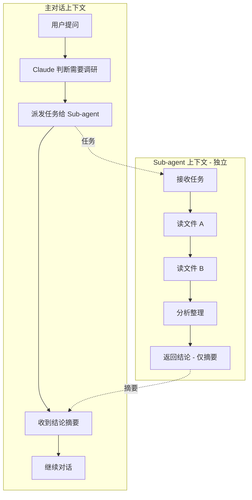
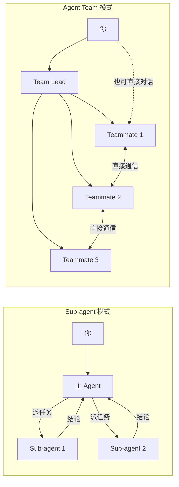

# Sub-agents

**本文你会学到**：

- 🎯 Sub-agent 是什么，为什么需要它（类比：「派出去调研的实习生，回来只汇报结论」）
- 🧱 Sub-agent 的上下文隔离机制和配置方式
- 🔧 如何创建自定义 Sub-agent（工具限制、模型选择、权限控制、MCP/Skills/记忆）
- 🎮 运行管理：前台/后台运行、恢复已完成的 Sub-agent
- 🔀 Fork 模式：继承主对话上下文的轻量子代理（实验性）
- 🤝 Agent Teams 的协调机制，以及它与 Sub-agent 的本质区别
- 📊 通过对比表格，快速判断哪种方案适合你的场景
- 🚀 三个典型实践场景：并行研究、独立代码审查、多假设调试

## 🤔 为什么需要 Sub-agent

假设你正在和 Claude Code 讨论一个项目架构问题。聊到一半，你说「帮我看一下这个项目的数据库连接池是怎么配的」。Claude 开始翻文件、读代码，读了一大堆配置文件和工具类——这些中间过程全部挤进了你的**主对话上下文**。

问题来了：上下文窗口是有限的。那些中间过程的代码片段、文件路径、调试输出，对你来说只是噪音，但它们实实在在地占用了上下文空间。等 Claude 把结论告诉你之后，这些中间信息依然留在上下文里，既浪费 token，又可能干扰后续对话。

**Sub-agent 就是来解决这个问题的。**

你可以把 Sub-agent 想象成一个**派出去调研的实习生**：你给他一个任务，他跑到自己的工位上独立完成调研，翻一堆文件、做一堆分析，最后只带着一份精炼的结论报告回来交给你。你的办公桌上不会堆满他调研过程中的草稿纸——所有中间过程都留在了他自己的工位上。

用技术语言来说：Sub-agent 运行在**独立的上下文窗口**中，只有最终结论会返回主对话。这样既保护了主对话的上下文空间，又让调研过程不受主对话干扰。

### 隔离 > 并行

很多人第一次接触 Sub-agent 时，关注点在"并行"——同时派多个任务出去能省时间。但用久了你会发现，**Sub-agent 最大的价值其实是隔离**。

扫代码库、跑测试、做审查这类会产生大量输出的事，塞进主线程很快就把有效上下文挤没了。交给 Subagent 做，主线程只拿一个摘要，干净很多。即使只派一个 Sub-agent（不并行），隔离带来的收益也非常可观。

除了**节省上下文**，Sub-agent 还能帮你做到：

- ⚙️ **限制工具**：你可以规定 Sub-agent 只能读不能写，防止它误改文件
- 💰 **控制成本**：把简单任务路由到更便宜的模型（如 Haiku），复杂任务用 Opus
- 🧩 **专业分工**：给不同领域设定专门的系统提示词，让每个 Sub-agent 成为该领域的专家

## ⚙️ Sub-agent 工作原理

### 上下文隔离

Sub-agent 最核心的特性就是**上下文隔离**。每次调用 Sub-agent 时，Claude Code 会为它创建一个全新的上下文窗口，和主对话完全独立。



中间的大量文件读取和代码分析（G、H、I）全部发生在 Sub-agent 的上下文中，只有最后的结论（J）才会回到主对话。主对话的上下文里看不到 Sub-agent 读了哪些文件、中间走了什么弯路。

💡 这就好比你让实习生去调研竞品，你只需要他回来后的 PPT 总结，不需要看他调研时开了多少个浏览器标签页。

### 上下文继承与共享

虽然上下文是隔离的，但 Sub-agent 并非完全从零开始。它会继承以下内容：

| 继承项 | 说明 |
|--------|------|
| 项目上下文 | `CLAUDE.md`、`.mcp.json` 等 |
| 工作目录 | 和主对话相同的工作目录 |
| 权限设置 | 默认继承主对话的权限模式 |

**不会继承**的内容：

- ❌ 主对话的聊天历史（你和 Claude 之前聊了什么，Sub-agent 不知道）
- ❌ 主对话的 Skills（除非在 Sub-agent 定义中显式声明）
- ❌ 主对话的中间推理过程

⚠️ 这意味着你需要在任务描述中把 Sub-agent 需要知道的背景信息说清楚。不要假设它「已经知道」你在主对话里讨论过什么。

## 🔧 自定义 Sub-agent

Claude Code 内置了几个 Sub-agent（`Explore`（v2.0.17 引入）、`Plan`、`general-purpose`），但你也可以创建自己的。自定义 Sub-agent 本质上是一个 **Markdown 文件 + YAML 前置配置**。

### 管理命令：/agents

`/agents` 命令打开交互式管理界面，包含两个选项卡：

- **Running**：查看正在运行的 Sub-agent，可打开或停止
- **Library**：查看所有可用 Sub-agent（内置、用户、项目、插件），创建/编辑/删除自定义 Sub-agent

命令行方式列出所有已配置的 Sub-agent：

```bash
rtk claude agents
```

### 存放位置与优先级

Sub-agent 定义文件按优先级从高到低排列：

| 位置 | 作用范围 | 说明 |
|------|---------|------|
| 托管设置 | 组织全局 | 由管理员部署，优先级最高 |
| `--agents` CLI 参数 | 当前会话 | 启动时传入 JSON，仅存在于该会话 |
| `.claude/agents/` | 当前项目 | 可提交到 Git，团队共享 |
| `~/.claude/agents/` | 所有项目 | 个人全局 |
| 插件的 `agents/` 目录 | 插件启用范围 | 随插件安装 |

同名时，高优先级覆盖低优先级。`--agents` 支持在一次调用中定义多个 Sub-agent：

```bash
rtk claude --agents '{
  "code-reviewer": {
    "description": "Expert code reviewer. Use proactively after code changes.",
    "prompt": "You are a senior code reviewer. Focus on code quality, security, and best practices.",
    "tools": ["Read", "Grep", "Glob", "Bash"],
    "model": "sonnet"
  }
}'
```

### 定义文件格式

```yaml title=".claude/agents/code-reviewer.md"
---
name: code-reviewer
description: 代码审查专家。编写或修改代码后自动触发。
tools: Read, Grep, Glob, Bash
model: sonnet
---

你是一个高级代码审查工程师。

收到审查请求后：
1. 运行 `git diff` 查看最近变更
2. 聚焦修改的文件
3. 立即开始审查

审查清单：

- 代码是否清晰可读
- 函数和变量命名是否合理
- 是否存在重复代码
- 异常处理是否完善
- 是否暴露了密钥或 API Key
- 输入校验是否到位

反馈按优先级组织：

- 严重问题（必须修复）
- 警告（建议修复）
- 建议（可以改进）
```

前置配置中的关键字段（分为核心字段和高级字段两组）：

**核心字段**（大多数场景只需这几个）：

| 字段 | 必填 | 说明 |
|------|------|------|
| `name` | ✅ | 唯一标识符，使用小写字母和连字符 |
| `description` | ✅ | 描述何时该委派给这个 Sub-agent。Claude 根据此描述决定何时委派 |
| `tools` | ❌ | 允许使用的工具（白名单）。省略则继承全部。支持 `Agent(agent_type)` 语法限制可生成的子代理类型 |
| `disallowedTools` | ❌ | 禁止使用的工具（黑名单） |
| `model` | ❌ | 使用的模型：`sonnet`、`opus`、`haiku`、完整模型 ID（如 `claude-opus-4-7`），或 `inherit`（默认） |
| `permissionMode` | ❌ | 权限模式：`default`、`acceptEdits`、`auto`、`dontAsk`、`bypassPermissions`、`plan` |
| `maxTurns` | ❌ | 最大对话轮数限制 |

**高级字段**（精细控制时按需配置）：

| 字段 | 必填 | 说明 |
|------|------|------|
| `skills` | ❌ | 预加载的 Skills 列表（完整内容直接注入上下文） |
| `mcpServers` | ❌ | 此子代理专用的 MCP 服务器（服务器名字符串引用或内联定义） |
| `memory` | ❌ | 持久记忆范围：`user`、`project`、`local` |
| `isolation` | ❌ | 设为 `worktree` 时在独立 git worktree 中运行（无变更时自动清理） |
| `background` | ❌ | 设为 `true` 时始终后台运行 |
| `effort` | ❌ | 覆盖此子代理的思考力度：`low`、`medium`、`high`、`xhigh`、`max`；可用级别取决于模型。默认继承会话设置 |
| `initialPrompt` | ❌ | 作为主会话 agent 运行时，自动提交为第一轮用户输入（v2.1.83 新增） |
| `color` | ❌ | 在任务列表和 transcript 中显示的颜色：`red`、`blue`、`green`、`yellow`、`purple`、`orange`、`pink`、`cyan` |
| `hooks` | ❌ | 生命周期钩子配置（`PreToolUse`、`PostToolUse`、`Stop` 最常用） |

!!! warning "插件 Sub-agent 限制"

    来自插件的 Sub-agent 不支持 `hooks`、`mcpServers` 和 `permissionMode` 字段——加载时这些字段会被忽略。如果需要这些功能，将 agent 文件复制到 `.claude/agents/` 或 `~/.claude/agents/`。

### 工具限制：白名单 vs 黑名单

有两种方式限制 Sub-agent 的能力：

**白名单**（`tools`）——只允许列出的工具：

```yaml
---
name: safe-researcher
description: 只读调研助手
tools: Read, Grep, Glob, Bash
---
```

**黑名单**（`disallowedTools`）——允许除列出外的所有工具：

```yaml
---
name: no-writes
description: 继承全部工具但禁止写文件
disallowedTools: Write, Edit
---
```

⚠️ 如果同时设置了 `tools` 和 `disallowedTools`，先应用黑名单移除，再从剩余工具中取白名单交集。

**限制可生成的子代理类型**：当 agent 作为主线程运行时（`claude --agent`），可以用 `Agent(agent_type)` 语法限制它能生成哪些子代理：

```yaml
---
name: coordinator
description: 协调多个专业 agent
tools: Agent(worker, researcher), Read, Bash
---
```

这是白名单——只有 `worker` 和 `researcher` 可以被生成。省略括号的 `Agent` 允许生成任何子代理。

### 模型选择策略

Claude Code 按以下顺序解析 Sub-agent 的模型：

1. `CLAUDE_CODE_SUBAGENT_MODEL` 环境变量（如果设置）
2. 每次调用时传入的 `model` 参数
3. Sub-agent 定义文件中的 `model` frontmatter
4. 主对话的模型

💡 实用技巧：简单任务（如文件搜索）用 `haiku` 省 token；复杂分析用 `sonnet` 平衡性能和成本；需要最强推理时用 `opus`。

### 权限模式

`permissionMode` 控制 Sub-agent 如何处理权限提示：

| 模式 | 行为 |
|------|------|
| `default` | 标准权限检查，带提示 |
| `acceptEdits` | 自动接受文件编辑和常见文件系统命令 |
| `auto` | 后台分类器审查命令和受保护目录的写入 |
| `dontAsk` | 自动拒绝权限提示（显式允许的工具仍然工作） |
| `bypassPermissions` | 跳过权限提示（慎用） |
| `plan` | Plan mode，只读探索 |

⚠️ 如果父级使用 `bypassPermissions` 或 `acceptEdits`，这优先级更高，子代理无法覆盖。父级使用 `auto` 时，子代理继承 auto mode，其 frontmatter 中的 `permissionMode` 被忽略。

### MCP 服务器限定

`mcpServers` 字段让 Sub-agent 可以使用主对话中没有的 MCP 服务器。每个条目可以是**内联定义**（仅该 Sub-agent 可用）或**字符串引用**（复用已配置的服务器）：

```yaml
---
name: browser-tester
description: 在真实浏览器中测试功能
mcpServers:
  # 内联定义：仅此 Sub-agent 可用
  - playwright:
      type: stdio
      command: npx
      args: ["-y", "@playwright/mcp@latest"]
  # 字符串引用：复用已配置的服务器
  - github
---
```

💡 把 MCP 服务器定义在 Sub-agent 里而不是 `.mcp.json` 中，可以让工具描述只消耗 Sub-agent 的上下文，不挤占主对话。

### Skills 预加载

`skills` 字段在 Sub-agent 启动时将 Skill 完整内容注入其上下文，而不是只让 Claude 知道有这个 Skill。Sub-agent **不会继承**主对话的 Skills，必须显式列出：

```yaml
---
name: api-developer
description: 按团队规范实现 API 端点
skills:
  - api-conventions
  - error-handling-patterns
---
```

### 持久记忆

`memory` 字段为 Sub-agent 提供跨会话的持久目录，用于积累知识（如代码库模式、调试经验、架构决策）：

```yaml
---
name: code-reviewer
description: 代码审查专家
memory: project
---
```

| 范围 | 存储位置 | 适用场景 |
|------|---------|---------|
| `user` | `~/.claude/agent-memory/<name>/` | 跨项目共享的知识 |
| `project` | `.claude/agent-memory/<name>/` | 项目专属，可提交 Git（推荐默认） |
| `local` | `.claude/agent-memory-local/<name>/` | 项目专属，不提交 Git |

启用记忆后，Sub-agent 的系统提示会包含记忆目录中 `MEMORY.md` 的前 200 行（或 25KB），以及策划 `MEMORY.md` 的说明。`Read`、`Write`、`Edit` 工具会自动启用，以便 Sub-agent 管理其记忆文件。

💡 使用建议：让 Sub-agent 在完成任务后更新记忆——"Now that you're done, save what you learned to your memory." 随着时间积累，Sub-agent 会越来越有效。

### 用 Hooks 做精细控制

当简单的工具黑名单不够用的时候（比如你想允许 `Bash` 但只允许执行 `SELECT` 查询），可以用 `PreToolUse` Hook 做运行时校验：

```yaml title=".claude/agents/db-reader.md"
---
name: db-reader
description: 执行只读数据库查询
tools: Bash
hooks:
  PreToolUse:
    - matcher: "Bash"
      hooks:
        - type: command
          command: "./scripts/validate-readonly-query.sh"
---
```

校验脚本通过 `exit 2` 阻止写入操作，错误信息会反馈给 Claude：

```bash title="scripts/validate-readonly-query.sh"
#!/bin/bash
INPUT=$(cat)
COMMAND=$(echo "$INPUT" | jq -r '.tool_input.command // empty')

# 阻止 SQL 写操作
if echo "$COMMAND" | grep -iE '\b(INSERT|UPDATE|DELETE|DROP|CREATE|ALTER)\b' > /dev/null; then
  echo "只允许 SELECT 查询" >&2
  exit 2
fi
exit 0
```

**项目级 Hooks**：在 `settings.json` 中配置，响应 Sub-agent 的生命周期事件：

| 事件 | 匹配器输入 | 触发时机 |
|------|-----------|---------|
| `SubagentStart` | Agent 类型名称 | Sub-agent 开始执行时 |
| `SubagentStop` | Agent 类型名称 | Sub-agent 完成时 |

```json title=".claude/settings.json"
{
  "hooks": {
    "SubagentStart": [
      {
        "matcher": "db-agent",
        "hooks": [
          { "type": "command", "command": "./scripts/setup-db-connection.sh" }
        ]
      }
    ],
    "SubagentStop": [
      {
        "hooks": [
          { "type": "command", "command": "./scripts/cleanup.sh" }
        ]
      }
    ]
  }
}
```

### 禁用特定 Sub-agent

通过 `settings.json` 中的 `permissions.deny` 阻止 Claude 使用特定 Sub-agent：

```json title=".claude/settings.json"
{
  "permissions": {
    "deny": ["Agent(Explore)", "Agent(my-custom-agent)"]
  }
}
```

或使用 CLI 标志：`claude --disallowedTools "Agent(Explore)"`。这对内置和自定义 Sub-agent 都有效。

### 触发方式

| 方式 | 语法 | 特点 |
|------|------|------|
| 自然语言 | `用 code-reviewer 审查一下` | Claude 自行判断是否委派 |
| @-mention | `@"code-reviewer (agent)" 审查一下` | 保证使用指定 Sub-agent |
| 会话级 | `claude --agent code-reviewer` | 整个会话使用该 Sub-agent 的系统提示和工具限制 |

**@-mention** 会出现在输入框的类型提示中，插件提供的 Sub-agent 显示为 `<plugin-name>:<agent-name>`。也可以手动输入 `@agent-<name>` 而不使用选择器。

**会话级**可以通过 `settings.json` 设为项目默认：

```json title=".claude/settings.json"
{
  "agent": "code-reviewer"
}
```

## 🎮 运行管理

### 前台与后台运行

Sub-agent 有两种运行模式：

- **前台**（默认）：阻塞主对话直到完成。权限提示和澄清问题会传递给你
- **后台**：并发运行，你可以继续工作。启动前 Claude Code 会预提示所需的工具权限，运行中自动拒绝未预先批准的操作。后台 Sub-agent 如果需要提问，该工具调用会失败但 Sub-agent 会继续

你可以主动要求 Claude "run this in the background"，或按 **Ctrl+B** 将运行中的任务放到后台。

⚠️ 后台 Sub-agent 因权限不足而失败时，可以启动一个前台 Sub-agent 执行相同任务，用交互式提示重试。

设置 `CLAUDE_CODE_DISABLE_BACKGROUND_TASKS=1` 环境变量可以禁用所有后台任务功能。

### 恢复 Sub-agent

每个 Sub-agent 调用都创建一个全新实例。要继续已有 Sub-agent 的工作，可以要求 Claude 恢复它——恢复的 Sub-agent 保留完整的对话历史（工具调用、结果、推理），从上次停止的地方继续。

```text
让 code-reviewer 审查认证模块
[Sub-agent 完成]

继续那个审查，现在分析授权逻辑
[Claude 恢复同一个 Sub-agent，带着之前的完整上下文]
```

Sub-agent 的转录独立于主对话持久化——即使主对话被压缩，Sub-agent 的转录不受影响。你可以通过恢复会话在重启 Claude Code 后继续之前的 Sub-agent。

## 🔀 Fork 模式（实验性）

Fork 是一种特殊的 Sub-agent，它**继承当前完整的对话历史**，而不是从头开始。这意味着 Fork 看到和你一样的上下文，你可以直接交给它一个辅助任务而不需要重新解释背景。

Fork 模式需要 Claude Code v2.1.117+，通过环境变量启用：

```json title="settings.json"
{
  "env": {
    "CLAUDE_CODE_FORK_SUBAGENT": "1"
  }
}
```

启用后的三个关键变化：

- Claude 在会使用 `general-purpose` Sub-agent 时改为生成 Fork
- 所有 Sub-agent 生成（包括命名 Sub-agent）都在后台运行
- `/fork` 命令生成 Fork 而不是 `branch` 的别名

```text
/fork draft unit tests for the parser changes so far
```

### Fork vs 命名 Sub-agent

| 维度 | Fork | 命名 Sub-agent |
|------|------|---------------|
| **上下文** | 完整的对话历史 | 全新上下文，只有你传递的提示 |
| **系统提示和工具** | 与主会话相同 | 来自定义文件 |
| **模型** | 与主会话相同 | 来自 `model` 字段 |
| **权限** | 提示在终端中出现 | 启动前预批准 |
| **Prompt cache** | 与主会话共享（更省钱） | 独立缓存 |

因为 Fork 的系统提示和工具与父级相同，它的第一个请求可以重用父级的 prompt cache，这比为相同上下文生成新 Sub-agent 更便宜。

### 观察与引导

运行中的 Fork 出现在输入框下方的面板中。使用以下快捷键管理：

| 按键 | 操作 |
|------|------|
| `↑` / `↓` | 在行之间移动 |
| `Enter` | 打开选中 Fork 的转录，发送后续消息 |
| `x` | 关闭已完成的 Fork 或停止运行中的 Fork |
| `Esc` | 返回输入框 |

Fork 无法生成进一步的 Fork。设置 `CLAUDE_CODE_DISABLE_BACKGROUND_TASKS=1` 可以保持生成同步。

## 🤝 Agent Teams

如果说 Sub-agent 是「派出去调研的实习生」，那 Agent Team 就更像是「组建一个项目组」。

> 本节按以下脉络展开：**概念对比**（Sub-agent vs Agent Team） → **启用与架构**（核心组件、角色定义） → **通信与协作**（任务列表、显示模式、计划审批） → **质量控制**（质量门控、最佳实践、已知限制）。你可以按顺序阅读，也可以直接跳到感兴趣的子节。

> 本节按以下脉络展开：**概念对比**（Sub-agent vs Agent Team） → **启用与架构**（核心组件、角色定义） → **通信与协作**（任务列表、显示模式、计划审批） → **质量控制**（质量门控、最佳实践、已知限制）。你可以按顺序阅读，也可以直接跳到感兴趣的子节。

Sub-agent 和 Agent Team 都能实现并行工作，但它们的协作模式完全不同：



关键区别一目了然：

| 维度 | Sub-agent | Agent Team |
|------|-----------|------------|
| **上下文** | 独立窗口，结果返回主对话 | 独立窗口，完全独立运行 |
| **通信** | 只能向主 Agent 汇报 | Teammate 之间可以直接通信 |
| **协调** | 主 Agent 统一管理 | 共享任务列表，自主协调 |
| **用户交互** | 通过主对话间接交互 | 可以直接和任意 Teammate 对话 |
| **适用场景** | 结果导向的聚焦任务 | 需要讨论和协作的复杂任务 |
| **Token 成本** | 较低（结果汇总到主上下文） | 较高（每个 Teammate 都是独立实例） |

💡 简单说：**需要协作就用 Agent Team，只需要结果就用 Sub-agent。**

### 何时使用 Agent Teams

Agent Teams 最适合以下场景：

- 🔍 **多角度研究**：多个 Teammate 同时调查问题的不同方面，然后互相分享、质疑发现
- 🧱 **新模块/功能开发**：每个 Teammate 负责一个独立模块，互不干扰
- 🧪 **多假设调试**：Teammate 们同时测试不同的理论，更快收敛到答案
- 🔗 **跨层协调**：前端、后端、测试分别由不同 Teammate 负责

Agent Teams 增加了协调开销，Token 用量随 Teammate 数量线性增长。当 Teammate 可以独立运作时效果最好；对于顺序任务、同文件编辑或强依赖任务，单会话或 Sub-agent 更有效。

### 启用 Agent Teams

Agent Teams 默认关闭（v2.1.32 作为研究预览引入），需要手动启用：

```json title="settings.json"
{
  "env": {
    "CLAUDE_CODE_EXPERIMENTAL_AGENT_TEAMS": "1"
  }
}
```

启用后，你可以请求 Claude 创建团队，或者 Claude 在判断任务适合并行时主动提议。

### 核心架构

一个 Agent Team 由以下组件构成：

| 组件 | 角色 |
|------|------|
| **Team Lead** | 主会话，负责创建团队、分配任务、综合结果 |
| **Teammates** | 独立的 Claude Code 实例，各自处理分配的任务 |
| **Task List** | 共享任务列表，Teammate 认领和完成任务 |
| **Mailbox** | Agent 之间的消息系统 |

团队和任务存储在本地：

- **团队配置**：`~/.claude/teams/{team-name}/config.json`
- **任务列表**：`~/.claude/tasks/{team-name}/`

### 为队友使用 Sub-agent 定义

生成 Teammate 时，可以引用任何 [Sub-agent 定义](#自定义-sub-agent)（项目、用户、插件或 CLI 定义）。这让你定义一个角色一次（如安全审查员），同时作为 Sub-agent 和 Teammate 复用：

```
使用 security-reviewer agent 类型生成一个 Teammate 来审计认证模块。
```

Teammate 遵守定义的 `tools` 和 `model`，定义的主体作为额外指示附加到 Teammate 的系统提示中。团队协调工具（`SendMessage`、任务管理）始终可用，不受 `tools` 限制。

⚠️ Sub-agent 定义中的 `skills` 和 `mcpServers` 在作为 Teammate 运行时不被应用。Teammate 从项目和用户设置加载 Skills 和 MCP 服务器，与常规会话相同。

### 上下文与通信

每个 Teammate 有自己的上下文窗口。生成时加载与常规会话相同的项目上下文（`CLAUDE.md`、MCP 服务器、Skills），但**不继承 Lead 的对话历史**。

**信息共享机制**：

- 📨 **自动消息传递**：Teammate 发送的消息自动送达收件人，Lead 不需要轮询
- 🔔 **空闲通知**：Teammate 完成并停止时自动通知 Lead
- 📋 **共享任务列表**：所有 Agent 都可以看到任务状态并认领可用工作
- 💬 **点对点消息**：按名称向特定 Teammate 发消息

💡 给 Teammate 足够的上下文——在生成提示中包含具体的任务细节（文件路径、技术栈、关注点），不要假设它知道 Lead 之前讨论过什么。

### 共享任务列表

任务列表是 Team 协调的核心机制。每个任务有三种状态：

- `pending`（待处理）→ `in progress`（进行中）→ `completed`（已完成）

任务之间可以设置**依赖关系**：有未完成依赖的任务不能被认领。当被依赖的任务完成后，阻塞自动解除。

两种分配方式：

- **Lead 指派**：你告诉 Lead 把哪个任务分给哪个 Teammate
- **自主认领**：Teammate 完成当前任务后，自动认领下一个未分配、未阻塞的任务（通过文件锁防止竞争）

### 显示模式

| 模式 | 说明 | 要求 |
|------|------|------|
| `in-process` | 所有 Teammate 在同一终端，用 `Shift+Down` 切换 | 任何终端 |
| `split panes` | 每个 Teammate 独占一个面板，可同时查看所有输出 | tmux 或 iTerm2 |

默认 `auto`：如果在 tmux 中则用分屏，否则用 in-process。可以通过配置覆盖：

```json title="~/.claude/settings.json"
{
  "teammateMode": "in-process"
}
```

或单次会话指定：`claude --teammate-mode in-process`

分割窗格模式需要 [tmux](https://github.com/tmux/tmux/wiki) 或 iTerm2（需安装 [`it2` CLI](https://github.com/mkusaka/it2) 并启用 Python API）。VS Code 集成终端、Windows Terminal 不支持分割窗格。

### 计划审批机制

对于复杂或高风险任务，可以让 Teammate 先出方案，审批后再动手：

```
派一个架构师 Teammate 重构认证模块。要求他先出方案，审批后再改代码。
```

Teammate 在只读的 plan mode 下工作，方案完成后提交给 Lead 审批。Lead 批准后，Teammate 退出 plan mode 开始实施。如果被拒绝，Teammate 根据反馈修改方案后重新提交。

### 关闭与清理

**关闭 Teammate**：

```
让 researcher Teammate 关闭
```

Lead 发送关闭请求，Teammate 可以批准并优雅退出，或拒绝并给出解释。

**清理团队**：

```
清理团队
```

⚠️ 始终通过 Lead 清理。Teammate 不应该运行清理操作。清理前需先关闭所有活跃的 Teammate——如果有仍在运行的 Teammate，清理会失败。

`EnterWorktree` 工具从 v2.1.128 起按文档从本地 HEAD 创建新分支（而非 `origin/<default-branch>`），这意味着你尚未推送到远程的本地提交不会被丢失。

### 质量门控

通过 Hooks 在关键节点强制质量检查：

| Hook 事件 | 触发时机 | 用途 |
|-----------|---------|------|
| `TeammateIdle` | Teammate 即将空闲 | `exit 2` 发送反馈让它继续工作 |
| `TaskCreated` | 任务被创建 | `exit 2` 阻止创建并发送反馈 |
| `TaskCompleted` | 任务被标记完成 | `exit 2` 阻止完成并发送反馈 |

### 最佳实践

**团队规模**：从 3-5 个 Teammate 开始。每个 Teammate 分配 5-6 个任务能让所有人保持生产力而不过度上下文切换。3 个专注的 Teammate 通常胜过 5 个分散的。

**任务大小**：

- 太小：协调开销超过收益
- 太大：Teammate 长时间工作不检查，增加浪费风险
- 恰好：自包含的单位，产出清晰的交付物（一个函数、一个测试文件、一份审查）

**避免文件冲突**：两个 Teammate 编辑同一文件会导致覆盖。拆分工作让每个 Teammate 拥有不同的文件集。

**监控与引导**：定期检查 Teammate 进度，重定向无效方法。无人值守运行太久会增加浪费风险。

**从研究开始**：如果你是 Agent Teams 新手，先从不需要写代码的任务开始（审查 PR、调研库、调查 Bug），再尝试并行实施。

### 已知限制

Agent Teams 是实验性功能，当前有以下限制：

- ❌ **In-process Teammate 无会话恢复**：`/resume` 和 `/rewind` 不会恢复 in-process Teammate。恢复会话后 Lead 可能向不存在的 Teammate 发消息——需重新生成
- ❌ **任务状态可能滞后**：Teammate 有时未能标记任务为已完成，阻塞依赖任务。需手动检查并更新
- ❌ **关闭可能较慢**：Teammate 关闭前会完成当前请求或工具调用
- ❌ **每个会话一个团队**：Lead 同时只能管理一个团队
- ❌ **无嵌套团队**：Teammate 无法生成自己的团队
- ❌ **Lead 固定**：创建团队的会话是 Lead，无法转移领导权
- ❌ **权限在生成时设置**：所有 Teammate 从 Lead 的权限模式开始，可以在生成后单独更改

## 📦 官方内置 Agent

Claude Code 随附了 5 个官方内置 Agent，可直接通过 `@"agent-name (agent)"` 语法或 `--agent` 参数使用：

| Agent | 模型 | 可用工具 | 用途 |
|-------|------|---------|------|
| `general-purpose` | inherit | 全部 | 复杂多步骤任务，研究、代码搜索和自主工作的默认选择 |
| `Explore` | haiku | 只读（无 Write/Edit） | 快速代码库搜索和探索，优化了文件查找和代码库问答 |
| `Plan` | inherit | 只读（无 Write/Edit） | 在写代码前进行预规划研究——在 plan mode 下探索代码库并设计实现方案 |
| `statusline-setup` | sonnet | Read, Edit | 配置用户的 Claude Code 状态栏设置 |
| `claude-code-guide` | haiku | Glob, Grep, Read, WebFetch, WebSearch | 回答关于 Claude Code 功能、Agent SDK 和 Claude API 的问题 |

💡 `Explore` 和 `Plan` 是使用最广泛的内置 Agent。`Explore` 适合需要快速了解代码库但不想消耗大量 token 的场景；`Plan` 适合复杂重构前先做只读探索和方案设计。

### 典型使用场景

- **`Explore`**：刚接手一个陌生项目，用 `@"Explore (agent)" 帮我梳理这个项目的目录结构和核心模块` 快速了解全貌；在 code review 前让 Explore 先摸清改动涉及的模块依赖
- **`Plan`**：准备重构认证模块，先用 `@"Plan (agent)" 设计 UserAuth 类的拆分方案` 让它在 plan mode 下只读探索、输出方案，确认后再动手改代码
- **`general-purpose`**：需要执行多步骤且涉及文件读写的任务，如 `@"general-purpose (agent)" 把所有 DAO 类的日志框架从 Log4j 迁移到 SLF4J`
- **`claude-code-guide`**：不确定某个功能怎么用时，直接问 `@"claude-code-guide (agent)" 怎么配置 Bedrock 接入？`，它会从官方文档中检索答案

## 🎯 实践场景

### 并行研究多个方向

当你需要同时调查一个项目的多个方面时，Sub-agent 的并行能力特别有用：

```
用多个 Sub-agent 并行调研认证模块、数据库模块和 API 模块的实现
```

每个 Sub-agent 独立探索各自领域，完成后 Claude 综合所有发现。前提是各研究方向之间没有依赖关系。

💡 **小技巧**：对于简单的并行调研，Sub-agent 就够了。如果调研之间需要互相讨论、质疑对方的发现，才需要升级到 Agent Team。

### 独立代码审查

一个审查者往往会偏向某一类问题。把审查标准拆分到独立领域，可以让安全、性能、测试覆盖都得到充分关注：

```
创建一个 Agent Team 来审查 PR #142。生成三个审查者：
- 一个关注安全影响
- 一个检查性能影响
- 一个验证测试覆盖率
```

每个审查者从同一个 PR 出发，但应用不同的审查视角。全部完成后，Lead 综合三个方向的发现。

#### 用 Sub-agent 实现轻量版审查

如果不需要 Teammate 之间的协作，用 Sub-agent 也能做代码审查，而且 Token 成本更低：

```yaml title=".claude/agents/code-reviewer.md"
---
name: code-reviewer
description: 代码审查专家，代码变更后主动触发
tools: Read, Grep, Glob, Bash
model: inherit
---

你是一个高级代码审查工程师，确保代码质量和安全性。

收到审查请求后：
1. 运行 git diff 查看最近变更
2. 聚焦修改的文件
3. 立即开始审查

按优先级反馈：严重问题 > 警告 > 建议
```

### 多假设调试

单个 Agent 调试时容易陷入「锚定效应」——找到一个看似合理的解释后就停止搜索了。Agent Team 的对抗式调查可以有效解决这个问题：

```
用户反馈应用发送一条消息后就退出了，无法保持连接。
派 5 个 Teammate 分别调查不同假设，让他们互相讨论、尝试推翻对方的理论。
```

**对抗结构**是关键机制：顺序调查会受锚定效应影响，而多个独立调查者主动互相质疑，存活的假设更可能是真正的根因。

### ⚠️ Sub-agent 反模式

| ❌ 反模式 | ✅ 正确做法 | 为什么 |
|----------|-----------|--------|
| 子代理权限和主线程一样宽 | 用 `tools` 白名单或 `disallowedTools` 黑名单限制 | 权限一样宽 = 隔离没有意义 |
| 没有设定 `maxTurns` | 设置合理的轮数上限（如 20-50） | 防止子代理跑飞，无限循环 |
| 子任务之间强依赖，频繁共享中间状态 | 这种场景在主线程做，不用 Subagent | Subagent 之间无法共享中间状态 |
| 子代理输出格式不固定 | 在定义文件中明确输出格式要求 | 主线程拿到没法用的结果等于白跑 |
| 用 Subagent 做只需要简单搜索的事 | 用 Glob/Grep 直接搜索 | 派子代理有启动开销，简单搜索不值得 |

!!! warning "卡死的 Sub-agent 会自动失败"

    从 v2.1.113 起，Sub-agent 在 mid-stream 卡死超过 10 分钟后会**明确报错**而非静默挂起，避免你长时间等待一个永远不会回来的子任务。如果你查看一个正在运行的 subagent 时输入消息，消息现在会正确归属于这个 subagent，不会被误送给父 AI（v2.1.113 修复）。Agent Teams 队友请求工具权限时不再触发权限对话框崩溃（v2.1.114 修复）。

    子代理进度摘要做了两项优化（v2.1.128 改进）：一是修复了摘要缺少 prompt cache 导致约 3 倍 `cache_creation` 重复的问题；二是修复了 transcript 静态时摘要重复触发，限制了空闲子代理的最坏 token 开销。

Agent Teams 与自动化也有密切关联——通过 [Routines](../automation/index.md) 可以预设团队的工作流程，让 Agent Team 在无人值守时自动执行重复性任务（如定时代码审查、批量 PR 处理等）。

📝 **小结**：Sub-agent 的核心价值是**上下文隔离**——把大量中间输出挡在主对话之外，只拿回精炼的结论。需要协作就用 Agent Team，只需要结果就用 Sub-agent，需要主对话上下文就用 Fork。
