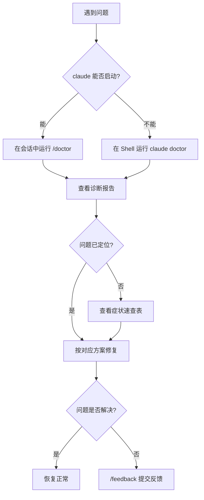

当你使用 Claude Code 遇到问题时，快速定位根因比盲目尝试修复更高效。本页提供一套通用的诊断方法论，并按**症状分类**引导你找到对应的解决方案。

**本文你会学到**：

- Claude Code 故障排除的通用诊断流程
- 按症状分类的问题速查表
- 通用排查工具的使用方法（`claude doctor`、环境变量调试等）

## 通用诊断流程

当你不确定问题出在哪里时，按照以下顺序排查，可以覆盖绝大多数情况：

核心原则只有一条：**先诊断，再修复**。`/doctor` 是你最好的起点——它能一次性检查安装状态、配置有效性、MCP 服务器连接和上下文使用情况，省去你逐项排查的时间。

## 按症状分类的速查表

当你遇到具体问题时，从下表找到对应的引导页面。

| 症状 | 引导页面 |
|:-----|:--------|
| `command not found`、安装失败、PATH 问题、`EACCES`、TLS 错误 | 「安装问题排查」 |
| 登录循环、OAuth 错误、`403 Forbidden`、`organization disabled`、Bedrock/Vertex/Foundry 凭据 | 「安装问题排查」中的认证部分 |
| 设置未应用、hooks 未触发、MCP 服务器未加载 | 「配置调试指南」 |
| `API Error: 5xx`、`529 Overloaded`、`429`、请求验证错误 | 「常见错误参考」 |
| `model not found` 或 `you may not have access to it` | 「常见错误参考」中的模型相关部分 |
| VS Code 扩展未连接或未检测到 Claude | 「VS Code 集成」 |
| JetBrains 插件未检测到 | 「JetBrains 集成」 |
| 高 CPU 或内存、响应缓慢、挂起、搜索找不到文件 | 下方「性能与稳定性」 |

## 通用排查工具

当你遇到任何不明原因的异常时，以下几个工具是排查的起点。

### /doctor：一键健康检查

`/doctor` 是 Claude Code 内置的诊断命令，运行后会自动检查以下项目：

- **安装状态**：确认 `claude` 二进制文件路径、版本是否最新
- **认证状态**：验证 API 凭据是否有效、账户是否正常
- **配置有效性**：检查 `settings.json`、`CLAUDE.md` 等配置文件是否正确加载
- **MCP 服务器**：检测已配置的 MCP 服务器是否成功连接
- **上下文使用**：显示当前会话的 token 消耗情况

!!! tip "使用方式"

    如果 Claude Code **可以启动**：在会话中输入 `/doctor`

    如果 Claude Code **根本无法启动**：在 Shell 中运行 `claude doctor`

### 环境变量调试

Claude Code 的行为可以通过环境变量进行微调。当你怀疑某个功能表现异常时，检查相关环境变量是否正确设置。

常用的调试环境变量：

| 环境变量 | 作用 |
|:---------|:-----|
| `DEBUG` | 设置为 `1` 或具体模块名可输出调试日志 |
| `USE_BUILTIN_RIPGREP` | 设为 `0` 强制使用系统安装的 `ripgrep`（搜索异常时尝试） |
| `DISABLE_AUTOUPDATER` | 设为 `1` 禁用自动更新（更新导致问题时临时关闭） |
| `ANTHROPIC_LOG` | 设置日志输出路径，用于记录 API 请求细节 |

!!! warning "安全提醒"

    调试完成后，记得移除包含敏感信息的环境变量设置。不要将带 API 密钥的环境变量提交到版本库。

### /compact：上下文过载时压缩

当 Claude Code 响应变慢或出现 `Autocompact is thrashing` 错误时，说明上下文窗口已满。此时运行 `/compact` 可以压缩对话历史，释放上下文空间。

你也可以指定压缩策略：

- `/compact` — 默认压缩，保留关键信息
- `/compact keep only the plan and the diff` — 只保留计划和代码差异

### /feedback：向 Anthropic 报告问题

如果你遇到的问题在文档中找不到解决方案，可以在会话中输入 `/feedback` 直接向 Anthropic 提交反馈。提交时建议附上：

- 问题复现步骤
- `/doctor` 的诊断结果
- 相关的错误日志或截图

## 性能与稳定性

当你遇到 Claude Code 运行缓慢或资源占用异常时，以下几个场景最为常见。

### 高 CPU 或内存使用

当你处理大型代码库时，Claude Code 可能消耗较多系统资源。这不是 bug，但你可以通过以下方式缓解：

- **定期压缩上下文**：在主要任务之间运行 `/compact`
- **重启会话**：长时间运行的大型任务之间，关闭并重启 Claude Code
- **排除无关目录**：将大型构建目录（如 `node_modules`、`target`、`build`）添加到 `.gitignore`

如果以上措施后内存使用仍然异常高，运行 `/heapdump` 可以将 JavaScript 堆快照写入 `~/Desktop`（Linux 上写入主目录）。该文件包含内存分解信息，可帮助识别内存增长来源。在 Chrome DevTools 的 Memory 面板中加载 `.heapsnapshot` 文件即可查看详情。

### 命令挂起或冻结

当你发现 Claude Code 无响应时：

- 按 `Ctrl+C` 尝试取消当前操作
- 如果仍然无响应，关闭终端并重新启动

!!! tip "恢复会话"

    重启不会丢失对话。在同一目录中运行 `claude --resume` 即可继续上一次的会话。

### 搜索工具找不到文件

当你发现搜索功能、`@file` 提及、自定义代理或自定义 skills 找不到文件时，可能是内置的 `ripgrep` 二进制文件在你的系统上无法正常运行。

解决方法是安装系统级的 `ripgrep`，然后设置环境变量 `USE_BUILTIN_RIPGREP=0` 让 Claude Code 使用系统版本。

### 自动压缩抖动

当你看到 `Autocompact is thrashing: the context refilled to the limit...` 错误时，说明自动压缩成功执行了，但后续的文件读取或工具输出立即将上下文窗口再次填满。Claude Code 会停止重试以避免在无进展的循环上浪费 API 调用。

应对策略：

- 要求 Claude 以较小的块读取大文件（指定行范围或函数名），而非一次性读取整个文件
- 运行 `/compact` 并指定保留内容，如 `/compact keep only the plan and the diff`
- 将大文件相关工作交给 [subagent](../sub-agents/index.md)，让它在独立的上下文窗口中运行
- 如果早期对话内容已不再需要，运行 `/clear` 清除

## 更多帮助

如果你遇到的问题不在上述范围内：

- 查看 [GitHub Issues](https://github.com/anthropics/claude-code/issues) 搜索已知问题
- 直接在会话中向 Claude 询问——Claude 可以访问自己的文档，能帮你定位问题
- 对于企业用户，通过 Claude Code 内置的 `/feedback` 或联系 Anthropic 支持团队获取帮助
