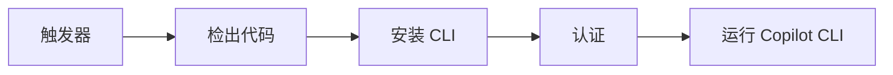

# 自动化与脚本集成

**本文你会学到**：

- ⚡ 如何用 `-p` 标志和管道两种方式非交互式调用 Copilot CLI
- 🛠 编程式模式下的提示词优化、权限控制和输出捕获技巧
- 📋 生成提交消息、文件摘要、代码审查等常用自动化场景
- 🐚 Shell 脚本中的变量捕获、条件判断和多文件处理模式
- 🚀 将 Copilot CLI 集成到 GitHub Actions 实现 CI/CD 自动化

Copilot CLI 的编程式模式让你无需进入交互会话，就能在终端、脚本和 CI/CD 流水线中调用 AI 能力——就像给实习生发邮件：写清楚任务发过去，他做完把结果发回来。

!!! tip "从交互到自动化"

    前面章节介绍的交互模式适合探索和迭代，而本章的编程式模式适合`确定性的、可重复的`任务。当你确认某个提示词效果稳定后，就可以把它固化到脚本或 CI/CD 中。

---

## 编程式模式

两种非交互式调用方式，效果完全等价：

=== "-p 标志"

    直接在命令行传递提示词：

    ```bash
    copilot -p "解释这个文件的作用：./complex.ts"
    ```

    任何在交互会话中有效的提示词都可以用 `-p` 传递。

=== "管道输入"

    通过管道传入提示词：

    ```bash
    echo "解释这个文件的作用：./complex.ts" | copilot
    ```

    适合从其他命令动态生成提示词的场景。

!!! note "管道和 -p 同时使用时，`-p` 优先，管道输入被忽略"

## 编程式使用技巧

| 技巧 | 说明 | 示例 |
|------|------|------|
| **精确提示词** | 明确、无歧义的指令，包含文件名、函数名、具体变更要求 | `'Fix ESLint errors in src/api/auth.ts'` |
| **谨慎引用** | 提示词用单引号包裹，避免 Shell 解释 `$`、`*` 等特殊字符 | `copilot -p 'Give me $HOME value'` |
| **最小权限** | `--allow-tool` 和 `--allow-url` 只给必要权限，避免 `--allow-all` | `--allow-tool='shell(git:*), write'` |
| **-s 静默** | 抑制会话元数据（spinner、token 计数等），获取干净文本输出 | `copilot -p '...' -s` |
| **--no-ask-user** | 阻止代理向用户提问，CI/CD 环境下必加 | `copilot -p '...' --no-ask-user` |
| **显式模型** | `--model` 指定模型版本，保证跨环境行为一致 | `copilot -p '...' --model gpt-4o` |

!!! warning "权限原则"

    永远不要在自动化脚本中使用 `--allow-all`（除非在隔离的沙箱环境中）。按需授权可以防止 AI 执行超出预期的操作——比如在生产流水线中不小心执行了 `rm -rf`。

---

## 常用示例场景

### 生成提交消息

```bash
copilot -p '为暂存区的变更写一条纯文本提交消息' -s \
  --allow-tool='shell(git:*)'
```

### 文件摘要

```bash
copilot -p '用不超过 100 字总结 src/auth/login.ts 的功能' -s
```

### 编写测试

```bash
copilot -p '为 src/utils/validators.ts 编写单元测试' \
  --allow-tool='write, shell(npm:*), shell(npx:*)'
```

### 修复 lint 错误

```bash
copilot -p '修复项目中的所有 ESLint 错误' \
  --allow-tool='write, shell(npm:*), shell(npx:*), shell(git:*)'
```

### 解释 diff

```bash
copilot -p '解释当前分支最新一次提交的变更，并标记潜在问题' -s
```

### 代码审查

使用内置的 `/review` 命令审查分支变更：

```bash
copilot -p '/review 当前分支相对于 main 的变更，聚焦 bug 和安全问题' \
  -s --allow-tool='shell(git:*)'
```

### 生成文档

```bash
copilot -p '为 src/api/ 下所有导出函数生成 JSDoc 注释' \
  --allow-tool=write
```

### 审计依赖

```bash
copilot -p "审计项目依赖的安全漏洞" \
  --allow-tool='shell(npm:*), shell(npx:*)'
```

---

## Shell 脚本模式

编程式模式的真正威力在于脚本——你可以动态生成提示词、捕获输出、与其他命令串联，构建完整的自动化工作流。

### 变量捕获

将 Copilot 的输出存入 Shell 变量，供后续步骤使用：

```bash
result=$(copilot -p '项目需要什么版本的 Node.js？只给版本号' -s)
echo "需要 Node 版本: $result"
```

!!! tip "使用 -s 标志"

    捕获输出时务必加 `-s`（silent），否则会话元数据（如 token 消耗、spinner）会混入变量值，导致后续处理出错。

### 条件判断

将 Copilot 作为判断条件，控制脚本分支：

```bash
if copilot -p '项目有 TypeScript 错误吗？只回答 YES 或 NO' -s \
  | grep -qi "no"; then
  echo "没有类型错误"
else
  echo "检测到类型错误"
fi
```

### 多文件处理

循环遍历文件，逐个调用 Copilot 处理：

```bash
for file in src/api/*.ts; do
  echo "--- 审查 $file ---" | tee -a review.md
  copilot -p "审查 $file 的错误处理" -s --allow-all-tools | tee -a review.md
done
```

### 完整脚本示例：大文件巡检

以下脚本查找超过 10 MB 的文件，让 Copilot 生成描述，再汇总输出：

```bash
#!/bin/bash
# 查找大文件，使用 Copilot CLI 生成描述并汇总

SUMMARY_FILE="large-files-report.md"
echo "# 大文件巡检报告" > "$SUMMARY_FILE"
echo "" >> "$SUMMARY_FILE"

while IFS= read -r -d '' file; do
    size=$(du -h "$file" | cut -f1)
    description=$(copilot -p "简要描述这个文件的内容：$file" -s 2>/dev/null)
    echo "- **$file** ($size)：$description" >> "$SUMMARY_FILE"
done < <(find . -type f -size +10M -print0)

if [ ! -s "$SUMMARY_FILE" ]; then
    echo "未发现超过 10MB 的文件。"
    exit 0
fi

echo "报告已生成：$SUMMARY_FILE"
```

---

## CI/CD 集成：GitHub Actions

### 工作流模式

典型的 Actions 工作流遵循 5 步模式，每个步骤都有明确的职责：



| 步骤 | 说明 | 关键配置 |
|------|------|---------|
| **触发器** | 定时、事件或手动触发 | `schedule` / `workflow_dispatch` |
| **检出代码** | 拉取完整仓库 | `actions/checkout@v6` + `fetch-depth: 0` |
| **安装 CLI** | 在 Runner 上安装 Copilot CLI | `npm install -g @github/copilot` |
| **认证** | 提供带 Copilot 权限的 PAT | `COPILOT_GITHUB_TOKEN` 环境变量 |
| **运行** | 用 `-p` 执行任务，输出到 Summary | `--allow-tool` + `--no-ask-user` |

### 完整工作流示例

```yaml
name: 每日变更摘要

on:
  # 支持手动触发，方便测试提示词
  workflow_dispatch:
  # 每天 UTC 17:30（北京时间凌晨 1:30）自动运行
  schedule:
    - cron: '30 17 * * *'

permissions:
  contents: read

jobs:
  daily-summary:
    runs-on: ubuntu-latest
    steps:
      # 检出完整仓库历史（fetch-depth: 0），Copilot 需要 git log
      - name: 检出代码
        uses: actions/checkout@v6
        with:
          fetch-depth: 0

      # 设置 Node.js 环境，为安装 CLI 做准备
      - name: 设置 Node.js 环境
        uses: actions/setup-node@v4

      # 全局安装 Copilot CLI
      - name: 安装 Copilot CLI
        run: npm install -g @github/copilot

      # 运行 Copilot CLI 生成每日变更摘要
      - name: 运行 Copilot CLI
        env:
          # 使用预配置的 PAT 进行认证
          COPILOT_GITHUB_TOKEN: ${{ secrets.PERSONAL_ACCESS_TOKEN }}
        run: |
          copilot -p "查看 git log，用要点总结今天所有的代码变更，附上对应的 GitHub commit 链接。在最上方用一段话（不超过 100 字）概括今天的变更，将结果写入 summary.md" \
            --allow-tool='shell(git:*)' \
            --allow-tool=write \
            --no-ask-user
          # 将结果追加到 Actions 运行摘要页面
          cat summary.md >> "$GITHUB_STEP_SUMMARY"
```

!!! tip "调试工作流"

    开发阶段先用 `workflow_dispatch` 手动触发，确认提示词和输出符合预期后，再开启 `schedule` 自动运行。可以查看 Actions 运行页面的 Step Summary 快速确认结果。

### 认证配置

Copilot CLI 在 Actions 中运行需要一个带有 **"Copilot Requests"** 权限的 Fine-grained PAT：

**创建 PAT 并配置为 Secret 的步骤：**

1. 前往 GitHub PAT 创建页面：`github.com/settings/personal-access-tokens/new`
2. 创建新 Token，勾选 **"Copilot Requests"** 权限
3. 复制生成的 Token 值
4. 在仓库的 **Settings > Secrets and variables > Actions** 中点击 **New repository secret**
5. 将 Token 值粘贴到 Secret 字段，命名为 `PERSONAL_ACCESS_TOKEN`

工作流通过 `COPILOT_GITHUB_TOKEN` 环境变量读取这个 Secret：

```yaml
env:
  COPILOT_GITHUB_TOKEN: ${{ secrets.PERSONAL_ACCESS_TOKEN }}
```

!!! note "为什么不用内置的 GITHUB_TOKEN"

    `COPILOT_GITHUB_TOKEN` 是 Copilot CLI 专用的认证变量，与 Actions 内置的 `GITHUB_TOKEN` 独立。这让你可以为 Copilot 设置与仓库操作不同的权限范围，避免权限混淆。

---

## 会话导出

编程式模式的输出可以通过 `--share` 选项持久化，方便分享和归档。

=== "导出到本地文件"

    将完整会话记录保存为 Markdown 文件：

    ```bash
    copilot -p "审计项目依赖漏洞" --share='./audit-report.md'
    ```

=== "导出到 GitHub Gist"

    将会话记录发布为公开 Gist，方便团队共享：

    ```bash
    copilot -p '总结项目架构' --share-gist
    ```

!!! warning "Gist 限制"

    Enterprise Managed Users 和使用数据驻留（`*.ghe.com`）的 GitHub Enterprise Cloud 用户无法使用 Gist 功能。这类用户应使用 `--share` 导出到本地文件。
