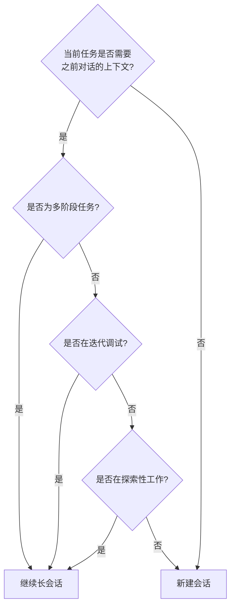

# 上下文与会话管理

**本文你会学到**：

- 🎯 为什么上下文质量决定了 Copilot 的输出质量
- 📎 如何使用 `@` 语法精确引用文件
- 💾 会话的持久化与恢复
- 📏 上下文窗口满了怎么办

打个比方：Copilot 就像一个技术很强但刚入职的同事——如果你不告诉他项目背景和代码位置（上下文），他的工作质量会大打折扣。你给的上下文越精准，他的输出越靠谱。

---

## ❓ 为什么上下文质量如此重要？

Copilot 的效果直接取决于你提供的上下文质量。一个常见的误区是把 Copilot 当搜索引擎用——只给一个笼统的问题，不给具体的代码位置。结果就是 AI 要么答非所问，要么给出泛泛而谈的建议。

好的上下文就像好的需求文档：`告诉 AI 看哪些文件`、`关注哪些方面`、`期望什么结果`。本页介绍的 `@` 语法就是给 AI "递文件"的方式。

---

## 📎 @ 语法：引用文件与目录

在 prompt 中使用 `@` 前缀引用文件或目录，让 Copilot 读取其内容作为上下文。`@` 就像是你指着桌上的某个文件说"看这个"。

### 基本引用

``` text
# 引用单个文件
> @src/auth.py 解释这段认证逻辑

# 引用目录（递归包含所有文件）
> @src/models/ 这些模型之间的关系是什么？

# 引用多个文件
> @src/auth.py @src/middleware.py 这两个文件如何协作？
```

### Glob 模式匹配

支持 glob 通配符批量引用文件：

``` text
# 所有 Python 文件
> @**/*.py 项目中有哪些数据类？

# 特定目录下的所有测试
> @tests/**/*.test.ts 测试覆盖率如何？

# 所有配置文件
> @**/*.{json,yaml,toml} 列出所有配置
```

`grep` 和 `glob` 工具现在接受多个搜索路径（1.0.35 新增），可以在一条命令中同时搜索多个目录：

``` text
# 同时搜索多个目录中的 TODO
> 在 src/ 和 lib/ 目录中搜索所有 TODO 注释
```

### 引用 URL

可以引用 URL 让 Copilot 获取网页内容：

``` text
> @https://api.example.com/openapi.json 根据这个 API 规范生成客户端
```

### 图片上下文（实验性）

支持引用本地图片文件作为视觉上下文：

``` text
# 引用图片
> @design/mockup.png 根据这个设计稿实现页面布局

# 引用截图辅助调试
> @screenshot.png 页面渲染结果与预期不符，帮我分析原因
```

!!! warning "图片支持限制"

    图片上下文为实验性功能，支持 PNG、JPEG、GIF、WebP 格式。效果取决于模型的视觉能力。

!!! tip "邻近标签页技巧（VS Code）"

    在 VS Code 中使用 Copilot 时，打开相关的上下文文件作为标签页，Copilot 会自动扫描这些打开的标签页以增强生成的准确性。在 CLI 中，等价操作是通过 `@` 语法显式引用相关文件。

---

## 🔍 跨文件智能分析

Copilot 不仅读取引用的文件，还会理解文件之间的关系。这使得跨文件分析特别强大：

``` text
# 追踪数据流
> @src/api/routes.py @src/services/user.py @src/models/user.py
> 追踪用户注册请求从 API 入口到数据库存储的完整流程

# 依赖分析
> @package.json @src/ 哪些依赖在代码中实际被使用了？

# 一致性检查
> @src/api/ @tests/api/ API 路由和测试文件的覆盖情况如何？有哪些路由缺少测试？
```

---

## 💾 会话管理

Copilot CLI 的每次对话都是一个`会话`（Session）。会话数据自动持久化到本地磁盘，支持恢复和管理。

### 会话存储结构

``` text
~/.copilot/session-state/{session-id}/
├── events.jsonl      # 完整会话历史
├── workspace.yaml    # 会话元数据
├── plan.md           # 实现计划（Plan 模式生成）
├── checkpoints/      # 检查点：上下文压缩时的快照，可用于恢复到历史状态
└── files/            # 会话产物（不提交到 git）
```

### 恢复会话

``` bash
# 恢复最近的会话
copilot --resume

# 恢复指定会话（支持短前缀 7+ 十六进制字符，1.0.32 改进）
copilot --resume <session-id>

# 从特定检查点恢复
copilot --continue <checkpoint-id>

# 通过名称恢复会话（1.0.35 新增）
copilot --resume=<会话名称>
```

`--continue` 优先从当前工作目录恢复会话（1.0.35 改进），而非之前总是恢复最近使用的会话——这在同时处理多个项目时更符合直觉。

!!! tip "会话命名"

    使用 `--name` 参数在启动时命名会话（1.0.35 新增），之后可通过 `--resume=<名称>` 按名称快速恢复，不用记住长长的会话 ID：

    ``` bash
    # 启动时命名会话
    copilot --name=oauth-feature

    # 按名称恢复
    copilot --resume=oauth-feature
    ```

    在交互会话中，使用 `/rename` 给会话起名。无参数调用时会自动根据对话历史生成名称（1.0.12 新增）：

    ``` text
    /rename oauth-feature   # 手动命名
    /rename                 # 自动生成名称
    ```

### 删除会话（1.0.35 新增）

不再需要的会话可以通过 `/session delete` 清理：

``` text
/session delete <id>     # 删除指定会话
/session delete-all      # 删除所有会话
```

在会话选择器（`--resume`）中也可以按 `x` 快捷键快速删除高亮的会话。会话选择器现在还会显示分支名称、空闲/使用状态，搜索和光标导航也得到了改进（1.0.35 改进），让你更容易找到目标会话。

1.0.37 新增了**会话选择器排序**功能：在选择器中按 `s` 键循环切换排序方式，支持按相关性、最近使用、创建时间或名称排序，方便从大量会话中快速定位目标。同时，1.0.39 对 `--resume` 选择器的标签布局、状态显示和加载体验做了进一步改进，并支持渐进式加载，不再需要等待全部会话加载完毕才能操作。

### 会话历史与文件追踪

会话历史、文件追踪和 `/chronicle` 命令现已对所有用户开放（1.0.40 新增）。此前这些功能可能有访问限制，现在你可以在任何会话中回顾完整的历史操作记录和文件变更轨迹。

### 查看会话信息

``` text
# 查看当前会话详情
/session
```

输出内容包括：会话 ID、创建时间、已使用的 token 数、会话文件路径等。

---

## 📏 上下文窗口管理

AI 模型有固定的上下文窗口大小（token 限制），可以理解成 AI 的"短期记忆容量"。当对话越来越长，早期内容会被逐渐挤出记忆——就像你开了一天会，到下午已经记不清早上讨论了什么。

当对话变长时，需要主动管理上下文以保持效果。

### /compact：压缩上下文

当对话过长导致上下文接近饱和时，使用 `/compact` 压缩历史：

``` text
# 压缩当前上下文
/compact

# 带提示地压缩（告诉 Copilot 保留什么信息）
/compact 保留关于认证模块的所有讨论，其他可以压缩
```

`/compact` 会将之前的对话历史总结为一个精简摘要，释放 token 空间。类比来说，就像你开完会后写了一份会议纪要——原始对话虽然丢了，但关键结论都保留了。

### 压缩机制详解

要理解压缩，先要知道上下文窗口里都装了什么。上下文窗口就像一块固定大小的白板，上面的空间被以下内容瓜分：

- **系统指令和工具定义**：告诉 Copilot 如何行为的内置指令，以及所有可用工具的 Schema。这部分是固定的，始终占据一定空间
- **你的消息**：你发送的每一条 prompt
- **Copilot 的响应**：Copilot 回复的每一句话
- **工具调用及结果**：当 Copilot 读取文件、运行命令或搜索代码库时，请求和输出都会写入上下文。工具结果可能非常大——比如读取一个长文件或运行一条输出大量的命令

#### 自动压缩的触发条件

压缩不需要你手动操作——Copilot CLI 会在后台自动管理：


- **~80% 时**：自动在后台启动压缩，预留约 20% 的缓冲空间，让工具调用可以继续运行
- **~95% 时**：如果压缩还没完成，Copilot CLI 会短暂暂停，等待压缩完成后才继续

!!! tip "手动压缩的时机"

    你不必等到自动触发。在开始新阶段工作前主动执行 `/compact`，可以提前释放空间，让后续工具调用有更充裕的上下文。按 `Esc` 可取消正在进行的手动压缩。

#### 压缩保留了什么

压缩的核心是一个"智能摘要"过程。Copilot 会将完整对话发送给 AI 模型，要求生成一个结构化摘要，重点捕获：

- **对话目标**：你想达成什么
- **已完成的工作**：已经做了哪些事情
- **关键技术细节**：重要的技术决策和实现细节
- **重要文件路径**：涉及的关键文件
- **下一步计划**：接下来要做什么

同时，原始的用户指令、当前 Plan 和 Todo 列表的状态也会被保留，而非压缩。

#### 压缩会丢失什么

压缩毕竟是摘要，不是逐字记录。以下内容很可能在压缩中丢失：

- 每条消息的**精确措辞**
- 每次命令的**完整输出**
- 早期对话中的**次要决策细节**和试探性讨论

!!! warning "压缩不可逆"

    压缩一旦完成，原始对话历史就被摘要替代了，**无法恢复**。如果你需要 Copilot 回忆会话早期某个非常具体的细节，压缩后它可能已经没有那个信息了。

    不过你不必为此焦虑——每次压缩都会自动创建**检查点**（Checkpoint），保存压缩摘要的副本，详见下文。

#### 没有压缩会怎样

如果没有压缩机制，上下文窗口满了之后，Copilot 只能粗暴地丢弃最早的对话消息——不保留任何摘要或记录。这意味着 Copilot 会突然"失忆"，完全不知道被丢弃的消息里讨论了什么。压缩通过用智能摘要替代历史，避免了这种突兀的信息丢失。

### /clear：清除上下文

``` text
# 完全清除对话历史，从头开始
/clear
```

!!! warning "清除 vs 压缩 vs 新建"

    - `/compact`：保留对话摘要，适合同一任务需要更多空间时使用
    - `/clear`：完全放弃当前会话（1.0.11 语义调整）
    - `/new`：开始新对话但保留会话元数据（1.0.11 新增，与 `/clear` 分离）

### /undo 和 /rewind：撤销操作

如果 Copilot 的操作不符合预期，有两种撤销方式（1.0.10 / 1.0.13 新增）：

``` text
# /undo：撤销最后一轮对话并回滚文件更改
/undo

# /rewind：打开时间线选择器，回滚到任意历史节点
/rewind
```

`/undo` 适合快速撤销刚刚的操作，`/rewind` 适合需要回到更早某个时间点的场景。双击 ++esc++ 也可以打开 `/rewind` 时间线选择器（1.0.13 新增）。Rewind 选择器使用方向键 ++up++/++down++ 导航 + ++enter++ 确认即可，操作已简化（1.0.28 改进），不再需要记住 1-9 快捷键。注意，如果当前不在 git 仓库中或尚无 commit，`/undo` 会显示解释性提示而非静默失败（1.0.30 改进）。

!!! tip "时间线快捷键（1.0.26 新增）"

    在时间线中按 ++ctrl+o++ 可展开所有条目（与 ++ctrl+e++ 行为一致），方便你快速浏览完整的会话历史而不需要逐个展开。

### /cd：工作目录切换

`/cd` 为每个会话保持独立的工作目录（1.0.11 新增），切换会话时自动恢复之前的工作目录。通过 `/add-dir` 添加的额外目录在 `/clear` 和 `/resume` 后持久化（1.0.3 改进）。

``` text
# 切换到子项目目录
> /cd packages/frontend

# 回到项目根目录
> /cd ..
```

### 最佳实践：保持会话聚焦

``` text
# ✅ 好习惯：每个功能一个会话
copilot
> /rename auth-feature
# 专注于认证功能的开发
> /exit

copilot
> /rename csv-export
# 专注于 CSV 导出功能
> /exit

# ❌ 坏习惯：一个会话做所有事情
# 上下文越来越混乱，Copilot 的回答质量会下降
```

### Checkpoint 机制

每次压缩发生时（无论是自动还是手动），都会自动创建一个**检查点**（Checkpoint）。检查点是压缩摘要的一个保存副本，以带编号和标题的文件形式存储在会话工作区中（对应存储结构中的 `checkpoints/` 目录）。

可以把检查点理解为压缩过程的"自动存档"——就像游戏中每过一关自动保存进度，即使角色倒下了也能从最近的存档恢复。

#### 查看检查点列表

``` text
# 列出当前会话的所有检查点
/session checkpoints
```

输出示例：

``` text
Checkpoint History (3 total):
  3. Refactoring authentication module
  2. Implementing user dashboard
  1. Initial planning and setup
```

每个检查点都有一个编号和标题，按时间倒序排列（最新的在前）。标题由 Copilot 根据压缩时的对话内容自动生成。

#### 查看具体检查点内容

使用检查点编号查看该检查点的完整内容：

``` text
# 查看编号为 2 的检查点详情
/session checkpoints 2
```

#### 检查点的实际用途

- **审查历史操作**：在经过多次压缩的长会话中，早期的对话阶段已不在活跃上下文中。检查点让你可以回顾 Copilot 在每次压缩时做了什么
- **验证连续性**：继续工作之前，可以查看最近的检查点，确认 Copilot 的摘要是否准确捕获了之前的工作内容
- **调试会话中的困惑**：如果 Copilot 似乎忘记了某个决策，或者正在朝与之前工作矛盾的方向前进，查看检查点可以帮助你发现压缩时保留了什么、什么可能被摘要处理得与预期不同

!!! tip "检查点无需主动管理"

    检查点是自动创建的，不需要你手动维护。对于大多数会话，你根本不需要查看检查点。它们只是在你需要时才派上用场的"保险"。

### 长会话管理策略

得益于自动压缩机制，你可以在一个会话中持续工作很长时间，不必担心上下文窗口耗尽。但长会话并非总是最优选择——关键在于判断什么场景适合继续，什么场景该开新局。

#### 适合继续使用长会话的场景



- **多阶段任务**：比如构建一个功能，需要脚手架搭建、实现、测试，最后创建 Pull Request。各阶段之间紧密关联，保持在同一会话中能让 Copilot 持续理解项目全貌
- **迭代调试**：你想让 Copilot 保留之前尝试过什么、什么没生效的上下文，避免反复解释同一问题
- **探索性工作**：跨代码库进行探索，逐步积累与 Copilot 的共同理解

#### 适合新建会话的场景

- **切换到不相关的新任务**：Copilot 不需要之前工作的上下文，干净的上下文窗口意味着新任务有更多空间
- **经过多次压缩后质量下降**：如果你感觉重要信息在摘要过程中不断丢失，Copilot 的回答质量在下滑，是时候开一个新会话了
- **需要干净的状态**：比如工作方向走偏了，与其让 Copilot 试图调和之前的决策与新方案，不如从头开始

!!! tip "恢复历史会话"

    通过 `/resume` 命令可以随时恢复之前的会话，包括该会话中创建的所有检查点。所以"新建会话"并不意味着之前的会话就丢了——你可以随时回来。

#### 用 /context 监控上下文健康度

`/context` 命令可以查看当前上下文窗口的使用情况，显示以下组成：

- **System/Tools**：系统指令和工具定义的固定开销
- **Messages**：对话历史占用的空间
- **Free Space**：剩余可用空间
- **Buffer**：预留的缓冲区域，用于触发自动压缩

当发现 Free Space 持续缩小或 Messages 占比过高时，就是考虑 `/compact` 或评估是否需要新建会话的好时机。

---

## ⚡ 上下文相关命令速查

| 命令 | 功能 |
|------|------|
| `@file` | 引用文件作为上下文 |
| `@dir/` | 引用整个目录 |
| `@**/*.ext` | 使用 glob 模式批量引用 |
| `/session` | 查看当前会话信息 |
| `/rename <name>` | 重命名当前会话（无参数自动命名） |
| `/compact` | 压缩上下文历史 |
| `/clear` | 放弃当前会话 |
| `/new` | 开始新对话（1.0.11 新增） |
| `/undo` | 撤销最后一轮（1.0.10 新增） |
| `/rewind` | 时间线回滚（1.0.13 新增） |
| `/session delete <id>` | 删除指定会话（1.0.35 新增） |
| `/session delete-all` | 删除所有会话（1.0.35 新增） |
| `/cd <path>` | 切换工作目录（1.0.11 新增） |
| `/context` | 查看当前上下文中的文件 |
| `--resume` | 启动时恢复上次会话 |
| `--continue` | 从特定检查点恢复 |
