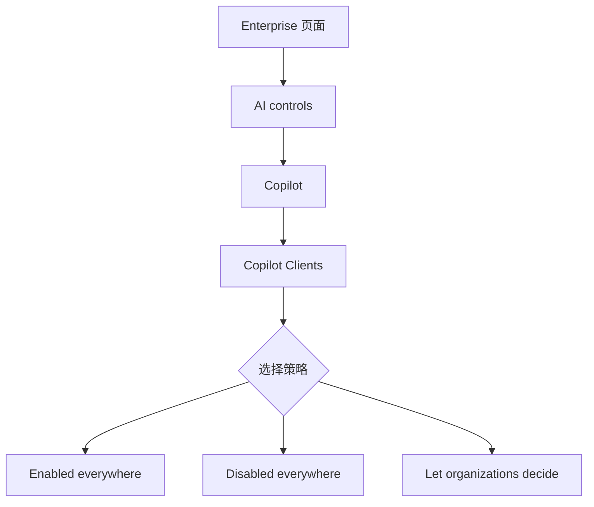
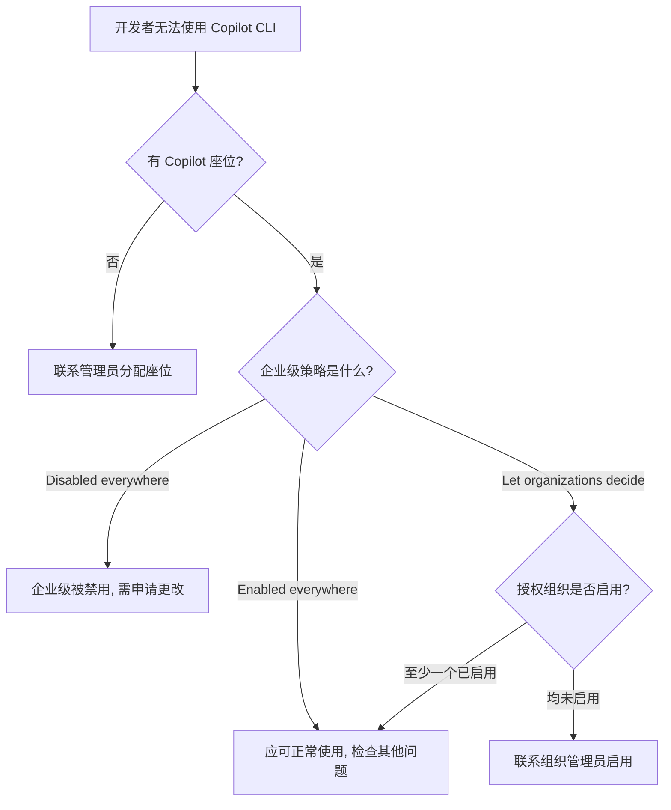

# 企业版管理

> 如果把 GitHub Copilot 想象成公司统一采购的办公软件套件，那么企业版管理就是 IT 部门负责的**软件分发与权限管控**——决定谁可以用、能用哪些功能、在哪些部门开放。Copilot CLI 作为套件中的一个"客户端"，同样服从这套管控体系。本文面向企业所有者（Enterprise Owner）和组织管理员，讲解如何对 Copilot CLI 进行集中管控。

**学习目标：**

- 掌握在企业或组织级别启用/禁用 Copilot CLI 的方法
- 了解哪些 AI 控制策略对 CLI 生效、哪些不生效
- 能够排查开发者无法访问 Copilot CLI 的常见原因

## 启用或禁用 Copilot CLI

企业所有者可以在 GitHub.com 上通过配置策略来控制 Copilot CLI 的使用，支持**企业级**和**组织级**两个层级的管理。可以把这理解为"总公司统一规定"与"分公司自行决定"的关系——企业级策略的优先级更高。

配置路径如下：

1. 导航到你的 Enterprise 页面（例如从 GitHub.com 的 [Enterprises](https://github.com/settings/enterprises) 页面进入）
2. 点击页面顶部的 **AI controls**
3. 在侧边栏中点击 **Copilot**
4. 在 **Copilot Clients** 区域中，为 Copilot CLI 选择策略



!!! tip "策略选项说明"
    企业级策略有三个选项：**Enabled everywhere**（全局启用）、**Disabled everywhere**（全局禁用）、**Let organizations decide**（交由各组织自行决定）。选择"全局启用"或"全局禁用"会覆盖所有组织级设置。

## 策略控制项

并非所有企业级 AI 控制策略都会影响 Copilot CLI。这类似于公司统一采购了 Office 套件，但不同组件（Word、Excel、Teams）各自有独立的管控维度。下面分别列出适用和不适用的控制项。

### 适用的控制

| 控制项 | 说明 |
|--------|------|
| Copilot CLI 启用 | 可在企业或组织级别启用/禁用 |
| 模型选择 | 用户只能访问企业级已启用的 AI 模型，通过 `/model` 命令查看可用模型列表 |
| 自定义 Agent | 企业配置的自定义 Agent 可在 CLI 中使用 |
| 云代理（Cloud Agent）启用 | CLI 策略和云代理策略**都需启用**，用户才能使用 `/delegate` 命令 |
| 审计日志 | 影响 Copilot CLI 的企业策略更新会记录在企业审计日志中 |
| 座位分配 | 用户必须拥有有效的 GitHub Copilot 座位才能使用 CLI |

!!! warning "/delegate 的双重前提"
    如果开发者反馈 `/delegate` 命令不可用，除了检查 Copilot CLI 策略外，还需确认 **Copilot Cloud Agent** 策略也已启用。两者缺一不可。

### 不适用的控制

以下企业级策略**不会**影响 Copilot CLI：

- **MCP 服务器策略**：控制 MCP 服务器是否可用或允许哪些 MCP Registry 的策略，对 CLI 不生效
- **IDE 特定策略**：为特定 IDE 或编辑器扩展配置的策略
- **内容排除（Content Exclusions）**：基于文件路径的内容排除规则
- **BYOK（用户级模型提供商配置）**：用户可通过环境变量自行配置模型提供商

!!! info "BYOK 无法管控"
    用户可以通过环境变量配置自己的模型提供商（BYOK, Bring Your Own Key），这是**用户级配置**，不受企业策略管控。即使企业禁用了某些模型，用户仍可通过 BYOK 使用自有提供商的模型。

**BYOK 配置示例：**

```bash
# 用户在本地 shell 配置文件（如 .bashrc / .zshrc）中设置自有模型提供商
export COPILOT_MODEL_PROVIDER=anthropic
export ANTHROPIC_API_KEY=sk-ant-xxxxxxxxxxxx

# 或使用 OpenAI 兼容的提供商
export COPILOT_MODEL_PROVIDER=openai-compatible
export OPENAI_API_KEY=sk-xxxxxxxxxxxx
export OPENAI_BASE_URL=https://your-custom-endpoint.com/v1
```

上述配置完全在用户本地完成，企业策略无法感知或阻止。

## 组织级 Agent

企业可以为组织配置自定义 Agent，这些 Agent 存放在组织的 `.github-private/agents/` 目录下，仅对组织内成员可见。

```text
your-organization/.github-private/agents/
├── code-reviewer.md      # 代码审查 Agent
├── deployment-helper.md  # 部署助手 Agent
└── security-scanner.md   # 安全扫描 Agent
```

不同组织可以维护各自的 Agent 集合，开发者在 Copilot CLI 中能够调用所属组织的专属 Agent，实现组织级别的自动化能力共享。

## 排障指南

如果开发者报告无法访问 Copilot CLI，可以按照以下决策流程逐一排查：



**确认座位分配**

确保该用户已从企业内的某个组织获得有效的 GitHub Copilot 座位分配。没有座位，所有 Copilot 功能均不可用。

**检查企业级策略**

如果企业策略设置为 **Enabled everywhere** 或 **Disabled everywhere**，该设置会**覆盖**所有组织级的配置。请确认企业级策略没有意外地被设为全局禁用。

**检查组织级策略**

如果企业策略设置为 **Let organizations decide**，则需要进一步确认：用户获得 Copilot 许可的**所有组织中，至少有一个**已启用 Copilot CLI。即使只有一个授权组织启用了 CLI，用户也能正常使用。

!!! tip "确保一致访问"
    在企业级别设置 **Enabled everywhere** 是最简单的方式，可以确保所有组织成员都能一致地访问 Copilot CLI，避免逐个组织排查的麻烦。
