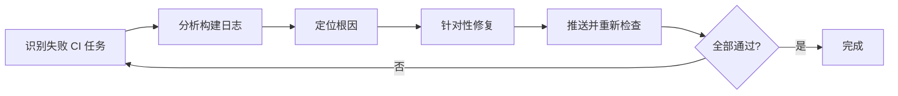
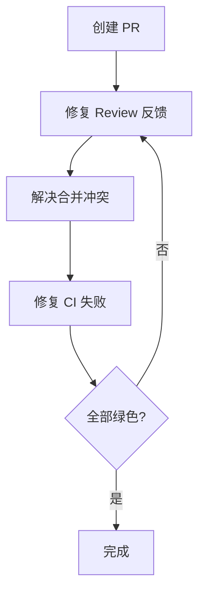

# 开发工作流

**本文你会学到**：

- 🔄 如何将 Copilot 融入完整的开发周期
- 📐 智能规划：从 Issue 到实现蓝图
- 🔍 代码审查、重构、调试、测试的 AI 辅助工作流
- 🔀 Git 集成：提交信息生成、PR 操作
- 🚀 端到端的综合工作流示例

Copilot CLI 不仅是一个问答工具，更是覆盖完整开发周期的助手。前面的章节介绍了 Copilot 的各项能力，本页则展示如何在实际开发工作中`组合使用`这些能力。

!!! tip "工作流思维"

    使用 Copilot CLI 最高效的方式不是把它当搜索引擎用，而是把它当作开发流程中的`每个环节`的加速器——规划、编码、测试、审查、提交，都可以借助 AI 提效。

---

## 📐 智能规划：从 Issue 到实现蓝图

Plan 模式（详见「交互模式」）不仅是任务清单，更是防止 AI 产生"幻觉（Hallucination）"的防火墙。在大型项目中，确保 AI 理解现有架构一致性是实施的前提。

### 交互式计划生成流程

1. **Issue 深度分析**：利用 `/research` 命令对 GitHub Issue 进行深度分析，评估设计选择并给出实现步骤
2. **迭代完善计划**：使用 `/plan` 进入 Plan 模式，通过对话细化方案。例如要求 AI"添加对特定环境变量的支持"或"考虑向后兼容性"
3. **强制验证逻辑**：在计划中明确指出如何验证每个阶段的产出（如特定的单元测试断言或 API 调用验证）

``` text
# 第一步：研究 Issue 背景
> /research GitHub Issue #42 涉及的技术栈和可能的实现方案

# 第二步：生成计划
> /plan 实现 Issue #42：为 API 添加分页支持，需兼容现有客户端

# 第三步：细化验证步骤
> 在计划中为每个阶段添加验证方法，确保可以通过测试确认完成
```

### 标准 AI 计划书组成

一份高质量的 AI 计划书应包含以下要素——你可以把它理解为 AI 版的"技术方案评审文档"：

- **工作阶段（Work Phases）**：逻辑任务拆解（如：Schema 变更 → 核心逻辑 → API 暴露 → 测试补充）
- **文件影响清单（File Impact）**：预测将被创建或修改的文件路径
- **验证方法（Validation）**：明确的端到端或单元测试路径

!!! tip "计划即防火墙"

    经验表明，最有效的计划必须包含**验证条目**。没有验证步骤的计划等同于没有测试的代码——看似完成，实则无法保证正确性。

---

!!! tip "附加文档供 Agent 阅读"

    从 1.0.32 起，你可以把支持的文档文件直接附加到 prompt 中，Agent 会读取并基于文档内容推理。适合让 Copilot 参考产品需求文档（PRD）、API 规范、设计稿等外部资料制定计划。

---

## 🔍 代码审查

Copilot 可以作为你的"第一道审查关卡"——在你提交 PR 之前先让 AI 看一遍，发现明显的问题。这不会取代人工审查，但能大幅减少审查轮次。

### 基础审查

``` text
# 审查当前工作区的所有变更
/review

# 审查特定文件
> @src/auth.py 审查这个文件的代码质量和安全性

# 聚焦审查特定方面
> @src/api/routes.py 只关注安全性问题：SQL 注入、XSS、认证绕过
```

!!! info "Agentic 审查流程"

    `/review` 不仅仅是静态分析——它会像一位主动的审查者一样工作：

    - **工具提议**：Copilot 可能提议运行命令（如 `git diff`、文件检查）来深入了解变更，你需要逐个批准或拒绝
    - **路径过滤**：支持通过路径或文件模式缩小审查范围，避免无关干扰

    ``` text
    # 指定审查路径
    /review src/api/

    # 带提示词的审查
    /review 关注性能优化和错误处理

    # 组合使用
    /review 关注安全性 src/auth/
    ```

    ``` bash
    # 编程式调用：在脚本或 CI 中集成代码审查
    copilot -p '/review src/api/ 聚焦安全性问题'
    ```

### /diff 命令

查看当前工作区与最近提交之间的差异，并请求审查。`/diff` 支持 17 种编程语言的语法高亮（1.0.5 新增），在备用屏幕模式下支持 ++home++ / ++end++ 和 ++page-up++ / ++page-down++ 导航（1.0.15 新增）：

``` text
# 查看变更
/diff

# 审查变更
> /diff 然后审查所有变更，重点关注错误处理
```

### CodeRabbit 协同审查

[CodeRabbit](https://coderabbit.ai/) 是 AI 驱动的 PR 审查工具，可以与 Copilot CLI 形成"执行-审查"闭环：

- **自动 PR 总结**：利用 LLM 快速提炼变更重点
- **三级风险评估**：自动标注 `Critical`（严重）、`Major`（主要）、`Minor`（次要）问题
- **Committable Suggestions**：直接在 GitHub PR 界面提供可一键提交的修复建议

跨工具协同修复工作流：

``` bash
# 1. 获取 CodeRabbit 的审查建议
code-rabbit --prompt-only > /tmp/review-fixes.txt

# 2. 将修复指令传递给 Copilot CLI 执行
copilot -p "$(cat /tmp/review-fixes.txt) 请根据以上审查建议修复代码"
```

### 多模型协同审查

通过 Copilot CLI 同时调度多个 AI 模型并行评审同一份代码，消除单一模型的逻辑盲区：

``` bash
# 使用 -p 获取非交互式输出，便于脚本比对
copilot --agent code-review -p "@src/auth.py 审查安全性" > /tmp/review-default.txt

# 切换模型进行对比审查
copilot --agent code-review --model opus -p "@src/auth.py 审查安全性" > /tmp/review-opus.txt
copilot --agent code-review --model haiku -p "@src/auth.py 审查安全性" > /tmp/review-haiku.txt

# 人工比对不同模型的审查结果，综合判断
diff /tmp/review-default.txt /tmp/review-opus.txt
```

!!! info "多模型审查的价值"

    不同模型各有所长：某些模型在安全审查上更严苛，另一些在逻辑推理上更精准。通过交叉审查可以发现单一模型遗漏的问题。

### 自动化审查（Pre-commit Hook）

在 Git 提交前自动运行 Copilot 审查：

``` bash title=".git/hooks/pre-commit"
#!/bin/bash

# 获取暂存的文件
STAGED=$(git diff --cached --name-only --diff-filter=ACM | grep -E '\.py$')

if [ -n "$STAGED" ]; then
  echo "Running Copilot review on staged files..."
  for file in $STAGED; do
    REVIEW=$(timeout 60 copilot --allow-all -p "Quick security review of @$file - critical issues only" 2>/dev/null)
    if [ $? -eq 124 ]; then
      echo "Warning: Review timed out for $file (skipping)"
      continue
    fi
    if echo "$REVIEW" | grep -qi "CRITICAL"; then
      echo "Critical issues found in $file:"
      echo "$REVIEW"
      exit 1
    fi
  done
  echo "Review passed"
fi
```

!!! note "内置 Hook 替代方案"

    Copilot CLI 提供了内置的 Hook 系统，比手动 Git Hook 更简单。详见「Hook 扩展」和「插件系统」页面。

---

## 🔧 代码重构

重构是最适合 AI 辅助的场景之一——AI 擅长机械性的模式识别和批量修改，而这正是重构的核心工作。关键是`先规划再执行`，不要让 AI 直接动手改代码。

### 渐进式重构

``` text
# 第一步：理解现有代码
> @src/legacy/user_manager.py 分析这个类的职责，识别违反单一职责原则的地方

# 第二步：制定重构计划
> /plan 将 UserManager 拆分为 UserAuthService 和 UserProfileService

# 第三步：执行重构
# 确认计划后，Copilot 执行拆分

# 第四步：验证
> 运行测试确认重构没有破坏现有功能
```

### 设计模式应用

``` text
# 提取策略模式
> @src/payment.py 这里的 if/elif 链太长了，帮我重构为策略模式

# 引入依赖注入
> @src/services/ 将硬编码的依赖改为构造函数注入
```

---

## 🐛 调试

AI 擅长快速定位常见错误模式——把错误信息或日志贴给它，通常能比搜索引擎更快地找到原因。但对于复杂的系统级问题（如并发竞态），AI 的建议可能不够深入，此时还需要结合实际调试工具。

### 错误分析

``` text
# 直接粘贴错误信息
> 运行测试时出现以下错误：
> TypeError: 'NoneType' object is not subscriptable
> 在 src/data_processor.py 第 42 行

# 引用相关文件辅助分析
> @src/data_processor.py 上面这个 TypeError 的根本原因是什么？
```

### 结合日志分析

``` bash
# 管道传入日志文件
cat error.log | copilot -p "分析这些错误日志，找出最频繁的错误模式和根本原因"

# 引用日志文件
> @logs/app.log 最近的错误有什么规律？
```

### 逐步调试

``` text
# 让 Copilot 帮助设置断点
> @src/api/handler.py 请求处理函数在并发场景下偶尔返回 500。
> 帮我分析可能的竞态条件，并建议调试策略。
```

---

## 🧪 测试生成

写测试是 AI 最擅长的任务之一——给定业务代码，AI 能快速覆盖正常路径、边界条件和异常场景。关键是：`给 AI 足够的上下文`（业务代码 + 已有测试的风格参考），它才能生成风格一致的测试。

### 为现有代码生成测试

``` text
# 基础测试生成
> @src/calculator.py 为这个计算器模块生成单元测试

# 指定测试框架和风格
> @src/user_service.py 使用 pytest 生成测试，包含：
> - 正常场景
> - 边界条件
> - 异常场景
> - 使用 mock 隔离外部依赖
```

### 结合已有测试上下文

``` text
# 引用已有测试作为风格参考
> @src/auth.py @tests/test_auth.py
> 参考已有测试的风格，为 auth.py 中新增的 reset_password 函数生成测试
```

### TDD 工作流

``` text
# 先写测试
> /plan 我要实现一个 BookCollection 类，支持按年份范围搜索。先帮我写失败测试。

# 实现代码让测试通过
> @tests/test_books.py 现在实现代码让这些测试通过

# 重构
> @src/books.py @tests/test_books.py 在保持测试通过的前提下重构代码
```

---

## 🔀 Git 集成

### 生成提交信息

``` text
# 基于暂存更改生成 commit message
> 为暂存的更改生成一个符合 Conventional Commit 规范的提交信息

# 使用 Programmatic 模式
copilot -p "查看 git diff --staged，生成 Conventional Commit 格式的提交信息"
```

### PR 操作

`/pr` 命令提供完整的 PR 工作流（1.0.5 新增）：创建和查看 PR、修复 CI 失败、处理 Review 反馈、解决合并冲突。

!!! note "子命令作用域"

    所有 `/pr` 子命令都作用于**当前分支**——即当前分支关联的 PR。

#### PR 管理完整子命令表

| 命令 | 功能 | 需要当前分支有 PR | 可能提交并推送 |
|------|------|:---:|:---:|
| `/pr` 或 `/pr view` | 显示当前分支的 PR 状态 | 是 | 否 |
| `/pr view web` | 在浏览器中打开 PR | 是 | 否 |
| `/pr create` | 创建或更新 PR | 否 | 是 |
| `/pr fix feedback` | 处理 Review 评论 | 是 | 是 |
| `/pr fix conflicts` | 解决合并冲突 | 是 | 是 |
| `/pr fix ci` | 修复 CI 失败 | 是 | 是 |
| `/pr fix` 或 `/pr fix all` | 依次执行全部三个修复阶段 | 是 | 是 |
| `/pr auto` | 创建 PR 并循环修复直到所有检查通过 | 否 | 是 |

会提交并推送的子命令在执行前会请求权限确认，除非你已经预先允许了相关工具。

#### 合并策略配置

解决冲突时 Copilot 需要知道使用 rebase 还是 merge 策略。在 `settings.json` 中设置 `mergeStrategy` 可避免每次手动选择：

``` json title="~/.copilot/settings.json 或 .github/copilot/settings.json"
{
  "mergeStrategy": "rebase"
}
```

可选值：`"rebase"` | `"merge"`。未配置时 Copilot 会在冲突解决时提示你选择。

#### `/pr fix ci` 详情

`/pr fix ci` 的工作流程可以类比为一位 DevOps 工程师的排障过程：



可以向修复命令追加上下文来聚焦特定问题：

``` text
# 聚焦测试超时
/pr fix ci 关注测试超时问题

# 聚焦 lint 错误
/pr fix ci 只看 ESLint 相关的失败
```

如果失败与你的分支变更无关，Copilot 会明确标注，避免误改。

#### `/pr auto` 自动化流程

`/pr auto` 是一键式的端到端自动化——类比为一个"PR 自动驾驶"：



``` text
# 基础用法
/pr auto

# 附带创建说明
/pr auto 在描述中包含迁移说明

# 附带命名前缀
/pr create prefix the PR title 'Project X: '
```

#### 常用操作示例

``` text
# 查看 PR 状态
/pr

# 在浏览器中打开
/pr view web

# 生成 PR 描述
> 根据当前分支的所有 commit，生成 PR 描述，包含：
> - 变更摘要
> - 改动详情
> - 测试说明
```

### PR 描述生成器（脚本化）

``` bash
# 自动生成 PR 描述
BRANCH=$(git branch --show-current)
COMMITS=$(git log main..$BRANCH --oneline)

copilot -p "Generate a PR description for:
Branch: $BRANCH
Commits:
$COMMITS

Include: Summary, Changes Made, Testing Done"
```

### 导出会话（/share）

使用 `/share html` 将当前会话和研究报告导出为自包含的交互式 HTML 文件（1.0.15 新增），方便在团队内分享 AI 辅助的调查过程和结论。

### 会话恢复与分享

Copilot CLI 的每个交互会话都会被持久化存储，你可以随时恢复之前的对话，就像翻开了上次的工作笔记本。

!!! info "会话存储位置"

    所有会话数据存储在 `~/.copilot/session-state/` 目录下，包括完整的对话历史、工具调用记录和文件修改详情。数据仅存于本地，不会上传。

#### 恢复会话

| 方式 | 命令 | 说明 |
|------|------|------|
| 恢复最近会话 | `copilot --continue` | 直接继续上次的对话 |
| 会话选择器 | `copilot --resume` | 显示最近会话列表供选择 |
| 指定会话 | `copilot --resume SESSION-ID` | 跳转到特定会话 |
| 会话内切换 | `/resume` | 在交互会话中切换到其他会话 |

恢复会话时，Copilot 会加载完整的对话历史，你可以无缝继续之前的工作。

#### 管理会话

``` text
# 重命名当前会话（方便后续查找）
/rename Improve test coverage

# 查看当前会话 ID
/session
```

#### 分享会话

``` text
# 导出为私有 Gist
/share gist

# 导出为 Markdown 文件
/share file

# 指定导出路径
/share file /tmp/my-session.md
```

未指定路径时，Markdown 文件默认保存为 `copilot-session-SESSIONID.md`。

---

## 🚀 综合工作流示例

### 从 Idea 到合并 PR

完整的端到端工作流，展示如何组合使用各项能力：

``` text
# 1️⃣ 收集上下文
> @src/ 项目的整体架构是什么？

# 2️⃣ 规划
> /plan 实现"按年份搜索图书"功能

# 3️⃣ 实施（确认计划后）
# Copilot 根据计划逐步实现

# 4️⃣ 生成测试
> @src/books.py @tests/test_books.py
> 为新功能生成测试，包括边界条件

# 5️⃣ 审查
> /review

# 6️⃣ 更新文档
> @README.md 添加新功能的使用说明

# 7️⃣ 提交
> 生成 commit message 并提交

# 8️⃣ 创建 PR
> /pr
```

### 新项目上手

加入新项目时的快速上手工作流：

``` text
# 1️⃣ 了解全局
> @src/ 这个项目的整体架构和技术栈是什么？

# 2️⃣ 理解特定流程
> @src/api/routes.py @src/services/user.py
> 用户注册的完整流程是怎样的？

# 3️⃣ 使用 Agent 深度分析
> /agent
# 选择合适的 Agent（如 code-review）
> @src/auth/ 认证模块有哪些设计问题需要改进？

# 4️⃣ 查找任务（通过 MCP 访问 GitHub）
> 列出标记为 "good first issue" 的 Issue

# 5️⃣ 开始贡献
> 选择最简单的 Issue，制定修复计划
```

---

## 💡 进阶技巧

### 预防"懒惰代理"

AI 代理有时会倾向于给出简化的 TODO 注释或占位符代码，而非完整的实现——就像一个偷懒的实习生，把工作推到"下次再做"。应对策略：

1. **明确完成标准**：在 prompt 中指明"不要使用 TODO 注释，请完整实现所有逻辑"
2. **循环验证**：在 Autopilot 模式中搭配测试命令，持续驱动代理直至任务完全通过验证
3. **计划锚定**：使用 Plan 模式先制定详细计划，Autopilot 按计划执行时更不容易偷懒

``` text
# 在 prompt 中明确要求
> 实现完整的用户注册功能。要求：
> - 不使用任何 TODO 或占位符
> - 每个函数都有完整的错误处理
> - 包含输入验证逻辑
> - 生成对应的单元测试并确保通过
```

!!! tip "验证优先"

    最有效的防懒策略是要求 AI 在计划中包含自动化测试，然后通过 Autopilot 模式运行测试来验证实现的完整性。测试失败会自动触发修复循环。

---

## 📊 Chronicle：会话数据分析

Chronicle 是 Copilot CLI 的实验性数据分析功能——它从你的历史会话中挖掘洞察，像一个懂你工作习惯的个人效率教练。

!!! warning "实验性功能"

    `/chronicle` 命令和会话历史问答功能目前为实验性功能，需要先开启：

    ``` text
    # 在交互会话中开启
    /experimental on

    # 或通过命令行参数
    copilot --experimental
    ```

### 数据存储机制

每次使用 Copilot CLI 时，完整的会话数据（提示词、响应、工具调用、文件修改详情）都会持久化到本地：

- **原始会话文件**：存储在 `~/.copilot/session-state/` 目录，支持会话恢复
- **结构化会话索引**：存储在本地 SQLite 数据库（`~/.copilot/session-store.db`），为 Chronicle 和历史问答提供查询支持

!!! note "隐私与数据主权"

    所有数据存储在本地，仅你的用户账户可访问。你可以随时删除 `~/.copilot/session-state/` 下的数据，删除后需运行 `/chronicle reindex` 重建索引。

### 子命令一览

| 子命令 | 功能 |
|--------|------|
| `/chronicle standup` | 生成最近工作的工作报告，默认最近 24 小时 |
| `/chronicle tips` | 基于你的使用模式提供 3-5 个个性化建议 |
| `/chronicle improve` | 分析会话历史，改进 `.github/copilot-instructions.md` |
| `/chronicle reindex` | 从会话文件重建索引 |

不带参数输入 `/chronicle` 会显示子命令选择器。也可以直接调用子命令，如 `/chronicle standup`。

### `/chronicle standup`：工作报告

根据你的实际会话数据生成工作报告，包含分支名称、PR 链接和状态检查。类比为一个自动化的"我昨天做了什么"总结器。

``` text
# 默认：最近 24 小时
/chronicle standup

# 自定义时间范围
/chronicle standup for the last 3 days
```

输出示例：

``` text
Standup for March 13 2026:

✅ Done

myapp-repo repo maintenance (main branch)

 - Synced local, cleaned files, audited deps, reviewed architecture

🚧 In Progress

MyApp configuration (suppress-start-message branch, myapp-repo)

 - Suppressing startup init prompt message
```

### `/chronicle tips`：个性化建议

分析你的近期会话，理解你的工作方式和 Copilot CLI 使用习惯，然后给出 3-5 个有针对性的建议。它会交叉对比你的实际用法与全部可用功能（包括自定义 Agent 和 Skills），发现你可能遗漏的提效机会。

``` text
# 获取通用建议
/chronicle tips

# 聚焦特定方向
/chronicle tips for better prompting
```

可能的建议方向包括：

- 使用 `@` 提及文件而非粘贴内容
- 在同一会话内迭代，而非重新开始
- 将重复性 prompt 转化为自定义 Agent
- 使用 Plan 模式处理多步骤任务

### `/chronicle improve`：改进自定义指令

深度挖掘会话历史，寻找 Copilot 表现不佳的模式，然后为 `.github/copilot-instructions.md` 生成改进建议。类比为一个"错题本"分析器。

Copilot 会查找以下**摩擦信号（Friction Signals）**：

- 反复出现的测试失败或构建错误
- 需要多次尝试才能解决的问题
- 你通过后续 prompt 纠正或重定向 Agent 的记录
- 跨会话反复出现的模式

!!! note "仓库作用域"

    `improve` 子命令的作用范围限于当前仓库或工作目录的数据，确保建议与当前项目相关。

``` text
# 分析并生成改进建议
/chronicle improve
```

Copilot 会展示 3-5 条建议，每条都说明发现的问题和对应的指令改进方案。你可以用方向键移动、空格键切换选择，确认后 Copilot 会创建或更新 `.github/copilot-instructions.md`。

### `/chronicle reindex`：重建索引

从会话历史文件重建 SQLite 索引。通常不需要手动执行，以下场景可能需要：

- 索引在会话存储功能上线前创建的旧会话
- 手动删除了某些会话目录
- 跨机器迁移了会话文件
- 索引文件损坏或意外删除

### 自由问答

你不需要使用 `/chronicle` 命令也能利用会话历史。当 Copilot 判断你在询问 CLI 使用相关问题时，会自动查询会话存储：

``` text
# 分析工作模式
> 根据我的会话历史，哪些任务我能一次搞定，哪些需要反复迭代？

# 查找历史工作
> 我上个月做过和认证相关的工作吗？

# 分析使用效率
> 查看之前的会话数据，一天中什么时间我使用 Copilot 的效果最好？
```

!!! tip "何时使用 Chronicle"

    - **每天开工**：`/chronicle standup` 快速回顾昨日进度
    - **定期精进**：每周运行 `/chronicle tips` 发现未用功能
    - **反复踩坑时**：`/chronicle improve` 生成预防性指令
    - **回忆往事**：直接提问，如"我之前怎么解决的那个并发 bug？"
