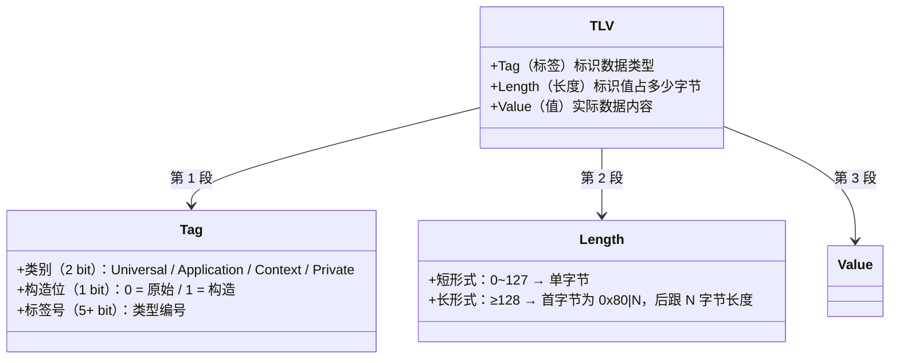
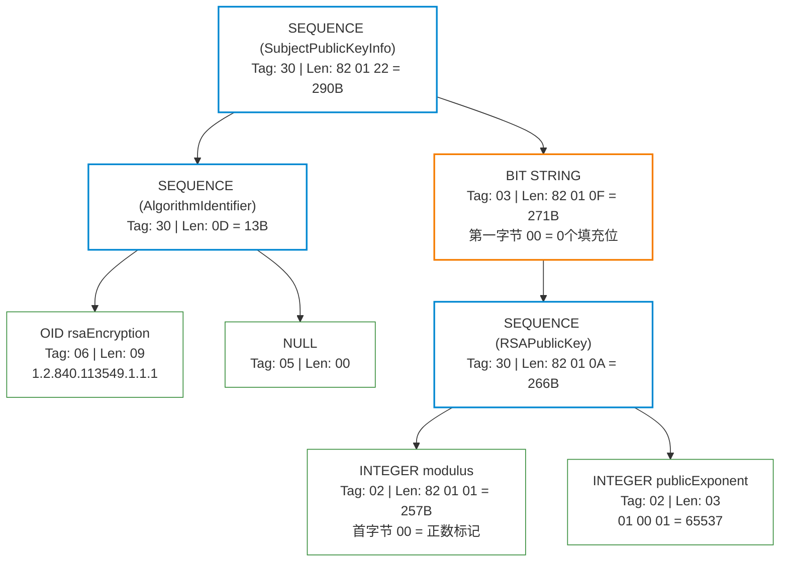

# ASN.1 基础

**本文你会学到**：

- 为什么密码学世界里几乎所有的数据结构（密钥、证书、签名）都用 ASN.1 描述
- ASN.1 的基本类型（`INTEGER`、`BIT STRING`、`OCTET STRING`、`OID` 等）各是什么角色
- 结构化类型（`SEQUENCE`、`SET`、`CHOICE`）如何组合出复杂的数据结构
- 标签机制（`IMPLICIT` / `EXPLICIT`）如何消除歧义，以及为什么 `CHOICE` 必须用 `EXPLICIT`
- DER 编码的 TLV（Tag-Length-Value）结构如何保证"同一份数据永远生成同一段字节"
- OID（对象标识符）是什么，以及密码学中常见的 OID 含义
- 常见 ASN.1 结构（`AlgorithmIdentifier`、`SubjectPublicKeyInfo`、`TBSCertificate`）如何组合成证书
- 如何用 Bouncy Castle 的 ASN.1 API 在 Java 中读写 ASN.1 结构

## 🤔 为什么需要了解 ASN.1？

你打开一个 X.509 证书文件，看到的不是明文，而是一堆二进制数据。把这个文件扔进 OpenSSL 或 Bouncy Castle，它却能精确地告诉你：这个证书的颁发者是谁、公钥用什么算法、有效期到什么时候。

这一切的前提是：证书的二进制格式有一个**严格的、标准化的结构定义**。这个结构定义语言就是 ASN.1（Abstract Syntax Notation One，抽象语法记法 1）。

⚙️ 想象 ASN.1 是密码学领域的"通用语言"——就像 JSON Schema 描述了 JSON 数据的结构，ASN.1 描述了密码学对象的结构。从算法参数、密钥编码到数字签名、加密消息，几乎所有 IETF 和 ITU-T 的密码学标准都用 ASN.1 来定义数据格式。

ASN.1 标准最早由 ISO 和 CCITT（现在的 ITU-T）在 1980 年代初联合制定，主要标准包括 X.680（语法定义）及 X.681~X.693 等配套标准。好消息是，你不需要完整掌握整个 ASN.1 标准才能用它——在密码学实践中，用到的是很小的一个子集。

### ASN.1 在密码学中的地位：为什么无处不在

如果你研究过密码学领域的主要标准，会发现一个规律：**几乎所有关键数据结构都用 `ASN.1` 来描述**。

| 标准 / 格式 | 说明 | 底层编码 |
|------------|------|---------|
| **X.509 证书**（RFC 5280） | 公钥、颁发者、有效期、扩展字段 | `DER` + Base64（`PEM`） |
| **PKCS#8**（RFC 5958） | 私钥的通用封装（`PrivateKeyInfo`） | `DER` + Base64（`PEM`） |
| **PKCS#12**（RFC 7292） | 密钥库（`.p12`/`.pfx`/`.jks`） | `DER` |
| **PKCS#7 / CMS**（RFC 5652） | 数字签名信封（详见「CMS 与 S/MIME」） | `DER` |
| `OCSP`（RFC 6960） | 在线证书状态检查 | `DER` over HTTP |
| **CSR**（RFC 2986） | 证书签名请求（`CertificationRequest`） | `DER` + Base64（`PEM`） |

🎯 `ASN.1` 之于密码学，就像 `JSON` 之于 REST API——两者都是**数据结构描述语言**。但 `ASN.1` 诞生于 1984 年，面向严格类型化、二进制高效传输的场景，而非人类可读性。`JSON` 牺牲效率换取可读性；`ASN.1` + `DER` 牺牲可读性换取**编码的严格唯一性**——这正是数字签名所需要的核心特性。

💡 **`PEM` 的本质**：你常见的 `-----BEGIN CERTIFICATE-----` 文件并不是独立格式，它只是把 `DER` 编码的二进制数据做了 `Base64` 编码，再加上人类可读的头尾标记。`PEM` = `DER` + `Base64` + 头尾标记，这就是为什么删掉 `PEM` 头尾并解码 Base64，你就能得到原始的 `DER` 字节流。

这也解释了为什么理解 `ASN.1` 和 `DER` 是密码学工程实践的基础：处理任何证书、密钥或签名时，你都在操作 `ASN.1` 编码的数据——只是它可能包在 `PEM` 外壳里。

## 📝 ASN.1 基础语法

在深入类型系统之前，先了解一下 ASN.1 的模块结构和注释语法，这样当你翻开 RFC 文档时不会一头雾水。

### 模块结构

ASN.1 的定义被组织在"模块"（module）中，每个模块有一个唯一的 OID 标识：

```
ModuleExample { iso(1) identified-organization(3) dod(6) internet(1)
  security(5) mechanisms(5) pkix(7) id-mod(0) 18 }
DEFINITIONS EXPLICIT TAGS ::=
BEGIN
-- EXPORTS ALL --
-- IMPORTS NONE --
-- 在这里定义类型...
END
```

关键字说明：

- `DEFINITIONS EXPLICIT TAGS ::=` — 指定默认标签模式为 `EXPLICIT`（另一种是 `IMPLICIT`，后续介绍）
- `EXPORTS ALL` — 本模块所有定义都可以被其他模块导入
- `IMPORTS` — 从其他模块导入类型定义

### 注释语法

ASN.1 有两种注释方式：

```
-- 这是单行注释，以 -- 开头和结尾

/* 这是块注释，
   注意：ASN.1 的块注释可以嵌套！
   /* 嵌套块注释 */
*/
```

与 Java 不同，ASN.1 的块注释支持嵌套，但你更常看到的是多行单行注释（因为块注释是后来才加入的）。

### 简单类型

简单类型是 ASN.1 的"原子单位"——它们直接存储一个值，不能包含其他类型。

| ASN.1 类型 | 说明 | Bouncy Castle 类 |
|-----------|------|-----------------|
| `BOOLEAN` | 布尔值，true 或 false | `ASN1Boolean` |
| `INTEGER` | 任意大小的有符号整数（补码编码） | `ASN1Integer` |
| `ENUMERATED` | 枚举值，`INTEGER` 的受限子集 | `ASN1Enumerated` |
| `NULL` | 显式的空值（注意：不是 Java 的 `null`） | `ASN1Null` / `DERNull` |
| `OBJECT IDENTIFIER` | 全局唯一标识符（OID） | `ASN1ObjectIdentifier` |
| `UTCTime` | UTC 时间（两位年份，通常解析为 1950~2049） | `ASN1UTCTime` / `DERUTCTime` |
| `GeneralizedTime` | 通用时间（四位年份，精度更高） | `ASN1GeneralizedTime` / `DERGeneralizedTime` |

💡 `NULL` 和 Java 的 `null` 完全不同。ASN.1 的 `NULL` 有真实的编码（`05 00`），表示"这个字段存在但值为空"；而 Java 的 `null` 更接近 ASN.1 中"该字段不存在"（absent）的概念。

关于时间类型：

- `UTCTime` 的格式为 `YYMMDDHHMMSSZ`，两位年份通常按 1950~2049 窗口解析
- `GeneralizedTime` 格式为 `YYYYMMDDHHMMSSZ`，四位年份消除了歧义
- 在 DER 编码中，两者都必须包含秒，且以 `Z`（UTC 时区）结尾

### 字符串与位串类型

ASN.1 提供了丰富的字符串类型，可以分为两类：**位串类型**和**字符编码类型**。

**位串类型**：

| 类型 | 说明 | BC 类 |
|------|------|-------|
| `BIT STRING` | 任意长度的比特串（编码时第一字节为填充位数） | `ASN1BitString` / `DERBitString` |
| `OCTET STRING` | 任意长度的字节串（即 byte 数组） | `ASN1OctetString` / `DEROctetString` |

`BIT STRING` 在密码学中用途广泛，比如 RSA 公钥的模数和指数就包装在 `BIT STRING` 中。`OCTET STRING` 则更直观——它就是一个 byte 数组，常用来存储加密后的数据或哈希值。

⚠️ `BIT STRING` 编码时，内容的第一字节表示"末尾有多少个填充比特"。例如存储 `0xAF`（二进制 `10101111`），如果只需要低 4 位，则填充位数为 4，内容编码为 `04 AF`。

**字符编码类型**（最常用的加粗）：

| 类型 | 说明 | BC 类 |
|------|------|-------|
| **`UTF8String`** | UTF-8 编码，推荐用于国际化 | `DERUTF8String` |
| **`PrintableString`** | ASCII 子集（字母、数字、部分符号） | `DERPrintableString` |
| **`IA5String`** | 全部 ASCII 字符 | `DERIA5String` |
| **`BMPString`** | Unicode BMP（基本多文种平面） | `DERBMPString` |
| `NumericString` | 仅数字和空格 | `DERNumericString` |
| `VisibleString` | 可打印 ASCII（无控制字符） | `DERVisibleString` |
| `GeneralString` | ISO 2375 注册的字符集 | `DERGeneralString` |
| `TeletexString` | T61 编码（8 位，支持转义字符） | `DERT61String` |
| `UniversalString` | 32 位字符编码 | `DERUniversalString` |

在现代密码学标准中，最常遇到的是 `UTF8String`、`PrintableString` 和 `IA5String`。

### 结构化类型

简单类型只能存储单个值。当你需要把多个字段组合在一起（比如证书包含版本号、序列号、颁发者等多个字段），就需要结构化类型。

#### SEQUENCE 和 SEQUENCE OF

`SEQUENCE` 类似 Java 的 `class`——它把一组**有序的**字段打包在一起，每个字段有明确的类型和位置。

```
-- 定义一个"人员信息"结构
PersonInfo ::= SEQUENCE {
    name     UTF8String,
    age      INTEGER,
    email    IA5String OPTIONAL
}
```

`SEQUENCE OF` 则类似 Java 的 `List<T>`——一组相同类型的有序元素：

```
-- 一组证书的序列
CertificateChain ::= SEQUENCE OF Certificate
```

#### SET 和 SET OF

`SET` 类似 `SEQUENCE`，也包含一组字段，但字段是**无序的**。

```
-- SET 中的字段顺序不重要
DirAttributes ::= SET {
    country  PrintableString,
    org      UTF8String
}
```

⚠️ 虽然 ASN.1 的 `SET` 本身是无序的，但在 **DER 编码中**，`SET` 的元素必须按编码值的字典序排列。这意味着解析时依赖 `SET` 的元素顺序是不安全的（除非你确定使用了 DER 编码）。

`SET OF` 类似 Java 的 `Set<T>`——一组相同类型的无序元素（DER 编码时同样会排序）。

#### 在 Bouncy Castle 中使用结构化类型

``` java title="构建 ASN.1 SEQUENCE"
ASN1EncodableVector v = new ASN1EncodableVector();
v.add(new ASN1Integer(1));                           // version
v.add(new DERUTF8String("Alice"));                   // name
v.add(new DEROctetString(Hex.decode("AABBCCDD")));   // data

// 编码为 DER 格式的 SEQUENCE
ASN1Primitive seq = new DERSequence(v);
byte[] encoded = seq.getEncoded(ASN1Encoding.DER);
```

### 标签（IMPLICIT / EXPLICIT）

当你在一个 `SEQUENCE` 或 `SET` 中有两个相同类型的字段时，解析器就无法区分谁是谁——它们有相同的 Tag。ASN.1 用**标签（tagging）**来解决这个问题。

```
UserInfo ::= SEQUENCE {
    name        UTF8String,
    email       [0] UTF8String,
    phoneNumber [1] UTF8String OPTIONAL
}
```

方括号 `[0]`、`[1]` 就是标签编号。但标签有两种模式，它们对编码的影响完全不同：

**EXPLICIT 标签**——在你的标签外面再包一层：

```
编码：[你的标签] [原始标签] [原始值]
```

**IMPLICIT 标签**——你的标签**替换**原始标签：

```
编码：[你的标签] [原始值]
```

两者的关键区别在于：EXPLICIT 保留了原始标签信息，所以即使没有文档也能知道原始类型；IMPLICIT 丢失了原始标签，必须依赖 ASN.1 定义文档才能正确解析。

用一个类比来理解：

- `EXPLICIT` 就像寄快递时在外箱上贴了"内含易碎品"的标签，打开箱子还能看到商品本身的包装和标签
- `IMPLICIT` 就像直接在商品本身上贴新标签，原来的品牌标签被盖住了

⚠️ **`IMPLICIT` 标签有一个严重问题**：如果被标记的是结构化类型（`SEQUENCE` 或 `SET`），一个 `IMPLICIT` 标签的原始类型 `SEQUENCE` 和一个 `EXPLICIT` 标签内含单个 `SEQUENCE` 元素的编码会**完全相同**，导致无法区分。Bouncy Castle 的 `getInstance(ASN1TaggedObject, boolean)` 方法中，`boolean` 参数就是用来告诉解析器使用的是 `IMPLICIT`（`true`）还是 `EXPLICIT`（`false`）。

### CHOICE 和 ANY

`CHOICE` 表示一个字段可以取多种类型中的**任意一种**，类似 C 语言的 `union`：

```
AttributeValue ::= CHOICE {
    intValue    INTEGER,
    strValue    UTF8String,
    binValue    OCTET STRING
}
```

解析时，解析器通过**原始标签**来判断实际类型是哪个——这就是为什么 `CHOICE` 字段必须保留原始标签。

⚠️ **`CHOICE` 类型的标签必须使用 `EXPLICIT`**，无论模块的默认标签模式是什么。因为 `CHOICE` 的原始标签是解析器判断类型的唯一线索，如果用 `IMPLICIT` 覆盖了原始标签，就再也无法知道实际是什么类型了。Bouncy Castle 提供了 `ASN1Choice` 标记接口，建议在定义 `CHOICE` 类型时实现它。

## 📦 DER 编码规则

ASN.1 定义了多种编码规则（BER、DER、CER、PER、OER 等），但密码学实践中**几乎只用 DER**（Distinguished Encoding Rules，唯一编码规则）。原因是：DER 保证同一份数据永远生成完全相同的字节序列——这对数字签名和 MAC 至关重要，因为签名验证方必须能精确重现签名时的编码。

### TLV 结构（Tag-Length-Value）

所有 ASN.1 编码都遵循 `TLV` 三段式结构：



**Tag（标签）**——1 个或多个字节：

- **高 2 位**：类别（class）
  - `00` = Universal（通用类型，ASN.1 预定义的类型）
  - `01` = Application（应用特定）
  - `10` = Context-specific（上下文特定，用于 `[0]`、`[1]` 等标签）
  - `11` = Private（私有）
- **第 3 位**：构造/原始（P/C bit）
  - `0` = Primitive（原始类型，如 `INTEGER`、`OCTET STRING` 的值）
  - `1` = Constructed（构造类型，如 `SEQUENCE`、`SET` 内含子元素）
- **低 5 位**：标签号（0~30 直接编码，31 以上用多字节编码）

**Length（长度）**——1 个或多个字节：

- **短形式**：值 0~127 时，长度占 1 字节
- **长形式**：值 >= 128 时，首字节为 `0x80 | N`（N 是后续长度字节数），后跟 N 字节的大端序长度值

**Value（值）**——实际数据内容，长度由 Length 指定。

### 各类型的编码示例

下面用几个常见类型的编码来加深理解。

#### INTEGER 编码

编码 `INTEGER 42`：

```
02 01 2A
│  │  └── Value: 42（十六进制 0x2A）
│  └───── Length: 1 字节
└──────── Tag: 02（Universal, Primitive, 标签号 2 = INTEGER）
```

编码 `INTEGER 128`（需要 2 字节）：

```
02 02 00 80
│  │  │  └── Value: 0x0080 = 128
│  │  └───── 前导 0x00 保证正数（最高位为符号位）
│  └──────── Length: 2 字节
└─────────── Tag: 02
```

💡 `INTEGER` 是有符号的（补码编码）。当最高位为 1 时代表负数，所以编码正数 `128`（`0x80`）时必须补一个 `0x00` 前导字节，否则会被误读为负数。

#### OCTET STRING 编码

编码 `OCTET STRING {0xAB, 0xCD, 0xEF}`：

```
04 03 AB CD EF
│  │  └─────── Value: 三个字节
│  └────────── Length: 3 字节
└───────────── Tag: 04（Universal, Primitive, 标签号 4 = OCTET STRING）
```

#### SEQUENCE 编码

编码 `SEQUENCE { INTEGER 1, OCTET STRING {0xAB, 0xCD} }`：

```
30 07 02 01 01 04 02 AB CD
│  │  ┌──────────────────┘ 嵌套的 OCTET STRING
│  │  │ 02 01 01 = INTEGER 1
│  └── Length: 内部共 7 字节
└───── Tag: 30（Universal, Constructed, 标签号 16 = SEQUENCE）
```

`0x30` 的二进制是 `0011 0000`：高 2 位 `00`（Universal），第 3 位 `1`（Constructed），低 5 位 `10000`（16 = SEQUENCE）。

#### NULL 编码

编码 `NULL`：

```
05 00
│  └── Length: 0 字节（没有值）
└───── Tag: 05（Universal, Primitive, 标签号 5 = NULL）
```

### TLV 编码深度解析：手工解码一个 RSA 公钥

理论讲完，来做一次真实的解码练习。以 RSA-2048 公钥的 `SubjectPublicKeyInfo`（`SPKI`）为例，逐字节拆解它的 `DER` 编码。`SPKI` 是 X.509 证书中存储公钥的标准结构（RFC 5280），`PKCS#1` 格式的 RSA 公钥被嵌套在其内部的 `BIT STRING` 中。

整体层次如下：



逐字节注释（括号内为十六进制）：

```
30 82 01 22          ← SEQUENCE，长形式：后 2 字节 = 0x0122 = 290
│
├─ 30 0D             ← SEQUENCE（AlgorithmIdentifier），定长 13 字节
│  ├─ 06 09          ← OID，9 字节
│  │  2A 86 48 86 F7 0D 01 01 01
│  │  └─ 2A = 1*40+2 = 42（前两位 1.2 压缩为单字节）
│  │     86 48 = 840（base-128：6*128+72）
│  │     86 F7 0D = 113549（6*128²+119*128+13）
│  │     01 01 01 = 后缀 .1.1.1
│  └─ 05 00          ← NULL（算法参数为空）
│
└─ 03 82 01 0F 00    ← BIT STRING，长形式 271 字节，填充位 0（字节对齐）
   └─ 30 82 01 0A    ← SEQUENCE（RSAPublicKey PKCS#1）
      ├─ 02 82 01 01 ← INTEGER（modulus），257 字节
      │  00 [256字节模数]
      │  └─ 前导 0x00：最高位为1时须补零，避免被解读为负数
      └─ 02 03        ← INTEGER（publicExponent），3 字节
         01 00 01     = 65537（标准公钥指数 e）
```

💡 **为什么 RSA-2048 的模数是 257 字节而不是 256 字节？**
RSA-2048 的模数是 2048 位 = 256 字节，但 `INTEGER` 采用有符号补码编码。当最高位为 `1` 时会被解释为负数，所以 `DER` 规定必须在前面补一个 `0x00` 字节以确保正数语义，因此变为 257 字节。

用 OpenSSL 可以验证上面的解析：

``` bash title="用 OpenSSL asn1parse 逐层解析公钥 DER"
# 从证书提取公钥 DER
openssl x509 -in cert.pem -pubkey -noout \
  | openssl pkey -pubin -outform DER -out pubkey.der

# 逐层解析 TLV 结构
openssl asn1parse -in pubkey.der -inform DER
```

### DER 对 BER 的限制

BER（Basic Encoding Rules）比较宽松，允许同一数据产生多种编码。DER 在 BER 的基础上加了严格的限制，确保编码的唯一性：

| 限制 | 说明 |
|------|------|
| 只能用 definite-length | 禁止 indefinite-length（`0x80` 长度 + `00 00` 结束标记） |
| 长度必须最短 | 不允许前导零，比如长度 127 不能写成 `0x81 0x00 0x7F` |
| DEFAULT 值不编码 | 字段值等于 DEFAULT 时，该字段不出现在编码中 |
| SET 元素必须排序 | 按 DER 编码值的字典序排列 |

🎯 **实践建议**：如果你在做任何涉及签名或 MAC 的 ASN.1 处理，**始终使用 DER 编码**。Bouncy Castle 默认就使用 DER，但如果你手动构造 `BER` 编码的数据再参与签名运算，验证方可能因为编码不一致而验证失败。

### 为什么 DER 对安全性至关重要？

DER 的"同一份数据永远生成同一段字节"这个特性，不仅仅是为了方便——它是**数字签名安全性的基础**。

#### 签名与编码确定性

数字签名的本质是对消息的哈希值签名。当消息是一个 ASN.1 结构（比如证书的 TBSCertificate）时，签名方对 TBSCertificate 的 DER 编码计算哈希，验证方也需要对 TBSCertificate 的 DER 编码计算哈希。如果编码不唯一——同一份逻辑数据可以产生多种合法的字节序列——验证方就无法重现签名方的哈希值。

```
签名方：H(DER_encode(TBS)) → 签名
验证方：H(DER_encode(TBS)) → 应该得到相同的哈希值
```

如果签名方和验证方的编码不一致（比如一个用 BER，一个用 DER），签名验证就会失败——即使证书内容完全相同。这不是"偶尔失败"的问题，而是**确定性编码是签名方案正确性的前提**。

#### BER 歧义攻击：从理论到现实

BER 允许同一数据有多种合法编码，这在安全上下文中是危险的。攻击者可以利用 BER 的歧义性来构造**合法编码但恶意意图**的数据。

**攻击 1：冗余编码的零前导字节**

BER 允许 `INTEGER` 的编码包含多余的前导零字节。例如，整数 `1` 可以编码为：

```
# DER（最短编码，正确）
02 01 01

# BER（冗余编码，合法但危险）
02 02 00 01
```

DER 规则要求长度必须最短（`02 01 01`），但 BER 允许 `02 02 00 01`。如果验证方只做 BER 解析不检查 DER 合规性，这两种编码都会被接受为相同的整数 `1`——但它们产生不同的哈希值。

**攻击 2：SET 元素的顺序歧义**

BER 中 `SET` 的元素是无序的。假设一个签名结构包含两个字段 A 和 B：

```
SET { A, B }  和  SET { B, A }
```

在 BER 中两者都是合法的，但它们的 DER 编码完全不同，哈希值也不同。如果实现者在构造待签名数据时使用了 BER（不排序），而验证者期望 DER（排序），签名验证就会失败。更危险的是，如果双方都接受 BER 且不排序，攻击者可以交换字段顺序来构造不同的合法签名。

**攻击 3：indefinite-length 编码歧义**

BER 支持 `indefinite-length`（不定长）编码——用 `0x80` 作为长度，以 `00 00` 结束标记。同一数据可以有 definite-length 和 indefinite-length 两种编码，产生完全不同的字节序列：

```
# definite-length（DER 标准方式）
30 0A 02 01 05 02 01 03 02 01 01

# indefinite-length（BER 允许）
30 80 02 01 05 02 01 03 02 01 01 00 00
```

两种编码代表完全相同的逻辑数据，但哈希值完全不同。如果签名方和验证方使用不同的编码方式，签名验证就会失败。更危险的是，indefinite-length 的结束标记 `00 00` 之后的任何额外字节会被某些宽松解析器静默忽略，攻击者可能利用这一点在协议交互中构造非预期的编码变体。

这就是为什么 **DER 禁止了所有这些歧义性**：最短长度、SET 排序、禁止不定长编码。在使用 DER 的前提下，每种 ASN.1 值只有**唯一一种**合法编码，攻击者无法在不改变逻辑数据的前提下操纵字节表示。

#### 历史教训

2006 年，Daniel Bleichenbacher 展示了一种针对 RSA PKCS#1 v1.5 签名的伪造攻击（Bleichenbacher's RSA signature forgery）。某些实现存在三个缺陷：ASN.1 DigestInfo 解析后**不检查尾部剩余字节**（trailing garbage tolerance）、**ASN.1 长度字段解析过于宽松**、以及 **FF padding 检查不严格**。Bleichenbacher 利用这些漏洞，配合小公钥指数（e=3）的数学特性，只需让签名块的前一小部分满足约束，剩余字节可以任意填充来凑成完全立方数，从而构造出能通过验证的伪造签名。

这个攻击影响了多个主流实现（包括 OpenSSL 和 NSS），直接推动了业界对 DER 严格合规性的重视。

### BER vs DER vs CER：三种编码规则的区别

`ASN.1` 只定义了数据的**逻辑结构**，把数据变成字节流需要**编码规则**（Encoding Rules）。`X.690` 标准定义了三种最常见的编码规则，它们都以 `BER` 为基础：

| 特性 | `BER` | `DER` | `CER` |
|------|-------|-------|-------|
| 全称 | Basic Encoding Rules | Distinguished Encoding Rules | Canonical Encoding Rules |
| 长度编码 | 定长或不定长均可 | 必须用最短**定长**形式 | <1000B 用短定长，≥1000B 用**不定长** |
| `SET` 元素排序 | 不要求 | 字典序排列 | 字典序排列 |
| `BOOLEAN TRUE` 编码 | 任意非零值均合法 | 必须为 `0xFF` | 必须为 `0xFF` |
| 字符串分段（Constructed） | 允许分段传输 | 禁止，必须为 Primitive 整体 | 允许分段（≥1000B 时） |
| 编码唯一性 | ❌ 同一值可有多种编码 | ✅ 唯一确定 | ✅ 唯一确定 |
| 典型用途 | 通用解析、向下兼容 | X.509、PKCS#8、CSR、签名 | LDAP、流式 S/MIME |

`CER` 是专门为**流式处理大型数据**设计的——当不知道数据总长度时，不定长编码允许边产生边发送，无需先缓存全部内容。`DER` 则专为**签名可验证性**设计，任何对 `DER` 编码数据的签名都可以被独立重现和验证。

🎯 **记忆口诀**：签名选 `DER`（D for Deterministic 确定性），流式选 `CER`（C for Chunked 分块），读旧数据用 `BER`（B for Basic 宽容）。

⚠️ **为什么签名必须用 `DER` 而非 `BER`？**
签名的本质是 `Sign(H(消息字节序列))`。`BER` 允许同一逻辑数据有多种字节序列，这会导致：

- **签名方与验证方使用不同编码** → 哈希不一致 → 签名验证失败
- **攻击者把合法签名数据改写为另一种 `BER` 编码** → 哈希改变 → 在宽松实现中可能绕过验证

`DER` 的唯一性封堵了这个攻击面：每种 `ASN.1` 值只有**唯一一种**合法 `DER` 编码，攻击者无法在不改变逻辑数据的前提下操纵字节表示。

## 🏷️ OID——对象标识符

### 什么是 OID？

在密码学世界里，每个算法、每个参数类型、每个扩展字段都需要一个**全局唯一的标识符**。OID（Object Identifier，对象标识符）就是用来做这件事的。

💡 想象 OID 是一棵全球共享的"族谱树"——从根节点开始，每个节点分配一个编号，沿着路径走下去就得到一串用点分隔的数字，如 `1.2.840.113549.1.1.11`。任何组织都可以申请自己的 OID 分支，然后在下面自由定义子节点。

OID 树的三个主分支：

- `0.` — ITU-T 分配
- `1.` — ISO 分配
- `2.` — 联合 ISO/ITU-T 分配

### OID 编码规则

OID 的 DER 编码有一些特殊规则：

- 前两个数字 `X.Y` 被编码为单个字节 `X * 40 + Y`（因此 `Y` 必须 < 40）
- 后续每个数字使用 base-128 编码：每 7 位为一组，最高位为 1 表示"后面还有字节"，最高位为 0 表示"这是最后一组"

例如 OID `1.2.840.113549`：

```
06 06 2A 86 48 86 F7 0D
│  │  ┌────────────────── 编码值
│  └── Length: 6 字节
└───── Tag: 06（Universal, Primitive, 标签号 6 = OBJECT IDENTIFIER）
```

编码过程：`1.2` → `1*40+2 = 42 = 0x2A`，`840` → `0x86 0x48`（840 = 6*128 + 72），`113549` → `0x86 0xF7 0x0D`（113549 = 6*128² + 119*128 + 13）。

### 密码学中常见的 OID

| OID | 含义 |
|-----|------|
| `1.2.840.113549.1.1.1` | RSA 加密（PKCS#1） |
| `1.2.840.113549.1.1.11` | SHA-256 with RSA（RSA 签名） |
| `1.2.840.113549.1.1.12` | SHA-384 with RSA |
| `1.2.840.113549.1.1.13` | SHA-512 with RSA |
| `1.2.840.10045.2.1` | EC 公钥 |
| `1.2.840.10045.4.3.2` | ECDSA with SHA-256 |
| `2.16.840.1.101.3.4.2.1` | SHA-256 哈希算法 |
| `1.3.6.1.5.5.7.1.1` | Authority Information Access（证书扩展） |
| `1.3.14.3.2.26` | SHA-1（已弃用） |

注意前缀 `1.2.840.113549` 属于 RSA 公司（美国）的 OID 分支，`1.2.840.10045` 属于 ANSI（美国国家标准学会）分支，`2.16.840.1.101` 属于美国政府的 NIST 分支。

## 🗂️ 常见 ASN.1 结构速查

在 X.509 证书、PKCS 等密码学标准中，你会反复遇到以下几个 ASN.1 结构。

### AlgorithmIdentifier

```
AlgorithmIdentifier ::= SEQUENCE {
    algorithm   OBJECT IDENTIFIER,
    parameters  ANY DEFINED BY algorithm OPTIONAL
}
```

几乎所有密码学标准都用 `AlgorithmIdentifier` 来标识使用的算法及其参数。比如 RSA 公钥的算法标识为 `1.2.840.113549.1.1.1`，参数为 `NULL`。

### SubjectPublicKeyInfo

```
SubjectPublicKeyInfo ::= SEQUENCE {
    algorithm        AlgorithmIdentifier,
    subjectPublicKey BIT STRING
}
```

这是 X.509 证书中存储公钥的标准结构。公钥本身被包裹在 `BIT STRING` 中，而算法标识告诉解析器这个公钥用什么算法。

### TBSCertificate（证书主体）

```
TBSCertificate ::= SEQUENCE {
    version         [0] EXPLICIT INTEGER DEFAULT v1,
    serialNumber    CertificateSerialNumber,
    signature       AlgorithmIdentifier,
    issuer          Name,
    validity        Validity,
    subject         Name,
    subjectPublicKeyInfo SubjectPublicKeyInfo,
    ...
}
```

`TBS` 表示"to be signed"——这个结构就是证书中实际被签名的部分。注意 `version` 字段使用了 `EXPLICIT` 标签 `[0]`，且带有 `DEFAULT` 值。

## ☕ 在 Java 中使用 ASN.1

Bouncy Castle 提供了完整的 ASN.1 API，位于 `org.bouncycastle.asn1` 包下。理解了 ASN.1 的基本概念后，用这个 API 就会很直观。

### ASN.1 解析安全实践

ASN.1 解析是密码学代码中最容易出安全漏洞的地方之一。攻击者可以构造恶意的 ASN.1 数据来触发解析器的各种异常行为。以下是几个常见的安全陷阱和防护原则。

#### 常见安全陷阱

**陷阱 1：类型混淆**

ASN.1 的 Tag 决定了类型，但攻击者可以伪造 Tag。比如，一个应该是 `INTEGER` 的字段，攻击者可能把它编码为 `SEQUENCE`。如果代码直接强转而不检查类型：

```java
// ❌ 危险：如果实际是 SEQUENCE 而非 INTEGER，会抛出 ClassCastException
ASN1Integer version = (ASN1Integer) seq.getObjectAt(0);

// ✅ 安全：使用 getInstance() 做类型检查
ASN1Integer version = ASN1Integer.getInstance(seq.getObjectAt(0));
```

**陷阱 2：OPTIONAL 字段缺失**

当 ASN.1 定义中包含 `OPTIONAL` 字段时，解析代码必须处理字段不存在的情况。如果盲目按索引访问：

```java
// ❌ 危险：comment 是 OPTIONAL，可能不存在
ASN1TaggedObject tagged = ASN1TaggedObject.getInstance(seq.getObjectAt(3));

// ✅ 安全：按标签号查找，找不到时返回 null
ASN1TaggedObject tagged = findTaggedObject(seq, 0);
if (tagged != null) {
    String comment = DERUTF8String.getInstance(tagged, false).getString();
}
```

**陷阱 3：BER 不合规编码绕过验证**

即使你使用 Bouncy Castle 的 DER 解析器，传入的数据仍可能是 BER 编码的。`ASN1Primitive.fromByteArray()` 能解析 BER，但不保证输出符合 DER。如果解析后的数据要参与签名验证，应该使用 `ASN1InputStream` 配合 `DER` 标记来强制 DER 合规检查。

#### 防御性解析原则

- **始终使用 `getInstance()` 而非强制类型转换**：`getInstance()` 在类型不匹配时抛出带有描述信息的 `IllegalArgumentException`，而非 `ClassCastException`；同时它还支持 `byte[]` 自动解析、`null` 安全返回、以及 tagged object 的 `getInstance(tagged, explicit)` 重载
- **对 OPTIONAL 字段做空值检查**：不要假设所有字段都存在，按标签号查找比按索引查找更安全
- **编码后重新解析验证**：如果你构造了一个 ASN.1 对象并要对其签名，先编码再解析回来，确认重建后的对象与原始对象一致
- **使用 DER 而非 BER**：`getEncoded(ASN1Encoding.DER)` 而非 `getEncoded()`（后者可能使用 BER）

### 常见的 ASN.1 安全漏洞

`ASN.1` 解析是密码学代码中历史上漏洞频发的区域。以下两个具体案例涵盖了最典型的两类漏洞模式：

#### CVE-2006-4339：OpenSSL RSA 签名伪造

这是 Daniel Bleichenbacher 在 2006 年发现的针对 RSA `PKCS#1 v1.5` 签名验证的漏洞（也称 Bleichenbacher '06 forgery，注意区别于 1998 年的 PKCS#1 padding oracle 攻击）。

**根因在于 `ASN.1` 解析过于宽松**。RSA 签名验证需要解析 `DigestInfo` 结构：

```
DigestInfo ::= SEQUENCE {
    digestAlgorithm  AlgorithmIdentifier,
    digest           OCTET STRING   -- 实际的哈希值
}
```

有漏洞的实现犯了三个错误：

1. **尾部垃圾字节容忍**：解析完 `DigestInfo` 后，**未检查是否还有剩余字节**。只要前面的 `DigestInfo` 有效，结构末尾填充任意字节也能通过验证
2. **长度字段宽松**：未强制要求 `DER` 最短长度编码，允许冗余的 `BER` 长度形式
3. **FF padding 检查不严格**：`PKCS#1 v1.5` 格式要求签名块以 `0x00 0x01 0xFF...0xFF 0x00` 开头，但某些实现对 padding 长度检查不足

**危害放大因子**：当公钥指数 `e=3` 时，攻击者只需让签名块的前一小部分满足约束，剩余字节可以自由控制来凑出完全立方数，从而**无需知道私钥就能构造出通过验证的伪造签名**。

**修复原则**：

- 解析 `DigestInfo` 后，**必须验证消耗的字节数恰好等于输入总字节数**（检查尾部无剩余）
- 使用 `DER` 解析器（而非 `BER`）以强制最短长度编码
- 公钥指数推荐 `e=65537`，避免使用小指数（`e=3`）

#### `BIT STRING` 填充字节漏洞

`BIT STRING` 在 `DER` 编码中，第一字节是"末尾填充位数"（`0x00` 表示字节对齐）。以下两种异常编码会导致解析歧义：

**问题 1：非法填充位数**
填充位数字节的合法值是 `0~7`。如果编码为 `03 01 08`（填充 8 位，但没有数据字节），这在 `DER` 规范下是非法的，但部分实现会静默接受。

**问题 2：空 `BIT STRING` 与 `NULL` 的混淆**
`BIT STRING { 0 unused bits, 0 bytes }`（编码 `03 01 00`）和 `NULL`（编码 `05 00`）在某些宽松解析器中被视为等价，导致不同实现对同一证书的公钥内容产生不同解读——进而绕过证书固定（Certificate Pinning）检查。

这类漏洞在 X.509 证书的 `SubjectPublicKeyInfo` 公钥字段中影响最大：攻击者构造含有异常 `BIT STRING` 的证书，使不同实现解析出不同的公钥，从而绕过针对特定公钥的固定策略。

``` java title="安全读取 BIT STRING 的方式"
// ❌ 不安全：直接读字节，未校验填充位数
byte[] raw = ((ASN1BitString) obj).getBytes();

// ✅ 安全：使用 DERBitString，内部会校验填充格式
DERBitString bits = DERBitString.getInstance(obj);
int padBits = bits.getPadBits();   // 应为 0（公钥字段必须字节对齐）
byte[] payload = bits.getBytes();  // 实际内容（已去除填充字节的影响）

// ✅ 额外验证：公钥字段的 BIT STRING 填充位必须为 0
if (padBits != 0) {
    throw new IllegalArgumentException("公钥 BIT STRING 填充位非零：" + padBits);
}
```

📌 **关联阅读**：更多签名相关的 `DER` 编码安全问题，见「数字签名」中的签名格式规范章节。

### 解析 ASN.1 结构

Bouncy Castle 的 ASN.1 对象几乎都提供静态 `getInstance()` 方法，它可以接受多种输入类型：

``` java title="getInstance() 的多种用法"
// 从 DER 编码的字节数组解析
ASN1Primitive obj = ASN1Primitive.fromByteArray(encodedBytes);

// 从已有的 ASN1Sequence 获取特定类型
ASN1Integer version = ASN1Integer.getInstance(seq.getObjectAt(0));

// 从 ASN1TaggedObject 获取，需指定标签模式（true=IMPLICIT, false=EXPLICIT）
ASN1String name = DERUTF8String.getInstance(taggedObj, false);
```

💡 `getInstance()` 的设计是为了解决类型转换的安全问题。从网络接收的数据通常是 `ASN1Sequence`（原始组合），而应用层代码中的对象是具体类型（如 `AlgorithmIdentifier`）。直接强转可能导致 `ClassCastException`，而 `getInstance()` 两种类型都能接受。

### 定义自己的 ASN.1 对象

假设你要处理以下 ASN.1 定义：

```
SimpleStructure ::= SEQUENCE {
    version  INTEGER DEFAULT 0,
    created  GeneralizedTime,
    data     OCTET STRING,
    comment  [0] UTF8String OPTIONAL
}
```

对应的 Java 类应该继承 `ASN1Object`，实现 `toASN1Primitive()` 方法，并遵循 Bouncy Castle 的标准模式：

``` java title="自定义 ASN.1 对象的标准模式"
public class SimpleStructure extends ASN1Object {

    private final BigInteger version;
    private final Date created;
    private final byte[] data;
    private String comment;

    // 标准的 getInstance() 工厂方法
    public static SimpleStructure getInstance(Object obj) {
        if (obj instanceof SimpleStructure) {
            return (SimpleStructure) obj;
        } else if (obj != null) {
            return new SimpleStructure(ASN1Sequence.getInstance(obj));
        }
        return null;
    }

    // 私有构造函数——从 ASN1Sequence 解析
    private SimpleStructure(ASN1Sequence seq) {
        int index = 0;

        // DEFAULT 字段：检查是否存在，不存在则为默认值
        if (seq.getObjectAt(0) instanceof ASN1Integer) {
            this.version = ASN1Integer.getInstance(
                seq.getObjectAt(0)).getValue();
            index++;
        } else {
            this.version = BigInteger.ZERO;
        }

        this.created = ASN1GeneralizedTime.getInstance(
            seq.getObjectAt(index++)).getDate();

        this.data = Arrays.clone(
            ASN1OctetString.getInstance(seq.getObjectAt(index++)).getOctets());

        // OPTIONAL 字段：遍历剩余元素查找标签
        for (int i = index; i != seq.size(); i++) {
            ASN1TaggedObject t = ASN1TaggedObject.getInstance(seq.getObjectAt(i));
            if (t.getTagNo() == 0) {
                comment = DERUTF8String.getInstance(t, false).getString();
            }
        }
    }

    // 序列化为 DER 编码
    @Override
    public ASN1Primitive toASN1Primitive() {
        ASN1EncodableVector v = new ASN1EncodableVector();

        // DER 规则：DEFAULT 值不编码
        if (!version.equals(BigInteger.ZERO)) {
            v.add(new ASN1Integer(version));
        }

        v.add(new DERGeneralizedTime(created));
        v.add(new DEROctetString(data));

        // OPTIONAL 字段：仅当值非 null 时编码
        if (comment != null) {
            v.add(new DERTaggedObject(false, 0, new DERUTF8String(comment)));
        }

        return new DERSequence(v);
    }
}
```

⚠️ **不可变性原则**：`ASN1Object` 提供了 `equals()` 和 `hashCode()` 实现，因此子类应该是**不可变的**。注意 `ASN1OctetString` 返回的 `byte[]` 不是副本，所以需要用 `Arrays.clone()` 做防御性拷贝。

### 常用工具方法

``` java title="ASN.1 编解码常用操作"
// 任意 ASN1Object 编码为 DER 字节数组
byte[] derBytes = asn1Object.getEncoded(ASN1Encoding.DER);

// 从 DER 字节数组还原 ASN1Primitive
ASN1Primitive fromBytes = ASN1Primitive.fromByteArray(derBytes);

// 判断编码类型
boolean isDER = true;  // 始终用 DER 进行签名/MAC 操作
boolean isBER = false; // BER 更宽松，但可能产生不同编码
```

### Java 解析 ASN.1：Bouncy Castle ASN1Primitive API

最常见的实际需求：**从 `PEM` 文件读取证书并提取关键字段**，以及**手工构造 `DER` 序列再编码为 `PEM`**。下面演示完整流程——`PEM` → `DER` → `ASN1Primitive`，以及逆向。

Maven 依赖：

``` xml title="Bouncy Castle 依赖（bcpkix 包含 PEM 解析器）"
<dependency>
    <groupId>org.bouncycastle</groupId>
    <artifactId>bcpkix-jdk18on</artifactId>
    <version>1.79</version>
</dependency>
```

``` java title="从 PEM 证书提取公钥算法、序列号和顶层 ASN.1 结构"
import org.bouncycastle.asn1.*;
import org.bouncycastle.asn1.x509.*;
import org.bouncycastle.cert.X509CertificateHolder;
import org.bouncycastle.openssl.PEMParser;

import java.io.FileReader;

public class CertParser {
    public static void main(String[] args) throws Exception {
        // 1. PEM → X509CertificateHolder（内部已解析为 ASN.1 对象树）
        try (PEMParser pem = new PEMParser(new FileReader("cert.pem"))) {
            X509CertificateHolder cert =
                (X509CertificateHolder) pem.readObject();

            // 2. 获取序列号（底层是 ASN1Integer）
            System.out.println("序列号: " + cert.getSerialNumber());

            // 3. 获取签名算法 OID
            AlgorithmIdentifier sigAlg = cert.getSignatureAlgorithm();
            System.out.println("签名算法 OID: " + sigAlg.getAlgorithm().getId());

            // 4. 获取公钥结构（SubjectPublicKeyInfo → AlgorithmIdentifier + BIT STRING）
            SubjectPublicKeyInfo spki = cert.getSubjectPublicKeyInfo();
            String pubKeyAlg = spki.getAlgorithm().getAlgorithm().getId();
            System.out.println("公钥算法 OID: " + pubKeyAlg);

            // 5. 用底层 ASN1Sequence 直接遍历证书三个顶层字段：
            //    [0] TBSCertificate, [1] signatureAlgorithm, [2] signatureValue
            ASN1Sequence certSeq = ASN1Sequence.getInstance(cert.getEncoded());
            System.out.println("证书顶层字段数（应为 3）: " + certSeq.size());

            // 6. 从 TBSCertificate 取出 subject DN
            ASN1Sequence tbs = ASN1Sequence.getInstance(certSeq.getObjectAt(0));
            // TBS 字段顺序：version[0], serialNumber, signature, issuer, validity, subject, ...
            // subject 是 tbs 的第 5 个字段（0-indexed，version 占一个 tagged object）
            System.out.println("TBS 字段数: " + tbs.size());
        }
    }
}
```

``` java title="手工构造 DER 序列并编码为 PEM"
import org.bouncycastle.asn1.*;
import org.bouncycastle.util.io.pem.PemObject;
import org.bouncycastle.util.io.pem.PemWriter;

import java.io.StringWriter;
import java.math.BigInteger;

public class BuildDer {
    public static void main(String[] args) throws Exception {
        // 手工构造：SEQUENCE { INTEGER 42, UTF8String "Hello ASN.1" }
        ASN1EncodableVector v = new ASN1EncodableVector();
        v.add(new ASN1Integer(BigInteger.valueOf(42)));
        v.add(new DERUTF8String("Hello ASN.1"));
        DERSequence seq = new DERSequence(v);

        // 编码为 DER 字节数组
        byte[] derBytes = seq.getEncoded(ASN1Encoding.DER);

        // DER → PEM：PemObject 类型字符串出现在 BEGIN/END 标记中
        StringWriter sw = new StringWriter();
        try (PemWriter pw = new PemWriter(sw)) {
            pw.writeObject(new PemObject("EXAMPLE", derBytes));
        }
        System.out.println(sw);
        // 输出：
        // -----BEGIN EXAMPLE-----
        // MBMCASpMC0hlbGxvIEFTTi4x
        // -----END EXAMPLE-----

        // PEM → DER → 重新解析（往返验证）
        byte[] redecoded = java.util.Base64.getMimeDecoder()
            .decode(sw.toString()
                .replaceAll("-----.*-----", "").trim());
        ASN1Sequence reparsed = ASN1Sequence.getInstance(redecoded);
        System.out.println("往返验证：" + reparsed.equals(seq)); // true
    }
}
```

💡 **`PemObject` 类型字符串的约定**：`"CERTIFICATE"` / `"PRIVATE KEY"`（PKCS#8 未加密）/ `"ENCRYPTED PRIVATE KEY"`（PKCS#8 加密）/ `"PUBLIC KEY"`（SubjectPublicKeyInfo）/ `"CERTIFICATE REQUEST"`（CSR）。类型字符串不影响 `DER` 内容的解析，但错误的头部会让工具（如 OpenSSL）拒绝识别文件。

## 📚 参考来源（本笔记增强部分）

- David Wong, *Real-World Cryptography* (Manning, 2021), Chapter 1 & 9 — 标准格式概览、X.509/PEM 编码说明
- ITU-T X.690 (2021) — BER / DER / CER 编码规则官方标准
- RFC 5280 — Internet X.509 Public Key Infrastructure Certificate
- RFC 5958 — Asymmetric Key Packages（PKCS#8）
- RFC 7292 — PKCS #12: Personal Information Exchange Syntax
- Daniel Bleichenbacher, "Forging Some RSA Signatures with Pencil and Paper", Crypto 2006 Rump Session — CVE-2006-4339 根因分析
- Bouncy Castle 官方文档，`org.bouncycastle.asn1` 包 — Java API 参考
