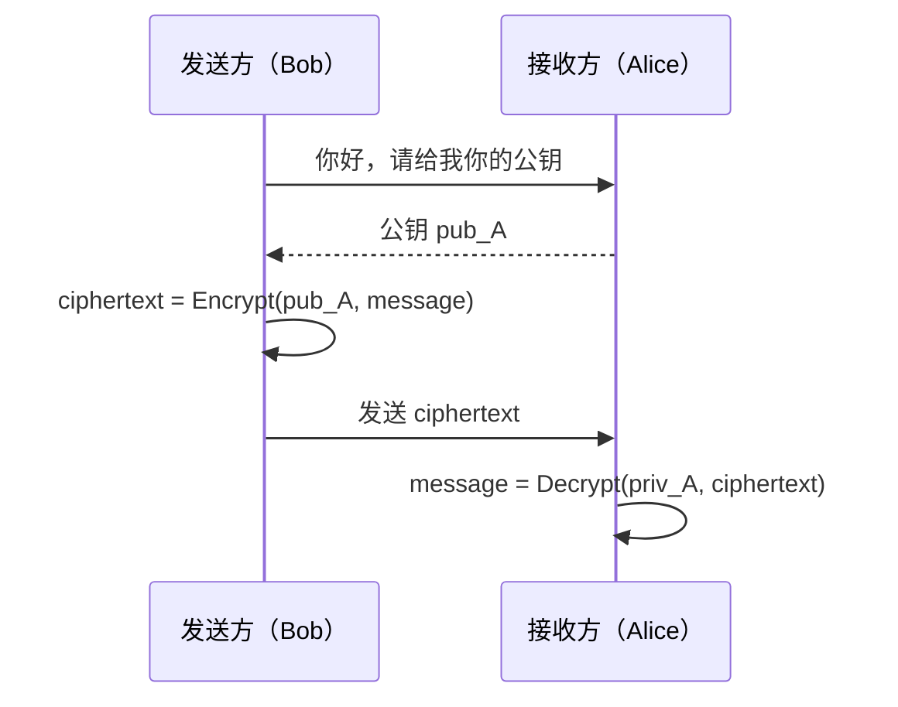
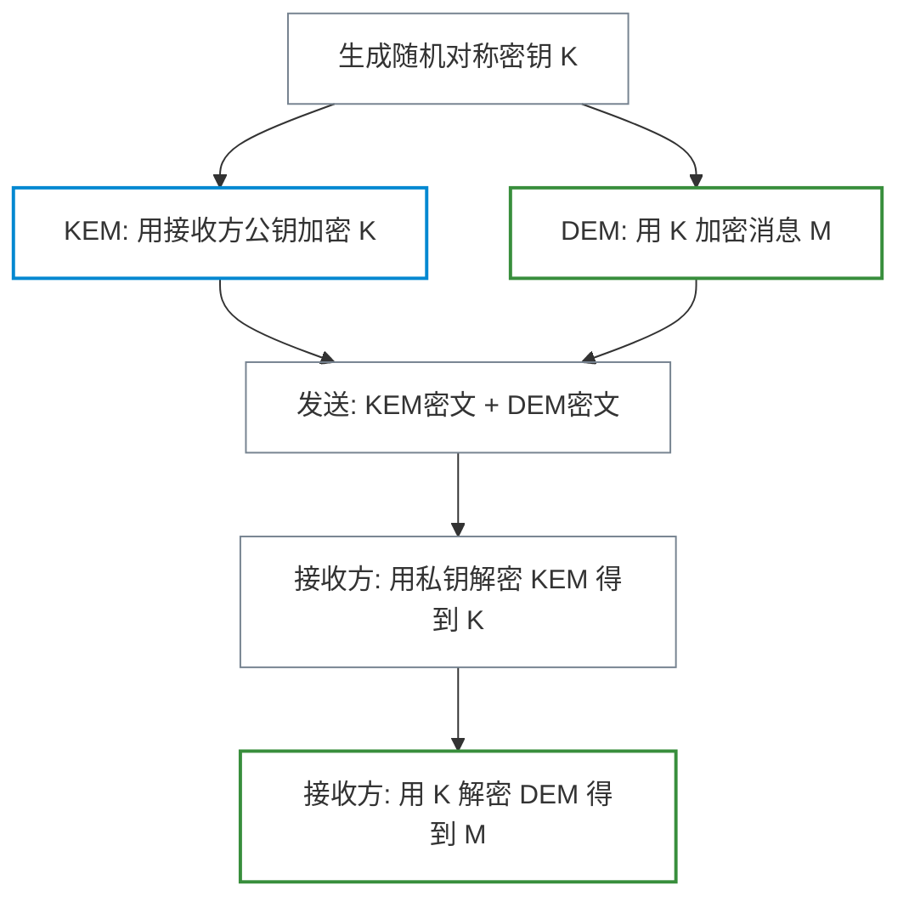
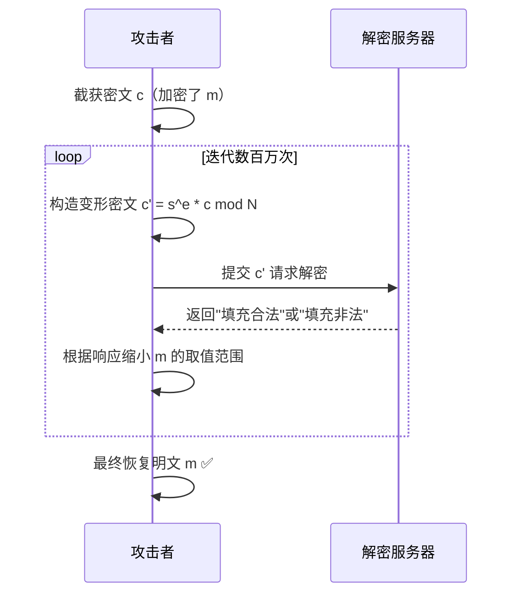
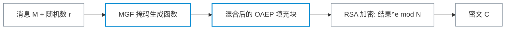
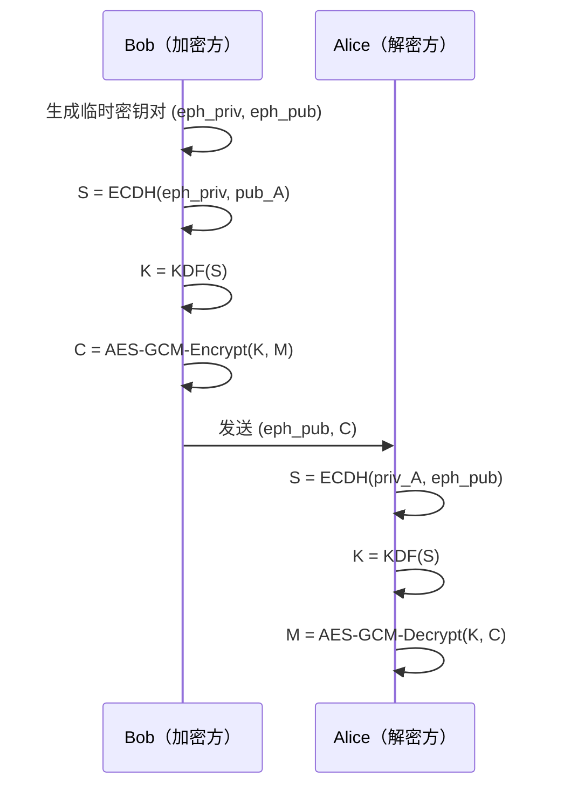
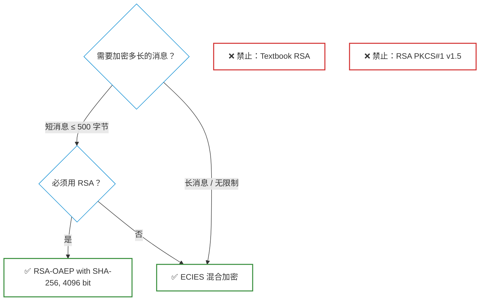

# 非对称加密与混合加密

**本文你会学到**：

- 非对称加密解决了什么问题，以及它与对称加密在性能上的本质差异
- 混合加密（`KEM-DEM` 范式）如何把两种加密的优势结合起来
- `Textbook RSA` 为什么天生不安全，以及 `PKCS#1 v1.5` 是怎么被 Bleichenbacher 攻破的
- `RSA-OAEP` 如何修复这些漏洞，以及正确使用的 Java 代码示例
- `ECIES`（椭圆曲线混合加密）的工作流程与选型建议
- 真实世界中反复发作的密码学漏洞与教训

## ⚖️ 为什么需要非对称加密？

### 对称加密的"钥匙悖论"

假设你想和 100 个陌生人分别通信，并对每段通信加密。使用对称加密（如 `AES-GCM`）的话，你需要与每个人提前协商出一把共享密钥——这就要求你们在网络之外有一条安全信道来交换密钥。

问题来了：**如果你已经有了一条安全信道，还需要加密干什么？**

这就是密钥分发悖论（Key Distribution Problem）。对称加密本身无法解决"陌生人第一次通信"的场景。

💡 想象一个全球快递公司：所有人都可以把包裹投进爱丽丝在公共场合摆放的信箱（公钥加密），但只有爱丽丝拥有开锁的钥匙（私钥解密）。任何人无需提前认识爱丽丝，就能安全地向她发送包裹。

### 非对称加密的基本模型

非对称加密（也称公钥加密）的核心思想是：**加密和解密使用不同的密钥**。

- **公钥（Public Key）**：可以公开发布，任何人用它对消息加密
- **私钥（Private Key）**：只有接收方持有，用来解密



### 性能对比：非对称加密的代价

非对称加密在概念上很优雅，但有两个实际限制：

1. **速度慢**：RSA 的核心是大数模幂运算，比 AES 的位操作慢 2~3 个数量级
2. **消息长度有限**：以 RSA 为例，4096 位模数最多只能加密约 500 个 ASCII 字符

| 维度 | 对称加密（AES） | 非对称加密（RSA） |
|------|----------------|-----------------|
| 速度 | 数 GB/s（硬件加速） | 数 KB/s～数 MB/s |
| 消息长度 | 几乎无限制 | 受密钥长度限制 |
| 密钥分发 | 需要安全信道 | 公钥可公开分发 |
| 典型用途 | 加密大量数据 | 加密小数据/协商密钥 |

⚠️ 正因如此，实际系统几乎从不单独使用非对称加密来加密消息本体，而是配合对称加密使用——这就引出了「混合加密」。

## 🔀 混合加密：组合的艺术

### KEM-DEM 范式

混合加密（Hybrid Encryption）的设计哲学是：**用非对称解决密钥分发，用对称解决性能**。它的标准化模型叫 `KEM-DEM` 范式：

- `KEM`（Key Encapsulation Mechanism，密钥封装机制）：用非对称加密传递一把临时对称密钥
- `DEM`（Data Encapsulation Mechanism，数据封装机制）：用对称认证加密（如 `AES-GCM`）加密真正的消息



### 对称密钥怎么传给对方？

这是混合加密的核心问题。有两种主要方式：

**方式一：用非对称加密直接封装密钥（RSA-KEM 路线）**

1. 生成一把随机对称密钥 `K`
2. 用接收方的 RSA 公钥加密 `K` → 得到 KEM 密文
3. 用 `K` 加密消息 → 得到 DEM 密文
4. 一起发送 KEM 密文 + DEM 密文

**方式二：通过密钥交换协议派生密钥（ECDH 路线）**

1. 发送方临时生成一个 ECDH 密钥对（称为临时密钥，ephemeral key pair）
2. 用临时私钥与接收方公钥执行 ECDH，得到共享秘密 `S`
3. 将 `S` 经 KDF 派生为对称密钥 `K`
4. 用 `K` 加密消息，并将临时公钥一并发送

方式二不需要传输任何密钥密文，安全性来源于 ECDH 的数学难题。这也是 `ECIES` 的工作方式。关于密钥交换协议的详细内容，可参考「`「密钥交换」`」笔记。

> ⚠️ 混合加密中必须使用**认证加密**（如 `AES-GCM`）而非裸对称加密。裸对称加密无法检测消息是否被篡改，相关背景见「`「对称加密」`」笔记。

## 🔑 RSA 非对称加密

### Textbook RSA 为什么不安全？

#### RSA 的数学基础

RSA 基于**大整数分解**的困难性。其工作原理如下：

- 密钥生成：
  1. 选择两个大素数 `p`、`q`（保密）
  2. 计算公开模数 `N = p × q`
  3. 选择公开指数 `e`（通常为 65537）
  4. 计算私有指数 `d = e⁻¹ mod (p-1)(q-1)`
  5. 公钥 = `(N, e)`，私钥 = `d`
- 加密：`ciphertext = message^e mod N`
- 解密：`message = ciphertext^d mod N`

只要不知道 `p` 和 `q`，就无法从 `N` 推导出 `d`——这就是 RSA 的安全基础。

#### 直接使用的危险

**Textbook RSA**（不加任何填充的原始 RSA）有多个已知弱点：

1. **确定性加密**：同一消息加密后密文相同，攻击者可穷举常见消息
2. **可延展性（Malleability）**：给定密文 `c = m^e mod N`，攻击者可构造 `c' = (3m)^e mod N`，解密后得 `3m`——无需知道 `m` 就能构造出有意义的密文
3. **消息太短容易暴力**：加密 `m=2` 时，攻击者可枚举小数字并对比密文

```python title="Textbook RSA 可延展性示意（伪代码）"
# ❌ 攻击者观察到密文 c = m^e mod N
c = intercept()

# 攻击者构造 c' = 3^e * c mod N，解密后得 3m
c_prime = pow(3, e, N) * c % N

# 提交给解密方（例如通过填充错误预言机）
plaintext = decrypt(c_prime)  # = 3m
```

### PKCS#1 v1.5 的历史漏洞

#### 填充方案的初衷

为了解决 Textbook RSA 的问题，1993 年 RSA Security 公司发布了 `PKCS#1 v1.5` 标准，引入了随机填充：

```
结构：0x00 | 0x02 | 随机非零字节... | 0x00 | 原始消息
```

这样消息在加密前被"撑大"到与 `N` 相同大小，有效防止了暴力枚举。

#### Bleichenbacher 攻击（1998）

1998 年，Daniel Bleichenbacher 发现了一个毁灭性的攻击，也叫**百万消息攻击（Million Message Attack）**。

攻击的核心是利用解密方对「填充格式是否合法」的不同响应作为预言机（Padding Oracle）：



**攻击原理**：`PKCS#1 v1.5` 要求填充首两字节为 `0x00 0x02`。每次攻击者提交变形密文，服务器的"成功/失败"响应就泄露了一比特信息——经过足够多次迭代，原始消息被完全重建。

这是一种**自适应选择密文攻击（Adaptive CCA2）**。

#### ROBOT 攻击（2017）：历史的轮回

19 年后，安全研究员在多个主流 TLS 实现中重新发现了 Bleichenbacher 攻击的变体，将其命名为 **ROBOT**（Return Of Bleichenbacher's Oracle Threat）。受影响产品包括 F5、Citrix、Radware 等主流厂商，说明正确实现 `PKCS#1 v1.5` 的缓解措施极其困难。

💡 教训：**一个被"修复"过的漏洞，如果根本原因（可延展的密文 + 旁路信息）没有消除，就会一再复活。**

### RSA-OAEP：现代标准

#### OAEP 的设计思路

1998 年，`PKCS#1 v2.0` 引入了 `OAEP`（Optimal Asymmetric Encryption Padding，最优非对称加密填充）。

`OAEP` 的核心改进：在加密前对消息进行随机化混合，使得：

1. **每次加密结果不同**（即使消息相同）
2. **明文感知性（Plaintext-Awareness）**：攻击者无法构造出一个解密成功的合法密文——Bleichenbacher 攻击无效



其中 `MGF`（Mask Generation Function，掩码生成函数）是一种可扩展输出函数（XOF），将输入扩展或压缩到所需长度。

#### Manger 攻击：实现层的提醒

2001 年，James Manger 发现对 `RSA-OAEP` 的时序攻击：如果实现代码在解密失败时返回不同的错误或响应时间不一致，攻击者仍能逐步恢复明文。

好消息是：`OAEP` 比 `PKCS#1 v1.5` 更易于安全实现，正确实现后此攻击不可行。

#### Java 代码示例：RSA-OAEP 加解密

以下使用 Bouncy Castle 实现 `RSA-OAEP` 加解密：

``` java title="RSA-OAEP 密钥生成"
import org.bouncycastle.jce.provider.BouncyCastleProvider;
import java.security.*;

// ✅ 注册 Bouncy Castle 提供者
Security.addProvider(new BouncyCastleProvider());

// 生成 4096 位 RSA 密钥对
KeyPairGenerator gen = KeyPairGenerator.getInstance("RSA", "BC");
gen.initialize(4096, new SecureRandom());
KeyPair keyPair = gen.generateKeyPair();

PublicKey  publicKey  = keyPair.getPublic();
PrivateKey privateKey = keyPair.getPrivate();
```

``` java title="RSA-OAEP 加密"
import javax.crypto.Cipher;

// ✅ 使用 OAEP + SHA-256 填充
Cipher cipher = Cipher.getInstance(
    "RSA/ECB/OAEPWithSHA-256AndMGF1Padding", "BC");
cipher.init(Cipher.ENCRYPT_MODE, publicKey);

byte[] plaintext  = "Hello, RSA-OAEP!".getBytes();
byte[] ciphertext = cipher.doFinal(plaintext);  // ✅ 安全

// ❌ 不要这样写（PKCS#1 v1.5）：
// Cipher badCipher = Cipher.getInstance("RSA/ECB/PKCS1Padding");
```

``` java title="RSA-OAEP 解密"
Cipher cipher = Cipher.getInstance(
    "RSA/ECB/OAEPWithSHA-256AndMGF1Padding", "BC");
cipher.init(Cipher.DECRYPT_MODE, privateKey);

byte[] recovered = cipher.doFinal(ciphertext);
System.out.println(new String(recovered));  // Hello, RSA-OAEP!
```

⚠️ **选型提示**：

- 模数大小推荐 **4096 位**（提供约 128 位安全强度）
- 公开指数使用标准值 **65537**
- 哈希函数推荐 **SHA-256** 或 **SHA-512**
- 如果可以，优先考虑下一节的 `ECIES`（更短的密钥、更好的标准）

## 🌀 ECIES：椭圆曲线混合加密

### 为什么选择 ECIES 而不是 RSA？

`RSA-OAEP` 只能加密很短的消息，对于大文件必须配合混合加密使用。而 `ECIES`（Elliptic Curve Integrated Encryption Scheme，椭圆曲线集成加密方案）本身就是一个完整的混合加密方案：

| 对比维度 | RSA（混合） | ECIES |
|---------|------------|-------|
| 密钥长度 | 4096 位 | 256 位（P-256） |
| 加密消息长度 | 无限制（混合） | 无限制（天然混合） |
| 标准化程度 | 历史包袱重 | ANSI X9.63 / ISO 18033-2 |
| 实现安全性 | 历史漏洞多 | 相对更安全 |

### ECIES 的工作流程

`ECIES` 的 KEM 部分基于 `ECDH` 密钥交换，而非直接非对称加密：

**加密方（Bob → Alice）**：

1. Bob 为本次加密临时生成一个 ECDH 密钥对 `(ephemeral_priv, ephemeral_pub)`
2. Bob 用 `ephemeral_priv` 与 Alice 的公钥 `pub_A` 执行 ECDH，得到共享秘密 `S`
3. 将 `S` 通过 KDF（如 `HKDF`）派生为对称密钥 `K`
4. 用 `K` + `AES-GCM` 加密消息 `M`，得到密文 `C`
5. 发送 `(ephemeral_pub, C)` 给 Alice

**解密方（Alice）**：

1. Alice 用自己的私钥 `priv_A` 与收到的 `ephemeral_pub` 执行 ECDH，得到相同的共享秘密 `S`
2. 同样通过 KDF 派生出 `K`
3. 用 `K` 解密 `C` 得到原始消息 `M`



### 关键细节：为什么要用 KDF？

`ECDH` 输出的共享秘密在统计上**不是均匀随机**的——某些位可能更倾向于 0 或 1。直接作为 `AES` 密钥使用会引入偏差。

因此必须通过 `KDF`（如 `HKDF`）将其"洗白"：

```
K = HKDF(S, salt="", info="ECIES-AES128GCM", length=16)
```

### Java 示例：使用 Tink 实现 ECIES

Google Tink 库封装了 `ECIES` 的所有细节，是在 Java 中使用混合加密的推荐方式：

``` java title="Tink ECIES 加解密"
import com.google.crypto.tink.HybridDecrypt;
import com.google.crypto.tink.HybridEncrypt;
import com.google.crypto.tink.KeysetHandle;
import com.google.crypto.tink.hybrid.HybridConfig;
import com.google.crypto.tink.hybrid.HybridKeyTemplates;

// ✅ 注册混合加密算法族
HybridConfig.register();

// 生成密钥对（ECIES-P256-HKDF-HMAC-SHA256-AES128-GCM）
KeysetHandle privateHandle = KeysetHandle.generateNew(
    HybridKeyTemplates.ECIES_P256_HKDF_HMAC_SHA256_AES128_GCM);  // ✅

KeysetHandle publicHandle = privateHandle.getPublicKeysetHandle();

// 加密
HybridEncrypt encryptor = publicHandle.getPrimitive(HybridEncrypt.class);
byte[] ciphertext = encryptor.encrypt(plaintext, associatedData);  // ✅

// 解密
HybridDecrypt decryptor = privateHandle.getPrimitive(HybridDecrypt.class);
byte[] recovered = decryptor.decrypt(ciphertext, associatedData);  // ✅
```

模板字符串 `ECIES_P256_HKDF_HMAC_SHA256_AES128_GCM` 的含义：

- `P256`：NIST 标准椭圆曲线（见「`「密钥交换」`」）
- `HKDF`：基于 HMAC 的密钥派生函数（KDF）
- `HMAC-SHA256`：消息认证码
- `AES128-GCM`：128 位密钥的认证加密（见「`「对称加密」`」）

## 🚨 真实世界案例与教训

### Bleichenbacher 攻击的长尾效应

Bleichenbacher 攻击（1998）从未真正消失。以下是它的"复活"历程：

| 时间 | 事件 |
|------|------|
| 1998 | Bleichenbacher 发表原始攻击 |
| 2003 | TLS 1.0 协议层的缓解措施被绕过 |
| 2012 | Java JDK/JRE 的 JSSE 实现被发现仍然脆弱 |
| 2017 | **ROBOT 攻击**：F5、Citrix、Radware 等主流 HTTPS 设备被攻破 |
| 2018 | 多个 TLS 1.3 实现仍受影响 |

**根本原因**：`PKCS#1 v1.5` 的填充验证存在时序差异（成功解密与失败解密耗时不同），服务器的任何可观测区别都会成为预言机。正确实现缓解措施需要"恒定时间比较"，这在 C/Java 等语言中极易出错。

💡 教训：**不要自己实现 RSA 解密逻辑。使用经过审计的库（如 Tink），并且彻底放弃 `PKCS#1 v1.5`。**

### Manger 攻击：OAEP 实现中的时序陷阱

2001 年 James Manger 发现，即使使用了 `OAEP`，如果实现存在时序旁路——例如「填充长度错误」和「内容验证错误」返回的响应时间不同——攻击者同样可以恢复明文。

与 Bleichenbacher 攻击不同，Manger 攻击需要的查询次数要少得多（约 1000 次），但对「恒定时间实现」的要求同样苛刻。

### 签名与加密的混淆使用

非对称加密和数字签名都用了"公钥/私钥"的概念，但方向相反：

- **加密**：公钥加密 → 私钥解密（保护机密性）
- **签名**：私钥签名 → 公钥验证（提供认证）

❌ 错误做法：用私钥"加密"消息来实现签名效果（教科书 RSA 中可行，但在带填充的标准中不成立）。

关于数字签名的详细内容，见「`「数字签名」`」笔记。

### ECIES 实现碎片化：互操作的噩梦

`ECIES` 被多个标准收录（`ANSI X9.63`、`ISO/IEC 18033-2`、`IEEE 1363a`、`SECG SEC 1`），但每个标准的细节略有不同：

- KDF 的选择（`KDF1` vs `HKDF` vs `X9.63 KDF`）
- 是否包含 MAC，以及 MAC 的位置
- 关联数据（Associated Data）的处理方式

这导致不同库之间的 `ECIES` 实现往往无法互操作。

💡 **建议**：在团队内部统一使用同一个库的同一个模板，并在协议文档中明确记录所用的算法组合。

## ✅ 现代推荐与选型建议

### 我应该用哪种方案？



### 选型速查表

| 场景 | 推荐方案 | 备注 |
|------|---------|------|
| 加密任意大小的数据到某人公钥 | `ECIES`（P-256 + HKDF + AES-128-GCM） | 优先使用 Tink |
| 只加密短数据（如另一把对称密钥） | `RSA-OAEP`（4096 bit + SHA-256） | 若生态已有 RSA 则用此方案 |
| 已有 RSA 私钥，需向后兼容 | `RSA-OAEP` 替换 PKCS#1 v1.5 | 迁移路线 |
| TLS / 新协议的密钥协商 | `ECDH`（X25519） | 见「`「密钥交换」`」 |
| ❌ 任何场景 | ~~`PKCS#1 v1.5`~~ | 彻底废弃 |
| ❌ 任何场景 | ~~Textbook RSA~~ | 彻底废弃 |

### 关于后量子密码学

`RSA` 和 `ECIES`/`ECDH` 都基于经典数学难题（整数分解、椭圆曲线离散对数）。量子计算机一旦足够强大，`Shor 算法`可以在多项式时间内破解这两类算法。

NIST 已于 2024 年正式标准化了首批后量子公钥加密算法（如 `ML-KEM`，原名 `CRYSTALS-Kyber`）。如果你的系统需要抵御未来量子威胁，需要提前规划向后量子算法迁移。

---

> 本节内容参考自《Real-World Cryptography》(David Wong, Manning 2021) 第 6 章
