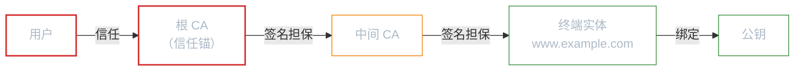
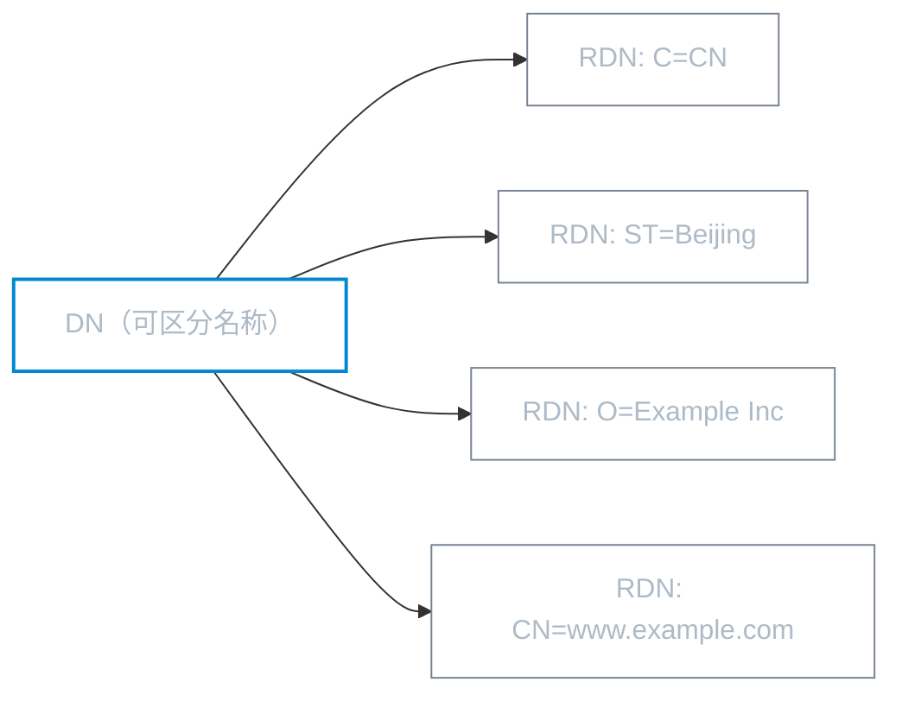
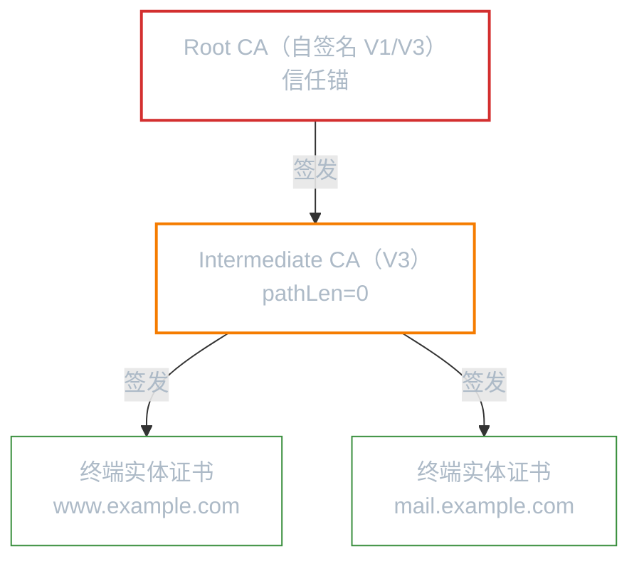
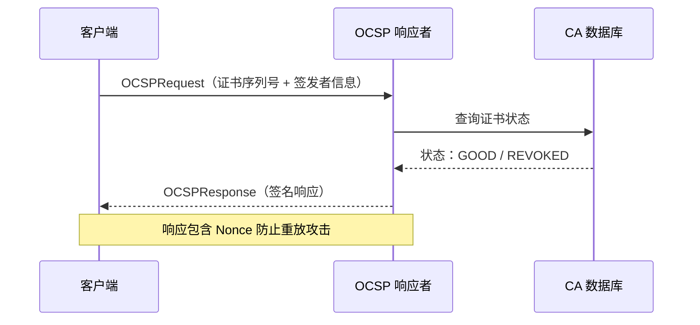
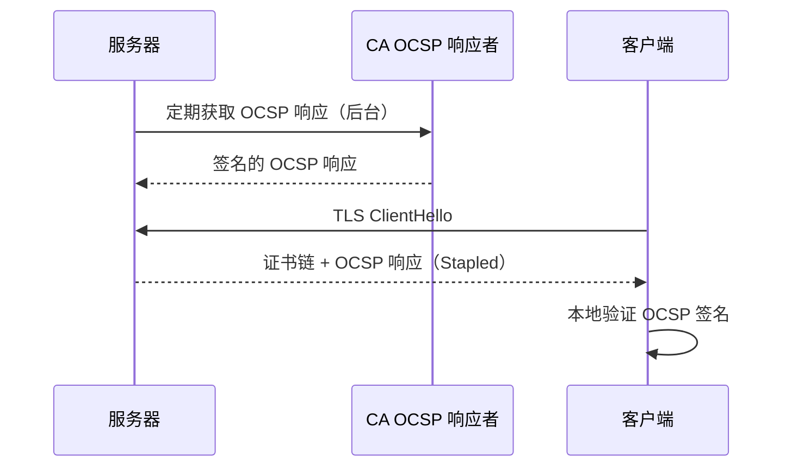
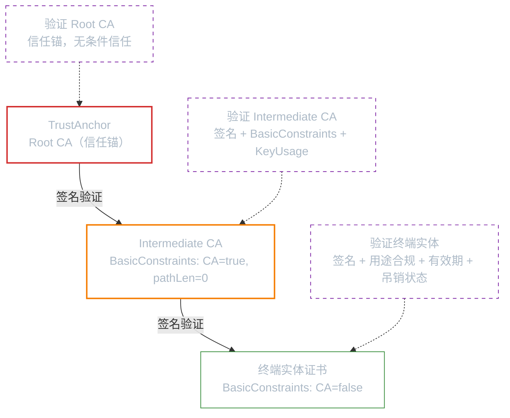
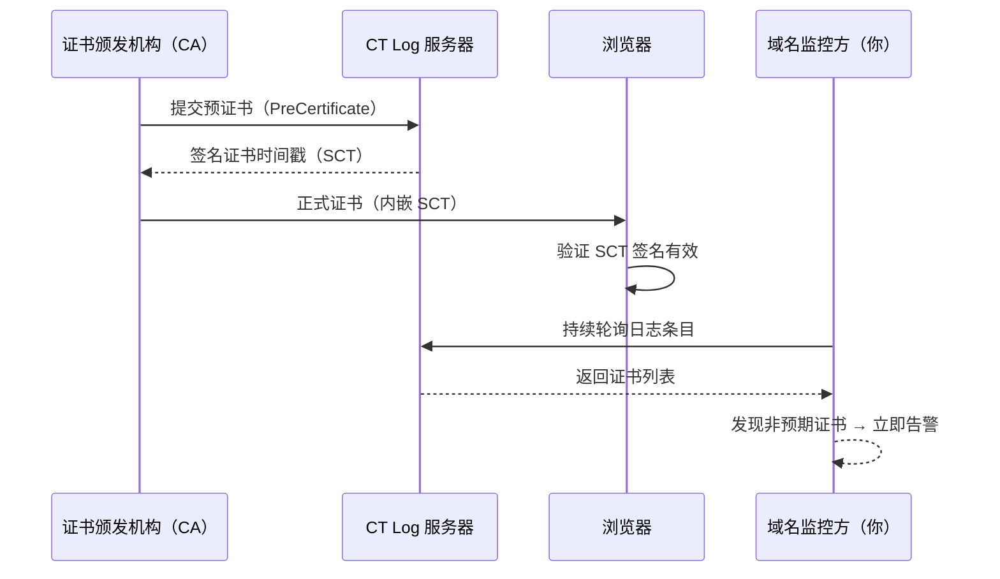
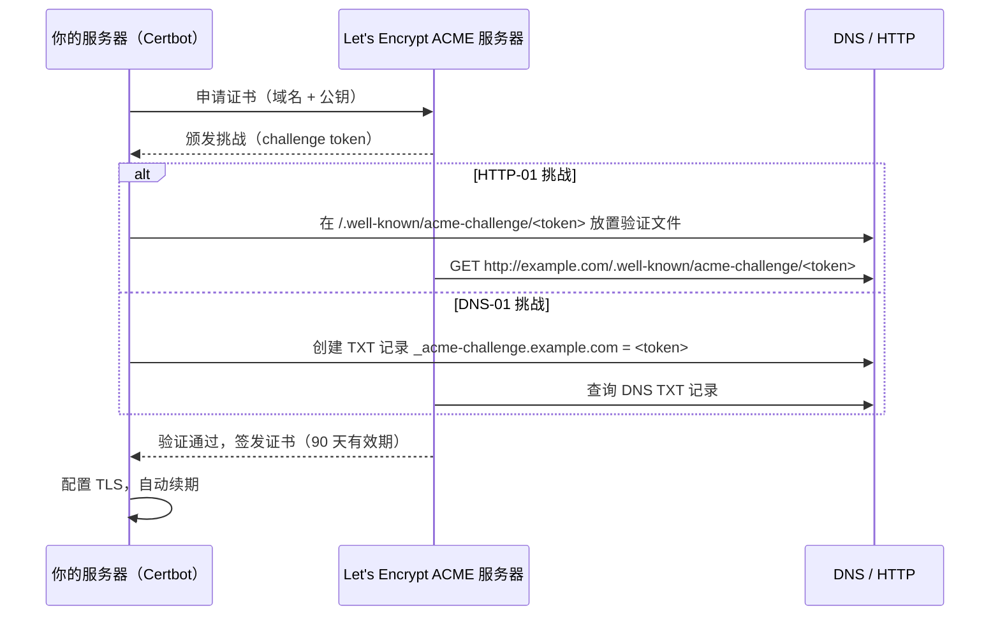
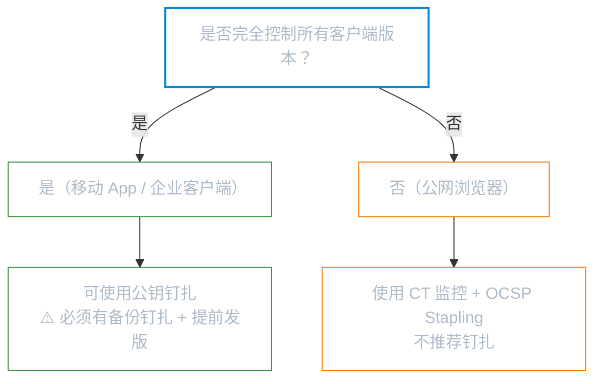

# 证书与 PKI

**本文你会学到**：

- 为什么公钥需要"身份证"——证书如何解决公钥分发中的中间人攻击问题
- X.500 名称（Distinguished Name）如何唯一标识证书主体和签发者
- X.509 证书的结构演进（V1 到 V3），以及 V3 扩展如何限制证书用途
- 如何用 Bouncy Castle 创建自签名根证书、CA 中间证书和终端实体证书
- 证书吊销的两种机制：CRL（证书吊销列表）与 OCSP（在线证书状态协议）
- PKIX 证书路径验证如何确保从信任锚到终端实体的整条链路可信

## 🤔 为什么需要证书？

你已经掌握了公钥密码学和数字签名——用公钥加密，用私钥解密；用私钥签名，用公钥验证。看起来一切都很完美。但有一个根本性的问题被回避了：**你怎么确定拿到的公钥确实属于你以为是的那个人？**

想象这个场景：你想访问 `bank.com`，浏览器需要获取该服务器的公钥来建立 TLS 连接。如果攻击者在网络中间截获了通信，把自己的公钥伪装成 `bank.com` 的公钥发给你的浏览器，会发生什么？你的浏览器会使用攻击者的公钥加密所有数据，攻击者解密后再用自己的私钥加密发给真正的银行——这就是经典的**中间人攻击（Man-in-the-Middle，MITM）**。

公钥本身没有身份信息，一串数字看起来都一样。你需要一个可信的第三方来担保"这个公钥属于 bank.com"——这就是**证书（Certificate）**的作用。

💡 把证书想象成"身份证"：身份证上写着你的名字，还有一个权威机构（公安局）的盖章。别人看到身份证，不需要认识你本人，只要信任公安局，就能确认你的身份。证书也是一样的——它把公钥和一个身份绑定在一起，由受信任的 CA（Certificate Authority，证书颁发机构）签名担保。

### 信任委托与信任链

PKI 的核心是一个 `信任委托模型`：你不直接信任某个公钥的主人，而是信任一个 CA，由 CA 来担保公钥与身份的绑定。

这个模型的关键特征是**信任的传递性**：如果你信任根 CA，根 CA 签发了中间 CA 的证书（担保中间 CA 的身份和公钥），中间 CA 签发了终端实体的证书——那么你通过验证整条签名链，就可以信任终端实体的公钥。



形式化地说，信任链的安全性依赖于以下**递归假设**：

$$\forall i \in \left[1, n\right] : \text{签名验证通过}(cert_{i-1}, cert_i) \land \text{信任}(cert_0) \implies \text{信任}(cert_n)$$

其中 `签名验证通过` 意味着使用 cert_{i-1} 的公钥验证 cert_i 的签名成功。这个递归的根基是根 CA（信任锚）——它的证书是自签名的，你选择信任它不是因为它有更高层的担保，而是因为你通过操作系统或浏览器预装的方式**预先决定了信任它**。

### PKI 信任模型的根本假设与风险

PKI 信任模型建立在几个关键假设上，每个假设的失败都会带来安全风险：

**假设 1：根 CA 的私钥永不泄露**

这是整个信任链的根基。如果根 CA 的私钥被攻破，攻击者可以签发任何域名的证书——包括银行、政府、任何网站。浏览器和操作系统会无条件信任这些伪造证书。这正是为什么根 CA 的私钥通常存储在硬件安全模块（HSM）中，并且有极其严格的物理和流程安全控制。

**假设 2：CA 的签发流程值得信赖**

CA 的职责不仅是"签名"，还包括**验证申请者的身份**。如果 CA 不做充分验证就签发证书（所谓"误签发"），攻击者就能获得合法的、受信任的证书。2011 年的 DigiNotar 事件就是典型案例——CA 被攻破后，攻击者为 `*.google.com` 签发了伪造证书，用于对伊朗用户发起大规模中间人攻击。DigiNotar 随后破产。

**假设 3：中间 CA 的权限被正确限制**

这就是 `BasicConstraints` 中 `pathLenConstraint` 的意义。如果中间 CA 被攻破，`pathLenConstraint` 限制了它只能签发终端实体证书，不能签发下级 CA——这控制了**爆炸半径**。

| 被攻破的实体 | pathLen=0 | pathLen=无限 |
|-------------|-----------|-------------|
| 中间 CA | 只能签终端实体证书 | 能签下级 CA，无限扩展 |
| 影响范围 | 该 CA 直接签发的证书 | 整个子树中的所有证书 |

💡 **为什么信任根 CA 不是"零知识"的**：你信任根 CA 的原因是操作系统/浏览器厂商已经替你做了审核（比如 Microsoft、Apple、Google 维护的受信任根证书列表）。这本质上是**信任的转移**——你信任操作系统厂商的判断，操作系统厂商信任 CA 的运营能力。

## 🏷️ X.500 名称（Distinguished Name）

### 证书的身份标识

当你需要为一张证书指定"这是谁的公钥"时，你需要一种标准化的身份标识方式。X.500 DN（Distinguished Name，可区分名称）就是 PKI 世界中的"身份证号"。

一个 DN 由多个 RDN（Relative Distinguished Name，相对可区分名称）组成，每个 RDN 包含一个或多个属性（AttributeTypeAndValue）：



常用的 DN 属性及含义：

| 属性 | 全称 | 含义 | 示例 |
|------|------|------|------|
| `CN` | Common Name | 通用名称（常用作证书绑定域名） | `www.example.com` |
| `O` | Organization | 组织名 | `Example Inc` |
| `OU` | Organizational Unit | 组织单元 | `IT Department` |
| `C` | Country | 国家代码（ISO 3166） | `CN`、`US` |
| `ST` | State | 省/州 | `Beijing` |
| `L` | Locality | 城市 | `Beijing` |

### 用 BC 构建 X500Name

在 Bouncy Castle 中，使用 `X500NameBuilder` 配合 `BCStyle` 来构建 DN：

```java title="使用 X500NameBuilder 构建证书主体名称"
X500NameBuilder nameBuilder = new X500NameBuilder(BCStyle.INSTANCE);
nameBuilder.addRDN(BCStyle.CN, "www.example.com");
nameBuilder.addRDN(BCStyle.O, "Example Inc");
nameBuilder.addRDN(BCStyle.C, "CN");
nameBuilder.addRDN(BCStyle.ST, "Beijing");
nameBuilder.addRDN(BCStyle.L, "Beijing");
X500Name subjectName = nameBuilder.build();
```

⚠️ **字符串表示的陷阱**：X.500 名称有两种字符串编码顺序——ISO 顺序（RDN 出现顺序）和 IETF/RFC 4519 顺序（反序）。BC 默认使用 ISO 顺序，JCA 的 `X500Principal` 使用 IETF 顺序。比较名称时要注意编码方式是否一致。如果需要 IETF 风格的字符串输出，可以使用 `RFC4519Style.INSTANCE`。

> 完整代码见 `code/topic/cryptography/certificates-pki/` 模块中的 `CertificateGenerationTest.java`。

## 🗂️ 证书结构

### 从 ASN.1 视角理解证书

X.509 证书的 ASN.1 定义揭示了一个关键的三层结构：

```
Certificate ::= SEQUENCE {
    tbsCertificate    TBSCertificate,     -- 证书主体内容（待签名部分）
    signatureAlgorithm AlgorithmIdentifier, -- 签名算法
    signatureValue    BIT STRING          -- 签名值
}
```

其中 `TBSCertificate`（TBS = To Be Signed，待签名）包含了证书的所有信息——主体名称、签发者名称、有效期、公钥、扩展等。证书的数字签名就是 CA 对 TBSCertificate 的 DER 编码计算得到的。

TBSCertificate 中的关键字段：

| 字段 | 含义 |
|------|------|
| `version` | 证书版本（V1=0, V2=1, V3=2） |
| `serialNumber` | 序列号（签发 CA 内唯一） |
| `issuer` | 签发者的 DN |
| `validity` | 有效期（notBefore / notAfter） |
| `subject` | 证书主体的 DN |
| `subjectPublicKeyInfo` | 主体的公钥及算法信息 |
| `extensions` | V3 扩展（可选，V3 独有） |

### V1 vs V3：为什么 V1 不够用？

| 特性 | V1 | V3 |
|------|----|----|
| 扩展 | 无 | 支持，可限制证书用途 |
| CA 标识 | 无法区分 CA 和终端实体 | `BasicConstraints` 明确标记 |
| 密钥用途 | 不受限 | `KeyUsage` / `ExtendedKeyUsage` 精确控制 |
| 公钥标识 | 无 | `SKI` / `AKI` 建立签发链 |
| 实际用途 | 仅用作**信任锚**（根证书） | CA 证书、终端实体证书、服务器证书等 |

💡 现实中你几乎只会遇到 V1（根证书/信任锚）和 V3 两种版本。V2 只在 V1 基础上加了 `issuerUniqueID` 和 `subjectUniqueID`，后来被认为是一个"不该从画板上拿出来的设计"，几乎没人用。

### BC 中的两种证书构建器

- `JcaX509v1CertificateBuilder` — 创建 V1 证书（自签名根证书）
- `JcaX509v3CertificateBuilder` — 创建 V3 证书（CA 证书、终端实体证书）

两者都生成 `X509CertificateHolder`（BC 的提供者无关证书载体），可以通过 `JcaX509CertificateConverter` 转换为 JCA 标准的 `X509Certificate`。

## 🔧 证书扩展（Extensions）

### 为什么需要扩展？

V1 证书有一个致命缺陷：**无法限制证书的用途**。一个 V1 证书可以用于签发其他证书、签名文档、加密通信——甚至可以冒充 CA 签发新证书。这在多层次的 PKI 体系中是无法接受的。

V3 引入的**扩展（Extension）**机制让 CA 能精确控制证书的用途和行为。每个扩展由 OID 标识，包含一个 `critical` 标志：标记为 `critical` 的扩展必须被验证方理解，否则证书应被拒绝。

### BasicConstraints：CA 身份的第一道门

BasicConstraints 是最重要的扩展之一，它回答一个关键问题：**这张证书能不能签发其他证书？**

```
BasicConstraints ::= SEQUENCE {
    cA                 BOOLEAN DEFAULT FALSE,
    pathLenConstraint  INTEGER (0..MAX) OPTIONAL
}
```

- `cA = true` + `pathLenConstraint = 0`：可以签发终端实体证书，但不能签发下级 CA
- `cA = true` + `pathLenConstraint = 1`：可以签发 1 级中间 CA，中间 CA 只能签发终端实体
- `cA = false`：终端实体证书，证书链到此为止

```java title="CA 证书添加 BasicConstraints 扩展"
certBuilder.addExtension(
    Extension.basicConstraints,
    true,   // critical — 验证方必须理解
    new BasicConstraints(0)  // CA=true, pathLen=0
);
```

### KeyUsage：限制公钥的密码学用途

KeyUsage 用一个位串（BIT STRING）精确限定公钥可以执行哪些密码学操作：

| 位 | 名称 | 含义 |
|----|------|------|
| 0 | `digitalSignature` | 数字签名（TLS 客户端/服务器证书常用） |
| 1 | `nonRepudiation` | 抗抵赖签名 |
| 2 | `keyEncipherment` | 密钥加密（RSA 密钥传输） |
| 3 | `dataEncipherment` | 数据加密 |
| 4 | `keyAgreement` | 密钥协商（ECDH） |
| 5 | `keyCertSign` | 签发证书（CA 证书专用） |
| 6 | `cRLSign` | 签发 CRL（CA 证书专用） |

```java title="CA 证书的 KeyUsage：签发证书 + 签发 CRL"
certBuilder.addExtension(
    Extension.keyUsage,
    true,
    new KeyUsage(KeyUsage.keyCertSign | KeyUsage.cRLSign)
);
```

⚠️ KeyUsage 和 ExtendedKeyUsage 如果同时存在，它们**不能冲突**。比如 `keyUsage` 只设置了 `keyCertSign`，那 `extendedKeyUsage` 就不能包含 `id-kp-serverAuth`。

### ExtendedKeyUsage：更精确的用途限定

ExtendedKeyUsage 使用 OID 列表指定证书的预期用途场景，比 KeyUsage 更加语义化：

| OID | 名称 | 场景 |
|-----|------|------|
| `id-kp-serverAuth` | 服务器认证 | TLS 服务器证书 |
| `id-kp-clientAuth` | 客户端认证 | TLS 客户端证书（mTLS） |
| `id-kp-codeSigning` | 代码签名 | 签名可执行文件/应用 |
| `id-kp-emailProtection` | 邮件保护 | S/MIME 邮件加密签名 |
| `id-kp-timeStamping` | 时间戳 | TSA 时间戳签名 |
| `id-kp-OCSPSigning` | OCSP 签名 | OCSP 响应者证书 |

### SKI 和 AKI：建立签发链

**Subject Key Identifier（SKI，主题密钥标识符）**为证书中的公钥生成一个唯一指纹。**Authority Key Identifier（AKI，颁发机构密钥标识符）**指向签发该证书的 CA 的公钥标识。

```
终端实体证书的 AKI 值 = 签发 CA 证书的 SKI 值
```

这条规则让验证方能沿着"AKI → SKI"的链路从终端实体追溯到信任锚。

```java title="使用 JcaX509ExtensionUtils 创建 SKI 和 AKI"
JcaX509ExtensionUtils extUtils = new JcaX509ExtensionUtils();

// SubjectKeyIdentifier：基于本证书的公钥生成
certBuilder.addExtension(
    Extension.subjectKeyIdentifier,
    false,
    extUtils.createSubjectKeyIdentifier(certKey)
);

// AuthorityKeyIdentifier：基于签发 CA 的证书/公钥生成
certBuilder.addExtension(
    Extension.authorityKeyIdentifier,
    false,
    extUtils.createAuthorityKeyIdentifier(signerCert)
);
```

### SAN：主体备用名称

SAN（Subject Alternative Name）允许证书关联多个身份标识——不仅限于 CN 中的一个域名。现代 TLS 证书中，SAN 是绑定域名的主要方式，CN 已逐步被弃用。

SAN 支持的类型包括：DNS 域名、IP 地址、电子邮件（rFC822Name）、URI 等。

### CRL Distribution Point

CRL Distribution Point 扩展告诉验证方"去哪里下载这张证书对应的 CRL"。它通常包含一个 URL，指向 CA 发布的 CRL 文件。

⚠️ 在生产环境中，不要盲目信任证书中指定的 CRL URL——下载一个未知大小的文件可能带来安全风险。最好通过自己的信任策略来获取 CRL 信息。

### 常用扩展速查表

| 扩展 | OID | Critical | 用途 |
|------|-----|----------|------|
| BasicConstraints | `2.5.29.19` | CA 证书必须 | 标识 CA / 限制路径深度 |
| KeyUsage | `2.5.29.15` | 通常 true | 限制密码学用途 |
| ExtendedKeyUsage | `2.5.29.37` | 特定场景 true | 限定使用场景 |
| SKI | `2.5.29.14` | false | 公钥指纹 |
| AKI | `2.5.29.35` | false | 签发 CA 公钥标识 |
| SAN | `2.5.29.17` | false | 多身份绑定 |
| CRL Distribution Point | `2.5.29.31` | false | CRL 下载地址 |

## 🛠️ 创建证书

### 创建自签名根证书（V1）

当你需要建立自己的 PKI 体系时，第一步就是创建一个自签名的根证书作为**信任锚（Trust Anchor）**。这张证书的签发者和主体相同——自己为自己担保。

```java title="创建 V1 自签名根证书"
// 1. 构建 DN
X500NameBuilder nameBuilder = new X500NameBuilder(BCStyle.INSTANCE);
nameBuilder.addRDN(BCStyle.CN, "Test Root CA");
nameBuilder.addRDN(BCStyle.O, "Test Org");
X500Name subjectName = nameBuilder.build();

// 2. 设置有效期
Date notBefore = new Date(System.currentTimeMillis() - 24 * 60 * 60 * 1000L);
Date notAfter = new Date(System.currentTimeMillis() + 365L * 24 * 60 * 60 * 1000);

// 3. 构建证书（issuer = subject，自签名）
X509v1CertificateBuilder certBuilder = new JcaX509v1CertificateBuilder(
        subjectName,                 // 签发者 = 主体
        BigInteger.valueOf(1),        // 序列号
        notBefore,                    // 起始时间
        notAfter,                     // 结束时间
        subjectName,                  // 主体
        keyPair.getPublic()           // 公钥
);

// 4. 签名
X509CertificateHolder certHolder = certBuilder.build(
        new JcaContentSignerBuilder("SHA256WithRSA")
                .setProvider("BC")
                .build(keyPair.getPrivate())
);

// 5. 转换为 JCA X509Certificate
X509Certificate cert = new JcaX509CertificateConverter()
        .setProvider("BC")
        .getCertificate(certHolder);
```

> 对应测试：`CertificateGenerationTest.shouldCreateSelfSignedCertificate()`

### 创建 CA 中间证书（V3 + 扩展）

当你需要将 CA 的签发权委托给下级 CA 时，就需要创建中间证书。与 V1 根证书不同，中间证书必须包含扩展来声明其 CA 身份和权限。

```java title="创建 V3 CA 中间证书"
X509v3CertificateBuilder certBuilder = new JcaX509v3CertificateBuilder(
        signerCert.getSubject(),       // 签发者：上级 CA
        BigInteger.valueOf(2),          // 序列号
        notBefore, notAfter,
        intermediateName,              // 主体：中间 CA
        intermediateKeyPair.getPublic()
);

JcaX509ExtensionUtils extUtils = new JcaX509ExtensionUtils();

// SubjectKeyIdentifier：标识中间 CA 的公钥
certBuilder.addExtension(Extension.subjectKeyIdentifier, false,
        extUtils.createSubjectKeyIdentifier(intermediateKeyPair.getPublic()));
// AuthorityKeyIdentifier：指向签发 CA 的公钥
certBuilder.addExtension(Extension.authorityKeyIdentifier, false,
        extUtils.createAuthorityKeyIdentifier(rootKeyPair.getPublic()));
// BasicConstraints：CA=true, pathLen=0（不能再签发下级 CA）
certBuilder.addExtension(Extension.basicConstraints, true,
        new BasicConstraints(0));
// KeyUsage：签发证书和 CRL
certBuilder.addExtension(Extension.keyUsage, true,
        new KeyUsage(KeyUsage.keyCertSign | KeyUsage.cRLSign));
```

> 对应测试：`CertificateGenerationTest.shouldCreateCACertificateWithExtensions()`

### 创建终端实体证书

终端实体证书是证书链的末端——它的 `BasicConstraints` 中 `cA = false`，不能再签发其他证书。终端实体证书通常绑定到具体的服务器、个人或设备。

```java title="创建终端实体证书"
X509v3CertificateBuilder certBuilder = new JcaX509v3CertificateBuilder(
        caCert.getSubject(),           // 签发者：CA
        BigInteger.valueOf(100),        // 序列号
        notBefore, notAfter,
        eeName,                        // 主体：终端实体
        eeKeyPair.getPublic()
);

JcaX509ExtensionUtils extUtils = new JcaX509ExtensionUtils();
certBuilder.addExtension(Extension.subjectKeyIdentifier, false,
        extUtils.createSubjectKeyIdentifier(eeKeyPair.getPublic()));
certBuilder.addExtension(Extension.authorityKeyIdentifier, false,
        extUtils.createAuthorityKeyIdentifier(caKeyPair.getPublic()));
// BasicConstraints：CA=false（终端实体，不可签发其他证书）
certBuilder.addExtension(Extension.basicConstraints, true,
        new BasicConstraints(false));
// KeyUsage：数字签名 + 密钥加密
certBuilder.addExtension(Extension.keyUsage, true,
        new KeyUsage(KeyUsage.digitalSignature | KeyUsage.keyEncipherment));
```

> 对应测试：`CertPathValidationTest.createEndEntityCert()`

### PKI 证书体系全景

一个典型的三级 PKI 体系如下：



验证方向是从下往上：拿到 `www.example.com` 的证书后，先验证中间 CA 的签名，再验证根 CA 的签名，最终追溯到信任锚。

## 🗑️ 证书吊销

### 为什么需要吊销？

证书有有效期，但有些情况等不到过期：私钥泄露了、员工离职了、CA 自身的私钥被攻破了——此时必须有一种机制在证书过期前宣告它"作废"。

证书吊销（Revocation）就是 CA "反悔"的过程——CA 撤回之前对某张证书的签名担保。

### CRL vs OCSP：两种吊销检查机制

| 特性 | CRL | OCSP |
|------|-----|------|
| 全称 | Certificate Revocation List | Online Certificate Status Protocol |
| 原理 | CA 定期发布完整吊销列表 | 客户端实时查询证书状态 |
| 实时性 | 取决于发布间隔（小时到天） | 近似实时 |
| 带宽 | 列表可能很大（数百 KB 到 MB） | 单次请求很小（几百字节） |
| 隐私 | 客户端直接下载，CA 不知道谁在查 | 客户端向 CA 发请求，暴露访问行为 |
| 离线可用 | 下载后本地验证 | 必须在线 |
| 复杂度 | CA 端简单，客户端需定期更新 | CA 需要维护响应者服务 |

💡 CRL 就像"黑名单报纸"——定期发行一期，上面列着所有被拉黑的人。OCSP 就像"电话查号台"——打个电话问"这个人还在不在黑名单上"。

## 📋 CRL（证书吊销列表）

### 创建 CRL

CRL 的结构与证书类似，也有"待签名内容 + 签名算法 + 签名值"三层结构：

```
CertificateList ::= SEQUENCE {
    tbsCertList       TBSCertList,
    signatureAlgorithm AlgorithmIdentifier,
    signatureValue    BIT STRING
}
```

TBSCertList 包含签发者名称、发布时间（thisUpdate）、下次更新时间（nextUpdate）、吊销条目列表和扩展。当没有吊销条目时，吊销证书列表字段必须**省略**（而不是空列表）。

```java title="创建包含吊销条目的 CRL"
// 1. 创建 CRL 构建器
X509v2CRLBuilder crlBuilder = new X509v2CRLBuilder(issuerName, now);

// 2. 添加吊销条目（序列号 + 吊销时间 + 吊销原因）
crlBuilder.addCRLEntry(revokedSerial1, now, CRLReason.superseded);
crlBuilder.addCRLEntry(revokedSerial2, now, CRLReason.keyCompromise);

// 3. 添加 AuthorityKeyIdentifier 扩展
JcaX509ExtensionUtils extUtils = new JcaX509ExtensionUtils();
crlBuilder.addExtension(Extension.authorityKeyIdentifier, false,
        extUtils.createAuthorityKeyIdentifier(caKeyPair.getPublic()));

// 4. 签发 CRL
X509CRLHolder crlHolder = crlBuilder.build(
        new JcaContentSignerBuilder("SHA256WithRSA").setProvider("BC")
                .build(caKeyPair.getPrivate())
);

// 5. 转换为 JCA X509CRL
X509CRL crl = new JcaX509CRLConverter().setProvider("BC").getCRL(crlHolder);

// 6. 验证 CRL 签名
crl.verify(caCert.getPublicKey());

// 7. 检查吊销状态
X509CRLEntry entry = crl.getRevokedCertificate(serialNumber);
if (entry != null) {
    System.out.println("证书已吊销，原因: " + entry.getRevocationReason());
}
```

> 对应测试：`CrlTest.shouldCreateCRL()`

### CRL 吊销原因

CRL 的每个条目都可以附带一个 `CRLReason` 扩展，说明吊销原因：

| 原因码 | 含义 |
|--------|------|
| `unspecified` (0) | 未指定 |
| `keyCompromise` (1) | 密钥泄露 |
| `cACompromise` (2) | CA 密钥泄露 |
| `affiliationChanged` (3) | 从属关系变更 |
| `superseded` (4) | 证书被新证书取代 |
| `cessationOfOperation` (5) | 停止运营 |
| `privilegeWithdrawn` (9) | 权限撤销 |

### 更新 CRL

随着时间推移，吊销条目会越来越多。更新 CRL 时不需要从零开始——可以通过 `addCRL()` 将旧 CRL 的所有条目合并到新的 CRL 中：

```java title="基于旧 CRL 创建更新版 CRL"
X509v2CRLBuilder crlBuilder = new X509v2CRLBuilder(caCert.getIssuer(), now);
crlBuilder.setNextUpdate(new Date(now.getTime() + 7L * 24 * 60 * 60 * 1000));

// 添加新的吊销条目
crlBuilder.addCRLEntry(newSerial, now, CRLReason.privilegeWithdrawn);

// 合并旧 CRL 的所有条目
crlBuilder.addCRL(previousCRL);

// 添加扩展并签发
crlBuilder.addExtension(Extension.authorityKeyIdentifier, false,
        extUtils.createAuthorityKeyIdentifier(caCert));
X509CRLHolder updatedCrl = crlBuilder.build(signer);
```

## 🌐 OCSP（在线证书状态协议）

### CRL 的局限性催生了 OCSP

CRL 有两个现实问题：一是列表会越来越大，下载成本高；二是发布间隔导致信息滞后。如果你签发了大量短期证书（比如 Let's Encrypt 的 90 天证书），每次更新 CRL 都要发布一个巨大的列表，而且验证方拿到的可能是几小时前的版本——在这几小时内，一个已吊销的证书可能仍然"看起来有效"。

OCSP（Online Certificate Status Protocol，在线证书状态协议）正是为了解决这两个问题而设计的。它让验证方可以**实时查询单张证书的状态**，而不需要下载整个吊销列表。

### 请求/响应流程



### OCSP 请求：CertificateID 的构造

OCSP 请求的核心是 `CertificateID`——它通过**签发者 DN 哈希 + 签发者公钥哈希 + 证书序列号**唯一标识一张证书：

```java title="构造 OCSP 请求"
// 1. 创建 CertificateID：标识要查询的证书
CertificateID certId = new CertificateID(
    new JcaDigestCalculatorProviderBuilder().setProvider("BC").build()
        .get(CertificateID.HASH_SHA1),
    new X509CertificateHolder(caCert.getEncoded()),
    eeSerial
);

// 2. 构建请求
OCSPReqBuilder reqBuilder = new OCSPReqBuilder();
reqBuilder.addRequest(certId);

// 3. 添加 Nonce 扩展（防重放攻击）
byte[] nonce = new byte[16];
new java.security.SecureRandom().nextBytes(nonce);
reqBuilder.setRequestExtensions(new Extensions(
    new Extension(OCSPObjectIdentifiers.id_pkix_ocsp_nonce,
        true, new DEROctetString(nonce))));

// 4. 生成请求
OCSPReq request = reqBuilder.build();
```

> 对应测试：`OcspTest.shouldGenerateOCSPRequest()`

### OCSP 响应：状态与签名

OCSP 响应包含一个响应状态码和具体的证书状态信息：

- `getCertStatus() == null` → `GOOD`（证书有效）
- `getCertStatus()` 返回 `RevokedStatus` → 证书已被吊销

```java title="构建 OCSP 响应"
// 1. 构建基本响应
BasicOCSPRespBuilder respBuilder = new BasicOCSPRespBuilder(
    new RespID(caName));  // 响应者标识

// 2. 添加证书状态
Date now = new Date();
Date nextUpdate = new Date(now.getTime() + 7L * 24 * 60 * 60 * 1000);
respBuilder.addResponse(certId,
    CertificateStatus.GOOD,  // 状态：有效
    now, nextUpdate);

// 3. 签发响应
BasicOCSPResp basicResp = respBuilder.build(
    new JcaContentSignerBuilder("SHA256WithRSA").setProvider("BC")
        .build(caKeyPair.getPrivate()),
    null,   // 不附加证书链
    now
);

// 4. 包装为完整响应
OCSPResp response = new OCSPRespBuilder().build(
    OCSPResp.SUCCESSFUL, basicResp);
```

> 对应测试：`OcspTest.shouldGenerateOCSPResponse()`

### Nonce 防重放

OCSP 的 Nonce 扩展是防重放攻击的关键机制。客户端在请求中生成一个随机值（Nonce），响应者必须将同样的 Nonce 原样回传。客户端收到响应后，比对请求和响应中的 Nonce 是否一致——如果不一致，说明响应可能是被截获的旧响应，应拒绝接受。

⚠️ 如果响应中没有 Nonce，攻击者可以直接重放一个之前捕获的有效响应。这在证书已被吊销的场景下尤其危险——一个"曾经有效"的响应被反复重放，验证方就无法察觉证书已被吊销。

### OCSP Stapling：保护隐私的改进

标准的 OCSP 有一个隐私问题：每次 TLS 握手时，客户端都要向 CA 的 OCSP 响应者查询服务器证书的状态，这等于告诉 CA"我在访问这个网站"。

**OCSP Stapling** 解决了这个问题：服务器定期从 CA 获取自己证书的 OCSP 响应并缓存，在 TLS 握手时主动将 OCSP 响应"钉"在一起发给客户端。这样：

- 客户端不需要直接联系 CA，保护了隐私
- OCSP 响应可以重用（在其有效期内），减轻了 CA 的负载
- 客户端仍然可以验证 OCSP 响应的签名，安全性不变



## 🔍 证书路径验证

### PKI 验证的核心问题

当你收到一张终端实体证书（比如 `www.example.com` 的服务器证书），你怎么确认它是可信的？你需要验证以下三个问题：

1. **签名完整性**：证书链上的每一张证书的签名是否正确？
2. **用途合规**：每张证书是否被用于其预期的用途？
3. **吊销状态**：链上的每张证书是否仍然有效（未被吊销）？

这个从信任锚到终端实体的逐级验证过程就是**证书路径验证（Certificate Path Validation）**。

### PKIX 验证模型

Java 提供了完整的 CertPath API 来执行 PKIX（RFC 5280）路径验证。核心类包括：

| 类 | 职责 |
|----|------|
| `TrustAnchor` | 信任锚——路径的起点，无条件信任 |
| `CertPath` | 证书路径——待验证的证书链 |
| `PKIXParameters` | 验证参数——信任锚集合、吊销检查开关等 |
| `CertPathValidator` | 路径验证器——执行 PKIX 验证算法 |
| `CertPathBuilder` | 路径构建器——从证书集合中找到有效路径 |
| `PKIXCertPathValidatorResult` | 验证结果——包含信任锚和公钥 |

### 路径验证到底证明了什么？

理解路径验证的理论意义很重要。路径验证成功**并不直接证明**"这个公钥属于 www.example.com"，它证明的是更精确的命题：

> **在给定信任锚集合 T 的前提下，证书路径中每一步的签名验证都通过，且所有约束条件（有效期、用途、路径长度、吊销状态）都满足。**

形式化地说，设信任锚集合为 T，证书路径为 `[cert_n, cert_{n-1}, ..., cert_1, cert_0]`（cert_0 是信任锚），则路径验证成功意味着：

$$\forall i \in \left[1, n\right] : \text{Verify}(\text{pubkey}(cert_{i-1}), \text{TBS}(cert_i), \text{sig}(cert_i)) = \text{true}$$

$$\land \forall i \in \left[0, n\right] : \text{Constraints}(cert_i) = \text{satisfied}$$

其中 `Constraints` 包括有效期检查、BasicConstraints 检查、KeyUsage 兼容性检查、吊销状态检查等。

⚠️ 注意两个重要的**安全边界**：

1. **路径验证是计算安全，不是信息论安全**：它依赖于签名方案的安全性（如 RSA-PSS、ECDSA 的 EUF-CMA 安全性）。如果签名算法被攻破（比如量子计算机出现），路径验证就不再提供安全保障
2. **信任锚是"公理"，不是"定理"**：路径验证的成功是**相对于信任锚集合**的。如果你信任了一个恶意 CA 的根证书，那么该 CA 签发的任何证书都会通过路径验证——验证器无法检测 CA 本身的恶意行为

### pathLenConstraint 的安全论证

`pathLenConstraint` 的安全意义在于**限制信任链的深度**。根据 RFC 5280 Section 6.1.3，它限制的是该 CA 下方**非自签发中间 CA** 的数量。如果中间 CA 的 `pathLenConstraint = 0`，它不能签发非自签发的下级 CA——只能签发终端实体证书（自签发的中间 CA 证书不受此限制，但实际攻击场景中极为罕见）。

PKIX 验证算法通过 `max_path_length` 变量跟踪路径深度限制，当遇到非自签发的 CA 证书时递减该变量。如果变量减到负数，验证就会失败。这个机制在数学上保证了信任扩展是有界的——攻击者不能通过签发下级 CA 来无限扩展自己的权限。

### 使用 CertPathValidator 验证路径

```java title="使用 PKIX 算法验证证书路径"
// 1. 构建证书路径（从终端实体到信任锚）
CertificateFactory certFactory = CertificateFactory.getInstance("X.509", "BC");
CertPath certPath = certFactory.generateCertPath(
    List.of(eeCert, intermediateCert, rootCert)
);

// 2. 设置信任锚
TrustAnchor trustAnchor = new TrustAnchor(rootCert, null);

// 3. 配置验证参数
PKIXParameters params = new PKIXParameters(Set.of(trustAnchor));
params.setRevocationEnabled(false);  // 本示例不启用 CRL 检查

// 4. 执行验证
CertPathValidator validator = CertPathValidator.getInstance("PKIX", "BC");
PKIXCertPathValidatorResult result =
    (PKIXCertPathValidatorResult) validator.validate(certPath, params);

// 5. 验证结果包含最终信任的公钥
System.out.println("验证通过，信任锚: "
    + result.getTrustAnchor().getTrustedCert().getSubjectX500Principal().getName());
```

> 对应测试：`CertPathValidationTest.shouldValidateCertificatePath()`

### 验证失败的处理

如果路径验证失败，`CertPathValidator.validate()` 会抛出 `CertPathValidatorException`，异常中包含：

- `getIndex()` — 失败发生在路径中的哪张证书（索引从 0 开始）
- `getMessage()` — 失败原因描述

常见的失败原因：签名不匹配、BasicConstraints 不满足、KeyUsage 不兼容、证书过期、证书被吊销。

### 使用 CertPathBuilder 构建路径

有时候你面对的不是一条有序的证书链，而是一堆"随机"的证书集合（比如 S/MIME 邮件附带的证书集）。你需要从中找到一条从终端实体到信任锚的有效路径——这就是 `CertPathBuilder` 的工作。

`CertPathBuilder` 内部使用验证器，通过 `PKIXBuilderParameters` 配置目标约束（`X509CertSelector`）和最大路径长度。构建器会在证书集合中搜索匹配目标约束的终端实体证书，并尝试构建一条回到信任锚的有效路径。

⚠️ 生产环境中，**必须启用吊销检查**（`revocationEnabled=true`）并通过 `PKIXRevocationChecker`（Java 8+）配置 CRL 和 OCSP 检查策略。未启用吊销检查的路径验证，即使证书已被吊销也会通过——这在安全敏感场景中是不可接受的。

### 路径验证全景



## 🌍 PKI 生态系统：现实中的挑战与防御

> 本节内容来源于 David Wong, *Real-World Cryptography* (Manning, 2021), Chapter 9: Secure transport

### 证书透明度（Certificate Transparency）：谁来监督 CA？

你已经知道 PKI 的安全性建立在"信任 CA"这一假设上（见「PKI 信任模型的根本假设与风险」）。但如果 CA 本身作恶——故意签发攻击者为 `google.com` 申请的证书——你的浏览器无法察觉。2011 年的 DigiNotar 事件正是如此。

问题的本质是：**谁来监督 CA？**

`CT`（Certificate Transparency，证书透明度）是 Google 在 2012 年提出的答案。它的核心思想是：**强制 CA 将每一张签发的证书写入公开的 CT Log（证书日志）**。任何人都可以查询这些日志，发现异常签发。



**SCT（Signed Certificate Timestamp，签名证书时间戳）** 是 CT Log 给出的"收条"——Log 服务器用自己的私钥签名，证明"该证书已于 T 时刻被记录"。浏览器（如 Chrome）要求服务器证书必须内嵌至少两个来自不同 Log 的 SCT，否则拒绝连接。

| CT 机制 | 说明 |
|---------|------|
| CT Log 服务器 | Merkle 树结构，只能追加（append-only），历史记录不可篡改 |
| SCT 内嵌 | 证书内嵌（推荐）/ TLS 扩展传递 / OCSP Stapling 携带 |
| 监控工具 | crt.sh、Google CT Monitor、Facebook CT Monitor |

⚠️ `CT` 是**事后发现**机制，不是事前阻止。它依赖域名持有者主动监控日志。如果攻击者拿到了伪造证书并在你发现之前完成攻击，CT 来不及阻止——但它缩短了攻击窗口，并为事后取证提供了证据。

💡 **实践建议**：将自己的域名注册到 [crt.sh](https://crt.sh) 或 [Cert Spotter](https://sslmate.com/certspotter/) 的监控服务，一旦有非预期证书被签发，立即收到邮件告警。

### OCSP Stapling：如何高效验证吊销？

上一节介绍了 `CRL` 和 `OCSP` 的基本原理，以及 `OCSP Stapling` 的隐私改进。这里从**部署决策**角度做一次三方横评：

| 维度 | CRL | OCSP | OCSP Stapling |
|------|-----|------|---------------|
| 实时性 | ❌ 低（更新间隔数小时到天） | ✅ 高（实时查询） | 🔶 中（服务器定期缓存，通常 1 小时内） |
| 客户端隐私 | ✅ 好（批量下载，CA 不知道谁在查） | ❌ 差（CA 知道你在访问哪个网站） | ✅ 好（客户端不直接联系 CA） |
| 网络延迟 | ❌ 高（证书列表可能数百 KB 到 MB） | ❌ 额外 RTT | ✅ 低（随 TLS 握手一并传输） |
| CA 可用性依赖 | 低（下载后离线验证） | 高（CA 必须在线，超时常被忽略） | 低（服务器代为缓存，CA 短暂宕机无影响） |
| 失败行为 | Soft-fail（大多浏览器忽略下载失败） | Soft-fail | Soft-fail（服务器不 staple 时回退到 OCSP） |
| 适用场景 | 小型私有 PKI、内网证书管理 | 历史遗留系统 | **现代公网 HTTPS 服务器（推荐）** |

💡 **类比**：三种方案分别是"定期出版的黑名单报纸"（CRL）、"随时可拨打的查号热线"（OCSP）、"前台提前查好并贴在门口"（OCSP Stapling）。Stapling 在保证实时性的同时，把查询成本从客户端转移到了服务器，也顺带保护了用户隐私。

**在 Nginx 中启用 OCSP Stapling**：

``` nginx title="nginx.conf：启用 OCSP Stapling"
server {
    ssl_stapling on;                            # 启用 stapling
    ssl_stapling_verify on;                     # 验证 stapled 响应
    ssl_trusted_certificate /path/to/chain.pem; # CA 链（验证 OCSP 签名）
    resolver 8.8.8.8 valid=300s;               # DNS 解析 OCSP 服务器地址
}
```

### Let's Encrypt 与 ACME 协议

过去，获取一张受信任的 TLS 证书需要手动向 CA 提交申请、等待审核、支付费用——整个过程可能耗费数天。这使得很多小网站选择不启用 HTTPS，或者使用自签名证书（浏览器会弹出安全警告）。

`Let's Encrypt` 在 2015 年改变了这一局面：它是第一个免费、自动化的公共 CA，核心是 `ACME`（Automatic Certificate Management Environment）协议（RFC 8555）。

**ACME 的核心思路**：你想要一张 `example.com` 的证书，CA 需要确认你确实控制了 `example.com`。ACME 通过**挑战（challenge）**机制来完成域名所有权验证：



**三种主要挑战类型**：

| 挑战类型 | 验证方式 | 适用场景 |
|---------|---------|---------|
| `HTTP-01` | 在指定 URL 放置 token 文件 | 有 80 端口访问权限的 Web 服务器 |
| `DNS-01` | 创建 DNS TXT 记录 | 通配符证书（`*.example.com`）、内网服务器 |
| `TLS-ALPN-01` | 通过 TLS 443 端口响应特殊握手 | 只有 443 端口开放的场景 |

⚠️ Let's Encrypt 只颁发 `DV`（Domain Validated，域名验证）证书——只验证你控制该域名，不验证组织身份。如果需要展示组织名称（如银行、政府网站），应使用 OV（组织验证）或 EV（扩展验证）证书，这类证书需要人工审核。

💡 **实际使用**：

``` bash title="使用 Certbot 自动获取并续期证书"
# 安装 certbot 并一键获取证书（自动配置 Nginx）
certbot --nginx -d example.com -d www.example.com

# 测试自动续期（Let's Encrypt 证书有效期 90 天，建议 60 天续期）
certbot renew --dry-run
```

### 自签名证书 vs 私有 CA：内网部署最佳实践

当你在内网部署服务时——微服务间 mTLS、企业内部 API 网关、开发环境——你有两个选择：**自签名证书**或**搭建私有 CA**。

**为什么自签名证书在内网不够用？**

自签名证书的问题不是"安全性差"，而是**分发和信任管理麻烦**：每台需要验证该证书的服务器都必须单独导入这张证书作为信任锚。10 个服务需要 10 次导入，100 个服务需要 100 次——而且一旦证书需要更换（比如密钥泄露），你需要在所有服务器上逐一更新。

**私有 CA 的优势**：只需要把**根 CA 证书**导入一次，之后 CA 签发的所有证书都自动受信任。证书轮换只需要重新签发，无需动信任配置。

``` java title="使用 Bouncy Castle 建立私有 CA 并签发服务器证书"
// ===== 第一步：创建根 CA =====
KeyPairGenerator kpg = KeyPairGenerator.getInstance("RSA", "BC");
kpg.initialize(4096);
KeyPair rootKeyPair = kpg.generateKeyPair();

X500NameBuilder rootNameBuilder = new X500NameBuilder(BCStyle.INSTANCE);
rootNameBuilder.addRDN(BCStyle.CN, "My Private Root CA");
rootNameBuilder.addRDN(BCStyle.O, "My Organization");
X500Name rootName = rootNameBuilder.build();

Date notBefore = new Date(System.currentTimeMillis() - 24 * 3600 * 1000L);
Date notAfter  = new Date(System.currentTimeMillis() + 10 * 365L * 24 * 3600 * 1000); // 10 年

// V1 自签名根证书（信任锚）
JcaX509v1CertificateBuilder rootBuilder = new JcaX509v1CertificateBuilder(
        rootName, BigInteger.ONE, notBefore, notAfter, rootName, rootKeyPair.getPublic());

ContentSigner rootSigner = new JcaContentSignerBuilder("SHA256WithRSA")
        .setProvider("BC").build(rootKeyPair.getPrivate());
X509Certificate rootCert = new JcaX509CertificateConverter()
        .setProvider("BC").getCertificate(rootBuilder.build(rootSigner));

// ===== 第二步：签发服务器证书 =====
KeyPair serverKeyPair = kpg.generateKeyPair();
X500Name serverName = new X500NameBuilder(BCStyle.INSTANCE)
        .addRDN(BCStyle.CN, "api.internal.example.com").build();

Date serverNotAfter = new Date(System.currentTimeMillis() + 365L * 24 * 3600 * 1000); // 1 年

JcaX509v3CertificateBuilder serverBuilder = new JcaX509v3CertificateBuilder(
        rootName,                      // 签发者 = 根 CA
        BigInteger.valueOf(100),
        notBefore, serverNotAfter,
        serverName,                    // 主体 = 服务器
        serverKeyPair.getPublic()
);

JcaX509ExtensionUtils eu = new JcaX509ExtensionUtils();
serverBuilder.addExtension(Extension.subjectKeyIdentifier, false,
        eu.createSubjectKeyIdentifier(serverKeyPair.getPublic()));
serverBuilder.addExtension(Extension.authorityKeyIdentifier, false,
        eu.createAuthorityKeyIdentifier(rootCert));
// CA=false：服务器证书不能再签发证书
serverBuilder.addExtension(Extension.basicConstraints, true, new BasicConstraints(false));
serverBuilder.addExtension(Extension.keyUsage, true,
        new KeyUsage(KeyUsage.digitalSignature | KeyUsage.keyEncipherment));
// SAN：绑定域名（CN 已被现代 TLS 忽略，SAN 是主要标识）
serverBuilder.addExtension(Extension.subjectAlternativeName, false,
        new GeneralNames(new GeneralName(GeneralName.dNSName, "api.internal.example.com")));

X509Certificate serverCert = new JcaX509CertificateConverter()
        .setProvider("BC").getCertificate(serverBuilder.build(rootSigner));
```

**选型建议**：

| 场景 | 推荐方案 | 原因 |
|------|---------|------|
| 单台开发机自测 | 自签名 | 快速，无需维护 CA |
| 内网多服务 mTLS | 私有 CA | 统一信任锚，证书轮换便捷 |
| 生产公网服务 | Let's Encrypt / 商业 CA | 浏览器内置信任，无需手动分发 |
| 企业设备管理 | 私有 CA + MDM 推送根证书 | 通过 MDM 统一部署信任锚 |

### 证书钉扎（Certificate Pinning）：移动端与风险

即使你完整实现了证书路径验证，仍然面临一个威胁：**恶意或被攻破的 CA 签发了针对你域名的伪造证书**。浏览器的证书路径验证会放行这张证书，因为它来自一个"受信任"的 CA。

这正是**证书钉扎（Certificate Pinning）**要解决的问题——不信任"任意受信任 CA 签发的证书"，而是**只信任预先硬编码在客户端的特定证书或公钥**。

**两种钉扎粒度**：

| 类型 | 钉什么 | 灵活度 | 安全强度 |
|------|--------|--------|---------|
| 证书钉扎 | 具体证书（或其哈希） | 低（证书更换即失效） | 高 |
| 公钥钉扎 | 公钥（或其哈希） | 高（可以更换证书但保留公钥） | 高 |

公钥钉扎通常更实用——你可以事先生成好长期密钥对，用它签发多张不同有效期的证书，客户端只关心公钥不变。

**Android 实现（Network Security Config）**：

``` xml title="res/xml/network_security_config.xml（Android 公钥钉扎）"
<?xml version="1.0" encoding="utf-8"?>
<network-security-config>
    <domain-config>
        <domain includeSubdomains="true">api.example.com</domain>
        <pin-set expiration="2026-01-01">
            <!-- 主钉扎公钥（SHA-256 Base64） -->
            <pin digest="SHA-256">AAAAAAAAAAAAAAAAAAAAAAAAAAAAAAAAAAAAAAAAAAA=</pin>
            <!-- 备份钉扎公钥（防止主钥丢失导致无法访问） -->
            <pin digest="SHA-256">BBBBBBBBBBBBBBBBBBBBBBBBBBBBBBBBBBBBBBBBBBB=</pin>
        </pin-set>
    </domain-config>
</network-security-config>
```

``` java title="提取证书公钥哈希（用于生成 pin 值）"
// 从服务器证书中提取公钥的 SHA-256 哈希（即 SPKI fingerprint）
MessageDigest digest = MessageDigest.getInstance("SHA-256");
byte[] spkiHash = digest.digest(
        serverCert.getPublicKey().getEncoded()  // SubjectPublicKeyInfo DER 编码
);
String pin = Base64.getEncoder().encodeToString(spkiHash);
System.out.println("公钥钉扎值: " + pin);
```

⚠️ **证书钉扎的核心风险——更新困难**

钉扎是把"双刃剑"。一旦钉扎了某个公钥，更换证书时**客户端必须同步更新**，否则连接会直接断开，用户看到的是"无法连接"，与服务器宕机表现一样。2017 年，Google Chrome 移除了对公共网站的 HPKP（HTTP Public Key Pinning）支持，主要原因就是：

- 运维失误（忘记更新钉扎值）造成大量用户被永久锁定
- 攻击者可以通过注入恶意钉扎值发起 DoS 攻击

**现代建议**：

- 移动 App（你完全控制客户端版本）：可以使用钉扎，但**必须有备份钉扎**，并在证书轮换前发布新版本
- 公网 Web 服务：不推荐 HTTP 层钉扎；改用 `CT` 监控 + 快速吊销代替
- 企业内网：结合私有 CA + mTLS，天然不依赖公共 CA，不需要额外钉扎



## 📚 参考来源（本笔记增强部分）

- David Wong, *Real-World Cryptography* (Manning, 2021), Chapter 9: Secure transport
- 章节文本：会话工作区 `files/rwc-chapters/ch09.txt`

## ✅ 小结

本文从公钥分发的中间人攻击问题出发，介绍了 X.509 证书如何通过 CA 签名担保将公钥与身份绑定。核心知识点回顾：

- **X.500 DN** 是证书的身份标识，由多个属性（CN/O/C 等）组成
- **V1 证书**无扩展，仅用作信任锚；**V3 证书**通过扩展控制用途
- **关键扩展**：BasicConstraints（CA 标识）、KeyUsage（密码学用途）、SKI/AKI（签发链）
- `CRL` 定期发布完整吊销列表，适合吊销量小的场景
- `OCSP` 实时查询单张证书状态，适合大量短期证书；OCSP Stapling 保护隐私
- `CertPathValidator` 执行 PKIX 路径验证，确保整条链路可信
