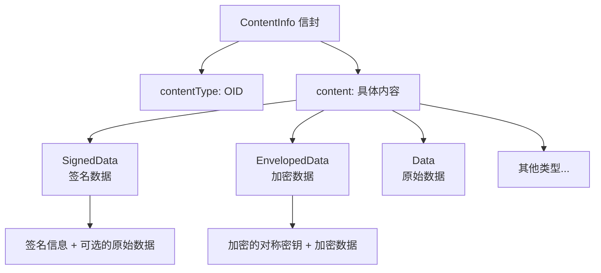

# CMS 与 S/MIME

**本文你会学到**：

- 为什么需要一个标准化的消息加密格式，而不是自己拼凑对称加密 + 数字签名
- CMS（Cryptographic Message Syntax）如何用统一的 ASN.1 结构封装签名和加密
- CMS 的两种签名模式（Detached vs Enveloping）分别适用于什么场景
- CMS 的两种加密方式（密钥传输 vs 密码加密）各自的工作原理
- S/MIME 如何将 CMS 嵌入邮件系统，实现签名和加密邮件
- CMS、S/MIME、PGP 三者的定位差异与选型建议

## 为什么需要 CMS？

假设你要给合作伙伴发送一份合同，要求同时满足三个安全属性：**机密性**（只有对方能看）、**完整性**（不能被篡改）、**认证**（证明是你发的）。你可能会想："我先用 AES 加密，再用 RSA 签名，把密文和签名拼在一起发送不就行了？"

想法是对的，但问题在于"拼在一起"这个环节。如果你用 Java 的 `Cipher` 加密得到 `byte[]`，再用 `Signature` 签名得到另一个 `byte[]`，接收方怎么知道哪段是密文、哪段是签名、用的什么算法、签名者的证书在哪里？你需要自己设计一套格式规范，而你自己设计的格式很可能和其他系统不兼容。

**CMS（Cryptographic Message Syntax）**就是为了解决这个问题而生的。它定义了一套标准的 ASN.1 数据结构，把签名、加密、证书、算法信息等全部规范化地打包在一起，任何遵循 CMS 标准的系统都能正确解析。

💡 把 CMS 想象成"密码学领域的 ZIP 格式"——它不是一种新的加密算法，而是一个**封装标准**，规定了如何把各种密码学操作的结果组织成一个可互操作的数据包。

CMS 最初定义在 PKCS#7 标准中（所以经常被称为 PKCS#7），后来由 IETF 接手维护，最新版本在 RFC 5652 中描述。它的核心结构是 `ContentInfo`——一个"信封"，里面装的内容类型由 OID（Object Identifier）标识：



## CMS 消息类型

CMS 定义了多种消息类型，最常用的有两个：`SignedData`（签名）和 `EnvelopedData`（加密）。理解这两个类型，就能覆盖绝大多数实际场景。

### SignedData：签名消息

当你需要证明消息来自你且未被篡改时，使用 `SignedData`。它的 ASN.1 结构包含版本号、摘要算法列表、签名者信息（`SignerInfo`）、可选的证书链等。

`SignedData` 有两种模式：

| 模式 | 说明 | 适用场景 |
|------|------|---------|
| **Detached（分离）** | 签名和原始数据分开存储 | S/MIME 邮件、大文件签名 |
| **Enveloping（封装）** | 签名和原始数据打包在一起 | 自包含的签名文件 |

⚠️ `SignedData` 并不要求一定包含原始数据。当它不包含时就是 Detached 模式——这也是为什么它叫"Signed Data"而不叫"Signed Encapsulated Data"。

### EnvelopedData：加密消息

当你需要保护消息的机密性时，使用 `EnvelopedData`。它的工作方式是：生成一个随机对称密钥加密数据，再用非对称算法（或密码）包装这个对称密钥。`EnvelopedData` 结构中包含多个收件人信息（`RecipientInfo`），每个收件人用自己的方式解出对称密钥。

CMS 定义了四种收件人类型：

| 类型 | 机制 | 适用场景 |
|------|------|---------|
| `ktri`（Key Transport） | 用 RSA 等公钥加密对称密钥 | 最常用，一对一加密 |
| `kari`（Key Agreement） | 用 ECDH 等协商出共享密钥 | 多方密钥协商 |
| `kekri`（KEK） | 用对称密钥包装对称密钥 | 已有预共享密钥的场景 |
| `pwri`（Password） | 用密码 + PBKDF2 派生密钥 | 人工交换密钥的场景 |

## CMS 签名实战

Java 标准库不直接支持 CMS，需要使用 BouncyCastle 的 `org.bouncycastle.cms` 包。下面通过具体代码演示两种签名模式。

### Detached 签名

当你签一个大文件时，不希望把文件内容复制一份塞进签名里——文件可能有几个 GB。Detached 签名把数据和签名分开存储，接收方需要同时持有两者才能验证。

``` java title="创建 CMS Detached 签名"
// 创建签名生成器
CMSSignedDataGenerator signedDataGenerator = new CMSSignedDataGenerator();
signedDataGenerator.addSignerInfoGenerator(
    new JcaSimpleSignerInfoGeneratorBuilder()
        .setProvider("BC")
        .build("SHA256WithRSA", keyPair.getPrivate(), cert)  // 签名算法 + 私钥 + 证书
);

// 生成 Detached 签名（detached = true，签名不包含原始数据）
CMSSignedData signedData = signedDataGenerator.generate(
    new CMSProcessableByteArray(originalData),
    true  // ✅ detached 模式
);
byte[] signatureBytes = signedData.getEncoded(); // 签名数据，与 originalData 分开存储
```

验证 Detached 签名时，需要把原始数据和签名重新组合：

``` java title="验证 CMS Detached 签名"
// 将原始数据和签名重新组合
CMSSignedData signedDataToVerify = new CMSSignedData(
    new CMSProcessableByteArray(originalData), signatureBytes
);

// 构建签名验证器并验证
SignerInformationVerifier verifier = new JcaSimpleSignerInfoVerifierBuilder()
    .setProvider("BC")
    .build(cert.getPublicKey());

SignerInformation signerInfo = signedDataToVerify.getSignerInfos().getSigners().iterator().next();
assertTrue(signerInfo.verify(verifier)); // ✅ 验证通过
```

### Enveloping 签名

当你希望签名是自包含的（比如一个签名后的配置文件），使用 Enveloping 模式。签名中直接包含原始数据，验证时不需要额外的数据文件。

``` java title="创建 CMS Enveloping 签名"
CMSSignedDataGenerator signedDataGenerator = new CMSSignedDataGenerator();
signedDataGenerator.addSignerInfoGenerator(
    new JcaSimpleSignerInfoGeneratorBuilder()
        .setProvider("BC")
        .build("SHA256WithRSA", keyPair.getPrivate(), cert)
);

// 生成 Enveloping 签名（detached = false，签名中包含原始数据）
CMSSignedData signedData = signedDataGenerator.generate(
    new CMSProcessableByteArray(originalData),
    false  // ✅ enveloping 模式
);
byte[] signedContent = signedData.getEncoded(); // 签名 + 数据打包在一起
```

验证并提取数据：

``` java title="验证 CMS Enveloping 签名并提取数据"
// 注意：需要同时传入 signedContent 和 getSignedContent() 才能保留嵌入数据
CMSSignedData signedDataToVerify = new CMSSignedData(
    signedData.getSignedContent(), signedContent
);

// 从嵌入数据中提取原始内容
byte[] extractedData = (byte[]) signedDataToVerify.getSignedContent().getContent();
assertArrayEquals(originalData, extractedData); // ✅ 数据一致

// 验证签名
SignerInformationVerifier verifier = new JcaSimpleSignerInfoVerifierBuilder()
    .setProvider("BC")
    .build(cert.getPublicKey());
assertTrue(signerInfo.verify(verifier)); // ✅ 签名验证通过
```

⚠️ **Enveloping 签名的验证陷阱**：直接从 `byte[]` 构造 `CMSSignedData` 时不保留嵌入内容。必须同时传入 `signedData.getSignedContent()` 才能提取原始数据。

## CMS 加密实战

### 密钥传输加密

密钥传输（Key Transport）是最常用的 CMS 加密方式。它的工作原理是：

1. 生成一个随机的 AES 对称密钥
2. 用 AES 密钥加密原始数据
3. 用收件人的 RSA 公钥加密这个 AES 密钥
4. 把加密后的 AES 密钥和加密后的数据打包在一起

收件人用自己的 RSA 私钥解出 AES 密钥，再用 AES 密钥解密数据。

💡 这就像"你把一把钥匙锁在保险箱里，保险箱只能用收件人的钥匙打开。收件人打开保险箱拿到里面的钥匙，再用这把钥匙打开真正的宝箱"。

``` java title="CMS 密钥传输加密"
CMSEnvelopedDataGenerator envelopedGenerator = new CMSEnvelopedDataGenerator();

// 用收件人的公钥证书包装对称密钥
envelopedGenerator.addRecipientInfoGenerator(
    new JceKeyTransRecipientInfoGenerator(recipientCert)
        .setProvider("BC")
);

// 用 AES-256-CBC 加密内容（对称密钥自动生成）
CMSEnvelopedData envelopedData = envelopedGenerator.generate(
    new CMSProcessableByteArray(originalData),
    new JceCMSContentEncryptorBuilder(CMSAlgorithm.AES256_CBC)
        .setProvider("BC")
        .build()
);
byte[] encryptedBytes = envelopedData.getEncoded();
```

解密：

``` java title="CMS 密钥传输解密"
CMSEnvelopedData envelopedDataToDecrypt = new CMSEnvelopedData(encryptedBytes);
RecipientInformationStore recipientInfoStore = envelopedDataToDecrypt.getRecipientInfos();

// 用收件人私钥解密
RecipientInformation recipientInfo = recipientInfoStore.getRecipients().iterator().next();
byte[] decryptedData = recipientInfo.getContent(
    new JceKeyTransEnvelopedRecipient(recipientKeyPair.getPrivate())
        .setProvider("BC")
);
assertArrayEquals(originalData, decryptedData); // ✅ 解密成功
```

### 密码加密

当你没有收件人的公钥证书时，可以使用密码加密（Password-based Encryption）。CMS 通过 PBKDF2 从密码派生出密钥，再用这个密钥加密对称密钥。

``` java title="CMS 密码加密"
CMSEnvelopedDataGenerator envelopedGenerator = new CMSEnvelopedDataGenerator();

// 用密码派生密钥（PBKDF2）
JcePasswordRecipientInfoGenerator passwordRecipientInfoGenerator =
    new JcePasswordRecipientInfoGenerator(
        CMSAlgorithm.AES256_CBC,  // KEK 算法 OID，决定派生密钥长度
        password
    ).setProvider("BC");
envelopedGenerator.addRecipientInfoGenerator(passwordRecipientInfoGenerator);

// 用 AES-256-CBC 加密内容
CMSEnvelopedData envelopedData = envelopedGenerator.generate(
    new CMSProcessableByteArray(originalData),
    new JceCMSContentEncryptorBuilder(CMSAlgorithm.AES256_CBC)
        .setProvider("BC")
        .build()
);
```

解密时只需提供相同的密码：

``` java title="CMS 密码解密"
CMSEnvelopedData envelopedDataToDecrypt = new CMSEnvelopedData(encryptedBytes);
RecipientInformation recipientInfo = envelopedDataToDecrypt.getRecipientInfos()
    .getRecipients().iterator().next();

byte[] decryptedData = recipientInfo.getContent(
    new JcePasswordEnvelopedRecipient(password)
        .setProvider("BC")
);
```

⚠️ 密码加密的密码复杂度非常重要。建议至少 14 个字符（约 112 bit 熵），不要使用简单密码。

## S/MIME——将 CMS 用于邮件

当你理解了 CMS 之后，S/MIME 就很简单了——它只是把 CMS 消息嵌入到 MIME 邮件格式中。

S/MIME（Secure/MIME）定义在 RFC 5751 中，是电子邮件安全的事实标准。你可能已经在邮件客户端中见过 S/MIME 签名邮件——它们通常显示一个"已签名"或"已加密"的标识。

BouncyCastle 提供两套 S/MIME API：基于 JavaMail 的（在 `bcmail-*` JAR 中）和直接解析 MIME 的 PKIX API。下面使用 JavaMail 版本演示，因为它更直观。

### 签名邮件

S/MIME 签名邮件使用 `multipart/signed` MIME 类型，由两部分组成：第一部分是原始邮件内容，第二部分是 Detached 签名。这种格式的好处是**即使收件人的邮件客户端不支持 S/MIME，也能正常阅读邮件内容**。

``` java title="创建 S/MIME 签名邮件"
// 创建邮件正文
MimeBodyPart bodyPart = new MimeBodyPart();
bodyPart.setText("这是一封通过 S/MIME 签名的测试邮件。");

// 创建 S/MIME 签名生成器
SMIMESignedGenerator smimeSignedGenerator = new SMIMESignedGenerator();
smimeSignedGenerator.addSignerInfoGenerator(
    new JcaSimpleSignerInfoGeneratorBuilder()
        .setProvider("BC")
        .build("SHA256WithRSA", signerKeyPair.getPrivate(), signerCert)
);
smimeSignedGenerator.addCertificates(new JcaCertStore(List.of(signerCert))); // 附带证书

// 生成 multipart/signed 格式
MimeMultipart signedMultipart = smimeSignedGenerator.generate(bodyPart);
```

验证签名邮件时，从 `multipart/signed` 中解析出签名并验证：

``` java title="验证 S/MIME 签名邮件"
SMIMESigned signed = new SMIMESigned((MimeMultipart) signedMessage.getContent());

// 验证签名
SignerInformationVerifier verifier = new JcaSimpleSignerInfoVerifierBuilder()
    .setProvider("BC")
    .build(signerCert.getPublicKey());
assertTrue(signer.getSignerInfos().getSigners().iterator().next().verify(verifier));

// 提取原始邮件内容
String extractedText = (String) signed.getContent().getContent();
```

### 加密邮件

S/MIME 加密邮件使用 `application/pkcs7-mime` MIME 类型，邮件正文完全被加密，只有持有正确私钥的收件人才能解密。

``` java title="创建 S/MIME 加密邮件"
// 创建原始邮件正文
MimeBodyPart bodyPart = new MimeBodyPart();
bodyPart.setText("这是一封通过 S/MIME 加密的机密邮件。");

// 创建 S/MIME 加密生成器
SMIMEEnvelopedGenerator smimeEnvelopedGenerator = new SMIMEEnvelopedGenerator();
smimeEnvelopedGenerator.addRecipientInfoGenerator(
    new JceKeyTransRecipientInfoGenerator(recipientCert)
        .setProvider("BC")
);

// 加密邮件正文（AES-256-CBC）
MimeBodyPart encryptedPart = smimeEnvelopedGenerator.generate(
    bodyPart,
    new JceCMSContentEncryptorBuilder(CMSAlgorithm.AES256_CBC)
        .setProvider("BC")
        .build()
);
```

解密：

``` java title="解密 S/MIME 加密邮件"
SMIMEEnveloped enveloped = new SMIMEEnveloped(encryptedPart);
RecipientInformation recipientInfo = enveloped.getRecipientInfos()
    .getRecipients().iterator().next();

MimeBodyPart decryptedPart = SMIMEUtil.toMimeBodyPart(
    recipientInfo.getContent(
        new JceKeyTransEnvelopedRecipient(recipientKeyPair.getPrivate())
            .setProvider("BC")
    )
);
String decryptedText = (String) decryptedPart.getContent();
```

## CMS vs S/MIME vs PGP 对比

你可能听说过 PGP（Pretty Good Privacy），它和 S/MIME 都能实现邮件的签名和加密。它们的关系是什么？

| 维度 | CMS / S/MIME | PGP / OpenPGP |
|------|-------------|---------------|
| **标准基础** | IETF RFC 5652 / RFC 5751 | IETF RFC 4880 |
| **数据格式** | ASN.1（DER/BER 编码） | 自定义二进制格式 |
| **信任模型** | 基于 PKI（X.509 证书链 + CA） | 基于 Web of Trust（信任网） |
| **邮件生态** | 企业邮件系统（Outlook、Apple Mail） | 技术社区（Thunderbird、ProtonMail） |
| **适用范围** | 邮件 + 任意数据（PDF 签名、时间戳等） | 最初为邮件设计，后来扩展到通用加密 |
| **Java 库** | BouncyCastle (`bcpkix`, `bcmail`) | BouncyCastle (`bcpg`) |

**选型建议**：

- 企业内部邮件安全 → **S/MIME**（已有 AD/LDAP 证书基础设施）
- 个人隐私通信 → **OpenPGP**（无需 CA，Web of Trust 更灵活）
- 非邮件场景（如 PDF 签名、时间戳协议） → **CMS**（S/MIME 是 CMS 在邮件上的具体应用）

## 常见问题与陷阱

### Enveloping 签名验证时提取不到数据

这是最常见的坑。如果你直接从 `byte[]` 构造 `CMSSignedData`，再调用 `getSignedContent().getContent()`，会得到 `null`。正确做法是构造时同时传入 `signedData.getSignedContent()`：

``` java
// ❌ 错误：直接从 byte[] 构造会丢失嵌入数据
CMSSignedData sd = new CMSSignedData(signedContent);

// ✅ 正确：同时传入 signedContent 和嵌入数据
CMSSignedData sd = new CMSSignedData(
    originalSignedData.getSignedContent(), signedContent
);
```

### S/MIME 签名验证失败：规范化问题

S/MIME 要求文本数据的行结尾统一为 `\r\n`（CRLF）。如果你的邮件在传输过程中被某个网关"好心"地把 `\r\n` 改成了 `\n`，签名就会验证失败。排查时注意：

- 创建签名邮件前，确保文本内容使用 CRLF 行尾
- 某些邮件网关会去除行尾空白、替换特殊字符编码，都可能导致签名失效
- AS2 协议使用二进制传输编码，不受此影响

### CMS 不直接支持 JDK，必须依赖 BouncyCastle

Java 标准库的 `java.security` 包提供了底层的签名和加密能力，但不提供 CMS 格式的封装。要处理 `.p7s`（签名文件）、`.p7m`（加密文件）等 CMS 格式，必须引入 BouncyCastle：

``` xml title="Maven 依赖"
<dependency>
    <groupId>org.bouncycastle</groupId>
    <artifactId>bcprov-jdk18on</artifactId>
</dependency>
<dependency>
    <groupId>org.bouncycastle</groupId>
    <artifactId>bcpkix-jdk18on</artifactId>
</dependency>
<!-- S/MIME 的 JavaMail API 还需要 -->
<dependency>
    <groupId>org.bouncycastle</groupId>
    <artifactId>bcmail-jdk18on</artifactId>
</dependency>
```

### 密码加密的密码复杂度

CMS 密码加密使用 PBKDF2 从密码派生密钥。如果密码太简单（比如 "password"），攻击者可以暴力破解。建议：

- 密码长度至少 14 个字符
- 使用随机 Salt（至少 16 字节）
- 迭代次数至少 2048 次（BouncyCastle 默认值通常已足够）
