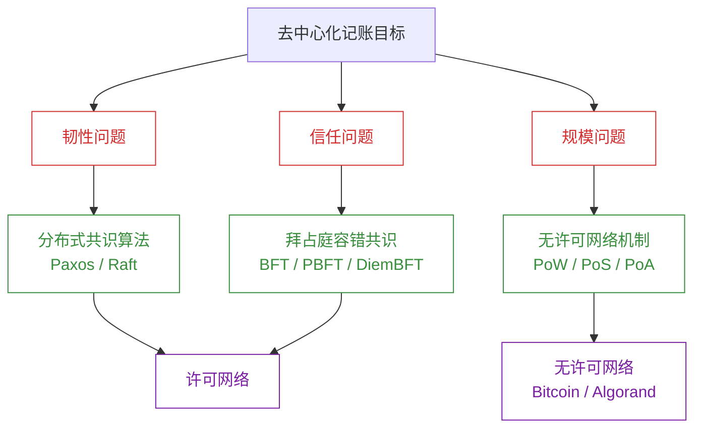
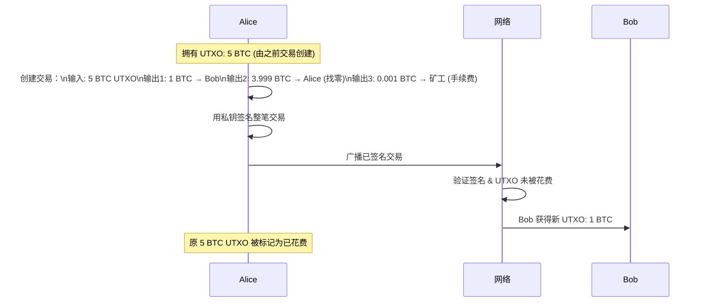
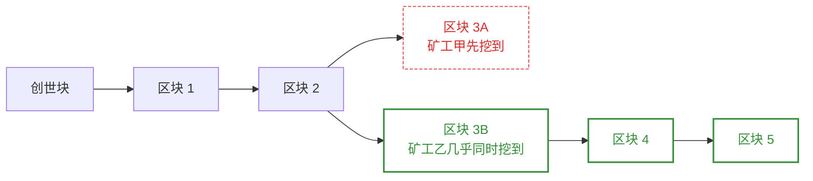
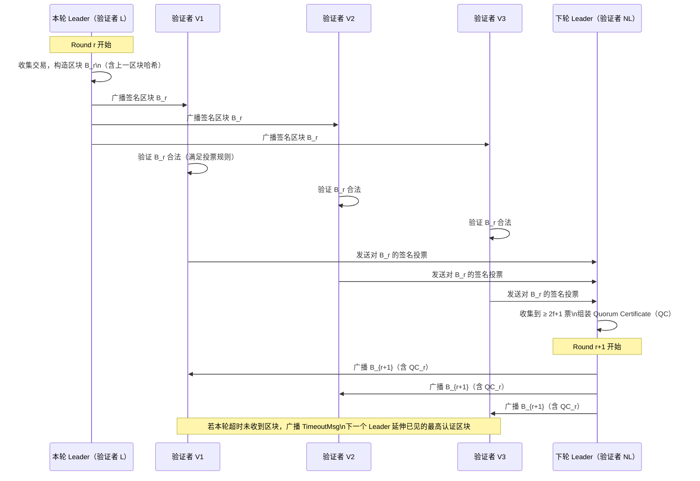
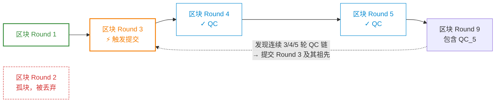

# 加密货币与 BFT 共识

**本文你会学到**：

- 分布式账本为何需要「共识」而非简单的数据库复制
- 拜占庭将军问题如何催生了 BFT 共识算法
- Bitcoin 的 `UTXO` 模型、`PoW` 挖矿与分叉解决机制
- `Merkle Tree` 如何让区块验证只需下载几 KB 而非几百 GB
- 加密货币在波动性、延迟、链大小、机密性、能耗五个维度的核心权衡
- DiemBFT 协议如何在 `< 1/3` 拜占庭节点下同时保证安全性与活性
- 密码学原语（哈希、`ECDSA`、Merkle 树）在区块链中的具体角色

---

## 🏦 没有银行，怎么记账？

你不需要银行账户，就可以给地球另一端的陌生人转账——这是 Bitcoin 在 2008 年提出的核心承诺。

普通银行的记账方式很简单：一张中心化的数据库表格，里面有每个人的余额。转账就是修改两行记录。问题在于：你必须**无条件信任**这家银行不会作弊、不会倒闭、不会被黑客攻破。

加密货币的目标是把这张表格变成**全球任何人都能读写、任何人都无法篡改**的公共账本。这个目标拆解成三个子问题：

- ⚙️ **韧性**：账本不能依赖单台服务器
- 🔒 **信任**：记账者之间不能互相盲目信任
- 🌐 **规模**：任何人都能加入，不限制参与者数量

### 🌐 韧性：分布式复制还不够

最直观的思路是把数据库复制到多台服务器——这正是所有大型互联网应用都在做的事。副本服务器分布全球，主库宕机后备库接管，实现高可用。

但复制本身带来新问题：

- 副本之间存在**延迟**，读不同副本可能看到不同余额（最终一致性）
- 主库崩溃后，哪个副本接管？接管时已提交的更改会丢失吗？

这时就需要**共识算法**（Consensus Algorithm）——让分布在网络中的多台机器，对「下一个状态是什么」达成统一决定。Paxos（1989）和 Raft（2013）是两个经典实现。把共识算法想象成：一群人通过网络聊天决定点哪种披萨，但消息可能丢失、延迟、被篡改，所以需要一套更复杂的投票规则。

### 🔒 信任：从分布式到去中心化

传统的 Paxos/Raft 共识假设参与节点是**好意但可能崩溃**的——它们只处理故障，不处理恶意行为。一旦某台服务器被黑客控制并开始说谎，整个系统就会崩溃。

1982 年，Lamport 提出了**拜占庭将军问题**：

> 几支拜占庭军队包围了敌城，每支军队由独立将军指挥，将军们只能通过信使通信，必须就进攻或撤退达成一致行动。然而，部分将军可能是叛徒，会故意干扰协议。
>
> ——Lamport et al.《The Byzantine Generals Problem》, 1982

拜占庭容错（`BFT`，Byzantine Fault Tolerant）共识算法的目标是：即使存在一定比例的**恶意节点**（叛徒将军），诚实节点依然能达成一致。BFT 协议大量使用密码学来认证消息，使得恶意节点无法伪造其他节点的投票。

第一个实用 BFT 算法是 PBFT（Practical BFT，1999），是 Paxos 的 BFT 变体。今天大多数现代加密货币使用更高效的 PBFT 变种，如 Facebook 2019 年推出的 DiemBFT（基于 HotStuff）。

### 🌐 规模：无许可网络

PBFT 系的算法有一个根本限制：**必须提前知道参与者集合**（许可网络，Permissioned Network）。超过几十个节点后，通信复杂度急剧上升，协议就会崩溃。

Bitcoin 提出了完全不同的思路——**无许可网络**（Permissionless Network）：任何人都可以加入，无需事先获得许可。

要在无许可网络中决定「谁来提议下一个区块」，Bitcoin 使用了**工作量证明**（`PoW`，Proof of Work）：让所有节点竞争解一道密码学难题，第一个解出的人获得提议权。解题需要大量计算，所以伪造身份毫无意义——你需要的是真实的算力，而不是账号数量。

现代替代方案还有：

- `PoA`（Proof of Authority）：参与者提前确定（许可网络）
- `PoS`（Proof of Stake）：根据持有的货币量动态选出参与者，Algorand（2017）是代表作



---

## ⛓️ Bitcoin 速览

### 账户模型：`UTXO` 而非余额表

普通银行数据库记录的是「Alice 的余额 = 500 元」。Bitcoin 没有余额表，它记录的是一堆**未花费的交易输出**（`UTXO`，Unspent Transaction Output）。

把 `UTXO` 想象成一个对全世界公开的大碗，里面装着各种面额的「硬币」，每枚硬币上标着它的主人（公钥哈希）。当你想转账时，你把碗里属于你的硬币取出来，创建一笔新交易：旧硬币消失，两枚新硬币出现——一枚给接收方，一枚找零给自己（剩余部分作为矿工手续费）。

你的账户「余额」= 碗里所有属于你的 `UTXO` 之和。

Bitcoin 账户不是用户名+密码，而是一对 **`ECDSA` 密钥对**（使用 `secp256k1` 曲线，详见「数字签名」章节）。公钥（或其哈希，即地址）用于接收，私钥用于签名交易。公钥哈希作为地址的好处：

- 长度更短（地址比公钥短）
- 防范量子计算——在你花费之前，公钥从不暴露，攻击者无法推导私钥



### ⛏️ `PoW` 挖矿：密码学难题竞赛

谁来决定把哪些交易打包进账本的下一页（区块）？答案是全网竞争。

**挖矿过程**：

1. 把待打包的交易列表 + 上一个区块的哈希 + 一个可调整的随机数（`nonce`）组合成区块
2. 对整个区块求双重 `SHA-256` 哈希
3. 如果结果的前 N 位都是 0，则「挖到了」，可以广播这个区块
4. 否则修改 `nonce` 重试——平均需要尝试 $2^N$ 次

挖到区块的矿工获得两项奖励：

- **区块奖励**：凭空创建新 BTC（初始 50 BTC，每 21 万个区块减半，总量上限 2100 万）
- **手续费**：区块内所有交易的手续费之和

`PoW` 挖矿解决的是 `UTXO` 的起源问题：所有 BTC 都是矿工奖励创造的。

**难度自适应**：Bitcoin 协议动态调整挖矿难度，使全网平均每 10 分钟出一个区块。

### 🔀 分叉解决：最长链胜出

如果两个矿工几乎同时挖出两个合法区块怎么办？这就产生了**分叉**（Fork）——区块链暂时有两个头。

Bitcoin 的解决规则：**遵循累计工作量最大的链**（2008 论文原文说"最长链"，后改为最大累计工作量，实践中差异不大）。



> 区块 3A 成为孤块，区块 3B 所在的链更长，被全网接受。

这意味着 Bitcoin **没有绝对的最终性**：你的交易被打包进区块后，仍有可能因为链重组被抹去。通常等待 6 个确认块（约 1 小时）才认为交易基本不可逆。

这也是比特币最大的安全漏洞——**51% 攻击**：如果某个攻击者掌握超过全网一半的算力，就能悄悄构建一条更长的私有链，然后公布出来覆盖已有历史，实现「双花」（Double Spend）。2018 年 Vertcoin、2019 年 Ethereum Classic、2020 年 Bitcoin Gold 都遭受过实际的 51% 攻击。

### 🌳 `Merkle Tree`：高效验证交易存在性

Bitcoin 区块体积庞大，每个区块最多包含数千笔交易。但实际上，**区块头（Block Header）中并不直接存储交易列表**，而是存储交易列表的 `Merkle Tree` 根哈希。

`Merkle Tree` 是一种二叉树：

- 叶节点 = 每笔交易的哈希
- 内部节点 = 左右子节点哈希的拼接后再哈希
- 根节点（Merkle Root）= 对所有交易的紧凑认证

```
         Root = H(AB || CD)
        /                  \
  H(AB)=H(A||B)      H(CD)=H(C||D)
    /       \           /       \
  H(A)    H(B)       H(C)    H(D)
  tx_A    tx_B       tx_C    tx_D
```

`Merkle Tree` 的神奇之处在于**成员证明**（Membership Proof）：如果你只知道根哈希，想验证某笔交易 tx_A 是否在区块中，对方只需提供「路径上的兄弟节点」（H(B) 和 H(CD)），你就能自底向上重新计算根哈希，O(log N) 个哈希即可完成验证——不需要下载全部交易。

这对轻量级客户端（手机、嵌入式设备）极为重要：只需下载区块头（约 80 字节）而非完整区块（可达 1 MB），即可验证交易是否上链。详见「哈希与完整性」中关于 Merkle 树的深度介绍。

---

## ⚖️ 加密货币的权衡

Bitcoin 证明了去中心化货币的可行性，但也暴露了大量问题。以下五个维度是后续加密货币重点攻克的方向。

### 📈 波动性

Bitcoin 的价格可以在一天内涨跌数千美元。2010 年，开发者 Laszlo Hanyecz 用 1 万 BTC 买了两个披萨；2021 年 2 月，1 BTC 价值约 57,000 美元——也就是说那两个披萨价值 5.7 亿美元。

极度的价格波动使 Bitcoin 在实践中更接近投机资产而非货币。解决方案是**稳定币**（Stablecoin）：将代币与法币（如美元）1:1 锚定，例如 Diem（Libra）。

### ⏱️ 延迟

Bitcoin 的吞吐量只有约 7 笔/秒，而 Visa 网络可处理约 24,000 笔/秒。从用户发起交易到最终确认，Bitcoin 需要约 1 小时。

延迟由两部分组成：

- **吞吐量**（Throughput）：系统每秒能处理多少交易
- **终局性**（Finality）：交易被认为不可逆转所需的时间

BFT 协议通常将终局性压缩到数秒，吞吐量达到数千笔/秒。对于更高要求的场景，还有**Layer 2 协议**：在链下快速处理交易，定期把进度写回主链。

### 💾 链上大小

Bitcoin 区块链在 2021 年已超过 300 GB，仍在持续增长。新节点加入网络需要先下载完整历史，这对普通用户极不友好。

BFT 协议由于吞吐量高，链增长速度更快，可能在数周内达到 TB 量级。

最有趣的解决方案是 `Mina`（原 Coda）：使用**零知识证明**（Zero-Knowledge Proof，ZKP）将整条链的历史压缩成一个固定大小的 11 KB 证明，任何人只需验证这个证明即可信任当前状态，无需下载历史。

### 🕵️ 机密性

Bitcoin 提供的只是「伪匿名」：账户与公钥绑定而非真实姓名，但所有交易对全网公开。通过分析交易图（谁转给谁）、交易所 KYC 数据、链上行为模式，可以追溯出账户背后的真实身份。

`Zcash` 是最知名的隐私货币：使用 ZKP（具体是 `zk-SNARK`）对交易的发送方、接收方、金额全部加密，对外只证明「这笔交易合法」，但不泄露任何细节。详见拟新建的「下一代密码学」中关于 zk-Rollup 等链上扩容技术的介绍。

### ⚡ 能耗

Bitcoin 的 `PoW` 挖矿是一场全球性的「算力军备竞赛」——所有矿工不停地计算哈希，只为了让第一个解题的人获得提议权，其他人的计算完全浪费。

剑桥大学研究（2021 年）显示，Bitcoin 挖矿的年耗电量超过阿根廷全国用电量，跻身全球前 30 大能源消费者（如果视作一个国家）。

BFT 协议完全不依赖 `PoW`，不存在这种浪费性计算。这是为什么几乎所有现代加密货币都放弃了 PoW，以太坊也在 2022 年从 `PoW` 切换到了 `PoS`（The Merge）。

---

## 🔐 DiemBFT：现代 BFT 协议剖析

Diem（前身为 Libra）是 Facebook 于 2019 年发布的稳定币项目，基于 `HotStuff` 协议实现了名为 `DiemBFT` 的共识算法。与 Bitcoin 不同，Diem 运行在**许可网络**中（参与者已知），以此换取更高的效率和更强的安全保证。

### 安全性与活性：BFT 协议的两个核心目标

任何 BFT 共识协议都必须同时满足：

- **安全性**（Safety）：系统不会产生矛盾状态，即不会分叉。不存在两个诚实节点对「当前状态」有不同认知。
- **活性**（Liveness）：当用户提交交易时，系统最终会处理它。没有任何实体能让系统永远停在某个状态。

安全性通常容易保证，活性则更难。1985 年 Fischer-Lynch-Paterson 不可能定理证明：在纯异步网络（消息可以任意延迟）中，不存在任何确定性算法能同时满足安全性和活性。

DiemBFT 的应对策略：假设网络在足够长的一段时间内会趋于同步（稳定），在此期间保证活性；在极端网络条件下也绝不破坏安全性（不分叉）。

### 🗳️ 一轮投票流程

DiemBFT 在许可网络中运行，参与者称为**验证者**（Validator）。协议以严格递增的**轮次**（Round）推进：



关键概念：

- **仲裁证书**（`QC`，Quorum Certificate）：`≥ 2f+1` 个验证者对同一区块的签名集合，证明该区块获得了多数诚实节点的认可
- **超时机制**：如果 Leader 失联（宕机、网络分区），验证者在超时后广播 `TimeoutMsg`，驱动协议进入下一轮

### 🧮 拜占庭容忍度：`< 1/3` 是魔法数字

设系统中最多有 `f` 个恶意（拜占庭）验证者，DiemBFT 要求验证者总数 `n ≥ 3f + 1`，即：

$$n \geq 3f + 1 \implies f < \frac{n}{3}$$

QC 需要 `≥ 2f+1` 票，这是能保证「QC 中至少有 1 票来自诚实节点」的最低多数：

| 情形 | 票数 | 含义 |
|------|------|------|
| `f` 票 | 可能全是恶意票 | 无法保证有诚实节点参与 |
| `f+1` 票 | 至少 1 票来自诚实节点 | 但不足以构成多数 |
| `2f+1` 票（QC 门槛）| 至少 `f+1` 票来自诚实节点 | ✅ 构成可信多数 |
| `3f+1` 票 | 全体投票 | 不现实（需所有节点在线） |

**关键推论**：同一轮次不可能同时出现两个 QC（证明由矛盾法得出：两个 QC 各需 `2f+1` 票，合计 `4f+2` 票，但系统只有 `3f+1` 个验证者，中间重叠的 `f+1` 票必有诚实节点，而诚实节点不会对同一轮两个不同区块各投一票）。

### ⛓️ 两条投票规则

验证者必须遵守两条规则，否则被视为拜占庭节点：

1. **不能为过去的轮次投票**：如果你刚在第 3 轮投票，只能为第 4 轮及以后的提案投票
2. **只能为父区块轮次 ≥ 自己「偏好轮次」的区块投票**

「偏好轮次」的更新规则：

- 初始为 0
- 当你为某区块 B（轮次 r）投票，且 B 的父区块（轮次 r-1）的父区块轮次为 r-2 时，将偏好轮次更新为 `max(偏好轮次, r-2)`

这两条规则联合作用，确保：一旦某条链获得了一个 QC，没有任何诚实节点会为一条「更早分叉」的链投票，从而防止分叉扩散。

### ✅ 终局性：三连 QC 触发提交

区块被认证（获得 QC）不等于被最终提交（Committed）。在 DiemBFT 中，**提交规则**如下：

> 如果存在连续三个轮次（例如第 3、4、5 轮）各有一个区块获得认证，则第 3 轮的区块及其所有祖先区块被视为最终提交。



「连续三轮」的要求来自严格的安全性证明：只有三连 QC 才能保证不存在任何「隐藏的更长替代链」能被提交并超越当前提交点。

### 🔍 安全性直觉

为什么三连 QC 就足够了？核心逻辑：

1. 如果第 5 轮（Round 5）的区块获得了 QC，则有 `≥ f+1` 个诚实验证者投票，它们的偏好轮次都更新到了第 3 轮
2. 更新偏好轮次后，这些诚实节点**不会**为任何父区块轮次 `< 3` 的提案投票
3. 因此，任何试图在第 3 轮之前分叉的链都无法获得 `2f+1` 票，无法形成 QC
4. 第 3 轮区块得到保护，可以安全提交

这是整个 DiemBFT 安全性证明的直觉核心。完整数学证明详见 DiemBFT 论文附录（一页纸的严格推导）。

---

## 🔑 密码学在区块链中的角色

区块链不是凭空发明的技术，它是密码学原语的精巧组合：

| 密码学原语 | 在区块链中的具体角色 |
|-----------|---------------------|
| `SHA-256`（哈希） | PoW 难题计算；区块链接（每个区块存储前块哈希）；交易 ID 生成 |
| `ECDSA`（secp256k1） | Bitcoin 账户 = 密钥对；交易签名 = 授权花费 UTXO |
| `Merkle Tree` | 区块头中认证交易列表；SPV 轻客户端验证 |
| `RIPEMD-160(SHA-256(pk))` | Bitcoin 地址生成（公钥哈希，隐藏实际公钥） |
| `BLS 签名`（聚合签名） | DiemBFT QC 中聚合多个验证者签名，减小 QC 体积 |
| `ZKP`（零知识证明） | Zcash 隐私交易；Mina 链压缩；zk-Rollup 扩容 |

下面用 Java + Bouncy Castle 演示 Bitcoin 使用的 `secp256k1` 曲线 ECDSA 签名（完整实现细节见「数字签名」章节）：

``` java title="ECDSA secp256k1 签名演示（Bitcoin 所用曲线）"
import org.bouncycastle.crypto.AsymmetricCipherKeyPair;
import org.bouncycastle.crypto.generators.ECKeyPairGenerator;
import org.bouncycastle.crypto.params.*;
import org.bouncycastle.crypto.signers.ECDSASigner;
import org.bouncycastle.jce.ECNamedCurveTable;
import org.bouncycastle.jce.spec.ECNamedCurveParameterSpec;

import java.math.BigInteger;
import java.security.SecureRandom;

public class BitcoinEcdsaDemo {

    public static void main(String[] args) {
        // 获取 Bitcoin 使用的 secp256k1 曲线参数
        ECNamedCurveParameterSpec spec = ECNamedCurveTable.getParameterSpec("secp256k1");
        ECDomainParameters domainParams = new ECDomainParameters(
                spec.getCurve(), spec.getG(), spec.getN(), spec.getH());

        // 生成密钥对
        ECKeyPairGenerator generator = new ECKeyPairGenerator();
        generator.init(new ECKeyGenerationParameters(domainParams, new SecureRandom()));
        AsymmetricCipherKeyPair keyPair = generator.generateKeyPair();

        ECPrivateKeyParameters privateKey = (ECPrivateKeyParameters) keyPair.getPrivate();
        ECPublicKeyParameters publicKey = (ECPublicKeyParameters) keyPair.getPublic();

        // 模拟 Bitcoin 交易消息（实际中是交易数据的双重 SHA-256）
        byte[] message = "Alice sends 1 BTC to Bob".getBytes();
        byte[] txHash = doubleSha256(message); // 省略实现：SHA256(SHA256(message))

        // 使用私钥签名交易
        ECDSASigner signer = new ECDSASigner();
        signer.init(true, privateKey); // true = 签名模式
        BigInteger[] signature = signer.generateSignature(txHash);
        // signature[0] = r, signature[1] = s（DER 编码后写入交易）

        // 使用公钥验证签名（矿工打包前都会做此验证）
        signer.init(false, publicKey); // false = 验证模式
        boolean valid = signer.verifySignature(txHash, signature[0], signature[1]);
        System.out.println("签名验证结果: " + valid); // ✅ true
    }

    // 省略 doubleSha256 实现
    static byte[] doubleSha256(byte[] data) { /* SHA256(SHA256(data)) */ return data; }
}
```

下面是 `Merkle Tree` 的 Java 实现演示：

``` java title="Merkle Tree 构建与成员证明"
import java.nio.charset.StandardCharsets;
import java.security.MessageDigest;
import java.util.ArrayList;
import java.util.Arrays;
import java.util.List;

public class MerkleTreeDemo {

    // 计算 SHA-256 哈希
    static byte[] sha256(byte[] data) throws Exception {
        return MessageDigest.getInstance("SHA-256").digest(data);
    }

    // 拼接两个哈希再求哈希
    static byte[] hash(byte[] left, byte[] right) throws Exception {
        byte[] combined = new byte[left.length + right.length];
        System.arraycopy(left, 0, combined, 0, left.length);
        System.arraycopy(right, 0, combined, left.length, right.length);
        return sha256(combined);
    }

    // 构建 Merkle Tree，返回根哈希
    static byte[] buildMerkleRoot(List<byte[]> txHashes) throws Exception {
        if (txHashes.size() == 1) return txHashes.get(0);

        List<byte[]> level = new ArrayList<>(txHashes);
        // 若叶子数为奇数，复制最后一个（Bitcoin 的处理方式）
        if (level.size() % 2 != 0) level.add(level.get(level.size() - 1));

        while (level.size() > 1) {
            List<byte[]> nextLevel = new ArrayList<>();
            for (int i = 0; i < level.size(); i += 2) {
                nextLevel.add(hash(level.get(i), level.get(i + 1)));
            }
            if (nextLevel.size() % 2 != 0 && nextLevel.size() > 1)
                nextLevel.add(nextLevel.get(nextLevel.size() - 1));
            level = nextLevel;
        }
        return level.get(0);
    }

    public static void main(String[] args) throws Exception {
        // 模拟 4 笔交易（实际是交易数据的 SHA-256）
        List<byte[]> txHashes = Arrays.asList(
                sha256("tx_Alice_to_Bob".getBytes(StandardCharsets.UTF_8)),
                sha256("tx_Bob_to_Carol".getBytes(StandardCharsets.UTF_8)),
                sha256("tx_Carol_to_Dave".getBytes(StandardCharsets.UTF_8)),
                sha256("tx_Dave_to_Eve".getBytes(StandardCharsets.UTF_8))
        );

        byte[] merkleRoot = buildMerkleRoot(txHashes);
        System.out.printf("Merkle Root: %s%n", bytesToHex(merkleRoot));
        // 区块头只需存储这 32 字节，即可认证全部 4 笔交易
    }

    static String bytesToHex(byte[] bytes) {
        StringBuilder sb = new StringBuilder();
        for (byte b : bytes) sb.append(String.format("%02x", b));
        return sb.toString();
    }
}
```

---

## 🗺️ 现代选型简评

| 维度 | Bitcoin (PoW) | DiemBFT (BFT) | Zcash (ZKP) |
|------|--------------|---------------|-------------|
| 许可模型 | 无许可 | 许可 | 无许可 |
| 吞吐量 | ~7 TPS | ~1000+ TPS | ~6 TPS |
| 终局性 | ~1 小时（6 确认） | 数秒 | ~1 小时 |
| 能耗 | 极高（PoW） | 低（BFT） | 高（PoW + ZKP） |
| 机密性 | 伪匿名 | 伪匿名 | 完全隐私 |
| 分叉风险 | 存在（51% 攻击） | 不存在（< 1/3 拜占庭） | 存在 |
| 代表项目 | Bitcoin | Diem/Libra | Zcash |

**选型建议**：

- 需要完全开放、抗审查 → Bitcoin/Ethereum 系 PoW 或 PoS
- 需要高吞吐、强终局性、参与者可控 → DiemBFT 系 BFT 协议
- 需要链上隐私 → Zcash（`zk-SNARK`）或 Monero（Ring Signature）
- 关心链大小与轻客户端 → Mina（ZKP 链压缩）或 Layer 2 Rollup

更多前沿发展（zk-Rollup、Validity Proof、跨链桥等）详见「下一代密码学」。

---

> 本节内容参考自《Real-World Cryptography》(David Wong, Manning 2021) 第 12 章
