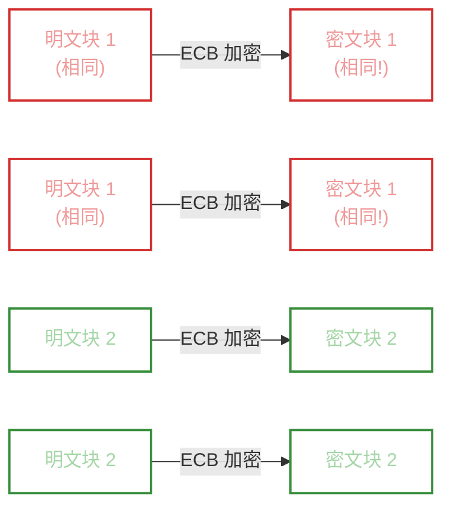
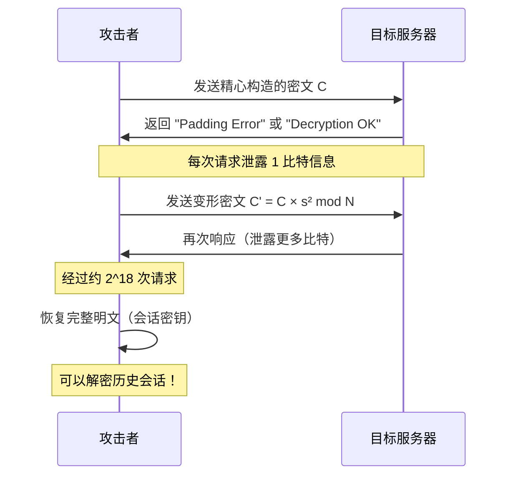
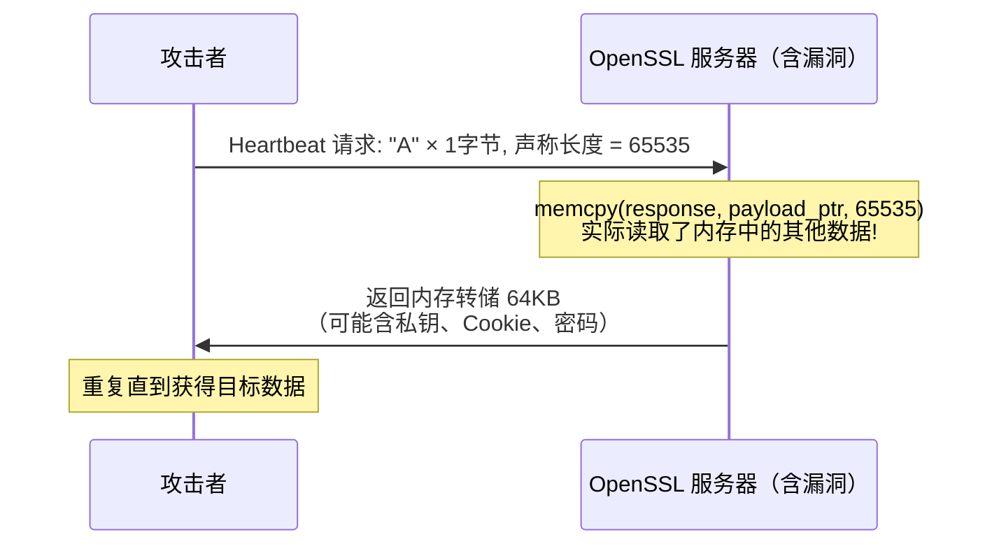
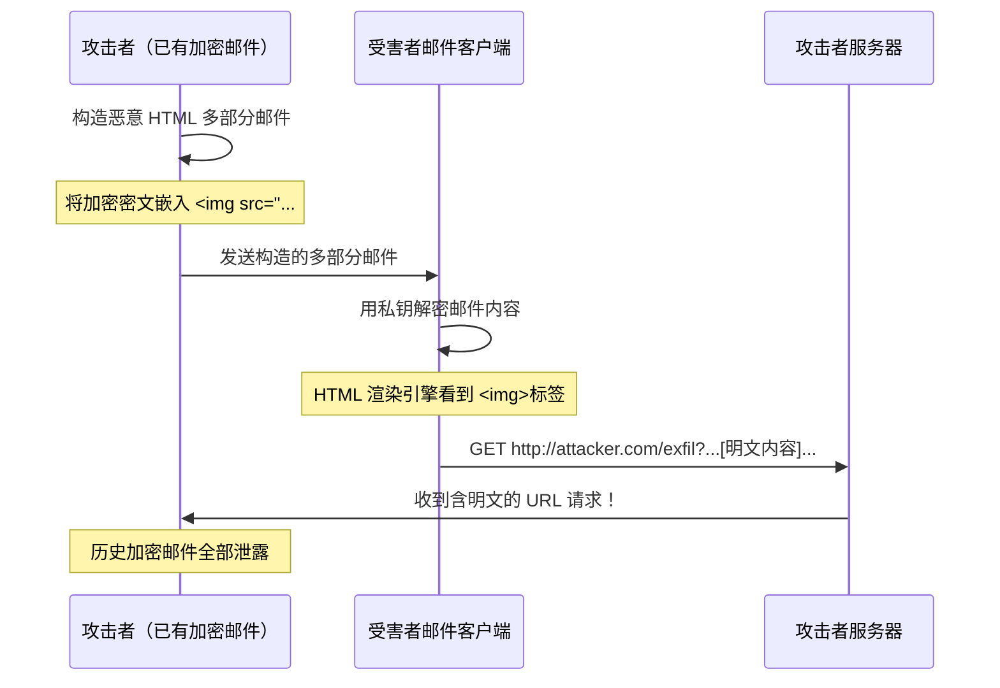

# 密码学失败案例集

> **本文你会学到**：

- 为什么密码学失败如此频繁，以及背后的系统性原因
- 随机数与 Nonce 的灾难性误用案例（Sony PS3、Debian OpenSSL）
- 对称加密的经典错误（ECB 模式、CBC Padding Oracle、GCM Nonce 重用）
- 哈希与 MAC 的陷阱（长度扩展攻击、时序攻击、MD5 碰撞）
- 公钥密码领域的重大失败（RSA Bleichenbacher、DigiNotar CA 泄露）
- TLS 协议漏洞全景（Heartbleed、BEAST、POODLE、DROWN、EFAIL）
- 工程师可以立即采用的防御清单

---

## 🤔 为什么密码学失败如此普遍

一项针对现实世界密码学 CVE 的研究表明：**83% 的密码学安全漏洞并非来自算法本身的弱点，而是来自对密码学 API 的误用**（Lazar et al., 2014，《Why Does Cryptographic Software Fail?》）。David Wong 在《Real-World Cryptography》中开篇便指出，他在为大型企业做安全审计的多年经历里，从未见过一条清晰的"从理论算法到安全落地"的路径——混乱才是常态。

用 Wong 的原话总结整个困境，在密码学工程化的最终步骤（Step 10）处写着：

> *"I misused the library or the construction is broken. Game over."*

### 为什么开发者会误用密码学

误用的根源通常来自三个方向：

**1. 自制算法的诱惑**

密码学的一条铁律——Kerckhoffs 原则——告诉我们：安全性应来自密钥的保密，而非算法的隐秘。但许多开发者仍倾向于"自己写一个加密函数"，认为只要别人看不懂源码就安全了。历史证明这是错误的：维吉尼亚密码曾被认为"牢不可破"，但最终被频率分析轻易攻破。

**2. 低层 API 暴露了太多危险选项**

直接使用 `javax.crypto.Cipher.getInstance("AES")` 这样的 Java API，你必须选择工作模式（ECB？CBC？GCM？）、填充方式、IV 生成策略……每一个错误选择都可能致命。这就像把普通驾驶员直接送进 F1 赛车——工具足够强大，但稍有失误就是灾难。

**3. 算法迁移极其缓慢**

Wong 在书中反复提到：即使更好的标准已经存在，旧的弱算法依然被广泛使用。RSA PKCS#1 v1.5 早在 1998 年就被 Bleichenbacher 证明存在致命漏洞，但截至 2021 年仍在大量生产系统中运行。

**政府后门**：2013 年 Snowden 泄露文件揭露，NSA 曾故意在 NIST 标准 `Dual EC DRBG` 随机数生成器中植入后门，让 NSA 能够预测所有用该标准生成的"随机数"。俄罗斯 GOST 标准也在 2019 年被发现经历了类似处理。这提醒我们，密码学的失败有时来自最不可能想到的地方。

---

## 💥 随机数与 Nonce 的灾难

> 随机数是密码学的命脉。如果随机数可预测，整个体系的安全假设就会崩塌。

### 🎮 Sony PS3：固定 Nonce 导致私钥泄露（2010）

**场景**：索尼使用 `ECDSA` 对 PS3 游戏机固件进行签名，防止玩家运行未授权代码。

**漏洞原因**：ECDSA 签名算法要求每次签名使用一个**一次性随机数** `k`（nonce）。索尼的实现中，这个 `k` 被硬编码为一个固定常量，每次签名都重复使用。

**攻击原理**：ECDSA 签名由两个值 `(r, s)` 组成，其中：

```
r = x 坐标 of [k]G
s = k⁻¹ × (H(m) + x × r) mod p
```

当两条不同消息 `m₁`、`m₂` 使用**相同的** `k` 签名时，两个 `s` 值满足：

```
s₁ = k⁻¹ × (H(m₁) + x × r) mod p
s₂ = k⁻¹ × (H(m₂) + x × r) mod p
```

两式相减，`k` 就可以直接算出来，进而计算出私钥 `x`：

```
k = (H(m₁) - H(m₂)) × (s₁ - s₂)⁻¹ mod p
x = (s₁ × k - H(m₁)) × r⁻¹ mod p
```

**结果**：黑客团队 fail0verflow 在 2010 年 CCC 黑客大会上公开演示了这一攻击。整个 PS3 安全体系因为一个"固定的随机数"而彻底瓦解。

**修复建议**：使用 `RFC 6979` 规范的**确定性 ECDSA**，或改用 `EdDSA`（Ed25519）——它通过 `HASH(nonce_key || message)` 确定性地生成 nonce，从根本上消除了随机性风险。Wong 在书中明确指出，`EdDSA` 正是为了解决 `ECDSA` 的 nonce 问题而设计的。

### 🐛 Debian OpenSSL：只剩 32767 种可能的密钥（2008）

**场景**：Debian Linux 的维护者在 2006 年试图修复 Valgrind 报告的一个"内存泄漏"警告，修改了 OpenSSL 的随机数池初始化代码。

**漏洞原因**：被删除的那行代码恰好是**贡献熵**的关键语句。修改后，整个随机数池的熵来源只剩下当前进程的 PID。Linux PID 最大值为 32767，意味着所有 Debian 系统在约两年内生成的所有 `RSA` 和 `ECDSA` 密钥只有 **32767 种可能**。

**影响**：任何使用该 Debian 系统生成的 SSH 密钥、TLS 证书，都可以被直接枚举破解。攻击者只需预先生成这 32767 个密钥对，对比目标公钥即可得到私钥。

**修复建议**：绝对不要自行修改密码学库的随机数相关代码。使用经过审计的密码学库（如 `libsodium`），并确保操作系统随机数源（`/dev/urandom`、`RDRAND`）正常初始化。

### 🔁 AES-GCM Nonce 重用：Forbidden Attack

**场景**：`AES-GCM`（Galois/Counter Mode）是目前最广泛使用的认证加密算法，要求每次加密使用唯一的 `nonce`（通常 96 位）。

**漏洞原因**：当两条不同明文 `P₁`、`P₂` 使用**相同的密钥 + 相同的 nonce** 加密时：

```
C₁ = P₁ ⊕ KeyStream
C₂ = P₂ ⊕ KeyStream
```

攻击者可以直接用 `C₁ ⊕ C₂ = P₁ ⊕ P₂` 消除密钥流，仅需已知其中一段明文即可恢复另一段。更糟糕的是，nonce 重用还会泄露 `GCM` 的认证密钥 `H`，使攻击者能**伪造任意认证标签**——即"Forbidden Attack"（Joux, 2006）。

**修复建议**：使用 `ChaCha20-Poly1305` 替代 `AES-GCM`（更宽容的 nonce 管理），或使用 `AES-GCM-SIV`（即使 nonce 重用也只丢失保密性，不丢失完整性）。

### 比特币随机数重用

2013 年，比特币 Android 客户端因 Java `SecureRandom` 在 Android 上的实现缺陷，导致部分用户的 ECDSA 签名使用了相同的 nonce。攻击者从区块链公开数据中扫描出 nonce 重复的交易，直接提取私钥，盗走了大量比特币。

---

## 🔓 对称加密的经典错误

> 加密模式的选择不是可选项，而是安全的决定性因素。

### 🐧 ECB 企鹅：加密了却没有隐藏

**场景**：某系统使用 `AES-ECB`（电子密码本模式）加密图像文件。

**漏洞原因**：ECB 模式将明文分割成 128 位的独立块，**每块用同一密钥独立加密**。相同的明文块始终产生相同的密文块。

**攻击原理**：即使不知道密钥，攻击者也能通过密文的模式分析重建明文的统计结构。著名的"ECB 企鹅图"演示了用 ECB 模式加密 Linux Tux 企鹅图片后，图形轮廓仍清晰可见——加密了，但没有真正隐藏任何信息。



**修复建议**：**永远不要使用 ECB 模式**。使用 `AES-GCM` 或 `ChaCha20-Poly1305`（同时提供保密性和完整性），或至少使用带随机 IV 的 `CBC` 模式（但需要额外添加 MAC）。

### 🐩 POODLE：CBC Padding Oracle（CVE-2014-3566）

**场景**：`SSL 3.0` 的 `CBC` 模式加密存在 Padding Oracle 漏洞。

**攻击原理**：攻击者通过操控密文最后一块的字节，观察服务器返回的是"解密成功"还是"填充错误"，每次获得 1 比特信息。经过约 256 次请求即可恢复任意一个字节的明文。一个 Cookie 通常可在数千次请求内完全恢复。

**影响**：POODLE 攻击（Padding Oracle On Downgraded Legacy Encryption）迫使整个互联网淘汰 SSL 3.0。现代协议用 TLS 1.2/1.3 替代，TLS 1.3 彻底移除了 CBC 加密套件。

**修复建议**：禁用 `SSL 3.0` 和 `TLS 1.0/1.1`，仅允许 `TLS 1.2+`，优先使用 `AEAD`（认证加密）算法套件（`AES-GCM`、`ChaCha20-Poly1305`）。

### 📡 WEP RC4：流密码密钥重用

**场景**：早期 Wi-Fi 安全协议 `WEP` 使用 `RC4` 流密码，每个数据包使用 24 位 IV + 共享密钥。

**漏洞原因**：24 位 IV 只有约 1600 万种可能，在繁忙的网络中几分钟内就会出现重复。一旦 IV 重用，攻击者用 `C₁ ⊕ C₂ = P₁ ⊕ P₂` 即可破解加密。

**影响**：WEP 已于 2004 年被 Wi-Fi 联盟正式废弃，替换为 `WPA2`（基于 `AES-CCMP`）和 `WPA3`（基于 `AES-GCM` + `SAE`）。

---

## ⚠️ 哈希与 MAC 的陷阱

> 哈希函数提供的是完整性，但实现细节的错误会让"完整性"形同虚设。

### ⚗️ 长度扩展攻击：Flickr API 漏洞

**场景**：某 API 服务使用 `SHA-256(secret || message)` 作为签名验证机制，认为只要知道密钥就无法伪造签名。

**漏洞原因**：`SHA-256`、`SHA-1`、`MD5` 使用 Merkle-Damgård 结构，其内部状态就是当前的哈希值。攻击者可以在不知道密钥 `secret` 的情况下，从已知的 `HASH(secret || message)` 继续计算 `HASH(secret || message || padding || extension)`。

**攻击流程**：

1. 攻击者拦截合法请求：`HASH(secret || "user=alice")` = `abc123`
2. 利用 SHA-256 的内部状态，计算：`HASH(secret || "user=alice" || padding || "&admin=true")`
3. 服务器验证这个新签名——通过！

**修复建议**：使用 `HMAC` 代替裸哈希：`HMAC-SHA256(key, message)`。`HMAC` 的双层哈希结构天然防御长度扩展攻击。或者使用不受此类攻击影响的 `SHA-3`（Keccak 海绵结构）。

### ⏱️ 时序攻击：Rails HMAC 验证漏洞（2012）

**场景**：`Ruby on Rails` 使用 `==` 运算符比较 HMAC 标签，即 `hmac_expected == hmac_received`。

**漏洞原因**：字符串比较从第一个字节开始，遇到不匹配立即返回 `false`。这导致：匹配 1 个字节比匹配 0 个字节需要略多一点时间。通过统计数千次请求的响应时间，攻击者可以逐字节猜测正确的 HMAC 值。

**修复建议**：始终使用**常数时间比较**函数：

```java title="常数时间 HMAC 比较（Java）"
import javax.crypto.Mac;
import java.security.MessageDigest;

// ❌ 错误：时序泄露
boolean verify = expectedHmac.equals(receivedHmac);

// ✅ 正确：常数时间比较
boolean verify = MessageDigest.isEqual(expectedHmac, receivedHmac);
```

### 🔥 Flame 恶意软件：MD5 碰撞伪造证书（2012）

**场景**：2012 年发现的 Flame 间谍软件使用了由伪造的微软证书签名的组件，攻击了 Windows Update 机制。

**漏洞原因**：微软的部分代码签名证书仍使用 `MD5` 哈希。Marc Stevens 等研究人员在 Flame 中发现了一种精心构造的 MD5 碰撞攻击：攻击者构造了一个合法的中间 CA 证书，使其与已签名的证书产生 MD5 碰撞，从而让微软的签名"凭空"覆盖到恶意证书上。

**MD5 碰撞的现实危害**：MD5 的碰撞阻力在 2004 年就已被王小云等人攻破（时间复杂度约 2²⁴）。2008 年，研究人员用 MD5 碰撞伪造了真实的 CA 证书（需要 200 台 PS3 游戏机并行计算约两天）。Flame 进一步精化了这一攻击。

**修复建议**：任何新系统都不应使用 `MD5` 或 `SHA-1` 作为安全敏感的哈希函数。迁移到 `SHA-256`、`SHA-384` 或 `SHA-3`。浏览器和操作系统已强制要求 TLS 证书使用 SHA-256+。

---

## 🔑 公钥密码的失败

> 公钥密码是密码学最复杂的领域，也是安全失败最容易被忽视的地方。

### 🤖 ROBOT 攻击：RSA PKCS#1 v1.5 Bleichenbacher（2017）

**场景**：2017 年，研究人员 Böck、Somorovsky 和 Young 测试了全球排名前 100 的 HTTPS 网站，发现其中有多个网站（包括 Facebook、PayPal 的测试环境等）的 TLS 实现仍然容易受到 Bleichenbacher 1998 年发现的攻击——尽管时隔近 20 年。



**漏洞原因**：`RSA PKCS#1 v1.5` 加密要求填充格式为 `0x00 0x02 [随机字节] 0x00 [消息]`。如果服务器在填充格式不正确时返回不同的错误响应（哪怕只是响应时间不同），攻击者就能进行自适应选择密文攻击（Adaptive Chosen Ciphertext Attack）。

**Wong 的记录**：书中明确提到，2019 年研究发现大量开源 RSA PKCS#1 v1.5 签名实现存在类似问题（Chau et al. 的符号执行分析论文）。

**修复建议**：

- 使用 `RSA-OAEP` 替代 `RSA PKCS#1 v1.5` 进行加密（OAEP 有安全性证明）
- 使用 `RSA-PSS` 替代 `RSA PKCS#1 v1.5` 进行签名
- 更好的方案：彻底放弃 RSA，使用 `X25519`（密钥交换）+ `Ed25519`（签名）

### 📐 ECDSA 弱随机 Nonce：格攻击（Lattice Attack）

当 ECDSA 的 nonce `k` 不完全随机（例如最高几位可预测），攻击者可以使用**格密码学（Lattice Cryptography）**中的最短向量算法（SVP/CVP）从多次签名中恢复私钥。2019 年，研究人员用此方法从 TLS 1.3 握手的签名中恢复了 ECDSA 私钥（仅需观察约 500 次签名）。

Wong 在书中特别警告：

> *"Even more subtle, if the nonce k is not picked uniformly and at random (specifically, if you can predict the first few bits), there still exist powerful attacks that can recover the private key in no time (so-called lattice attacks)."*

### 🏢 DigiNotar CA 私钥泄露（2011）

**场景**：DigiNotar 是一家荷兰 CA（证书颁发机构），负责签发可被浏览器信任的 TLS 证书。

**漏洞原因**：2011 年，攻击者（疑似伊朗政府支持）入侵了 DigiNotar 的系统，窃取了 CA 私钥，并伪造了 `google.com`、`*.google.com` 等数百个域名的证书。伊朗的网络流量被中间人拦截长达数周。

**影响**：Mozilla、Google、Microsoft 在发现后 48 小时内撤销了对 DigiNotar 的信任，DigiNotar 随后宣告破产。这是 Web PKI 历史上最严重的 CA 信任危机之一。

**修复建议**：CA 私钥必须存储在 `HSM`（硬件安全模块）中，永远不离开硬件边界。实施证书透明度（`Certificate Transparency`，CT）日志，使任何非法签发的证书都能被公开发现。

---

## 🌐 TLS 协议实现漏洞

> TLS 是互联网安全的脊梁，但其复杂的历史使它成为漏洞的温床。

### 💔 Heartbleed：越界读取（CVE-2014-0160）

**场景**：`OpenSSL` 实现 TLS 的 `Heartbeat`（心跳）扩展时存在缓冲区越界读漏洞。

**漏洞原因**：心跳请求消息包含一个"有效载荷长度"字段。如果攻击者声称载荷长度为 65535 字节，但实际只发送 1 字节，OpenSSL 会从内存中读取 65534 字节的"额外数据"作为响应——这些数据可能包含服务器私钥、用户会话 Cookie、密码等敏感信息。



**影响**：Heartbleed 影响全球约 17% 的 HTTPS 服务器（约 50 万台），被称为"互联网史上最严重的安全漏洞之一"。修复需要：打补丁、重新生成所有密钥、吊销并重颁所有证书、强制所有用户修改密码。

**根因**：C 语言直接内存操作 + 未验证输入长度的组合。这是一个实现层面的错误，与密码学算法本身无关。

**修复建议**：升级 OpenSSL 至 1.0.1g+；对关键安全代码使用内存安全语言（`Rust`）；在解析用户输入时永远验证长度字段。

### TLS 历史漏洞全景

| 漏洞名称 | 年份 | 影响的协议 | 攻击类型 | 根因 |
|---------|------|-----------|---------|------|
| `BEAST` | 2011 | TLS 1.0 | CBC IV 可预测（选择 IV 攻击） | CBC 模式链接 IV 前后泄露 |
| `POODLE` | 2014 | SSL 3.0 | CBC Padding Oracle | SSL 3.0 填充未验证 |
| `DROWN` | 2016 | TLS 1.2+ | 跨协议降级（利用 SSLv2） | 服务器同时支持 SSLv2 |
| `FREAK` | 2015 | TLS 1.x | 强制使用 512 位 RSA 出口密钥 | 冷战时代的出口管制残留 |
| `LOGJAM` | 2015 | TLS 1.x | 强制使用 512 位 DH | 出口管制 + DH 参数复用 |
| `CRIME` | 2012 | TLS 1.x | 压缩 + 加密组合泄露 | `DEFLATE` 压缩泄露长度信息 |
| `Heartbleed` | 2014 | TLS 所有版本 | 内存越界读 | OpenSSL 实现缺陷 |

**关键规律**：几乎每一个 TLS 漏洞都来自以下原因之一：

- 旧版本协议的向后兼容支持（POODLE、DROWN、FREAK）
- 加密算法的错误组合（BEAST、CRIME）
- 实现层面的错误（Heartbleed）

### 📧 EFAIL：邮件加密的 CBC Oracle（CVE-2017-5053）

**场景**：`OpenPGP` 和 `S/MIME` 电子邮件加密标准在多个流行邮件客户端中存在漏洞。

**漏洞原因**：攻击者（已能访问加密邮件，例如通过拦截服务器存储的邮件）构造特殊的 HTML 多部分邮件：

```

```

邮件客户端在解密邮件后，会自动发起 HTTP 请求加载 `` 标签的 URL。攻击者的服务器收到的 URL 中便包含了解密后的邮件内容。

这是一个**加密后认证**（Encrypt-then-MAC）原则被违反的案例：`S/MIME` 的 `CBC` 模式缺乏完整性保护，攻击者可以篡改密文而不被检测到，制造出能触发上述外部请求的 HTML 结构。

**EFAIL 攻击时序**：



**影响**：Damian Poddebniak 等研究人员（2018）测试了 35 个 S/MIME 和 28 个 OpenPGP 邮件客户端，发现多数存在漏洞，包括 Apple Mail、Outlook、Thunderbird。

**修复建议**：

- 短期：在邮件客户端中禁用 HTML 邮件渲染中的外部资源加载
- 长期：使用现代认证加密（如 `Age`、`Signal Protocol`）替代 OpenPGP/S/MIME
- 从根本上遵守 **Encrypt-then-MAC** 原则：先 MAC 再加密，或使用 AEAD 算法

---

## 🛡️ 如何避免密码学失败

> 密码学的正确使用，是一系列工程纪律的总和，而非一个算法的选择。

### 原则 1：使用高级 API，永远不要裸 AES

**错误示范**：

```java title="危险的低层 API 用法 ❌"
Cipher cipher = Cipher.getInstance("AES/ECB/PKCS5Padding");
cipher.init(Cipher.ENCRYPT_MODE, key);
byte[] encrypted = cipher.doFinal(data);
```

**正确示范**：

```java title="推荐的高级 API 用法 ✅"
// 使用 Google Tink 等高级密码学库
AeadConfig.register();
KeysetHandle keysetHandle = KeysetHandle.generateNew(AeadKeyTemplates.AES256_GCM);
Aead aead = keysetHandle.getPrimitive(Aead.class);
byte[] ciphertext = aead.encrypt(plaintext, associatedData);
```

推荐的高级库：

- **Java**：[Google Tink](https://github.com/google/tink)、`Bouncy Castle`（谨慎使用）
- **Python**：`cryptography.io`（`pyca/cryptography`）的 `Fernet`、`hazmat` 层谨慎使用
- **Go**：标准库 `crypto/aes` + `crypto/cipher` 的 `GCM`，或 `golang.org/x/crypto/chacha20poly1305`
- **Node.js**：`@noble/ciphers`、`@noble/hashes`

### 算法选择速查表

| 需求 | ✅ 推荐 | ❌ 避免 |
|------|--------|--------|
| 对称加密 | `AES-256-GCM`、`ChaCha20-Poly1305` | `ECB`、`RC4`、`DES`、`3DES` |
| 哈希 | `SHA-256`、`SHA-3`、`BLAKE2` | `MD5`、`SHA-1` |
| MAC | `HMAC-SHA256`、`Poly1305` | 裸哈希 `SHA256(key||msg)` |
| 非对称加密 | `RSA-OAEP`、`X25519`（ECDH） | `RSA PKCS#1 v1.5` |
| 数字签名 | `Ed25519`、`RSA-PSS` | `DSA`（固定模数）、`ECDSA`（随机 nonce） |
| 密钥派生 | `HKDF-SHA256`、`Argon2id`（密码） | 裸哈希、`MD5`、`bcrypt`（参数过低） |
| TLS | `TLS 1.3` | `SSL 3.0`、`TLS 1.0/1.1` |
| 随机数 | `CSPRNG`（`/dev/urandom`、`RDRAND`） | `java.util.Random`、`Math.random()` |

### 原则 2：AEAD 一律优先

**认证加密（AEAD）** 同时提供保密性和完整性，避免了"加密但不认证"或"认证但不加密"的半吊子方案：

```
AEAD(key, nonce, plaintext, associated_data) → (ciphertext, tag)
```

任何对密文的篡改都会导致解密失败（`tag` 验证失败），彻底防御 Padding Oracle、CBC Bit-Flipping 等攻击。

### 原则 3：定期迁移算法

OWASP 密码学规范（OWASP Cryptographic Storage Cheat Sheet）建议：每隔 1-3 年审查一次所在系统使用的密码学算法，对照 NIST SP 800-131A 的"Transitioning" 时间表，提前迁移即将淘汰的算法。

### 防御清单

- [ ] 是否使用了 `AEAD`（而非裸 `CBC` 或 `ECB`）？
- [ ] Nonce/IV 是否每次唯一生成（`CSPRNG`）？
- [ ] HMAC 比较是否使用常数时间函数？
- [ ] 密钥是否存储在安全硬件（`HSM`/`TPM`）或经过 KMS 管理？
- [ ] TLS 是否强制要求 `1.2+`，禁用 `SSL 3.0`/`TLS 1.0/1.1`？
- [ ] 证书是否使用 `SHA-256+`，是否接入 CT 日志？
- [ ] 是否禁用了 `RSA PKCS#1 v1.5`（加密）和 `DSA`？
- [ ] 随机数生成器是否使用系统级 `CSPRNG`？
- [ ] 密码存储是否使用 `Argon2id`（而非 `MD5`/`SHA-1` 或普通 `bcrypt`）？
- [ ] 是否有密码学算法迁移计划（对抗量子计算）？

### 延伸阅读

本文涵盖的每个主题在本站都有专属的深度笔记：

- 「对称加密」`../symmetric-encryption/` — AES 模式、AEAD、ChaCha20-Poly1305 详解
- 「哈希与完整性」`../hashing-and-integrity/` — SHA 家族、HMAC、碰撞阻力原理
- 「数字签名」`../digital-signatures/` — RSA-PSS、ECDSA、Ed25519 对比
- 「TLS」`../tls/` — TLS 1.3 握手详解、证书链、HSTS
- 「随机数与密钥派生」`../randomness-and-kdf/` — CSPRNG、HKDF、Argon2

---

## 📚 参考来源

- David Wong, *Real-World Cryptography* (Manning, 2021) — Ch1、Ch4、Ch7、Ch9、Ch11 各章失败案例
- Lazar et al., "Why Does Cryptographic Software Fail?" (CCS 2014)
- fail0verflow, "PS3 Epic Fail" (27th Chaos Communication Congress, 2010)
- Luciano Bello, "Debian OpenSSL Predictable PRNG" (CVE-2008-0166, 2008)
- Joux, "Authentication Failures in NIST Version of GCM" (2006)
- Bleichenbacher, "Chosen Ciphertext Attacks Against Protocols Based on the RSA Encryption Standard" (CRYPTO 1998)
- Böck, Somorovsky, Young, "Return of Bleichenbacher's Oracle Threat (ROBOT)" (USENIX Security 2018)
- Möller et al., "This POODLE Bites: Exploiting the SSL 3.0 Fallback" (CVE-2014-3566, 2014)
- Nadia Heninger et al., "Mining Your Ps and Qs: Detection of Widespread Weak Keys in Network Devices" (USENIX Security 2012) — 含 Bitcoin 随机数重用
- Damian Poddebniak et al., "Efail: Breaking S/MIME and OpenPGP Email Encryption using Exfiltration Channels" (USENIX Security 2018)
- Marc Stevens, "Cryptanalysis of MD5 & SHA-1" (2012) — Flame 恶意软件证书伪造分析
- DigiNotar Incident Report (Fox-IT, 2012)
- Chau et al., "Analyzing Semantic Correctness with Symbolic Execution: A Case Study on PKCS#1 v1.5 Signature Verification" (NDSS 2019)
