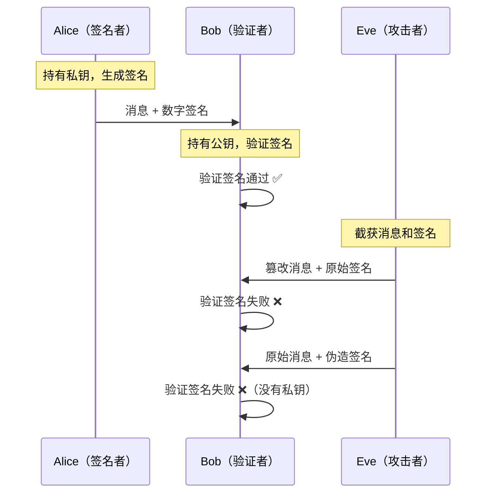
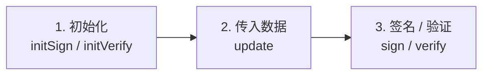
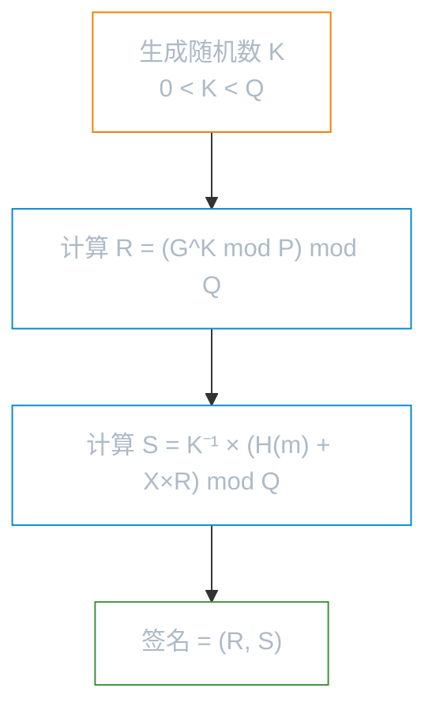

# 数字签名

**本文你会学到**：

- 为什么加密能保护机密性，但无法证明"这条消息确实是你发的"
- 数字签名如何像"手写签名"一样同时提供身份认证和不可否认性
- 签名安全强度的"木桶短板"原则——摘要算法和公钥算法如何互相制约
- DSA、ECDSA、EdDSA、RSA 签名、SM2 国密签名各自的原理和 Java API 用法
- 在实际项目中如何选择合适的签名算法

## 为什么需要数字签名？

你已经知道，对称加密解决了**机密性**问题，HMAC 解决了**完整性 + 认证**问题。但 HMAC 有一个根本限制——通信双方必须共享同一个密钥。如果你收到一条消息，HMAC 能告诉你"这条消息确实来自持有密钥的人"，但它无法帮你向第三方证明"这条消息来自 Alice 而不是 Bob"——因为 Alice 和 Bob 共享同一个密钥，谁都能生成有效的 HMAC。

更关键的问题是**不可否认性（non-repudiation）**：Alice 签了一份电子合同后声称"我没签过"，你怎么证明？HMAC 做不到——因为密钥是共享的，你无法排除 Bob 伪造的可能性。

💡 想象现实中的手写签名：你的笔迹别人难以模仿，所以签名可以作为身份证明。数字签名在密码学世界里扮演同样的角色——只有持有**私钥**的人才能生成签名，而任何人都可以用**公钥**验证签名的真实性。

数字签名提供三个核心保证：

- **身份认证（authentication）**：只有私钥持有者能生成有效签名
- **完整性（integrity）**：消息被篡改后签名验证会失败
- **不可否认性（non-repudiation）**：签名者无法否认自己签署过这条消息



数字签名分为两大类：

- **确定性签名（deterministic）**：同一私钥对同一消息，每次产生的签名完全相同（如 RSA PKCS#1 v1.5）
- **非确定性签名（non-deterministic）**：每次签名都会引入随机数，同一消息的签名每次不同（如 DSA、ECDSA）

## 签名安全强度

当你需要选择签名算法的密钥长度和摘要算法时，你会发现一个容易被忽视的问题：**签名的安全强度由多个组件共同决定**，其中最弱的那个组件决定了整体安全性。

💡 把签名想象成一个链条——摘要算法、公钥算法、密钥长度是链条上的每个环节。链条的强度取决于最薄弱的环节，而不是最强的那个。

NIST SP 800-57 定义了不同算法的安全强度：

### 摘要算法安全强度

| 摘要算法 | 安全强度（位） |
|---------|-------------|
| SHA-1 | ≤ 80 |
| SHA-224, SHA-512/224, SHA3-224 | 112 |
| SHA-256, SHA-512/256, SHA3-256 | 128 |
| SHA-384, SHA3-384 | 192 |
| SHA-512, SHA3-512 | 256 |

### 公钥算法安全强度

| 算法 | 密钥长度 | 安全强度（位） |
|-----|---------|-------------|
| DSA / RSA | 1024 | ≤ 80 |
| DSA / RSA | 2048 | 112 |
| DSA / RSA | 3072 | 128 |
| ECDSA | 160-223 | ≤ 80 |
| ECDSA | 224-255 | 112 |
| ECDSA | 256-383 | 128 |
| ECDSA | 384-511 | 192 |
| ECDSA | 512+ | 256 |

### 木桶短板原则

选择签名组件时，遵循一条通用规则：**摘要算法的安全强度应不低于公钥算法**。同样，如果签名方案涉及掩码生成函数（MGF），MGF 中使用的摘要强度也不应低于签名摘要的强度。

| 推荐组合 | 公钥算法 | 密钥长度 | 摘要算法 | 安全强度 |
|---------|---------|---------|---------|---------|
| 入门级 | RSA | 2048 | SHA-256 | 112 |
| 推荐级 | RSA | 3072 | SHA-256 | 128 |
| 推荐级 | ECDSA | P-256 | SHA-256 | 128 |
| 高安全 | ECDSA | P-384 | SHA-384 | 192 |
| 极高安全 | RSA | 15360 | SHA-512 | 256 |

> ⚠️ 不要用 SHA-1 生成新签名。虽然验证旧的 SHA-1 签名在大多数场景下仍然可行，但生成新的 SHA-1 签名已被 FIPS 禁止，存在安全隐患。

## Signature 类

JCA 中，签名操作统一由 `java.security.Signature` 类提供。和 JCA 的其他引擎类一样，`Signature` 对象通过 `getInstance()` 工厂方法创建，而不是直接构造。

### 算法命名规范

签名算法的标准命名格式为：

```
<摘要算法>with<公钥算法>
```

例如：

| 算法名称 | 含义 |
|---------|------|
| `SHA256withDSA` | DSA 签名 + SHA-256 摘要 |
| `SHA256withECDSA` | ECDSA 签名 + SHA-256 摘要 |
| `SHA256withRSA` | RSA PKCS#1 v1.5 签名 + SHA-256 摘要 |
| `SHA256withRSAandMGF1` | RSA-PSS 签名 + SHA-256 摘要 |
| `EdDSA` | EdDSA 签名（摘要算法由密钥类型决定） |
| `SM3withSM2` | SM2 签名 + SM3 摘要 |

### 标准使用模式

无论哪种签名算法，`Signature` 的使用都遵循三个步骤：



**签名生成**（私钥操作）：

``` java title="Signature 类签名流程"
// 1. 初始化——传入私钥
Signature signature = Signature.getInstance("SHA256withECDSA", "BC");
signature.initSign(privateKey);

// 2. 传入待签名的数据
signature.update(data);

// 3. 生成签名
byte[] signatureBytes = signature.sign();
```

**签名验证**（公钥操作）：

``` java title="Signature 类验证流程"
// 1. 初始化——传入公钥
Signature signature = Signature.getInstance("SHA256withECDSA", "BC");
signature.initVerify(publicKey);

// 2. 传入待验证的数据
signature.update(data);

// 3. 验证签名
boolean isValid = signature.verify(signatureBytes);
```

部分签名算法还需要调用 `setParameter()` 设置额外参数（如 RSA-PSS 的盐值长度、SM2 的用户 ID），这些将在对应章节中介绍。

## DSA（Digital Signature Algorithm）

DSA（Digital Signature Algorithm，数字签名算法）诞生于 1991 年，是 NIST 发布的第一个数字签名标准（FIPS PUB 186），至今仍是许多安全标准的基石。

### 离散对数问题

当你需要对一段数据"签名"时，你面临一个核心挑战：如何在公开公钥的前提下，让签名只与私钥相关？DSA 的答案来自**离散对数问题（Discrete Logarithm Problem，DLP）**。

💡 想象你有一个大质数 P，以及一个生成元 G。已知 Y = G^X mod P 和公钥 Y，要推导出私钥 X 在计算上是不可行的——这就是离散对数问题。DSA 的安全性正是建立在这个难题之上。

### DSA 参数：P、Q、G

DSA 密钥基于一组公开参数 (P, Q, G)：

- **P**：大质数，位长从 {1024, 2048, 3072} 中选择
- **Q**：P - 1 的质因数，位长从 {160, 224, 256} 中选择（取决于 P 的位长）
- **G**：GF(P) 乘法群中阶为 Q 的生成元，满足 1 < G < P

在 Java 中，这些参数通过 `java.security.spec.DSAParameterSpec` 携带。参数可以通过 `AlgorithmParameterGenerator` 生成，也可以在密钥生成时自动创建。

### 密钥生成

DSA 密钥对包含一个私钥 X 和公钥 Y：

- X：随机生成，满足 0 < X < Q
- Y = G^X mod P

``` java title="生成 2048 位 DSA 密钥对"
KeyPairGenerator keyPairGenerator = KeyPairGenerator.getInstance("DSA", "BC");
keyPairGenerator.initialize(2048); // 自动生成合适的 P/Q/G 参数
KeyPair keyPair = keyPairGenerator.generateKeyPair();
```

> 注意：生成 DSA 参数（P/Q/G）是一个较慢的操作。如果性能敏感，可以预先生成参数并复用。

### 签名流程

DSA 签名由两个整数 R 和 S 组成，计算步骤如下：

1. 生成随机数 K，满足 0 < K < Q
2. 计算 R = (G^K mod P) mod Q
3. 计算 S = K^(-1) * (H(m) + X*R) mod Q

其中 H(m) 是消息 m 的哈希值。



> ⚠️ **随机数 K 的安全性至关重要**：如果 K 被泄露或不够随机，攻击者可以直接推导出私钥 X。历史上著名的索尼 PS3 破解事件就是因为 K 值没有随机化。如果你无法确保良好的随机数生成器，应该使用确定性 DSA（RFC 6979）。

### Java 代码示例

``` java title="DSA 签名与验证"
// 完整示例见 DsaTest.java
KeyPairGenerator keyPairGenerator = KeyPairGenerator.getInstance("DSA", "BC");
keyPairGenerator.initialize(2048);
KeyPair keyPair = keyPairGenerator.generateKeyPair();

byte[] messageBytes = "DSA 签名测试消息".getBytes();

// 用私钥签名
Signature signature = Signature.getInstance("SHA256withDSA", "BC");
signature.initSign(keyPair.getPrivate());
signature.update(messageBytes);
byte[] signatureBytes = signature.sign();

// 用公钥验证
signature.initVerify(keyPair.getPublic());
signature.update(messageBytes);
boolean isValid = signature.verify(signatureBytes); // true
```

`signature.sign()` 返回的字节数组是 R 和 S 两个整数的 ASN.1 DER 编码（SEQUENCE 包含两个 INTEGER）。由于 ASN.1 INTEGER 是有符号的，签名长度可能有 1 字节的差异。

### 确定性 DSA（RFC 6979）

当 DSA 的随机数 K 不够安全或不可用时，RFC 6979 提供了一种确定性方案——从私钥和消息哈希中计算出 K，而非依赖随机数生成器。这样同一私钥对同一消息总是产生相同的签名，同时 K 的安全性等同于私钥。

在 Bouncy Castle 中，确定性 DSA 的算法名称为 `DDSA`（普通 DSA）和 `ECDDSA`（椭圆曲线 DSA）。注意：确定性签名可以由标准 DSA/ECDSA 验证器验证，无需特殊处理。

## ECDSA（Elliptic Curve DSA）

当你需要与 DSA 相同安全强度但更短的密钥时，你会发现在椭圆曲线上实现 DSA——即 ECDSA（Elliptic Curve DSA，椭圆曲线数字签名算法）——是一个更好的选择。

### 为什么用椭圆曲线？

传统 DSA 使用大整数域，2048 位密钥提供 112 位安全强度。ECDSA 使用椭圆曲线数学，256 位密钥就能达到 128 位安全强度——密钥更短，计算更快，签名更小。

💡 把传统 DSA 想象成在数论世界里做乘方运算（大数域），把 ECDSA 想象成在几何曲线上做"加法"运算（椭圆曲线域）。两者的安全基础都是"离散对数问题"，但椭圆曲线的离散对数问题更难解，因此可以用更短的密钥达到同等安全强度。

### 曲线命名

ECDSA 定义在两种有限域上：

- **GF(p)**：基于大质数的域，FIPS 曲线以 `P-` 开头（如 P-256、P-384）
- **GF(2^m)**：基于不可约多项式的域，以 `B-` 或 `K-`（Koblitz 曲线）开头

常用的曲线及其别名：

| FIPS 名称 | SEC 名称 | 密钥长度 | 安全强度 |
|----------|---------|---------|---------|
| P-256 | secp256r1 / prime256v1 | 256 位 | 128 位 |
| P-384 | secp384r1 | 384 位 | 192 位 |
| P-521 | secp521r1 | 521 位 | 256 位 |

### 密钥生成与签名

ECDSA 的密钥生成和签名流程与传统 DSA 类似，只是数学运算从大整数域换到了椭圆曲线域：

- 私钥 d：随机生成，满足 0 < d < N（N 是曲线基点 G 的阶）
- 公钥 Q = d × G（椭圆曲线点乘）

签名步骤：

1. 生成随机数 K，满足 0 < K < N
2. 计算 (x, y) = K × G
3. R = x mod N（如果 R == 0，重新生成 K）
4. S = K^(-1) × (H(m) + d × R) mod N

``` java title="ECDSA 签名与验证（secp256r1 曲线）"
// 完整示例见 DsaTest.java
KeyPairGenerator keyPairGenerator = KeyPairGenerator.getInstance("ECDSA", "BC");
keyPairGenerator.initialize(new ECGenParameterSpec("secp256r1"));
KeyPair keyPair = keyPairGenerator.generateKeyPair();

byte[] messageBytes = "ECDSA 签名测试消息".getBytes();

// 用私钥签名
Signature signature = Signature.getInstance("SHA256withECDSA", "BC");
signature.initSign(keyPair.getPrivate());
signature.update(messageBytes);
byte[] signatureBytes = signature.sign();

// 用公钥验证
signature.initVerify(keyPair.getPublic());
signature.update(messageBytes);
assertTrue(signature.verify(signatureBytes));

// ECDSA 每次签名都不同（因为随机数 K 不同）
Signature sig2 = Signature.getInstance("SHA256withECDSA", "BC");
sig2.initSign(keyPair.getPrivate());
sig2.update(messageBytes);
byte[] signatureBytes2 = sig2.sign();
// signatureBytes ≠ signatureBytes2
```

### DSA vs ECDSA 对比

| 特性 | DSA | ECDSA |
|-----|-----|-------|
| 数学基础 | 大整数离散对数问题 | 椭圆曲线离散对数问题 |
| 128 位安全所需密钥长度 | 3072 位 | 256 位 |
| 签名大小 | ~56 字节（DER 编码） | ~72 字节（DER 编码） |
| 签名确定性 | 非确定性（随机 K） | 非确定性（随机 K） |
| 确定性变体 | DDSA（RFC 6979） | ECDDSA（RFC 6979） |
| 参数生成速度 | 慢（大质数搜索） | 快（使用预定义曲线） |
| 算法名称 | `SHA256withDSA` | `SHA256withECDSA` |

## EdDSA（Edwards Curve DSA）

当你需要一种**天然确定性**且**抗侧信道攻击**的签名方案时，传统 DSA/ECDSA 的随机数依赖就成了一个负担。EdDSA（Edwards Curve Digital Signature Algorithm）通过巧妙的数学设计彻底消除了这个问题。

### 什么是 Edwards 曲线？

Edwards 曲线是椭圆曲线的一种特殊形式，具有数学上更"整齐"的运算性质。EdDSA 使用的具体曲线有两种：

| 曲线 | 安全强度 | 内置摘要 | 签名长度 |
|-----|---------|---------|---------|
| Ed25519 | ~128 位 | SHA-512 | 64 字节（R: 32 + S: 32） |
| Ed448 | ~224 位 | SHAKE-256 | 114 字节（R: 57 + S: 57） |

### EdDSA 的三大优势

1. **确定性签名**：不依赖随机数生成器，同一私钥对同一消息总是产生相同签名。K 值从私钥和消息中确定性推导
2. **抗侧信道攻击**：Edwards 曲线的运算设计天然抵抗时序攻击和功耗分析攻击
3. **签名恒定长度**：Ed25519 签名固定 64 字节，Ed448 固定 114 字节，不会像 DSA 那样因 ASN.1 编码出现 1 字节的差异

### Java 代码示例

EdDSA 的使用非常简洁——算法名称统一为 `EdDSA`，具体使用哪条曲线由密钥类型决定：

``` java title="Ed25519 签名与验证"
// 完整示例见 DsaTest.java
KeyPairGenerator keyPairGenerator = KeyPairGenerator.getInstance("Ed25519", "BC");
KeyPair keyPair = keyPairGenerator.generateKeyPair();

byte[] messageBytes = "Ed25519 签名测试消息".getBytes();

// 用私钥签名（EdDSA 内置 SHA-512 哈希，无需指定摘要算法）
Signature signature = Signature.getInstance("EdDSA", "BC");
signature.initSign(keyPair.getPrivate());
signature.update(messageBytes);
byte[] signatureBytes = signature.sign(); // 固定 64 字节

// 用公钥验证
signature.initVerify(keyPair.getPublic());
signature.update(messageBytes);
assertTrue(signature.verify(signatureBytes));

// 确定性：同一消息 + 同一私钥 = 同一签名
Signature sig2 = Signature.getInstance("EdDSA", "BC");
sig2.initSign(keyPair.getPrivate());
sig2.update(messageBytes);
byte[] signatureBytes2 = sig2.sign();
// signatureBytes == signatureBytes2 ✅
```

如果需要锁定到特定曲线，也可以直接使用 `Ed25519` 或 `Ed448` 作为算法名称。

> ⚠️ Ed25519 有多种变体（纯 Ed25519、带 context 的 Ed25519ctx、带预哈希的 Ed25519ph），不同变体的签名不能交叉验证。在 Java 中使用 Bouncy Castle 时，`EdDSA` 算法名称默认使用纯 Ed25519。

## RSA 签名

当你需要一种被几乎所有系统广泛支持的签名算法时，RSA 几乎是默认选择。自 1977 年发表以来，RSA 一直是公钥密码学的"主力军"。

### RSA 签名原理

RSA 密钥对由模数 N（两个大质数 P 和 Q 的乘积）、公钥指数 E 和私钥指数 D 组成，满足 E × D ≡ 1 mod ((P-1)(Q-1))。

RSA 签名的基本运算非常简洁：

- **签名**：S = PAD(H(m))^D mod N
- **验证**：PAD(H(m)) == S^E mod N

其中 PAD() 是填充函数，H(m) 是消息摘要。签名和验证互为逆运算——签名用私钥做指数运算，验证用公钥做指数运算。

> 💡 这个"签名 = 私钥加密"的直觉虽然简化了，但在调试时很有用：用公钥"解密"签名值可以恢复填充后的哈希，帮你排查签名失败的原因。

### PKCS#1 v1.5 签名

PKCS#1 v1.5 是最经典的 RSA 签名方案（RFC 8017），使用 type 1 填充：

```
PAD(h) = 0x00 || 0x01 || 0xFF...0xFF || 0x00 || DigestInfo(h)
```

其中 DigestInfo 包含摘要算法的 OID 和摘要值的 DER 编码。由于填充中不包含随机部分，PKCS#1 v1.5 是**确定性**的——同一密钥对同一消息总是产生相同的签名。

``` java title="RSA PKCS#1 v1.5 签名与验证"
// 完整示例见 RsaSignatureTest.java
KeyPairGenerator keyPairGenerator = KeyPairGenerator.getInstance("RSA", "BC");
keyPairGenerator.initialize(2048);
KeyPair keyPair = keyPairGenerator.generateKeyPair();

byte[] messageBytes = "RSA PKCS#1 v1.5 签名测试消息".getBytes();

// 用私钥签名
Signature signature = Signature.getInstance("SHA256withRSA", "BC");
signature.initSign(keyPair.getPrivate());
signature.update(messageBytes);
byte[] signatureBytes = signature.sign(); // 固定 256 字节（2048 / 8）

// 用公钥验证
signature.initVerify(keyPair.getPublic());
signature.update(messageBytes);
assertTrue(signature.verify(signatureBytes));
```

RSA 签名长度等于密钥长度（字节数）：2048 位密钥产生 256 字节签名，4096 位密钥产生 512 字节签名。

### RSA-PSS 签名

虽然 PKCS#1 v1.5 至今未被实际攻破，但密码学界更推荐使用 **RSA-PSS（Probabilistic Signature Scheme，概率签名方案）**。PSS 通过引入随机盐值（salt）使签名具有随机性，并且在理论上被证明是安全的。

PSS 的填充过程比 PKCS#1 v1.5 复杂得多，核心思路是使用掩码生成函数 MGF（Mask Generation Function）对填充数据进行随机化处理。

``` java title="RSA-PSS 签名与验证（自定义 PSS 参数）"
// 完整示例见 RsaSignatureTest.java
KeyPairGenerator keyPairGenerator = KeyPairGenerator.getInstance("RSA", "BC");
keyPairGenerator.initialize(2048);
KeyPair keyPair = keyPairGenerator.generateKeyPair();

byte[] messageBytes = "RSA-PSS 签名测试消息".getBytes();

// 配置 PSS 参数
PSSParameterSpec pssSpec = new PSSParameterSpec(
    "SHA-256",                       // 消息摘要算法
    "MGF1",                           // 掩码生成函数
    new MGF1ParameterSpec("SHA-256"), // MGF 使用的摘要算法
    32,                               // 盐值长度（字节）
    1                                 // Trailer Field（固定为 1）
);

// 用私钥签名
Signature signature = Signature.getInstance("SHA256withRSAandMGF1", "BC");
signature.setParameter(pssSpec);
signature.initSign(keyPair.getPrivate());
signature.update(messageBytes);
byte[] signatureBytes = signature.sign();

// 用公钥验证（必须使用相同的 PSS 参数！）
signature.setParameter(pssSpec);
signature.initVerify(keyPair.getPublic());
signature.update(messageBytes);
assertTrue(signature.verify(signatureBytes));
```

> ⚠️ **RSA-PSS 验证的两个常见陷阱**：
> 1. **盐值长度不匹配**：盐值长度不编码在签名中，验证时必须指定与签名时相同的盐值长度
> 2. **MGF 摘要不一致**：MGF 使用的摘要算法应与消息摘要相同，确保安全强度一致

### PKCS#1 v1.5 vs PSS 对比

| 特性 | PKCS#1 v1.5 | RSA-PSS |
|-----|------------|---------|
| 确定性 | 是（同一签名） | 否（随机盐值，除非盐值长度为 0） |
| 安全性证明 | 无理论证明 | 有可证明安全性 |
| 兼容性 | 极广泛（几乎所有系统） | 较新系统支持 |
| 算法名称 | `SHA256withRSA` | `SHA256withRSAandMGF1` |
| 参数配置 | 无需额外参数 | 需要 `PSSParameterSpec` |
| 推荐程度 | 兼容场景可用 | 新项目优先选择 |

## SM2 国密签名

当你的项目需要满足中国政府的合规要求时（如电子签章、政务系统、金融领域），SM2 是必须了解的签名算法。SM2 由中国国家密码管理局发布，基于 256 位椭圆曲线 `sm2p256v1`，搭配 SM3 摘要算法。

### SM2 的独特之处

SM2 与其他 EC 签名算法最大的区别在于**消息预处理**：在签名之前，SM2 会先计算一个"用户身份前缀" ZA，并将其与原始消息拼接。ZA 的计算涉及：

- 用户 ID（默认为 `"1234567812345678"` 的 ASCII 编码）
- 曲线参数 A、B
- 基点 G 的坐标
- 签名者公钥 Q 的坐标

```
ZA = H(ID长度 || ID || A || B || xG || yG || xQ || yQ)
m' = ZA || m
```

> 💡 这个预处理步骤相当于给每个签名者打上"身份烙印"，使得不同用户的签名即使使用相同曲线也无法混淆。

### SM2ParameterSpec

Bouncy Castle 通过 `SM2ParameterSpec` 允许你显式指定用户 ID。如果不设置，则使用默认 ID `"1234567812345678"`。签名和验证双方必须使用相同的 ID，否则验证会失败。

### Java 代码示例

``` java title="SM2 签名与验证"
// 完整示例见 Sm2SignatureTest.java
byte[] DEFAULT_ID = "1234567812345678".getBytes();

// 生成 SM2 密钥对（使用 sm2p256v1 曲线）
KeyPairGenerator keyPairGenerator = KeyPairGenerator.getInstance("EC", "BC");
ECNamedCurveParameterSpec sm2CurveSpec =
    ECNamedCurveTable.getParameterSpec("sm2p256v1");
keyPairGenerator.initialize(sm2CurveSpec, new SecureRandom());
KeyPair keyPair = keyPairGenerator.generateKeyPair();

byte[] messageBytes = "SM2 国密签名测试消息".getBytes();

// 用私钥签名（设置用户 ID）
Signature signature = Signature.getInstance("SM3withSM2", "BC");
signature.setParameter(new SM2ParameterSpec(DEFAULT_ID));
signature.initSign(keyPair.getPrivate());
signature.update(messageBytes);
byte[] signatureBytes = signature.sign(); // 约 70-72 字节

// 用公钥验证（必须使用相同的用户 ID）
signature.setParameter(new SM2ParameterSpec(DEFAULT_ID));
signature.initVerify(keyPair.getPublic());
signature.update(messageBytes);
assertTrue(signature.verify(signatureBytes));

// 篡改消息后验证失败
signature.setParameter(new SM2ParameterSpec(DEFAULT_ID));
signature.initVerify(keyPair.getPublic());
signature.update("被篡改的消息".getBytes());
assertFalse(signature.verify(signatureBytes));
```

SM2 签名由 (r, s) 两个 32 字节整数组成，DER 编码后通常为 70-72 字节。

## 算法选择建议

当你面对一个需要数字签名的项目时，如何选择算法？以下对比表格覆盖了主要的决策维度：

### 算法全面对比

| 维度 | DSA | ECDSA | EdDSA | RSA PKCS#1 v1.5 | RSA-PSS | SM2 |
|-----|-----|-------|-------|----------------|---------|-----|
| **数学基础** | 离散对数 | 椭圆曲线离散对数 | Edwards 曲线 | 大整数分解 | 大整数分解 | 椭圆曲线离散对数 |
| **128 位安全密钥长度** | 3072 位 | 256 位 | 255 位 | 3072 位 | 3072 位 | 256 位 |
| **签名大小** | ~56 字节 | ~72 字节 | 64 字节 | 256 字节 | 256 字节 | ~72 字节 |
| **确定性** | 否（可用 DDSA） | 否（可用 ECDDSA） | 是 | 是 | 否 | 否 |
| **侧信道抗性** | 一般 | 一般 | 优秀 | 一般 | 一般 | 一般 |
| **兼容性** | 一般 | 广泛 | 较新 | 极广泛 | 较广泛 | 中国标准 |
| **算法名称** | `SHA256withDSA` | `SHA256withECDSA` | `EdDSA` | `SHA256withRSA` | `SHA256withRSAandMGF1` | `SM3withSM2` |
| **额外参数** | 无 | 无 | 无 | 无 | `PSSParameterSpec` | `SM2ParameterSpec` |

### 选择建议

- **通用互联网服务（TLS、JWT、代码签名）**：优先 **ECDSA P-256**（性能好、签名小、兼容性强）或 **Ed25519**（确定性、性能优秀）
- **需要广泛兼容性（PDF 签名、XML 签名、旧系统集成）**：**RSA PKCS#1 v1.5**（2048 位以上）
- **追求理论安全性**：**RSA-PSS**（有可证明安全性的证明）
- **中国合规场景（政务、金融、电子签章）**：**SM2**（国密标准强制要求）
- **嵌入式/物联网设备**：**Ed25519**（小密钥、小签名、确定性、无随机数依赖）
- **避免使用**：DSA 3072（密钥太大、性能不如 ECDSA）、SHA-1 签名

> 💡 如果没有特殊限制，**Ed25519 是当前最推荐的新项目选择**——确定性签名消除了随机数安全隐患，签名紧凑（64 字节），性能优秀，且被越来越多的协议和框架支持。
