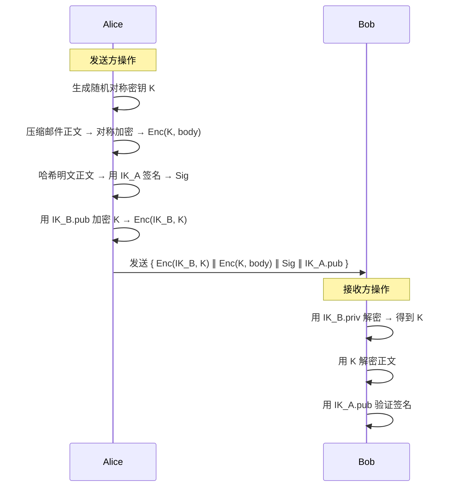
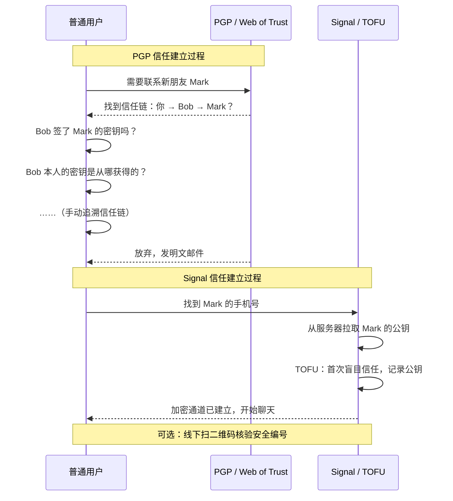
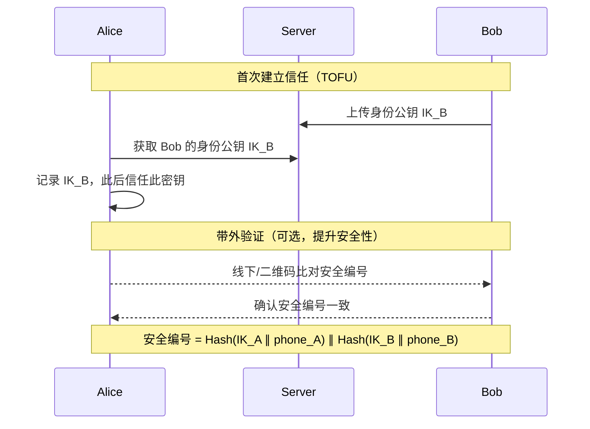
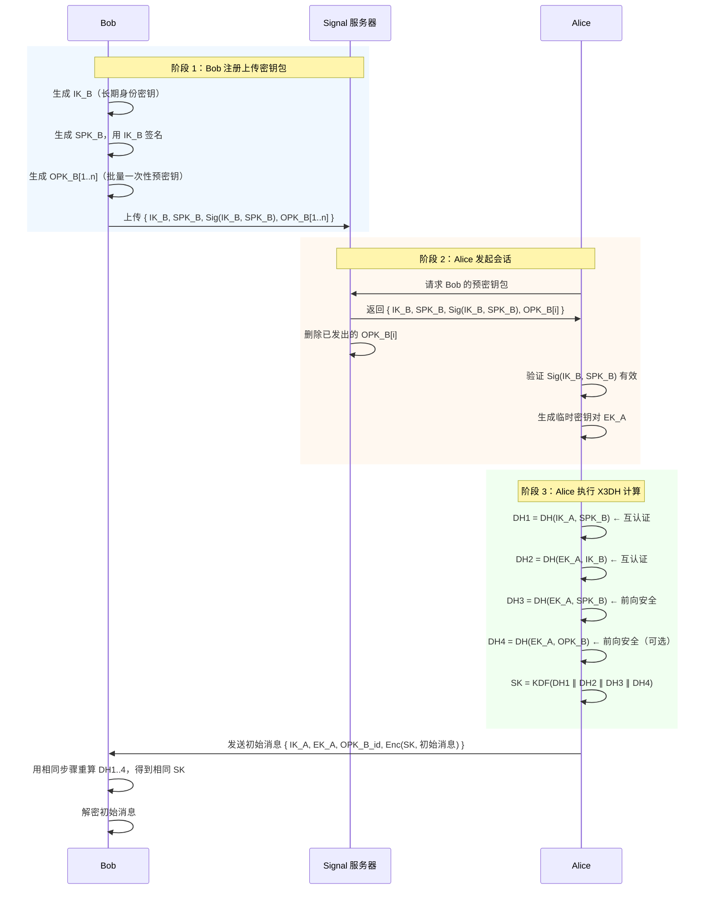
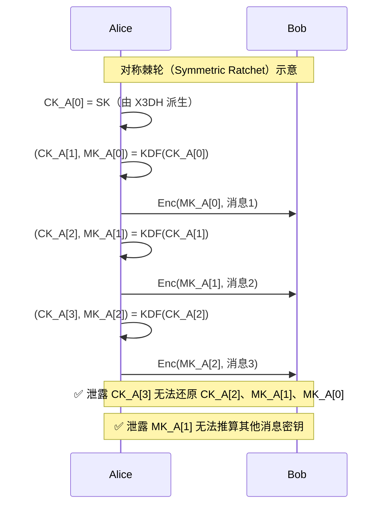
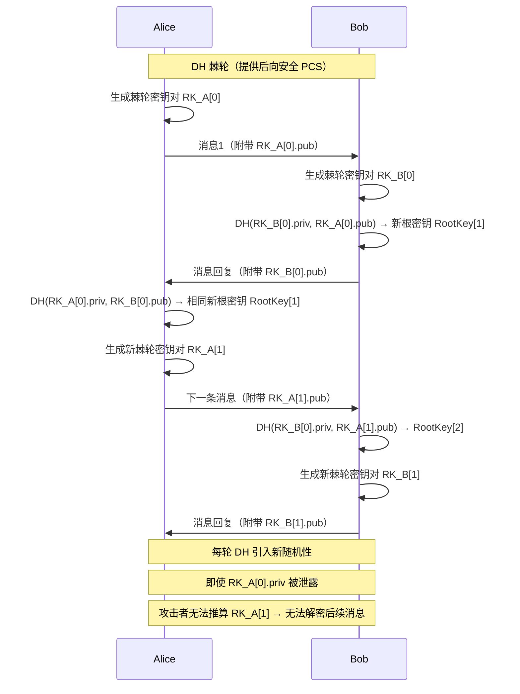

# 端到端加密

> 🔒 TLS 已经加密了，为什么还需要端到端加密（E2EE）？这个问题是理解端到端加密的起点。

**本文你会学到**：

- 为什么 TLS 本质上是「服务器即中间人」，无法实现真正的端到端安全
- 信任根问题——公钥体系的「鸡生蛋」困境
- PGP 加密邮件为何在三十年里彻底失败
- Signal 协议如何用 `X3DH` + `Double Ratchet` 同时实现前向安全与后向安全
- 端到端加密的现状与选型建议

---

## 🤔 为什么 TLS 不够：服务器是「中间人」

你每天使用 HTTPS，浏览器的小锁图标让你感到安心。但 TLS 的安全边界只到**服务器为止**——消息从你的手机到达服务器时已经解密，服务器可以看到一切。

这并非 TLS 的缺陷，而是它的**设计目标**：保护客户端与服务器之间的链路，而不是端与端之间。现实的拓扑更复杂：消息经过多个网络跳点，某些「中间盒（middlebox）」会主动终止 TLS 连接，在明文下检查流量后再重新建立加密隧道。这种行为有时出于合理目的（流量过滤、负载均衡），有时则纯粹是监控。

### 现实世界的例子

2015 年，联想（Lenovo）被发现预装了自定义 CA 证书和软件，该软件对 HTTPS 连接执行中间人劫持，注入广告。更大范围的案例出现在 2013 年：斯诺登披露了 NSA 通过在互联网骨干电缆上截取流量来大规模监听通信的事实。

拥有用户数据也是公司的负担：数据泄露事故频发，GDPR 罚款动辄数亿欧元，NSL（国家安全信函）强制要求企业交出用户数据且不得声张。

**端到端加密的价值主张**：即便服务器被攻陷、被政府要求配合，消息对服务器而言从一开始就是密文，无从交出。

---

## 🤝 信任根的两难

回到最基本的场景：Alice 想给 Bob 发一封加密邮件。流程看起来很简单：

1. Bob 把公钥发给 Alice
2. Alice 用 Bob 的公钥加密邮件发给 Bob

但这里藏着一个**鸡生蛋**的问题：Alice 怎么知道她收到的公钥真的是 Bob 的，而不是某个中间人替换过的？

> 保护公钥不被篡改，是实际公钥应用中最难的单一问题。它是公钥密码学的「阿喀琉斯之踵」。
>
> ——Zimmermann 等，《PGP User's Guide》，1992

### 🏛️ 集中式 PKI 的局限

Web PKI（参见「`「TLS」`」）通过证书颁发机构（CA）解决这个问题：你信任浏览器预装的一批 CA，CA 为网站公钥背书。但这个信任链本身要依赖操作系统、浏览器厂商、硬件制造商……最终是「一路向下的乌龟」（turtles all the way down）。某一环出问题，整条链就会断。

集中式 PKI 在「公司为员工签发证书」的场景下运转良好，但对于跨组织的个人通信，它并不现实——你不可能要求朋友去申请一张个人邮件证书。

### 🕸️ 去中心化的代价

另一极端是完全去中心化：用户自己互相为公钥背书，构建信任网络。PGP 的 Web of Trust（WOT）正是这个思路——但三十年的实践证明，去中心化信任在现实社交场景中根本无法规模化。

密码学能提供**不同场景下的不同解法**，但没有万能答案。所有系统最终都需要某个「信任锚点（root of trust）」——一个协议可以依赖的起点，不论它是带外（out-of-band）交换的公钥，还是预装在设备里的 CA 证书。

---

## 💥 PGP 加密邮件为什么失败了

📧 PGP（Pretty Good Privacy）在 1991 年由 Phil Zimmermann 发布，初衷是对抗美国政府试图立法强制要求企业提供通信后门的法案。1998 年，它被标准化为 OpenPGP（RFC 2440）；主流实现是开源的 GPG（GNU Privacy Guard）。三十年过去，PGP 几乎被所有人遗弃——为什么？

### PGP 工作原理回顾

PGP 使用混合加密（参见「`「密钥交换」`」）：

1. 发件人生成一次性对称密钥，先**压缩**再加密邮件正文（注意：先压缩后加密，因为加密后数据随机性极高，无法有效压缩）
2. 用每个收件人的**公钥**分别加密该对称密钥
3. 将所有加密版本的对称密钥与密文拼接，替换邮件正文
4. 签名流程：对明文正文哈希后用发件人私钥签名，签名与发件人公钥一并附在邮件中

以下时序图展示了 PGP 的加密与签名流程：



⚠️ 注意：邮件**主题行和所有邮件头均未加密**，收发双方的通信元数据完全暴露。

表面上看合理，但细节里藏满了地雷：

- ❌ **使用过时算法**：OpenPGP 标准因向后兼容而无法抛弃老旧算法
- ❌ **加密未认证**：未签名的邮件可被中间人篡改密文
- ❌ **签名顺序错误**：对明文签名后加密，导致 Bob 可以把 Alice 发给他的邮件「转发」给 Charles，而 Charles 会误以为自己是预期收件人（签名仍然有效）；若对密文签名，攻击者可以移除签名并换上自己的
- ❌ **默认无前向安全**：私钥泄露后，所有历史邮件均可被解密

### Web of Trust 的天真假设

🤝 PGP 的信任模型基于「用户互相为对方的公钥签名」——你信任 Bob，Bob 信任 Mark，所以你可以传递信任并接受 Mark 的公钥。这在学术上很优雅，现实中却行不通：

- 普通用户根本不会参加「密钥签名派对（key-signing party）」
- 现实社交关系和密码学信任链之间的鸿沟太大
- WOT 严重依赖线下见面，无法在全球互联网规模下运转

### 密钥发现的实际困境

PGP 尝试用**公钥服务器（key server）**解决密钥发现问题，任何人都可以发布声称属于某邮件地址的公钥——包括攻击者。这导致了密钥欺骗（key spoofing）事件，用户收到的可能是冒充者的公钥。

另一方案 S/MIME（参见「`「CMS 与 S/MIME」`」）引入 PKI 来解决这个问题，但只在公司内网场景（IT 统一管理证书）中有实际意义，对个人用户几乎无用武之地。

2019 年的研究「Efail」还发现，大多数邮件客户端对 PGP/S/MIME 的实现存在漏洞：攻击者可以通过向收件人发送篡改后的密文邮件，让邮件客户端帮助泄露解密结果。

### 易用性灾难

```
在 1990 年代，我对未来充满期待，梦想每个人都会安装 GPG。
现在我仍然充满期待，但我梦想的是能把它卸载掉。
——Moxie Marlinspike（Signal 创始人），《GPG and Me》，2015
```

```
如果消息可以明文发送，它就会以明文发送。
电子邮件在设计上根本就不是为加密而生的。
——Thomas Ptacek，《Stop Using Encrypted Email》，2020
```

2015 年，安全研究员 Filippo Valsorda 公开宣布退役自己的 PGP 密钥，指出 PGP 的密钥管理太复杂、太容易出错，普通用户无法安全使用。2019 年，Go 语言将 PGP 从标准库中移除。

**结论**：加密邮件是一个尚未解决的问题，而邮件协议本身（SMTP）就不是为加密设计的——主题行、邮件头均无法加密，这是协议层的根本缺陷。

---

## 📱 Signal 协议：现代端到端加密的范本

🚀 2004 年出现了 OTR（Off-The-Record），2010 年 Signal 协议（彼时叫 TextSecure）发布。Signal 大胆选择了中心化架构（有中央服务器），但换来了卓越的用户体验。更重要的是，它开放了协议标准——WhatsApp、Facebook Messenger、Skype 等均已采用。

Signal 协议解决了 PGP 的四大痛点：

| 问题 | PGP | Signal |
|------|-----|--------|
| 信任建立 | Web of Trust（极难推广） | TOFU + 带外验证 |
| 会话前向安全 | 无（默认） | ✅ X3DH 握手 |
| 消息级前向安全 | 无 | ✅ 对称棘轮 |
| 后向安全（后妥协安全） | 无 | ✅ DH 棘轮 |

### PGP vs Signal：信任模型对比

两种协议在信任建立方式上的根本差异，决定了它们截然不同的命运：



PGP 的信任链必须由用户**主动维护**，每个人都要扮演半个系统管理员的角色。Signal 将这个负担转移到协议层，用 TOFU + 服务器托管密钥包实现了「开箱即用的端到端加密」。


Signal 采用 `TOFU`（Trust on First Use，首次使用信任）：第一次建立连接时盲目信任对方公钥，此后**拒绝接受不一致的公钥**。

这不是最理想的安全模型，但它在「大规模推广 E2EE」这个实际约束下是最可行的。类比：SSH 第一次连接服务器时，你选择信任显示的指纹，之后若指纹改变则拒绝连接。



Signal 将安全编号称为「Safety Numbers」，本质是双方身份密钥（Identity Key）的哈希拼接。用户可通过 QR 码带外核验，捕获潜在的 MITM 攻击。

### X3DH 握手：异步密钥协商

`X3DH`（Extended Triple Diffie-Hellman，扩展三重 DH）解决了一个关键问题：**Bob 离线时，Alice 也能安全地发起会话**。

传统的前向安全依赖双方实时在线，各自生成临时 DH 密钥对（参见「`「密钥交换」`」）。X3DH 通过预先上传密钥包（prekey bundle）绕过了这个限制。

**三类密钥**：

- `IK`（Identity Key）：长期身份密钥，代表用户本身
- `SPK`（Signed PreKey）：中期签名预密钥，定期轮换（如每周），由身份密钥签名
- `OPK`（One-time PreKey）：一次性预密钥，用后即删，用于增强前向安全



**各 DH 的作用**：

- `DH1`（IK_A × SPK_B）+ `DH2`（EK_A × IK_B）：提供**双向认证**（双方身份密钥均参与）
- `DH3`（EK_A × SPK_B）+ `DH4`（EK_A × OPK_B）：提供**前向安全**（临时密钥用后即弃）

最终会话密钥 `SK` 由所有 DH 输出拼接后经 KDF 派生，同时具备认证和前向安全两个属性。

### Double Ratchet：前向 + 后向安全

X3DH 建立了初始会话密钥，但对话可能持续数年。如果在某个时间点密钥被窃取，会泄露多少历史消息？`Double Ratchet`（双棘轮算法）回答了这个问题。

**对称棘轮（Symmetric Ratchet）——提供前向安全**：

每发送一条消息，链密钥（Chain Key）都经过单向 KDF 推进，派生出下一个链密钥和当前消息密钥（Message Key）。旧的链密钥被丢弃，无法从新状态反推。这就像一个单向的棘轮——只能向前转，不能后退。



理论上，即使攻击者拿到了某条消息的 `MK_A[1]`，他也无法解密其他消息，更无法还原出链密钥。实际上，如果攻击者拿到了整台手机，所有历史消息都已明文存储在本地——Signal 的「阅后即焚（disappearing messages）」功能正是为了弥补这一实际弱点。

**DH 棘轮（DH Ratchet）——提供后向安全（PCS）**：

`PCS`（Post-Compromise Security，后妥协安全）意味着即便某时刻密钥被窃，系统可以自愈——前提是攻击者随后**没有持续访问设备**。自愈的关键在于引入攻击者**无法事先获取的新随机性**。

Signal 的解法：每条消息都附带当前的棘轮公钥（Ratchet Key）。当对方收到新的棘轮公钥时，执行一次新的 DH 交换，生成攻击者未知的新共享秘密，再将其输入 KDF 更新根密钥。这个「乒乓」式的密钥刷新过程就是 DH 棘轮：



Double Ratchet 规范将这种行为描述为「乒乓」：双方轮流替换棘轮密钥对。短暂妥协某一方私钥的攻击者，最终会发现该私钥被替换为未妥协的新密钥。此后 DH 输出对攻击者完全不可知，协议从妥协中恢复。

**Double Ratchet = DH 棘轮 + 对称棘轮**，同时保证：

- ✅ **前向安全**（Forward Secrecy）：过去的消息密钥不可恢复
- ✅ **后向安全**（Post-Compromise Security）：密钥泄露后协议能自愈

### 安全编号与设备验证

Signal 将双方身份密钥的哈希截断后显示为一串数字（Safety Numbers）。用户可以通过扫描 QR 码带外比对，确认没有遭受 MITM 攻击。这是对 TOFU 的有效补充——绝大多数用户不会主动验证，但高风险用户（记者、活动人士）可以且应该验证。

---

## 🌐 端到端加密的现状

📱 今天，绝大多数端到端加密通信通过即时消息应用实现，而非加密邮件。

### 主流应用简评

| 应用 | 协议 | 开放性 | 备注 |
|------|------|--------|------|
| **Signal** | Signal 协议 | 开源、中心化 | 标杆实现，服务器仅见密文 |
| **WhatsApp** | Signal 协议变体 | 闭源、中心化 | 服务器知晓群组成员；元数据不保护 |
| **iMessage** | 苹果私有协议 | 闭源、中心化 | 非 Apple 设备降级为明文 SMS |
| **Matrix / Element** | Matrix 协议（OMEMO） | 开源、去中心化 | 联邦式，可自建服务器；法国政府采用 |
| **Telegram** | MTProto（非默认 E2EE） | 部分开源 | 普通聊天**不加密**，仅「私密对话」启用 |

### 尚待解决的挑战

**群组消息**：Signal 采用「客户端扇出（client-side fanout）」——客户端为每个成员分别加密发送，服务器无法区分群组成员，但消息数量会暴露社交图谱。WhatsApp 采用「服务器端扇出（server-side fanout）」，服务器知晓群组成员但转发效率更高。Messaging Layer Security（MLS）标准正在尝试规范大规模群组加密，但仍在发展中。

**多设备支持**：TOFU 模型在多设备场景下变得复杂——你需要为每台设备维护独立的身份密钥，并要求所有联系人验证每台设备的指纹。Matrix 的解法是让用户为自己的设备签名，其他人只需信任该用户，自动信任其所有已签名设备。

**超越 TOFU**：Key Transparency（谷歌提出，类似证书透明度）尝试通过公开可审计的密钥日志，让任何人都能检测服务器是否对某个用户实施了 MITM 攻击。

---

## 💡 选型与实施建议

⚙️ 如果你正在为产品选择端到端加密方案：

**优先考虑现有成熟方案，不要自造轮子**：

- **即时消息**：接入 Signal 协议库（libsignal），或直接使用 Matrix/Element 作为可嵌入的 E2EE 基础设施
- **文件/消息加密**（替代 PGP 场景）：考虑 [saltpack](https://saltpack.org/)，它修复了 PGP 的主要密码学缺陷，并通过社交网络（Keybase/keys.pub）解决密钥发现问题
- **内部企业邮件**：S/MIME 配合 PKI 仍是可行方案，但要确保使用现代算法（参见「`「CMS 与 S/MIME」`」）

**实施清单**：

- 使用经过审计的库，不要手动组合原语
- 设计密钥轮换策略（`SPK` 至少每周轮换）
- 元数据保护同样重要：加密消息内容后，通信双方、消息时间、消息大小仍可能泄露信息
- 认真考虑多设备场景的密钥管理
- 提供带外验证机制（安全编号 / QR 码），即便绝大多数用户不会用，高风险用户需要这个逃生舱口

---

> 本节内容参考自《Real-World Cryptography》(David Wong, Manning 2021) 第 10 章
