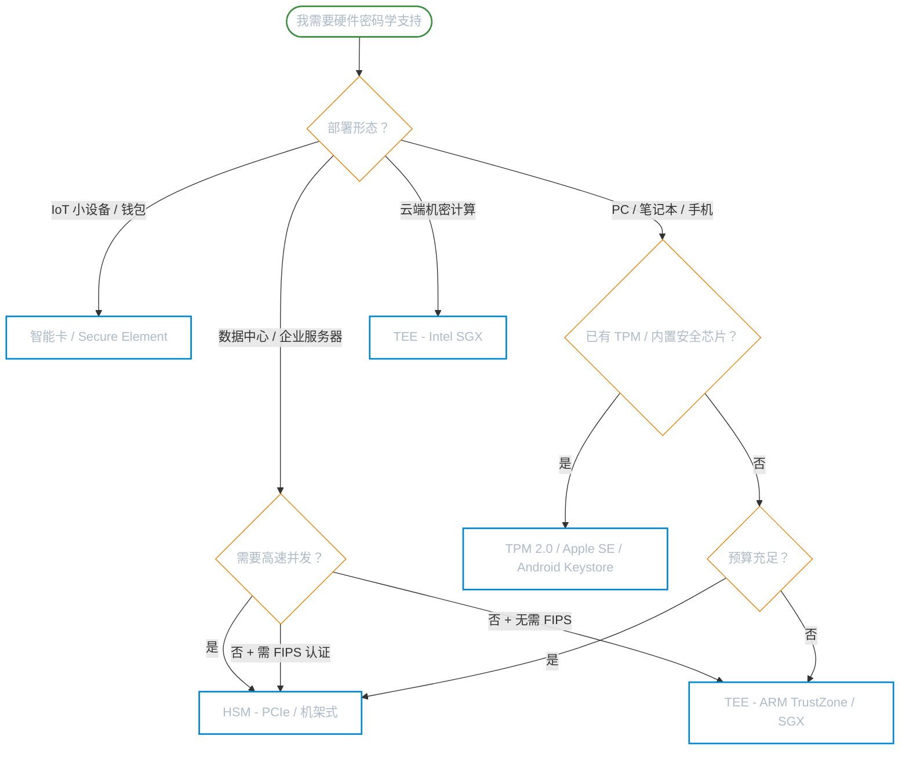

# 硬件密码学

**本文你会学到**：

- 为什么传统密码学的攻击者模型在现代已经不够用
- 智能卡、`SE`（Secure Element）、`HSM`、`TPM`、`TEE` 各自解决什么问题
- 白盒密码学为何是一个馊主意
- 如何根据场景在多种硬件方案中做选型决策
- 软件层面如何对抗侧信道攻击：常时间编程、掩码与致盲、故障攻击防御
- Java 中如何通过 `PKCS#11`、`SunPKCS11 Provider`、Android Keystore 对接硬件

---

## 🔓 当攻击者已经在你的机器里：现代攻击者模型

经典的密码学教材喜欢描述这样的场景：Alice 和 Bob 通过不安全的信道通信，Eve 在中间窃听。这里有一个隐含假设——**Alice 的机器是安全的**，只有网络是危险的。

但真实世界不是这样。

攻击者拿到了你服务器的 `root` 权限。密钥还安全吗？

想象几个现实场景：

- 🏧 ATM 机被人装了「撇卡器（skimmer）」——银行卡的数据在读卡时就被悄悄复制走了
- 📱 手机安装了一个看起来正常的 App，它悄悄读取了密钥区
- ☁️ 云服务器和另一家恶意租户共享同一块物理机器
- 🏢 数据中心被某国特工悄悄访问，目标是你的硬件

这些场景有一个共同点：**攻击者不再只是"在网络上监听"，而是已经在你的执行环境里了**。这个模型叫做「不可信执行环境（untrusted execution environment）」。

传统密码学假设只有密文走过危险的信道，而现代真实世界的密码学必须面对「连运行密码学代码的机器本身都不可信」的情况。

> ⚠️ 安全永远是假设的产物。如果你的假设是错的，你就麻烦了。

应对策略不是找到一个完美的解法，而是**让攻击者的代价足够高**——这就是「纵深防御（defense in depth）」的核心思想。

---

## 🔩 硬件如何救场：四种隔离方案

对付「不可信环境」，一个核心思路是：**把最敏感的操作放到一个专门的、物理隔离的小盒子里**。软件攻击打不进去，就算主机被黑，密钥也还在那个小盒子里。

硬件攻击分三类：

- **非侵入式（Non-invasive）**：不破坏设备，通过功耗分析（`DPA`）、电磁辐射等旁路观测秘密
- **半侵入式（Semi-invasive）**：访问芯片表面，用激光、热源引发故障（`DFA`）
- **侵入式（Invasive）**：打开芯片，用聚焦离子束（`FIB`）显微镜直接探测电路

这三类攻击难度依次递增，成本也依次变高。好的硬件方案就是把攻击成本抬到让攻击者得不偿失的水平。

### 🃏 智能卡与 Secure Element：你钱包里的那一块芯片

⏱️ 智能卡（Smart Card）是 1970 年代随微电子技术诞生的产物。一张现代智能卡内嵌了：

- 自己的 `CPU`
- `ROM`、`RAM`、`EEPROM` 多种存储器
- 硬件随机数生成器（`TRNG`）
- 输入输出接口（接触式 + `NFC` 非接触式）

把它叫「智能」卡，是因为它能**运行程序**，而不仅仅存数据（像只读磁条那样）。最流行的标准是 `JavaCard`——开发者可以用类 Java 语言写小应用跑在卡上。

💳 你的银行卡就是一张智能卡。有意思的是，银行业至今还在用对称密码（`3DES`）而非公钥密码——因为历史遗留系统太庞大，无法快速迁移。

**Secure Element（`SE`，安全元件）**是智能卡概念的泛化：一个防篡改微控制器，可以以多种形式出现——

- 可插拔型：`SIM` 卡、`USB Token`
- 嵌入型：iPhone NFC 芯片旁的 `eSE`，直接焊在主板上

`SE` 的规范主要由 **GlobalPlatform**（一个行业非营利组织）维护，安全认证来自 `Common Criteria（CC）`、`NIST`、`EMV` 等标准体。

⚠️ 注意：`SE` 的具体实现往往是闭源的，集成前需签保密协议。透明度是代价之一。

---

### 🏦 HSM：银行金库级别的硬件安全模块

`HSM`（Hardware Security Module，硬件安全模块）可以理解为一个**更大、更快的安全元件**，专为企业级场景设计。

把 `HSM` 想象成**银行金库**：你不需要把钱搬出来用，直接告诉金库「帮我数一下这笔钱」，金库在里面操作完再告诉你结果，钱（密钥）从未离开金库。

常见形态：

- 🖥️ 机架式独立设备（数据中心标配，如 Thales Luna HSM）
- 🔌 PCIe 插卡（直插服务器主板，如 IBM 4767）
- 🔑 USB Dongle（如 YubiHSM，便携低性能版）

**你在哪里用过 HSM 却不知道？**

- 在 `ATM` 输入 `PIN`：你的 `PIN` 最终由某台 `HSM` 验证
- 访问 `HTTPS` 网站：证书颁发机构（`CA`）的根私钥存在 `HSM` 里，`TLS` 握手可能由 `HSM` 完成
- Apple / Google 加密手机备份：云服务提供商声称自己看不到你的备份数据，`HSM` 是信任锚

**安全等级认证——FIPS 140-3**

`FIPS 140-3`（2019 年，取代 2001 年的 FIPS 140-2）基于两个国际标准定义了四个安全等级：

| 等级 | 特点 |
|------|------|
| Level 1 | 无物理防护（相当于纯软件实现） |
| Level 2 | 防篡改证据（开盖留痕） |
| Level 3 | 检测到入侵即自动销毁秘密（`Zeroization`） |
| Level 4 | 断电也能多次覆写，依靠内置备用电池 |

**标准接口——PKCS#11**

`HSM` 没有统一的厂商接口，但大多数至少实现 `PKCS#11`（`Cryptoki`）——一个始于 1994 年、由 RSA 公司主导、现由 OASIS 维护的加密接口标准。`PKCS#11 v3.0`（2020）已加入 `Curve25519`、`EdDSA`、`SHAKE` 等现代算法。

⚠️ HSM 的成本可不低：一台高安全等级 `HSM` 轻松上万美元，再算上测试用机和备份机，总成本相当可观。

⚠️ 更重要的是：`HSM` 能防止攻击者「偷走密钥」，但**无法阻止攻击者借你的 `HSM` 做坏事**——如果系统被入侵，攻击者可以直接调用 `HSM` 的 API 来签名或解密。这不是 `HSM` 的 bug，而是架构设计时必须考虑的威胁边界。

---

### 🔒 TPM：主板上的小保险箱

`TPM`（Trusted Platform Module，可信平台模块）由 **Trusted Computing Group（TCG）** 标准化，目标是给**个人电脑和企业服务器**提供开箱即用的安全能力。

把 `TPM` 想象成**主板上自带的一个小保险箱**：它不需要你额外购买设备，直接焊在笔记本或服务器主板上，系统启动时就能用。

`TPM 2.0` 标准要求实现：

- 硬件随机数生成器（`TRNG`）
- 防篡改的密钥存储
- 密码学运算能力
- 标准化 API（任何遵循 TPM 2.0 的芯片都相同）

与智能卡和 `SE` 的关键区别：**`TPM` 不能运行任意代码**，只提供固定 API。好处是攻击面更小，坏处是灵活性有限。

**`TPM` 能做什么？**

🔑 **密钥保护**：在 `TPM` 内生成密钥，禁止导出，只让芯片代劳计算。

💾 **全盘加密（`FDE`）**：数据加密密钥（`DEK`）由 `TPM` 保管，配合用户 `PIN` 解锁。Windows BitLocker 就是这么工作的。不过 `FDE` 有个现实问题：你锁屏了但没关机，`DEK` 还在内存里——在咖啡馆把锁屏的笔记本放着去上厕所，不一定安全。

🥾 **安全启动（Secure Boot）**：`TPM` 提供信任根（`Root of Trust`）。启动时，ROM 中的不可篡改代码依次验证每一级引导程序的签名，形成完整的信任链。这就是为什么未签名的 OS 无法在 iPhone 上安装。

**每台设备唯一密钥**

`TPM` 不会在所有设备上硬编码相同的密钥（那样的话一台被破，全部完蛋——参见 `DUHK` 攻击）。每个 `TPM` 有在制造时熔断（fused）进去的唯一 Endorsement Key（`EK`）。Apple Secure Enclave 有类似的 `UID`。

**通信信道的软肋**

`TPM` 与主 CPU 之间的通信总线（通常是 `LPC` 或 `SPI`）是**可被物理截听的**。因此 `TPM` 主要防御的是软件攻击，对于能实际接触主板的攻击者防护有限。

趋势：Apple Secure Enclave、Microsoft Pluton 等直接集成进 `SoC` 的安全芯片，彻底消除了外部总线这个薄弱点，但代价是不遵循 TPM 2.0 标准，应用程序很难直接调用。

---

### 🧠 TEE：CPU 内的密室

`TEE`（Trusted Execution Environment，可信执行环境）是逻辑上最激进的方案：**把安全隔离做进主 CPU 本身的指令集里**。

把 `TEE` 想象成 **CPU 内部的一间密室**：普通程序跑在「普通世界（Rich Execution Environment）」，安全代码跑在「安全世界（TEE）」，两者用 CPU 硬件逻辑隔离，密室里的数据普通世界看不到。

两个最著名的实现：

**Intel SGX（Software Guard Extensions）**

- `SGX` 在 CPU 中划出一块加密内存（Enclave），外部代码甚至 OS 内核都无法读取
- 主要用例：**机密计算（Confidential Computing）**——让云服务商的服务器跑你的代码，但服务商看不到代码内容和数据
- **远程证明（Remote Attestation）**：每个 `SGX` 芯片制造时注入唯一密钥对（Root Sealing Keys），客户端可通过 Intel `CA` 签发的证书验证自己真的在和一个合法的 SGX Enclave 通信

**ARM TrustZone**

- 广泛用于手机和嵌入式设备
- 整个 CPU 分为「安全世界」和「普通世界」，通过硬件监控器（`Secure Monitor`）切换
- Android 的 `Keymaster` 和 `StrongBox` 就依赖 TrustZone

**`TEE` 的优势与局限**

`TEE` 比独立的 `HSM` 或 `TPM` 快得多、便宜得多，而且现代 CPU 一般自带。但正因为它集成在复杂的主 CPU 里，**软件攻击面也更大**：

- Foreshadow / L1TF 攻击（针对 SGX）
- MDS 攻击（Microarchitectural Data Sampling）
- Plundervolt（通过降低 CPU 电压注入故障）

这些攻击提醒我们：复杂性永远是安全的敌人。

---

### 🎭 白盒密码学：为什么是个馊主意

在介绍硬件方案之前，先说清楚「为什么纯软件方案不行」。

**白盒密码学（White-box Cryptography）**的目标很诱人：把密钥「融进」加密实现里，混淆到无法提取。攻击者拿到了你的代码，也看不出密钥在哪。这样就不需要硬件了，是不是完美？

现实很骨感：

- 🚫 **没有任何公开发布的白盒密码算法被证明是安全的**
- 🔒 商业产品几乎全都闭源——因为开源了就会被逆向破解
- 🤔 本质是「通过混淆实现安全性（Security through Obscurity）」，密码学界普遍不认可

白盒密码学主要出现在 **DRM（数字版权管理）** 领域：流媒体平台用它保护视频解密密钥。但 DRM 的历史就是一部不断被破解的历史，它只是提高了破解门槛，从未真正阻止过有决心的攻击者。

> 理论上有一个叫「不可区分混淆（Indistinguishability Obfuscation，iO）」的方向，试图用数学方法严格证明混淆安全性。目前仍是理论研究阶段，实用化遥遥无期。

---

## 🗺️ 决策树：哪种方案适合你？

### 对比速查表

| 维度 | 智能卡 / SE | HSM | TPM | TEE (SGX/TrustZone) |
|------|------------|-----|-----|---------------------|
| **形态** | 卡片 / 嵌入芯片 | 独立设备 / PCIe / USB | 主板焊接芯片 | CPU 指令集扩展 |
| **可运行任意代码** | ✅（JavaCard） | ✅（部分型号） | ❌（固定 API） | ✅ |
| **速度** | 低 | 高 | 中 | 最高 |
| **成本** | 低 | 高 | 极低（已内置） | 极低（已内置） |
| **标准接口** | GlobalPlatform | PKCS#11 | TPM 2.0 | 无统一标准 |
| **FIPS 认证** | 部分 | ✅（Level 1-4） | 部分 | 少见 |
| **物理防护** | 强 | 强 | 中（总线可截听） | 弱（共享 CPU） |
| **软件防护** | 强 | 强 | 强 | 强（但复杂性高） |
| **典型场景** | 银行卡、SIM | CA 私钥、ATM PIN | 全盘加密、安全启动 | 机密计算、云端隔离 |

### 选型流程图



**核心原则**：没有完美的硬件方案，只有适合场景的方案。始终记住：

- 你只是在**提高攻击成本**，不是构建绝对安全的系统
- 设计时要考虑「单设备被攻破不导致所有设备沦陷」（每台设备独立密钥）
- 威胁模型决定方案——先想清楚你的攻击者是谁、他们有多少资源

---

## 🛡️ 软件层的对抗：抗泄漏密码学

硬件隔离解决了密钥存储问题，但**软件实现本身也会泄漏信息**。即便密钥藏在 `HSM` 里，如果调用 `HSM` 的代码存在侧信道漏洞，攻击者仍然可以通过观察程序的「外部行为」（时间、功耗、电磁辐射）来推断秘密。

这个领域叫做**抗泄漏密码学（Leakage-Resilient Cryptography）**，目标是让密码学实现「不留痕迹」。

### ⏱️ 侧信道概览：信息从哪里泄漏？

**计时攻击（Timing Attack）**

最容易理解也最容易被忽视的侧信道。程序处理不同输入花费的时间不同，攻击者可以通过大量测量推断秘密。

经典例子：MAC 标签比较。如果你用 `"hello".equals(tag)` 这样的普通字符串比较，在第一个不匹配的字节就会返回 `false`——攻击者发现响应越来越慢，说明猜对了越来越多的前缀字节。发送足够多请求，就能逐字节猜出正确的 MAC 标签。

**功耗分析攻击（Differential Power Analysis，DPA）**

1998 年由 Kocher、Jaffe 和 Jun 发现：用示波器接到智能卡上，观察它做加密时的功耗波动。`XOR` 操作对 1 比特和 0 比特的功耗不同，通过统计分析就能提取密钥。这是对智能卡和 `HSM` 最著名的物理攻击。

**缓存侧信道（Cache Side-Channel）**

CPU 缓存读写速度差异造成的信息泄漏。经典例子：`Spectre` 和 `Meltdown`（2018 年）。恶意程序和受害程序运行在同一台机器上，共享 L3 缓存。恶意程序通过测量缓存命中/未命中的时间差，推断受害程序访问了哪些内存地址，进而推断出密钥。

**错误信息泄漏**

2018 年 `ROBOT` 攻击：利用服务器对 RSA PKCS#1 v1.5 填充验证返回不同错误码的行为，重现了经典的 `Bleichenbacher` 攻击，影响了多个主流 TLS 实现。

---

### 🔬 常时间编程（Constant-Time Programming）

「不管输入是什么，执行时间永远相同」——这是抵抗计时攻击和缓存攻击的核心原则。

实现常时间的关键：**不要分支（Never Branch）**，即不能根据秘密数据决定走哪个 `if` 分支。

**🚫 错误示范：有漏洞的字符串比较**

``` java title="❌ 存在计时侧信道的比较（使用 Arrays.equals）"
// Arrays.equals 一旦发现不匹配就立刻返回 false
// 攻击者可以通过响应时间猜测正确前缀
boolean valid = Arrays.equals(receivedTag, expectedTag); // ❌
```

**✅ 正确做法：常时间比较**

``` java title="✅ 常时间 MAC 标签比较（MessageDigest.isEqual）"
import java.security.MessageDigest;

// MessageDigest.isEqual 是 JDK 提供的常时间字节数组比较
// 无论在哪个位置发现不同，都走完全部循环再返回结果
boolean valid = MessageDigest.isEqual(receivedTag, expectedTag); // ✅
```

Go 语言中的等价实现（来自原书 ch13，展示算法逻辑）：

``` go title="Go：常时间字节比较（展示算法原理）"
// 如果两个字节数组长度不同，直接返回 0（拒绝）
// 对每一对字节做 XOR，OR 累积差异
// 最终 v == 0 说明完全相同，否则有差异
func ConstantTimeCompare(x, y []byte) byte {
    if len(x) != len(y) {
        return 0
    }
    var v byte
    for i := 0; i < len(x); i++ {
        v |= x[i] ^ y[i]  // 相同则 XOR 为 0，OR 不变；不同则 XOR 非 0
    }
    return v  // 返回 0 说明相等
}
```

**椭圆曲线中的常时间**：EC 标量乘法的「Montgomery Ladder」算法无论每一位是 0 还是 1，都执行「倍点 + 加点」两个操作，消除了分支——RSA 的「Square-and-Multiply Always」也是同理。

⚠️ 实践中，常时间代码的验证并不简单：编译器优化、CPU 流水线预测都可能重新引入时序差异。生产级实现往往需要检查编译器生成的汇编代码，并使用 `dudect`、`ct-verif` 等工具验证。

---

### 🎭 掩码与致盲：不直接操作秘密

另一条思路是：**在操作中永远不直接接触秘密本身**，用随机化的中间值代劳。

**致盲（Blinding）——用于公钥密码**

以 RSA 解密为例。正常做法是直接计算 `c^d mod N`（c 是密文，d 是私钥）。观察者可以通过分析这次幂运算的功耗来推断 d 的比特。

基底致盲（Base Blinding）让攻击者永远看不到真实的密文：

```
1. 生成随机致盲因子 r
2. 实际计算：message = (c × r^e)^d mod N
3. 去盲：real_message = message × r^(-1) mod N
```

攻击者观察到的是对 `c × r^e` 的幂运算，r 每次随机变化，无法统计分析。

标量致盲（Scalar Blinding）用于椭圆曲线：不对原始私钥 d 计算 `[d]P`，而是计算 `[d + k × order]P`（加入随机倍数，结果相同，泄漏不同）。

**掩码（Masking）——用于对称密码**

对称加密中，对明文（或密文）XOR 一个随机值 `m` 后再送入算法，算法处理完后再 XOR `m` 去掉掩码。中间所有状态都是「被掩盖的」，与真实数据解相关，大幅增加统计分析的难度。

---

### ⚡ 故障攻击与防御

**故障攻击（Fault Attack）**不是「观察」，而是「破坏」——向设备注入错误，让计算产生错误结果，然后分析错误结果来推断密钥。

注入方式：

- 🌡️ 加热芯片，让电路不稳定
- 🔆 用激光精准射击芯片特定位置
- ⚡ 降低 CPU 电压（`Plundervolt` / `V0LTpwn` 攻击，2019）
- 💾 反复访问内存相邻行，翻转 DRAM 比特（`Rowhammer` 攻击）

**典型攻击场景**：RSA 签名用了中国剩余定理（CRT）优化，如果在计算一半时注入故障，使 `mod p` 部分错误但 `mod q` 正确，攻击者用错误签名和正确签名做 GCD 运算就能直接恢复私钥。

**防御策略**：

1. **重复计算验证**：同一运算做两次，比较结果是否一致，不一致就拒绝返回
2. **提前验签**：RSA 签名生成后，立刻用公钥验证签名正确性，验证失败则丢弃
3. **使用确定性签名算法**：`EdDSA` 不依赖随机数，故障注入引起的随机数损坏无法被利用（而 `ECDSA` 若 nonce 被损坏则可能泄漏私钥）

---

## ☕ Java 中的硬件支持

### PKCS#11 与 SunPKCS11 Provider

Java 通过 `JCA（Java Cryptography Architecture）`（参见「`Java 密码学架构`」）的 Provider 机制对接 `HSM`。JDK 内置 `SunPKCS11` Provider，只需配置即可把密钥操作代理给 `HSM`。

**配置文件（pkcs11.cfg）**：

``` cfg title="PKCS#11 配置文件示例"
name = MyHSM
library = /usr/lib/libCryptoki2_64.so
slot = 0
```

**Java 代码接入 HSM**：

``` java title="通过 SunPKCS11 Provider 接入 HSM"
import sun.security.pkcs11.SunPKCS11;
import java.security.*;
import javax.crypto.*;

// 加载 PKCS#11 配置
Provider p = new SunPKCS11("pkcs11.cfg");
Security.addProvider(p);

// 登录 HSM（需要 HSM 的 PIN）
KeyStore ks = KeyStore.getInstance("PKCS11", p);
ks.load(null, "hsm-pin".toCharArray());

// 从 HSM 获取私钥（密钥从不离开硬件）
PrivateKey privateKey = (PrivateKey) ks.getKey("myKeyAlias", null);

// 使用 HSM 做签名（实际运算在 HSM 内完成）
Signature sig = Signature.getInstance("SHA256withRSA", p);
sig.initSign(privateKey);
sig.update("需要签名的数据".getBytes());
byte[] signature = sig.sign();
```

关键点：`ks.getKey()` 返回的 `PrivateKey` 对象只是一个「句柄（handle）」，私钥的比特永远不会被读出到 JVM 内存中。所有运算都发生在 `HSM` 内部。

更多关于 Provider 机制的细节参见「`Java 密码学架构`」，关于 KeyStore API 的用法参见「`密钥存储`」。

---

### Android Keystore

Android 通过 `Android Keystore System` 对接硬件（`TrustZone` 的 `Keymaster` 或 `StrongBox`）：

``` java title="Android Keystore 生成 HSM 级别的密钥"
import android.security.keystore.KeyGenParameterSpec;
import android.security.keystore.KeyProperties;
import java.security.*;

// 在 Android Keystore（底层使用 TrustZone）中生成 EC 密钥对
KeyPairGenerator kpg = KeyPairGenerator.getInstance(
    KeyProperties.KEY_ALGORITHM_EC,
    "AndroidKeyStore"   // 指定 Android Keystore Provider
);

kpg.initialize(new KeyGenParameterSpec.Builder(
    "myKey",
    KeyProperties.PURPOSE_SIGN | KeyProperties.PURPOSE_VERIFY)
    .setDigests(KeyProperties.DIGEST_SHA256)
    .setIsStrongBoxBacked(true)  // 要求使用 StrongBox（独立安全芯片）
    .build()
);

KeyPair kp = kpg.generateKeyPair();
// 私钥句柄，实际比特永远在安全硬件中
```

`setIsStrongBoxBacked(true)` 要求使用 `StrongBox`（独立防篡改安全芯片，高于普通 TrustZone 安全等级），若设备不支持则抛出异常。

---

### Apple Secure Enclave（通过 CryptoKit）

苹果生态的硬件密钥存储通过 `CryptoKit`（Swift）访问，Java 侧无直接 API，需通过 JNI 或系统命令间接调用。Secure Enclave 仅支持 `P-256`（即 `secp256r1`）椭圆曲线。

---

## 🔍 真实世界案例

### Spectre / Meltdown：缓存侧信道的极致

2018 年 1 月，Google Project Zero 披露 `Spectre` 和 `Meltdown` 漏洞，影响几乎所有现代处理器。

核心原理：CPU 为了性能会做「推测执行（Speculative Execution）」——在判断分支条件之前就预测性地执行分支代码，如果预测错误再回滚。但回滚不会清除缓存状态。攻击者通过测量缓存加载时间，可以读取理论上无权访问的内存——包括内核空间的密钥材料。

影响：破坏了 `TEE` 的隔离假设，`SGX` enclave 中的数据也可能被宿主机读取。修复方案（内核页表隔离 `KPTI`）带来了 5-30% 的性能损失。

这是现代 CPU 复杂性带来的安全代价的典型案例。

### TPM-Fail：常时间的重要性

2019 年，研究人员发现 Infineon（英飞凌）制造的大量 `TPM` 芯片在执行 `ECDSA` 签名时存在计时差异——nonce 生成时间泄漏了 nonce 的部分比特信息。通过收集足够多的签名，攻击者可以用格攻击（Lattice Attack）恢复私钥。

同期还有针对 `SGX` 的 `Minerva` 攻击，原理相同。

教训：**即使是专门的安全硬件，也可能实现了有侧信道的密码学**。「硬件」不等于「正确」。

### ROBOT 攻击（2018）：返回值泄漏

一个经典的错误信息侧信道。研究人员发现 F5、Citrix 等多款主流负载均衡产品的 RSA `PKCS#1 v1.5` 解密存在不同的错误返回码，重现了 1998 年 `Bleichenbacher` 发现的攻击——只需要区分「填充正确」和「填充错误」，就能在约一百万次查询后解密任意密文或伪造签名。

历史漏洞更多案例参见「`密码学失败案例集`」。

---

## 📋 选型建议

| 你的场景 | 推荐方案 | 理由 |
|----------|---------|------|
| 银行卡 / SIM / IoT 小设备 | 智能卡 / Secure Element | 小巧、适合受限环境 |
| CA 根私钥 / PIN 验证 / TLS 终止 | HSM（FIPS Level 3+） | 高性能、高安全等级认证 |
| PC / 服务器全盘加密 / 安全启动 | TPM 2.0 | 成本极低、已标准化 |
| Android 移动应用 | Android Keystore + StrongBox | 系统 API 封装好，直接用 |
| iOS 移动应用 | Apple Secure Enclave（CryptoKit） | 同上 |
| 云端机密计算 / 多方不信任场景 | TEE（Intel SGX / AMD SEV） | 软件攻击防护好，速度快 |
| 无预算、临时方案 | 白盒密码学 | ⚠️ 不推荐，只能用于延迟攻击 |

**无论选哪种方案，软件层面都必须做到**：

- 所有涉及秘密的比较使用常时间算法（`MessageDigest.isEqual`）
- 加密原语来自经过审计的库，不自行实现
- 密钥每台设备独立生成，不共享
- 设计系统时确保单点被攻破不导致全局失陷

---

> 本节内容参考自《Real-World Cryptography》(David Wong, Manning 2021) 第 13 章 *Hardware cryptography*
