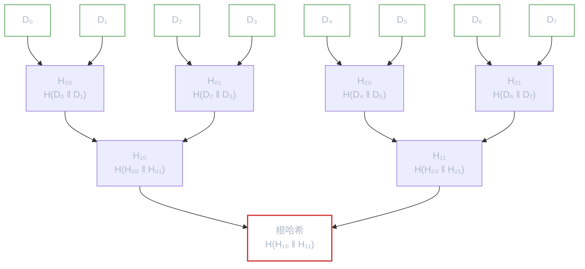
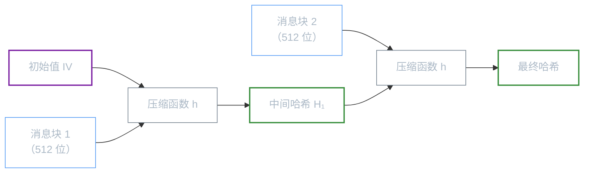
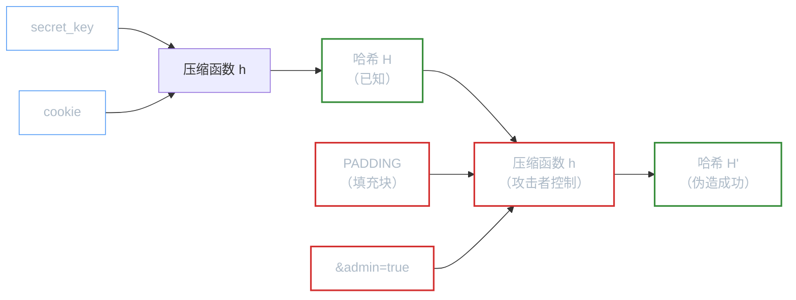
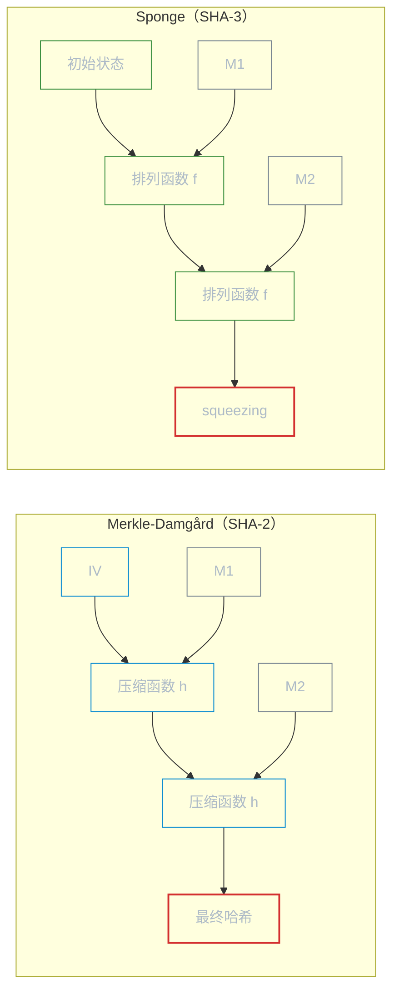

# 哈希与完整性

**本文你会学到**：

- 为什么加密能保护机密性，但无法保证数据"没被篡改"
- 消息摘要（Message Digest）如何像"指纹"一样唯一标识任意大小的数据
- MAC 和 HMAC 如何在验证完整性的同时认证发送者身份
- 密钥派生函数（KDF）如何从弱密码中生成高强度密钥
- Merkle 树如何高效验证海量数据中某一片段的完整性
- SHA-2 的 Merkle-Damgård 构造和 SHA-3 的 Sponge 构造在内部有何本质区别
- 扩展输出函数（XOF）如何产生任意长度的哈希值

## 为什么需要哈希和消息认证？

你已经知道，对称加密解决了**机密性**问题——即使攻击者截获密文，也看不懂里面的内容。但机密性只是安全的一半。

想象一个场景：你收到一封加密邮件，解密后内容是"请转账 10000 元到账户 A"。你如何确认这封邮件在传输过程中没有被篡改？攻击者虽然看不懂密文，但可以翻转某些比特来改变解密后的明文——在 GCM 模式下这会被认证标签检测到，但如果你用的是 CBC 或 CTR 模式，篡改可能会悄悄成功。

更严重的问题是**中间人替换**：攻击者可以把整个密文替换成另一段合法的密文，接收方完全无法察觉。

这就引出了两个关键需求：

- **完整性（integrity）**：确保数据没有被篡改
- **认证（authentication）**：确保数据确实来自声称的发送者

哈希和消息认证码（MAC）就是解决这两个问题的核心工具。

💡 把哈希想象成文件的"指纹"——无论文件是 1 字节还是 1GB，指纹都是固定长度，且文件内容只要有一个比特不同，指纹就会完全不同。而 MAC 就像是"带签名的指纹"，只有持有密钥的人才能生成。

## 消息摘要（Message Digest）

### 什么是消息摘要？

当你需要检查一个文件是否被修改过，你会怎么做？最直观的方式是比较文件的每一字节。但如果是几个 GB 的文件，每次都逐字节比较显然不现实。

更聪明的方式是：对文件计算一个固定长度的"校验值"，然后只比较这个校验值。CRC（Cyclic Redundancy Check，循环冗余校验）就是这样做的。但 CRC 有一个问题——它不是为了安全性设计的，攻击者可以在保持 CRC 不变的情况下精心修改文件内容。

**消息摘要（Message Digest）**就是密码学版本的"校验值"。它是一个**单向函数**：

- **正向计算容易**：无论输入多大，都能快速算出固定长度的输出
- **逆向推导不可能**：从摘要值无法还原出原始数据（即使摘要只有 256 位，也不可能"逆运算"）
- **雪崩效应（avalanche effect）**：输入变化 1 bit → 输出约 50% 的比特发生变化

在 Java 中，消息摘要由 `java.security.MessageDigest` 类提供：

``` java title="计算 SHA-256 消息摘要"
MessageDigest digest = MessageDigest.getInstance("SHA-256", "BC");

// 方式一：分步更新（适合处理大文件或流式数据）
digest.update("Hello World!".getBytes());
byte[] hash = digest.digest();

// 方式二：一次性计算
byte[] hash2 = digest.digest("Hello World!".getBytes());

// 使用 MessageDigest.isEqual() 做常量时间比较（防时序攻击）
boolean match = MessageDigest.isEqual(hash, hash2); // true
```

💡 `MessageDigest.isEqual()` 是**常量时间比较**——无论两个数组在第几个字节不同，比较时间都一样。这防止了攻击者通过测量比较时间来逐字节猜测哈希值。

### 碰撞抵抗：哈希函数的核心安全属性

前面提到哈希像"指纹"——不同文件产生不同指纹。但这不够精确。密码学中，哈希函数的安全性由三个递进的属性定义：

- **原像抵抗（Preimage Resistance）**：给定哈希值 $h$，找不到 $m$ 使得 $H(m) = h$
- **第二原像抵抗（Second Preimage Resistance）**：给定 $m_1$ 和 $H(m_1)$，找不到 $m_2 \neq m_1$ 使得 $H(m_2) = H(m_1)$
- **碰撞抵抗（Collision Resistance）**：找不到任意 $m_0 \neq m_1$ 使得 $H(m_0) = H(m_1)$

碰撞抵抗是**参数级**的安全属性，不是密钥级的。一旦哈希函数的碰撞被找到（如 MD5、SHA-1），整个系统的安全性都会受影响——不是某个用户的密钥泄露，而是算法本身的碰撞抵抗被打破。

⚠️ 碰撞抵抗是三个属性中最强的，也是最难保证的。接下来会看到，生日攻击使得碰撞抵抗的安全性只有原像抵抗的一半。

### 常用哈希算法对比

不是所有哈希算法都一样安全。算法的安全性主要取决于两个维度：**抗碰撞性**（collision resistance，很难找到两个不同的输入产生相同的输出）和**抗原像攻击**（preimage resistance，无法从输出反推输入）。

| 算法 | 输出长度 | 安全强度 | 状态 | 适用场景 |
|------|---------|---------|------|---------|
| MD5 | 128 bit | 已破解 | :material-alert-octagon:{ .text-red } 不安全 | 非安全场景的校验和 |
| SHA-1 | 160 bit | 已破解 | :material-alert-octagon:{ .text-red } 已弃用 | 旧系统兼容 |
| SHA-256 | 256 bit | 128 bit | :material-check-circle:{ .text-green } 推荐 | 通用哈希、数字签名 |
| SHA-512 | 512 bit | 256 bit | :material-check-circle:{ .text-green } 推荐 | 需要更高安全强度 |
| SHA3-256 | 256 bit | 128 bit | :material-check-circle:{ .text-green } 推荐 | 新一代标准（Keccak） |
| SHA3-512 | 512 bit | 256 bit | :material-check-circle:{ .text-green } 推荐 | 需要更高安全强度 |

⚠️ **MD5 和 SHA-1 已被证明存在碰撞攻击**。2017 年 Google 证明了两个不同的 PDF 可以产生相同的 SHA-1 值（SHAttered 攻击）。新系统中禁止使用这两个算法。

### 生日攻击：为什么哈希输出至少 256 位？

你可能觉得暴力破解哈希的难度是 $O(N)$（遍历所有可能的输入）。但实际上，找碰撞的难度远低于这个——只需要 $O(\sqrt{N})$。

这就是著名的**生日攻击**，原理与"房间里 23 人中有两人生日相同的概率约 50%"完全一样。核心是：$k$ 个元素之间的配对数是 $\binom{k}{2} = k(k-1)/2$，当 $k \approx \sqrt{N}$ 时配对数与 $N$ 同量级，碰撞变得极可能。

| 安全属性 | 暴力攻击复杂度 | 128 位输出 | 256 位输出 |
|---------|-------------|-----------|-----------|
| 原像抵抗 | $O(N)$ | $2^{128}$ | $2^{256}$ |
| 碰撞抵抗 | $O(\sqrt{N})$ | $2^{64}$ | $2^{128}$ |

碰撞抵抗的安全性只有原像抵抗的一半（位数减半）。这就是为什么：

- **SHA-1（160 位）**的碰撞只需约 $2^{80}$ 次运算——2017 年被实际攻破
- **SHA-256（256 位）**的碰撞需要约 $2^{128}$ 次运算——在当前和可预见的计算能力下安全
- 如果要抵抗 $2^{80}$ 次运算的碰撞，哈希输出至少需要 160 位；如果要抵抗 $2^{128}$ 次，至少需要 256 位

💡 这就是为什么 SHA-256 是当前推荐的最低标准——256 位输出提供 128 位碰撞安全强度。

### SHA-3：新一代哈希标准

SHA-3（Keccak）是 NIST 在 2012 年通过公开竞赛选出的新一代哈希算法，2015 年正式发布。它与 SHA-2 系列的核心区别在于**内部结构**：SHA-2 基于 Merkle-Damgard 构造，而 SHA-3 基于海绵（sponge）构造。

``` java title="SHA-3 使用方式与 SHA-2 完全一致"
// SHA3-256 与 SHA-256 输出长度相同，但内部算法完全不同
MessageDigest sha3 = MessageDigest.getInstance("SHA3-256", "BC");
byte[] hash = sha3.digest("Hello World!".getBytes());
// 输出: 1af17f1ecca7bad04131e7c9e1f4b5a5e5e5d1a9c9e9e7e7d5c5b5a5e5e5e5e5
```

🎯 **实践建议**：新项目优先使用 SHA-256 或 SHA3-256。两者都安全，SHA-3 在理论上对未来的密码分析攻击有更强的抵抗力（因为结构不同）。

### 哈希函数的真实世界应用

哈希函数单独使用的场景其实很有限——真正让它发光发热的，是它在各种协议和系统中扮演的"信任锚"角色。《Real-World Cryptography》第 2 章梳理了四个典型场景，值得每个工程师了解。

#### Commitments（承诺方案）

想象一个场景：你预测某只股票下个月会涨到 50 美元，但现在不能公开说（有合规原因）。你想在事后证明"我早就知道了"。

你可以这样做：把预测句子 `"Stock X 将在下个月涨到 50 美元"` 哈希，把哈希值公开给朋友。一个月后，把原句揭露出来——朋友对原句重新哈希，与当初的哈希值比对，就能确认你没有"事后诸葛亮"。

这就是**承诺方案（Commitment Scheme）**，它依赖哈希函数的两个核心属性：

- **Hiding（隐藏性）**：承诺不泄露被承诺的值——哈希不可逆
- **Binding（绑定性）**：承诺只能绑定一个值——哈希的碰撞抵抗使你无法"换一个句子，产生同样的哈希"

> ⚠️ 注意：如果输入空间太小（比如只有"涨"或"跌"两个选项），哈希的隐藏性就失效了——攻击者可以逐一枚举所有可能输入，找到匹配的哈希。**承诺方案的 Hiding 性质要求输入必须足够随机**（通常需要附上随机盐值）。

承诺方案是零知识证明（ZKP）的基础构件之一——详见文末「承诺方案与零知识的入口」小节。

#### Subresource Integrity（子资源完整性）

现代网页经常从 CDN 加载外部 JavaScript 文件。但如果 CDN 被攻击，它推送的 JS 文件被植入恶意代码怎么办？

HTML 的 **SRI（Subresource Integrity）** 特性就是解决这个问题的：

``` html title="SRI 防止 CDN 篡改 JS 文件"
<script
  src="https://code.jquery.com/jquery-3.7.1.min.js"
  integrity="sha256-/JqT3SQfawRcv/BIHPThkBvs0OEvtFFmqPF/lYI/Cxo="
  crossorigin="anonymous">
</script>
```

浏览器在执行脚本前，会用 `SHA-256` 对下载的文件重新计算哈希，与 `integrity` 属性中的值比对。只要一个字节不同，就会拒绝执行。这里用到的是哈希函数的**第二原像抵抗**属性——CDN 无法在不改变哈希值的情况下偷偷修改文件内容。

#### BitTorrent / IPFS：内容寻址

**BitTorrent** 把大文件切成若干块（chunk），每块独立计算哈希，所有块的哈希集合就是文件的"信任标识"：

```
magnet:?xt=urn:btih:b7b0fbab74a85d4ac170662c645982a862826455
```

这个 magnet link 中包含的就是文件元数据和所有块哈希的聚合摘要。下载某一块时，立刻对它单独验证——不用等全部下载完才能发现损坏，任意一块来自哪个 peer 都无所谓，因为哈希才是信任来源。

**IPFS（星际文件系统）**更进一步：用内容的哈希值作为文件的唯一地址（CID，Content Identifier）。要获取一个文件，直接请求它的哈希地址——谁能给出哈希正确的数据，谁就能回答请求，因为**数据本身就是地址**。这叫做**内容寻址（Content-Addressable Storage）**。

💡 BitTorrent 和 IPFS 的块验证都依赖 Merkle 树——详见「什么是 Merkle 树？」中的介绍，也参考「`「加密货币与 BFT 共识」`」中 Merkle 树在区块链的具体应用。

#### Tor 隐藏服务地址

Tor 浏览器可以创建"隐藏服务"（hidden service），其 `.onion` 域名本质上就是服务器公钥的哈希摘要：

```
http://3g2upl4pq6kufc4m.onion  ← DuckDuckGo 的 Tor 地址（v2 格式，32 位 base32）
```

这种设计的好处是：**域名即公钥摘要，你在连接时天然知道自己连接的是哪个公钥**——不需要 CA 来颁发证书，也不需要 DNS。连接的合法性由哈希函数的第二原像抵抗保证：没有人能伪造一个公钥来产生相同的 `.onion` 地址，更无法劫持流量。

## MAC 与 HMAC

### 什么是 MAC？

消息摘要有一个致命缺陷：任何人都可以计算它。攻击者可以把消息和摘要一起替换成新的消息和新的摘要，接收方完全无法区分。

这就好比有人在文件上盖了指纹——但指纹是不需要密钥的，谁都可以盖。你需要的是一个**只有持有密钥的人才能生成**的校验值。

**MAC（Message Authentication Code，消息认证码）**就是带密钥的哈希。它在哈希计算中引入了一个只有通信双方知道的共享密钥，使得：

- **没有密钥的人**：无法为篡改后的消息生成合法的 MAC
- **持有密钥的人**：可以验证消息的完整性和来源

### MAC 的安全定义：EUF-CMA

MAC 安全性的精确定义叫做 **EUF-CMA**（Existential Unforgeability under Chosen Message Attack，选择消息攻击下的存在性不可伪造）。

攻击游戏分三步：

1. 挑战者选择随机密钥 $k$
2. 攻击者可以请求任意消息的 tag（chosen message attack）
3. 攻击者输出一个新消息和对应的 tag——如果验证通过则攻击者获胜

安全优势 $\text{MACadv}[A, I]$ 定义为攻击者获胜的概率。当所有高效攻击者的优势都可忽略时，MAC 系统是安全的。

⚠️ 注意 EUF-CMA 要求攻击者输出的必须是**新消息**——不能是之前已经查询过的消息的重新提交。这意味着即使攻击者获得了大量合法的 (消息, tag) 对，也无法为任何新消息生成合法 tag。

``` java title="AES-CMAC：基于 AES 分组密码的 MAC"
javax.crypto.Mac mac = javax.crypto.Mac.getInstance("AESCMAC", "BC");

// 使用 128 位 AES 密钥
SecretKey key = new SecretKeySpec(
    Hex.decode("000102030405060708090a0b0c0d0e0f1011121314151617"), "AES");

mac.init(key);
byte[] macValue = mac.doFinal("Hello World!".getBytes());
// AES-CMAC 输出 16 字节（与 AES 块大小一致）
```

MAC 的使用模式与 `Cipher` 类似：`init()` 初始化密钥，`update()` 喂入数据，`doFinal()` 输出最终结果。

### HMAC

**HMAC（Hash-based MAC，基于哈希的消息认证码）**是最广泛使用的 MAC 构造方式。它用哈希函数作为基础，通过一种巧妙的"内层哈希 + 外层哈希"结构来避免哈希函数的长度扩展攻击。

HMAC 的标准定义在 RFC 2104 中，公式为：

$$
\text{HMAC}(K, m) = H\big((K' \oplus \text{opad}) \,\|\, H((K' \oplus \text{ipad}) \,\|\, m)\big)
$$

其中 `ipad` 是内部填充（重复 `0x36`），`opad` 是外部填充（重复 `0x5c`），`K'` 是处理后的密钥。

``` java title="HMAC-SHA256：最常用的消息认证方式"
javax.crypto.Mac mac = javax.crypto.Mac.getInstance("HmacSHA256", "BC");

// HMAC-SHA256 需要 256 位密钥
SecretKey key = new SecretKeySpec(
    Hex.decode("2ccd85dfc8d18cb5d84fef4b198554699fece6e8692c9147b0da983f5b7bd413"),
    "HmacSHA256");

mac.init(key);
byte[] hmacValue = mac.doFinal("Hello World!".getBytes());
// HMAC-SHA256 输出 32 字节（与 SHA-256 一致）
```

💡 注意 HMAC 的输出长度与底层哈希函数一致：HMAC-SHA256 输出 32 字节，HMAC-SHA512 输出 64 字节。

### MAC 验证的常时间陷阱

实现了正确的 HMAC 算法，还不够——**验证环节才是最容易出漏洞的地方**。

#### 普通比较函数的问题

当验证方收到一个 `(message, tag)` 对，需要重新计算 `expectedTag = HMAC(key, message)`，然后与收到的 `receivedTag` 比较。大多数开发者的第一反应是：

``` java title="❌ 危险：Arrays.equals 会泄露字节匹配数"
// 不要这样做！Arrays.equals 在第一个不匹配字节处立即返回 false
boolean valid = Arrays.equals(expectedTag, receivedTag);
```

`Arrays.equals` 的实现逻辑是：逐字节对比，一旦发现不同，**立即返回 false**。这意味着：

- 前 1 个字节就不同 → 比较时间极短
- 前 31 个字节相同，第 32 个字节不同 → 比较时间极长

攻击者可以通过测量服务端的**响应时间**，推断出发送的 tag 有多少个字节是正确的——就像猜密码时"听声音判断保险箱转盘转对了几位"一样。

#### 时序攻击如何在网络上实施

你可能会问："网络延迟难道不会掩盖这种微秒级差异吗？"

答案是：通过对**大量样本取统计平均**，微秒级的差异完全可以被提取出来。攻击流程：

1. 固定 tag 的第 1 个字节为 `0x00`，发送大量请求，统计平均响应时间
2. 枚举第 1 个字节从 `0x00` 到 `0xFF`，哪个字节对应的平均响应时间最长，就是正确字节
3. 固定第 1 个字节，继续枚举第 2 个字节……
4. 对 32 字节的 `HMAC-SHA256`，原本需要 $2^{256}$ 次暴力破解——时序攻击把它降低到 $256 \times 32 = 8192$ 次尝试

《Real-World Cryptography》第 3 章提到，作者在安全审计中**多次发现此漏洞**——一个算法上完全正确的 HMAC 实现，可能因为验证时用了 `equals()` 而被攻破。

#### Java 中的正确做法

``` java title="✅ 正确：MessageDigest.isEqual 是常时间比较"
// MessageDigest.isEqual 自 Java 6 起提供常时间字节数组比较
// 无论两个数组在哪一位第一次不同，都会比较完全部字节，不会提前返回
boolean valid = MessageDigest.isEqual(expectedTag, receivedTag);
```

`MessageDigest.isEqual` 的实现保证：**无论两个数组在第几个字节不同，比较时间恒定**。其内部等价于 Go 标准库的常时间比较：

``` java title="常时间比较的核心原理（伪代码）"
// 不用 if 分支，只用位运算积累差异
int diff = 0;
for (int i = 0; i < x.length; i++) {
    diff |= x[i] ^ y[i];  // 任何一个字节不同，diff 就非零
}
return diff == 0;          // 始终比较完全部字节
```

💡 Bouncy Castle 的 `mac.verify(tag)` 方法内部也使用了常时间比较。但如果你手动调用 `doFinal()` 再进行比较，务必改用 `MessageDigest.isEqual`，而不是 `Arrays.equals` 或 `String.equals`。

### Hash-then-MAC：HMAC 安全性的理论支撑

HMAC 为什么用"内层哈希 + 外层哈希"这种看似复杂的设计？它的理论基础是 **Hash-then-MAC** 范式：

$$\text{S}'(k, m) = \text{S}(k, H(m))$$

先用哈希函数 $H$ 将任意长消息压缩为固定长度的摘要，再用 MAC 算法 $\text{S}$ 对摘要做认证。

Hash-then-MAC 的安全性归约非常清晰：

- 如果 $H$ 是碰撞安全的（找不到 $m_0 \neq m_1$ 使得 $H(m_0) = H(m_1)$）
- 且 $\text{S}$ 是 EUF-CMA 安全的 MAC
- 则 $\text{S}'$ 也是 EUF-CMA 安全的

**碰撞抗性是必要条件**：如果攻击者找到了碰撞 $H(m_0) = H(m_1)$，就可以用 $m_1$ 的 tag 作为 $m_0$ 的合法 tag——MAC 被伪造了。

HMAC 的 ipad/opad 设计巧妙地解决了另一个问题——如果不做特殊处理，直接用 $H(k \| m)$ 作为 MAC，会面临**长度扩展攻击**（length extension attack）：已知 $H(m)$ 的值，攻击者可以在不重新计算的情况下推算出 $H(m \| \text{padding})$ 的值。

### MAC 与 HMAC 对比

| 特性 | AES-CMAC | HMAC |
|------|---------|------|
| 基础算法 | AES 分组密码 | 哈希函数 |
| 输出长度 | 128 bit（AES 块大小） | 取决于底层哈希（如 256 bit） |
| 是否可截断 | 可以，但碰撞概率增加 | 可以，但碰撞概率增加 |
| 典型场景 | 已有 AES 密钥时复用 | 通用消息认证（TLS、JWT 等） |
| 性能 | 需要硬件 AES-NI 加速 | 软件实现快，通用性好 |

🎯 **实践建议**：优先使用 HMAC。它在大多数场景下性能好、兼容性高，且被广泛标准化。AES-CMAC 适合你已经有 AES 密钥且不想额外管理哈希密钥的场景。

### MAC 在真实世界的角色

HMAC 不只是一个验证消息完整性的工具——在真实系统中，它承担着远比"防篡改"更多的职责。

#### Cookie 完整性：无状态会话的基石

Web 服务端有两种存储用户会话的方式：

- **有状态**：服务端保存 session，每次请求查数据库
- **无状态**：把用户数据直接放在 cookie 里，用 MAC 保护完整性

无状态 cookie 的格式：`username=bob&role=user` + `|` + `HMAC-SHA256(key, "username=bob&role=user")`

服务端收到 cookie 后，重新计算 HMAC，与 cookie 末尾的 tag 比对。如果一致，数据可信；否则，cookie 被篡改，请求拒绝——用户无法把 `role=user` 偷改成 `role=admin`，因为他没有服务端的 `key`。

💡 JWT（JSON Web Token）的签名机制本质上就是这个设计：`header.payload.<HMAC-SHA256 或 RSA 签名>`。见「`「Java 密码学架构」`」中 JWT 的具体实现。

#### 密钥派生：HKDF 内部的 HMAC

「`「随机数与密钥派生」`」中介绍的 `HKDF`（HMAC-based Key Derivation Function，RFC 5869）就是把 HMAC 当作 PRF（伪随机函数）来使用：

- **HKDF-Extract**：`PRK = HMAC(salt, IKM)` — 把原始密钥材料（IKM）"浓缩"成均匀的伪随机密钥
- **HKDF-Expand**：`OKM = HMAC(PRK, info || counter)` — 从 PRK 中"拉伸"出所需长度的密钥材料

HMAC 在这里被视为一个**固定输出长度的随机函数**——给定不同的 `counter`，产生相互独立的密钥流。TLS 1.3 的握手密钥派生、Signal 协议的棘轮算法内部都有这种模式。

#### 哈希表抗 DoS：SipHash

编程语言内置的哈希表（`HashMap`、`dict`、`object`）通常使用非密码学哈希函数来计算 key 的桶位置。这有一个隐患：攻击者如果能控制哈希表的 key，可以精心构造一批 key，使它们**全部哈希到同一个桶**，把哈希表退化成链表——查询复杂度从 $O(1)$ 变成 $O(n)$，实现 CPU 耗尽式的 DoS 攻击（哈希碰撞攻击）。

解决方案：用一个带随机密钥的 MAC 替代普通哈希函数。Rust、Python 3.3+、Ruby、Linux 内核都采用了 **SipHash**（一种针对短消息优化的轻量级 MAC）：

- 程序启动时生成随机密钥 $k$
- 哈希表计算 `SipHash(k, key)` 而不是 `hash(key)`
- 攻击者不知道 $k$，无法预测哪些 key 会发生碰撞

> 💡 这是 MAC 最"隐形"的用途——你每天用的 Python `dict` 底层就有它的身影。

## 密钥派生函数（KDF）

### 为什么需要 KDF？

假设你需要用 AES-256 加密一个文件，需要一个 256 位的随机密钥。但用户能记住的往往是 "my password" 这样的短密码——它的信息熵可能只有几十位，远不够 256 位。

更糟糕的是，用户密码通常来自一个小得多的字符集（小写字母 + 数字 ≈ 36 个字符），这使得暴力破解变得可行。攻击者可以预先计算一个"彩虹表"（rainbow table），把常见密码对应的密钥都算好存起来。

**密钥派生函数（Key Derivation Function，KDF）**就是解决这个问题的"拉伸机"——它把不均匀的弱密码反复揉捏，变成均匀的高强度密钥。揉捏的过程越复杂，攻击者的成本就越高。

KDF 的核心要素：

- **盐值（salt）**：随机数，确保相同密码 + 不同盐值 → 不同密钥，让彩虹表失效
- **迭代次数（iteration count）**：增加计算成本，让暴力破解变慢
- **底层 PRF**：通常是 HMAC 或哈希函数，负责"揉捏"

### PBKDF2

PBKDF2（Password-Based Key Derivation Function 2）是当前最广泛使用的密码派生函数，定义在 PKCS #5 和 NIST SP 800-132 中。它的原理非常直接：把 HMAC 重复执行 N 次（迭代），每次的输出作为下一次的输入。

``` java title="PBKDF2 从密码派生 256 位密钥"
char[] password = "my secret password".toCharArray();
byte[] salt = new byte[16];
new SecureRandom().nextBytes(salt); // 随机盐值

PBEKeySpec spec = new PBEKeySpec(password, salt, 10000, 256);
SecretKeyFactory factory = SecretKeyFactory.getInstance(
    "PBKDF2WithHmacSHA256", "BC");
byte[] derivedKey = factory.generateSecret(spec).getEncoded();
// 派生出 32 字节（256 位）密钥
```

⚠️ **迭代次数必须足够高**。2000 年推荐 1024 次，现在推荐至少 600,000 次（OWASP 2023 建议）。目标是让单次派生在正常服务器上花费 200ms 以上——既不影响用户体验，又让攻击者的暴力破解成本高到不可接受。

### SCRYPT

PBKDF2 的缺点是只消耗 CPU——攻击者用 GPU 或 ASIC（专用集成电路）可以并行计算海量候选密码，速度远超普通服务器。

**SCRYPT**（RFC 7914）引入了一个关键设计：**内存硬（memory-hard）**。它除了迭代计算外，还需要在内存中维护一个巨大的中间数据数组。攻击者的 GPU/ASIC 虽然计算快，但**内存访问慢且昂贵**，这大大拉平了攻击者与防守方之间的硬件差距。

``` java title="SCRYPT 密钥派生（需要 Bouncy Castle）"
char[] password = "my secret password".toCharArray();
byte[] salt = new byte[16];
new SecureRandom().nextBytes(salt);

SecretKeyFactory factory = SecretKeyFactory.getInstance("SCRYPT", "BC");
ScryptKeySpec spec = new ScryptKeySpec(
    password, salt,
    65536,  // N：CPU/内存成本参数（必须是 2 的幂）
    8,      // r：块大小参数
    1,      // p：并行因子
    256     // 输出密钥长度（bits）
);
byte[] derivedKey = factory.generateSecret(spec).getEncoded();
```

SCRYPT 的三个参数直接影响计算成本：

| 参数 | 含义 | 推荐值 | 影响 |
|------|------|--------|------|
| N | CPU/内存成本 | 2^16 ~ 2^20 | N 越大，所需内存 ≈ 128 × r × N 字节 |
| r | 块大小 | 8 | 每个 SMix 调用使用 128 × r 字节 |
| p | 并行因子 | 1 | 可以并行运行 p 个 SMix，增加 CPU 占用 |

💡 SCRYPT 的内存需求公式为 `128 × N × r` 字节。当 N=65536、r=8 时，需要约 64MB 内存——这对 GPU/ASIC 来说是非常昂贵的。

### KDF 对比

| KDF | 抗 GPU/ASIC | 参数 | 推荐场景 |
|-----|------------|------|---------|
| PBKDF2 | 弱（仅 CPU） | 迭代次数 | 兼容性优先（FIPS 认证环境） |
| SCRYPT | 强（内存硬） | N, r, p | 需要抗硬件暴力破解 |
| Argon2 | 最强（内存硬 + 抗侧信道） | 时间、内存、并行度 | 新项目首选（密码哈希竞赛冠军） |

> PBKDF2 和 SCRYPT 的更深入用法（包括密码存储场景）将在「基于密码的密钥生成」笔记中展开。

### X9.63 KDF 与 Concatenation KDF

上面介绍的 PBKDF2 和 SCRYPT 是**基于密码**的 KDF——把用户密码转换为密钥。但在密钥协商（如 ECDH）场景中，需要的是另一种 KDF：把协商出的共享秘密转换为多个不同用途的密钥。

**X9.63 KDF** 和 **NIST Concatenation KDF**（SP 800-56C）就是用于这种场景的 KDF。它们的输入不是密码，而是密钥协商协议产生的共享秘密 Z，输出是一组密钥材料：

- **X9.63 KDF**：`K_i = H(Z ‖ counter ‖ SharedInfo)`
- **Concatenation KDF**：`K_i = H(counter ‖ Z ‖ FixedInfo)`

两者的唯一区别是 counter 和 Z 的拼接顺序不同。

这些 KDF 通常不直接使用——它们被嵌入在 TLS、IPSec 等协议内部使用。当你使用这些协议时，KDF 在底层自动完成密钥派生。

## Merkle 树

### 什么是 Merkle 树？

假设你有一个包含 100 万条记录的数据库，需要验证其中某一条记录是否被篡改了。如果把所有记录的哈希值都重新计算一遍，代价很高。

**Merkle 树**（由 Ralph Merkle 于 1979 年提出）用一种巧妙的方式解决了这个问题：它把所有数据组织成一棵二叉哈希树，使得验证任意一条数据的完整性只需要 $O(\log n)$ 次哈希运算，而不是 $O(n)$。



**Merkle 树的核心价值**：

- **根哈希代表全部数据**：只要根哈希可信，就能验证任何一条数据
- **审计路径（audit path）**：要验证 D₂ 没被篡改，只需要提供 H₀₀（兄弟节点）、H₁₁ 和根哈希——3 个值就够了，不需要其他 7 条数据
- **增量更新**：新增或修改一条数据时，只需重新计算从叶子到根的路径上的哈希，不影响其他分支

### Merkle 树的应用

Merkle 树最著名的应用是 **Bitcoin**：区块链中每个区块都包含一个 Merkle 根，代表该区块中所有交易。轻节点（SPV）只需下载区块头（80 字节）和交易对应的审计路径，就能验证某笔交易是否被包含在区块中，而无需下载整个区块（可能几 MB）。

此外，Merkle 树在证书透明度（Certificate Transparency，RFC 6962）、Git 版本控制、分布式数据库等领域也有广泛应用。

⚠️ **实现注意**：简单地拼接两个哈希值再计算新的哈希，存在**二次原像攻击（second preimage attack）**的风险。RFC 6962 的解决方案是给叶子节点哈希和分支节点哈希添加不同的前缀字节——叶子用 `0x00`，分支用 `0x01`，这样攻击者就无法利用一个分支节点的哈希值伪造叶子节点了。

## 哈希函数的内部构造

### Merkle-Damgård：SHA-2 系列的底层结构

SHA-1 和 SHA-256 都使用**迭代哈希（Iterated Hashing）**的方式来处理任意长度的输入。具体来说，它们基于 **Merkle-Damgård 范式**——用一个短消息的压缩函数（compression function）来构建长消息的哈希函数。

Merkle-Damgård 的工作方式：



以 SHA-256 为例：压缩函数 $h$ 接受 256 位的中间哈希和 512 位的消息块，输出新的 256 位中间哈希。消息被切成 512 位（64 字节）的块逐个送入压缩函数。最后一个块包含消息长度的编码——这个长度编码是安全必需的，它防止了一种叫做 **Joux 多碰撞攻击**的威胁。

Joux 攻击利用了 Merkle-Damgård 结构的链式依赖：找到 $n$ 个碰撞只需要 $O(n \cdot 2^{n/2})$ 次运算，而不是期望的 $O(2^n)$。这意味着 Merkle-Damgård 结构在**多碰撞**场景下比预期更脆弱。

### SHA-2 的长度扩展攻击

Merkle-Damgård 构造的"链式状态即输出"设计，引入了一个危险的固有缺陷——**长度扩展攻击（Length Extension Attack）**。

#### 攻击原理

假设某服务端用 `SHA-256(secret_key || cookie)` 来保护 cookie 的完整性，客户端拿到了哈希值 `H`，但不知道 `secret_key`。攻击者能做到什么？

关键洞察：`H` 本质上是压缩函数在处理完 `secret_key || cookie` 之后的**最终中间状态**。攻击者知道 `H`，就相当于获得了"链式计算的最后一环"——可以从这里继续调用压缩函数，向后拼接任意内容：



结果：攻击者无需知道 `secret_key`，就能生成 `H' = SHA-256(secret_key || cookie || PADDING || "&admin=true")` 的合法哈希值——服务端验证时会接受它！唯一的前提是知道 `H` 和消息的长度（长度决定 PADDING 内容）。

#### 受影响的算法与不受影响的算法

| 算法 | 是否受影响 | 原因 |
|------|-----------|------|
| `SHA-256` | ✅ 受影响 | Merkle-Damgård 构造，内部状态即输出 |
| `SHA-512` | ✅ 受影响 | 同上 |
| `SHA-512/256` | ❌ 不受影响 | 内部状态 512 位，但输出截断为 256 位——攻击者看不到完整中间状态 |
| `SHA3-256` | ❌ 不受影响 | Sponge 构造，容量区（capacity）永远不暴露给攻击者 |
| `HMAC-SHA256` | ❌ 不受影响 | 外层哈希包裹了内部状态，攻击者无法从输出还原内部链式状态 |

这也是 HMAC 存在的核心原因之一——它用双重哈希彻底斩断了内部状态与输出之间的直接关联，详见「Hash-then-MAC：HMAC 安全性的理论支撑」。

#### 真实案例：Flickr API 签名漏洞

2009 年，安全研究员发现 Flickr 的 API 使用了 `MD5(secret || params)` 的方式来签名请求。攻击者利用长度扩展攻击，可以在不知道 `secret` 的情况下，向任意合法请求末尾追加参数，并生成合法的签名——相当于伪造了已签名的请求。类似的漏洞随后在多个使用"密钥前缀 + 哈希"的 Web API 中陆续发现。

> ⚠️ 教训：**永远不要用 `SHA-2(key || message)` 作为 MAC**。请改用 `HMAC`——它在协议设计上就规避了这个攻击。更多失败案例见拟新建的「`「密码学失败案例集」`」。

### Sponge 构造：SHA-3 的新思路

SHA-3（Keccak）采用了完全不同的 **Sponge（海绵）构造**，它不依赖链式压缩，因此不受 Joux 多碰撞攻击影响。

Sponge 构造将内部状态分为两部分：$r$ 位的"吸收区"（rate）和 $c$ 位的"容量区"（capacity）。输入数据被 XOR 进吸收区，经过排列函数（permutation）混淆后，容量区的状态保持不变——这部分就是安全性的来源。



**Davies-Meyer 压缩函数**（SHA-2 使用的具体压缩函数）将分组密码的输出 XOR 回中间哈希：$H_i = E(m_i, H_{i-1}) \oplus H_{i-1}$。这种"前向反馈"的设计使得压缩函数本身也是抗碰撞的——即使攻击者能找到压缩函数的碰撞，也无法直接构造消息碰撞。

💡 SHA-2（Merkle-Damgård）和 SHA-3（Sponge）内部结构完全不同，但对外 API 完全一致——`MessageDigest.getInstance("SHA-256")` 和 `MessageDigest.getInstance("SHA3-256")` 用法相同。选择哪个取决于你的安全需求：SHA-3 在理论上对未来的密码分析攻击有更高的安全边际。

## 扩展输出函数（XOF）

传统的哈希算法（SHA-256、SHA-3）输出固定长度的值。但有些场景需要**可变长度的哈希输出**——比如从同一个种子生成一个 256 位的密钥和一个 512 位的密钥。

**扩展输出函数（Extendable Output Functions，XOF）** 就是为此设计的。SHA-3 标准中定义了两个 XOF：

- **SHAKE128**：最小输出 256 bit，最大安全强度 128 bit
- **SHAKE256**：最小输出 512 bit，最大安全强度 256 bit

``` java title="SHAKE128 输出可变长度的哈希值"
// SHAKE128 可以输出任意长度的哈希值
MessageDigest shake = MessageDigest.getInstance("SHAKE128", "BC");
shake.update("Hello World!".getBytes());

// 输出 32 字节（256 bit）
byte[] hash32 = new byte[32];
shake.digest(hash32, 0, 32);

// 重新计算，输出 64 字节（512 bit）
shake.reset();
shake.update("Hello World!".getBytes());
byte[] hash64 = new byte[64];
shake.digest(hash64, 0, 64);
```

💡 在 Bouncy Castle 的低层 API 中，XOF 实现了 `org.bouncycastle.crypto.Xof` 接口。它的 `doFinal()` 方法可以指定输出长度，`doOutput()` 方法甚至可以持续输出数据，直到手动调用 `doFinal()` 停止——这就是"可扩展输出"的含义。

### cSHAKE 与 KMAC

NIST 在 SP 800-185 中基于 SHAKE 定义了几个更高级的变体：

- **cSHAKE**：可定制的 SHAKE，支持函数名字符串 N 和自定义字符串 S。当 N 和 S 都为空时，等价于 SHAKE
- **KMAC**：基于 cSHAKE 的 MAC 函数（N = "KMAC"），支持可变长度输出
- **TupleHash**：基于 cSHAKE 的哈希函数，输入的分段方式会影响输出——`["abc", "def"]` 与 `["abcdef"]` 的哈希值不同
- **ParallelHash**：基于 cSHAKE 的并行哈希函数，设计为多线程执行

``` java title="KMAC256：可变长度的 MAC"
javax.crypto.Mac mac = javax.crypto.Mac.getInstance("KMAC256", "BC");
SecretKey key = new SecretKeySpec("secret key".getBytes(), "KMAC256");
mac.init(key);
byte[] macValue = mac.doFinal("Hello World!".getBytes());
// KMAC256 输出 64 字节（默认），可以截断为任意长度
```

🎯 SHAKE 和 KMAC 在现代密码学协议中越来越常见——例如后量子密码方案中经常用 SHAKE 来派生密钥材料。

## 承诺方案与零知识的入口

在「哈希函数的真实世界应用」中，我们已经简要介绍了承诺方案。这里深入展开它的两个核心属性，并引出零知识证明这一前沿方向。

### Hiding 与 Binding：承诺的两个保证

承诺方案可以类比成一个**密封信封**：

- **Hiding（隐藏性）**：信封被密封时，没人能看到里面的内容——承诺不泄露被承诺的值
- **Binding（绑定性）**：信封一旦密封，里面的内容就固定了——你无法事后"偷偷换"成别的值

用哈希函数实现承诺方案：

1. **Commit**：发布 `c = H(v || r)`，其中 `v` 是要承诺的值，`r` 是随机盐值（必须！防止枚举）
2. **Reveal**：公开 `(v, r)`，验证者重新计算 `H(v || r)` 与 `c` 是否一致

| 属性 | 哈希函数提供 | 依赖的安全属性 |
|------|------------|--------------|
| Hiding | ✅ | 原像抵抗（无法从 `c` 反推 `v`）+ 随机盐（防枚举） |
| Binding | ✅ | 碰撞抵抗（无法找到 `v'` 使 `H(v' ∥ r') = c`） |

> ⚠️ 如果不加随机盐 `r`，Hiding 就失效了——`H("是")` 和 `H("否")` 只有两种结果，任何人都能枚举出来。

### 零知识证明的入口

承诺方案是**零知识证明（Zero-Knowledge Proof，ZKP）** 的基础构件之一。ZKP 让你能向别人证明"我知道某个秘密"，而**不泄露秘密本身**。

一个直观例子：在区块链隐私交易中，发送方需要证明"我有足够的余额转账"，但不想让全网知道具体余额。ZKP 可以生成一个证明，让验证者相信"转账合法"，而不暴露任何余额数字。

ZKP 的三个核心属性：

- **完备性（Completeness）**：诚实的证明者总能让诚实的验证者相信
- **可靠性（Soundness）**：不知道秘密的人无法伪造合法证明
- **零知识性（Zero-Knowledge）**：验证者除了"证明者知道秘密"这个事实外，学不到任何其他信息

哈希函数在 ZKP 中的角色：Merkle 树的根哈希 + 审计路径构成一种轻量级的"成员证明"（Merkle Proof）——「`「加密货币与 BFT 共识」`」中介绍的 SPV 轻节点验证就是 Merkle Proof 的实际应用。

更复杂的 ZKP 方案（zk-SNARKs、STARKs 等）将在拟新建的「`「下一代密码学」`」笔记中详细介绍。

---

> 本笔记的「哈希函数的真实世界应用」「SHA-2 长度扩展攻击」「MAC 验证的常时间陷阱」「MAC 在真实世界的角色」等小节内容参考自《Real-World Cryptography》(David Wong, Manning 2021) 第 2、3 章。

## 延伸阅读

- 「`「Java 密码学架构」`」：`MessageDigest` API 与 `MessageDigest.isEqual` 详细用法
- 「`「随机数与密钥派生」`」：HKDF 基于 HMAC 的具体实现与 TLS 密钥派生
- 「`「加密货币与 BFT 共识」`」：Merkle 树在区块链中的应用（SPV 轻节点、Merkle Proof）
- 「`「下一代密码学」`」（拟建）：ZKP、zk-SNARKs、STARKs 入门
- 「`「密码学失败案例集」`」（拟建）：Flickr API 签名漏洞、长度扩展攻击真实案例
